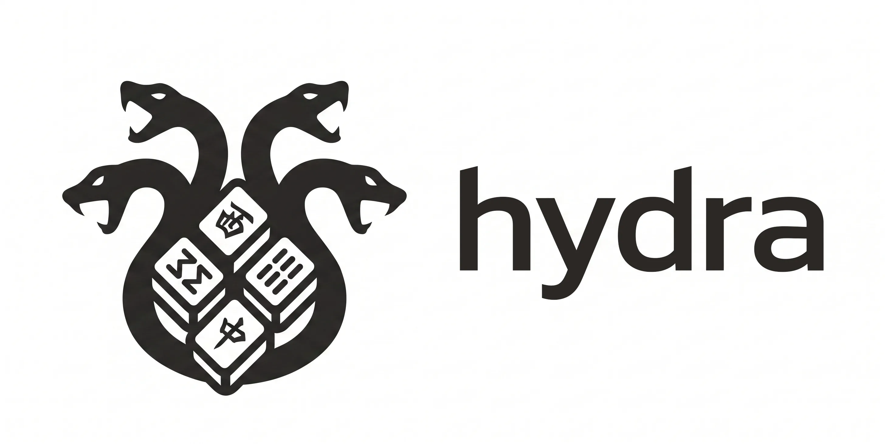
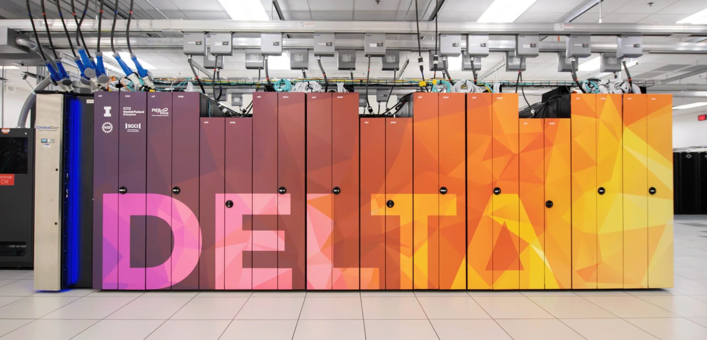

<p align="center">

</p>

<h1 align="center">Hydra v2</h1>

Tenhou 4-player hanchan Mahjong AI.
Goal: beat LuckyJ/Mortal by tenhou stable dan. See `AGENTS.md` for agent rules.

## Quick start

```sh
pixi install                        # only supported env (never uv/venv/bare pytest)
pixi run test-unit -q               # fast gate (~1 min)
pixi run lint                       # ruff
pixi run typecheck                   # pyrefly
pixi run runtime-probe               # runtime environment report
```

Full suite takes ~30 min (conformance soak). `HYDRA2_SKIP_GPU_SOAK=1` skips GPU soak on non-CUDA machines.

## Docs

- `AGENTS.md` — agent rules, commands, invariants
- `docs/PROJECT_PLAN.md` — direction and boundaries
- `docs/BUILD_EXECUTION_PLAN.md` — work order and done-gates
- `docs/IMPLEMENTATION_SPEC.md` — schemas, APIs, contracts
- `docs/ALGORITHM_EXPERIMENT_BLUEPRINT.md` — candidates and promotion rules
- `lean/` — formal specs sidecar (Lean 4 + mathlib, manual sync)

## Repo map

- `src/hydra2/` — contracts, engines (RiichiEnv/MahJax), search, belief, training, eval, artifacts
- `configs/` — rules, contracts, model specs, attestations
- `tools/mjai-dataset-packager/` — restart-safe Rust MJAI packager
- `tests/` — unit, contracts, search, integration, conformance

## Compute support

<p align="center">

</p>

Hydra v2 remains sponsored with compute support from Delta advanced computing and data resources, supported by the National Science Foundation (award OAC 2005572) and the State of Illinois. Delta is a joint effort of the University of Illinois Urbana-Champaign and its National Center for Supercomputing Applications.
