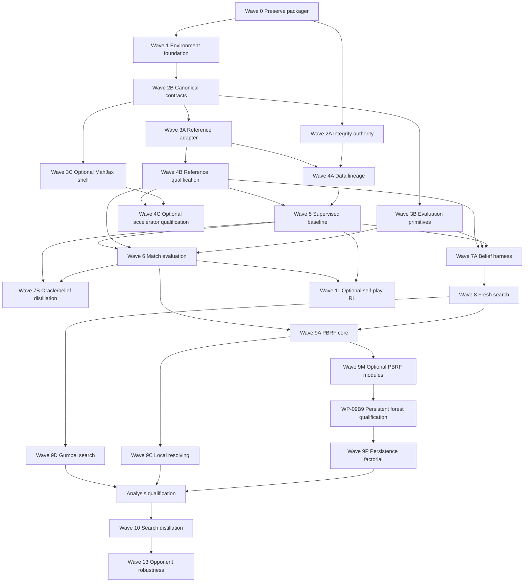

# Hydra2 Build Execution Plan

**Status:** Normative execution backlog.  
**Direction:** [PROJECT_PLAN.md](./PROJECT_PLAN.md)  
**Algorithms:** [ALGORITHM_EXPERIMENT_BLUEPRINT.md](./ALGORITHM_EXPERIMENT_BLUEPRINT.md)  
**Implementation authority:** [IMPLEMENTATION_SPEC.md](./IMPLEMENTATION_SPEC.md)

<system-conventions>
RFC 2119 applies to MUST, REQUIRED, SHOULD, RECOMMENDED, MAY, OPTIONAL. `NEVER` and `AVOID` mean `MUST NOT` and `SHOULD NOT`.
</system-conventions>

<critical>
Builders MUST execute only an unblocked work package below. Builders MUST satisfy every checkbox, test, artifact, and exit command before marking it complete. Builders NEVER replace exact rules, schemas, APIs, algorithms, dependencies, metrics, or fixtures with convenient substitutes. Missing specification blocks implementation; it does not authorize guessing. A passing narrow test NEVER substitutes for the package exit gate.
</critical>

## 1. Document Authority and Execution Rules

Authority order for implementation conflicts:

1. Versioned canonical artifacts produced by completed packages.
2. This execution plan: order, scope, deliverables, gates, evidence.
3. `IMPLEMENTATION_SPEC.md`: schemas, APIs, pseudocode, errors, defaults.
4. `PROJECT_PLAN.md`: durable direction and boundaries.
5. `ALGORITHM_EXPERIMENT_BLUEPRINT.md`: research equations and candidate intent.
6. External references: rationale/API behavior only; NEVER override Hydra2 contracts.

Conflict handling:

- Builder MUST stop the affected package and record exact conflict.
- Builder MUST NOT choose one interpretation silently.
- Contract change MUST update all affected documents and hashes first.
- No document edit changes software status without executable evidence.

Universal package completion record:

```json
{
  "work_package": "WP-...",
  "status": "passed | failed | blocked",
  "inputs": [{"id": "...", "sha256": "..."}],
  "outputs": [{"path": "...", "sha256": "..."}],
  "commands": [{"argv": ["..."], "exit_code": 0, "log_sha256": "..."}],
  "tests": [{"id": "...", "result": "passed", "evidence": "..."}],
  "environment_manifest_sha256": "...",
  "started_at_utc": "...",
  "finished_at_utc": "...",
  "blockers": [],
  "deviations": []
}
```

Completion-record authority:

- Artifact root is the absolute path in `HYDRA2_ARTIFACT_ROOT`; it MUST be outside raw/confidential data roots.
- Each record is an `ArtifactEnvelope` with `artifact_type="hydra2.work_package_completion"`, `schema_version="1.0.0"`, and the payload above.
- Immutable record path: `$HYDRA2_ARTIFACT_ROOT/work_packages/<work_package>/<artifact_id>.json`.
- Atomic mutable index: `$HYDRA2_ARTIFACT_ROOT/work_packages/index.json`; it maps each package to exactly one current record hash and retains superseded hashes.
- WP-01 MUST implement `pixi run hydra2 work-package verify <WP-ID> --artifact-root "$HYDRA2_ARTIFACT_ROOT"`; it validates envelope, hashes, dependency records, package-specific report schema, and exit disposition. WP-00A/WP-00B use their Cargo commands, then WP-01 imports their records into this registry.
- Every package after WP-01 exits with that verification command. Package-specific test commands named below run first; both command logs enter the record.

Package command matrix after WP-01:

| Package class | Required test command before verification |
| --- | --- |
| WP-02A-D | `pixi run test-contracts --package <WP-ID>` |
| WP-03A-C, WP-04A, WP-04C | `pixi run test-conformance --package <WP-ID>` |
| WP-04B | `pixi run test-integration --package WP-04B` |
| WP-05A-C, WP-07B, WP-10, WP-11 | `pixi run test-training --package <WP-ID>` |
| WP-06 | `pixi run test-integration --package WP-06` |
| WP-07A | `pixi run test-unit --package WP-07A` then `pixi run test-integration --package WP-07A` |
| WP-08A-C, WP-09A, WP-09B1-B10, WP-09C-E, WP-13 | `pixi run test-search --package <WP-ID>` |
| WP-12 | `pixi run test-analysis` |

Every command consumes fixture IDs from §22 of `IMPLEMENTATION_SPEC.md` plus package-specific fixtures, writes `$HYDRA2_ARTIFACT_ROOT/reports/<WP-ID>/<run-id>/report.json`, and MUST assert every checklist item through a named report field. Then run the exact verification command from line 58. A package with no matching matrix row is a plan defect and remains blocked.

Universal rules:

- Every command MUST run through declared Pixi tasks after WP-01.
- Every test MUST defend observable behavior or an invariant.
- Every failure MUST remain visible; NEVER suppress warnings/errors.
- Every generated artifact MUST use atomic temporary-write, fsync, rename.
- Every JSON identity artifact MUST use RFC 8785 canonical JSON + SHA-256.
- Every random run MUST use semantic counter-based streams from `IMPLEMENTATION_SPEC.md`.
- Every GPU measurement MUST synchronize and separate cold/warm timing.
- Every model/search input MUST pass actor-visibility validation.
- Every formal result MUST include complete resource and provenance records.
- Raw data, confidential source identity, secrets, and private samples MUST NOT enter repository logs.
- Required release profile is `hydra2-reference-research-v1`. Profile classification and activation predicates are normative in §17; "required" always means required by that profile after predicates resolve.

## 2. Wave Graph



Parallelism:

- Packages in one wave MAY run concurrently only when file ownership does not conflict.
- Shared schema/API prerequisite MUST land and pass before dependent parallel work.
- Optional MahJax work MUST NOT block reference-only path.
- M11 self-play MAY run after Wave 6; it MUST NOT block Waves 7-10.
- Candidate 4 module subpackages terminate independently as `promoted`, `rejected`, or `deferred`. Downstream core work depends on Candidate 3 plus explicitly named promoted modules only; rejection never blocks unrelated candidates.

## 3. Wave 0 - Preserve Existing Rust Packager

### WP-00A Golden Compatibility Fixture

**Maps to:** M0a.  
**Entry:** existing Rust crate under `tools/mjai-dataset-packager/`.  
**Owned paths:** `tools/mjai-dataset-packager/tests/`, fixture directory chosen inside crate, crate test-only edits.  
**Never change:** production packager behavior, CLI, archive precedence, bounds, source manifests.

Checklist:

- [ ] Create raw `.mjai.json` fixture with deterministic content.
- [ ] Create raw `.mjson` fixture.
- [ ] Create existing `.mjai.json.zst` fixture.
- [ ] Create `.tar.zst` containing supported and ignored members.
- [ ] Create same-stem extracted directory collision fixture.
- [ ] Encode expected precedence: entire same-stem extracted directory is ignored when archive is present, matching observed behavior.
- [ ] Record expected output names, decoded bytes, compressed bytes where deterministic, and SHA-256 domains.
- [ ] Add capacity-bound and conservative-preflight cases.
- [ ] Add repeated-run case proving current skip behavior.
- [ ] Keep fixture small enough for normal suite.

Required tests:

- [ ] Raw JSON input produces expected zstd-decoded bytes.
- [ ] Archive member path normalization cannot escape destination.
- [ ] Unsupported members produce no outputs.
- [ ] Same-stem precedence matches recorded behavior.
- [ ] Existing output behavior matches current compatibility contract.
- [ ] `cargo nextest run --locked` reports all tests passing through clang/mold.
- [ ] CLI help output remains byte-identical to recorded post-relocation help, except executable path.

Evidence:

- Fixture manifest and all hashes.
- Full nextest summary.
- CLI help hash.
- Before/after production source hashes; production source MUST remain unchanged.

Exit: every checkbox passes; M0a record changes `PARTIAL -> COMPLETE` only with fixture evidence.

### WP-00B Packager Integrity Authority

**Maps to:** M0b.  
**Entry:** WP-00A complete.  
**Owned paths:** Rust packager integrity modules/tests and transport-only `PackagedObjectRow` integration defined by spec. Authorization metadata is deliberately absent until WP-04B.

Checklist:

- [ ] Implement full zstd decode validation; magic bytes alone MUST NOT authorize reuse.
- [ ] Compute source/archive-member bytes SHA-256.
- [ ] Compute compressed output bytes SHA-256.
- [ ] Compute decoded payload bytes SHA-256 and byte length.
- [ ] Compute canonical JSONL status and record count without rewriting payload.
- [ ] Write authoritative transport-only `PackagedObjectRow` only after output verification.
- [ ] Resume reuse requires matching authoritative transport row and all relevant hashes.
- [ ] Missing/mismatched transport row forces quarantine or rebuild.
- [ ] Preserve existing CLI and precedence behavior.
- [ ] Make output + manifest publication crash-safe.

Required negative fixtures:

- [ ] Valid zstd magic + truncated body.
- [ ] Valid zstd stream + wrong decoded hash.
- [ ] Valid output + missing manifest row.
- [ ] Manifest row + missing output.
- [ ] Interrupted temporary output.
- [ ] Duplicate source identity with different bytes.
- [ ] Archive-member path collision.

Required tests:

- [ ] Corrupt valid-magic object never skips.
- [ ] Interrupted/resumed object yields identical authoritative hashes.
- [ ] Repeated successful run is idempotent.
- [ ] Manifest publication cannot reference unverified bytes.
- [ ] WP-00A compatibility suite remains green.

Exit command: crate-local `cargo nextest run --locked`; publish WP-00B record for later WP-01 registry import. Evidence MUST include corruption/resume transcripts and transport-manifest hashes.

## 4. Wave 1 - Locked Python Foundation

### WP-01 Environment, Package, and Runtime Adapter

**Maps to:** M1.  
**Entry:** WP-00A complete.  
**Owned paths:** `pyproject.toml`, `pixi.lock`, `src/hydra2/runtime/`, package roots, Pixi task configuration, environment tests.

Dependency contract:

- Stable PyTorch 2.13.x exact resolved patch/build.
  > Caveat 2026-09-04: code now pins `torch==2.14.0` (`pyproject.toml:33`, locked wheel in `pixi.lock:41`); the 2.13.x line above is superseded. See `## Status 2026-09-04`.
- `lightning-fabric==2.6.5` standalone.
- NEVER install `lightning` or `pytorch-lightning` Trainer package.
- `RiichiEnv==0.4.8` exact.
- MahJax exact Git SHA `3fa282699e5786d165216578bc8e213f96a0dca5`.
  > Caveat 2026-09-04: code now pins MahJax rev `52228723901a4ace44b745afd25141acc25405ec` (`pyproject.toml:36`); the SHA above is superseded. See `## Status 2026-09-04`.
- Pixi sole environment/lock authority; NEVER create `uv.lock`.
- Ruff owns formatting/lint; Pyrefly owns type checking.

Checklist:

- [ ] Create importable `hydra2` package using `src/` layout.
- [ ] Define supported Python exact minor via Pixi lock.
- [ ] Declare Conda/PyPI sources once; no duplicate dependency authority.
- [ ] Add tasks: `test`, `test-unit`, `test-integration`, `lint`, `format-check`, `typecheck`, `config-check`, `env-manifest`, `runtime-probe`.
- [ ] Implement `RuntimeAdapter` protocol from implementation spec.
- [ ] Implement plain-PyTorch adapter.
- [ ] Implement standalone Fabric adapter with project-owned loop semantics.
- [ ] Compile model before `fabric.setup`.
- [ ] For compiled AMP, keep `backward_pass_autocast="off"` active through Fabric compile reapplication.
- [ ] Implement project-owned checkpoint save/load; adapter MUST NOT define schema.
- [ ] Capture environment manifest fields exactly.
- [ ] Reject unknown runtime adapter, precision, compile mode, or device.
- [ ] Implement minimal versioned completion-record envelope, immutable paths, atomic index, generic report validator, and `hydra2 work-package verify` command using standard-library canonical serialization sufficient for WP-01 bootstrap; WP-02A later qualifies RFC 8785 edge behavior without changing the command contract.

Required probes:

- [ ] Clean `pixi install --frozen`.
- [ ] Fresh-process imports for Hydra2 and every locked runtime dependency.
- [ ] Dependency tree proves Trainer packages absent.
- [ ] One eager forward/backward/AdamW step through plain adapter.
- [ ] Same seeded step through Fabric adapter.
- [ ] Model/loss/gradient/update parity within frozen tolerance.
- [ ] Checkpoint round trip resumes identical next update.
- [ ] Compiled probe demonstrates compile-before-Fabric ordering.
- [ ] Eager fallback runs after compiled path disabled.
- [ ] Environment manifest canonical round trip.

Exit: every Pixi task green; exact lock/environment/checkpoint hashes recorded. Changing any dependency or adapter invalidates all downstream environment/run/checkpoint/compile evidence.
Bootstrap exit: run every declared Pixi task, then `pixi run hydra2 work-package verify WP-01 --artifact-root "$HYDRA2_ARTIFACT_ROOT"`; import and verify WP-00A/WP-00B records in the same registry.

## 5. Wave 2 - Integrity and Canonical Contracts

### WP-02A Canonical Hashing and Artifact Registry

**Entry:** WP-01.  
**Owned paths:** `src/hydra2/artifacts/`, canonical JSON utilities, artifact tests.

- [ ] Implement RFC 8785 canonical JSON bytes.
- [ ] Implement SHA-256 digest type with `sha256:` textual form.
- [ ] Reject noncanonical NaN/Inf/nondeterministic maps.
- [ ] Implement atomic artifact publication.
- [ ] Implement immutable registry lookup by type/version/hash.
- [ ] Reject identity collision, hash mismatch, overwrite, partial file.
- [ ] Add compatibility declaration and migration metadata.
- [ ] Add golden canonicalization fixtures, including Unicode and numeric edges.

Exit: independently recomputed digest matches stored digest; interrupted writes publish nothing.

### WP-02B Tenhou Rules and Utility Contracts

**Maps to:** M2 subset.  
**Entry:** WP-02A.  
**Owned paths:** `src/hydra2/contracts/rules.py`, `utility.py`, `configs/rules/`, tests/fixtures.

- [ ] Create `tenhou_4p_hanchan_v1.json` with source URL/date/content digest.
- [ ] Record every selected scoring/match flag listed in implementation spec.
- [ ] Record 25k start, 30k return, 10-20 uma, three red fives.
- [ ] Define raw terminal outcome as four-seat vector.
- [ ] Define expected-final-placement utility explicitly.
- [ ] Define acting-seat root scalar as vector index selection.
- [ ] NEVER assume zero-sum without manifest proof.
- [ ] Reject missing flags; engine defaults MUST NOT fill fields.

Tests: manifest canonical hash; complete flag set; rank tie-break; raw/utility identity; seat permutation; malformed settlement rejection.

### WP-02C Action Contract

**Entry:** WP-02A.  
**Owned paths:** action schema/codec/tests.

- [ ] Freeze canonical action table and integer IDs.
- [ ] Preserve physical/red identity.
- [ ] Cover discard, tsumogiri, chi, pon, daiminkan, ankan, kakan, riichi-discard, ron, tsumo, pass/abort where rules permit.
- [ ] Encode called tile, consumed tiles, source seat, declaration metadata.
- [ ] Make invalid combinations unrepresentable or rejected.
- [ ] Guarantee legal-mask index alignment.

Tests: every action round trip; red-five distinctions; action ID stability; malformed calls; mask/action bijection; engine-independent golden bytes.

### WP-02D Event, Observation, and Visibility Contracts

**Entry:** WP-02A, WP-02B, WP-02C.  
**Owned paths:** event/observation schemas, visibility validator, fixtures.

- [ ] Implement visibility enum: public, actor-private, server-private.
- [ ] Separate `turn_advance(actor)` from private `draw_tile(actor,tile)`.
- [ ] Implement red-aware payload and public-state delta.
- [ ] Actor observation includes only allowed fields.
- [ ] `dora_indicators` fixed shape `(5,)` with declared sentinel/dtype/range.
- [ ] Serialize ordered actor-visible history deterministically.
- [ ] Reject opponent hands, wall/dead-wall, unrevealed dora/ura, RNG, future packets, server state, opponent legal masks.
- [ ] Compute observation hash from canonical actor-visible bytes.

Required adversarial tests:

- [ ] Hidden-tile permutation leaves serialized observation unchanged.
- [ ] Hidden canary injected into forbidden fields never reaches model/planner bytes.
- [ ] Concealed draw identity reaches drawing actor only.
- [ ] Public call/riichi/discard reaches every seat.
- [ ] Server-private payload is rejected from cache/log/model input.
- [ ] `(4,)` dora is rejected; NEVER padded.

Exit: all M2 fixtures pass; schema hashes recorded.

## 6. Wave 3 - Engine and Evaluation Primitives

### WP-03A RiichiEnv Reference Adapter

**Maps to:** M4a.  
**Entry:** WP-01, WP-02D.  
**Owned paths:** `src/hydra2/engines/riichienv/`, adapter tests.

- [ ] Pin adapter to RiichiEnv 0.4.8 identity.
- [ ] Map canonical actions both directions.
- [ ] Map engine events to canonical envelopes.
- [ ] Produce actor observations through isolated API.
- [ ] Support deterministic wall, seat, and RNG schedule.
- [ ] Expose exact legal masks in canonical action order.
- [ ] Preserve terminal raw score vector and settlement facts.
- [ ] Persist first counterexample on any mapping/rule failure.

Tests: seeded complete games; action/event round trips; actor canary; deterministic trace replay; invalid action rejection; terminal outcome identity.

### WP-03B Evaluation Schemas and Synthetic Statistics

**Maps to:** M7a.  
**Entry:** WP-02B-D.  
**Owned paths:** `src/hydra2/eval/`, schedule/telemetry schemas, synthetic tests.

- [ ] Implement semantic seed derivation.
- [ ] Implement wall/seat/latency schedules and hashes.
- [ ] Implement four-seat rotation and six 2-v-2 allocations.
- [ ] Implement wall-block aggregation; individual games MUST NOT be independent units.
- [ ] Implement whole-block bootstrap and sign-flip.
- [ ] Implement fixed-N formula and time-uniform-CS plug-in boundary.
- [ ] Implement resource telemetry schema.
- [ ] Implement invalid-block policy.
- [ ] Prevent final/evaluation seeds from upstream selection.

Synthetic gates: known zero/nonzero effects recovered; seat balance exact; schedule replay identical; invalid block excluded/reported; per-game resampling negative test fails.

### WP-03C MahJax Quarantine Shell

**Maps to:** M4b.  
**Entry:** WP-01, WP-02D.  
**Owned paths:** `src/hydra2/engines/mahjax/` shell/import probe only.

- [ ] Verify exact Git SHA at runtime.
- [ ] Capture JAX/jaxlib/XLA/device tuple.
- [ ] Declare adapter state `QUARANTINED` by default.
- [ ] Prevent trajectory/data/evaluation calls before qualification token.
- [ ] Provide import/compile probe only.

Exit: attempts to consume unqualified output fail closed.

## 7. Wave 4 - Rules Qualification and Data Authority

### WP-04A Reference Conformance Corpus

**Maps to:** M5r.  
**Entry:** WP-03A.  
**Owned paths:** conformance cases/runners/reports.

Required cases:

- [ ] fifth dora indicator and kan-dora/ura timing;
- [ ] chankan and rinshan;
- [ ] kuikae;
- [ ] furiten variants;
- [ ] chi/pon/kan/ron priority and pass packets;
- [ ] multiple ron and stick allocation;
- [ ] red identity and scoring;
- [ ] pao, yakuman/kazoe policy;
- [ ] all-last, agari-yame, tobi, sudden death;
- [ ] exhaustive draw, abortive draws, nine terminals;
- [ ] tie-break and final placement conversion.

- [ ] Compare adapter behavior to frozen expected traces.
- [ ] Persist first counterexample with rules/environment hashes.
- [ ] Produce supported-rule intersection report.
- [ ] Zero unresolved mismatch required for declared support.

### WP-04B Authoritative Data Lineage

**Maps to:** M3.  
**Entry:** WP-00B, WP-02D, WP-03A, WP-04A complete with zero unresolved mismatch for every rule/event admitted by the dataset. A partial supported subset is prohibited for `hydra2-reference-research-v1`; a future subset requires a different versioned release profile, rules-subset artifact, and full downstream requalification.  
**Owned paths:** `src/hydra2/data/`, confidential manifest/config templates, tests.

- [ ] Create authorized `RawObjectRow` values by joining each immutable WP-00B `PackagedObjectRow` to one attestation; never mutate transport rows.
- [ ] Ingest authoritative raw rows from WP-00B.
- [ ] Fully decode each accepted object.
- [ ] Validate JSONL/one-game semantics.
- [ ] Replay through qualified reference adapter.
- [ ] Check structure, event order, tile conservation, red identity, legality, calls, scores, termination, trailing data.
- [ ] Quarantine invalid records with reason and lineage.
- [ ] Split whole games before decision expansion.
- [ ] Enforce source/player/time grouping when metadata permits.
- [ ] Reject exact/near duplicates across partitions.
- [ ] Keep rollout/evaluation walls disjoint.
- [ ] Build Arrow/Parquet with actor-visible and privileged namespaces separated.
- [ ] Build content-addressed tensor caches.
- [ ] Loader verifies all hashes and nonterminal legal masks.
- [ ] Fresh process loads representative batch.

Hard failures: silent skip, partial acceptance, privileged inference field, `(4,)` dora shim, game split across partitions, corrupt shard ignored.

### WP-04C Optional MahJax Qualification

**Maps to:** M5a.  
**Entry:** WP-03C, WP-04A.  
**Optional:** failure does not block later reference path.

- [ ] Differential runner over declared rule intersection.
- [ ] Deterministic eager/JIT/vmap comparison.
- [ ] fifth dora/chankan/kuikae/shanten cases.
- [ ] target-GPU soak.
- [ ] first-counterexample persistence.
- [ ] Issue qualification token bound to full environment tuple only after zero mismatch.


Exit commands: `pixi run test-conformance --package WP-04C`; `pixi run hydra2 work-package verify WP-04C --artifact-root "$HYDRA2_ARTIFACT_ROOT"`.
## 8. Wave 5 - Supervised Playable Baseline

### WP-05A Model and Inference Contract

**Maps to:** M6 subset.  
**Entry:** WP-04A, WP-04B.  
**Owned paths:** `src/hydra2/models/`, model configs/tests.

- [ ] Implement actor-visible tensor encoder.
- [ ] Use padded/bucketed histories with explicit masks initially.
- [ ] Use SDPA for standard dense/causal attention; eval dropout exactly zero.
- [ ] Implement dense legal policy head.
- [ ] Implement four-seat value distribution/vector head.
- [ ] Implement event likelihood heads required by belief model.
- [ ] Apply legal mask before action selection/loss semantics.
- [ ] Expose diagnostics without hidden fields.
- [ ] Cache/full-history encodings must match.
- [ ] Keep optional actor-visible shanten/ukeire features out of baseline `model_input_v1`; any arm publishes a new schema/model/checkpoint identity and implements only `IMPLEMENTATION_SPEC.md` §11.2.

### WP-05B Project-Owned Supervised Loop

- [ ] Masked behavior cloning objective.
- [ ] Value/event auxiliary objectives with explicit weights.
- [ ] Project-owned optimizer/scheduler/accumulation/checkpoint.
- [ ] Plain PyTorch and optional Fabric adapters use identical loop state.
- [ ] Resume restores model, optimizer, scheduler, step, RNG, sampler, manifest identities.
- [ ] Local artifacts authoritative; W&B mirror cannot overwrite.
- [ ] Report masked NLL, top-k, calibration, support/confusion, strata, legal-uniform comparison.

### WP-05C Baseline Qualification

- [ ] Tiny-shard overfit to declared threshold.
- [ ] Deterministic interrupted/resumed run matches uninterrupted continuation.
- [ ] Fresh-process checkpoint inference.
- [ ] Complete reference games: zero illegal actions/timeouts.
- [ ] Hidden permutation and canary tests.
- [ ] Eager FP32 oracle recorded.
- [ ] Compile ladder tested in order, not bundled.
- [ ] AMP/TF32/pinning/optimizer variants tested independently only when bottleneck evidence exists.
- [ ] Any promoted performance arm satisfies blueprint §16.3 gates.
- [ ] If the optional shape-feature arm is activated by a pre-published ModelSpec/RunSpec, run reference-parity, public-count, action-alignment, hidden-permutation, cache/full, and held-out model-metric gates; publish its frozen checkpoint as `match_pending`. Otherwise record `not_activated`. Heuristic Hand-EV probability/score features are forbidden.

Exit: frozen Candidate 0 checkpoint + fallback policy record. No strength claim.

## 9. Wave 6 - Real Match Evaluator

### WP-06 Duplicate-Block Match Qualification

**Maps to:** M7b.  
**Entry:** WP-03B, WP-04A, WP-05C.

- [ ] Load agents/checkpoints in fresh processes.
- [ ] Run four focal-seat rotations for 1-v-3 diagnostics.
- [ ] Run all six A-seat allocations for symmetric 2-v-2.
- [ ] Use committed wall/seat/latency schedules.
- [ ] Aggregate whole wall blocks.
- [ ] Hide final partition from training/checkpoint selection.
- [ ] Record expected final placement primary metric.
- [ ] Record points, first/fourth, deal-in, riichi, call, latency, energy diagnostics.
- [ ] Record illegal/timeouts/fallbacks/invalid blocks.
- [ ] Run blinded pilot before freezing margin/sample rule.
- [ ] Prevent adaptive candidate changes from confirmation outcomes.
- [ ] For each `match_pending` optional shape-feature checkpoint, compare against its no-shape control with matched architecture capacity, initialization policy, training data/order, optimizer/scheduler, updates, runtime, and resource protocol under the frozen WP-06 wall-block schedule; input-schema/derivation hashes intentionally differ. Publish `promoted` or `rejected`; this comparison never gates WP-05C.

Exit: real block manifest, balance audit, telemetry completeness report.

Exit commands: `pixi run test-integration --package WP-06`; `pixi run hydra2 work-package verify WP-06 --artifact-root "$HYDRA2_ARTIFACT_ROOT"`.

## 10. Wave 7 - Belief Foundations

### WP-07A Natural Belief and Decision Harness

**Maps to:** M9a.  
**Entry:** WP-03B, WP-04A, WP-05C.

- [ ] Implement `BeliefEpoch` and immutable target identity.
- [ ] Implement natural world law consistent with actor observation.
- [ ] Implement scoreable proposal samples with log target/proposal.
- [ ] Implement actor-conditional sampler with immutable constraints.
- [ ] Implement disjoint next actor-visible packet kernel.
- [ ] Include physical transition and actor-policy likelihood.
- [ ] Implement exact pushforward then condition.
- [ ] Increment epoch after committed transition.
- [ ] Reject stale provenance/epoch/target.
- [ ] Build tiny finite world corpus with exact probabilities.
- [ ] Implement natural full-fidelity confirmation runner.

Hard tests: packet mass one; no duplicate/missing packet; parent-only reweight negative fixture; pushforward equals rebuild; hidden permutation; density normalization/support; deterministic confirmation replay.

Exit commands: `pixi run test-unit --package WP-07A`; `pixi run test-integration --package WP-07A`; `pixi run hydra2 work-package verify WP-07A --artifact-root "$HYDRA2_ARTIFACT_ROOT"`.

### WP-07B Oracle/Belief Distillation

**Maps to:** M8.  
**Entry:** WP-05C, WP-06.

- [ ] Separate privileged loader namespace/process boundary.
- [ ] Train belief/value targets only from authorized train split.
- [ ] Never expose privileged fields to inference encoder.
- [ ] Report proper scores/calibration on held-out data.
- [ ] Compare duplicate blocks without changing frozen supervised gate.
- [ ] Hidden permutation and split/wall leakage tests.

This package is not Candidate 7 search distillation.

## 11. Wave 8 - Fresh Search Baselines

### WP-08A Candidate 0 Frozen Policy
**Maps to:** M9b.  
**Entry:** WP-02B-D, WP-04A, WP-05C, WP-07A.  
**Required artifacts:** frozen CandidateSpec, Candidate 0 checkpoint, case manifest, gameplay/fallback timing record, result and promotion records.


- [ ] Implement exact blueprint Candidate 0 API.
- [ ] One model call; no particles/search/pondering/learning.
- [ ] Greedy, frozen-temperature, and value tie-break arms.
- [ ] Deadline fallback is Candidate 0 itself.
- [ ] Zero legality/leak/replay failures.
- [ ] Freeze legal selection/tie-break and fallback margin before cases.
- [ ] Publish CandidateSpec/result/promotion records bound to contracts, checkpoint, cases, and resources.

Exit commands: `pixi run test-search --candidate candidate0`; `pixi run hydra2 work-package verify WP-08A --artifact-root "$HYDRA2_ARTIFACT_ROOT"`.

### WP-08B Candidate 1 Natural ISMCTS
**Maps to:** M9b.  

- [ ] Natural worlds only; no importance ratios.
- [ ] Root tree keys use root information set only.
- [ ] Non-root policies consume that actor's observation inside sandbox.
- [ ] Carry vector values; scalarize only root selection.
- [ ] Freeze UCT/depth/budget/continuation policies/RNG semantics.
- [ ] Keep re-determinization disabled until separate conditional-law proof.
- [ ] Implement all Candidate 1 tests from blueprint §8.
- [ ] Confirm naturally under matched resources.

### WP-08C Candidate 2 Natural DESPOT
**Maps to:** M9b.  

- [ ] Natural scenarios `(world, semantic randomness)` only.
- [ ] No arbitrary proposal weights.
- [ ] Blueprint value is feasible-policy estimate, not optimality certificate.
- [ ] Never label priority proxy upper bound without proof.
- [ ] Implement packet partition and proposal-reversal fixtures.
- [ ] Compare policy/ISMCTS/DESPOT under calls/transitions/joules views.

Exit Wave 8: CandidateSpec/result hashes for Candidates 0-2, including rejected outcomes.

## 12. Wave 9 - PBRF and Independent Advanced Candidates

### WP-09A Candidate 3 PBRF Core
**Maps to:** M9c.  

- [ ] Natural immutable parent population.
- [ ] Freeze root candidate generator before search evidence.
- [ ] Exhaustively enumerate immediate disjoint packet kernel per parent/action.
- [ ] Store parent ID, successor delta, raw weight, provenance.
- [ ] Require child normalizer partition within tolerance.
- [ ] Allocate fixed search batches.
- [ ] Freeze candidates before natural confirmation.
- [ ] Commit only authoritative realized child.
- [ ] Increment belief epoch; squash incompatible siblings/statistics.
- [ ] Implement every Candidate 3 tiny test.

Hard failure: missing packet mass, stale child, confirmation reversal, leak.

### WP-09B Candidate 4 Modules, One at a Time
**Maps to:** M9c.  

Each module is an independent optional subpackage. Entry: Candidate 3 frozen control. A module MUST remain behind one flag, use a named CandidateSpec, pass its tiny oracle, then fresh matched confirmation. Every attempted module MUST end `promoted`, `rejected`, or `deferred` with reason/evidence; no module except WP-09B9 is an entry gate for persistence. A cumulative build names its promoted module set and re-passes every constituent gate.

- [ ] WP-09B1 transition Rao-Blackwellization.
- [ ] WP-09B2 defensive targeted MIS with one balance denominator and natural floor.
- [ ] WP-09B3 structural common random numbers with branch-correct marginals.
- [ ] WP-09B4 fixed MLMC with signed telescope and pilot-frozen counts.
- [ ] WP-09B5 randomized QMC with independent scrambles.
- [ ] WP-09B6 scenario coreset, search-only.
- [ ] WP-09B7 simultaneous primal-dual pruning.
- [ ] WP-09B8 controlled SMC with unnormalized estimator and population uncertainty.
- [ ] WP-09B9 persistent event forest with fresh-rebuild equality; promotion is REQUIRED before WP-09C.
- [ ] WP-09B10 constrained VOC routing with floors/caps/charged overhead.

Never merge unpromoted modules. Never call normalized finite-particle ratios unbiased. Exit each subpackage with its module-specific tiny test, natural confirmation, and `pixi run hydra2 work-package verify <WP-09B#> --artifact-root "$HYDRA2_ARTIFACT_ROOT"`.

### WP-09C Persistence Factorial

**Maps to:** M9d.
**Entry:** WP-09A and promoted WP-09B9 completion record. Candidate 3 core alone does not authorize R/P reuse.  

- [ ] Implement B/F/R/P/C exactly.
- [ ] B: frozen policy.
- [ ] F: fresh own-turn search; discard state; no pondering.
- [ ] R: retain compatible state; no opponent-turn computation.
- [ ] P: retain and ponder only between emitted action and next visible packet.
- [ ] C: laboratory fresh extended-budget mechanism control; never deployable.
- [ ] Enforce own deadline and fallback margin.
- [ ] Log actual calls/transitions/joules; never claim perfect resource equality.
- [ ] Report P-F, R-F, P-R, P-C with predeclared uncertainty.
- [ ] Stratify surprise/miss/recovery.

Exit: exact B/F/R/P/C state-machine fixtures, packet commit/rebuild equality, deadline/fallback accounting, and frozen whole-block factorial report pass. Commands: `pixi run test-search --candidate persistence-factorial`; package verification command for WP-09C.

### WP-09D Candidate 5 Local Resolving
**Maps to:** M9e.  
**Entry:** WP-07A, WP-08, WP-09A.  
**Required artifacts:** named CandidateSpec, tiny general-sum corpus, natural-confirmation plan, matched-resource comparators, result/promotion record.


- [ ] Build declared public-history subgame/horizon/abstraction.
- [ ] Strategies keyed by each actor's information nodes.
- [ ] Preserve vector returns and exact settlement.
- [ ] Freeze update and averaging rules.
- [ ] Detect cycles and invalid abstraction mappings.
- [ ] Compare with/without PBRF warm start.
- [ ] Never claim equilibrium or exploitability guarantee.

Exit: same-information, settlement/utility, exhaustive tiny-game, cycle, leaf replay, and abstraction round-trip gates pass; held-out natural confirmation satisfies the predeclared matched-resource inequality or disposition is `rejected`. Commands: `pixi run test-search --candidate candidate5`; package verification command for WP-09D.

### WP-09E Candidate 6 Gumbel Search
**Maps to:** M9f.  
**Entry:** WP-07A and Wave 8.  
**Required artifacts:** named CandidateSpec, exact-rule parity corpus, natural-confirmation plan, model-call/transition matched PUCT comparator, result/promotion record.


- [ ] Deterministic root Gumbels.
- [ ] Declared sequential-halving rounds/visits.
- [ ] Exact simulator for all transitions.
- [ ] Model only priors/beliefs/opponent/leaf values.
- [ ] Vector backups and matched model-call accounting.
- [ ] PUCT comparator.
- [ ] Learned-rules negative control.

Exit: exact-rule, cache/full-history, hidden permutation, deterministic Gumbel, vector backup, accounting, and learned-rules negative gates pass; natural confirmation satisfies the predeclared matched-call inequality or disposition is `rejected`. Commands: `pixi run test-search --candidate candidate6`; package verification command for WP-09E.

Exit Wave 9: full outcome registry for Candidates 0-6; rejected outcomes retained.

## 13. Wave 10 - Search Distillation

### WP-10 Candidate 7 Teacher Distillation
**Maps to:** M10.  

**Entry:** WP-09C, WP-09D, WP-09E outcome records; WP-12 analysis-gate records for every teacher-eligible Candidate 0-6 outcome; complete Candidate 0-6 registry.  

- [ ] Select teacher only from an outcome with passed contract, exact, search, match, and analysis gates; `rejected` modules/candidates remain registry evidence, never teachers.
- [ ] Record teacher-selection justification before trajectory generation.
- [ ] Store actor-visible record, search policy, vector return, event/belief labels, provenance, budget.
- [ ] Privileged world may create labels only in isolated training namespace.
- [ ] Preserve behavior-cloning anchors and legal mask.
- [ ] Freeze train split/checkpoint/calibration.
- [ ] Compare pre-distillation policy, student, teacher, teacher+same search, student+same search.
- [ ] Run split/wall/seed leakage audits.
- [ ] Run duplicate-block promotion/noninferiority gate.
- [ ] Replacing teacher invalidates all dependent trajectories/checkpoints/results.

## 14. Wave 11 - Optional Custom Self-Play RL

### WP-11 Actor-Learner-Replay
**Maps to:** M11.  

**Entry:** WP-05C, WP-06. Start only when frozen baseline evidence justifies cost.

- [ ] Project-owned actor/learner/replay loop.
- [ ] Exact simulator remains eager.
- [ ] Fabric only device/precision/backward adapter.
- [ ] Ordinary single-device checkpoint schema.
- [ ] Historical opponent pool with immutable identities.
- [ ] Rollout wall ledger prevents evaluation overlap.
- [ ] Replay records actor-visible input and privileged labels separately.
- [ ] Freeze one validated rollout artifact and run mandatory masked PPO on its rows, old-policy facts, advantages, returns, initialization, minibatch order, optimizer/scheduler, updates, and resource ledger.
- [ ] Run rollout validation and PPO formula, legal-mask, finite-metric, optimizer-update, artifact/direct-call equality, and deterministic-resume fixtures.
- [ ] If a pre-published ACH activation record exists, bind PPO and ACH RunSpecs in one `MatchedObjectiveGroup`, implement ACH per `IMPLEMENTATION_SPEC.md` §20.2, run ACH formula/selected/blocked-gradient/all-zero-advantage fixtures, and publish `promoted` or `rejected`; otherwise record `ach_not_activated`.
- [ ] Deterministic small interrupted/resumed run.
- [ ] Plain/Fabric semantic equivalence.
- [ ] Multi-seed duplicate-block comparison against frozen champion.
- [ ] No FSDP2/torchcomms/DCP without real concurrent topology and new qualification package.

Exit: plain/Fabric semantic equivalence, deterministic resume, rollout/PPO fixtures, replay/evaluation-wall isolation, and multi-seed PPO duplicate-block comparison pass. Activated ACH additionally requires its matched-group fixtures/comparison and a `promoted` or `rejected` disposition; PPO-only WP-11 completion records `ach_not_activated`. Commands: `pixi run test-training --package WP-11`; package verification command for WP-11.

Dependency note: despite its milestone number, WP-12 executes before WP-10 teacher selection. Numeric milestone identity does not override the graph.

## 15. Wave 12 - Offline Analysis Mode

### WP-12 Analysis Qualification
**Maps to:** M12.  
**Entry:** completed Candidate 0-6 outcome registry and every contract/exact/search/match gate needed by each teacher-eligible outcome.  


- [ ] Freeze finite analysis budgets and resource caps.
- [ ] Reuse identical observation/rules/utility/legal/model/estimator semantics.
- [ ] Permit only additional charged compute.
- [ ] Deterministic replay across gameplay/analysis modes.
- [ ] Compare actions/value estimates and fallback behavior.
- [ ] Reject hidden fields, altered rules, changed estimator, uncharged work.
- [ ] Generate hashed analysis report.

Exit: each teacher-eligible Candidate 0-6 outcome has a hashed analysis record proving compute-only change, or is marked ineligible. Commands: `pixi run test-analysis`; `pixi run hydra2 work-package verify WP-12 --artifact-root "$HYDRA2_ARTIFACT_ROOT"`.

No live platform client work is authorized.

## 16. Wave 13 - Opponent-Type Robustness

### WP-13 Candidate 8 Joint Type/World Model
**Maps to:** M13.  

**Entry:** WP-04B, WP-07A, WP-10, sufficient authorized held-out logs.
**Required artifacts:** CandidateSpec; frozen nominal comparator, resource view, uncertainty unit, confidential held-out manifest, calibration thresholds, pass inequality; exact finite oracle; result/promotion record.


- [ ] Define observation-only opponent type policy.
- [ ] Maintain joint posterior over type and hidden world.
- [ ] Include opponent policy likelihood exactly once in physical transition kernel.
- [ ] Preserve induced type/world correlation.
- [ ] Define coherent information-set policy uncertainty set.
- [ ] Freeze divergence direction, radius, epsilon, support class, rationality assumptions.
- [ ] Prove feasible set nonempty and contains nominal policy.
- [ ] Run exact finite joint-posterior oracle.
- [ ] Test sequential correlation, hidden marginalization, calibration, no leakage.
- [ ] Compare nominal and robust policies offline.
- [ ] Evaluate only on frozen confidential held-out partition under frozen resource/pass inequality.
- [ ] Publish `promoted`, `rejected`, or `blocked`; bad calibration, training-only gain, failed inequality, or inadequate data MUST leave Candidate 8 disabled.

Exit: finite joint posterior/same-information/feasibility/coherent trajectory/hidden marginal/calibration/leakage gates pass and held-out improvement satisfies the frozen inequality. Commands: `pixi run test-search --candidate candidate8`; package verification command for WP-13.

Insufficient data keeps package blocked. Builder MUST NOT simplify target into a type-only marginal or claim LuckyJ exploitation.

## 17. Final System Qualification

Release profile `hydra2-reference-research-v1`:

| Package | Classification | Activation predicate |
| --- | --- | --- |
| WP-00A, WP-00B, WP-01, WP-02A-D, WP-03A-B, WP-04A-B, WP-05A-C, WP-06, WP-07A-B, WP-08A-C, WP-09A, WP-09D-E, WP-12 | REQUIRED | Always. Rejected candidate outcomes still require complete records. |
| WP-09B1-B8, WP-09B10 | OPTIONAL-EXPERIMENT | Activated only by a pre-published CandidateSpec; attempt must terminate with evidence. |
| WP-09B9, WP-09C | REQUIRED-PERSISTENCE | Required for PBRF persistence research goal; active in this profile. |
| WP-10 | CONDITIONAL | Active only when at least one Candidate 0-6 outcome passes all five promotion gates. Otherwise blocked with complete registry. |
| WP-03C, WP-04C | OPTIONAL-ACCELERATOR | Active only before MahJax output consumption. Reference-only release leaves both inactive. |
| WP-11 | OPTIONAL-RL | Active only after an approved cost/benefit record. |
| WP-13 | CONDITIONAL-DATA | Active only with sufficient authorized held-out logs and frozen calibration protocol; otherwise blocked/disabled is complete. |


- [ ] Every required package completion record present and hashed.
- [ ] Every dependency edge satisfied.
- [ ] No unresolved rules mismatch.
- [ ] No hidden-information canary failure.
- [ ] No illegal action in qualification corpus or block evaluation.
- [ ] Deterministic replay/resume gates pass.
- [ ] Candidate 0 fallback always available under deadline.
- [ ] Zero unresolved hard-failure ledger: packet mass, double correction, hidden leak, stale posterior, wrong rule transition, illegal action, nondeterministic replay, unaccounted fallback, confirmation-driven adaptation, and missing telemetry beyond tolerance.
- [ ] Raw provenance and confidential boundaries audited.
- [ ] Candidate 0-6 outcome registry complete.
- [ ] Promoted teacher/student identities frozen.
- [ ] Performance arms individually qualified per device.
- [ ] A100 ledger reconciled; failures charged.
- [ ] Analysis mode changes compute only.
- [ ] External LuckyJ statements remain observational/noncausal.
- [ ] All docs reflect final contract and artifact hashes.

<critical>
Completion means every required observable behavior, negative fixture, evidence artifact, and exit gate passes. Builders NEVER ship stubs, placeholders, TODO implementations, silent fallbacks, weakened tests, approximate rules, fabricated manifests, or unqualified performance paths. Blocked package? Record missing prerequisite and finish all independent packages; NEVER relabel partial work complete.
</critical>

## Status 2026-09-04

> Informative code-truth snapshot. Normative spec text above is unchanged; where code diverged, the caveat notes inline (WP-01 pins) and the items below govern interpretation until a builder promotes them into the plan with executable evidence per §1 conflict handling. `Formal/` is out of scope and is not documented here.

### Dependency pins (WP-01 contract, §4)

- `torch==2.14.0` (cu130 wheel) is the locked runtime: `pyproject.toml:33` (`[tool.pixi.pypi-dependencies]`), locked at `pixi.lock:41`. The §4 `2.13.x` line is superseded; downstream environment/run/checkpoint/compile evidence keyed to 2.13.x is invalid per the §4 exit rule.
- Unchanged and confirmed: `lightning-fabric==2.6.5` (`pyproject.toml:34`), `RiichiEnv==0.4.8` (`pyproject.toml:35`, matches WP-03A pin), Python `3.12.*` (`pyproject.toml:30`, `requires-python >=3.12,<3.13` at `pyproject.toml:10`).
- MahJax rev is now `5222872...` (`pyproject.toml:36`); the §4 SHA `3fa2826...` is superseded. WP-03C must re-verify the exact SHA at runtime before any output consumption.
- Pixi remains the sole environment/lock authority (`pyproject.toml:15-16`); `uv.lock` is absent (banned). `pixi.lock` (1733 lines) is the lockfile of record.

### Lane state (reproduce with the §1 matrix commands)

- Reported 2026-09-04: `pixi run pyrefly check src` → 0 errors; `pixi run ruff check src tests` → clean; unit lane 364 passed / 0 failed (`pixi run test-unit`); full collect 802 (`pixi run pytest --collect-only -q`). Re-run the exact lane command before relying on these counts.
- Pyrefly runs under the pixi-interpreter pin (`pyproject.toml:134-147`, `python-interpreter-path = ".pixi/envs/default/bin/python"`): without it pyrefly auto-discovers the empty uv-made `.venv` and emits phantom missing-import errors. Upstream `facebook/pyrefly#4432` + PR `#4490` (native pixi support). Removal condition: vendored pyrefly includes #4490 AND `dump-config` proves auto-discovery without the pin.
- Pytest defaults: `addopts = "-ra --strict-markers"`, `slow`/`soak` opt-in markers (`pyproject.toml:112-119`); persistent version-keyed `TORCHINDUCTOR_CACHE_DIR` with fx_graph_cache defaults on under torch 2.14 — no other inductor knobs (`tests/conftest.py:31-45`); `CUBLAS_WORKSPACE_CONFIG` set before CUDA import for deterministic GEMMs (`tests/conftest.py:22-28`); session-scoped `require_cuda` fixture hard-fails GPU probes without CUDA, never CPU-fallbacks (`tests/conftest.py:671-676`); single-source `--package` report writer at the root conftest (`tests/conftest.py:1-18`).

### Gate states and hardened paths

- WP-10 ordering matches code: the plan's §14 dependency note (WP-12 executes before WP-10 teacher selection) is implemented as a registry gate — `src/hydra2/completion.py:106-108` (`"WP-10": ("WP-09C", "WP-09D", "WP-09E", "WP-12")`) — and as fail-closed teacher selection: missing/ineligible WP-12 analysis gate raises `ContractError`, WP-10 blocked, never synthetic fallback (`src/hydra2/distillation/teacher.py:159-198`, `:301-310`, `:621-627`; `src/hydra2/completion.py:108`).
- Synthetic paths are hard errors on the teacher/loop/replay/completion surface: synthetic attestations rejected via `ContractError("synthetic attestation not permitted for this path")` (`src/hydra2/data/attestation.py:231-232`); loop/replay require authoritative datasets and full manifest digests (`src/hydra2/training/loop.py:296-301`, `src/hydra2/training/replay.py:311-371`); completion skips nothing silently — unmatched environment manifests are reported as `skipped` entries, not passes (`src/hydra2/completion.py:404-414`).
- Placeholder/hash binding: gumbel, PBRF, local-resolving, and WP-12 qualification derive model/rng/stream/case digests from candidate0 authority (`make_candidate0_spec` / `_model_hash_from_identity` import, `candidate0_tie` stream descriptors, `fallback_candidate_id="candidate0"`): `src/hydra2/search/gumbel.py:1677-1737,1791`; `src/hydra2/search/pbrf.py:1037-1105,1186`; `src/hydra2/search/local_resolving.py:984-1044,1147,1195`; `src/hydra2/analysis/qualification.py:762-824,877-914`. No constant/placeholder hashes on these paths.
- Overfit repeatability (WP-05C): `tiny_shard_overfit` threshold + same-seed digest equality + cross-seed threshold gates live in `tests/unit/test_baseline_wp05c.py:122-136` over `src/hydra2/eval/baseline.py:487-569`.

### Worktree and known failures

- Uncommitted worktree at snapshot time: 52 modified + 3 untracked (`git status --porcelain`: 52 `M`, 3 `??`; untracked are `docs/hydra2-loop6-suggestions/`, `formal/`, `tests/unit/_manifest_helpers.py`). Touched lanes include contracts, data, training, search, eval, and their unit/integration tests. Treat every gate claim above as worktree-relative until committed.
- Pre-existing failures under investigation (do not relabel complete; record prerequisite per the closing banner): environment-manifest pin resolution (`src/hydra2/completion.py:404-434`, `_resolve_environment_manifest` returns `None` when no artifact matches the recorded hash) and the WP04A-09 kyuushu/kyuuhai abort case (`KeyError` surface; case at `tests/conformance/test_reference_corpus_wp04a.py:811-931`, registered `"WP04A-09"` at `:909,931`).
