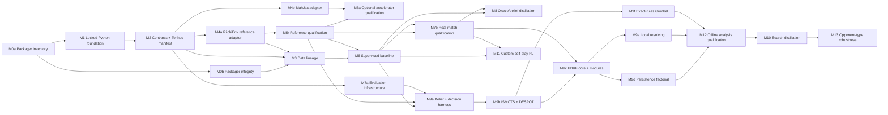

# Hydra2 Project Plan

**Status:** Planning baseline. Implemented repository scope: Rust MJAI packaging utility.  
**Date:** 2026-07-27  
**Rules authority:** Tenhou four-player hanchan, captured by a versioned manifest.  
**Algorithm research specification:** [ALGORITHM_EXPERIMENT_BLUEPRINT.md](./ALGORITHM_EXPERIMENT_BLUEPRINT.md)  
**Normative build backlog:** [BUILD_EXECUTION_PLAN.md](./BUILD_EXECUTION_PLAN.md)  
**Canonical implementation APIs:** [IMPLEMENTATION_SPEC.md](./IMPLEMENTATION_SPEC.md)

This plan records durable direction, boundaries, decisions, and milestone intent. `BUILD_EXECUTION_PLAN.md` is authoritative for execution order, work-package scope, gates, and evidence. `IMPLEMENTATION_SPEC.md` is authoritative for schemas, APIs, algorithms, validation, and error behavior. Status changes require the listed artifact and evidence. Research notes, synthetic experiments, external papers, and a document heading do not count as implementation.

## 1. Goal and Boundaries

### Product goal

Build a reproducible research stack for four-player Tenhou-rule riichi that:

- preserves raw MJAI provenance and validates event semantics;
- derives actor-visible, red-aware decision data without hidden-information leakage;
- trains legal policy, value, event, and belief models;
- uses an exact Tenhou-rule reference path for correctness and formal evaluation;
- qualifies MahJax only as a speed accelerator;
- evaluates policy, search, and PBRF persistence with versioned data, seeds, rules, resources, and uncertainty units.

### Research goal

Test whether PBRF's retained actor-visible event forest and opponent-turn computation improve expected final placement over frozen policy, fresh search, and retained-but-paused controls. Test strength internally with duplicate wall blocks; report raw points and first/fourth-place rates as diagnostics rather than substitute objectives.

### Non-goals

- Reimplement Tenhou rules inside neural models.
- Declare any engine, W&B, cache, leaderboard, or external rating authoritative.
- Reproduce or inspect LuckyJ without access.
- Train against a presumed LuckyJ API/checkpoint.
- Infer strength from action agreement, loss, rank, a single seed, or a live anecdote.
- Rewrite, delete, or behaviorally alter the relocated Rust packager without compatibility evidence.
- Build or operate a live Tenhou, Mahjong Soul, or other platform client.
- Publish confidential dataset provenance, raw samples, or sponsor identity.
- Promise model size, Elo, rank, games/s, samples/s, latency, or energy before measured qualification.

## 2. Locked Decision Record

| ID | Decision | Consequence |
| --- | --- | --- |
| D-001 | Tenhou four-player hanchan rules are authoritative. | `tenhou_4p_hanchan_v1.json` holds source URL/date/digest and complete selected flags. No engine default silently fills a field. |
| D-002 | Tenhou manual at <https://tenhou.net/man/> is the initial primary rules source. | First manifest locks 25k/30k, 10-20 uma, three reds, relevant end/time behavior, then explicitly records remaining selected flags. |
| D-003 | `RiichiEnv==0.4.8` is initial reference-engine adapter. | It must conform to D-001. It does not define rules by fiat. |
| D-004 | MahJax is optional accelerator at exact SHA `3fa282699e5786d165216578bc8e213f96a0dca5`. | Declare the full Git URL and revision under Pixi's PyPI dependencies; floating main/PyPI substitute prohibited. Accelerator trajectories are quarantined until conformance passes. |
| D-005 | `dora_indicators` has fixed shape `(5,)`. | Schema/cache/checkpoint hashes include it. `(4,)` artifacts are incompatible; no padding shim. |
| D-006 | Stable PyTorch 2.13.x semantics are authoritative; standalone `lightning-fabric==2.6.5` is an optional thin device/precision/strategy adapter. | Hydra2 owns supervised, distillation, and RL loops, optimizers, schedules, accumulation, evaluation, and checkpoints; no Lightning Trainer package is installed. Compile eligible pure-tensor model regions before `Fabric.setup`; retain a plain-PyTorch eager fallback without downgrading PyTorch. Changing the PyTorch patch, Fabric version, setup order, or ownership boundary changes environment/run/checkpoint/compile-lineage hashes, invalidates affected qualification artifacts, requires rebuild or explicit checkpoint migration, and requires fresh import, resume-equivalence, eager-parity, and device qualification records. |
| D-007 | W&B mirrors; local manifests/checkpoints are authoritative. | Formal work runs offline, records local hashes, and reconciles rather than overwrites. |
| D-008 | Pixi is the sole Python/native environment and lock authority. | Conda and PyPI dependencies resolve together in `pixi.lock`; no separate `uv.lock`. Formal runs record lock hash, Python, CUDA, driver, PyTorch, JAX/jaxlib, and device. |
| D-009 | The intact Rust packager lives at `tools/mjai-dataset-packager/`. | Crate manifests, source, wrapper, and target directory are isolated from the Python package. Crate-local Cargo config uses clang plus mold; cargo-nextest is the test runner. |
| D-010 | LuckyJ is external-only. | No access presumed. Public logs support observational analysis only; Hydra2 has no live client or direct comparison protocol. |
| D-011 | Ruff and Pyrefly are the Python quality gates. | Lock both through Pixi and invoke them through Pixi tasks; Ruff owns lint/format and Pyrefly owns type checking. |
| D-012 | Development order is supervised baseline, belief/search, then self-play RL. | Search has a measured policy/value baseline and exact-rule comparator before custom RL infrastructure; RL does not block the initial search ladder. |
| D-013 | Primary decision utility is expected final placement. | Preserve raw score/rank vectors; select actions using the acting seat's declared expected-placement scalar. Report points and first/fourth rates separately. |
| D-014 | Gameplay planner budget is 5 seconds on Hydra2's own turns, with information-safe opponent-turn pondering. | Deadline includes planner overhead and fallback margin. Pondered work commits only through actor-visible transition-correct packets. Analysis mode uses a separately declared larger budget and cannot change rules, information, or estimator semantics. |
| D-015 | RTX 5070 is the default development, profiling, and formal single-device target; one separately scheduled A100 has a 2,000 GPU-hour reserve. | A100 use requires a transactional ledger entry before launch: measured RTX 5070 bottleneck, transfer and cold-compile amortization, expected experiment value, reserved hours, actual hours, artifact hashes, and outcome. RTX 5070 and A100 results never substitute for each other. Changing device, driver, CUDA stack, kernel choice, or compute policy changes environment/compile/benchmark hashes, invalidates affected performance evidence, requires artifact rebuild where binary/device-specific, and requires fresh device-specific correctness, memory, cold-start, and steady-state qualification. |
| D-016 | Hydra2 is offline research/simulation only. | No live platform client, account automation, or field-play milestone. Tenhou remains rules authority; LuckyJ remains an external observational benchmark only. |
| D-017 | Internal dataset authority is confidential and attested by the user for model training and internal evaluation. | Use a non-identifying source ID, authorization attestation, permitted-purpose and disclosure fields, acquisition metadata if known, and content hashes. Never publish source identity, sponsor identity, or raw samples. |
| D-018 | Performance policy is measurement-gated: SDPA is the standard dense-attention path; the exact simulator remains eager; only pure-tensor model regions may compile. | No feature carries a free-speed claim. Compile arms, attention kernels, precision, input transfer, optimizer, memory, and scaling options require fixed-corpus eager parity plus cold-start, recompilation, latency, throughput, memory, determinism, and task-quality evidence on each device. Changing an accepted arm or its qualification thresholds changes performance-policy/run/compile hashes, invalidates dependent benchmark and promoted-model artifacts, requires rebuild/requalification, and records the replacement evidence and migration decision. |

## 3. Observed Repository Inventory

Observed 2026-07-27. The directory is not a Git repository; source history and attribution are unavailable.

| Path | Status | Observed responsibility |
| --- | --- | --- |
| `tools/mjai-dataset-packager/Cargo.toml` | EXISTING | Rust package `mjai-dataset-packager`; CLI, traversal, archives, zstd, parallelism, capacity, and progress dependencies. |
| `tools/mjai-dataset-packager/Cargo.lock` | EXISTING | Locked Rust dependencies. |
| `tools/mjai-dataset-packager/src/main.rs` | EXISTING | Single binary with `preflight` and `convert`; unit tests in the same file. |
| `tools/mjai-dataset-packager/package_mahjong_dataset.sh` | EXISTING | Workstation-specific build/preflight/convert wrapper; source directory is a required explicit argument and destination is the packaged corpus path. |
| `tools/mjai-dataset-packager/.cargo/config.toml` | EXISTING | Linux x86_64 linker configuration: clang driver with mold. |
| `docs/` | EXISTING | Planning documents only; no runtime subsystem. |

No Python package, `pyproject.toml`, `pixi.lock`, semantic validator, lineage manifest, canonical schema, engine adapter, model, trainer, evaluator, search implementation, or experiment registry exists.

### 3.1 Rust behavior to preserve

Current packager contract:

- inputs: raw `.mjai.json`, `.mjson`, existing `.mjai.json.zst`, and supported files inside `.tar.zst`;
- normalized output: `<name>.mjai.json.zst`, retaining relative paths;
- archive precedence: if `stem.tar.zst` has sibling directory `stem/`, every raw MJAI file anywhere below that extracted directory is non-authoritative and ignored, even when its name does not match an archive member;
- preflight rejects unsafe archive paths, symlinks, collisions, output-inside-input, unsupported archive members, oversized inputs, invalid settings, and insufficient conservative capacity;
- conversion bounds queued archive payload memory, parallelizes work, writes same-directory temporary outputs, fsyncs then renames, and reports completed/skipped counts;
- resume currently considers an output complete if it is a non-symlink regular file at least eight bytes whose first four bytes are zstd magic.

Known integrity gap: zstd magic is not a full decode or checksum. A valid-magic truncated/corrupt output can be skipped. Packaging success is not semantic MJAI validity, one-game proof, JSONL proof, or dataset-integrity proof.

Observed verification before relocation: `cargo nextest run --locked` completed six tests successfully on 2026-07-27. Source/manifest hashes were recorded before moving; post-relocation evidence is recorded below. The wrapper was inspected but not executed against the external dataset destination.

## 4. Target Architecture

### 4.1 Boundary rules

1. Contracts are framework-neutral: rules, action, event, observation, utility, artifact, and lineage types do not import engine, tensor, tracking, or storage APIs.
2. Engines adapt to canonical contracts; engine-native IDs do not leak into models/datasets.
3. RiichiEnv adapter plus Tenhou manifest establishes reference behavior. MahJax is never authority.
4. Raw MJAI is immutable. Semantic validation produces records, not in-place mutation. Every repair creates new content and lineage.
5. Parquet is durable derived data. Tensor caches are disposable derivatives.
6. Inference input is actor-visible only. Privileged labels live in separate namespaces/loaders.
7. Training/tuning/evaluation/live field data use disjoint manifests. Final wall seeds and external ledger partitions never enter training or checkpoint selection.
8. Every candidate search state names rules, actor observation, belief, proposal, policies, utility, fidelity, RNG, and target epoch.

### 4.2 Target layout

```text
hydra2/
|-- docs/
|   |-- PROJECT_PLAN.md
|   |-- ALGORITHM_EXPERIMENT_BLUEPRINT.md
|   |-- BUILD_EXECUTION_PLAN.md
|   `-- IMPLEMENTATION_SPEC.md
|-- pixi.lock                           # proposed M1; sole Conda/PyPI lock
|-- src/hydra2/                         # proposed Python package
|   |-- contracts/                      # rules/action/event/obs/utility/hash codecs
|   |-- artifacts/                      # canonical manifests, atomic registry
|   |-- data/                           # raw manifest, validation, splits, parquet, cache
|   |-- engines/riichienv/              # reference adapter
|   |-- engines/mahjax/                 # quarantined accelerator adapter
|   |-- conformance/                    # fixtures, differential tests, canaries
|   |-- models/                         # stable eager inference API; SDPA dense attention
|   |-- belief/                         # world laws, particles, event packets
|   |-- train/supervised/               # project-owned PyTorch loop; optional Fabric adapter
|   |-- train/rl/                       # same ownership boundary; no Trainer package
|   |-- performance/                    # compile/precision/input/device qualification records
|   |-- search/                         # candidates 0-8; exact simulator eager
|   |-- eval/                           # decision, block, field-ledger evaluation
|   `-- tracking/                       # optional W&B mirror
|-- configs/                            # versioned rule/data/run specs
|-- tests/                              # contract, integration, conformance suites
`-- tools/mjai-dataset-packager/        # existing independent Rust crate
    |-- .cargo/config.toml              # clang + mold
    |-- Cargo.toml
    |-- Cargo.lock
    |-- package_mahjong_dataset.sh
    `-- src/main.rs
```

Bulk raw data, shards, caches, checkpoints, and run records may be outside the repository. Repository manifests refer to content and paths explicitly; no code assumes current wrapper mount paths.

## 5. Canonical Contracts

Every contract has semantic version, RFC 8785 canonical JSON, SHA-256 digest, compatibility declaration, and validator. Any semantic field/order/shape change creates a new version.

### 5.1 Rules and utility

`RulesManifest` includes `rules_id`, source digest/date, all Tenhou match/scoring flags, red counts, time protocol, selected utility definitions, and adapter compatibility status.

`RawOutcome` stores terminal raw scores, ranks, point deltas, and settlement facts as a four-seat vector. `UtilityVector` maps `RawOutcome` under named `utility_id` to four values. `RootScalar` selects the acting seat's defined scalar. Raw settlement conservation and utility schema identity are separate tests; zero-sum assertion is allowed only when the utility manifest says so.

### 5.2 Action

Canonical action table is red-aware and engine-independent:

- discard/tsumogiri including physical/red identity;
- riichi plus discard;
- pass;
- chi/pon/daiminkan/ankan/kakan with called tile, consumed composition, source seat, red identity;
- ron/tsumo;
- explicit required abort/terminal responses.

Encode/decode must preserve meaning and legal-mask index alignment in every adapter. Invalid combinations are rejected or unrepresentable.

### 5.3 Event and observation

`EventEnvelope` records sequence, actor, kind, visibility, red-aware visible payload, and public-state delta.

- A public event is visible to all seats.
- A concealed draw's *occurrence/actor* may update public turn state, but its tile identity is actor-private.
- Own private draw tiles appear only in that actor's observation.
- Server-private data is never serialized to actor streams.
- Call/pass packets contain priority resolution sufficient to produce one successor.

`ActorObservation` contains only public state, actor's concealed hand, actor-private events, actor-specific legal facts, explicit red identity, ordered actor-visible history, rules/schema hashes, and legal mask. It never includes opponent hands, wall/dead-wall order, unrevealed dora/ura, RNG, server state, future packets, or opponent legal masks.

`dora_indicators` is `(5,)` with declared sentinel/dtype/range. Counterfactual permutations of unseen tiles preserving observation must leave serialized observations and inference output unchanged.

## 6. Data Lineage

```text
licensed source archive / raw MJAI
  -> existing Rust packager (transport/compression only)
  -> immutable compressed objects
  -> raw-object manifest with byte-domain hashes
  -> semantic MJAI validation and Tenhou-rule replay
  -> whole-game/player/time split map
  -> actor-visible canonical decisions
  -> Arrow/Parquet shards and dataset manifest
  -> disposable tensor cache
  -> training / decision evaluation / block evaluation
```

The packager does not prove one-game or JSONL semantics. The validator proves and records them for each accepted raw object.

### 6.1 Raw manifest

Use SHA-256 and RFC 8785 canonical JSON. Each row records separate domains:

- non-identifying confidential source ID; authorization attestation; permitted-purpose/disclosure metadata; source/archive-member byte SHA-256;
- compressed output byte SHA-256, byte length, path, packager config/version;
- decoded payload SHA-256, decoded length, record count, canonical JSONL status;
- semantic validation state, rules/adapter IDs, first stable error class/event index;
- immutable creation time and parent lineage.

Publish data first, verify full bytes/decode, write manifest temporary file, fsync, rename. Resume reuse requires an authoritative manifest row plus matching compressed and decoded hashes. Missing row, mismatch, decode error, partial file, or duplicate source identity quarantines/rebuilds. Neither zstd magic nor filename decides integrity.

The observed packaged corpus at `/mnt/samsung_nvme/samsung/mahjong_dataset` contains 6,810,629 `.mjai.json.zst` objects (approximately 50 GiB). The 2026-07-28 packager log records a completed zero-skip conversion from the now-deleted staging bundle. This proves transport only. M3 must create the confidential authorization/provenance attestation and content-addressed manifest before any object enters training or evaluation.

### 6.2 Semantic validation and splits

Validation decodes every accepted object, checks MJAI structural order, replays it through the qualified reference adapter under the manifest, and records tile conservation/red identity, legal progression, score/settlement, call priority, hand/game termination, and trailing data behavior. Invalid records remain traceable in quarantine and never become training rows.

Assign splits before expanding decisions. Group by whole game; prevent relevant player/source leakage; enforce later test time when metadata permits; check exact and near-duplicate fingerprints across partitions; keep rollout/evaluation wall identities disjoint. Hash split algorithm and output.

### 6.3 Parquet, loading, caches

Parquet rows include game/round/decision/seat IDs, source checksum, split, rules/schema/adapter/derivation hashes, actor-visible fields, legal mask, chosen action, and separate privileged labels/outcomes. Shards retain whole games where feasible. Loader preserves masks and IDs, treats nonterminal all-false mask as hard error, verifies manifest/shard hashes, and never silently skips corruption.

Caches key on full dataset manifest, split, schema/preprocessing/layout/dtype/library hashes. Delete/rebuild must reproduce identity. No old `(4,)` dora cache/checkpoint is reshaped into `(5,)`.

## 7. Engine Conformance

### 7.1 RiichiEnv reference adapter

Reference adapter must pin `RiichiEnv==0.4.8`, map canonical action/event/observation both directions, accept deterministic wall/seat schedule, and expose actor streams through a process/API boundary. It must implement the Tenhou manifest precisely enough for qualification corpus cases, or the affected rule subset remains unsupported.

### 7.2 MahJax quarantine

MahJax paths remain unusable for data/training/evaluation until the exact tuple `(SHA, pixi.lock, JAX, jaxlib, XLA flags, device, observation mode, rules_id, adapter version)` passes:

- upstream tests plus project target-hardware full-play cases;
- fifth dora `(5,)` case;
- chankan zero/one/multiple ron response cases;
- red/no-red kuikae cases;
- eager/JIT/vmap shanten and trace consistency;
- deterministic repeated seed/action traces;
- randomized differential transitions against RiichiEnv over declared Tenhou-rule intersection;
- actor-view hidden-tile canaries;
- GPU soak without OOM, NaN, or nonterminal all-false mask.

Any unexplained mismatch blocks affected acceleration. Upgrades create a new full environment lineage and repeat qualification.

## 8. Model, Belief, and Evaluation Contracts

### 8.1 Models

Model inference API consumes actor-visible observation and legal mask, outputs legal policy logits, vector value distribution, event likelihoods, and diagnostics. Supervised baseline starts with masked behavior cloning using ordinary dense projection plus cross-entropy and SDPA for standard dense/causal attention; evaluation passes SDPA dropout `0.0`. Exact rules, state transitions, legal-action construction, data access, and simulator control remain eager. Only side-effect-free tensor encoders, attention, heads, and loss regions may enter `torch.compile`; the same checkpoint must run through plain eager PyTorch. Hydra2-owned loops expose held-out masked NLL, top-k, calibration, support/confusion, strata, legal-uniform comparison, complete-game smoke behavior, and compile/eager parity.

Oracle/belief distillation may use privileged labels in a separate training namespace. Hidden permutation tests are required before registration.

Exact actor-visible shanten, post-discard shanten delta, own-wait mask, and public unseen-tile ukeire MAY be tested as a separate model-input ablation. The public unseen count subtracts only the actor's own tiles and publicly visible physical tiles; it is an availability feature, not a wall posterior or draw probability. Every arm requires a distinct input-schema/model/checkpoint identity, hidden-permutation invariance, and held-out plus duplicate-block evidence. Hydra1-style hand-built multi-draw probabilities, expected-score bonuses, or features derived from concealed opponent tiles are prohibited.

### 8.2 Belief/event infrastructure

Before any planner, implement scoreable world law/proposal, natural sampling, actor-conditional sampling, disjoint packet semantics, exact simulator pushforward/conditioning, provenance/epoch invalidation, and held-out calibration. A planner may not invent an undefined conditional law or event likelihood.

### 8.3 Evaluation and compute modes

Decision cases: versioned actor observations plus exact-tiny oracle where possible, or natural full-fidelity confirmation plan. Block matches: committed wall/seat/latency schedules, whole-wall-block inference, duplicate 2-v-2 and 1-v-3 diagnostics. Expected final placement is primary; raw points, first/fourth/deal-in/riichi/call rates remain diagnostics. Every result stores resource view, hardware, fallback, latency, model calls, transitions, joules where available, uncertainty unit, invalid blocks, and all hashes.

`gameplay_5s` uses a 5,000 ms own-turn hard deadline including synchronization, planner overhead, and fallback margin; exact fallback policy and margin are frozen by CandidateSpec. `ponder` computes only between actor-visible packets and may commit only transition-correct work. `analysis` declares a larger finite budget separately and may increase search effort, never information access or algorithm semantics.

RTX 5070 is the default profiling and formal single-device target. A100 is a separate, time-bounded single-device reserve, not another rank: each use requires a pre-launch ledger reservation and post-run reconciliation of reason, expected value, reserved/actual GPU-hours, environment and artifact hashes, transfer/cold-compile cost, result, and release of unused hours. Local disk is authority. W&B mirrors only reconciled identities and metrics. GPU timing synchronizes asynchronous work; cold compile/warm-up are separate from steady state; profiler-disabled timings are authoritative; formal comparisons serialize training/evaluation unless a contention study qualifies another mode.

### 8.4 Performance qualification policy

Baseline: eager exact simulator, eager plain-PyTorch execution, padded/bucketed histories with explicit masks, dense action head plus cross-entropy, SDPA dense attention, ordinary single-device `torch.save` checkpoints, and AdamW default selection. `torch.compile` is a measured ladder, not default magic: qualify eager, `default`, then more aggressive or regional modes only in the experiment blueprint. Fabric setup follows compilation and must preserve the plain-PyTorch path. FlexAttention is conditional only when custom score semantics or meaningful block sparsity cannot be expressed efficiently by SDPA; dense use remains SDPA. `nn.LinearCrossEntropyLoss` is deferred while Hydra2 has a small action head.

| Option | Durable classification |
| --- | --- |
| Nested/jagged tensors | Conditional only for padding-dominated histories after operator-coverage, graph-break, copy, memory, and end-to-end evidence. |
| 2:4 semi-structured sparsity | Deferred; conditional inference experiment only for large shape-eligible layers after pruning recovery and device-specific quality/latency evidence. |
| FP8 through torchao | Deferred; conditional large-backbone experiment, never the small output head; RTX 5070 and A100 kernel/value qualification separate. |
| NVFP4/Torch-TensorRT | Deferred inference-only RTX 5070 experiment after exact support and local dry-run proof; inapplicable to A100 and excluded from training authority. |
| Activation checkpointing/selective checkpointing | Deferred until measured activation-memory pressure; then conditional on deterministic gradient/throughput evidence. |
| FSDP2/DTensor, torchcomms, distributed checkpointing | Deferred absent an actual concurrent multi-rank topology or demonstrated checkpoint stall; current devices remain separate single-device runs. |
| NGC container | Deferred reproducibility experiment; exact digest/content/driver compatibility required and never replaces stable PyTorch 2.13.x semantic authority. |
| Pinned memory/non-blocking transfer, AMP FP16/BF16, TF32, fused/foreach optimizer variants | Independent measured arms. Promote only the option whose targeted bottleneck improves without correctness, convergence, memory, or reproducibility regression; do not bundle gains. |

Every arm uses identical fixed samples/seeds and legal masks; checks eager discrete outputs/state transitions, dtype-appropriate output/loss and gradient/update parity, finite values, bounded graph breaks/recompiles, cold compile, median/p95 synchronized latency, throughput, allocated/reserved peak memory, determinism variance, dependency burden, and evaluation non-regression. RTX 5070 and A100 qualify separately. Replacing a promoted arm or threshold changes performance-policy, environment, run, compile, benchmark, and checkpoint-lineage hashes; dependent artifacts are invalid until rebuilt or explicitly migrated and the new qualification record is attached.

Primary official sources: [PyTorch 2.13 `torch.compile`](https://docs.pytorch.org/docs/2.13/generated/torch.compile.html), [compiler FAQ](https://docs.pytorch.org/docs/2.13/user_guide/torch_compiler/torch.compiler_faq.html), [compiler troubleshooting](https://docs.pytorch.org/docs/2.13/user_guide/torch_compiler/torch.compiler_troubleshooting.html), [SDPA](https://docs.pytorch.org/docs/2.13/generated/torch.nn.functional.scaled_dot_product_attention.html), [FlexAttention](https://docs.pytorch.org/docs/2.13/nn.attention.flex_attention.html), [AMP](https://docs.pytorch.org/docs/2.13/amp.html), [CUDA/TF32 semantics](https://docs.pytorch.org/docs/2.13/notes/cuda.html#tensorfloat-32-tf32-on-ampere-and-later-devices), [nested tensors](https://docs.pytorch.org/docs/2.13/nested.html), [activation checkpointing](https://docs.pytorch.org/docs/2.13/checkpoint.html), [FSDP2](https://docs.pytorch.org/docs/2.13/distributed.fsdp.fully_shard.html), [distributed checkpointing](https://docs.pytorch.org/docs/2.13/distributed.checkpoint.html), and [Fabric 2.6.5 setup source](https://github.com/Lightning-AI/pytorch-lightning/blob/2.6.5/src/lightning/fabric/fabric.py). Experimental pseudocode and extended primary references live in the algorithm blueprint.

### 8.5 Offline-only boundary

Hydra2 implements no live platform client. Public LuckyJ records may inform observational policy/distribution analysis, but never training provenance or causal strength claims without a separate lawful protocol outside this plan.

## 9. Milestone DAG

Status vocabulary:

- **EXISTING:** observed implementation covers named scope.
- **PARTIAL:** implementation exists; exit gate unmet.
- **NOT STARTED:** no implementation observed; work may start if entry gate holds.
- **BLOCKED:** a named prerequisite prevents this entire milestone.



### M0a - Packager compatibility inventory

**Status:** PARTIAL.  
**Dependencies:** none.  
**Deliverables:** observed behavior contract; golden raw/zstd/archive fixture including entire same-stem extracted directory precedence; recorded nextest command/environment; relocated wrapper path/config inventory.  
**Exit:** from `tools/mjai-dataset-packager/`, `cargo nextest run --locked` passes through clang/mold; golden fixture establishes compatibility behavior without source modification.  
**Evidence:** pre/post source hashes, test/CLI output, fixture manifest, expected output hashes.  
**Current evidence:** intact relocation completed; pre/post `Cargo.toml`, `Cargo.lock`, and `src/main.rs` SHA-256 hashes match; post-relocation nextest reports 6 passed; CLI help matches; wrapper syntax and rust-analyzer diagnostics pass. Golden fixture remains unimplemented.

Relocation hash evidence, captured before moving from repository root and after moving under `tools/mjai-dataset-packager/`:

| Before path | After path | SHA-256 before and after |
| --- | --- | --- |
| `Cargo.toml` | `tools/mjai-dataset-packager/Cargo.toml` | `238717bc83f1146b8fc7fddba34f5909f54d8a8fea7f48601082368e47e8a0e3` |
| `Cargo.lock` | `tools/mjai-dataset-packager/Cargo.lock` | `702023c3dbd4b8a721f88bc16b2b4e1127cffdd9634c62aab95943ad6208402e` |
| `src/main.rs` | `tools/mjai-dataset-packager/src/main.rs` | `9055ed9fc22ab4149bce5f1ec628c7a1b5782ed267558418f9f43a06e68e7fc6` |

### M0b - Packager-integrated integrity authority

**Status:** NOT STARTED.  
**Dependencies:** M0a.  
**Deliverables:** full decode/checksum authority integrated with or fed atomically by packager; raw manifest schema; valid-magic corruption fixture; resume decision record.  
**Exit:** corrupt valid-magic output cannot silently skip; interrupted/resumed object yields same authoritative hashes; existing archive precedence, bounds, atomic publication, and CLI behavior remain verified.  
**Evidence:** corruption/resume transcripts, manifest hashes, before/after golden fixture results.

### M1 - Locked Pixi/Python foundation

**Status:** NOT STARTED.  
**Dependencies:** M0a compatibility inventory only; M0b may continue independently.  
**Deliverables:** `pyproject.toml`, `pixi.lock`, importable package, stable PyTorch 2.13.x pin, standalone `lightning-fabric==2.6.5` without Trainer packages, exact RiichiEnv/MahJax dependencies, Conda/PyPI source declarations, plain-PyTorch fallback, compile-before-Fabric setup probe, and Pixi tasks for tests, Ruff lint/format checks, Pyrefly type checking, configuration validation, environment-manifest capture, and device inventory.  
**Exit:** clean `pixi install --frozen`; no `uv.lock` or Trainer package; fresh-process imports; resolved PyTorch 2.13.x/Fabric/RiichiEnv/MahJax identities; compile-before-setup and eager-fallback probes; project-owned checkpoint round trip; locked Ruff and Pyrefly tasks pass; environment manifest records lock hash, Python, PyTorch, Fabric, CUDA, driver, device name/capability, cuDNN, and extension versions.  
**Evidence:** Pixi lock and environment-manifest hashes, dependency-tree/task output, fresh-process import/setup probes, eager fallback output, and checkpoint round-trip record. Any dependency/setup replacement invalidates these hashes plus downstream run/checkpoint/compile evidence and requires rebuild/requalification under D-006.

### M2 - Canonical contracts and Tenhou manifest

**Status:** NOT STARTED.  
**Dependencies:** M1.  
**Deliverables:** `tenhou_4p_hanchan_v1.json`; rules/action/event/observation/utility schemas; canonical hashes/codecs; actor visibility validator.  
**Exit:** rule source digest recorded; action bijection/mask alignment; red identity; `(5,)` dora; concealed-draw visibility; call/pass packet; utility identity; hidden-field rejection all pass versioned fixtures.  
**Evidence:** serialized goldens and contract tests.

### M3 - Authoritative data lineage

**Status:** BLOCKED.  
**Dependencies:** M0b, M2, M4a.  
**Deliverables:** raw manifest; semantic validator; quarantine; leakage-safe splits; actor-view derivation; Arrow/Parquet builder; cache builder/loaders.  
**Exit:** representative raw fixture traverses packager -> hash/decode -> semantic replay -> split -> Parquet -> fresh-process batch; corruption/resume and duplicate/split/privileged-field audits pass.  
**Evidence:** end-to-end manifest and audit reports.  
**Blocker:** missing dependencies.

### M4a - RiichiEnv reference adapter

**Status:** NOT STARTED.  
**Dependencies:** M1, M2.  
**Deliverables:** v0.4.8 adapter, deterministic wall/seat controls, actor-isolated API, canonical codecs.  
**Exit:** seeded complete games; action/event round trips; actor boundary canary; stored deterministic reference traces.  
**Evidence:** complete-game logs and fixtures.

### M4b - MahJax accelerator adapter

**Status:** NOT STARTED.  
**Dependencies:** M1, M2.  
**Deliverables:** exact-SHA adapter and environment manifest only.  
**Exit:** adapter compiles/imports and declares itself quarantined; no accelerated trajectories consumed yet.  
**Evidence:** fresh-process SHA/import probe.

### M5r - Reference rules and adapter qualification

**Status:** BLOCKED.  
**Dependencies:** M4a.  
**Deliverables:** versioned Tenhou edge corpus; RiichiEnv reference trace runner; first-counterexample persistence; supported-rule report.  
**Exit:** zero unresolved reference-adapter mismatch against the declared Tenhou manifest/corpus; deterministic seeded traces; fifth dora/chankan/kuikae/call-priority/end-condition gates; actor-view canaries.  
**Evidence:** reference conformance matrix, stored traces, counterexample directory, rules coverage report.

### M5a - Optional MahJax accelerator qualification

**Status:** BLOCKED.  
**Dependencies:** M4b, M5r.  
**Deliverables:** differential runner against qualified reference corpus; rule-intersection report; target-GPU report.  
**Exit:** zero unresolved mismatch on declared accelerated intersection; fifth dora/chankan/kuikae/shanten gates; deterministic eager/JIT/vmap traces; target-GPU soak.  
**Evidence:** accelerator conformance matrix, counterexample directory, device report.  
**Scope:** gates only MahJax trajectories/rollouts. Failure or deferral does not block RiichiEnv-only data, baseline, belief, search, or evaluation.

### M6 - Supervised playable baseline

**Status:** BLOCKED.  
**Dependencies:** M3, M5r.  
**Deliverables:** PyTorch model/inference contract; Hydra2-owned supervised loop and checkpoint schema; optional standalone Fabric thin adapter; legal masking; SDPA dense attention; eager and qualified pure-tensor compile paths; local checkpoint/run/performance manifests; W&B mirror; diagnostics.  
**Exit:** tiny-shard overfit; deterministic supported resume in project-owned loop; compile-before-Fabric setup; same checkpoint loads in plain eager PyTorch; eager/compiled legal logits, loss, gradients, and short updates meet declared tolerances; complete Tenhou-reference games have zero illegal actions/timeouts under declared smoke policy; any promoted performance arm passes §8.4 separately on RTX 5070 and, only if used, A100.  
**Evidence:** local run/checkpoint/environment/performance-policy hashes, eager/compiled parity and resume records, graph-break/recompile/cold-start/steady-state report, device-specific memory/latency/throughput evidence, and complete-game smoke logs. Model, loop, setup-order, precision, or promoted-arm replacement invalidates dependent run/checkpoint/compile hashes and requires explicit migration/rebuild plus fresh qualification.

### M7a - Synthetic and unit evaluation infrastructure

**Status:** NOT STARTED.  
**Dependencies:** M2.  
**Deliverables:** seed/seat/latency schedule schemas; block aggregation; bootstrap/sign-flip tools; synthetic known-effect tests; resource/telemetry record schema.  
**Exit:** synthetic estimands recover declared effects; schedule balance/replay passes; invalid-block behavior tested.  
**Evidence:** synthetic reports and schedule hashes.

### M7b - Real match qualification

**Status:** BLOCKED.  
**Dependencies:** M5r, M6, M7a.  
**Deliverables:** four-rotation and six-allocation runners; hidden final partition; complete-game artifact load; block-statistics report.  
**Exit:** fresh artifact loads; real blocks complete with correct clustering; no final seed upstream; telemetry complete.  
**Evidence:** real block manifest and balance audit.

### M8 - Oracle/belief and offline distillation

**Status:** BLOCKED.  
**Dependencies:** M6, M7b.  
**Deliverables:** privileged-label isolation; belief/value distillation; optional behavior-regularized offline refinement; calibration reports.  
**Exit:** hidden-tile permutation invariance; no predeclared supervised regression; proper-score report; duplicate-block comparison.  
**Evidence:** leakage, calibration, and paired evaluation manifests.  
**Scope exclusion:** not Candidate 7 search distillation.

### M9a - Belief and decision-case harness

**Status:** BLOCKED.  
**Dependencies:** M5r, M6, M7a.  
**Deliverables:** natural/proposal world law; scoreable densities; disjoint packet kernel; exact pushforward/condition; tiny-state oracle corpus; natural confirmation runner; provenance/epoch checker.  
**Exit:** exact finite fixtures, event mass, parent-to-successor rebuild, hidden-canary, density, and confirmation replay all pass.  
**Evidence:** case manifest, oracle outputs, provenance rejection tests.

### M9b - Fresh-search baselines

**Status:** BLOCKED.  
**Dependencies:** M9a.  
**Deliverables:** Candidates 0, 1, 2 implementations; natural ISMCTS/DESPOT cases; resource accounting.  
**Exit:** candidate-specific tiny-state tests; natural confirmation; no nonanticipativity breach; result tables under frozen resource views.  
**Evidence:** CandidateSpec/result hashes.

### M9c - PBRF core and one-at-a-time modules

**Status:** BLOCKED.  
**Dependencies:** M7b, M9b.  
**Deliverables:** Candidate 3 core; each Candidate 4 module behind separate flag; module fixtures; fresh confirmation.  
**Exit:** core exact packet/commit tests; each promoted module passes its own tiny-law test and matched confirmation; cumulative build re-passes all earlier gates.  
**Evidence:** module registry, test reports, result tables.

### M9d - Persistent PBRF factorial

**Status:** BLOCKED.  
**Dependencies:** M9c.  
**Deliverables:** B/F/R/P/C runner; retained-state validity; latency/energy accounting; surprise/recovery strata; blinded resource/variance pilot.  
**Exit:** no leak/stale child/deadline violation; predeclared P-F/P-R/R-F/P-C reports with actual resource distributions; confirmation and block gates pass.  
**Evidence:** pilot, manifests, factorial result report.

### M9e - Public-belief local resolving qualification

**Status:** BLOCKED.  
**Dependencies:** M9c.  
**Deliverables:** Candidate 5 subgame builder, information-node strategies, declared update/averaging rules, exact tiny general-sum fixtures, PBRF warm-start ablation.  
**Exit:** information equality, settlement/utility identity, cycle/abstraction diagnostics, natural confirmation, and matched-resource comparisons pass their CandidateSpec. No equilibrium/exploitability guarantee is claimed.  
**Evidence:** subgame specification, tiny-oracle report, CandidateSpec/result hashes.

### M9f - Exact-rules Gumbel search qualification

**Status:** BLOCKED.  
**Dependencies:** M9b.  
**Deliverables:** Candidate 6 exact-simulator Gumbel/sequential-halving implementation, deterministic root streams, PUCT comparison, call accounting.  
**Exit:** exact-rule/cache/hidden-invariance/Gumbel replay tests pass; natural confirmation reports matched-call policy, PUCT, and Gumbel results.  
**Evidence:** CandidateSpec, replay trace, rule-parity and result hashes.

### M10 - Search distillation and population comparison

**Status:** BLOCKED.  
**Dependencies:** M9d, M9e, M9f, M12, with recorded qualification outcomes for Candidates 0-6, including rejected/unpromoted outcomes.  
**Deliverables:** Candidate 0-6 outcome registry; selected five-gate-promoted teacher justification; Candidate 7 teacher trajectory format; student training; population protocol; teacher/student/same-search comparisons.  
**Exit:** every Candidate 0-6 CandidateSpec/result/analysis hash is present before teacher selection; selected teacher passed contract/exact/search/match/analysis gates; actor-view/split checks; fresh checkpoint; duplicate-block and calibration promotion evidence. Candidate or teacher-selection replacement changes registry/trajectory/run/checkpoint/result hashes, invalidates dependent distillation artifacts, and requires regeneration plus repeated comparison evidence.  
**Evidence:** Candidate 0-6 registry hashes and replay/checkpoint/result manifests.

### M11 - Custom self-play RL

**Status:** BLOCKED.  
**Dependencies:** M6, M7b.  
**Deliverables:** project-owned PyTorch actor-learner-replay loop; optional standalone Fabric device/precision/strategy adapter; historical opponent pool; rollout-wall ledger; canonical `RlRolloutArtifact`; closed ModelSpec/RunSpec identities; ordinary single-device checkpoint/resume semantics; no Trainer, distributed, or simulator compilation path. Optional objective experiments consume one frozen rollout artifact through a `MatchedObjectiveGroup` and compare the mandatory masked PPO objective with direct-sampled Actor-Critic Hedge (ACH); they do not create another rollout backend.
**Exit:** deterministic small resume through both configured Fabric and plain-PyTorch fallback paths; exact simulator remains eager; rollout identity/action-mask/policy validation; PPO and ACH formula, legal-mask, gradient, finite-metric, and artifact-equivalence fixtures; any promoted objective or checkpoint passes a multi-seed duplicate-block comparison against the frozen champion; every precision/compile/input/optimizer option passes an independent §8.4 gate on its actual device.
**Evidence:** environment/performance-policy/rollout/ModelSpec/RunSpec/checkpoint/objective/conformance/multi-seed hashes and device-specific qualification reports. Loop, rollout schema, model/run specification, objective, Fabric, checkpoint schema, or promoted performance-arm replacement invalidates dependent replay/checkpoint/result hashes and requires migration or regeneration plus resume/conformance requalification.
**Note:** M11 may create stronger checkpoints; it is not required for initial search ladder M9a-M10.

### M12 - Offline analysis-mode qualification

**Status:** BLOCKED.  
**Dependencies:** M9d, M9e, M9f; M11 only when its checkpoint is separately analyzed.  
**Deliverables:** analysis-budget CandidateSpecs for every teacher-eligible Candidate 0-6 outcome; scalable deadline/resource schedules; deterministic replay; gameplay-vs-analysis action/value comparison; report generator.  
**Exit:** analysis mode increases only declared compute; no additional information fields, rules, estimator changes, hidden sensitivity, or uncharged work; replay and fallback gates pass. Every outcome either receives a passed analysis gate or becomes teacher-ineligible.  
**Evidence:** CandidateSpecs, resource/latency traces, replay hashes, analysis reports.

### M13 - Observation-based opponent-type robustness

**Status:** BLOCKED.  
**Dependencies:** M3, M9a, M10, and a sufficient confidential authorized split/calibration protocol.  
**Deliverables:** Candidate 8 joint type/world filter; coherent information-set policy uncertainty set; confidential dataset split/calibration protocol; nominal/robust comparisons.  
**Exit:** finite joint-posterior, same-information, feasible-set, coherent-trajectory, hidden-marginalization, held-out calibration, and offline comparison gates pass. Inadequate data keeps the candidate disabled rather than simplifying its target.  
**Evidence:** confidential authorization/data manifest, type/world oracle report, CandidateSpec/result hashes.

## 10. Current Progress Ledger

| Area | Status | Evidence |
| --- | --- | --- |
| Rust transport/compression packager | EXISTING | Relocated intact under `tools/mjai-dataset-packager/`; wrapper and Cargo linker config observed. |
| Packager focused test suite | PARTIAL | Pre- and post-relocation `cargo nextest run --locked`: 6 passed, 2026-07-27; M0a golden fixture remains. |
| Packager integrity manifest/full decode | NOT STARTED | Known magic-byte resume gap. |
| Tenhou rules manifest/contracts | NOT STARTED | Decision recorded; artifact absent. |
| Pixi/Python foundation | NOT STARTED | No `pyproject.toml`, `pixi.lock`, or Python package observed. |
| Data validator/Parquet/splits | NOT STARTED | No implementation observed. |
| Engine adapters/conformance | NOT STARTED | No implementation observed. |
| Model/training/belief/search | NOT STARTED | Staged baseline -> belief/search -> RL order, project-owned PyTorch loops/checkpoints, optional Fabric 2.6.5 thin adapter, eager fallback, and measured performance policy locked; implementation absent. |
| Offline evaluation/analysis | NOT STARTED | Expected-placement objective, 5-second gameplay mode, pondering, and analysis boundary recorded; infrastructure absent. |
| Prior theory/toys/research | RESEARCH ONLY | Informs documents; does not satisfy a Hydra2 milestone. |

## 11. Risks and Controls

| Risk | Control or stop condition |
| --- | --- |
| Valid-magic corrupt zstd output skips resume. | M0b full decode plus byte-domain hashes becomes authority. |
| Packager behavior breaks under relocation or restructuring. | Preserve source/manifests and CLI; compare pre/post hashes, nextest, CLI help, and golden fixtures. |
| Engine defaults differ from Tenhou rules. | Versioned Tenhou manifest and reference conformance; unsupported subset stays out. |
| MahJax mismatch contaminates data. | Quarantine until exact tuple/corpus passes; RiichiEnv only otherwise. |
| Conda/PyPI resolution drifts or duplicates authority. | Pixi is sole lock authority; no `uv.lock`; formal tasks use `pixi run` and `pixi install --frozen`. |
| Python lint/type behavior differs across machines. | Ruff and Pyrefly are locked Pixi dependencies and invoked only through declared Pixi tasks. |
| Rust linker/test behavior differs across machines. | Crate-local clang/mold config plus cargo-nextest version/environment evidence. |
| Hidden information leaks. | Actor boundary, canaries, tile permutation, serialization audit, privileged namespace. |
| Red/dora schema drift. | Version/hash contracts; reject incompatible artifacts. |
| Game/player/time leakage. | Whole-game split, group/time constraints, duplicate audit, immutable split manifest. |
| Search statistic mistaken for evidence. | Freeze candidates; natural confirmation; correct uncertainty unit. |
| Persistent tree reuses invalid posterior. | Packet transition/epoch/provenance checks; semantic squash; rebuild comparison. |
| External benchmark overclaim. | LuckyJ remains observational-only; no live client or causal superiority claim. |
| Single GPU timing/energy mismeasurement. | Synchronized timing, warm-up separation, serialized formal runs, recorded hardware policy. |
| A100 reserve spent without leverage. | Require local profiling, transfer/compile amortization, expected-value record, and charged GPU-hour ledger. |
| Compiler/kernel/precision option is treated as automatic acceleration. | D-018 eager oracle, independent arms, cold/steady accounting, correctness and task-quality gates, and separate RTX 5070/A100 evidence; reject unmeasured claims. |
| Single-device reserve is mistaken for distributed topology. | Keep world size one; defer FSDP2/torchcomms/DCP until concurrent qualifying topology exists; inventory links before any future topology claim. |

## 12. Next Executable Queue

Execute [BUILD_EXECUTION_PLAN.md](./BUILD_EXECUTION_PLAN.md); it is the normative dependency graph and package-level completion authority. The condensed ordering below is a direction summary only. Do not begin a later item by inventing unresolved contracts.

1. Complete M0a golden fixture and append its hashes to the recorded successful relocated clang/mold nextest and CLI evidence.
2. Specify M0b raw-manifest canonical JSON and SHA-256 byte domains; add full decode/checksum corruption and resume fixtures while preserving current CLI behavior.
3. Create M1 Python package, `pyproject.toml`, and frozen `pixi.lock`; pin stable PyTorch 2.13.x plus standalone `lightning-fabric==2.6.5`, exclude Trainer packages, declare Conda/PyPI dependencies once, add environment/device capture, prove compile-before-Fabric setup, project-owned checkpoint round trip, and plain-PyTorch eager fallback without a PyTorch downgrade.
4. Implement M2 Tenhou manifest, canonical rule/action/event/observation/utility contracts, including concealed-draw and `(5,)` dora fixtures.
5. Implement M7a schedule/statistics/telemetry schemas and synthetic fixtures; later smoke and formal runs consume these contracts.
6. Implement M4a RiichiEnv adapter, M5r reference qualification, and actor-isolated deterministic trace path.
7. Implement M3 semantic validator, lineage/split/Parquet fixture, cache rebuild, and privileged-field audit.
8. Implement M6 smallest Hydra2-owned supervised baseline that overfits fixture, resumes, loads fresh in Fabric and plain eager PyTorch, plays legal complete reference games, uses SDPA for dense attention, and records eager/compile qualification through M7a telemetry; do not promote a performance arm without §8.4 evidence.
9. Implement M4b/M5a only before consuming MahJax acceleration; reference-only work does not wait for it. Then complete M7b real block qualification.
10. Implement M9a belief/event/confirmation harness before any MCTS/DESPOT/PBRF code.
11. Implement M9b then M9c one candidate/module at a time; never add persistence before commit/squash fixtures pass.
12. Qualify M9e local resolving and M9f exact-rules Gumbel independently; failed candidates remain documented and unpromoted.
13. Complete and record outcomes for Candidates 0-6 by finishing M9d, M9e, and M9f; qualify M12 analysis mode for every teacher-eligible outcome; only then may M10 select and distill a five-gate-promoted teacher. Start M11 only when stronger self-play checkpoints justify its cost, retaining project-owned loops/checkpoints and exact eager simulation.
14. M12 has no live client work and changes compute only; its passed record is a prerequisite for M10 teacher selection.
15. Implement M13 only after confidential authorized split/calibration gates pass; no LuckyJ model access is assumed.

## 13. Document Maintenance Rule

Update this plan and the algorithm blueprint together when changing a contract, milestone, candidate, statistical claim, dependency identity, or promoted performance arm. Every replacement decision must state affected environment/contract/policy/run/checkpoint/compile/result hashes, invalidated artifacts, migration or rebuild requirement, device-specific qualification evidence, and verification record. No document-only status change promotes software.

## 14. Status Addendum — 2026-09-04 (read-only refresh)

> Original §§1–13 preserved verbatim above. This section only reconciles plan
> text with the code as it exists on 2026-09-04. Normative execution order
> remains `BUILD_EXECUTION_PLAN.md`; normative APIs remain
> `IMPLEMENTATION_SPEC.md`. No document-only statement here promotes software
> (§13 still applies).

### 14.1 What shipped since the planning baseline

| Plan item | Reality 2026-09-04 | Citation |
| --- | --- | --- |
| M1 Python foundation (was NOT STARTED) | Shipped: `pyproject.toml` + `pixi.lock` exist; Pixi is sole authority, `uv.lock` banned | `pyproject.toml:15-16` (sole-authority note), `[tool.pixi.pypi-dependencies]` |
| Stable PyTorch pin (plan: 2.13.x) | Superseded: `torch ==2.14.0` locked; CUDA-13 wheel family (`nvidia-*-cu13`) in lock | `pyproject.toml:33`, `pixi.lock` (`name: torch / version: 2.14.0` + `torch-2.14.0-cp312-…whl`, `nvidia-cudnn-cu13==9.24.0.43` et al.) |
| Loop4 2.13 baseline | Committed | `602746a Loop 4 complete — 2.13 baseline stable 146/570 180/606 798` |
| Loop5 2.14 investigation | Committed (torch 2.13→2.14, functorch shim, SDPA URLs) | `45d5df7 Loop 5 complete — PyTorch 2.14 investigation …` |
| Loop6 planning input | Exists as uncommitted suggestion-tier docs; out of scope for this refresh, no content claims made here | Worktree `docs/hydra2-loop6-suggestions/` (untracked, not reconciled) |
| LintZero green | Current-code truth: `pyrefly` 0 errors + `ruff` clean (point-in-time, see §14.2) | Assignment-provided gate status; pins at `pyproject.toml:41-43` (`ruff ==0.16.5`, `pyrefly ==1.2.0`), tasks at `[tool.pixi.tasks]` (`lint`, `format-check`, `typecheck`) |
| pytest fixes + defaults | Shipped: inductor cache default, session fixtures, `slow`/`soak` markers | `tests/conftest.py:31-45` (`TORCHINDUCTOR_CACHE_DIR`, torch 2.14 fx_graph_cache note), `pyproject.toml:112-119` (`[tool.pytest.ini_options]` markers), `tests/conftest.py` session fixtures (`require_cuda`, report/checklist hooks) |
| FixAll hardening: synthetic paths | Hard-errors, not fallbacks: synthetic attestation raises; completion WP-10 path raises instead of synthetic fallback | `src/hydra2/data/attestation.py:232` (`raise ContractError("synthetic attestation not permitted …")`), `src/hydra2/completion.py:108` (missing/ineligible gate raises — never synthetic fallback) |
| FixAll hardening: hash authority | gumbel / pbrf / local_resolving / qualification bind RNG-stream-case + model digests to candidate0 authority (import-or-mirror) | `src/hydra2/search/gumbel.py:1677-1737`, `src/hydra2/search/pbrf.py:1037-1105`, `src/hydra2/search/local_resolving.py:984-1044`, `src/hydra2/analysis/qualification.py:762-824` (all `… via candidate0 authority …`) |
| Overfit repeatability proof | Restored as deterministic test over authoritative synthetic parquet | `tests/unit/test_supervised_loop_wp05b.py:365` (`test_deterministic_training_over_authoritative_synthetic_parquet`) |
| pyrefly pixi-interpreter pin | Shipped with root-cause note: pin outranks stray `.venv`; upstream `facebook/pyrefly#4432` + PR `#4490`; removal condition stated | `pyproject.toml:133-146` (`python-interpreter-path = ".pixi/envs/default/bin/python"` + comment) |
| Test volume | Current-code truth: unit 364 passed / 0 failed, full collect 802 (point-in-time, see §14.2) | Assignment-provided counts; suite layout under `tests/{unit,search,conformance,integration,contracts,analysis}` |

### 14.2 Caveats (read before quoting §14.1)

1. **Uncommitted worktree.** `git status --porcelain` on 2026-09-04 shows 52
   tracked modifications (assignment brief: 51-file tree — same order, exact
   count drifts with checkout activity) plus untracked `formal/`,
   `docs/hydra2-loop6-suggestions/`, and `tests/unit/_manifest_helpers.py`.
   Nothing in §14.1 is committed except the two Loop commits cited; re-verify
   after the pending commit lands.
2. **`formal/` excluded from scope.** Lean artifacts under `formal/` were not
   reconciled here.
3. **Suggestion/human-fetch dirs ignored.** `docs/hydra2-loop6-suggestions/`
   and `docs/hydra2-human-fetch/` were not read for this refresh; the Loop6 row
   above asserts existence only.
4. **Gate counts are point-in-time.** Pyrefly-0 / ruff-clean / 364-0 / 802 were
   true of the current tree at refresh time (main-agent validation owns the
   post-merge re-run); sibling subagents were editing concurrently, so a narrow
   re-check after landing is required before formal claims.
5. **Plan-version drift is intentional.** D-006/D-008 still name PyTorch 2.13.x
   semantics and the §8.4 links still point at PyTorch 2.13 docs; the tree runs
   2.14.0. Treat the lockfile + Loop5 commit message as authority until a plan
   amendment promotes 2.14 semantics and refreshes the doc links.

### 14.3 Updated next steps (replaces §12 ordering only where noted)

1. **Commit the uncommitted tree** (tracked modifications + decide
   `formal/` / suggestion-dir disposition). Re-run and record: `pyrefly check`,
   `ruff check`, `ruff format --check`, unit lane, full collect — attach hashes.
2. **Warn-zero pass** (pending at refresh): triage the 10 warn-promoted pyrefly
   codes (`pyproject.toml:165-175`) per-file until the warn surface is clean or
   explicitly accepted; do not re-blanket-ignore.
3. **`local_resolving:1304` confirmation** (pending at refresh): confirm the
   gate in `tests/search/test_local_resolving_wp09d.py` against
   `src/hydra2/search/local_resolving.py` and record the transcript before any
   M10 teacher-selection claim.
4. Then resume the §12 queue at item 13 (M9d/M9e/M9f completion → M12 analysis
   qualification for every teacher-eligible outcome → M10 five-gate-promoted
   teacher selection). M11 stays cost-justified-only; M13 stays blocked on the
   confidential split/calibration protocol.
