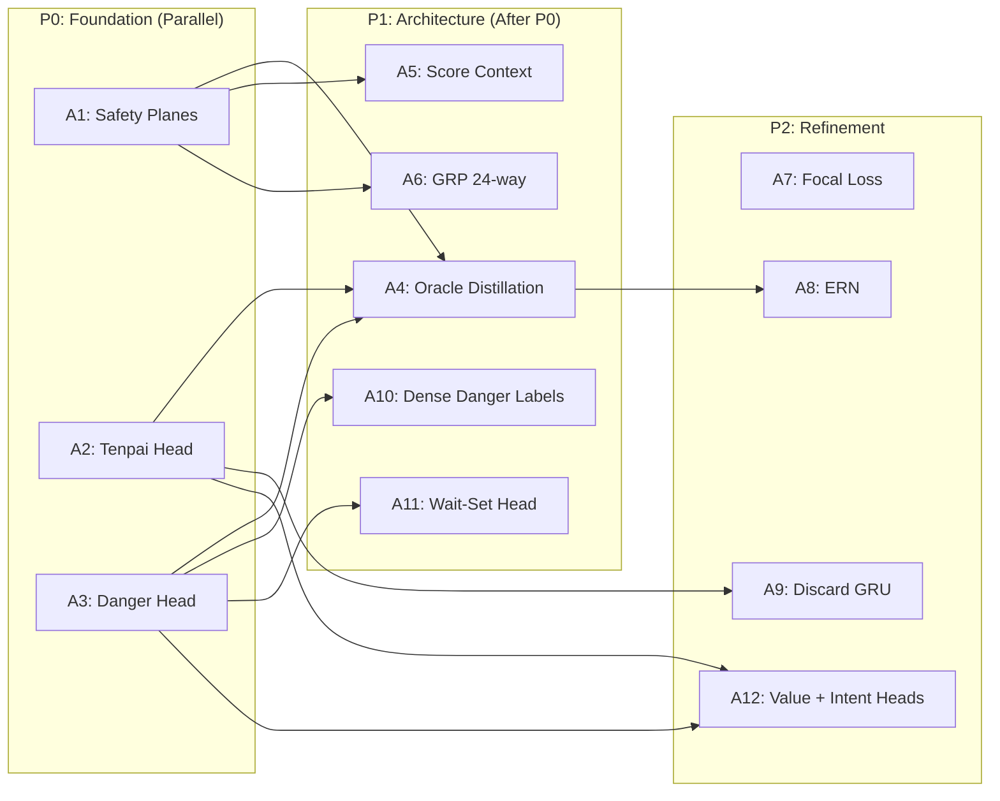

# Hydra Ablation Plan

## Methodology

### Evaluation Protocol

All ablation experiments use the 1v3 duplicate format defined in [INFRASTRUCTURE.md § Rating and Evaluation](INFRASTRUCTURE.md#rating-and-evaluation). The challenger (treatment model) plays against 3 copies of the champion (control model). Each game seed is played 4 times with the challenger rotating through East/South/West/North seats, controlling for positional advantage and tile draw variance.

Rank point distribution: [90, 45, 0, -135] (Tenhou Houou-style uma).

### Sample Sizes

> Sample size tiers and statistical significance requirements are defined in [INFRASTRUCTURE.md § Rating and Evaluation](INFRASTRUCTURE.md#rating-and-evaluation). The tiers used for ablations:

| Tier | Sets | Games (x4 rotations) | Purpose |
|------|------|----------------------|---------|
| Quick | 1,000 | 4,000 | Trend detection during development |
| Full | 50,000 | 200,000 | Publication-quality comparison |
| Ablation | 250,000 | 1,000,000 | Detecting effects < 1 rank-pt/game |

All ablation experiments default to the **full** tier (200K games) unless the expected effect size is small (< 1 rank-pt/game), in which case the **ablation** tier (1M games) is used.

### Statistical Framework

- **Primary test:** Welch's t-test on per-game rank points (p < 0.05).
- **Effect size:** Mahjong has high per-game variance (~sigma = 80 rank pts). Detecting a 1 rank-pt/game improvement at 95% confidence requires ~100K games in 1v3 duplicate format.
- **Reporting:** IQM with bootstrap confidence intervals (Agarwal et al. 2021), as specified in [SEEDING.md § Known Limitations](SEEDING.md#known-limitations).
- **Multiple comparisons:** Bonferroni correction when running > 3 experiments simultaneously (adjusted alpha = 0.05 / k).

### Baseline

All experiments use the Phase 1 BC model (`bc_best.pt`) as the control baseline unless otherwise specified. This is the first checkpoint that passes the Phase 1 readiness gate (discard accuracy >= 65%, SL loss plateaued, placement <= 2.55, deal-in <= 15% — see [INFRASTRUCTURE.md § Phase 1](INFRASTRUCTURE.md#phase-1-behavioral-cloning-supervised) for full criteria).

---

## Priority-Ordered Ablation Queue

| ID | Hypothesis | Control | Treatment | Primary Metric | Sample Size | Gates | Priority |
|----|-----------|---------|-----------|---------------|-------------|-------|----------|
| A1 | Safety planes (ch 62-84) reduce deal-in rate by >= 1pp | 62ch input (no safety planes) | 85ch input (full safety planes) | Deal-in rate | Full (200K) | A2, A3 | P0 |
| A2 | Tenpai aux head improves damaten deal-in avoidance | No tenpai head | Full tenpai head (sigmoid(3)) | Deal-in rate vs non-riichi opponents | Full (200K) | None | P0 |
| A3 | Danger head improves tile-level deal-in avoidance | No danger head | Full danger head with focal loss | Deal-in rate, win/deal-in ratio | Full (200K) | None | P0 |
| A4 | Oracle distillation (KD) improves implicit opponent reading | Skip Phase 2 (BC -> League) | Full 3-stage pipeline (BC -> Oracle -> League) | Avg placement | Ablation (1M) | None | P1 |
| A5 | Uncapped scores + overtake thresholds improve orasu pushing | Mortal-style dual-scale (100K/30K) | Hydra uncapped + gaps + thresholds | 1st place rate in South 4 | Full (200K) | None | P1 |
| A6 | Joint 24-class GRP captures placement correlations better | Scalar GRP (MSE regression) | 24-class GRP (CE over permutations) | Placement-aware decision quality (orasu rank-pt delta) | Full (200K) | None | P1 |
| A7 | Focal loss (gamma=2.0) outperforms weighted BCE for rare events | BCEWithLogitsLoss(pos_weight=10) | Focal BCE (alpha=0.25, gamma=2.0) | Danger head AUC | Quick (4K) | None | P2 |
| A8 | ERN reduces last-tile variance and accelerates convergence | Raw terminal reward | ERN-smoothed reward | Value loss variance, convergence speed | Full (200K) | A4 | P2 |
| A9 | Discard sequence GRU captures temporal patterns channel encoding misses | Channel-only tedashi encoding | Per-opponent GRU + FiLM conditioning | Tenpai AUC (non-riichi), deal-in rate | Full (200K) | A2 | P2 |
| A10 | Dense danger labels (all 34 tiles) outperform sparse (discarded tile only) | Sparse labels, weight 0.05 | Dense labels, weight 0.005 | Danger AUC, deal-in rate, gradient norm ratio | Full (200K) | A3 | P1 |
| A11 | Wait-set head improves multi-threat defense | No wait-set head | Wait-set head (sigmoid(3x34)), weight 0.02 | Deal-in rate (2+ tenpai opponents) | Full (200K) | A3 | P1 |
| A12 | Value + intent heads improve open-hand defense | Tenpai head only | Tenpai + value (5-bin) + intent (8-class), weight 0.02 each | Deal-in rate vs open hands, deal-in by opponent value | Full (200K) | A2, A3 | P2 |

**Execution order:** A1-A3 run in parallel (independent, no gates). A4-A6 and A10-A11 run after A1-A3 results are known. A7 is a quick standalone experiment. A8 requires A4 results. A9 and A12 are P2 refinements that run after P1 results are incorporated.

---

## Per-Experiment Protocol

### Template

Each experiment follows this protocol:

1. **Training duration:** Match the baseline training budget exactly. For BC experiments (A1-A3, A5-A7), train for 3 epochs on the filtered dataset (~480K steps at batch 2048). For pipeline experiments (A4, A8), train through all relevant phases with the same step budgets specified in INFRASTRUCTURE.md.

2. **Controlled variables (hold constant):**
   - Master seed (use 5 seeds per experiment for confidence intervals)
   - Training data (same filtered manifest, same chronological split)
   - Batch size (2048 for BC, 4096 for PPO minibatches)
   - Hardware (RTX PRO 6000 Blackwell)
   - All hyperparameters not under test
   - Evaluation seed bank (`data/eval_seeds.json`)

3. **Measurement:**
   - Quick eval (4K games) every 50K training steps during training for trend monitoring
   - Full eval (200K games) at the end of training for the final comparison
   - Log all metrics to W&B with experiment tags for cross-run comparison

4. **Reporting format:**

   | Metric | Control (mean +/- CI) | Treatment (mean +/- CI) | Delta | p-value | Significant? |
   |--------|----------------------|------------------------|-------|---------|-------------|
   | Avg placement | X.XX +/- 0.XX | X.XX +/- 0.XX | +/- X.XX | 0.XXX | Yes/No |
   | Deal-in rate | XX.X% +/- X.X% | XX.X% +/- X.X% | +/- X.X% | 0.XXX | Yes/No |
   | Win rate | XX.X% +/- X.X% | XX.X% +/- X.X% | +/- X.X% | 0.XXX | Yes/No |
   | 1st place rate | XX.X% +/- X.X% | XX.X% +/- X.X% | +/- X.X% | 0.XXX | Yes/No |

   Use IQM with bootstrap CI (10,000 resamples) for all rank-point metrics.

---

## Experiment Details

### A1: Safety Planes

**Hypothesis:** Explicit safety planes (genbutsu, suji, kabe — channels 62-84) reduce deal-in rate by at least 1 percentage point compared to a model that must learn these patterns implicitly from raw tile counts.

**Control model:** Modify the stem to `Conv1d(62, 256, 3)`. Channels 62-84 are zeroed out during encoding. All other architecture and training identical.

**Treatment model:** Standard 85-channel Hydra architecture with full safety plane encoding.

**Secondary metrics:** Win rate (safety planes should not reduce aggression excessively), danger head AUC (with vs. without precomputed safety features as input), tenpai head AUC.

**Success criterion:** Deal-in rate drops by >= 1pp without win rate dropping by more than 0.5pp. If safety planes reduce deal-in but also reduce win rate significantly, they are a defensive crutch, not a genuine improvement.

### A2: Tenpai Head

**Hypothesis:** An explicit tenpai prediction head improves the model's ability to detect damaten (hidden tenpai) opponents and avoid dealing into them.

**Control model:** Remove the tenpai head entirely. Remove tenpai BCE from the composite loss.

**Treatment model:** Full tenpai head (sigmoid(3)) with BCE loss, coefficient 0.1 (2× the training default of 0.05 — testing whether a stronger tenpai signal improves damaten detection).

**Measurement focus:** Deal-in rate specifically against non-riichi opponents (riichi is trivially detectable). Use the evaluation log to partition deal-ins by whether the winning opponent had declared riichi.

### A3: Danger Head

**Hypothesis:** An explicit per-tile, per-opponent danger head provides stronger learning signal for defensive play than relying solely on policy gradients.

**Control model:** Remove the danger head. Remove danger focal loss from the composite loss.

**Treatment model:** Full danger head (sigmoid(3x34)) with focal BCE (alpha=0.25, gamma=2.0), coefficient 0.2 (4× the training default of 0.05 — testing whether a louder initial danger signal helps PID-Lagrangian λ converge faster).

**Measurement focus:** Win/deal-in ratio (should increase), deal-in rate (should decrease), and qualitative analysis of whether the model avoids dangerous tiles when danger head probability is high.

### A4: Oracle Distillation

**Hypothesis:** The full 3-stage pipeline (BC -> Oracle Distillation -> League) produces a stronger final model than skipping oracle distillation (BC -> League directly).

**Control model:** Train BC model, skip Phase 2, go directly to Phase 3 league self-play.

**Treatment model:** Full 3-stage pipeline as specified in [HYDRA_SPEC.md](HYDRA_SPEC.md) (architecture) and [TRAINING.md](TRAINING.md) (training pipeline).

**This is the most expensive ablation** — it requires training through all phases twice. Use the ablation tier (1M games) for evaluation because the expected effect may be subtle (oracle distillation primarily improves implicit opponent reading, which manifests as small improvements across many game situations rather than large improvements in specific scenarios).

### A5: Score Context Vector

**Hypothesis:** Hydra's uncapped score encoding with pairwise gaps and overtake thresholds produces better orasu (final round) decisions than Mortal's dual-scale encoding.

**Control model:** Replace channels 46-53 with Mortal-style dual-scale encoding: `score / 100000` and `score / 30000` (capped at 1.0). Remove overtake threshold channels.

**Treatment model:** Standard Hydra encoding: uncapped raw scores, relative gaps, overtake thresholds (16-dim score context vector for GRP head).

**Measurement focus:** 1st place rate specifically in South 4 (the round where placement decisions are most critical). Also measure frequency of riichi declarations in South 4 when the player is in 1st place with a narrow lead (should be lower with better score awareness).

### A6: GRP 24-way vs Scalar

**Hypothesis:** Mortal's 24-class joint rank distribution captures inter-player placement correlations that a scalar GRP predictor (Suphx-style) cannot represent.

**Control model:** Replace the 24-class GRP head with a scalar regression head: `MLP(272 -> 256 -> 128 -> 1)`, trained with MSE on expected final game reward.

**Treatment model:** Standard 24-class GRP head with CE loss over the 4! = 24 rank permutations.

**Measurement focus:** Placement-aware decision quality, measured as the rank-point delta in orasu situations where the model's placement is contested (within 8000 points of an adjacent rank).

### A7: Focal Loss vs Weighted BCE

**Hypothesis:** Focal loss (gamma=2.0) produces a better danger head than standard weighted BCE, because deal-in events are rare (~12-15% of rounds) and focal loss down-weights easy negatives.

**Control model:** `BCEWithLogitsLoss(pos_weight=10)` for the danger head.

**Treatment model:** Focal BCE with alpha=0.25, gamma=2.0.

**This is a quick experiment** — only the danger head loss function changes. Use the quick eval tier (4K games) for initial screening, then full eval if the result is promising. Primary metric is danger head AUC on a held-out evaluation set, not downstream play strength.

### A8: Expected Reward Network

**Hypothesis:** Replacing the raw terminal reward in the final kyoku with a predicted expected reward (ERN) reduces value loss variance and accelerates Phase 3 convergence.

**Control model:** Standard terminal reward: placement points [+3, +1, -1, -3] per kyoku.

**Treatment model:** ERN predicts E[placement_points | state, all_hands] for the last kyoku. The ERN prediction replaces the raw terminal reward. The ERN is trained separately on completed games with oracle information, frozen during RL training.

**Measurement focus:** Value loss variance (should decrease by >= 2x), convergence speed (how many PPO updates to reach the same eval strength), and final model quality (should be at least equal to control).

**Gate:** Depends on A4 results. If oracle distillation shows no benefit, the ERN (which also uses oracle information) may not be worth the complexity.

### A9: Discard Sequence Encoder (Tedashi GRU)

**Hypothesis:** A per-opponent GRU over the full discard sequence (with tedashi/tsumogiri flags, call interruptions, and turn index) captures temporal patterns that fixed channel encoding cannot — specifically improving damaten detection and opponent intent reading.

**Control model:** Standard channel-only tedashi encoding (current: per-opponent discard channels with binary tedashi flag and exponential temporal decay).

**Treatment model:** Add a small GRU (hidden_dim=64) per opponent that processes the discard sequence as tokens: `(tile_id, tsumogiri_flag, turn_index, after_call_flag)`. The GRU hidden state `h_i` conditions the tenpai, danger, and wait-set heads via FiLM (feature-wise linear modulation). The base 85×34 tensor is unchanged — the GRU adds a supplementary per-opponent context vector.

**Parameter cost:** ~50K per opponent GRU × 3 opponents + FiLM layers = ~200K total (~1.2% of model). Modest overhead.

**Measurement focus:** Tenpai detection AUC for non-riichi opponents (damaten), deal-in rate vs non-riichi opponents, and qualitative inspection of whether the GRU captures the tsumogiri→tedashi transition pattern described in [OPPONENT_MODELING § 3.4](OPPONENT_MODELING.md#34-tedashi-pattern-detection).

**Resolves:** [Open Question #3](TRAINING.md#open-questions) (Tedashi Encoding: channel-only vs GRU head).

### A10: Dense vs Sparse Danger Labels

**Hypothesis:** Dense counterfactual danger labels (ron-eligibility for all 34 tiles at every timestep, computed from reconstructed opponent hands) produce a substantially better danger head than sparse labels (only the actually-discarded tile gets a label).

**Control model:** Sparse danger labels (current default). Loss weight 0.05.

**Treatment model:** Dense danger labels with furiten-filtered ron-eligibility for all 34 tiles. Loss weight **0.005** (10× lower to compensate for ~10× more active label positions — see [TRAINING § Gradient magnitude warning](TRAINING.md#auxiliary-losses)).

**Measurement focus:** Danger head AUC on held-out evaluation set (should jump significantly), deal-in rate vs non-riichi opponents, deal-in rate vs riichi opponents, and backbone gradient norm ratio (policy head vs danger head — should stay within 2×). Also track win rate to detect over-defensive behavior from gradient magnitude shift.

**Success criterion:** Danger AUC increases by ≥0.05 AND deal-in rate drops by ≥0.5pp AND win rate does not drop by more than 0.3pp. If win rate drops significantly, the gradient magnitude mitigation is insufficient — try stop-gradient or GradNorm (He et al., WWW 2022).

### A11: Wait-Set Belief Head

**Hypothesis:** An explicit wait-set prediction head improves multi-threat defense by providing the backbone with structured information about which tiles each opponent is waiting on.

**Control model:** No wait-set head (current baseline with tenpai + danger only).

**Treatment model:** Wait-set head (sigmoid(3×34)) with focal BCE, coefficient 0.02. Labels from reconstructed hands (Phase 1) or oracle (Phase 2+).

**Measurement focus:** Deal-in rate in states where 2+ opponents are in tenpai simultaneously. Also measure whether danger head AUC improves (shared backbone should benefit from wait-set supervision). Secondary: total auxiliary gradient norm — should remain bounded with combined danger+wait-set heads.

### A12: Value-Conditioned Tenpai + Call-Intent

**Hypothesis:** Adding threat severity (hand value bins) and yaku-plan (call-intent archetypes) predictions improves push/fold decisions against open hands.

**Control model:** Tenpai head only (binary sigmoid(3)).

**Treatment model:** Tenpai + value head (softmax(3×5)) + call-intent head (softmax(3×8)). Both at loss weight 0.02.

**Measurement focus:** Deal-in rate specifically against open-hand opponents (opponents with ≥1 call). Slice by opponent hand value at deal-in: expect fewer deal-ins against mangan+ hands and maintained aggression against cheap hands. Also measure win rate in games with heavy calling opponents.

---

## Gating Structure

**Reading the diagram:** Arrows indicate "results from X inform the design of Y." A1-A3 run first because their results determine what the baseline model looks like for all subsequent experiments. A4-A6 run after P0 results are incorporated. A8 depends on A4 because the ERN only makes sense if oracle distillation is part of the pipeline.

---

## Open Questions from HYDRA_SPEC

[TRAINING.md § Open Questions](TRAINING.md#open-questions) identifies five unresolved design questions. Each maps to a specific ablation experiment:

| Open Question | Ablation | How It Resolves the Question |
|--------------|----------|------------------------------|
| 1. GRP Horizon: final game rank vs next round rank? | A6 | Compares 24-class (final game) vs scalar (can be configured for either). If scalar performs equally, the simpler approach wins. |
| 2. Safety Plane Utility: do explicit suji/kabe planes help? | A1 | Directly tests 62ch (no safety) vs 85ch (full safety). |
| 3. Tedashi Encoding: channel-only vs GRU head? | A9 | Tests a per-opponent GRU over the full discard sequence (with tedashi/tsumogiri flags) vs channel-only encoding. Measures damaten detection AUC and deal-in rate vs non-riichi opponents. |
| 4. Distillation Duration: when does teacher knowledge saturate? | A4 | If oracle distillation shows no benefit (BC -> League equals BC -> Oracle -> League), duration is moot. If it helps, monitor KL divergence curve during Phase 2 training to find the saturation point. |
| 5. Aggression Balance: how to prevent oracle-guided passivity? | A4 + monitoring | Track win/deal-in ratio during Phase 2 training. Healthy range is 2:1 to 2.5:1 per [TRAINING.md](TRAINING.md). If the ratio exceeds 3:1, the agent is too passive. |
