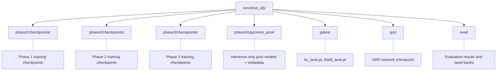

# Hydra Checkpoint Management

> Checkpoint management specification for the Hydra Mahjong AI. Covers checkpoint format, directory structure, save protocol, retention policies, opponent pool versioning, and integrity verification.

## Related Documents

- [INFRASTRUCTURE.md](INFRASTRUCTURE.md) — Data pipeline, training infra, hardware, deployment
- [SEEDING.md](SEEDING.md) — RNG hierarchy, reproducibility, evaluation seed bank
- [TRAINING.md](TRAINING.md) — Training pipeline, phase transitions, loss functions

---

## Checkpoint Management

This section specifies the full checkpoint lifecycle: what is saved, where it lives on disk, how saves are made atomic and verifiable, how checkpoints are retained and pruned across training phases, and how they are loaded at phase transitions. The design prioritizes crash safety (no half-written files), auditability (every checkpoint is hash-verified), and operational simplicity (shell-friendly naming, standard tooling).

### Checkpoint Format

Every checkpoint is a single record serialized via Burn's Record system (NamedMpkFileRecorder or BinFileRecorder). The record is self-describing: it contains the full training configuration, the current phase, and a schema version integer so that future format changes can be handled by explicit migration logic rather than silent breakage.

**Core keys present in every checkpoint (all phases):**

| Key | Content | Notes |
|-----|---------|-------|
| model_record | Student network weights (bf16) | Burn's Module::record(); SE-ResNet backbone + all heads |
| optimizer_record | AdamW state (fp32 momentum buffers) | Burn's Optimizer::record(); see dtype note below |
| scheduler_record | LR scheduler internal state | Cosine annealing position |
| rng_state | Burn backend + system RNG states | See [Checkpoint RNG State](SEEDING.md#checkpoint-rng-state) |
| global_step | Monotonic training step counter | Continuous across the entire run |
| phase | Current phase (1, 2, or 3) | Integer |
| config | Full training configuration | Makes checkpoint self-describing |
| metrics | Phase-specific best metric snapshot | Used for best-checkpoint tracking |
| timestamp | UTC Unix timestamp at save time | Seconds since epoch |
| checkpoint_version | Schema version integer | Incremented on format changes |

**Phase-specific additional keys:**

| Key | Phases | Content |
|-----|--------|---------|
| teacher_state_dict | 2 only | Oracle teacher weights including oracle stem |
| opponent_pool_metadata | 3 only | Current pool roster and version counter |

**Separate files (not inside the training checkpoint):**

- **KL anchor policy:** Saved as a standalone frozen copy alongside each training checkpoint. This is the snapshot of the previous phase's policy used for the KL divergence penalty that prevents catastrophic forgetting.
- **GRP network:** A separate checkpoint file containing the pretrained, frozen game result prediction network. This file never changes during training and is shared across all phases.

**Dtype discipline:** The student model is saved in its native bf16 dtype, halving checkpoint size relative to fp32. AdamW's internal momentum buffers (exp_avg and exp_avg_sq) are always fp32 — this is correct and intentional. Casting optimizer state to bf16 would silently destroy the precision that adaptive learning rates depend on. Burn's Record system preserves tensor dtypes natively; no casting occurs at save time.

**Size estimates:**

| Component | Size | Notes |
|-----------|------|-------|
| Model weights (bf16) | ~33 MB | SE-ResNet 40-block, 256-channel |
| AdamW momentum buffers (fp32) | ~134 MB | Two fp32 copies of all parameters |
| Metadata, config, metrics | ~1 MB | Negligible |
| **Training checkpoint total** | **~170 MB** | Typical Phase 2/3 checkpoint |
| Phase 1 checkpoint | ~330 MB | Includes held-out file cursor and epoch state (see [Early stopping and checkpointing](INFRASTRUCTURE.md#phase-1-behavioral-cloning-supervised)) |
| Inference-only pool model | ~33 MB | Weights only, no optimizer state |

### Directory Structure

All artifacts for a single training run live under a single run directory. The run ID encodes the start timestamp and master seed, making runs sortable by time and traceable to their seed provenance without opening any files.

**Run ID format:** YYYYMMDD_HHmmss_{master_seed_hex8} — for example, 20260115_143022_a1b2c3d4. The timestamp makes runs sortable by start time; the hex seed suffix makes each run traceable to its master seed at a glance.

**Key directories:**

| Directory | Contents | Lifetime |
|-----------|----------|----------|
| phase{N}/checkpoints/ | Training checkpoints with optimizer state | FIFO-pruned to 20 per phase |
| phase3/opponent_pool/ | Stripped inference-only model copies | FIFO-pruned to 20, anchors exempt |
| gates/ | Phase-gate checkpoints (bc_best.pt, distill_best.pt) | Permanent — never pruned |
| grp/ | Pretrained GRP network | Permanent — never modified |
| eval/ | Evaluation results, seed banks | Permanent — append-only |

The gates/ directory holds the irreplaceable phase-gate checkpoints that anchor the entire training pipeline. These are full copies of the best checkpoint from each phase, not symlinks, so they survive FIFO pruning of the per-phase checkpoint directories.

### Naming Convention

Checkpoint filenames are designed for three audiences: automated tooling (predictable parsing), shell one-liners (lexicographic sort equals chronological order), and humans scanning a directory listing (phase and step visible at a glance).

**Training checkpoints:**

| Pattern | Example | Notes |
|---------|---------|-------|
| ckpt_phase{N}_step{global_step:08d}.pt | ckpt_phase2_step00045000.pt | Zero-padded 8 digits; supports up to 99,999,999 steps |

**Symlinks (per-phase convenience pointers):**

| Symlink | Target | Purpose |
|---------|--------|---------|
| latest.pt | Most recently saved checkpoint | Resume after crash |
| best.pt | Best-metric checkpoint for current phase | Quick access to peak performance |

These are true filesystem symlinks, updated atomically after each successful save. They are never FIFO-evicted.

**Gate checkpoints:**

| File | Location | Notes |
|------|----------|-------|
| bc_best.pt | gates/ | Full copy of Phase 1 best checkpoint |
| distill_best.pt | gates/ | Full copy of Phase 2 best checkpoint |

Gate checkpoints are full independent copies, not symlinks. This is deliberate: symlinks into FIFO-pruned directories would eventually dangle.

**Pool models:**

| Pattern | Example | Notes |
|---------|---------|-------|
| pool_v{version:04d}_step{step:08d}.pt | pool_v0042_step00120000.pt | Monotonic version counter; inference-only weights |

**Sidecar files:**

| Suffix | Content | Purpose |
|--------|---------|---------|
| .sha256 | Hex digest + filename (GNU coreutils format) | Integrity verification via sha256sum -c |
| .meta.json | Pool model metadata (version, ratings, etc.) | Pool management without deserializing the model |

**Shell convenience:** All naming patterns are designed so that simple shell commands produce useful output. Listing checkpoints in chronological order requires nothing more than lexicographic sort, since zero-padded step numbers and the ckpt_ prefix guarantee correct ordering.

### Save Protocol

Every checkpoint write follows an 8-step atomic save sequence. The goal is to guarantee that the on-disk state is always either a complete, valid checkpoint or nothing at all — never a half-written file that could silently corrupt a resumed training run.

**The 8-step atomic save sequence:**

| Step | Action | Why |
|------|--------|-----|
| 1 | Serialize checkpoint dict to in-memory byte buffer | Catches serialization errors before touching disk |
| 2 | Compute SHA-256 digest of the byte buffer | Integrity baseline computed once, used for sidecar |
| 3 | Write byte buffer to {target_path}.tmp on same filesystem | Temporary file; invisible to checkpoint discovery |
| 4 | Flush Python buffers to OS | Ensures Python write buffers are handed to the kernel |
| 5 | fsync file descriptor to push OS buffers to disk | Ensures data is durable on physical storage |
| 6 | Atomic rename .tmp to final path | POSIX guarantee: rename on same filesystem is atomic |
| 7 | Write .sha256 sidecar with hex digest | GNU coreutils format for offline verification |
| 8 | fsync parent directory | Ensures the rename (directory entry update) survives power failure |

**Why all 8 steps matter:** PyTorch's Distributed Checkpoint Protocol covers steps 3 through 6. PyTorch Lightning uses an in-memory BytesIO buffer (step 1). No major training framework computes SHA-256 digests on training checkpoints (step 2) or performs a directory fsync after rename (step 8). Hydra combines all eight steps because the cost is negligible (a few milliseconds of CPU time and one extra syscall) and the protection is comprehensive.

**Failure mode analysis:** A crash between steps 6 and 7 leaves a valid, complete checkpoint on disk with a missing or stale SHA-256 sidecar. This is the only expected partial-failure window. The checkpoint loader treats a missing sidecar as a warning (log and proceed), not a hard error, so this scenario does not block training resumption. A crash before step 6 leaves only the .tmp file, which checkpoint discovery ignores.

### Per-Phase Retention Policy

Each training phase has its own checkpoint directory with independent retention settings. The policy balances disk budget against the need to roll back to earlier states if training diverges.

| Parameter | Phase 1 (BC) | Phases 2-3 (RL) |
|-----------|-------------|-----------------|
| Save interval | Every 10,000 training steps | Every 500 PPO update steps |
| Max checkpoints (FIFO) | 20 | 20 |
| Protected from FIFO | best.pt target, gate checkpoint | best.pt target, gate checkpoints |
| "Best" metric | Lowest held-out cross-entropy loss | Highest conservative rating (mu - 3*sigma) |
| Gate checkpoint | bc_best.pt (copied to gates/) | distill_best.pt (copied to gates/) |
| Disk budget (worst case) | 20 x 330 MB = ~6.6 GB | 20 x 170 MB = ~3.4 GB |

**FIFO eviction:** When the checkpoint count in a phase directory exceeds 20, the oldest non-protected checkpoint is deleted. "Protected" means either: the checkpoint is the current target of the best.pt symlink, or the checkpoint has been copied to gates/ as a phase-gate artifact. Everything else is fair game for eviction.

**best.pt tracking:** After every save, the new checkpoint's metric is compared against the current best. If improved, the best.pt symlink is updated to point to the new checkpoint. The metric used depends on the phase: Phase 1 uses held-out cross-entropy loss (lower is better); Phases 2 and 3 use the conservative OpenSkill rating (mu minus three sigma), as defined in the [Rating and Evaluation](INFRASTRUCTURE.md#rating-and-evaluation) section.

### Opponent Pool Versioning

During Phase 3 league self-play, the training agent plays against a pool of past versions of itself (see the [opponent pool table in Phase 3](INFRASTRUCTURE.md#phase-3-league-self-play-ppo)). This subsection specifies how pool models are created, versioned, rated, cached, and pruned.

**Pool composition** (canonical definition in [TRAINING.md § Phase 3](TRAINING.md#phase-3-league-training)):

| Category | Weight | Source |
|----------|--------|--------|
| Current self (all 4 seats) | 50% | Live training weights |
| Random pool checkpoint | 30% | Uniformly sampled from pool roster |
| Phase 2 baseline (frozen) | 20% | distill_best.pt — never updated |

**Version assignment:** A monotonic integer counter is incremented each time a new model is promoted into the pool. Version numbers never reset or recycle, even across training restarts. This provides a total ordering of pool models that is independent of step numbers or wall-clock time.

**Promotion protocol:** Every save_interval (500 PPO update steps), the current training model's weights are stripped to inference-only form (no optimizer state, no scheduler state) and added to the opponent pool as a new versioned entry. The stripped copy is approximately 33 MB — one-fifth the size of a full training checkpoint.

**Rating integration:** New pool entries are rated using the OpenSkill PlackettLuce system described in the [Rating and Evaluation](INFRASTRUCTURE.md#rating-and-evaluation) section. A newly promoted model inherits its mu (skill estimate) from the current training model's rating but has its sigma (uncertainty) inflated to the larger of the current sigma or one-third of the default sigma. This sigma inflation ensures the new entry is sampled frequently for evaluation games until its rating stabilizes.

**GPU cache:** The 5 most recently used pool models are kept resident in GPU memory as bf16 inference copies (LRU eviction). This avoids repeated CPU-to-GPU transfers for frequently matched opponents. The cache capacity matches the value documented in the [opponent pool table in Phase 3](INFRASTRUCTURE.md#phase-3-league-self-play-ppo).

**Sidecar metadata:** Each pool model has a companion .meta.json file containing: version number, source global step, source phase, current rating mu and sigma, total games played, win rate, and promotion timestamp (UTC). This metadata enables pool management decisions (eviction, sampling) without deserializing the full model weights.

**Frozen anchors:** bc_best.pt and distill_best.pt are permanent members of the opponent pool. They are never evicted by FIFO pruning, never re-rated (their ratings are fixed at promotion time), and never updated. They serve as fixed reference points that anchor the rating scale and prevent catastrophic forgetting.

**FIFO eviction:** When the pool directory exceeds 20 model files, the oldest non-anchor entry is deleted. Before deletion, the model's full rating history (mu, sigma, games played, win rate) is appended to a pool eviction log for post-hoc analysis. The .meta.json sidecar is also deleted.

**Deterministic selection:** Pool opponent selection uses its own SeedSequence child, as described in the [Phase Transition Seeding](SEEDING.md#phase-transition-seeding) section. Given the same seed and the same pool contents (same models at the same FIFO positions), the same opponent matchup sequence is produced. This enables controlled ablations where only the training policy changes while the opponent schedule remains fixed.

### Phase Transition Loading

Phase transitions are the most delicate moments in the training pipeline. The student network architecture is identical across all three phases, but the surrounding infrastructure — optimizer, scheduler, teacher model, KL anchor, opponent pool — changes at each boundary. This subsection specifies the exact loading procedure at each transition, extending the carry/reset table in [INFRASTRUCTURE.md § Phase Transitions](INFRASTRUCTURE.md#phase-transitions) with checkpoint-specific details.

**Phase 1 to 2 transition** (cross-reference: the [Phase 1 → 2 procedure in Phase Transitions](INFRASTRUCTURE.md#phase-transitions)):

| Step | Action | Rationale |
|------|--------|-----------|
| 1 | Load bc_best.pt with strict model loading | Architecture is identical; strict mode catches any key mismatch |
| 2 | Copy student weights into teacher; initialize random oracle stem on teacher | Teacher starts as a student clone plus new oracle capacity |
| 3 | Freeze teacher: eval mode, no gradients, bf16 cast | Teacher provides signal only — must not receive gradient updates |
| 4 | Freeze copy of Phase 1 policy head as KL anchor | Prevents catastrophic forgetting of BC knowledge during RL |
| 5 | Discard optimizer and scheduler state from checkpoint | Stale BC momentum is counterproductive for RL; create fresh AdamW with warmup |
| 6 | Re-seed all RNG from Phase 2 SeedSequence child | See [Phase Transition Seeding](SEEDING.md#phase-transition-seeding) |
| 7 | Reset best-metric tracker; begin Phase 2 training loop | Phase 2 uses a different "best" metric than Phase 1 |

**Phase 2 to 3 transition** (cross-reference: the [Phase 2 → 3 procedure in Phase Transitions](INFRASTRUCTURE.md#phase-transitions)):

| Step | Action | Rationale |
|------|--------|-----------|
| 1 | Load distill_best.pt with strict model loading | Architecture is identical; strict mode catches any key mismatch |
| 2 | Verify feature dropout masks have reached 0.0 | Safety check: oracle features must be fully ablated before self-play |
| 3 | Discard teacher model and oracle critic | No longer needed — Phase 3 is pure self-play |
| 4 | Initialize opponent pool with distill_best.pt and bc_best.pt as frozen anchors | Pool starts with two fixed reference opponents |
| 5 | Freeze Phase 2 policy as new KL anchor | Prevents catastrophic forgetting of distillation knowledge |
| 6 | Discard optimizer and scheduler; create fresh AdamW with warmup | Same rationale as Phase 1 → 2: stale momentum harms new objective |
| 7 | Re-seed all RNG from Phase 3 SeedSequence child | See [Phase Transition Seeding](SEEDING.md#phase-transition-seeding) |
| 8 | Initialize OpenSkill ratings for all pool members; reset best-metric tracker | Rating system starts fresh for the league |

**Strict loading:** Both transitions use strict model loading, meaning every key in the checkpoint must match exactly one key in the model, and vice versa. This is safe because the student architecture is identical across all three phases — same ResBlock count, same channel width, same head structure. A key mismatch at transition time indicates a code bug, not an expected architecture change, and should fail loudly.

**Teacher isolation:** The teacher model in Phase 2 is a separate instantiation with its own state_dict. It is never mixed into the student's state_dict and has no entry in the student's optimizer. By default, the teacher is discarded at the Phase 2 -> 3 transition and no cleanup of the student checkpoint is needed. **If PGOI is enabled** ([SEARCH_PGOI.md](SEARCH_PGOI.md)), the teacher's stem state_dict is preserved in the Phase 3 checkpoint for inference-time oracle queries.

### Checkpoint Integrity

Every checkpoint is protected by a SHA-256 digest computed at save time and verified at load time. The integrity system is designed to catch silent corruption (bit-rot, incomplete writes, storage errors) while remaining compatible with standard Unix tooling.

**SHA-256 sidecar format:** Each checkpoint file has a companion .sha256 file containing the hex digest and filename in GNU coreutils format. This means the sidecar is directly verifiable using the standard sha256sum -c command — no custom tooling required for offline auditing or batch verification of an entire checkpoint directory.

**Verification on load:**

| Sidecar state | Digest match | Loader behavior |
|---------------|-------------|-----------------|
| Present | Matches | Load proceeds normally |
| Present | Mismatch | Abort with clear error; do not deserialize |
| Missing | N/A | Log warning; load proceeds (graceful degradation) |

The missing-sidecar case enables backward compatibility with checkpoints created before the integrity system was added, or recovery from the narrow failure window described in the Save Protocol section (crash between steps 6 and 7).

**Corruption recovery for training checkpoints:** If the latest checkpoint fails integrity verification, the loader automatically falls back to the previous FIFO-retained checkpoint. This fallback chain extends through all retained checkpoints (up to 20). If every retained checkpoint is corrupt — an extremely unlikely scenario requiring sustained storage failure — the training run aborts with a diagnostic message listing every checkpoint attempted and the nature of each failure.

**Gate checkpoint verification:** bc_best.pt and distill_best.pt receive stricter treatment. These gate checkpoints are verified at every phase transition load, and there is no fallback: a corrupt gate checkpoint causes a hard failure. This is correct because gate checkpoints are irreplaceable — they represent the single best model from a completed training phase. A corrupt gate checkpoint means the upstream phase must be re-run, and silently loading a damaged model would produce subtly wrong downstream training that is far more expensive to diagnose than an immediate failure.

**Manual verification:** Because the .sha256 sidecars use standard GNU coreutils format, any checkpoint directory can be audited offline with a single shell command. This is useful for verifying checkpoint integrity after copying runs between machines, restoring from backup, or archiving completed experiments.
