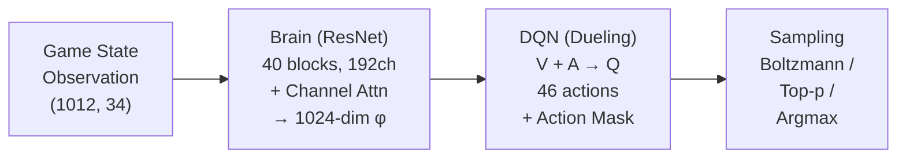

# Community Insights: Mahjong AI Discussions

Research compilation from Reddit, Japanese blogs, RL communities, and public AI analysis discussions. Focused on insights directly relevant to Hydra's development.

---

## 1. Mortal Strengths & Weaknesses (r/Mahjong, r/mahjongsoul)

### Confirmed Strengths

| Strength | Evidence | Source |
|----------|----------|--------|
| **~7 dan level play** | Better than vast majority of Tokujou players on Tenhou | [r/Mahjong](https://www.reddit.com/r/Mahjong/comments/14ex61l/) |
| **Error detection** | Consistent at identifying clearly bad discards — large eval differences = real mistakes | Same thread |
| **Free & accessible** | Supports Tenhou, Mahjong Soul, and Riichi City log analysis | Multiple sources |
| **4th-place avoidance** | Trained on uma distribution 90/45/0/−135 (similar to MJS ranked) | Mortal documentation |

### Confirmed Weaknesses

| Weakness | Details | Hydra Relevance |
|----------|---------|-----------------|
| **Cannot explain reasoning** | No interpretable output — users must infer "why" from raw Q-values | Hydra should consider explainability hooks |
| **Poor future planning** | Struggles with "reading the wall" and multi-turn planning; no lookahead search | Opportunity for search-augmented approach |
| **Sub-optimal multi-threat defense** | When multiple opponents push, may pick tiles safe for now but dangerous if second riichi appears | Multi-player defense modeling gap |
| **Conservative bias** | Recommends folding more often than NAGA or Akochan in equivalent spots | Different training objectives lead to different playstyles |
| **Rule-based agari guard required** | Neural network occasionally fails at basic winning decisions; heuristic override is needed | Raw NN may miss trivial game logic |
| **Not a "source of truth"** | Unlike Stockfish in chess, many decisions are preference-based; high-level players frequently disagree | Mahjong has inherently multiple "correct" plays |
| **Fixed uma optimization** | Trained for one specific point spread; doesn't adapt to different tournament rules | Hydra should parameterize scoring context |
| **No opponent modeling** | Treats all opponents identically; cannot exploit tendencies or detect damaten | Core gap Hydra aims to fill |

### Key Quote
> "In Mahjong, there are many different perfectly playable options. Mortal may have preferences that match with certain high-level players' decisions and not with others." — r/Mahjong community

---

## 2. NAGA vs Mortal Comparison

### NAGA Overview
- **Level**: 10 dan on Tenhou (highest rank achieved by AI)
- **Cost**: Paid service (550–2200 yen/month)
- **Versions**: 5+ distinct versions with different playstyles (Menzen-focused, Furo-heavy, Defensive, Hybrid)
- **Key advantage**: Provides detailed, human-readable analysis for each discard

### Head-to-Head Differences

| Dimension | Mortal | NAGA |
|-----------|--------|------|
| **Playstyle** | More conservative/defensive | More aggressive push tendencies |
| **Riichi decisions** | Hesitant in marginal spots | Strongly favors riichi when +EV |
| **Kan decisions** | Mortal and NAGA frequently disagree on kan timing | NAGA tends more toward aggressive kan |
| **Accessibility** | Free, open-source | Paid, proprietary |
| **Explanation** | None (raw values only) | Human-readable analysis per discard |
| **Calibration** | 7 dan equivalent | 10 dan, with NAGA Rating metrics |
| **Push/fold** | Conservative — values position safety | Calibrated to 4th-avoidance at 7-dan rates |

### NAGA Rating System Limitations
- NAGA's "match%" and "bad move rate" metrics are imperfect proxies for actual strength
- Suphx (9–10 dan) only scored match% of 74.4 and average NAGA Rating of 86.3 — stats comparable to average 7-dan in 2020
- Tencent's LuckyJ hit 10 dan with bad move rates >10% in many games
- **Takeaway**: Agreement with a specific AI is a poor metric for absolute strength

Source: [riichinotes.blogspot.com](https://riichinotes.blogspot.com/2023/06/reviewing-my-first-50-houou-games-with.html)

---

## 3. Push/Fold Mathematics (r/Mahjong)

### Poker Pot Odds Framework for Riichi
A community member adapted poker pot odds into a riichi mahjong EV estimation framework:

- **Round EV** = expected point outcome per hand (not per game)
- **Decision**: Push if Round EV > 0 in flat positions (East 1–3)
- **Deal-in rate thresholds**: Based on tile danger level (suji, kabe, genbutsu)
- **Good shape**: Tenpai with 5+ tiles acceptance → more pushable
- **Bad shape**: Tenpai with ≤4 tiles → requires higher reward to justify

### Factors Beyond Round EV
NAGA accounts for 4th-avoidance but base math starts with Round EV. Human exceptions:
1. **Exploitative folding** — opponent tendency reads
2. **Lateral movement** — how points flow between other players
3. **Negative rates** — specific statistical disadvantages in the current position

**Hydra Relevance**: Score-aware and placement-aware adjustments on top of base tile EV is exactly what makes an AI jump from "good" to "great." This is a confirmed gap in Mortal.

Source: [r/Mahjong Push/Fold thread](https://www.reddit.com/r/Mahjong/comments/17rgvq3/)

---

## 4. AI Analysis Best Practices (Community Guide)

### How to Properly Use AI Review
Key insights from the [Riichi City analysis guide](https://gamesoftrobo.ghost.io/untitled-6/):

1. **Focus on process, not results**: AI makes "correct" moves that sometimes deal into hands — that's not a mistake
2. **Don't aim for 100% accuracy**: Mortal's authors warn against using accuracy % as skill metric; 100% match = cheating red flag
3. **Supplement with human reasoning**: AI can't explain "why" — use community and theory to fill gaps
4. **Efficiency vs Value trade-off**: Mortal often picks most efficient wait, but humans may correctly choose less efficient wait for higher point value (dora targeting)
5. **Hindsight bias is the enemy**: Evaluate decisions with info available at decision time

### Mortal Analysis Modes
- **"Last Avoidance Type" (ラス回避)**: Optimized for Mahjong Soul ranked play
- **Multiple model versions**: v1 through v4 with evolving architecture
- **Integration**: Built into Riichi City as official AI analysis tool (v4)

---

## 5. Imperfect Information Game RL (r/reinforcementlearning)

### Approaches Discussed

| Approach | Description | Applicability to Mahjong |
|----------|-------------|-------------------------|
| **CFR (Counterfactual Regret Minimization)** | Standard for poker; computes Nash equilibria | Game tree too large for direct CFR in mahjong |
| **Standard RL (DQN, PPO, A2C)** | Train against static/self environment | What Mortal uses (DQN) |
| **MARL (Multi-Agent RL)** | Full multi-agent training | Expensive but theoretically ideal |
| **Opponent modeling** | Train against hardcoded/top-tier/human policies | Avoids full MARL complexity |

### ReBeL (Meta AI)
- **Paper**: [arxiv.org/abs/2007.13544](https://arxiv.org/abs/2007.13544)
- **Key innovation**: Combines deep RL + search for imperfect information games
- **Concept**: Expands "state" to probabilistic beliefs about actual state based on common knowledge
- **Limitation**: Proven convergent only for 2-player zero-sum; mahjong is 4-player
- **Hydra Relevance**: Belief-state approach for opponent hand estimation aligns with Hydra's opponent modeling goals

---

## 6. PPO Self-Play Challenges (r/reinforcementlearning)

### The "Fearful Agent" Problem
When using PPO with self-play, a critical failure mode occurs:

**Symptoms**:
- Agent becomes overly conservative after experiencing losses
- Focuses entirely on loss avoidance rather than winning
- In mahjong terms: folds everything, never pushes for wins

**Root Causes**:
1. **Large reward disparity** — heavy penalties for losing overwhelm heuristic rewards
2. **Catastrophic forgetting** — agent forgets winning tactics as it adapts to specific opponents
3. **Sparse rewards** — long games (1000+ actions) need heuristics but these can break zero-sum balance

**Community Solutions**:

| Solution | Description |
|----------|-------------|
| **Opponent pool** | Sample from past N network states, not just latest | 
| **Random opponents** | Periodically play vs random to maintain basic competency |
| **Reward normalization** | Balance gradual heuristics with win/loss bonuses |
| **Asymmetric bonuses** | Bonus only to winner; no penalty to loser |
| **Weight freezing** | Freeze opponent weights during training passes |
| **Increased exploration** | Higher entropy to discover new winning strategies |

**Hydra Relevance**: Mortal already has catastrophic forgetting issues documented in [GitHub Discussion #64](https://github.com/Equim-chan/Mortal/discussions/64). The opponent pool and reward normalization techniques are directly applicable.

Source: [r/reinforcementlearning](https://www.reddit.com/r/reinforcementlearning/comments/1c2ym5s/)

---

## 7. Self-Play Training Best Practices (HuggingFace Deep RL Course)

### Key Hyperparameters for Opponent Pool

| Parameter | Effect |
|-----------|--------|
| `window` | Number of saved opponent policies. Larger = more diverse training |
| `save_steps` | Steps between saves. Higher = wider skill range in pool |
| `play_against_latest_ratio` | Probability of facing current vs historical policy |
| `swap_steps` | How often opponents rotate |

### ELO as Training Metric
- **Why ELO > cumulative reward**: In adversarial games, reward depends on opponent skill. ELO measures relative skill in zero-sum context
- **K-factor**: Maximum adjustment per game; controls rating volatility
- **Self-correcting**: Better opponents yield more points on victory

### Core Trade-off
> Balance final policy's **skill level** and **generality** against **training stability**.

Training against slowly-changing adversaries = more stable but risk of overfitting to specific behaviors.

Source: [HuggingFace Deep RL Course Unit 7](https://huggingface.co/learn/deep-rl-course/unit7/self-play)

---

## 8. Japanese Community Sources

### Shanten Algorithm (Qiita — tomohxx)

The standard shanten algorithm used by Mortal and most other mahjong AIs:

**Mathematical Foundation**:
- Shanten S(h) = T(h) − 1, where T = minimum tile exchanges to tenpai
- Distance function: d(h, g) = ½ Σ(|h_i − g_i| + h_i − g_i) over 34 tile types
- Special-case formulas for Chiitoitsu (7 pairs) and Kokushi (13 orphans)

**DP Algorithm for Regular Hands**:
1. Break hand into 4 groups (man, pin, sou, honors)
2. Precompute partial replacement numbers for all possible suit combinations (~5^9 states)
3. Merge groups via DP: t^(n+1)_m = min over splits of meld counts
4. Result: t^(3)_4 = shanten for 4 melds + 1 pair

**Performance**: O(1) after precomputation; independent of hand size or shanten value.

Source: [Qiita (tomohxx)](https://qiita.com/tomohxx/items/75b5f771285e1334c0a5), [GitHub](https://github.com/tomohxx/shanten-number)

### Japanese Mahjong AI Development Blog (TadaoYamaoka)

An independent developer documenting their attempt to build a mahjong AI from scratch using PPO:

**Key Technical Points**:
- Uses **PPO** (vs Mortal's DQN) as the baseline algorithm
- **Reward variance reduction**: Value model uses "global information" (including opponent private tiles) to reduce noise from random initial hands
- **Zero-sum property**: Loss function designed so sum of 4 players' predicted values = 0
- Referenced **LuckyJ** (Tencent's unpublished AI) which uses search-based techniques for higher performance
- **Search excluded from baseline** due to implementation complexity

**Hydra Relevance**: Confirms PPO as viable alternative to DQN for mahjong; validates reward variance reduction with global info.

Source: [TadaoYamaoka's blog](https://tadaoyamaoka.hatenablog.com/entry/2023/10/03/233925)

### Mortal User Reviews (note.com, ai-bo.jp)

Japanese community consensus:
- Mortal rated as "excellent" (優秀) by regular NAGA users
- Primary value: Free + supports Mahjong Soul log import
- Primary frustration: No explanation of reasoning (users must infer intent)
- Comparison verdict: NAGA has higher analysis power but costs money

---

## 9. Mortal Architecture Deep Dive (DeepWiki)

### System Architecture Summary

### Training Loss Components
1. **DQN Loss**: MSE(predicted Q, Monte Carlo Q-targets)
2. **CQL Loss**: logsumexp(Q) − mean(Q) — prevents overestimation in offline mode
3. **Auxiliary**: Next rank prediction — stabilizes feature learning

### Version Evolution

| Version | Feature Dim | Activation | Key Change |
|---------|-------------|------------|------------|
| v1 | VAE (μ, logσ) | ReLU | Variational sampling |
| v2 | 512 direct | Mish | Removed VAE, added BatchNorm |
| v3 | 256 direct | Mish | Reduced dimensions |
| v4 | Combined | Mish | Unified output layer |

### Distributed Training
- **Client-server architecture**: Clients run self-play, submit replays; server trains
- **Protocol**: get_param → self_play → submit_replay → drain → submit_param
- **Throughput**: Up to 40K hanchans/hour with Rust emulator + Python inference

### 1v3 Duplicate Evaluation
- Challenger plays vs 3 copies of champion AI
- 4 games per set: challenger rotates through every seat with same random seed
- Eliminates luck variance; isolates skill difference
- Selection criterion: model must improve **both** avg_pt and avg_rank simultaneously

---

## 10. Defense & Betaori Analysis

### Standard Defense Framework (riichi.wiki, community)

**Tile Safety Hierarchy** (from safest to least safe):
1. **Genbutsu**: 100% safe (already discarded by riichi declarer)
2. **Suji**: ~94% safe against riichi
3. **Kabe (wall)**: Safe when all 4 copies of connecting tiles are visible
4. **Honor tiles**: Variable safety based on game state
5. **Middle tiles (4-5-6)**: Most dangerous

### AI Defense Limitations
- **No damaten detection**: AIs can't reliably detect hidden tenpai (opponent waiting without riichi)
- **Multi-player defense**: Folding against one opponent may push dangerous tiles toward another
- **Score context**: When to push depends heavily on current scores/placement — Mortal uses fixed uma

### Push/Fold Decision Framework
Community consensus ("2 of 3" rule):
1. Am I in **tenpai**?
2. Do I have a **good wait** (5+ tiles)?
3. Is my hand **high value**?

If 2 of 3 → push. Otherwise → fold. Additional factors: round number, current scores, danger level of tiles to push.

---

## 11. Mahjong AI Landscape Summary

| AI | Level | Architecture | Open Source | Analysis | Key Trait |
|----|-------|-------------|-------------|----------|-----------|
| **Mortal** | ~7 dan | SE-ResNet + Dueling DQN | ✅ Yes | Free log review | Best open-source option |
| **NAGA** | 10 dan | Unknown | ❌ No | Paid, detailed | Multiple playstyle versions |
| **Suphx** | 10 dan | ResNet+Oracle | ❌ No | Replay viewing only | First to reach 10 dan |
| **Akochan** | ~8 dan | Unknown | ✅ Yes | Reviewer tool | Older, somewhat outdated |
| **Bakuuchi** | 9 dan | Unknown | ❌ No | None | Legacy, outperformed |
| **LuckyJ** | 10 dan | PPO + Search | ❌ No | None | Uses search (unpublished) |
| **Goku** | 7 dan | Unknown | Partial | Replay viewing | - |

---

## 12. Key Takeaways for Hydra

### Confirmed Gaps in Existing AIs (Opportunities for Hydra)

1. **Opponent Modeling**: No existing AI models opponent tendencies or detects damaten
2. **Score/Placement Awareness**: Mortal uses fixed uma; dynamic adjustment is an open problem  
3. **Multi-Turn Planning**: No AI uses lookahead search for mahjong decisions (LuckyJ may, unpublished)
4. **Explainability**: All AIs are black boxes; interpretable decision factors would be novel
5. **Multi-Player Defense**: Simultaneous defense against 2+ threats is poorly handled
6. **Adaptive Playstyle**: NAGA offers multiple styles but doesn't adapt dynamically per-game

### Training Methodology Recommendations

1. **PPO over DQN**: TadaoYamaoka's work and community discussion suggest PPO is viable and may be preferable for policy-based mahjong AI
2. **Reward Variance Reduction**: Use global info in value model to distinguish skill from luck
3. **Opponent Pool**: Essential for preventing catastrophic forgetting and the "fearful agent" problem
4. **CQL for Offline**: Mortal's CQL integration prevents Q-value overestimation on unseen actions
5. **ELO Tracking**: Better progress metric than cumulative reward during self-play training
6. **1v3 Duplicate**: Gold standard evaluation method; eliminates variance

### Community Red Flags

- **100% AI accuracy = cheating indicator**: Mortal is used for real-time assistance (Akagi tool); this is a known anti-cheat concern
- **Playstyle subjectivity**: No single "correct" play in many mahjong situations; AI agreement is a weak proxy for quality
- **AI metrics are imperfect**: NAGA Rating, match%, and bad move rate don't reliably predict actual playing strength
