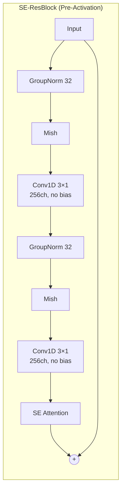
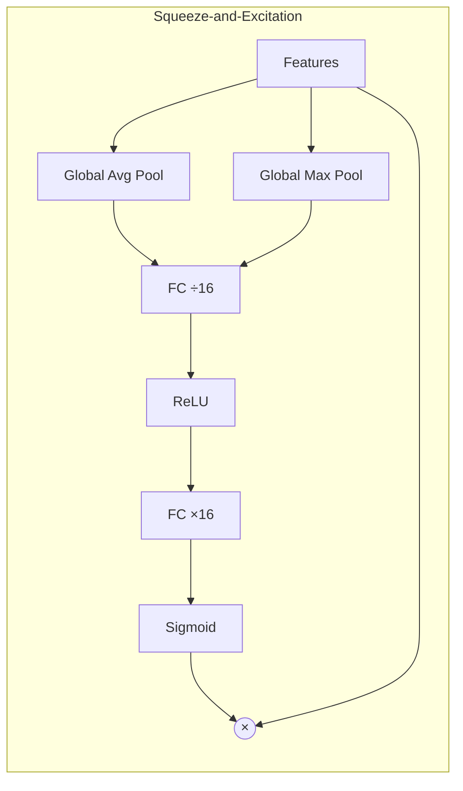
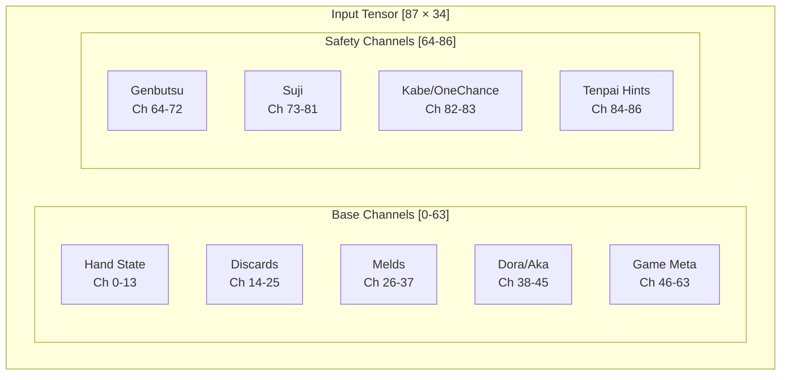
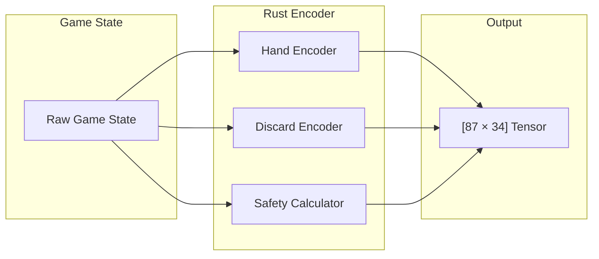
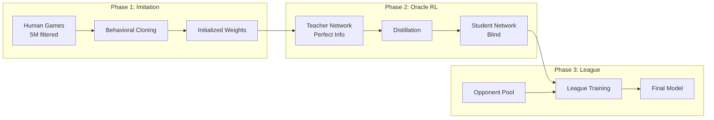
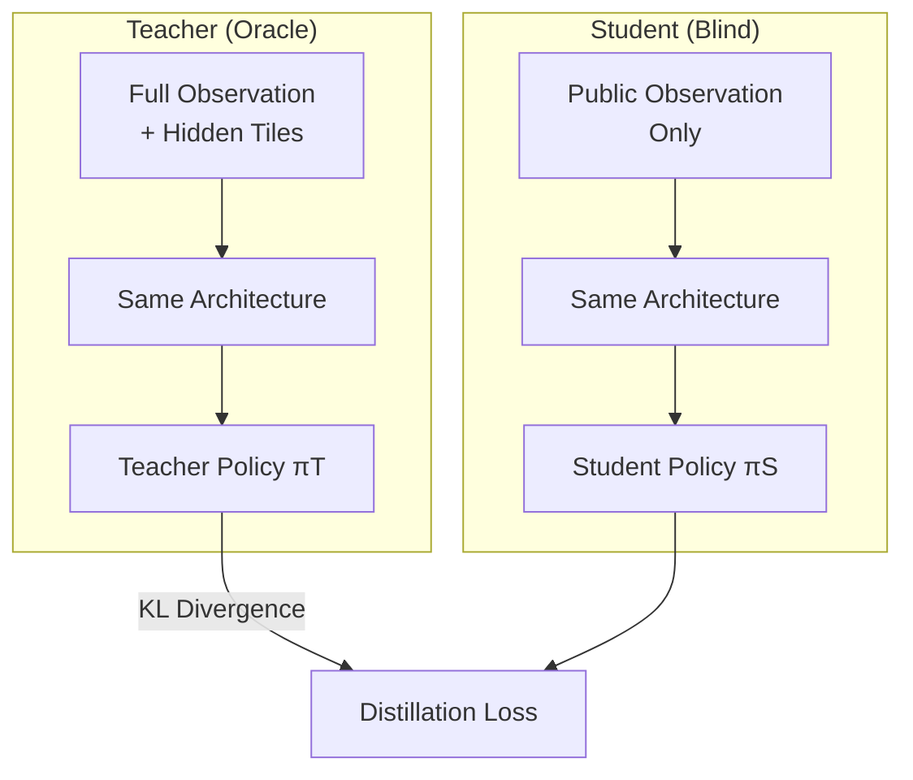
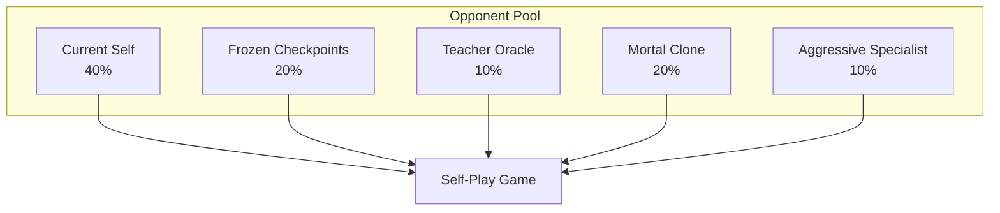
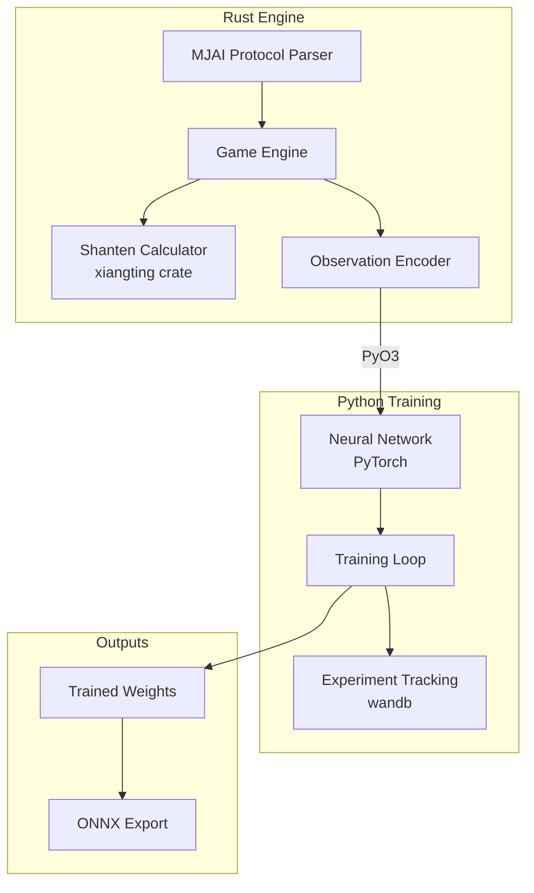

# Hydra Architecture Specification

A Riichi Mahjong AI designed to surpass current SOTA (Mortal, Suphx, NAGA) through a combination of proven techniques and novel opponent-aware features.

---

## Executive Summary

| Metric | Target | Justification |
|--------|--------|---------------|
| **Parameters** | ~40M | Detailed breakdown: 70K stem + 32M backbone + 8M heads (see Parameter Budget) |
| **Inference VRAM** | <1.5GB | Fits 8GB consumer GPUs easily |
| **Inference Latency** | <15ms | Well under 50ms limit |
| **Training VRAM** | <20GB active | Fits 98GB with batch 4096+ |
| **Target Strength** | Beat Mortal | Tenhou 10-dan+ |

> **Note on parameter count:** The original unified spec targeted 22–24M parameters based on a rough per-block estimate of ~402K. The detailed architectural breakdown in the architecture sub-documents shows the actual count is closer to ~40M, primarily because the 40-block SE-ResNet backbone alone accounts for ~32M parameters. The ~40M figure is authoritative.

---

## Design Principles

1. **Proven over Novel** — Prioritize techniques with published evidence (Suphx, Mortal). Novel additions (safety planes, danger head) are grounded in Mahjong theory, not speculation.
2. **Practical Constraints** — Must fit <8GB inference VRAM, <50ms latency.
3. **Clean IP** — No Mortal-derived code (AGPL restriction). All code written from scratch, all dependencies MIT/Apache licensed.
4. **Rust + Python Hybrid** — Fast game engine in Rust with PyO3 bindings, flexible training loop in Python/PyTorch.

---

## Architecture Overview

Hydra uses a **Unified Multi-Head SE-ResNet** architecture. A single deep convolutional backbone extracts features from the game state, and five specialized heads branch from the shared latent representation to produce all outputs simultaneously.

The input observation tensor has shape `[Batch × 87 × 34 × 1]`, encoding 87 feature channels across the 34 tile types. A convolutional stem projects this into 256 channels using a 3×1 kernel. The representation then flows through 40 pre-activation SE-ResNet blocks — each applying GroupNorm, Mish activation, two 3×1 convolutions, and a squeeze-and-excitation attention gate — producing a shared latent tensor of shape `[B × 256 × 34]`. No pooling is applied anywhere in the backbone, preserving the full 34-tile spatial geometry.

From this shared representation, five output heads operate in parallel: the Policy Head selects the next action, the Value Head estimates expected round outcome, the GRP Head predicts final game placement distribution, the Tenpai Head estimates opponent tenpai probabilities, and the Danger Head estimates per-tile deal-in risk per opponent.

---

## Backbone Specification

### Why SE-ResNet?

SE-ResNet captures global board state (e.g., "expensive field," dora density) via channel-wise squeeze-and-excitation attention while maintaining the spatial tile geometry that matters for shape recognition. Both Suphx and Mortal use deep residual networks; SE attention adds global context awareness at modest parameter cost.

| Architecture | Pros | Cons | Used By |
|--------------|------|------|---------|
| ResNet | Fast, proven for spatial | Limited global context | Mortal v1–v3 |
| SE-ResNet | Global context via squeeze-excite | Slightly more params | Suphx (channel attention) |
| Transformer | Long-range dependencies | Quadratic attention, slow | Kanachan, Tjong |
| Hybrid | Best of both | Complexity, unproven | — |

### Block Structure

Each SE-ResNet block uses pre-activation ordering: GroupNorm → Mish → Conv1D → GroupNorm → Mish → Conv1D → SE Attention → residual add. Both convolutions use 3×1 kernels with padding 1 and no bias (GroupNorm handles centering). The residual connection bypasses the entire block, enabling gradient flow through 40 layers.

### SE Attention Module

The squeeze-and-excitation module uses dual-pool (average + max), providing richer global context than single-pool. The feature tensor is independently average-pooled and max-pooled to single values per channel, concatenated, passed through a bottleneck FC layer (reduction ratio 16), ReLU, expanded back, and passed through sigmoid to produce per-channel scaling weights.

### Key Design Choices

| Choice | Value | Rationale |
|--------|-------|-----------|
| Blocks | 40 | Matches Suphx depth, proven sufficient for Mahjong complexity |
| Channels | 256 | Balance of model capacity and inference speed |
| Normalization | GroupNorm(32) | No batch-size dependency, stable for small batches and RL training |
| Activation | Mish | Used in Mortal v2–v4. Smooth gradients beneficial for deep RL networks. |
| Pooling | None | Preserves 34-tile spatial semantics (see rationale below) |
| SE Ratio | 16 | Standard compression ratio, proven effective |

### Dropout Policy

> **Resolved conflict:** The architecture document states "None — Neither Mortal nor Suphx use dropout. Hurts tile counting precision." The training document specifies "Dropout 0.1 throughout backbone for RL stability."
>
> **Resolution:** The backbone design itself contains no dropout to preserve tile-counting precision during inference. During training (particularly Phase 1 supervised and Phase 2 distillation), dropout of 0.1 is applied as a regularization technique for RL stability. Dropout is disabled at inference time. This is consistent with standard practice where dropout is a training-time regularizer that is deactivated during evaluation.

### No-Pooling Rationale

Pooling destroys tile identity. In Mahjong:
- 1m ≠ 2m (adjacent but different tiles)
- 234m ≠ 345m (different shapes with different value)
- Position in the 34-tile array is semantically meaningful

Both Suphx and Mortal explicitly avoid pooling layers. The 34-position dimension is preserved end-to-end from input through the backbone. Only the output heads apply pooling where global aggregation is semantically appropriate (Value Head, GRP Head).

### Parameter Budget

| Component | Parameters | Percentage |
|-----------|------------|------------|
| Stem Conv (87→256, k=3) | ~70K | 0.2% |
| ResNet Backbone (40 blocks) | ~32M | 76% |
| Policy Head | ~1M | 2.4% |
| Value Head | ~500K | 1.2% |
| GRP Head | ~1M | 2.4% |
| Tenpai Head | ~500K | 1.2% |
| Danger Head | ~1.5M | 3.6% |
| **Total** | **~40M** | **100%** |

---

## Output Heads

### Policy Head (Actor)

**Purpose:** Select the next action — discard a tile, call (chi/pon/kan), declare riichi, or win.

**Output shape:** 46-dimensional logit vector, masked by legal actions, then softmax-normalized.

**Architecture:** A 1×1 convolution reduces the 256-channel latent to 64 channels, followed by flattening (64 × 34 = 2,176 features) and a fully-connected layer projecting to 46 action logits. Illegal actions are masked to negative infinity before softmax.

**Action space (46 actions):**

| Range | Count | Action |
|-------|-------|--------|
| 0–33 | 34 | Discard tile type |
| 34–36 | 3 | Chi (left/mid/right) |
| 37 | 1 | Pon |
| 38 | 1 | Open Kan |
| 39 | 1 | Riichi |
| 40 | 1 | Tsumo (self-draw win) |
| 41 | 1 | Ron (deal-in win) |
| 42 | 1 | Ankan (closed kan) |
| 43 | 1 | Kakan (added kan) |
| 44 | 1 | Kyuushu Kyuuhai (nine-tile abort) |
| 45 | 1 | Pass |

### Value Head (Critic)

**Purpose:** Estimate the expected round outcome for variance reduction in RL training. Serves as the critic in actor-critic PPO.

**Output shape:** Scalar (expected round score or advantage).

**Architecture:** Global average pooling collapses the spatial dimension (256 × 34 → 256), followed by a two-layer MLP (256 → 512 → 1) with ReLU activation. The scalar output predicts the expected point gain or loss from the current game state.

### GRP Head (Global Rank Prediction)

**Purpose:** Predict the final game placement distribution across all four players. This enables placement-aware tactics: All-Last pushing, feeding plays (intentionally letting a specific opponent win), and blocking plays (preventing a specific opponent from rising in rank).

**Output shape:** 24-dimensional softmax (4! = 24 rank permutations).

**Design rationale:** Suphx introduced the 24-way joint distribution to capture inter-player placement correlations. Four independent marginal probabilities (P(1st), P(2nd), P(3rd), P(4th) for each player) lose the correlation information — e.g., "if I get 1st, Player B gets 2nd" vs. "if I get 1st, Player C gets 2nd." This is critical for Orasu (final-round) decisions where displacement matters. Mortal's simplified approach contributes to "Orras cowardice" — excessive passivity in placement-critical situations.

**Architecture:** Global average pooling collapses the backbone output (256 × 34 → 256), which is concatenated with a 16-dimensional score context vector, then passed through a three-layer MLP (272 → 256 → 128 → 24) with ReLU activations.

**Score context vector (16 dimensions):**
- Raw scores: 4 values (one per player, normalized by 100,000, uncapped)
- Relative gaps: 6 values (all pairwise score differences)
- Overtake thresholds: 4 values (points needed to change each placement)
- Round/Honba: 2 values (game progress context)

### Tenpai Head

**Purpose:** Estimate the probability that each opponent is in tenpai (ready to win), including damaten (hidden tenpai without riichi declaration). This explicitly addresses Mortal's documented weakness in damaten detection.

**Output shape:** 3 sigmoid values (one probability per opponent).

**Architecture:** Global average pooling (256 × 34 → 256) followed by a two-layer MLP (256 → 64 → 3) with ReLU and final sigmoid activation.

**Design rationale:** Riichi tenpai is trivially detectable (opponents declare it). Damaten — tenpai without declaration — is the dangerous case that Mortal handles poorly. The tenpai head learns behavioral tells: tedashi patterns, discard timing, and meld sequences that correlate with hidden tenpai. During training, ground-truth labels come from Oracle data (the teacher network sees opponent hands).

### Danger Head

**Purpose:** Estimate the probability of dealing in (paying an opponent who wins) for each tile, per opponent. Enables mawashi-uchi — avoiding one specific dangerous opponent while continuing to push against others.

**Output shape:** 3 × 34 sigmoid values (per opponent, per tile type).

**Architecture:** A 1×1 convolution reduces 256 channels to 3 channels (one per opponent), producing a `[B × 3 × 34]` tensor. Sigmoid activation gives per-tile, per-opponent deal-in probabilities.

**Design rationale:** A tile can be safe against Player A but deadly against Player B. Per-opponent granularity is essential for correct defensive play. Mortal relies on implicit Q-value differences to infer danger; Hydra makes this explicit with a dedicated head, providing interpretable danger signals and stronger gradients for learning defensive play.

---

## Input Encoding

### Overview

The observation tensor encodes the complete game state visible to the current player. Hydra extends the standard Mortal-style encoding with 23 explicit safety planes for opponent modeling.

**Total channels: 87** (64 base + 23 safety)

**Tensor shape:** `[Batch × 87 × 34 × 1]`

The 34-dimension represents tile types: 9 manzu (萬) + 9 pinzu (筒) + 9 souzu (索) + 7 jihai (字牌).

**Tile index mapping:**

| Index | 0–8 | 9–17 | 18–26 | 27–33 |
|-------|-----|------|-------|-------|
| Suit | Manzu (萬) | Pinzu (筒) | Souzu (索) | Jihai (字) |
| Tiles | 1–9m | 1–9p | 1–9s | ESWN白發中 |

### Base Channels (0–63)

#### Hand State (Channels 0–13)

| Channel | Content | Encoding |
|---------|---------|----------|
| 0–3 | Closed hand tile count | 0/1/2/3/4 normalized |
| 4–7 | Tiles in open melds | Count per tile type |
| 8–11 | Drawn tile indicator | One-hot (current draw) |
| 12–13 | Shanten by wait type | Normalized shanten value |

#### Discards per Player (Channels 14–25)

Three channels per opponent (12 total), encoding not just which tiles were discarded but how and when:

| Sub-channel | Content |
|-------------|---------|
| 0 | Tile presence in discard pile |
| 1 | Tedashi flag (from hand vs. tsumogiri) |
| 2 | Temporal weight (exponential decay) |

**Temporal weighting formula:**

$$w = e^{-0.2 \times (t_{\max} - t_{\text{discard}})}$$

Recent discards are weighted higher. This is critical for reading opponent intent — early discards carry less information about current hand state than recent ones.

#### Melds per Player (Channels 26–37)

Three channels per player (12 total):

| Sub-channel | Content |
|-------------|---------|
| 0 | Chi (sequence) tiles |
| 1 | Pon (triplet) tiles |
| 2 | Kan (quad) tiles |

#### Dora and Aka (Channels 38–45)

| Channel | Content |
|---------|---------|
| 38–41 | Dora indicator tiles (up to 4 indicators) |
| 42–45 | Red five (aka) per suit + ownership flags |

#### Game Metadata (Channels 46–63)

| Channel | Content |
|---------|---------|
| 46–49 | Riichi status per player (binary) |
| 50–53 | Scores (normalized, **uncapped**) |
| 54–57 | Relative score gaps (to each rank) |
| 58–61 | Shanten per wait type (pinfu/chiitoi/kokushi/normal) |
| 62 | Round number (normalized) |
| 63 | Honba + Kyotaku (combined) |

### Score Encoding (Critical Difference from Mortal)

Mortal v4 caps scores at 30,000 points. This causes errors in high-scoring late-game situations — a player with 60,000 points looks identical to one with 30,000, destroying information needed for placement decisions.

Hydra uses uncapped scores with three complementary representations:

- **Raw score:** Normalized by 100,000 (approximate maximum realistic game score). No capping.
- **Relative gaps:** `(my_score − other_score) / 30,000` for all pairwise comparisons. Preserves fine-grained placement information.
- **Overtake thresholds:** Points needed to change placement against each opponent. Directly encodes "what do I need to win 2nd place?"

### Safety Channels (64–86)

These are novel additions for explicit opponent modeling. Standard Mahjong defense relies on genbutsu, suji, kabe, and one-chance analysis. Mortal learns these patterns implicitly; Hydra provides them as precomputed input features to accelerate learning and improve defensive accuracy.

#### Genbutsu (Channels 64–72)

100% safe tiles — tiles discarded after an opponent declared riichi, which cannot be the winning tile by rule.

Three channels per opponent (9 total). Binary mask: 1 if the tile is genbutsu for that opponent, 0 otherwise.

#### Suji (Channels 73–81)

Suji (筋) defense logic — tiles sharing a numerical relationship with an opponent's discards, making certain waits impossible.

| Suji Type | Pattern |
|-----------|---------|
| 1-4-7 | If 4 discarded, 1 and 7 are safer (no 1-4 or 7-4 two-sided wait) |
| 2-5-8 | If 5 discarded, 2 and 8 are safer |
| 3-6-9 | If 6 discarded, 3 and 9 are safer |

Three channels per opponent (9 total). Float value: suji safety score from 0.0 to 1.0.

#### Kabe and One-Chance (Channels 82–83)

| Channel | Content | Logic |
|---------|---------|-------|
| 82 | Kabe (壁) | All 4 copies of a tile are visible → no-chance wait involving that tile |
| 83 | One-chance | 3 copies visible → low probability of that tile being in a wait |

#### Tenpai Hints (Channels 84–86)

| Channel | Content |
|---------|---------|
| 84 | Opponent 1 riichi or high-probability tenpai |
| 85 | Opponent 2 riichi or high-probability tenpai |
| 86 | Opponent 3 riichi or high-probability tenpai |

Initially populated from riichi status (binary). During inference, these channels can be augmented by the Tenpai Head's predictions, creating a feedback loop where the model's own opponent-reading informs its defensive encoding.

### Tedashi vs. Tsumogiri Encoding

This distinction is critical for damaten detection. Tedashi (手出し) means discarding a tile from the hand (the player chose to keep the drawn tile and discard something else), indicating a hand change. Tsumogiri (ツモ切り) means discarding the just-drawn tile (the hand is unchanged).

**Key pattern:** Three or more consecutive tsumogiri followed by a tedashi often signals that the player has achieved tenpai — they were waiting for a useful draw, got one, and rearranged their hand.

Each discard in channels 14–25 includes:
- Tile identity (which tile was discarded)
- Tedashi flag (whether it came from the hand or was the drawn tile)
- Temporal position (exponential decay weighting)
- Post-call flag (whether the discard followed a meld call)

### Data Flow

The encoder runs in Rust for performance. Safety calculations (suji, kabe, genbutsu) are precomputed at game start and updated incrementally on each game event (discard, call, kan), avoiding redundant recomputation.

---

## Training Pipeline

Hydra training combines three proven techniques:
1. **Oracle Distillation** (from Suphx) — Train with perfect information, distill to blind agent.
2. **PPO with Stability Enhancements** (from Mortal-Policy fork) — On-policy learning avoids DQN catastrophic forgetting.
3. **League Training** (from AlphaStar) — Robust generalization via diverse opponents.

### Phase 1: Supervised Warm Start

**Objective:** Behavioral cloning from expert play. Bootstrap the network with human expert play to avoid random exploration in early training.

**Data requirements:**

| Source | Volume | Quality Filter |
|--------|--------|----------------|
| Tenhou Phoenix | 2M games | R > 2000 |
| Majsoul Throne | 1M games | Saint 3+ |
| Majsoul Jade | 2M games | Master+ (lower weight) |

**Data augmentation — Suit permutation (6×):** Mahjong suits (manzu, pinzu, souzu) are structurally identical. Permuting suit labels (e.g., m→p, p→s, s→m) creates valid games, providing a 6× data multiplier without introducing bias.

**Hyperparameters:**

| Parameter | Value | Notes |
|-----------|-------|-------|
| Batch size | 2048 | Large for stable gradients |
| Epochs | 2 | Avoid overfitting human quirks |
| LR schedule | 5e-4 → 1e-5 | Cosine annealing |
| Optimizer | AdamW | Weight decay 1e-4 |
| Dropout | 0.1 | Regularization during training |
| Normalization | GroupNorm(32) | Batch-independent |
| Augmentation | 6× suit permutation | — |

**Phase 1 loss:**

$$\mathcal{L}_{\text{IL}} = \text{CE}(\pi, a_{\text{human}}) + 0.5 \times \text{MSE}(V, \text{outcome}) + 0.1 \times \mathcal{L}_{\text{aux}}$$

Where $\mathcal{L}_{\text{aux}}$ includes GRP, tenpai, and danger auxiliary losses (see Loss Functions section).

**Target metrics:**

| Metric | Target | Mortal Baseline |
|--------|--------|-----------------|
| Discard accuracy | >72% | ~70% |
| Call accuracy | >85% | ~83% |
| Riichi accuracy | >80% | ~78% |

### Phase 2: Oracle Distillation RL

**Objective:** Train a Teacher network with perfect information, then distill its knowledge into a blind Student network.

**Teacher (Oracle) network:**
The Teacher uses the same architecture as the Student but receives an augmented input that includes hidden information: opponent hands, wall composition, and ura-dora. With perfect information, optimal play is much easier to learn — the Teacher converges approximately 10× faster than a blind agent. The Teacher is trained with PPO on self-play, using reward normalized with a hand-luck baseline.

**Student (blind) network:**
The Student receives only the standard 87-channel public observation. It learns by simultaneously optimizing its own PPO objective and minimizing KL divergence from the Teacher's policy distribution:

$$\mathcal{L}_{\text{distill}} = \mathcal{L}_{\text{PPO}}(\pi_S) + \lambda_{\text{KL}} \times D_{\text{KL}}(\pi_S \| \pi_T)$$

**Feature dropout schedule:**
To bridge the gap between oracle and blind play, the Teacher's hidden inputs are gradually masked during distillation:

| Training Stage | Hidden Info Mask | KL Weight (λ_KL) |
|----------------|------------------|-------------------|
| Early (Days 4–5) | 0% (full oracle) | 1.0 |
| Mid (Days 6–7) | 25% masked | 0.8 |
| Late (Days 8–9) | 50% masked | 0.5 |
| Final (Day 10) | 75% masked | 0.3 |

**Why this works:** The Teacher learns patterns like "Opponent has 4–7p tanki wait" or "Wall has no more 3m." The Student cannot see these facts directly but learns to recognize the behavioral and statistical signals that correlate with them — developing "intuition" by mimicking psychic decisions. Suphx ablation studies showed Oracle-guided agents gained approximately 1.5 dan strength over pure RL training.

### Phase 3: League Training

**Objective:** Prevent overfitting to self-play patterns. Create robust generalization by training against a diverse opponent pool.

**Opponent pool:**

| Opponent | Weight | Purpose |
|----------|--------|---------|
| Current Self | 40% | Primary improvement signal |
| Frozen Checkpoints | 20% | Prevent catastrophic forgetting |
| Teacher (Oracle) | 10% | Maintain performance ceiling |
| Mortal Clone | 20% | Benchmark target |
| Aggressive Specialist | 10% | Counter passive bias |

**PPO hyperparameters:**

| Parameter | Value | Notes |
|-----------|-------|-------|
| Clip ε | 0.1 | Standard PPO clip |
| Entropy coef | 0.01 → 0.005 | Decay over training |
| GAE λ | 0.95 | Advantage estimation |
| γ (discount) | 0.995 | Long-horizon (full game) |
| LR | 1e-5 → 3e-6 | Linear decay |
| Batch size | 4096–8192 | Variance reduction |
| Rollout length | 256–512 | Steps before update |
| Gradient clip | 0.5 | Stability |

**Fresh samples only:** Unlike DQN (which Mortal uses), PPO is on-policy — no replay buffer. This avoids the catastrophic forgetting that Mortal experiences, where old transitions in the replay buffer become stale and misleading.

### Reward Variance Reduction (RVR)

Mahjong has massive luck variance. A perfect decision can lead to a bad outcome (opponent draws the winning tile). This creates noisy gradients that slow convergence.

**Solution:** Subtract a "luck baseline" from rewards:

$$R_{\text{adjusted}} = \frac{R_{\text{actual}} - \text{baseline}(h_0)}{\sigma_{\text{baseline}}}$$

The baseline estimates the expected outcome given initial hand quality (shanten, dora count, etc.). This isolates the contribution of decision-making from luck, enabling training on limited hardware. IEEE CoG 2022 showed RVR enables effective training with significantly reduced gradient variance.

### Stability Techniques Summary

| Technique | Purpose | Source |
|-----------|---------|--------|
| GroupNorm | Batch-independent normalization | Wu & He 2018 |
| Dropout 0.1 (training only) | Regularization, RL stability | Mortal experiments |
| PPO (not DQN) | On-policy avoids forgetting | Schulman et al. 2017 |
| KL penalty | Constrain policy updates | PPO-clip |
| Gradient clipping (0.5) | Prevent exploding gradients | Standard practice |
| League pool | Diverse opponents | AlphaStar |
| RVR | Reduce luck variance | IEEE CoG 2022 |

---

## Loss Functions

### Total Loss

The total training loss combines six components with phase-dependent weighting:

$$\mathcal{L}_{\text{total}} = \mathcal{L}_{\text{policy}} + 0.5 \cdot \mathcal{L}_{\text{value}} + 0.1 \cdot \mathcal{L}_{\text{GRP}} + 0.05 \cdot \mathcal{L}_{\text{tenpai}} + 0.05 \cdot \mathcal{L}_{\text{danger}} + \lambda_{\text{KL}} \cdot D_{\text{KL}} - \beta \cdot H(\pi)$$

Where:
- $\mathcal{L}_{\text{policy}}$: PPO clipped surrogate objective (Phase 2–3) or cross-entropy with human actions (Phase 1)
- $\mathcal{L}_{\text{value}}$: MSE between value head prediction and actual returns
- $\mathcal{L}_{\text{GRP}}$: Cross-entropy on final rank permutation (24-way classification)
- $\mathcal{L}_{\text{tenpai}}$: Binary cross-entropy per opponent tenpai status
- $\mathcal{L}_{\text{danger}}$: Binary cross-entropy per tile deal-in event
- $D_{\text{KL}}$: KL divergence from Teacher policy (Phase 2 only, $\lambda_{\text{KL}}$ varies per schedule)
- $H(\pi)$: Policy entropy bonus for exploration ($\beta$ = 0.01 → 0.005, decaying)

### Auxiliary Losses

| Loss | Formula | Weight | Purpose |
|------|---------|--------|---------|
| GRP | $\text{CE}(\hat{y}_{\text{GRP}}, y_{\text{rank}})$ | 0.1 | Placement awareness |
| Tenpai | $\text{BCE}(\hat{y}_{\text{tenpai}}, y_{\text{oracle}})$ | 0.05 | Opponent reading |
| Danger | $\text{BCE}(\hat{y}_{\text{danger}}, y_{\text{dealin}})$ | 0.05 | Defensive play |

The tenpai loss uses ground-truth labels from Oracle data during training (the teacher network sees opponent hands). The danger loss uses actual deal-in events as labels — for each tile that was discarded, whether it resulted in a deal-in.

### CQL Regularization (Offline Phases)

Conservative Q-Learning regularization is applied during offline training phases (Phase 1) to prevent overestimation of Q-values for out-of-distribution actions:

$$\mathcal{L}_{\text{CQL}} = \log \sum_{a} \exp(Q(s, a)) - Q(s, a_{\text{data}})$$

This penalizes high Q-values for actions not seen in the training data while maintaining Q-values for demonstrated actions. The logsumexp term acts as a soft maximum over all action Q-values, pushing down the values of unchosen actions relative to the expert-demonstrated action.

---

## Inference Optimization

### Deployment Configuration

Inference runs in FP16 (half precision) with `torch.compile` in "reduce-overhead" mode. CUDA graphs are used for batch-1 inference with static input shapes, eliminating kernel launch overhead.

### VRAM Breakdown

| Component | Size |
|-----------|------|
| Weights (FP16) | ~48MB |
| Activations | ~200MB |
| CUDA context | ~800MB |
| **Total** | **~1.0–1.1GB** |

Well within the <1.5GB target, fitting easily on 8GB consumer GPUs.

### Latency Breakdown

| Component | RTX 3070 | RTX 4090 |
|-----------|----------|----------|
| Feature extraction (Rust encoder) | 2–3ms | 2–3ms |
| ResNet forward pass | 5–8ms | 1–2ms |
| Heads forward pass | 1–2ms | <1ms |
| **Total** | **8–13ms** | **3–5ms** |

Both configurations are well under the 50ms decision limit imposed by online play. Batch-1 throughput on RTX 3070 is approximately 100 decisions per second.

---

## Failure Modes & Mitigations

| Failure | Symptom | Mitigation |
|---------|---------|------------|
| Passive collapse | Win rate drops, fold rate >70% | Boost 1st place reward weight |
| Q-value collapse | All actions receive same value | Increase entropy coefficient, lower learning rate |
| Orasu cowardice | Never pushes in South 4 (final round) | Rank-based reward shaping [15, 5, −5, −15] |
| Damaten blindness | High deal-in rate vs. non-riichi opponents | Monitor tenpai head accuracy, increase tenpai loss weight |
| Catastrophic forgetting | Performance drops after reaching peak | Freeze best checkpoint, add to league opponent pool |
| Human bias | Copies suboptimal human patterns | Filter training data more aggressively (higher rating threshold) |

---

## Monitoring Metrics

| Metric | Healthy Range | Action if Outside |
|--------|---------------|-------------------|
| Policy entropy | 0.5–2.0 | Adjust entropy coefficient |
| KL divergence | <0.02 | Reduce learning rate |
| Value loss | Decreasing trend | Inspect value head, check reward normalization |
| Win rate | 23–27% | Check for collapsed policy |
| Deal-in rate | 10–15% | Check defensive heads and safety encoding |
| 1st place rate | 26–30% | Check aggression balance |
| 4th place rate | <22% | Check placement awareness (GRP head) |

---

## Key Differentiators from Mortal

| Feature | Mortal | Hydra |
|---------|--------|-------|
| Opponent modeling | None (SinglePlayerTables) | Oracle distillation + tenpai/danger heads |
| Safety logic | Implicit (learned from data) | Explicit 23-plane input encoding |
| Damaten detection | Poor (documented weakness) | Dedicated tenpai predictor head |
| Score encoding | Capped at 30,000 | Uncapped + relative gaps + overtake thresholds |
| Training algorithm | DQN + CQL (offline RL) | PPO + League (online RL) |
| Normalization | BatchNorm | GroupNorm (batch-size independent) |
| Deal-in avoidance | Implicit Q-value differences | Explicit danger head (per-opponent, per-tile) |
| Backbone | ResNet | SE-ResNet (squeeze-and-excitation attention) |
| GRP formulation | Simplified | Full 24-way joint distribution (uncapped scores) |
| Parameters | ~50M | ~40M |
| Activation | Mish | Mish (same) |

---

## Licensing Constraints

**Critical constraint:** Mortal uses a restrictive license (AGPL + additional restrictions). Hydra must not fork or derive from Mortal's codebase, use libriichi directly, or release weights trained on Mortal-derived code.

Hydra can reference Mortal's published *techniques* (observable from papers and documentation) but must write all code from scratch.

**Options:**

| Option | Pros | Cons |
|--------|------|------|
| **Build from scratch** | Full control, clean IP | Most development effort |
| **Use Mjx (JAX)** | Fast GPU simulator, MIT license | Python/JAX only ecosystem |
| **Use riichi-rs** | Rust, permissive license | Less mature |
| **Use Mjai protocol only** | Interface standard, no code copying | Still need own engine |

**Recommended approach:** Build a custom Rust engine with PyO3 bindings. This gives full control, clean IP, and the performance characteristics needed for high-throughput self-play.

**Dependency licenses:**
- xiangting (MIT) — Shanten calculation
- PyO3 (Apache-2.0) — Rust-Python bindings
- PyTorch (BSD) — Neural network training

---

## Implementation Roadmap

### Week 1: Infrastructure (From Scratch)

- Build Rust mahjong engine (tile, hand, game state)
- Implement MJAI protocol parser
- Create PyO3 bindings for Python training
- Implement shanten calculator (tomohxx algorithm via xiangting crate, MIT)
- Add observation encoder with safety planes

### Week 2: Architecture

- Implement 40-block SE-ResNet backbone
- Add GRP head with score context vector
- Add tenpai predictor head
- Add danger head
- Implement Oracle (Teacher) network variant with hidden-information input

### Weeks 3–4: Phase 1 Training

- Data preprocessing (filter by rating, suit permutation augmentation)
- Behavioral cloning training loop
- Validate accuracy targets (72% discard, 85% call, 80% riichi)

### Weeks 5–6: Phase 2 Training

- Teacher (Oracle) network training with PPO
- Distillation training loop with KL divergence
- Feature dropout schedule implementation

### Week 7+: Phase 3 Training

- League opponent pool implementation
- Reward normalization (hand-luck baseline)
- Mortal benchmark testing
- Hyperparameter tuning

---

## Open Questions

1. **GRP Horizon:** Should GRP predict the final game rank or just the next round rank? Recommendation: A/B test both and measure gradient stability. Final-game prediction is more useful for placement decisions but harder to learn.

2. **Safety Plane Utility:** Do explicit suji/kabe planes help compared to implicit learning from raw tile counts? Recommendation: Compare deal-in prediction accuracy with and without safety planes in ablation study.

3. **Tedashi Encoding:** Is channel-only encoding sufficient, or would a GRU head for timing-tell sequences perform better? Recommendation: Benchmark discard prediction accuracy with both approaches.

4. **Distillation Duration:** How long before Teacher knowledge saturates the Student? Recommendation: Monitor the KL divergence curve — when it plateaus, distillation is no longer providing signal.

5. **Aggression Balance:** Oracle-guided agents tend toward passivity (folding is "safe" when you can see opponent hands). How to counter? Recommendation: Track the win-rate to deal-in-rate ratio; healthy range is approximately 2:1 to 2.5:1.

---

## System Overview

