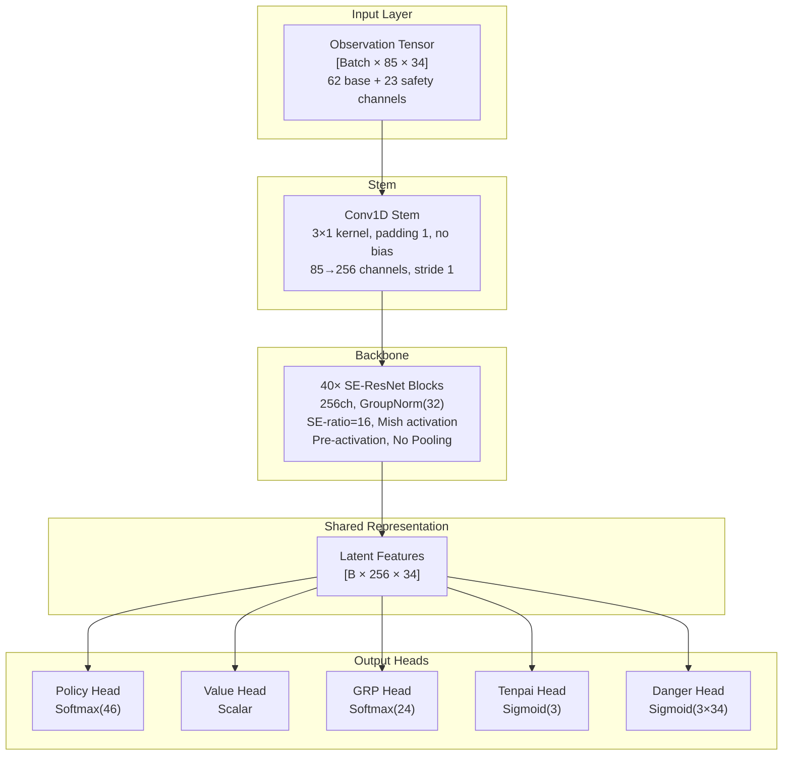
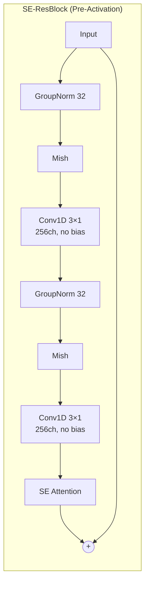
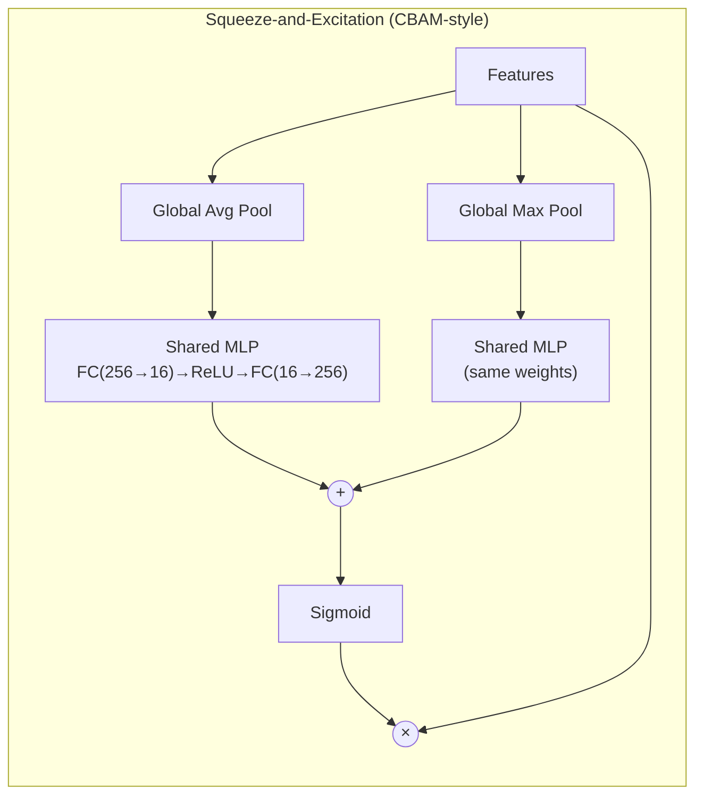
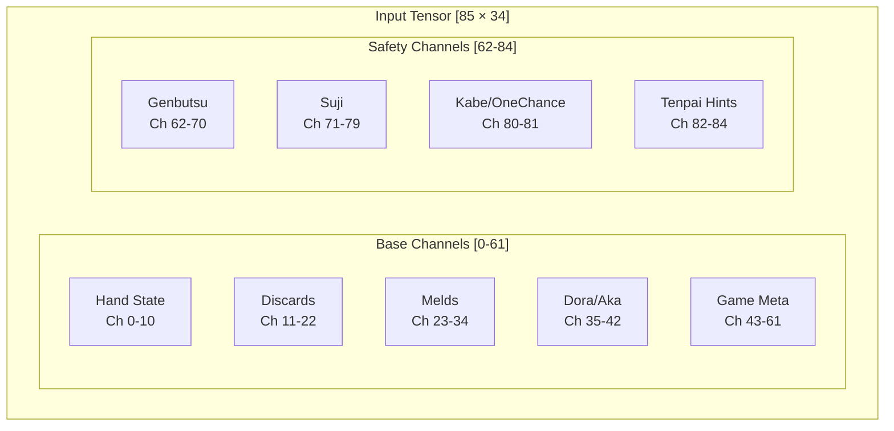
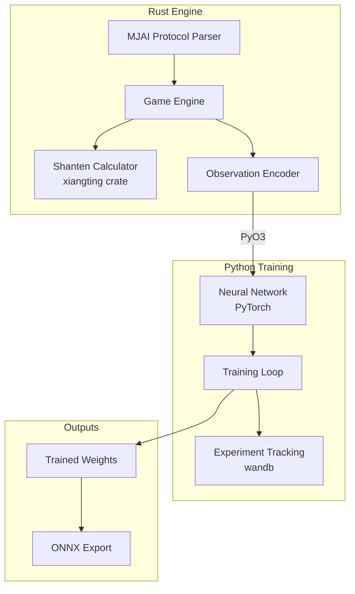

# Hydra Architecture Specification

A Riichi Mahjong AI designed to rival LuckyJ (Tencent AI Lab, 10.68 stable dan) through a combination of proven techniques, novel opponent-aware features, and inference-time search. Intermediate milestone: surpass Mortal, Suphx, and NAGA.

---

## Related Documents

- [TRAINING.md](TRAINING.md) — Training pipeline, loss functions, hyperparameters, roadmap
- [INFRASTRUCTURE.md](INFRASTRUCTURE.md) — Data pipeline, hardware, deployment

---

## Executive Summary

| Metric | Target | Justification |
|--------|--------|---------------|
| **Parameters** | ~16.5M | Detailed breakdown: 67K stem + 16.1M backbone + 372K heads (see Parameter Budget) |
| **Inference VRAM** | <1.5GB | Fits 8GB consumer GPUs easily |
| **Inference Latency** | <15ms | Well under 50ms limit |
| **Training VRAM** | <4GB active | Fits RTX PRO 6000 Blackwell (96GB) with massive headroom |
| **Target Strength** | Rival LuckyJ | Surpass Mortal (~7-dan), approach LuckyJ-level play (10+ stable dan on Tenhou). See [COMMUNITY_INSIGHTS § LuckyJ](../research/COMMUNITY_INSIGHTS.md#4-luckyj-tencent-ai-lab) for competitive analysis. |

> **Note on parameter count:** Each SE-ResBlock contains ~402K parameters (2× Conv1d(256,256,k=3) + 2× GroupNorm + SE module). 40 blocks × 402K ≈ 16.1M backbone. Heads add ~372K. This makes Hydra (~16.5M) roughly 50% larger than Mortal (~10.9M at 192ch/40 blocks), providing additional capacity for the five output heads and safety encoding.

---

## Design Principles

1. **Proven over Novel** — Prioritize techniques with published evidence (Suphx, Mortal). Novel additions (safety planes, danger head) are grounded in Mahjong theory, not speculation.
2. **Practical Constraints** — Must fit <8GB inference VRAM, <50ms latency.
3. **Clean IP** — No Mortal-derived code (AGPL restriction). All code written from scratch, all dependencies MIT/Apache licensed.
4. **Rust + Python Hybrid** — Fast game engine in Rust with PyO3 bindings, flexible training loop in Python/PyTorch.

---

## Target Ruleset: Tenhou Houou 4-Player (鳳凰卓 四人打ち)

Hydra targets the **Tenhou ranked 4-player (dan-i-sen)** ruleset as used in the Houou (鳳凰) lobby. This is the competitive environment where LuckyJ achieved 10.68 stable dan, and the ruleset under which all training data (2M+ Tenhou Houou games) was generated. The game engine MUST implement exactly these rules — deviations will corrupt label generation and scoring validation.

**Sources:** [Tenhou Official Manual](https://tenhou.net/man/) § RULE (段位戦四人打ち), [riichi.wiki/Tenhou.net_rules](https://riichi.wiki/Tenhou.net/rules).

### Scoring Edge Cases

| Rule | Tenhou Value | Notes |
|------|-------------|-------|
| Kiriage mangan | **No** | 4 han 30 fu = 7700, 3 han 60 fu = 7700. NOT rounded up to mangan. Kiriage is a jansou-mode-only rule. |
| Kazoe yakuman | **Yes** | 13+ han (excluding yakuman patterns) is scored as yakuman. |
| Multiple yakuman | **Yes (additive)** | Distinct yakuman patterns in the same hand stack additively (e.g., daisangen + tsuuiisou = double yakuman = 64000/96000). Each pattern counts as one yakuman; no individual pattern is worth double yakuman by itself. |
| Open tanyao (kuitan) | **Yes** | Kuitan ari is the default Houou setting with aka-dora. |
| Renhou | **No** | Not a recognized yaku. Explicitly excluded alongside paarenchan and other optional yaku. |
| Paarenchan | **No** | Not a recognized yaku. Eight consecutive dealer wins has no special scoring. Honba counter has no cap. |

### Game Flow Rules

| Rule | Tenhou Value | Notes |
|------|-------------|-------|
| Starting points | **25000** | Per player. Total table = 100000. |
| Return (oka) | **30000** | 1st place receives 20000 oka bonus (4 × 5000 difference from start). |
| Tobi (bankruptcy) | **Yes** | Game ends immediately when any player's score drops below 0. Score of exactly 0 does NOT trigger tobi. |
| Agari yame | **Yes (automatic)** | In all-last hands, if dealer is in 1st place, the game automatically ends on dealer win or dealer tenpai at exhaustive draw. Introduced 2010/06/01. |
| Uma | **Configurable** | Training: [3, 1, -1, -3]. Evaluation: [90, 45, 0, -135] (Tenhou Houou style). See [TRAINING.md § Placement Points](TRAINING.md#placement-points). |

### Tile and Dora Rules

| Rule | Tenhou Value | Notes |
|------|-------------|-------|
| Aka-dora (red fives) | **Yes (3 tiles)** | One red 5m, one red 5p, one red 5s. Each worth 1 additional han. |
| Ura-dora | **Yes** | Revealed after winning with riichi. |
| Ippatsu | **Yes** | Win within one turn cycle of riichi declaration (before next draw, if no intervening call). |
| Kan-dora flip timing | **Immediate for ankan; after discard for minkan/kakan** | Ankan: new dora indicator revealed immediately. Minkan/kakan: revealed after the player's discard following rinshan draw. |

### Abortive Draws

| Rule | Tenhou Value | Notes |
|------|-------------|-------|
| Kyuushu kyuuhai | **Yes** | First-turn 9+ unique terminal/honor tiles; player may declare abort. Action 44 in Hydra's mapping. |
| Suufon renda | **Yes** | All four players discard the same wind on the first turn (no calls). |
| Suucha riichi | **Yes** | All four players declare riichi. |
| Suukaikan | **Yes** | Four kans declared across multiple players (not all by one player). One player holding all four kans does NOT trigger abort — they draw from the dead wall normally. |
| Sanchahou (triple ron) | **Yes** | Three players declare ron on the same discard. Game is aborted. |
| Nagashi mangan | **Yes** | Checked at exhaustive draw. Tsumo-style payment (dealer pays more). All discards must be terminals/honors and none called by opponents. |

### Calling Restrictions

| Rule | Tenhou Value | Notes |
|------|-------------|-------|
| Kuikae (swap call) | **Banned** | After chi/pon, cannot discard the tile that would complete the same sequence/group. Both genbutsu-kuikae (exact tile) and suji-kuikae (sequence swap) are prohibited. |

> **Ruleset as code:** The engine's `rules.rs` module ([INFRASTRUCTURE.md § Module Structure](INFRASTRUCTURE.md#module-structure)) should expose these as constants, not configuration toggles. Tenhou Houou rules are the only target for training and evaluation. If future work targets Majsoul or WRC rulesets, the constants can be swapped per-build, but the engine need not support runtime rule switching.

## Architecture Overview

Hydra uses a **Unified Multi-Head SE-ResNet** architecture. A single deep convolutional backbone extracts features from the game state, and five specialized heads branch from the shared latent representation to produce all outputs simultaneously.

The input observation tensor has shape `[Batch × 85 × 34]`, encoding 85 feature channels across the 34 tile types. A convolutional stem projects this into 256 channels using a 3×1 kernel. The representation then flows through 40 pre-activation SE-ResNet blocks — each applying GroupNorm, Mish activation, two 3×1 convolutions, and a squeeze-and-excitation attention gate — producing a shared latent tensor of shape `[B × 256 × 34]`. No pooling is applied anywhere in the backbone, preserving the full 34-tile spatial geometry.

For Phase 2 Oracle Distillation, the Teacher network uses the same backbone but with a wider stem: `Conv1d(290, 256, 3)` instead of `Conv1d(85, 256, 3)`. The 290-channel input is the public observation (85ch) concatenated with the oracle observation (205ch: opponent hands, wall draw order, dora/ura indicators). All 40 ResBlock weights are identical and transferable between teacher and student — only the stem Conv1d differs. See [Phase 2: Oracle Distillation RL](TRAINING.md#phase-2-oracle-distillation-rl) for the full oracle encoding specification.

From this shared representation, output heads operate from the backbone: the Policy Head selects the next action, the Value Head estimates expected round outcome, the GRP Head predicts final game placement distribution, the Tenpai Head estimates opponent tenpai probabilities, and the Danger Head estimates per-tile deal-in risk per opponent. The baseline five heads run in parallel. When extended heads are active (call-intent, wait-set, value-tenpai, Sinkhorn), the call-intent head runs first and its output conditions the Danger Head via FiLM — a minor sequential dependency with negligible latency impact (~0.1ms). See [OPPONENT_MODELING § 4.7](OPPONENT_MODELING.md#47-call-intent--yaku-plan-inference-head) for details.

---

## Backbone Specification

### Why SE-ResNet?

SE-ResNet captures global board state (e.g., "expensive field," dora density) via channel-wise squeeze-and-excitation attention while maintaining the spatial tile geometry that matters for shape recognition. Mortal already uses dual-pool SE-style channel attention (`model.py:L10-28`, at commit `0cff2b5`); Hydra retains this proven design but replaces BatchNorm with GroupNorm for batch-size independence during RL training. Suphx uses a plain deep residual CNN without channel attention.

| Architecture | Pros | Cons | Used By |
|--------------|------|------|---------|
| ResNet | Fast, proven for spatial | Limited global context | Suphx (50 blocks, 256 filters) |
| ResNet + Channel Attention | Global context via squeeze-excite | Slightly more params | Mortal v1–v4 (dual-pool SE) |
| Transformer | Long-range dependencies | ~90-310M params (45-155× larger than ResNet); no published mahjong performance benchmarks despite multi-year Kanachan development (public repo created 2021-08-05); impractical for online RL self-play | Kanachan (no results), Tjong |
| Hybrid | Best of both | Complexity, unproven | — |

### Block Structure

Each SE-ResNet block uses pre-activation ordering: GroupNorm → Mish → Conv1D → GroupNorm → Mish → Conv1D → SE Attention → residual add. Both convolutions use 3×1 kernels with padding 1 and no bias (GroupNorm handles centering). The residual connection bypasses the entire block, enabling gradient flow through 40 layers.

### SE Attention Module

The squeeze-and-excitation module uses dual-pool channel attention (inspired by the channel attention component of CBAM, Woo et al. 2018), matching Mortal's implementation exactly. The feature tensor is independently average-pooled and max-pooled to single values per channel, each passed through a **shared MLP** (same weights for both paths), then **element-wise added** (not concatenated) before sigmoid. This means the FC input dimension remains C (not 2C), and the bottleneck is C/r = 256/16 = **16**.

### Key Design Choices

| Choice | Value | Rationale |
|--------|-------|-----------|
| Blocks | 40 | Suphx uses 50 blocks; 40 balances depth with parameter budget for Hydra's 256ch width |
| Channels | 256 | Balance of model capacity and inference speed |
| Normalization | GroupNorm(32) | No batch-size dependency, stable for small batches and RL training |
| Activation | Mish | Used in Mortal v2–v4. Smooth gradients beneficial for deep RL networks. |
| Pooling | None | Preserves 34-tile spatial semantics (see rationale below) |
| SE Ratio | 16 | Standard compression ratio, proven effective |

### Dropout Policy

No dropout in the backbone architecture. During training (Phase 1 supervised and Phase 2 distillation), dropout of 0.1 is applied after the residual add in each SE-ResBlock as a regularization technique. Dropout is disabled at inference time. Note: Suphx's "perfect feature dropout" for oracle guiding is a different technique (masks oracle input features, not standard layer dropout).

### No-Pooling Rationale

Pooling destroys tile identity. In Mahjong:
- 1m ≠ 2m (adjacent but different tiles)
- 234m ≠ 345m (different shapes with different value)
- Position in the 34-tile array is semantically meaningful

Both Suphx and Mortal explicitly avoid pooling layers. The 34-position dimension is preserved end-to-end from input through the backbone. Only the output heads apply pooling where global aggregation is semantically appropriate (Value Head, GRP Head).

### Parameter Budget

| Component | Parameters | Percentage | Status |
| ----------- | ---------- | ---------- | ------ |
| Stem Conv (85->256, k=3, pad=1, no bias) | ~66K | 0.4% | Baseline |
| ResNet Backbone (40 blocks x ~402K) | ~16.1M | 96.8% | Baseline |
| Policy Head | ~117K | 0.7% | Baseline |
| Value Head | ~132K | 0.8% | Baseline |
| GRP Head (internal placement aux) | ~106K | 0.6% | Baseline |
| Tenpai Head | ~17K | 0.1% | Baseline |
| Danger Head | 771 | <0.1% | Baseline |
| Wait-Set Belief Head | 771 | <0.1% | Extended ([OPPONENT_MODELING S 4.6](OPPONENT_MODELING.md#46-wait-set-belief-head-extended-opponent-modeling)) |
| Value-Conditioned Tenpai Head | ~17K | 0.1% | Extended ([OPPONENT_MODELING S 3.7](OPPONENT_MODELING.md#37-value-conditioned-tenpai-threat-severity)) |
| Call-Intent / Yaku-Plan Head | ~18K | 0.1% | Extended ([OPPONENT_MODELING S 4.7](OPPONENT_MODELING.md#47-call-intent--yaku-plan-inference-head)) |
| Sinkhorn Tile Allocation Head | ~1K | <0.1% | Extended ([OPPONENT_MODELING S 7.6](OPPONENT_MODELING.md#constraint-consistent-belief-via-sinkhorn-projection-tile-allocation-head)) |
| **Total (Student, baseline 5 heads)** | **~16.5M** | -- | |
| **Total (Student, all 9 heads)** | **~16.6M** | **100%** | |

> The backbone completely dominates the parameter budget. Head overhead is negligible (~2.5% total for all 9 heads), meaning the full extended head design adds opponent modeling capability at virtually zero parameter cost. Extended heads are gated by ablation results (see [ABLATION_PLAN S A10-A12](ABLATION_PLAN.md#a10-dense-vs-sparse-danger-labels)) and may be added incrementally.

**Oracle Teacher stem:** `Conv1d(290, 256, 3)` = ~223K params (vs student's ~66K). The teacher total is ~16.7M — only +157K over the student (+0.95%). All other weights are shared.

---

## Output Heads

### Policy Head (Actor)

**Purpose:** Select the next action — discard a tile, call (chi/pon/kan), declare riichi, or win.

**Output shape:** 46-dimensional logit vector, masked by legal actions, then softmax-normalized.

**Architecture:** A 1×1 convolution reduces the 256-channel latent to 64 channels, followed by flattening (64 × 34 = 2,176 features) and a fully-connected layer projecting to 46 action logits. Illegal actions are masked to negative infinity before softmax.

**Action space (46 actions, Mortal-compatible mapping):**

| Range | Count | Action |
|-------|-------|--------|
| 0–36 | 37 | Discard tile (34 base types + 3 aka-dora variants: red 5m=34, red 5p=35, red 5s=36). Indices 0–36 also serve as tile selection in the kan two-phase system (see below). |
| 37 | 1 | Riichi declaration |
| 38–40 | 3 | Chi (left/mid/right) |
| 41 | 1 | Pon |
| 42 | 1 | Kan (covers daiminkan, ankan, kakan — tile selection via two-phase, see below) |
| 43 | 1 | Agari (win: tsumo or ron, context-determined) |
| 44 | 1 | Ryuukyoku (draw declaration: kyuushu kyuuhai) |
| 45 | 1 | Pass (decline call/win opportunity) |

**Two-phase composite actions (matching Mortal's proven approach):**

Riichi and kan require selecting WHICH tile to discard/use, which cannot be expressed in a single 46-action pass. Mortal solves this with a two-phase system (verified from `libriichi/src/state.rs` and `mortal/model.py`, commit `0cff2b5`):

1. **Riichi:** When the agent selects action 37 (riichi), the environment presents a SECOND decision point where the legal actions are the subset of indices 0–36 that correspond to valid riichi discards (tiles whose discard leaves the hand in tenpai). The agent selects which tile to discard from this restricted set.
2. **Kan:** When the agent selects action 42 (kan), the environment sets `at_kan_select=true` and presents a SECOND decision point where legal actions are the subset of indices 0–36 corresponding to tiles that can form a kan. The agent selects which tile to kan.
3. **Agari:** Action 43 covers both tsumo (self-draw win) and ron (deal-in win). The context (is it your turn or an opponent's discard?) determines which applies. No ambiguity.

This two-phase approach means the Policy Head always outputs 46 logits per forward pass, but may be called TWICE per game action when riichi or kan is selected. The second pass reuses the same network with an updated observation (legal action mask changes).

> **Source (Mortal):** Mortal uses this exact 46-action mapping with indices 0–36 for discards (including aka), 37 for riichi, 38–40 for chi, 41 for pon, 42 for kan (two-phase with `at_kan_select`), 43 for agari, 44 for ryuukyoku, 45 for pass. See [MORTAL_ANALYSIS § Architecture](MORTAL_ANALYSIS.md) for the verified mapping.
> **Note:** The previous Hydra spec used a different 46-action mapping (0–33 for discards without aka, different indices for calls). This has been updated to match Mortal's proven mapping for dataset compatibility and to resolve the aka-dora selectability issue identified by external review.

### Value Head (Critic)

**Purpose:** Estimate the expected round outcome for variance reduction in RL training. Serves as the critic in actor-critic PPO.

**Output shape:** Scalar (expected round score or advantage).

**Architecture:** Global average pooling collapses the spatial dimension (256 × 34 → 256), followed by a two-layer MLP (256 → 512 → 1) with ReLU activation. The scalar output predicts the expected point gain or loss from the current game state.

> **Oracle Critic (Phase 2–3 training only):** During RL training, an asymmetric oracle critic replaces this value head. The oracle critic runs on the **teacher** backbone (Conv1d(290, 256, 3) stem, receiving 85 public + 205 oracle channels) and outputs **4 scalars** (one per player) with a zero-sum auxiliary loss enforcing V₁+V₂+V₃+V₄=0. The student's 1-scalar value head described above is used only at inference. See [TRAINING § Oracle Critic](TRAINING.md#component-2-oracle-critic-training-only) for the full specification.

### GRP Head (Global Rank Prediction)

**Purpose:** Predict the final game placement distribution across all four players. This enables placement-aware tactics: All-Last pushing, feeding plays (intentionally letting a specific opponent win), and blocking plays (preventing a specific opponent from rising in rank).

**Output shape:** 24-dimensional softmax (4! = 24 rank permutations).

**Design rationale:** Mortal introduced the 24-way joint rank distribution to capture inter-player placement correlations (confirmed from `model.py:L233-249`, at commit `0cff2b5`). Four independent marginal probabilities (P(1st), P(2nd), P(3rd), P(4th) for each player) lose the correlation information — e.g., "if I get 1st, Player B gets 2nd" vs. "if I get 1st, Player C gets 2nd." Suphx took a different approach, using a scalar GRP that predicts expected final game reward via MSE regression with a GRU encoder — effective for rank-awareness but unable to capture inter-player correlations.

Hydra adopts Mortal's 24-way formulation but extends it with a richer score context vector and uncapped score encoding. Mortal's documented Orasu weakness ("Orras cowardice") likely stems from its dual-scale score capping (100K/30K channels) losing fine-grained placement information in high-scoring games, and from reward shaping that insufficiently penalizes 4th place — not from the GRP formulation itself.

**Architecture:** Global average pooling collapses the backbone output (256 × 34 → 256), which is concatenated with a 16-dimensional score context vector, then passed through a three-layer MLP (272 → 256 → 128 → 24) with ReLU activations.

**Score context vector (16 dimensions):**
- Raw scores: 4 values (one per player, normalized by 100,000, uncapped)
- Relative gaps: 6 values (all pairwise score differences)
- Overtake thresholds: 4 values (points needed to change each placement)
- Round/Honba: 2 values (game progress context)

### Tenpai Head

**Purpose:** Estimate the probability that each opponent is in tenpai (ready to win), including damaten (hidden tenpai without riichi declaration). This explicitly addresses Mortal's documented weakness in damaten detection.

**Output shape:** 3 sigmoid values (one probability per opponent).

**Architecture:** Global average pooling (256 × 34 → 256) followed by a two-layer MLP (256 → 64 → 3) with ReLU and final sigmoid activation.

**Design rationale:** Riichi tenpai is trivially detectable (opponents declare it). Damaten — tenpai without declaration — is the dangerous case that Mortal handles poorly. The tenpai head learns behavioral tells: tedashi patterns, discard timing, and meld sequences that correlate with hidden tenpai. During training, ground-truth labels come from Oracle data (the teacher network sees opponent hands).

### Danger Head

**Purpose:** Estimate the probability of dealing in (paying an opponent who wins) for each tile, per opponent. Enables mawashi-uchi — avoiding one specific dangerous opponent while continuing to push against others.

**Output shape:** 3 × 34 sigmoid values (per opponent, per tile type).

**Architecture:** A 1×1 convolution reduces 256 channels to 3 channels (one per opponent), producing a `[B × 3 × 34]` tensor. Sigmoid activation gives per-tile, per-opponent deal-in probabilities.

**Design rationale:** A tile can be safe against Player A but deadly against Player B. Per-opponent granularity is essential for correct defensive play. Mortal relies on implicit Q-value differences to infer danger; Hydra makes this explicit with a dedicated head, providing interpretable danger signals and stronger gradients for learning defensive play.

---

## Input Encoding

### Overview

The observation tensor encodes the complete game state visible to the current player. Hydra extends the standard Mortal-style encoding with 23 explicit safety planes for opponent modeling.

**Total channels: 85** (62 base + 23 safety)

**Tensor shape:** `[Batch × 85 × 34]`

The 34-dimension represents tile types: 9 manzu (萬) + 9 pinzu (筒) + 9 souzu (索) + 7 jihai (字牌).

**Tile index mapping:**

| Index | 0–8 | 9–17 | 18–26 | 27–33 |
|-------|-----|------|-------|-------|
| Suit | Manzu (萬) | Pinzu (筒) | Souzu (索) | Jihai (字) |
| Tiles | 1–9m | 1–9p | 1–9s | ESWN白發中 |

### Base Channels (0–61)

#### Hand State (Channels 0–10)

| Channel | Content | Encoding |
|---------|---------|----------|
| 0–3 | Closed hand tile count | 4 binary thermometer planes (≥1, ≥2, ≥3, =4 copies). If holding 3 copies, channels 0,1,2 = 1.0, channel 3 = 0.0. Matches Mortal, Suphx, and Mjx encoding. |
| 4–7 | Tiles in open melds | Count per tile type (4 thermometer planes) |
| 8 | Drawn tile indicator | 1 binary one-hot channel marking which tile was just drawn. Hydra-original addition — Mortal doesn't encode this explicitly; Mjx-small does (channel 15). Gives the model direct signal for tsumo decisions. |
| 9 | Keep-shanten discards | Binary mask: tiles whose discard maintains current shanten. Derived from Mortal's `keep_shanten_discards` (obs_repr.rs L451, at commit `0cff2b5`). More actionable than raw shanten value. |
| 10 | Next-shanten discards | Binary mask: tiles whose discard reduces shanten by 1. Derived from Mortal's `next_shanten_discards` (obs_repr.rs L457, at commit `0cff2b5`). |

#### Discards per Player (Channels 11–22)

Three channels per opponent (12 total), encoding not just which tiles were discarded but how and when:

| Sub-channel | Content |
|-------------|---------|
| 0 | Tile presence in discard pile |
| 1 | Tedashi flag (from hand vs. tsumogiri) |
| 2 | Temporal weight (exponential decay) |

**Temporal weighting formula:**

$$w = e^{-0.2 \times (t_{\max} - t_{\text{discard}})}$$

Recent discards are weighted higher. This is critical for reading opponent intent — early discards carry less information about current hand state than recent ones.

#### Melds per Player (Channels 23–34)

Three channels per player (12 total):

| Sub-channel | Content |
|-------------|---------|
| 0 | Chi (sequence) tiles |
| 1 | Pon (triplet) tiles |
| 2 | Kan (quad) tiles |

#### Dora and Aka (Channels 35–42)

| Channel | Content |
|---------|---------|
| 35–39 | Dora indicator tiles (up to 5 indicators, thermometer binary). Standard riichi reveals 1 initial + up to 4 after kans = 5 total. |
| 40–42 | Red five (aka) in hand — 3 binary channels, one per suit (5m-red, 5p-red, 5s-red). All-1 or all-0 plane per channel. Matches Mortal's `akas_in_hand[3]` and Mjx-large encoding. Only 3 aka-dora exist in standard Riichi Mahjong; no 4th channel is needed. Aka visibility in melds/discards is encoded in those respective channel blocks. |

#### Game Metadata (Channels 43–61)

| Channel | Content |
|---------|---------|
| 43–46 | Riichi status per player (binary) |
| 47–50 | Scores (normalized, **uncapped**) |
| 51–54 | Relative score gaps (to each rank) |
| 55–58 | Shanten (one-hot over 4 values: 0=tenpai, 1, 2, 3+). Single scalar = min(normal, chiitoitsu, kokushi). Matches Mortal and Mjx convention. Encoded once here — not duplicated in Hand State. Per-type decomposition is unnecessary: the network infers winning form proximity from tile counts. |
| 59 | Round number (normalized) |
| 60 | Honba (rescaled: honba/10, capped at 10). **Separate from kyotaku** — combining loses information about which contributes to what (honba affects deal-in payment, kyotaku is a pot). Mortal v4 encodes them separately. |
| 61 | Kyotaku (rescaled: kyotaku/10, capped at 10). |

### Score Encoding (Critical Difference from Mortal)

Mortal v4 uses dual-scale score encoding: one channel normalized by 100,000 (preserving coarse information up to 100K) and a second channel normalized by 30,000 (providing higher resolution for the strategically common range). This means information above 30K is degraded but not completely lost — a player with 60,000 points registers 0.6 in the 100K channel vs. 0.3 for 30K, but both saturate at 1.0 in the 30K channel. (Source: `obs_repr.rs:L149-164`, at commit `0cff2b5`)

Hydra uses uncapped scores with three complementary representations:

- **Raw score:** Normalized by 100,000 (approximate maximum realistic game score). No capping.
- **Relative gaps:** `(my_score − other_score) / 30,000` for all pairwise comparisons. Preserves fine-grained placement information.
- **Overtake thresholds:** Points needed to change placement against each opponent. Directly encodes "what do I need to win 2nd place?"

### Safety Channels (62–84)

These are novel additions for explicit opponent modeling. Standard Mahjong defense relies on genbutsu, suji, kabe, and one-chance analysis. Mortal learns these patterns implicitly; Hydra provides them as precomputed input features to accelerate learning and improve defensive accuracy.

#### Genbutsu (Channels 62–70)

100% safe tiles guaranteed by the furiten rule — any tile an opponent has discarded (discard furiten), plus any tile discarded by any player after that opponent declared riichi (riichi furiten).

Three channels per opponent (9 total), encoding three semantically distinct safety signals:

| Sub-channel | Content | Encoding |
|-------------|---------|----------|
| +0 | All genbutsu | Binary mask: 1 if tile is 100% safe against this opponent (union of discard-furiten and riichi-furiten genbutsu) |
| +1 | Tedashi genbutsu | Binary mask: subset of +0 where tile was hand-discarded (tedashi) by this opponent. Carries hand-shape information — tedashi implies the opponent evaluated and rejected this tile. |
| +2 | Riichi-era genbutsu | Binary mask: subset of +0 where tile became safe AFTER this opponent declared riichi. Only non-zero when opponent is in riichi. Separates pre-riichi safety (mutable hand) from post-riichi safety (locked hand). |

> See [OPPONENT_MODELING § 2.1 Genbutsu](OPPONENT_MODELING.md#21-genbutsu-絶対安全牌--channels-6270) for calculation flow, Mermaid diagram, and design rationale. No existing mahjong AI (Mortal, Suphx, Kanachan) pre-computes genbutsu channels — Hydra's explicit encoding is a deliberate advantage.

#### Suji (Channels 71–79)

Suji (筋) defense logic — tiles sharing a numerical relationship with an opponent's discards, making certain waits impossible.

| Suji Type | Pattern |
|-----------|---------|
| 1-4-7 | If 4 discarded, 1 and 7 are safer (no 1-4 or 7-4 two-sided wait) |
| 2-5-8 | If 5 discarded, 2 and 8 are safer |
| 3-6-9 | If 6 discarded, 3 and 9 are safer |

Three channels per opponent (9 total). Float value: suji safety score from 0.0 to 1.0.

#### Kabe and One-Chance (Channels 80–81)

| Channel | Content | Logic |
|---------|---------|-------|
| 80 | Kabe (壁) | All 4 copies of a tile are visible → no-chance wait involving that tile |
| 81 | One-chance | 3 copies visible → low probability of that tile being in a wait |

#### Tenpai Hints (Channels 82–84)

| Channel | Content |
|---------|---------|
| 82 | Opponent 1 riichi or high-probability tenpai |
| 83 | Opponent 2 riichi or high-probability tenpai |
| 84 | Opponent 3 riichi or high-probability tenpai |

Initially populated from riichi status (binary). During inference, these channels can be augmented by the Tenpai Head's predictions, creating a feedback loop where the model's own opponent-reading informs its defensive encoding.

### Tedashi vs. Tsumogiri Encoding

This distinction is critical for damaten detection. Tedashi (手出し) means discarding a tile from the hand (the player chose to keep the drawn tile and discard something else), indicating a hand change. Tsumogiri (ツモ切り) means discarding the just-drawn tile (the hand is unchanged).

**Key pattern:** Three or more consecutive tsumogiri followed by a tedashi often signals that the player has achieved tenpai — they were waiting for a useful draw, got one, and rearranged their hand.

Each discard in channels 11–22 includes:
- Tile identity (which tile was discarded)
- Tedashi flag (whether it came from the hand or was the drawn tile)
- Temporal position (exponential decay weighting)

> **Note:** A post-call flag (whether the discard followed a meld call) is not part of the base 85-channel encoding. See [ABLATION_PLAN A9](ABLATION_PLAN.md#a9-discard-sequence-encoder-tedashi-gru) for a GRU-based extension that additionally encodes post-call context as a token feature.

### Data Flow

The encoder runs in Rust for performance. Safety calculations (suji, kabe, genbutsu) are precomputed at game start and updated incrementally on each game event (discard, call, kan), avoiding redundant recomputation.

---

## Inference Optimization

### Deployment Configuration

Inference runs in FP16 (half precision) with `torch.compile` in "reduce-overhead" mode. CUDA graphs are used for batch-1 inference with static input shapes, eliminating kernel launch overhead.

### VRAM Breakdown

| Component | Size |
|-----------|------|
| Weights (FP16) | ~33MB |
| Activations | ~200MB |
| CUDA context | ~800MB |
| **Total** | **~1.0GB** |

Well within the <1.5GB target, fitting easily on 8GB consumer GPUs.

### Latency Breakdown (Estimated Targets)

> **Note:** These are design targets based on comparable architectures (Mortal, Suphx), not measured values. Actual benchmarks will be established during Milestone 2.

| Component | RTX 3070 (est.) | RTX 4090 (est.) |
|-----------|----------|----------|
| Feature extraction (Rust encoder) | 2–3ms | 2–3ms |
| ResNet forward pass | 5–8ms | 1–2ms |
| Heads forward pass | 1–2ms | <1ms |
| **Total** | **8–13ms** | **3–5ms** |

Both configurations are well under the 50ms decision limit imposed by online play. Batch-1 throughput on RTX 3070 is approximately 100 decisions per second.

---

## System Overview

| Feature | Mortal | Hydra |
|---------|--------|-------|
| Opponent modeling | None (SinglePlayerTables) | Oracle distillation + tenpai/danger heads |
| Safety logic | Implicit (learned from data) | Explicit 23-plane input encoding (channels 62–84) |
| Damaten detection | Poor (documented weakness) | Dedicated tenpai predictor head |
| Score encoding | Dual-scale (100K/30K channels, degraded above 30K) | Uncapped + relative gaps + overtake thresholds |
| Training algorithm | DQN + CQL (offline RL) | PPO + League (online RL) |
| Normalization | BatchNorm | GroupNorm (batch-size independent) |
| Deal-in avoidance | Implicit Q-value differences | Explicit danger head (per-opponent, per-tile) |
| Backbone | ResNet + dual-pool SE (Channel Attention) | SE-ResNet (same dual-pool SE, GroupNorm instead of BatchNorm) |
| GRP formulation | 24-way joint distribution (dual-scale scores) | 24-way joint distribution (uncapped scores + score context vector) |
| Parameters | ~10.9M (192ch) | ~16.5M (256ch) |
| Activation | Mish | Mish (same) |

---

## Licensing Constraints

**Critical constraint:** Mortal uses a restrictive license (AGPL + additional restrictions). Hydra must not fork or derive from Mortal's codebase, use libriichi directly, or release weights trained on Mortal-derived code.

Hydra can reference Mortal's published *techniques* (observable from papers and documentation) but must write all code from scratch.

**Options:**

| Option | Pros | Cons |
|--------|------|------|
| **Build from scratch** | Full control, clean IP | Most development effort |
| **Use Mjx (JAX)** | Fast GPU simulator, MIT license | Python/JAX only ecosystem |
| **Use riichi-rs** | Rust, permissive license | Less mature |
| **Use Mjai protocol only** | Interface standard, no code copying | Still need own engine |

**Recommended approach:** Build a custom Rust engine with PyO3 bindings. This gives full control, clean IP, and the performance characteristics needed for high-throughput self-play.

**Dependency licenses:**
- xiangting (MIT) — Shanten calculation
- PyO3 (MIT OR Apache-2.0) — Rust-Python bindings
- PyTorch (BSD) — Neural network training

---

---

## System Overview

