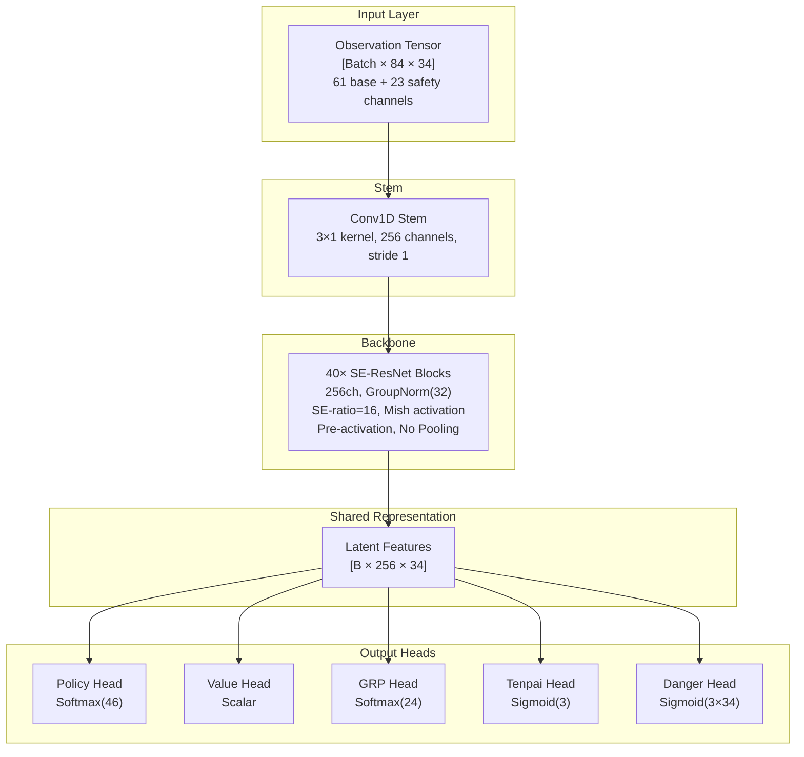
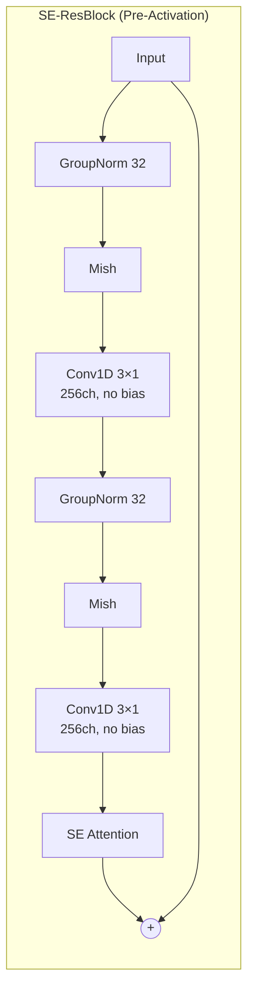
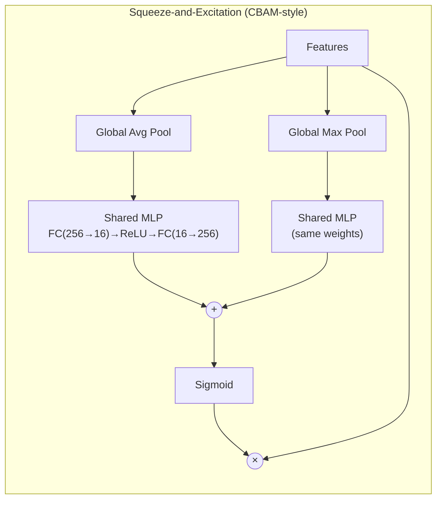
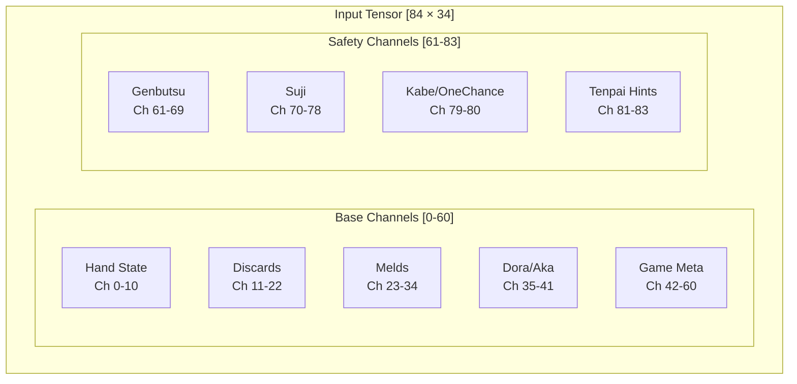
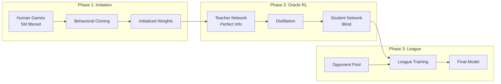
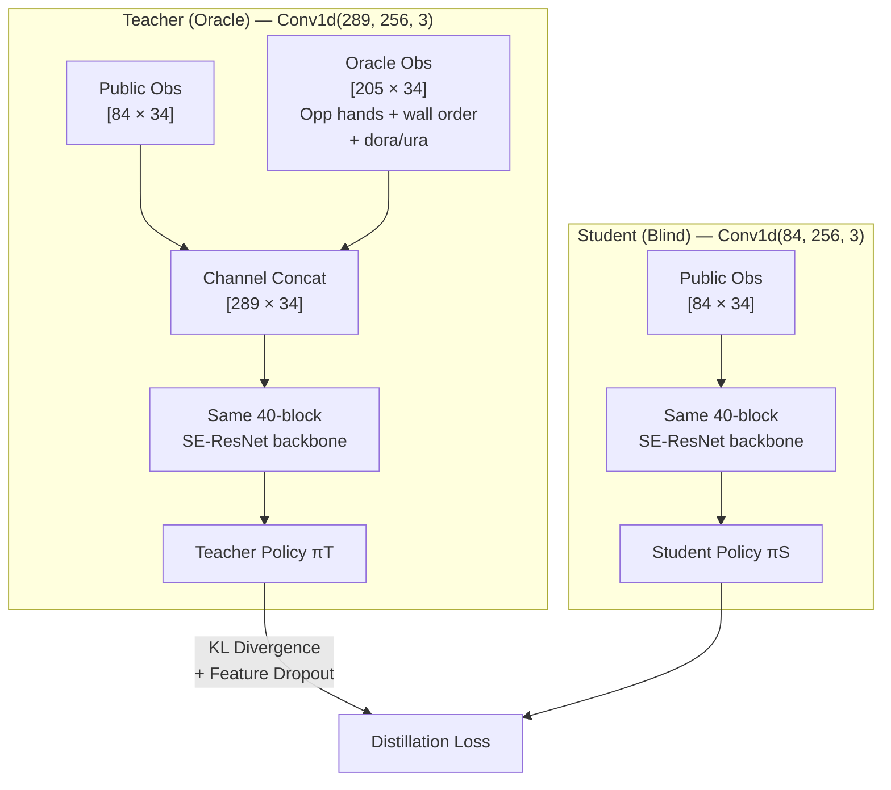
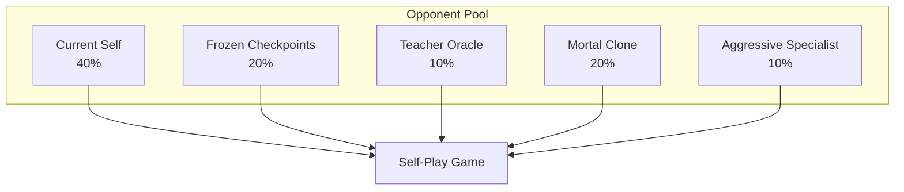
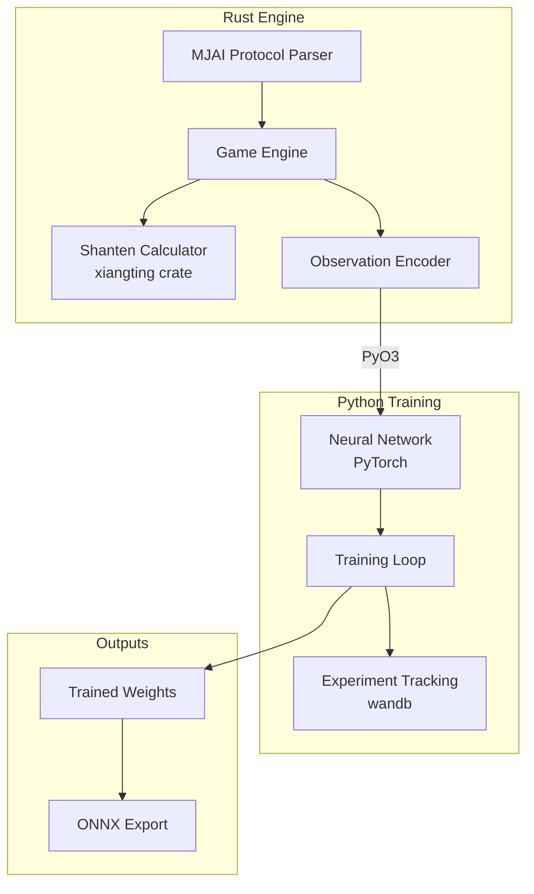

# Hydra Architecture Specification

A Riichi Mahjong AI designed to surpass current SOTA (Mortal, Suphx, NAGA) through a combination of proven techniques and novel opponent-aware features.

---

## Executive Summary

| Metric | Target | Justification |
|--------|--------|---------------|
| **Parameters** | ~16.5M | Detailed breakdown: 67K stem + 16.1M backbone + 372K heads (see Parameter Budget) |
| **Inference VRAM** | <1.5GB | Fits 8GB consumer GPUs easily |
| **Inference Latency** | <15ms | Well under 50ms limit |
| **Training VRAM** | <20GB active | Fits RTX PRO 6000 Blackwell (96GB) with batch 4096+ |
| **Target Strength** | Beat Mortal | Tenhou 10-dan+ |

> **Note on parameter count:** Each SE-ResBlock contains ~402K parameters (2× Conv1d(256,256,k=3) + 2× GroupNorm + SE module). 40 blocks × 402K ≈ 16.1M backbone. Heads add ~372K. This makes Hydra (~16.5M) roughly 50% larger than Mortal (~10.9M at 192ch/40 blocks), providing additional capacity for the five output heads and safety encoding.

---

## Design Principles

1. **Proven over Novel** — Prioritize techniques with published evidence (Suphx, Mortal). Novel additions (safety planes, danger head) are grounded in Mahjong theory, not speculation.
2. **Practical Constraints** — Must fit <8GB inference VRAM, <50ms latency.
3. **Clean IP** — No Mortal-derived code (AGPL restriction). All code written from scratch, all dependencies MIT/Apache licensed.
4. **Rust + Python Hybrid** — Fast game engine in Rust with PyO3 bindings, flexible training loop in Python/PyTorch.

---

## Architecture Overview

Hydra uses a **Unified Multi-Head SE-ResNet** architecture. A single deep convolutional backbone extracts features from the game state, and five specialized heads branch from the shared latent representation to produce all outputs simultaneously.

The input observation tensor has shape `[Batch × 84 × 34]`, encoding 84 feature channels across the 34 tile types. A convolutional stem projects this into 256 channels using a 3×1 kernel. The representation then flows through 40 pre-activation SE-ResNet blocks — each applying GroupNorm, Mish activation, two 3×1 convolutions, and a squeeze-and-excitation attention gate — producing a shared latent tensor of shape `[B × 256 × 34]`. No pooling is applied anywhere in the backbone, preserving the full 34-tile spatial geometry.

For Phase 2 Oracle Distillation, the Teacher network uses the same backbone but with a wider stem: `Conv1d(289, 256, 3)` instead of `Conv1d(84, 256, 3)`. The 289-channel input is the public observation (84ch) concatenated with the oracle observation (205ch: opponent hands, wall draw order, dora/ura indicators). All 40 ResBlock weights are identical and transferable between teacher and student — only the stem Conv1d differs. See [Phase 2: Oracle Distillation RL](#phase-2-oracle-distillation-rl) for the full oracle encoding specification.

From this shared representation, five output heads operate in parallel: the Policy Head selects the next action, the Value Head estimates expected round outcome, the GRP Head predicts final game placement distribution, the Tenpai Head estimates opponent tenpai probabilities, and the Danger Head estimates per-tile deal-in risk per opponent.

---

## Backbone Specification

### Why SE-ResNet?

SE-ResNet captures global board state (e.g., "expensive field," dora density) via channel-wise squeeze-and-excitation attention while maintaining the spatial tile geometry that matters for shape recognition. Mortal already uses dual-pool SE-style channel attention (`model.py:L10-28`); Hydra retains this proven design but replaces BatchNorm with GroupNorm for batch-size independence during RL training. Suphx uses a plain deep residual CNN without channel attention.

| Architecture | Pros | Cons | Used By |
|--------------|------|------|---------|
| ResNet | Fast, proven for spatial | Limited global context | Suphx |
| ResNet + Channel Attention | Global context via squeeze-excite | Slightly more params | Mortal v1–v4 (dual-pool SE) |
| Transformer | Long-range dependencies | Quadratic attention, slow | Kanachan, Tjong |
| Hybrid | Best of both | Complexity, unproven | — |

### Block Structure

Each SE-ResNet block uses pre-activation ordering: GroupNorm → Mish → Conv1D → GroupNorm → Mish → Conv1D → SE Attention → residual add. Both convolutions use 3×1 kernels with padding 1 and no bias (GroupNorm handles centering). The residual connection bypasses the entire block, enabling gradient flow through 40 layers.

### SE Attention Module

The squeeze-and-excitation module uses CBAM-style dual-pool channel attention (Woo et al. 2018), matching Mortal's implementation exactly. The feature tensor is independently average-pooled and max-pooled to single values per channel, each passed through a **shared MLP** (same weights for both paths), then **element-wise added** (not concatenated) before sigmoid. This means the FC input dimension remains C (not 2C), and the bottleneck is C/r = 256/16 = **16**.

### Key Design Choices

| Choice | Value | Rationale |
|--------|-------|-----------|
| Blocks | 40 | Matches Suphx depth, proven sufficient for Mahjong complexity |
| Channels | 256 | Balance of model capacity and inference speed |
| Normalization | GroupNorm(32) | No batch-size dependency, stable for small batches and RL training |
| Activation | Mish | Used in Mortal v2–v4. Smooth gradients beneficial for deep RL networks. |
| Pooling | None | Preserves 34-tile spatial semantics (see rationale below) |
| SE Ratio | 16 | Standard compression ratio, proven effective |

### Dropout Policy

> **Resolved conflict:** The architecture document states "None — Neither Mortal nor Suphx use standard neural network dropout. Hurts tile counting precision." (Note: Suphx does use "perfect feature dropout" for oracle guiding — a different technique that masks oracle input features during training, not standard layer dropout.) The training document specifies "Dropout 0.1 throughout backbone for RL stability."
>
> **Resolution:** The backbone design itself contains no dropout to preserve tile-counting precision during inference. During training (particularly Phase 1 supervised and Phase 2 distillation), dropout of 0.1 is applied as a regularization technique for RL stability. Dropout is disabled at inference time. This is consistent with standard practice where dropout is a training-time regularizer that is deactivated during evaluation.

### No-Pooling Rationale

Pooling destroys tile identity. In Mahjong:
- 1m ≠ 2m (adjacent but different tiles)
- 234m ≠ 345m (different shapes with different value)
- Position in the 34-tile array is semantically meaningful

Both Suphx and Mortal explicitly avoid pooling layers. The 34-position dimension is preserved end-to-end from input through the backbone. Only the output heads apply pooling where global aggregation is semantically appropriate (Value Head, GRP Head).

### Parameter Budget

| Component | Parameters | Percentage |
|-----------|------------|------------|
| Stem Conv (84→256, k=3) | ~65K | 0.4% |
| ResNet Backbone (40 blocks × ~402K) | ~16.1M | 97.3% |
| Policy Head | ~117K | 0.7% |
| Value Head | ~132K | 0.8% |
| GRP Head | ~106K | 0.6% |
| Tenpai Head | ~17K | 0.1% |
| Danger Head | ~771 | <0.1% |
| **Total (Student)** | **~16.5M** | **100%** |

> The backbone completely dominates the parameter budget. Head overhead is negligible (~2.3% total), meaning the five-head design adds opponent modeling capability at virtually zero parameter cost.

**Oracle Teacher stem:** `Conv1d(289, 256, 3)` = ~222K params (vs student's ~65K). The teacher total is ~16.7M — only +157K over the student (+0.95%). All other weights are shared.

---

## Output Heads

### Policy Head (Actor)

**Purpose:** Select the next action — discard a tile, call (chi/pon/kan), declare riichi, or win.

**Output shape:** 46-dimensional logit vector, masked by legal actions, then softmax-normalized.

**Architecture:** A 1×1 convolution reduces the 256-channel latent to 64 channels, followed by flattening (64 × 34 = 2,176 features) and a fully-connected layer projecting to 46 action logits. Illegal actions are masked to negative infinity before softmax.

**Action space (46 actions):**

| Range | Count | Action |
|-------|-------|--------|
| 0–33 | 34 | Discard tile type |
| 34–36 | 3 | Chi (left/mid/right) |
| 37 | 1 | Pon |
| 38 | 1 | Open Kan |
| 39 | 1 | Riichi |
| 40 | 1 | Tsumo (self-draw win) |
| 41 | 1 | Ron (deal-in win) |
| 42 | 1 | Ankan (closed kan) |
| 43 | 1 | Kakan (added kan) |
| 44 | 1 | Kyuushu Kyuuhai (nine-tile abort) |
| 45 | 1 | Pass |

### Value Head (Critic)

**Purpose:** Estimate the expected round outcome for variance reduction in RL training. Serves as the critic in actor-critic PPO.

**Output shape:** Scalar (expected round score or advantage).

**Architecture:** Global average pooling collapses the spatial dimension (256 × 34 → 256), followed by a two-layer MLP (256 → 512 → 1) with ReLU activation. The scalar output predicts the expected point gain or loss from the current game state.

### GRP Head (Global Rank Prediction)

**Purpose:** Predict the final game placement distribution across all four players. This enables placement-aware tactics: All-Last pushing, feeding plays (intentionally letting a specific opponent win), and blocking plays (preventing a specific opponent from rising in rank).

**Output shape:** 24-dimensional softmax (4! = 24 rank permutations).

**Design rationale:** Mortal introduced the 24-way joint rank distribution to capture inter-player placement correlations (confirmed from `model.py:L233-249`). Four independent marginal probabilities (P(1st), P(2nd), P(3rd), P(4th) for each player) lose the correlation information — e.g., "if I get 1st, Player B gets 2nd" vs. "if I get 1st, Player C gets 2nd." Suphx took a different approach, using a scalar GRP that predicts expected final game reward via MSE regression with a GRU encoder — effective for rank-awareness but unable to capture inter-player correlations.

Hydra adopts Mortal's 24-way formulation but extends it with a richer score context vector and uncapped score encoding. Mortal's documented Orasu weakness ("Orras cowardice") likely stems from its dual-scale score capping (100K/30K channels) losing fine-grained placement information in high-scoring games, and from reward shaping that insufficiently penalizes 4th place — not from the GRP formulation itself.

**Architecture:** Global average pooling collapses the backbone output (256 × 34 → 256), which is concatenated with a 16-dimensional score context vector, then passed through a three-layer MLP (272 → 256 → 128 → 24) with ReLU activations.

**Score context vector (16 dimensions):**
- Raw scores: 4 values (one per player, normalized by 100,000, uncapped)
- Relative gaps: 6 values (all pairwise score differences)
- Overtake thresholds: 4 values (points needed to change each placement)
- Round/Honba: 2 values (game progress context)

### Tenpai Head

**Purpose:** Estimate the probability that each opponent is in tenpai (ready to win), including damaten (hidden tenpai without riichi declaration). This explicitly addresses Mortal's documented weakness in damaten detection.

**Output shape:** 3 sigmoid values (one probability per opponent).

**Architecture:** Global average pooling (256 × 34 → 256) followed by a two-layer MLP (256 → 64 → 3) with ReLU and final sigmoid activation.

**Design rationale:** Riichi tenpai is trivially detectable (opponents declare it). Damaten — tenpai without declaration — is the dangerous case that Mortal handles poorly. The tenpai head learns behavioral tells: tedashi patterns, discard timing, and meld sequences that correlate with hidden tenpai. During training, ground-truth labels come from Oracle data (the teacher network sees opponent hands).

### Danger Head

**Purpose:** Estimate the probability of dealing in (paying an opponent who wins) for each tile, per opponent. Enables mawashi-uchi — avoiding one specific dangerous opponent while continuing to push against others.

**Output shape:** 3 × 34 sigmoid values (per opponent, per tile type).

**Architecture:** A 1×1 convolution reduces 256 channels to 3 channels (one per opponent), producing a `[B × 3 × 34]` tensor. Sigmoid activation gives per-tile, per-opponent deal-in probabilities.

**Design rationale:** A tile can be safe against Player A but deadly against Player B. Per-opponent granularity is essential for correct defensive play. Mortal relies on implicit Q-value differences to infer danger; Hydra makes this explicit with a dedicated head, providing interpretable danger signals and stronger gradients for learning defensive play.

---

## Input Encoding

### Overview

The observation tensor encodes the complete game state visible to the current player. Hydra extends the standard Mortal-style encoding with 23 explicit safety planes for opponent modeling.

**Total channels: 84** (61 base + 23 safety)

**Tensor shape:** `[Batch × 84 × 34]`

The 34-dimension represents tile types: 9 manzu (萬) + 9 pinzu (筒) + 9 souzu (索) + 7 jihai (字牌).

**Tile index mapping:**

| Index | 0–8 | 9–17 | 18–26 | 27–33 |
|-------|-----|------|-------|-------|
| Suit | Manzu (萬) | Pinzu (筒) | Souzu (索) | Jihai (字) |
| Tiles | 1–9m | 1–9p | 1–9s | ESWN白發中 |

### Base Channels (0–60)

#### Hand State (Channels 0–10)

| Channel | Content | Encoding |
|---------|---------|----------|
| 0–3 | Closed hand tile count | 4 binary thermometer planes (≥1, ≥2, ≥3, =4 copies). If holding 3 copies, channels 0,1,2 = 1.0, channel 3 = 0.0. Matches Mortal, Suphx, and Mjx encoding. |
| 4–7 | Tiles in open melds | Count per tile type (4 thermometer planes) |
| 8 | Drawn tile indicator | 1 binary one-hot channel marking which tile was just drawn. Hydra-original addition — Mortal doesn't encode this explicitly; Mjx-small does (channel 15). Gives the model direct signal for tsumo decisions. |
| 9 | Keep-shanten discards | Binary mask: tiles whose discard maintains current shanten. Derived from Mortal's `keep_shanten_discards` (obs_repr.rs L451). More actionable than raw shanten value. |
| 10 | Next-shanten discards | Binary mask: tiles whose discard reduces shanten by 1. Derived from Mortal's `next_shanten_discards` (obs_repr.rs L457). |

#### Discards per Player (Channels 11–22)

Three channels per opponent (12 total), encoding not just which tiles were discarded but how and when:

| Sub-channel | Content |
|-------------|---------|
| 0 | Tile presence in discard pile |
| 1 | Tedashi flag (from hand vs. tsumogiri) |
| 2 | Temporal weight (exponential decay) |

**Temporal weighting formula:**

$$w = e^{-0.2 \times (t_{\max} - t_{\text{discard}})}$$

Recent discards are weighted higher. This is critical for reading opponent intent — early discards carry less information about current hand state than recent ones.

#### Melds per Player (Channels 23–34)

Three channels per player (12 total):

| Sub-channel | Content |
|-------------|---------|
| 0 | Chi (sequence) tiles |
| 1 | Pon (triplet) tiles |
| 2 | Kan (quad) tiles |

#### Dora and Aka (Channels 35–41)

| Channel | Content |
|---------|---------|
| 35–38 | Dora indicator tiles (up to 4 indicators, thermometer binary) |
| 39–41 | Red five (aka) in hand — 3 binary channels, one per suit (5m-red, 5p-red, 5s-red). All-1 or all-0 plane per channel. Matches Mortal's `akas_in_hand[3]` and Mjx-large encoding. Only 3 aka-dora exist in standard Riichi Mahjong; no 4th channel is needed. Aka visibility in melds/discards is encoded in those respective channel blocks. |

#### Game Metadata (Channels 42–60)

| Channel | Content |
|---------|---------|
| 42–45 | Riichi status per player (binary) |
| 46–49 | Scores (normalized, **uncapped**) |
| 50–53 | Relative score gaps (to each rank) |
| 54–57 | Shanten (one-hot over 4 values: 0=tenpai, 1, 2, 3+). Single scalar = min(normal, chiitoitsu, kokushi). Matches Mortal and Mjx convention. Encoded once here — not duplicated in Hand State. Per-type decomposition is unnecessary: the network infers winning form proximity from tile counts. |
| 58 | Round number (normalized) |
| 59 | Honba (rescaled: honba/10, capped at 10). **Separate from kyotaku** — combining loses information about which contributes to what (honba affects deal-in payment, kyotaku is a pot). Mortal v4 encodes them separately. |
| 60 | Kyotaku (rescaled: kyotaku/10, capped at 10). |

### Score Encoding (Critical Difference from Mortal)

Mortal v4 uses dual-scale score encoding: one channel normalized by 100,000 (preserving coarse information up to 100K) and a second channel normalized by 30,000 (providing higher resolution for the strategically common range). This means information above 30K is degraded but not completely lost — a player with 60,000 points registers 0.6 in the 100K channel vs. 0.3 for 30K, but both saturate at 1.0 in the 30K channel. (Source: `obs_repr.rs:L149-164`)

Hydra uses uncapped scores with three complementary representations:

- **Raw score:** Normalized by 100,000 (approximate maximum realistic game score). No capping.
- **Relative gaps:** `(my_score − other_score) / 30,000` for all pairwise comparisons. Preserves fine-grained placement information.
- **Overtake thresholds:** Points needed to change placement against each opponent. Directly encodes "what do I need to win 2nd place?"

### Safety Channels (61–83)

These are novel additions for explicit opponent modeling. Standard Mahjong defense relies on genbutsu, suji, kabe, and one-chance analysis. Mortal learns these patterns implicitly; Hydra provides them as precomputed input features to accelerate learning and improve defensive accuracy.

#### Genbutsu (Channels 61–69)

100% safe tiles — tiles discarded after an opponent declared riichi, which cannot be the winning tile by rule.

Three channels per opponent (9 total). Binary mask: 1 if the tile is genbutsu for that opponent, 0 otherwise.

#### Suji (Channels 70–78)

Suji (筋) defense logic — tiles sharing a numerical relationship with an opponent's discards, making certain waits impossible.

| Suji Type | Pattern |
|-----------|---------|
| 1-4-7 | If 4 discarded, 1 and 7 are safer (no 1-4 or 7-4 two-sided wait) |
| 2-5-8 | If 5 discarded, 2 and 8 are safer |
| 3-6-9 | If 6 discarded, 3 and 9 are safer |

Three channels per opponent (9 total). Float value: suji safety score from 0.0 to 1.0.

#### Kabe and One-Chance (Channels 79–80)

| Channel | Content | Logic |
|---------|---------|-------|
| 79 | Kabe (壁) | All 4 copies of a tile are visible → no-chance wait involving that tile |
| 80 | One-chance | 3 copies visible → low probability of that tile being in a wait |

#### Tenpai Hints (Channels 81–83)

| Channel | Content |
|---------|---------|
| 81 | Opponent 1 riichi or high-probability tenpai |
| 82 | Opponent 2 riichi or high-probability tenpai |
| 83 | Opponent 3 riichi or high-probability tenpai |

Initially populated from riichi status (binary). During inference, these channels can be augmented by the Tenpai Head's predictions, creating a feedback loop where the model's own opponent-reading informs its defensive encoding.

### Tedashi vs. Tsumogiri Encoding

This distinction is critical for damaten detection. Tedashi (手出し) means discarding a tile from the hand (the player chose to keep the drawn tile and discard something else), indicating a hand change. Tsumogiri (ツモ切り) means discarding the just-drawn tile (the hand is unchanged).

**Key pattern:** Three or more consecutive tsumogiri followed by a tedashi often signals that the player has achieved tenpai — they were waiting for a useful draw, got one, and rearranged their hand.

Each discard in channels 11–22 includes:
- Tile identity (which tile was discarded)
- Tedashi flag (whether it came from the hand or was the drawn tile)
- Temporal position (exponential decay weighting)
- Post-call flag (whether the discard followed a meld call)

### Data Flow

The encoder runs in Rust for performance. Safety calculations (suji, kabe, genbutsu) are precomputed at game start and updated incrementally on each game event (discard, call, kan), avoiding redundant recomputation.

---

## Training Pipeline

Hydra training combines three proven techniques:
1. **Oracle Distillation** (from Suphx) — Train with perfect information, distill to blind agent.
2. **PPO with Stability Enhancements** (from Mortal-Policy fork) — On-policy learning avoids DQN catastrophic forgetting.
3. **League Training** (from AlphaStar) — Robust generalization via diverse opponents.

### Phase 1: Supervised Warm Start

**Objective:** Behavioral cloning from expert play. Bootstrap the network with human expert play to avoid random exploration in early training.

**Data requirements:**

| Source | Volume | Quality Filter |
|--------|--------|----------------|
| Tenhou Phoenix | 2M games | R > 2000 |
| Majsoul Throne | 1M games | Saint 3+ |
| Majsoul Jade | 2M games | Master+ (lower weight) |

**Data augmentation — Suit permutation (6×):** Mahjong suits (manzu, pinzu, souzu) are structurally identical. Permuting suit labels (e.g., m→p, p→s, s→m) creates valid games, providing a 6× data multiplier without introducing bias.

**Hyperparameters:**

| Parameter | Value | Notes |
|-----------|-------|-------|
| Batch size | 2048 | Large for stable gradients |
| Epochs | 2 | Avoid overfitting human quirks |
| LR schedule | 5e-4 → 1e-5 | Cosine annealing |
| Optimizer | AdamW | Weight decay 1e-4 |
| Dropout | 0.1 | Regularization during training |
| Normalization | GroupNorm(32) | Batch-independent |
| Augmentation | 6× suit permutation | — |

**Phase 1 loss:**

$$\mathcal{L}_{\text{IL}} = \text{CE}(\pi, a_{\text{human}}) + 0.5 \times \text{MSE}(V, \text{outcome}) + 0.1 \times \mathcal{L}_{\text{aux}}$$

Where $\mathcal{L}_{\text{aux}}$ includes GRP, tenpai, and danger auxiliary losses (see Loss Functions section).

**Target metrics:**

| Metric | Target | Mortal Baseline |
|--------|--------|-----------------|
| Discard accuracy | >72% | ~70% |
| Call accuracy | >85% | ~83% |
| Riichi accuracy | >80% | ~78% |

### Phase 2: Oracle Distillation RL

**Objective:** Train a Teacher network with perfect information, then distill its knowledge into a blind Student network.

#### Oracle Teacher Input Encoding

The Teacher uses the **same backbone architecture** as the Student but receives an augmented input that includes hidden information. The oracle observation is **concatenated along the channel dimension** with the standard public observation before the stem Conv1d — the only architectural difference is the stem's input channel count.

**Teacher input shape:** `[Batch × 289 × 34]` (84 public + 205 oracle channels)

**Student input shape:** `[Batch × 84 × 34]` (public only)

**Stem difference:** Teacher: `Conv1d(289, 256, 3)`, Student: `Conv1d(84, 256, 3)`. All ResBlock weights (40 blocks, SE attention, etc.) are identical and fully transferable between teacher and student. This matches Mortal's approach (`model.py:109-155`) where `is_oracle=True` simply adds `oracle_obs_shape` to the stem input channels.

##### Oracle Channels: Opponent Hidden State (39 channels)

For each of the 3 opponents (shimocha, toimen, kamicha), 13 channels:

| Channel | Content | Encoding | Evidence |
|---------|---------|----------|----------|
| +0 to +3 | Closed hand tile count | 4 binary thermometer planes (≥1, ≥2, ≥3, =4). Matches student hand encoding. | Mortal `invisible.rs:163-170` |
| +4 to +6 | Aka-dora in hand | 3 binary all-fill channels (one per suit: 5m-red, 5p-red, 5s-red) | Mortal `invisible.rs:172-178` |
| +7 to +10 | Shanten | 4-channel one-hot (values 0-3+). Uses Hydra's convention (not Mortal's 7+1). | Mortal uses 7 one-hot + 1 float; Hydra compresses to 4 |
| +11 | Waits (tenpai tiles) | Sparse binary mask over 34 tile types. Column t = 1.0 if that tile is a winning tile. Only meaningful when shanten = 0. | Mortal `invisible.rs:197-203` |
| +12 | Furiten flag | Binary all-fill. Entire row = 1.0 if opponent is in furiten state. | Mortal `invisible.rs:205-208` |

**3 opponents × 13 channels = 39 channels**

##### Oracle Channels: Wall Draw Order (138 channels)

The yama (live wall) is encoded in **exact draw order** — position 0 = next tile drawn, position 1 = tile after that, etc. This gives the teacher perfect lookahead.

Each tile uses 2 channels:
- **Channel +0:** One-hot over 34 tile types (deaka'd identity)
- **Channel +1:** Binary all-fill aka-dora flag

The wall has 70 tiles initially; since the dealer always draws the first tile (`yama_idx ≥ 1`), at most 69 tiles are encoded. Already-drawn tiles are zero-padded at the end, creating a naturally shrinking sequence of non-zero entries as the game progresses.

**69 tiles × 2 channels = 138 channels**

**Why draw order, not counts:** A count-only encoding (4 channels) would tell the oracle "there are 2 more 1-man in the wall" but not "the next draw IS 1-man." Full ordering enables the teacher to make provably optimal multi-step decisions, producing sharper policy distributions for distillation. Mortal dedicates 138 of 217 oracle channels (64%) to this — it's the dominant oracle signal. (Source: `invisible.rs:219-226`)

##### Oracle Channels: Rinshan Tiles (8 channels)

Dead wall draw tiles (kan replacement). Same 2-channel per-tile encoding, ordered. Up to 4 tiles.

**4 tiles × 2 channels = 8 channels**

##### Oracle Channels: Dora Indicators (10 channels)

All 5 dora indicator slots (including unrevealed future indicators). Same 2-channel encoding.

**5 indicators × 2 channels = 10 channels**

##### Oracle Channels: Ura-Dora Indicators (10 channels)

All 5 ura-dora indicators (hidden beneath dora indicators, revealed only at ron/tsumo with riichi). Same 2-channel encoding.

**5 indicators × 2 channels = 10 channels**

##### Oracle Channel Summary

| Section | Channels | Range (within oracle) |
|---------|----------|----------------------|
| Opponent 1 hidden state | 13 | 0–12 |
| Opponent 2 hidden state | 13 | 13–25 |
| Opponent 3 hidden state | 13 | 26–38 |
| Yama draw order (69 × 2) | 138 | 39–176 |
| Rinshan tiles (4 × 2) | 8 | 177–184 |
| Dora indicators (5 × 2) | 10 | 185–194 |
| Ura-dora indicators (5 × 2) | 10 | 195–204 |
| **TOTAL** | **205** | |

**Combined teacher input: 84 (public) + 205 (oracle) = 289 channels × 34 tiles**

For comparison, Mortal's oracle is 217 channels (51 opponent + 166 wall). Hydra's is 205 channels (39 opponent + 166 wall) — 12 fewer due to compressed shanten encoding (4ch vs 8ch per opponent).

#### Teacher Training

The Teacher is trained with PPO on self-play using the same reward function as all phases (per-kyoku ΔE[pts] via GRP). With perfect information, optimal play is much easier to learn — the Teacher converges approximately 10× faster than a blind agent.

#### Student Distillation

The Student receives only the standard 84-channel public observation. It learns by simultaneously optimizing its own PPO objective and minimizing KL divergence from the Teacher's policy distribution:

$$\mathcal{L}_{\text{distill}} = \mathcal{L}_{\text{PPO}}(\pi_S) + \lambda_{\text{KL}} \times D_{\text{KL}}(\pi_S \| \pi_T)$$

#### Feature Dropout Schedule

To bridge the gap between oracle and blind play, the Teacher's hidden inputs are gradually masked during distillation using **group-level scalar multiplication** (following Suphx, arXiv:2003.13590 Section 3.3). The mask is applied at the encoding level before the data enters the network.

Two feature groups are masked independently:
- **Group A (opponent hands):** 39 channels — scaled by `mask_opp`
- **Group B (wall/dead wall):** 166 channels — scaled by `mask_wall`

| Training Stage | mask_opp | mask_wall | KL Weight (λ_KL) |
|----------------|----------|-----------|-------------------|
| Early (Days 4–5) | 1.0 (full) | 1.0 (full) | 1.0 |
| Mid (Days 6–7) | 0.7 | 0.5 | 0.8 |
| Late (Days 8–9) | 0.3 | 0.2 | 0.5 |
| Final (Day 10) | 0.0 | 0.0 | 0.3 |

**Post-dropout continuation:** After masks reach 0.0, continue training with learning rate decayed to 1/10 and importance weight rejection (reject samples where π_new/π_old exceeds threshold). Suphx showed these tricks are critical for stability: "Without these tricks, the continual training is not stable and does not lead to further improvements" (arXiv:2003.13590).

**Wall masks decay faster than opponent masks** because wall ordering is extremely powerful information (perfect lookahead) that creates a larger gap between teacher and student. Removing it earlier forces the teacher to rely more on opponent hand reading, which transfers better to the blind student.

**Why this works:** The Teacher learns patterns like "Opponent has 4–7p tanki wait" or "Wall has no more 3m." The Student cannot see these facts directly but learns to recognize the behavioral and statistical signals that correlate with them — developing "intuition" by mimicking psychic decisions. Suphx ablation showed the full pipeline (SL → GRP → Oracle Guiding) gained ~1.1 dan over supervised baseline, with oracle guiding contributing incremental improvement over GRP alone (arXiv:2003.13590, Figure 8).

**Why NOT simple knowledge distillation:** Suphx explicitly tested and rejected standard KD (training a normal agent to mimic the oracle). The oracle is "super strong and far beyond the capacity of a normal agent" — the gap is too large for direct imitation. Progressive feature dropout creates a smooth transition instead. (arXiv:2003.13590, Section 3.3)

**Why NOT Suphx's single-model approach:** Suphx used one model with progressive dropout on oracle features within the same network. Hydra uses a **separate teacher** (MAPPO-style asymmetric actor-critic) because: (1) the teacher can be trained to convergence first, producing stronger policy targets, (2) weight transfer from teacher to student is cleaner (drop stem, keep ResBlocks), (3) the teacher remains available as a league opponent in Phase 3.

### Phase 3: League Training

**Objective:** Prevent overfitting to self-play patterns. Create robust generalization by training against a diverse opponent pool.

**Opponent pool:**

| Opponent | Weight | Purpose |
|----------|--------|---------|
| Current Self | 40% | Primary improvement signal |
| Frozen Checkpoints | 20% | Prevent catastrophic forgetting |
| Teacher (Oracle) | 10% | Maintain performance ceiling |
| Mortal Clone | 20% | Benchmark target |
| Aggressive Specialist | 10% | Counter passive bias |

 **PPO hyperparameters:**

 | Parameter | Value | Notes |
 |-----------|-------|-------|
 | Clip ε | 0.1 | Conservative for high-variance game (Atari default) |
 | Entropy coef | 0.01 → 0.005 | Decay over training |
 | GAE λ | 0.95 | Advantage estimation (per-kyoku, not per-game) |
 | γ (discount) | 1.0 | No discounting within kyoku (~15-20 decisions is short enough) |
 | Value clip | Disabled | Hurts performance per Engstrom et al. (2020) and Andrychowicz et al. (2021) |
 | LR | 2.5e-4 → 0 | Linear annealing. Adam ε=1e-5 (not PyTorch default 1e-8) |
 | Batch size | 4096–8192 | Variance reduction |
 | Update epochs | 4 | Reuse each batch 4 times |
 | Gradient clip | 0.5 | Max grad norm, essential for stability |
 | Init | Orthogonal | std=√2 hidden, std=0.01 policy head, std=1.0 value head |

 **Fresh samples only:** Unlike DQN (which Mortal uses), PPO is on-policy — no replay buffer. This avoids the catastrophic forgetting that Mortal experiences, where old transitions in the replay buffer become stale and misleading.

 ### Reward Function

 Hydra's reward is fully defined as a three-component system: a GRP-based per-kyoku reward, an oracle critic baseline, and an Expected Reward Network for last-tile variance reduction. The reward function is **identical across all three training phases** — only the training algorithm changes between phases.

 #### Episode Structure

 Each **kyoku (round)** is one episode, not a full hanchan (game). A hanchan contains 4-12 kyoku, each with ~15-20 decision points. This follows Mortal and Suphx's design and provides ~100× lower credit assignment variance compared to per-game episodes (variance scales as O(T²) with episode length T).

 #### Component 1: GRP-Based ΔE[pts] (Per-Kyoku Reward)

 The GRP (Game Result Prediction) head predicts the final game placement distribution at each kyoku boundary. The reward for kyoku k is the change in expected placement points:

 $$r_k = E[\text{pts}]_{\text{after kyoku } k} - E[\text{pts}]_{\text{before kyoku } k}$$

 Where:
 - $E[\text{pts}] = \text{rank\_prob} \cdot \text{pts\_vector}$
 - $\text{rank\_prob}$ is marginalized from the GRP's 24-class permutation softmax
 - $\text{pts\_vector} = [3, 1, -1, -3]$ (symmetric, zero-sum, configurable)

 **Placement points:** Training uses symmetric `[3, 1, -1, -3]` for balanced learning. Each placement step is worth exactly 2 points — no bias toward "avoid 4th" or "push for 1st." Platform-specific fine-tuning uses different vectors (e.g., Tenhou Houou: `[90, 45, 0, -135]` for evaluation, or normalized `[3, 1.5, 0, -4.5]` for training). The GRP head does not need retraining when pts changes — only the downstream reward computation changes.

 **Per-action assignment:** All actions within a kyoku share the same reward value (the kyoku's ΔE[pts]). Credit assignment within the kyoku is handled by the value function and GAE, not by the reward itself.

 **Telescoping property:** The sum of per-kyoku rewards telescopes to the game-level placement reward: $\sum_k r_k = \text{pts}[\text{final\_rank}] - E[\text{pts}]_{\text{initial}}$. This means no separate game-end bonus is needed — per-kyoku rewards already exactly decompose the game-level objective. This is equivalent to potential-based reward shaping (Ng et al. 1999) where $\Phi = E[\text{pts}]$, which provably preserves the optimal policy.

 **GRP architecture (separate, pretrained, frozen):**
 - 2-layer GRU (hidden=128) over per-kyoku features: `[grand_kyoku, honba, kyotaku, s0/10000, s1/10000, s2/10000, s3/10000]`
 - Output: 24-class softmax over rank permutations → marginalized to per-player rank probabilities
 - Loss: cross-entropy on actual final ranking permutation
 - Trained once on game logs, then **frozen during RL** — provides stable reward signal
 - GRP accuracy is limited (~23% top-1 on 24 classes per Mortal community), but the marginalized rank probabilities and expected values are much more useful than top-1 accuracy suggests

 #### Component 2: Oracle Critic (Training Only)

 The value head (critic) receives **full information** during training — all 4 players' hands and the wall composition — while the policy head sees only public observation. This asymmetric actor-critic design dramatically reduces variance because the oracle sees 4× more information than the acting agent.

 $$A(o_t, a_t) = r_k - V_{\text{oracle}}(s_{\text{full}, t})$$

 **Zero-sum constraint:** The oracle critic is trained with an auxiliary zero-sum loss:

 $$\mathcal{L}_{\text{critic}} = \sum_i (V_i(s) - r_i)^2 + \lambda_{\text{zs}} \cdot \left(\sum_i V_i(s)\right)^2$$

 This enforces $V_1 + V_2 + V_3 + V_4 = 0$, which is correct by construction for zero-sum placement rewards. The RVR paper (Li et al., IEEE CoG 2022) showed this component provides the majority of their 3.7× training speedup.

 At inference, only the policy head is used — the oracle critic is discarded.

 #### Component 3: Expected Reward Network (Phase 3+)

 The single largest source of reward variance in Mahjong is the last tile draw. The same game state at time T-1 can result in 0 or 12,000+ points depending on the final draw. The Expected Reward Network replaces this stochastic outcome with its expectation:

 $$f_\theta(g^{T-1}) \approx E[r \mid \text{state at } T{-}1]$$

 This is a small MLP trained with MSE loss on completed kyoku outcomes. During training, the raw terminal reward is **replaced** (not subtracted) by $f_\theta(g^{T-1})$. This converts a "lottery ticket" gradient signal into a "fair estimate" signal with near-zero variance from last-tile luck.

 **Implementation priority:** Implement after Components 1-2 are working. This is the highest-impact addition from the RVR paper but adds architectural complexity.

 #### Combined Advantage Formula

 $$A(o_t, a_t) = f_\theta(g^{T-1}) - V_{\text{oracle}}(s_{\text{full}, t})$$

 This attacks both major variance sources simultaneously: hidden information (oracle critic) and terminal stochasticity (Expected Reward Network).

 #### Reward Normalization

 1. **Running reward normalization:** Divide rewards by running standard deviation of discounted returns (do NOT subtract mean — this would shift the reward signal). Use Welford's online algorithm across dataloader workers.
 2. **Per-minibatch advantage normalization:** `(A - mean(A)) / (std(A) + 1e-8)` within each PPO minibatch. This is non-negotiable for PPO in high-variance environments.
 3. **Reward clipping:** Clip normalized rewards to `[-5, 5]` to prevent extreme gradient updates from outlier games.

 #### What NOT to Do (Confirmed Failures)

 - **No reward shaping beyond GRP:** Mortal's GRP delta IS already potential-based reward shaping. Adding shanten-based or hand-value shaping on top creates double-shaping with no upside and risk of offensive bias.
 - **No intrinsic motivation (RND, ICM):** SL warm-start already solves the exploration problem. Mahjong's challenge is decision quality, not state exploration.
 - **No TD bootstrapping:** Mortal tried TD → no improvement, adds instability. MC returns via GAE with γ=1 are sufficient.
 - **No game-end bonus:** The telescoping property means per-kyoku rewards already decompose the game objective exactly.
 - **No Elo-based reward:** Elo is for evaluation, not training. Non-stationary and noisy.

 ### Stability Techniques Summary

 | Technique | Purpose | Source |
 |-----------|---------|--------|
 | GroupNorm | Batch-independent normalization | Wu & He 2018 |
 | Dropout 0.1 (training only) | Regularization, RL stability | Mortal experiments |
 | PPO (not DQN) | On-policy avoids forgetting | Schulman et al. 2017 |
 | KL penalty (Phase 2) | Constrain policy updates near SL init | PPO-KL variant |
 | Gradient clipping (0.5) | Prevent exploding gradients | Standard practice |
 | League pool | Diverse opponents | AlphaStar |
 | GRP ΔE[pts] reward | Per-kyoku reward with game-level context | Mortal, Suphx |
 | Oracle critic + zero-sum | Reduce hidden-info variance | RVR (Li et al., IEEE CoG 2022) |
 | Expected Reward Network | Reduce last-tile luck variance | RVR (Li et al., IEEE CoG 2022) |
 | Running reward normalization | Stable gradient magnitudes | CleanRL, SB3 |
 | Per-minibatch advantage norm | Centered advantages for PPO | Standard PPO practice |

---

## Loss Functions

### Total Loss

The total training loss combines six components with phase-dependent weighting:

$$\mathcal{L}_{\text{total}} = \mathcal{L}_{\text{policy}} + 0.5 \cdot \mathcal{L}_{\text{value}} + 0.1 \cdot \mathcal{L}_{\text{GRP}} + 0.05 \cdot \mathcal{L}_{\text{tenpai}} + 0.05 \cdot \mathcal{L}_{\text{danger}} + \lambda_{\text{KL}} \cdot D_{\text{KL}} - \beta \cdot H(\pi)$$

Where:
- $\mathcal{L}_{\text{policy}}$: PPO clipped surrogate objective (Phase 2–3) or cross-entropy with human actions (Phase 1)
- $\mathcal{L}_{\text{value}}$: MSE between value head prediction and actual returns
- $\mathcal{L}_{\text{GRP}}$: Cross-entropy on final rank permutation (24-way classification)
- $\mathcal{L}_{\text{tenpai}}$: Binary cross-entropy per opponent tenpai status
- $\mathcal{L}_{\text{danger}}$: Binary cross-entropy per tile deal-in event
- $D_{\text{KL}}$: KL divergence from Teacher policy (Phase 2 only, $\lambda_{\text{KL}}$ varies per schedule)
- $H(\pi)$: Policy entropy bonus for exploration ($\beta$ = 0.01 → 0.005, decaying)

### Auxiliary Losses

| Loss | Formula | Weight | Purpose |
|------|---------|--------|---------|
| GRP | $\text{CE}(\hat{y}_{\text{GRP}}, y_{\text{rank}})$ | 0.1 | Placement awareness |
| Tenpai | $\text{BCE}(\hat{y}_{\text{tenpai}}, y_{\text{oracle}})$ | 0.05 | Opponent reading |
| Danger | Focal BCE (α=0.25, γ=2.0) on deal-in events | 0.05 | Defensive play |

The tenpai loss uses ground-truth labels from Oracle data during training (the teacher network sees opponent hands). The danger loss uses actual deal-in events as labels — for each tile that was discarded, whether it resulted in a deal-in.

> **Note on offline regularization:** The original spec included CQL (Conservative Q-Learning) for Phase 1, but CQL requires per-action Q-values and is incompatible with Hydra's PPO actor-critic architecture (no Q-head). Phase 1 behavioral cloning with cross-entropy loss naturally stays close to the expert distribution without needing CQL-style regularization. If offline regularization proves necessary, PPO-compatible alternatives include filtered behavioral cloning (training only on high-rated games) or advantage-weighted regression.

---

## Inference Optimization

### Deployment Configuration

Inference runs in FP16 (half precision) with `torch.compile` in "reduce-overhead" mode. CUDA graphs are used for batch-1 inference with static input shapes, eliminating kernel launch overhead.

### VRAM Breakdown

| Component | Size |
|-----------|------|
| Weights (FP16) | ~33MB |
| Activations | ~200MB |
| CUDA context | ~800MB |
| **Total** | **~1.0GB** |

Well within the <1.5GB target, fitting easily on 8GB consumer GPUs.

### Latency Breakdown

| Component | RTX 3070 | RTX 4090 |
|-----------|----------|----------|
| Feature extraction (Rust encoder) | 2–3ms | 2–3ms |
| ResNet forward pass | 5–8ms | 1–2ms |
| Heads forward pass | 1–2ms | <1ms |
| **Total** | **8–13ms** | **3–5ms** |

Both configurations are well under the 50ms decision limit imposed by online play. Batch-1 throughput on RTX 3070 is approximately 100 decisions per second.

---

## Failure Modes & Mitigations

| Failure | Symptom | Mitigation |
|---------|---------|------------|
 | Passive collapse | Win rate drops, fold rate >70% | Increase entropy coef, verify GRP signals reward for aggressive play |
 | Value collapse | Explained variance drops below 0 | Reduce LR, increase batch size, check oracle critic inputs |
 | Orasu cowardice | Never pushes in South 4 (final round) | Verify GRP receives uncapped scores + score context; the ΔE[pts] reward naturally incentivizes pushing when behind |
| Damaten blindness | High deal-in rate vs. non-riichi opponents | Monitor tenpai head accuracy, increase tenpai loss weight |
| Catastrophic forgetting | Performance drops after reaching peak | Freeze best checkpoint, add to league opponent pool |
| Human bias | Copies suboptimal human patterns | Filter training data more aggressively (higher rating threshold) |

---

## Monitoring Metrics

 | Metric | Healthy Range | Action if Outside |
 |--------|---------------|-------------------|
 | Policy entropy | 0.5–2.0 | Adjust entropy coefficient |
 | Approx KL divergence | <0.02 | Reduce learning rate or early-stop epoch |
 | Explained variance | >0.1 (expect 0.1–0.3 for Mahjong) | Inspect critic, check oracle inputs |
 | Clip fraction | 0.1–0.3 | If 0: LR too low. If >0.5: LR too high |
 | Win rate | 23–27% | Check for collapsed policy |
 | Deal-in rate | 10–15% | Check defensive heads and safety encoding |
 | 1st place rate | 26–30% | Check aggression balance |
 | 4th place rate | <22% | Check placement awareness (GRP head) |

---

## Key Differentiators from Mortal

| Feature | Mortal | Hydra |
|---------|--------|-------|
| Opponent modeling | None (SinglePlayerTables) | Oracle distillation + tenpai/danger heads |
| Safety logic | Implicit (learned from data) | Explicit 23-plane input encoding (channels 61–83) |
| Damaten detection | Poor (documented weakness) | Dedicated tenpai predictor head |
| Score encoding | Dual-scale (100K/30K channels, degraded above 30K) | Uncapped + relative gaps + overtake thresholds |
| Training algorithm | DQN + CQL (offline RL) | PPO + League (online RL) |
| Normalization | BatchNorm | GroupNorm (batch-size independent) |
| Deal-in avoidance | Implicit Q-value differences | Explicit danger head (per-opponent, per-tile) |
| Backbone | ResNet + dual-pool SE (Channel Attention) | SE-ResNet (same dual-pool SE, GroupNorm instead of BatchNorm) |
| GRP formulation | 24-way joint distribution (dual-scale scores) | 24-way joint distribution (uncapped scores + score context vector) |
| Parameters | ~10.9M (192ch) | ~16.5M (256ch) |
| Activation | Mish | Mish (same) |

---

## Licensing Constraints

**Critical constraint:** Mortal uses a restrictive license (AGPL + additional restrictions). Hydra must not fork or derive from Mortal's codebase, use libriichi directly, or release weights trained on Mortal-derived code.

Hydra can reference Mortal's published *techniques* (observable from papers and documentation) but must write all code from scratch.

**Options:**

| Option | Pros | Cons |
|--------|------|------|
| **Build from scratch** | Full control, clean IP | Most development effort |
| **Use Mjx (JAX)** | Fast GPU simulator, MIT license | Python/JAX only ecosystem |
| **Use riichi-rs** | Rust, permissive license | Less mature |
| **Use Mjai protocol only** | Interface standard, no code copying | Still need own engine |

**Recommended approach:** Build a custom Rust engine with PyO3 bindings. This gives full control, clean IP, and the performance characteristics needed for high-throughput self-play.

**Dependency licenses:**
- xiangting (MIT) — Shanten calculation
- PyO3 (Apache-2.0) — Rust-Python bindings
- PyTorch (BSD) — Neural network training

---

## Implementation Roadmap

### Week 1: Infrastructure (From Scratch)

- Build Rust mahjong engine (tile, hand, game state)
- Implement MJAI protocol parser
- Create PyO3 bindings for Python training
- Implement shanten calculator (tomohxx algorithm via xiangting crate, MIT)
- Add observation encoder with safety planes

### Week 2: Architecture

- Implement 40-block SE-ResNet backbone
- Add GRP head with score context vector
- Add tenpai predictor head
- Add danger head
- Implement Oracle (Teacher) network variant with hidden-information input

### Weeks 3–4: Phase 1 Training

- Data preprocessing (filter by rating, suit permutation augmentation)
  - **Data pipeline specification:** See [INFRASTRUCTURE.md § Data Pipeline](INFRASTRUCTURE.md#data-pipeline) for storage format, loading architecture, filtering criteria, augmentation strategy, and volume estimates.
- Behavioral cloning training loop
- Validate accuracy targets (72% discard, 85% call, 80% riichi)

**Phase 1 → Phase 2 gate:** Discard accuracy ≥65%, SL loss plateaued, test play placement ≤2.55, deal-in ≤15%.

### Weeks 5–6: Phase 2 Training

- Teacher (Oracle) network training with PPO
- Distillation training loop with KL divergence
- Feature dropout schedule implementation

**Phase 2 → Phase 3 gate:** Student placement ≤2.45, deal-in ≤13%, win rate ≥21%, win/deal-in ≥1.5:1, tenpai AUC ≥0.80.

### Week 7+: Phase 3 Training

- League opponent pool implementation
- Reward normalization (hand-luck baseline)
- Mortal benchmark testing
- Hyperparameter tuning

---

## Open Questions

1. **GRP Horizon:** Should GRP predict the final game rank or just the next round rank? Recommendation: A/B test both and measure gradient stability. Final-game prediction is more useful for placement decisions but harder to learn.

2. **Safety Plane Utility:** Do explicit suji/kabe planes help compared to implicit learning from raw tile counts? Recommendation: Compare deal-in prediction accuracy with and without safety planes in ablation study.

3. **Tedashi Encoding:** Is channel-only encoding sufficient, or would a GRU head for timing-tell sequences perform better? Recommendation: Benchmark discard prediction accuracy with both approaches.

4. **Distillation Duration:** How long before Teacher knowledge saturates the Student? Recommendation: Monitor the KL divergence curve — when it plateaus, distillation is no longer providing signal.

5. **Aggression Balance:** Oracle-guided agents tend toward passivity (folding is "safe" when you can see opponent hands). How to counter? Recommendation: Track the win-rate to deal-in-rate ratio; healthy range is approximately 2:1 to 2.5:1.

---

## System Overview

