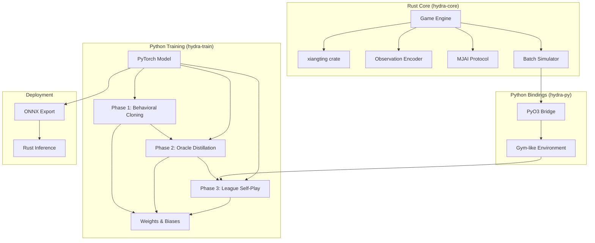
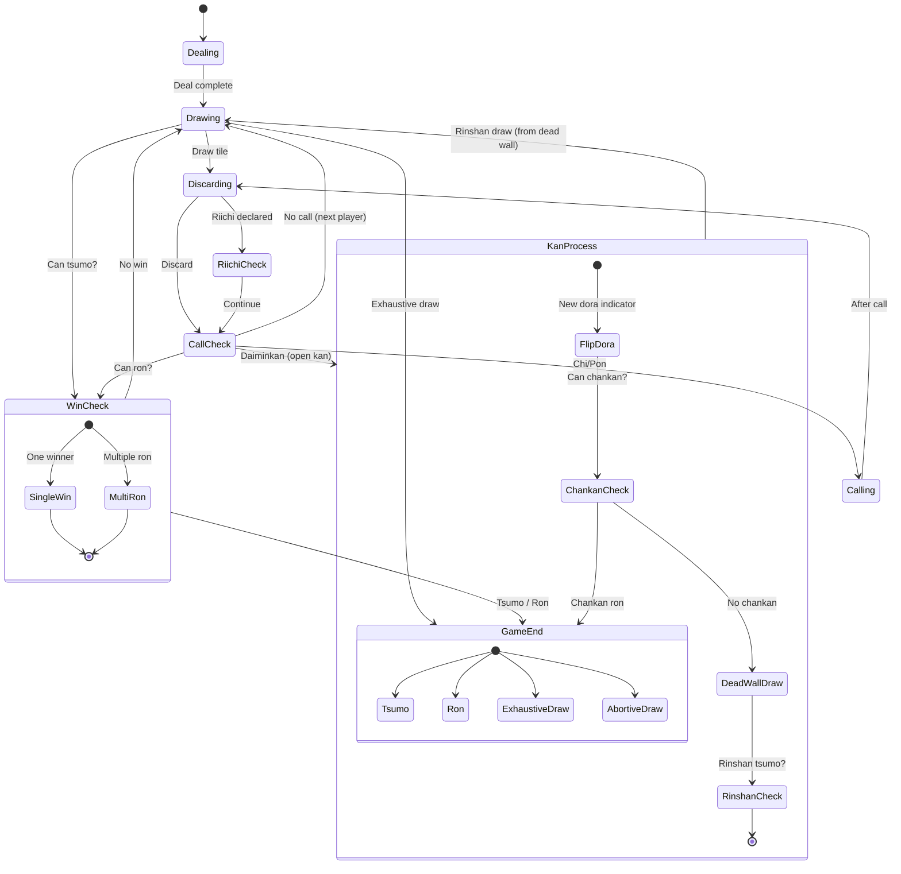
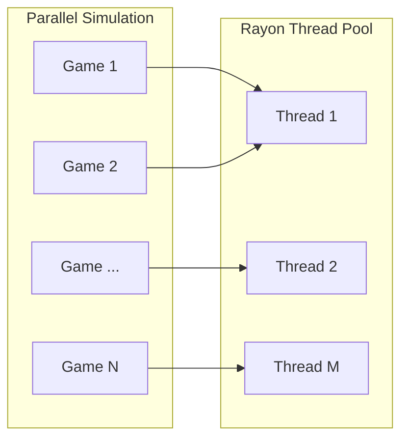
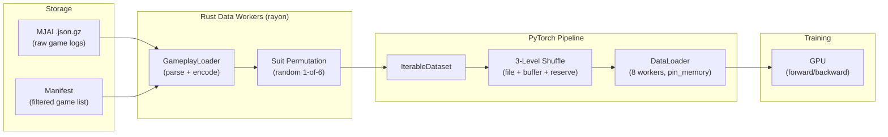
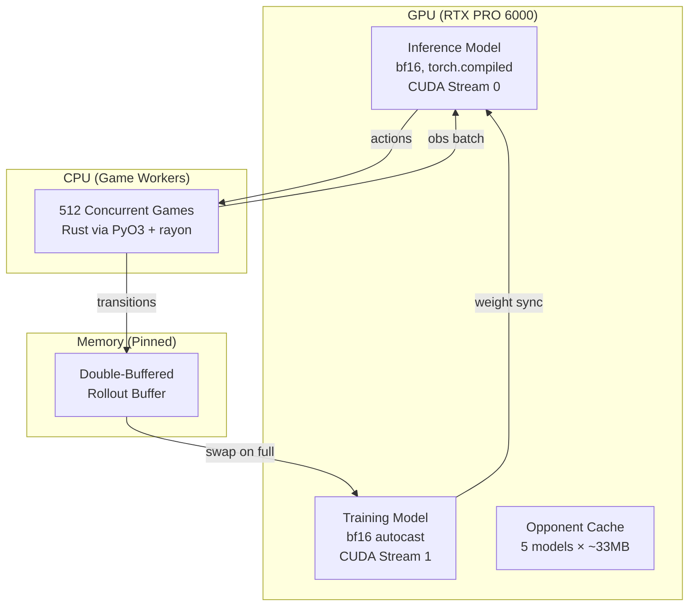
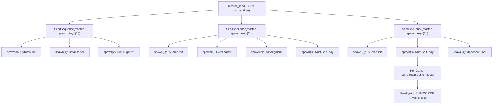
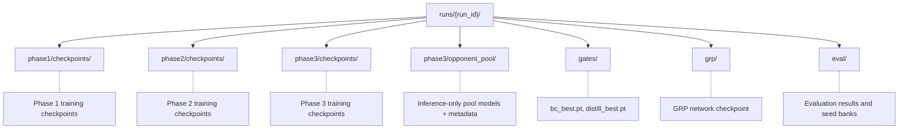
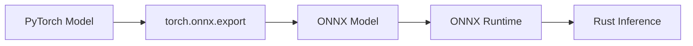
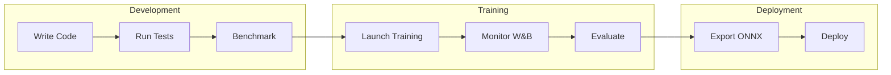

# Hydra Infrastructure Specification

## Overview

Hydra uses a hybrid Rust + Python architecture. Rust handles the game engine, observation encoding, and simulation — everything that benefits from low-level performance. Python handles neural network training and experiment tracking — everything that benefits from the ML ecosystem. This mirrors Mortal's design but with all original code (no AGPL-derived components).

## System Architecture

The system is composed of four major subsystems: the Rust core game engine, Python bindings via PyO3, the Python training stack, and the deployment pipeline. Data flows from the game engine through PyO3 into the training loop, and trained models are exported back through ONNX for pure-Rust inference.



## Rust Core (hydra-core)

### Crate Dependencies

| Crate | Version | Purpose | License |
|-------|---------|---------|---------| 
| xiangting | 5.0+ | Shanten calculation | MIT |
| pyo3 | 0.22+ | Python bindings | MIT OR Apache-2.0 |
| rayon | 1.10+ | Parallel simulation | MIT OR Apache-2.0 |
| serde | 1.0+ | JSON serialization | MIT OR Apache-2.0 |
| serde_json | 1.0+ | MJAI parsing | MIT OR Apache-2.0 |
| ndarray | 0.16+ | Tensor operations | MIT OR Apache-2.0 |
| rand | 0.9+ | RNG for shuffle | MIT OR Apache-2.0 |

### Module Structure

The `hydra-core` crate is organized as a flat module layout under `src/`:

| File | Responsibility |
|------|----------------|
| `lib.rs` | Crate root and public API surface |
| `tile.rs` | Tile representation using the 0–33 index scheme |
| `hand.rs` | Hand management and meld tracking |
| `wall.rs` | Wall, dead wall, and dora indicator logic |
| `player.rs` | Player state and discard tracking |
| `game.rs` | Game state machine (see state diagram below) |
| `rules.rs` | Riichi rules validation and scoring |
| `shanten.rs` | Wrapper around the `xiangting` crate for shanten calculation |
| `encoder.rs` | Observation tensor encoder (84×34 output) |
| `safety.rs` | Suji, kabe, and genbutsu safety calculations |
| `mjai.rs` | MJAI protocol parser for log compatibility |
| `simulator.rs` | Batch game simulation with rayon parallelism |
| `python.rs` | PyO3 binding definitions exposed to Python |

### Tile Representation

The standard 34-tile index used by the `xiangting` crate:

| Index | Tiles |
|-------|-------|
| 0–8 | 1–9m (Manzu) |
| 9–17 | 1–9p (Pinzu) |
| 18–26 | 1–9s (Souzu) |
| 27–33 | E S W N 白 發 中 |

### Game State Machine

The game engine drives a finite state machine that governs the flow of each round. States transition through dealing, drawing, discarding, call checks, kan processing, riichi declarations, and win checks until the round ends by tsumo, ron, or draw.



**Abortive draws handled:**

| Condition | Japanese | Description |
|-----------|----------|-------------|
| Kyuushu Kyuuhai | 九種九牌 | 9+ unique terminals/honors in opening hand (player choice, action 44) |
| Suufon Renda | 四風連打 | All 4 players discard the same wind on their first turn |
| Suucha Riichi | 四家立直 | All 4 players declare riichi |
| Suukaikan | 四開槓 | 4 kans declared by different players (not all by one player) |
| Sanchahou | 三家和 | Triple ron (3 players win on same discard — abortive in most rulesets) |

> **Nagashi Mangan** is checked at exhaustive draw: if a player's entire discard pile consists of terminals and honors, and none were called by opponents, they receive mangan payment.

### Observation Encoder

The observation encoder produces the 84×34 tensor defined in the input encoding specification. It translates the current game state — hand tiles, discards, melds, dora indicators, and safety information — into a fixed-size numerical representation suitable for neural network input.

Key performance considerations:

- **Pre-allocated buffers** — tensor memory is allocated once per environment instance and reused across turns to avoid allocation overhead
- **Contiguous memory layout** — the 84×34 tensor is stored as a flat contiguous array for cache efficiency and compatibility with downstream BLAS/NN operations
- **Incremental updates (planned optimization)** — most planes change minimally between turns (hand ±1 tile, discards +1). Delta-based encoding could reduce per-turn work, pending benchmarking to confirm the bookkeeping overhead is worthwhile. Mortal's encoder recomputes the full tensor from scratch each turn.

### Batch Simulator

For self-play training, the batch simulator runs many games in parallel using rayon's work-stealing thread pool. Each game runs independently, and rayon distributes games across available CPU threads automatically.



Target throughput for pure Rust simulation (no NN inference): 100,000+ games/hour per core. End-to-end training throughput (with GPU inference in the loop) targets 10,000+ games/hour, bottlenecked by neural network forward passes rather than game simulation.

## Data Pipeline

This section specifies the complete data pipeline for Phase 1 behavioral cloning (supervised learning from expert game logs). It resolves five design gaps: storage format, data loading architecture, filtering strategy, suit permutation augmentation, and volume/throughput estimates. The same pipeline foundations extend to Phases 2–3 (oracle distillation and self-play RL), where the data source shifts from static logs to live self-play trajectories.

### Pipeline Architecture



### Gap 1: Storage Format

**Decision: On-the-fly Rust parsing (default) with optional pre-encoded shards for production.**

The default path stores raw MJAI logs as `.json.gz` files (~70 GB for 7M games). A Rust `GameplayLoader` parses and encodes observations on-the-fly using rayon parallelism. This is Mortal's proven architecture — Mortal processes even larger tensors (1012×34 vs Hydra's 84×34) with the same approach, demonstrating that on-the-fly parsing is not a bottleneck at this scale.

For production runs where maximum GPU utilization is critical, an optional pre-encoding step writes sharded binary files with Blosc+LZ4 compression (~500–800 GB for 7M games compressed at ~7:1 ratio). This path eliminates all CPU parsing overhead but requires re-encoding whenever features change. Pre-encoding is only justified if GPU utilization drops below 80% with on-the-fly parsing.

**Rejected alternatives:**
- **HDF5:** Thread-safety issues with h5py; single-writer bottleneck prevents parallel encoding.
- **Parquet:** Columnar format optimized for heterogeneous tabular data, wrong data model for dense homogeneous tensors.
- **FFCV:** Optimizes for JPEG decode-to-GPU pipeline — our bottleneck is not image decoding.
- **WebDataset:** Overkill for single-node local training.

**Evidence from game AI systems:** AlphaZero, AlphaStar, and OpenAI Five all use in-memory buffers or on-the-fly encoding. lc0 uses fixed-size binary structs in `.gz` files. KataGo uses `.npz` files. None use HDF5 or Parquet.

### Gap 2: Data Loading Pipeline

**Decision: PyTorch IterableDataset backed by Rust batch decoding via PyO3.**

Each DataLoader worker owns a disjoint slice of the file list (Mortal's partitioning pattern). Within each worker, the Rust `GameplayLoader` uses rayon parallel iterators and `GzDecoder` for concurrent file parsing, producing pre-encoded observation tensors that are yielded directly to the PyTorch training loop.

**DataLoader configuration:**

| Parameter | Value | Rationale |
|-----------|-------|-----------|
| `batch_size` | 2048 | 4× Mortal's 512; use linear LR scaling rule |
| `num_workers` | 8 | Each worker spawns rayon threads internally |
| `RAYON_NUM_THREADS` | 4 per worker | 8×4 = 32 logical threads matches recommended CPU |
| `pin_memory` | `True` | Saves 0.5–2ms per batch on host-to-device transfer |
| `persistent_workers` | `True` | Avoids worker re-spawn overhead between epochs (Mortal misses this) |
| `prefetch_factor` | 2 | Default is sufficient for NVMe-backed storage |
| `drop_last` | `True` | Clean batch boundaries for consistent gradient scale |

**Shuffling strategy (3-level):**

1. **File-level:** Shuffle the shard/file order at the start of each epoch. Every worker receives a freshly permuted file list.
2. **Buffer-level:** Each worker loads `file_batch_size=100` shards (~100K decisions) into a memory buffer and performs a full Fisher-Yates shuffle within the buffer before yielding batches.
3. **Reserve mixing:** Retain 20% of the buffer when loading the next file batch, mixing old and new data to prevent sharp shard boundaries.

This 3-level strategy achieves temporal decorrelation comparable to a full-dataset shuffle without requiring the entire dataset to fit in memory. It mirrors KataGo's sliding-window shuffler design.

**Sharding:** Raw MJAI logs (7M individual game files) are pre-packed into ~700 mega-shards of 10K games each. Each shard is a concatenated gzip archive with a small JSON index mapping game offsets. This avoids filesystem metadata overhead from millions of small files and enables efficient sequential reads.

### Gap 3: Filtering Strategy

**Decision: Pre-filter once, cache filtered game list in a manifest file.**

Rather than filtering at training time (wasting CPU cycles re-evaluating criteria every epoch), a one-time scan builds a manifest of all games with metadata. Training loads only from the filtered manifest.

**Three-step process:**

1. **Scan:** Parse all 7M game files and extract metadata (player names, room/lobby, source, basic stats). Store as a JSON manifest or SQLite database.
2. **Filter:** Apply quality criteria per data tier (see below). Output a filtered file list.
3. **Train:** The DataLoader reads only files in the filtered list. Zero runtime filtering overhead.

**Data quality tiers:**

| Tier | Source | Filter Criteria | Training Weight |
|------|--------|-----------------|-----------------|
| Tier 1 | Tenhou Houou (Phoenix) | No additional filter (already R>=2000, 7-dan+) | 1.0 |
| Tier 1 | Majsoul Throne Room | No additional filter (Saint+ room) | 1.0 |
| Tier 2 | Majsoul Jade Room | Player-level stats filter (see below) | 0.5–0.7 |

**Player-level filtering for Tier 2 data** (inspired by Mortal Discussion #91, where Nitasurin demonstrated +1.8–2.0 PT improvement from player-level cleaning alone):

| Criterion | Threshold | Rationale |
|-----------|-----------|-----------|
| `games` | >= 30 | Minimum sample size for reliable stats |
| `avg_rank` | <= 2.60 | Better than random (2.50 = uniform) |
| `dealin_rate` | <= 0.16 | Not recklessly aggressive |
| `win_rate` | >= 0.17 | Actually wins hands |

Only qualifying players' decision perspectives are used for training, even in games that include weaker players. This trains the model on what good players do, not what their opponents do.

**Game-level exclusions:**

- Games with disconnected players (incomplete decision sequences)
- Games with >3 timeouts per player (AFK/bot behavior)
- Games with <4 actions per player (aborted or bugged games)

**Estimated dataset after filtering:** ~5–6M high-quality game perspectives from the 7M raw corpus.

### Gap 4: Suit Permutation Augmentation

**Decision: On-the-fly random permutation, 1 of 6 per game per epoch.**

Mahjong strategy is invariant to suit identity — manzu, pinzu, and souzu are functionally interchangeable. Exploiting this symmetry via suit permutation augmentation effectively multiplies the dataset by up to 6× without any disk overhead.

**Specification:**

- **Full permutation group:** All 3! = 6 permutations of the three suit indices. Mortal only implements 2× (man-pin swap); Hydra uses the complete group.
- **Application point:** At the MJAI Event level, before observation encoding. Each tile ID in the event stream is remapped through the chosen permutation. This is the same architectural point as Mortal but extended to all 6 permutations.
- **Granularity:** One random permutation is sampled per game, not per decision. This maintains game-internal consistency (the same physical tiles map to the same permuted tiles throughout the game).
- **Implementation:** `permute_suits(tile_id: u8, perm: [u8; 3]) -> u8` where `perm` maps `[manzu_target, pinzu_target, souzu_target]` and is one of the 6 permutations of `[0, 1, 2]`.
- **Aka-dora handling:** `deaka()` to get the base tile, permute the base, then `re_akaize()` if the original was aka. This is Mortal's proven pattern for handling the red five special tiles.
- **CPU cost:** Negligible — a `const fn` that divides by 9, remaps the suit, and reconstructs the tile ID. Nanoseconds per tile.
- **Coverage:** Over 6 epochs, each game is statistically seen under all 6 permutations. No need to pre-encode augmented copies.

### Gap 5: Volume and Throughput Estimates

All estimates scaled to 7M games × ~60 decisions per game = ~420M total decisions.

**Storage volumes:**

| Component | Size | Notes |
|-----------|------|-------|
| Raw MJAI logs (`.json.gz`) | ~70 GB | Source of truth; always retained |
| Student obs (84×34×f32, uncompressed) | ~4.5 TB | Never stored — generated on-the-fly |
| Oracle obs (205×34×f32, uncompressed) | ~10.9 TB | Never stored — generated on-the-fly |
| With 6× suit augmentation (uncompressed) | ~27 TB | Never pre-computed — applied on-the-fly |
| Pre-encoded shards (Blosc+LZ4, ~7:1) | ~640 GB | Optional production path only |
| Actions + masks + metadata | ~22 GB | Compact ancillary data |

**Memory budget (RTX PRO 6000 Blackwell, 96 GB VRAM):**

| Component | Memory | Phase |
|-----------|--------|-------|
| Model (16.7M params, bf16) | ~34 MB | All phases |
| Batch (2048 × 84×34 × 4B) | ~22 MB | Phase 1 (BC) |
| DataLoader workers (8 × prefetch 2) | ~180 MB | Phase 1 (BC) |
| PPO rollout buffer (4096 steps × 512 envs, +oracle) | ~77 GB | Phase 2–3 (RL) |
| **Total training footprint** | **< 1 GB** (BC) / **~78 GB** (PPO+oracle) | — |

The PPO rollout buffer in Phases 2–3 is the dominant memory consumer, using ~77 GB of the 96 GB available VRAM. Phase 1 behavioral cloning is memory-trivial.

**Throughput estimates:**

| Metric | Value | Notes |
|--------|-------|-------|
| Target training speed | 10K steps/hour @ batch 2048 | ~20M samples/hour |
| Required sustained I/O | ~32 MB/s | From MJAI source files |
| NVMe sequential read capacity | ~7,000 MB/s | 218× headroom over requirement |
| Rust parser capacity (8 workers) | ~160K samples/sec | 28× headroom over requirement |
| GPU compute (forward + backward) | Bottleneck | Only true constraint |

**Bottom line:** On-the-fly Rust parsing is the clear winner. Both NVMe I/O and CPU parsing capacity are massively overprovisioned relative to the training throughput target. The GPU is the sole bottleneck — specifically the forward/backward pass during training and the PPO rollout buffer size during Phases 2–3.

## Python Bindings (hydra-py)

### PyO3 Interface

The following Rust functions are exposed to Python via PyO3:

| Python Function | Rust Implementation |
|-----------------|---------------------|
| `Game.new()` | `Game::new()` |
| `Game.step(action)` | `Game::step()` |
| `Game.get_observation()` | `Encoder::encode()` |
| `Game.legal_actions()` | `Game::legal_actions()` |
| `Game.is_done()` | `Game::is_terminal()` |
| `simulate_batch(n)` | `Simulator::run_batch()` |

### Gym-like Environment

The Python environment wraps the Rust game engine in a Gymnasium-compatible interface. Two classes are provided:

**MahjongEnv** — single-environment interface for one game at a time:

| Method | Signature | Description |
|--------|-----------|-------------|
| `reset()` | → `observation` | Resets the environment and returns the initial observation tensor |
| `step(action)` | → `(obs, reward, done, info)` | Advances the game by one action, returning the new observation, reward signal, terminal flag, and info dictionary |
| `legal_actions()` | → `list` | Returns the list of currently legal action indices |
| `render()` | → `str` | Returns a human-readable string representation of the current game state |

**VectorEnv** — batched interface that manages multiple `MahjongEnv` instances in parallel:

| Method / Attribute | Signature | Description |
|--------------------|-----------|-------------|
| `num_envs` | `int` (attribute) | The number of parallel environments in the batch |
| `reset()` | → `observations` | Resets all environments and returns a batch of initial observations |
| `step(actions)` | → `(obs, rewards, dones, infos)` | Steps all environments simultaneously with a batch of actions |

`VectorEnv` wraps multiple `MahjongEnv` instances and manages them in parallel, providing a batched API for efficient PPO rollout collection.

### Installation

The `hydra-py` package is built and installed via maturin:

```
maturin develop --release
```

## Python Training (hydra-train)

### Dependencies

| Package | Purpose |
|---------|---------| 
| torch | Neural network definition and training |
| numpy | Array operations and data manipulation |
| wandb | Experiment tracking and visualization |
| hydra-py | Game environment (Rust-backed) |
| einops | Tensor reshaping utilities |
| rich | Progress bars and terminal output |
| mahjong (dev) | Hand scoring oracle for Rust engine verification — yaku/han/fu/score validation against 11M+ Tenhou hands (pin to v1.4.0) |

### Per-Phase Training Infrastructure

Hydra's training proceeds through three distinct phases with different data sources, loss functions, and infrastructure requirements. Each phase builds on the previous, with explicit transition gates ensuring readiness. HYDRA_SPEC.md defines the algorithms and loss functions; this section specifies the infrastructure that runs them.

#### Phase 1: Behavioral Cloning (Supervised)

**Data source:** Phase 1 Data Pipeline (see § Data Pipeline above) — 7M MJAI game logs, on-the-fly Rust parsing, 3-level shuffle.

**Optimizer configuration:**

| Parameter | Value | Rationale |
|-----------|-------|-----------|
| Optimizer | AdamW | Decoupled weight decay; faster convergence than SGD for short runs |
| Peak LR | 5e-4 | 4× Mortal's 1e-4 due to 4× batch size (linear scaling rule) |
| Final LR | 1e-5 | Cosine annealing floor |
| Warmup | 5% of total steps (~30K steps) | Prevents early gradient explosions with large batch |
| Weight decay | 0.01 | Applied only to Conv1d and Linear weights; biases and GroupNorm params excluded |
| Betas | (0.9, 0.999) | AdamW defaults |
| Epsilon | 1e-8 | AdamW default |
| Gradient clip | 1.0 (max grad norm) | Prevents training spikes; Mortal disables this but BC has different dynamics |

**Batch and precision:**

| Parameter | Value | Rationale |
|-----------|-------|-----------|
| Batch size | 2048 | 4× Mortal's 512; linear scaling with LR |
| Gradient accumulation | 1 | Effective batch = 2048 (sufficient on 96GB) |
| Precision | bf16 (autocast) | Blackwell-native; same dynamic range as fp32, no GradScaler needed |
| torch.compile | Enabled | ~10-30% throughput gain via operator fusion; GroupNorm safe in bf16 |

**Loss function:**
L_IL = CE(π, a_human) + 0.5 × MSE(V, outcome) + 0.1 × L_aux

Where L_aux includes GRP rank prediction (CE), tenpai classification (BCE), and danger estimation (focal BCE). See HYDRA_SPEC.md § Phase 1 for component definitions and weights.

**Training schedule:**
- 3 epochs over the filtered dataset (~5-6M games, ~360-420M decisions)
- Random 1-of-6 suit permutation per game per epoch (see § Suit Permutation Augmentation)
- Over 3 epochs, each game is seen under ~3 of the 6 possible permutations

**Early stopping and checkpointing:**
- Validate every 5K training steps on a 5% held-out game set (chronological split — last month's games)
- Primary metric: validation policy cross-entropy loss (not accuracy — loss captures calibration)
- Early stopping patience: 3 consecutive validation intervals without improvement
- Checkpoint every 10K steps; retain best + last 3; discard older (~330 MB per checkpoint)

**Resource estimates:**
- Steps per epoch: ~200K (420M decisions / 2048 per batch)
- Total training steps: ~600K (3 epochs)
- Wall time per epoch: ~2.8 hours on RTX PRO 6000 (Blackwell)
- Total wall time: ~8.5 hours for 3 epochs
- GPU memory: ~400 MB total (model + optimizer + batch — massive headroom on 96 GB)

**Monitoring (via Weights & Biases):**

| Frequency | Metrics |
|-----------|---------|
| Every step | Total loss, policy CE, value MSE, GRP CE, tenpai BCE, danger focal, learning rate, gradient norm |
| Every 5K steps | Top-1/top-3 action accuracy, discard/call/riichi accuracy, policy entropy, throughput (samples/sec), GPU memory |
| Every validation | Val loss, val accuracy breakdown, train-val gap, per-action-type accuracy |

**Phase 1 readiness gate** (all must pass to enter Phase 2):
- Discard accuracy ≥ 65%
- SL loss plateaued (no improvement in 3 validation intervals)
- Test play average placement ≤ 2.55 (1v3 vs random baseline)
- Deal-in rate ≤ 15% in test play

#### Phase 2: Oracle Distillation (RL)

**Data source:** Self-play trajectories generated by the teacher model (initially) and student model (progressively). No static game logs.

**Model configuration:**

| Component | Configuration | VRAM |
|-----------|--------------|------|
| Teacher | Frozen, bf16, eval mode; Conv1d(289, 256, 3) stem; ~16.7M params | ~33 MB |
| Student | fp32 master weights, bf16 autocast for compute; Conv1d(84, 256, 3) stem; ~16.5M params | ~67 MB |
| Teacher gradients | None (frozen) | 0 MB |
| Student optimizer (AdamW m+v) | fp32 | ~134 MB |
| Student gradients | fp32 | ~67 MB |
| **Total Phase 2 VRAM** | | **~465 MB** |

The teacher and student share identical ResBlock weights (all 40 blocks are architecturally equivalent and weight-transferable). Only the stem Conv1d differs: the teacher's 289-channel input concatenates 84 public + 205 oracle channels before encoding.

**Initialization from Phase 1:**
- Load Phase 1 best checkpoint into all student ResBlocks, policy head, value head, and aux heads
- Copy student ResBlocks into teacher (identical weights)
- Initialize teacher stem Conv1d(289, 256, 3) with random weights (Kaiming/He init)
- Freeze teacher: set to eval mode, disable gradients, cast to bf16
- Save Phase 1 policy as a frozen "KL anchor" for catastrophic forgetting prevention
- Create fresh AdamW optimizer (do NOT carry Phase 1 optimizer state — stale momentum from BC loss is counterproductive for RL)

**Optimizer configuration:**

| Parameter | Value | Rationale |
|-----------|-------|-----------|
| Optimizer | AdamW (fresh) | Reset from Phase 1; stale Adam momentum harms RL |
| Warmup LR | 1e-6 → 2.5e-4 | 10K step warmup from ~1/250th of peak (KataGo-style gradual warmup) |
| Peak LR | 2.5e-4 | Standard for PPO fine-tuning |
| Final LR | 5e-5 | Cosine annealing floor |
| Weight decay | 0.01 | Same grouping as Phase 1 |
| Gradient clip | 0.5 (max grad norm) | Tighter than Phase 1 — RL gradients are noisier |

**Loss function:**
L_distill = L_PPO(π_S) + λ_KL × D_KL(π_S ‖ π_T) + λ_anchor × D_KL(π_S ‖ π_BC)

Where:
- L_PPO includes policy, value, and entropy components (see HYDRA_SPEC.md § Phase 2)
- λ_KL follows the feature dropout schedule (decays from 1.0 to 0.3)
- λ_anchor = 0.1, decaying to 0 over Phase 2 (prevents catastrophic forgetting of BC knowledge)
- D_KL uses temperature τ = 3.0 (fixed, not annealed — annealing changes the meaning of "dark knowledge" mid-training)

**Feature dropout schedule** (group-level scalar multiplication, from HYDRA_SPEC.md):

| Stage | mask_opp (39ch) | mask_wall (166ch) | λ_KL | Rationale |
|-------|-----------------|-------------------|------|-----------|
| Early | 1.0 | 1.0 | 1.0 | Full oracle info; teacher policy is strong target |
| Mid | 0.7 | 0.5 | 0.8 | Wall drops faster — future draws are pure stochasticity, hardest to infer from public info |
| Late | 0.3 | 0.2 | 0.5 | Forcing student toward public-only representations |
| Final | 0.0 | 0.0 | 0.3 | Student fully blind; minimal KL tether remains for stability |

Post-dropout continuation: LR decayed to 1/10 of current value, importance weight rejection applied to prevent large policy updates on the now-fully-blind student.

**GroupNorm:** Hydra uses GroupNorm(32) which has no running statistics (unlike BatchNorm). GroupNorm parameters learned during Phase 1 carry forward without corruption concerns. Mortal freezes BatchNorm during RL to prevent self-play distribution shift from corrupting BN statistics — this issue does not apply to Hydra.

**Phase 2 readiness gate** (all must pass to enter Phase 3):
- Student average placement ≤ 2.45 (1v3 vs Phase 1 baseline)
- Deal-in rate ≤ 13%
- Win rate ≥ 21%
- Win/deal-in ratio ≥ 1.5:1
- Tenpai head AUC ≥ 0.80
- Win rate plateau for 20M+ steps (no improvement)

#### Phase 3: League Self-Play (PPO)

**Data source:** Live self-play trajectories from concurrent game workers.

**Self-play architecture:**

Hydra uses a single-process, multi-threaded architecture for Phase 3. Python threading (not multiprocessing) is used because the Rust game engine releases the GIL during CPU-bound work. No IPC overhead. No Ray. No distributed framework.



**Key architecture decisions:**
- **Dual CUDA streams:** Stream 0 handles inference (action selection during self-play). Stream 1 handles PPO gradient computation. These overlap on the GPU, maximizing utilization.
- **InferenceServer thread:** A dedicated Python thread drains an observation queue, batches observations from all active games (~512 per step), runs a single GPU forward pass, and distributes actions back via futures. Batch inference latency: ~0.5-1ms for batch 512.
- **Game workers:** The Rust game engine runs 512 concurrent hanchans. Feature encoding is parallelized via rayon within the game batch (Mortal's proven pattern). Game logic releases the GIL.
- **Double-buffered rollout storage:** Buffer A fills from self-play while Buffer B is consumed by PPO training. Both buffers use pre-allocated pinned memory for fast async CPU→GPU transfer via non_blocking=True. Observations stored as uint8 where possible, cast to float32 per-minibatch.

**Opponent pool:**

| Parameter | Value | Rationale |
|-----------|-------|-----------|
| Max checkpoints on disk | 20 | FIFO eviction; ~1.3 GB total disk |
| GPU-cached models | 5 (LRU) | ~165 MB VRAM for 5 × 33MB bf16 models |
| Save interval | Every 500 PPO update steps | ~2-6 new checkpoints per day |

| Opponent Selection | Weight | Purpose |
|--------------------|--------|---------|
| Current self (all 4 seats) | 50% | Core self-play signal |
| Random pool checkpoint | 30% | Diversity; prevents strategy collapse |
| Phase 2 baseline (frozen) | 20% | Anchor; prevents catastrophic forgetting |

**Seat rotation:** Every game seed is played in 4 rotations (challenger at East/South/West/North), following Mortal's 1v3 duplicate protocol. This controls for positional advantage (East player has slight edge in Mahjong).

**PPO hyperparameters:**

| Parameter | Value | Notes |
|-----------|-------|-------|
| Clip ε | 0.1 | Conservative; matches HYDRA_SPEC |
| Entropy coef | 0.01 → 0.005 | Linear decay; prevents policy collapse in discrete action space |
| Value loss coef | 0.5 | Standard |
| γ (discount) | 1.0 | Undiscounted episodic (matches Mortal) |
| GAE λ | 0.95 | Standard bias-variance tradeoff for non-terminal rewards |
| LR | 1e-4, cosine annealing | Lower than Atari PPO default — fine-tuning a pre-trained model |
| Adam ε | 1e-5 | NOT PyTorch default 1e-8 (PPO-specific) |
| Update epochs | 3 | Conservative for self-play (monitor approx_kl; reduce to 2 if >0.03) |
| Minibatch size | 4096 | Transitions per PPO minibatch |
| Gradient clip | 0.5 (max grad norm) | PPO standard |
| Advantage norm | Per-minibatch (mean/std, eps=1e-8) | PPO standard, confirmed by CleanRL |

**Anti-forgetting mechanisms:**
- KL penalty against Phase 2 policy: λ_KL = 0.05, annealed to 0 over the first 30% of Phase 3 training
- GroupNorm parameters frozen from Phase 2 (no running stats to drift)
- Opponent pool includes Phase 2 baseline at 20% weight

**Resource estimates:**

| Metric | Value |
|--------|-------|
| Concurrent games | 512 |
| Inference batch | ~512 obs (~0.5-1ms per GPU forward pass) |
| Game throughput | 400-800 hanchans/sec |
| Transitions per second | 200K-400K |
| PPO updates per day | 40-120 |
| GPU memory (total) | ~3.7 GB (model + optimizer + rollout + opponent cache) |
| Wall time to meaningful improvement | 3-7 days |
| Total Phase 3 training | 2-4 weeks |

#### Phase Transitions

**General principle:** Always reset optimizer and LR scheduler at phase boundaries. Always warmup LR from ~1/20th of the target peak. Evidence: Mortal explicitly discards optimizer state when switching from offline to online training. KataGo warms up from 1/20th of target LR over 8 stages.

**What carries over vs. resets at each phase boundary:**

| Component | Phase 1 → 2 | Phase 2 → 3 |
|-----------|-------------|-------------|
| ResBlock weights (40 blocks) | ✅ Carry | ✅ Carry |
| Policy head | ✅ Carry (also freeze copy as KL anchor) | ✅ Carry |
| Value head | ❌ Reset (new oracle critic architecture) | ✅ Carry |
| Aux heads (GRP, tenpai, danger) | ✅ Carry | ✅ Carry |
| Stem Conv1d | ⚠️ Student: carry; Teacher: new random stem | ✅ Carry (student stem) |
| Optimizer state (Adam m, v) | ❌ Fresh AdamW | ❌ Fresh AdamW |
| LR scheduler | ❌ New schedule with warmup | ❌ New schedule with warmup |
| GroupNorm parameters | ✅ Carry (no running stats) | ✅ Carry (freeze during RL) |
| Global step counter | ✅ Keep (logging continuity) | ✅ Keep |
| Teacher model | N/A → Create | ❌ Discard |
| Opponent pool | N/A | N/A → Initialize |

**Phase 1 → 2 procedure:**
1. Save Phase 1 best checkpoint as bc_best.pt
2. Verify all Phase 1 readiness gate metrics pass
3. Initialize teacher from student weights + new random oracle stem
4. Freeze teacher (eval mode, no gradients, bf16)
5. Freeze copy of Phase 1 policy as KL anchor
6. Create fresh AdamW with warmup schedule
7. Begin Phase 2 training loop

**Phase 2 → 3 procedure:**
1. Save Phase 2 best checkpoint as distill_best.pt
2. Verify all Phase 2 readiness gate metrics pass
3. Verify feature dropout masks have reached 0.0 (student is fully blind)
4. Discard teacher model and oracle critic
5. Initialize opponent pool with distill_best.pt and bc_best.pt as frozen anchors
6. Freeze copy of Phase 2 policy as new KL anchor
7. Create fresh AdamW with warmup schedule
8. Begin Phase 3 league training

#### Rating and Evaluation

**Rating system:** OpenSkill PlackettLuce — a patent-free Bayesian ranking system with native 4-player support (Weng & Lin 2011, JMLR). Each checkpoint maintains a skill belief (μ, σ). Conservative rating = μ − 3σ.

**Evaluation protocol:** 1v3 duplicate format following Mortal's established methodology:
- Challenger (1 copy) vs Champion (3 copies)
- Each game seed played 4× with the challenger rotating through East/South/West/North
- Deterministic replay: given (seed, kyoku, honba), walls/draws/dora are fixed
- This controls for both positional advantage and tile draw variance

**Rank point distribution:** [90, 45, 0, −135] (Tenhou Houou-style uma)

**Evaluation scale:**

| Purpose | Games | Sets (×4 rotations) | Sufficient For |
|---------|-------|---------------------|----------------|
| Quick eval (during training) | 4,000 | 1,000 | Trend detection |
| Full eval (checkpoint release) | 200,000 | 50,000 | Publication-quality claims |
| Ablation study | 1,000,000 | 250,000 | Detecting <1 rank pt/game differences |

**Statistical significance:** Welch's t-test on per-game rank points (p < 0.05). Mahjong has high per-game variance (~σ = 80 rank pts); detecting a 1 rank-pt-per-game improvement at 95% confidence requires ~100K games in 1v3 duplicate format.

#### Distributed Strategy

**Single GPU is sufficient for all three phases.** The model is ~16.7M parameters (~33 MB in fp16/bf16). Total VRAM usage never exceeds 4 GB, even in Phase 3 with 5 cached opponent models and a large rollout buffer. The RTX PRO 6000's 96 GB VRAM is massively overprovisioned — the bottleneck is game generation throughput (CPU-bound), not GPU memory or compute.

**No DDP or FSDP is needed.** Distributed data parallelism is designed for models that don't fit on one GPU or for scaling batch size across devices. Neither applies: the model fits 2,900× over in 96 GB, and batch_size=2048-4096 is already sufficient for stable gradients.

**Parallelism strategy by phase:**

| Phase | GPU | CPU | Parallelism |
|-------|-----|-----|-------------|
| Phase 1 (BC) | Forward/backward on single device | 8 DataLoader workers with rayon | Data parallelism via workers |
| Phase 2 (Oracle) | Teacher (bf16 inference) + Student (training) | Self-play game workers | Dual model, single device |
| Phase 3 (League) | Dual CUDA streams (inference + training) | 512 concurrent games via Rust/rayon threading | Overlapped inference and gradient computation |

**Future scalability (if needed):** If Phase 3 game throughput becomes the bottleneck, the architecture supports adding CPU-only game worker machines that communicate game trajectories to the GPU trainer via shared filesystem or ZMQ (Mortal's proven pattern). The model architecture does not need to change.

### Model Definition

The PyTorch model implements the SE-ResNet architecture defined in HYDRA_SPEC.md. Key infrastructure considerations:

- **torch.compile()** is enabled for all phases. For Phase 3 self-play inference, use mode="reduce-overhead" which activates CUDAGraphs for fixed-shape inputs — particularly beneficial for the InferenceServer where batch size is stable. For training, use mode="default" to allow dynamic shapes from action masking.
- **Precision: bf16** (not fp16). Blackwell GPUs have native bf16 tensor core support at full throughput. bf16 has the same dynamic range as fp32 (8 exponent bits), eliminating the need for GradScaler and the risk of gradient overflow/underflow. fp16 (5 exponent bits, max 65504) requires GradScaler and can cause training instabilities early in learning when gradients are large.
- **Gradient checkpointing** is available but unnecessary at this model scale. The ~16.7M param model's activations occupy ~100-200 MB during forward/backward — negligible on 96 GB. Gradient checkpointing would add ~30% compute overhead for <0.2% memory savings.
- **GroupNorm(32)** is used throughout instead of BatchNorm. GroupNorm has no running statistics, so it is immune to distribution shift between BC data and self-play data — unlike Mortal's BatchNorm which must be frozen during online RL.
- **Orthogonal initialization:** std=√2 for hidden layers, 0.01 for policy head, 1.0 for value head (PPO standard from Andrychowicz et al. 2021).

### Reproducibility and Seeding Strategy

Training a mahjong AI involves randomness at every layer: tile shuffles, suit augmentation, DataLoader ordering, model initialization, GPU kernel scheduling, and opponent selection. This section specifies how Hydra governs all sources of randomness to enable deterministic replay, meaningful ablations, and post-hoc debugging — without sacrificing training performance.

**Design philosophy:** Seed logging is more valuable than seed fixing. Full bitwise reproducibility is achievable for Phase 1 and useful for debugging, but Phases 2–3 are inherently stochastic due to RL exploration and system-level non-determinism. The strategy therefore prioritizes game-level determinism (always achievable) and component-level isolation (always auditable) over global training determinism (sometimes achievable, never required).

#### Master Seed Contract

A single integer master seed governs all randomness in a training run. This seed is the sole input needed to reconstruct the full random state of any component at any point in training.

- **Source:** Passed as a CLI argument (`--seed`). Logged to W&B as a top-level run config parameter at run start.
- **Contract:** Same `master_seed` + same code version + same hardware = bitwise-identical Phase 1 training; approximately identical Phases 2–3 (see Known Limitations below).
- **Default behavior:** If no seed is provided, one is generated from `os.urandom`, converted to a 64-bit integer, and logged. This ensures every run is reproducible after the fact — the seed is never lost.
- **Rust side:** The master seed feeds into the `rand 0.9+` ecosystem listed in the Crate Dependencies table. All Rust-side RNG is derived from this seed, never from system entropy during training.

#### Seed Hierarchy

**Decision: NumPy SeedSequence as the root of all randomness.**

NumPy's `SeedSequence` implements a hash-based seed derivation scheme (based on ThreeFry) that guarantees statistically independent child streams from a single parent seed. This eliminates the classic anti-pattern of using `seed + i` for component seeds, which produces correlated low bits across components.

**Component allocation via `spawn()`:**

| Spawn Index | Component | Description |
|-------------|-----------|-------------|
| 0 | PyTorch model init | Seeds `torch.manual_seed()` before model construction |
| 1 | DataLoader workers | Seeds the `torch.Generator` passed to DataLoader |
| 2 | Suit augmentation | Seeds per-worker permutation selection |
| 3 | Rust game engine | Session seed for self-play game generation |
| 4 | Opponent pool selection | Seeds opponent category sampling (Phase 3) |
| 5 | Evaluation seed bank | Seeds generation of the fixed evaluation game set |

**Phase-level derivation:** Each training phase derives its own `SeedSequence` via `SeedSequence(master_seed, spawn_key=(phase_number,))`. This ensures Phase 2 explores different random trajectories than Phase 1 even though both originate from the same master seed.



**Anti-patterns (never do):**
- `seed + i` for sequential component seeds — correlated low bits across components
- Reusing the same seed for multiple components — introduces hidden statistical dependencies
- Calling `random.seed()` at module import time — pollutes the global RNG state before the hierarchy is established

#### Per-Component Seeding

**3a. PyTorch (model init and training)**

`torch.manual_seed(component_seed)` seeds CPU and all CUDA device RNG streams simultaneously. This is called once before model construction at the start of each phase, ensuring that orthogonal initialization (specified in the Model Definition section) produces identical weights given the same seed. During training, PyTorch's RNG governs dropout (if any) and any stochastic layers — though Hydra's architecture uses no dropout, so the primary effect is on initialization.

**3b. DataLoader Workers**

Each DataLoader worker receives a deterministic seed derived from the hierarchy's DataLoader child via PyTorch's `Generator` parameter. The `worker_init_fn` callback uses this seed to initialize each worker's local NumPy and Python `random` state, ensuring that the 8 workers specified in the Data Loading Pipeline section produce deterministic file ordering and buffer shuffling across runs. Workers must never share RNG state or seed from `time()`.

**3c. Suit Augmentation**

Each DataLoader worker maintains a local RNG for selecting 1-of-6 suit permutations per game, as specified in the Suit Permutation Augmentation section. The local RNG is derived from the worker's own seed (not global state), avoiding GIL contention between workers. Over 6 epochs, this produces approximately uniform coverage of all 6 permutations for each game, without requiring coordination between workers.

**3d. Rust Game Engine (Self-Play Seeds)**

The Rust game engine receives a session seed derived from the hierarchy's game engine child. The derivation path:

- **Session level:** `SeedSequence.generate_state(8)` produces a `[u8; 32]` array, used to seed a `ChaCha8Rng` via `from_seed()`.
- **Per-game:** The session `ChaCha8Rng` uses `set_stream(game_index)` to create 2^64 independent game streams from a single session seed. Each game index maps to a unique, non-overlapping keystream.
- **Per-kyoku:** Within each game, wall shuffles use a KDF pattern proven by Mortal: `SHA-256(session_seed || nonce || kyoku || honba)` produces a 32-byte seed for a fresh `ChaCha8Rng` that drives the Fisher-Yates shuffle for that specific kyoku's wall, dead wall, and dora indicators.
- **Version pinning:** Pin `chacha20 = "=0.10.0"` in `Cargo.toml` to ensure cross-version replay stability. A minor version bump in the cipher crate could silently change the keystream, breaking deterministic replay.
- **Shuffle implementation:** Vendor the Fisher-Yates shuffle implementation rather than depending on `rand::seq::SliceRandom`. The `SliceRandom` API has changed distribution behavior across `rand` versions; a vendored shuffle with a fixed algorithm guarantees identical wall orderings across Hydra versions.
- **Cross-reference:** Deterministic replay of `(seed, kyoku, honba) → wall` is the foundation of the evaluation protocol described in the Rating and Evaluation section.

**3e. Rayon Thread RNG**

Game seeds are determined before dispatch to rayon workers — rayon distributes work, not randomness. Each game instance receives its pre-computed seed as a value parameter; no per-thread RNG is needed for game simulation. The rayon thread pool is a pure compute resource. If per-thread RNG is ever needed for future extensions (e.g., exploration noise during inference), the pattern is a `thread_local` `ChaCha8Rng` seeded from `game_seed XOR thread_index`, ensuring reproducibility regardless of work-stealing order.

**3f. Opponent Pool Selection (Phase 3)**

Opponent category selection (50% self / 30% random pool / 20% frozen baseline, as specified in the Phase 3 opponent pool table) uses its own `SeedSequence` child. Given the same seed and the same pool contents (same checkpoints at the same FIFO positions), the same opponent matchups are produced. This enables controlled ablations where only the training policy changes while the opponent schedule remains fixed.

#### CUDA Determinism

**Decision: Full determinism available for Phase 1 debugging; relaxed for Phases 2–3 performance.**

| Flag | Phase 1 (BC) | Phases 2–3 (RL) | Effect |
|------|-------------|-----------------|--------|
| `torch.manual_seed()` | Always | Always | Seeds all CPU + CUDA RNG streams |
| `cudnn.benchmark = False` | Always | Always | Disables auto-tuning; fixed-size inputs (84x34) make perf cost negligible |
| `torch.use_deterministic_algorithms(True)` | Optional (debug) | No | Forces deterministic CUDA kernels; ~5–15% overhead |

**Implementation notes:**
- `torch.use_deterministic_algorithms(True)` subsumes the older `torch.backends.cudnn.deterministic = True` — use the modern API exclusively.
- `CUBLAS_WORKSPACE_CONFIG` environment variable is no longer needed in PyTorch 2.x — deterministic cuBLAS workspace selection is handled internally when `use_deterministic_algorithms` is enabled.
- bf16 matrix multiplications are deterministic given identical inputs; non-determinism in mixed-precision training comes from reduction ordering in multi-stream operations (e.g., gradient all-reduce), not from the matmul itself.
- GroupNorm (used throughout the model, as specified in the Model Definition section) is fully deterministic — it has no running statistics and no non-deterministic CUDA kernels.
- Conv1d switches to a deterministic cuDNN kernel when deterministic mode is enabled, with ~5–8% overhead compared to the auto-tuned non-deterministic kernel.
- **Recommendation:** Enable full determinism for Phase 1 ablation studies and seed-specific debugging. Do not enable for Phases 2–3 — RL exploration, rayon work-stealing, and GIL contention already make these phases non-bitwise-reproducible, so the 5–15% overhead buys no additional reproducibility guarantee.

#### Checkpoint RNG State

Every checkpoint saves the following RNG state alongside model weights and optimizer state:

| Component | What is Saved | Purpose |
|-----------|---------------|---------|
| PyTorch CPU RNG | `torch.random.get_rng_state()` | Reproducible forward pass on resume |
| CUDA RNG (all devices) | `torch.cuda.get_rng_state_all()` | Reproducible GPU operations on resume |
| Python `random` module | `random.getstate()` | Any Python-level randomness (logging, sampling) |
| NumPy RNG | `SeedSequence` spawn counter + bit generator state | DataLoader and augmentation state |
| Training progress | Epoch number, global step, file cursor position | Reconstruct DataLoader file ordering on resume |

**Resume protocol:** On checkpoint load, all RNG states are restored before the first forward pass. The DataLoader reconstructs its file ordering from the saved epoch number and file cursor, ensuring that resumed training sees exactly the same data sequence as uninterrupted training.

- **Phase 1:** Enables bitwise-identical training continuation — the resumed run produces the same gradients as if it had never been interrupted.
- **Phases 2–3:** Enables approximate resumption. Game trajectories will differ due to thread scheduling non-determinism in rayon, but the statistical properties of the training distribution are preserved.

#### Phase Transition Seeding

At each phase boundary, all RNG components are re-seeded from the new phase's `SeedSequence` child. This extends the carry/reset table in the Phase Transitions section:

| Component | Phase 1 → 2 | Phase 2 → 3 |
|-----------|-------------|-------------|
| SeedSequence | New child: `spawn_key=(2,)` | New child: `spawn_key=(3,)` |
| PyTorch RNG | Re-seeded from new phase child | Re-seeded from new phase child |
| Rust game engine | New session seed | New session seed |
| NumPy RNG | Re-seeded | Re-seeded |
| DataLoader Generator | Re-seeded | Re-seeded |
| Opponent pool RNG | N/A | Initialized from new phase child |

**Rationale:** Re-seeding ensures each phase explores different random trajectories even with the same master seed. Without re-seeding, Phase 2's game engine would replay the same wall shuffles as Phase 1's evaluation games, creating an artificial correlation between training and evaluation data.

#### Evaluation Seed Bank

**Decision: Fixed, published seed bank for all evaluation runs.**

A standardized set of 50,000 game seeds ensures cross-run and cross-version comparability of evaluation results. The seed bank is a first-class artifact, not a runtime computation.

- **Generation:** Derived from a published constant (`EVAL_MASTER = 0x2000`) using `SeedSequence(0x2000).generate_state(50000)`. The constant follows Mortal's convention for evaluation key derivation.
- **Storage:** Checked into the repository as `data/eval_seeds.json` — never generated at runtime. This eliminates any risk of evaluation seed drift across code versions or platforms.
- **Usage tiers:**

| Tier | Seeds Used | Games (x4 rotations) | Purpose |
|------|-----------|----------------------|---------|
| Quick eval | First 1,000 | 4,000 | Trend detection during training |
| Full eval | All 50,000 | 200,000 | Publication-quality checkpoint comparison |

- **Cross-reference:** These tiers match the evaluation scale table in the Rating and Evaluation section. The ablation tier (250,000 sets / 1M games) uses a separate, larger seed bank generated from `EVAL_MASTER_ABLATION = 0x2001`.
- **Invariant:** The seed bank file is append-only. New seeds may be added for larger evaluations, but existing seeds are never reordered or removed.

#### Known Limitations

What cannot be made deterministic and why:

- **Phases 2–3 are NOT bitwise reproducible.** Four independent sources of non-determinism interact: GPU reduction ordering in multi-stream operations, rayon work-stealing thread scheduling, Python GIL contention timing, and `torch.compile()` JIT trace differences across runs.
- **Phase 1 CAN be bitwise reproducible** with `torch.use_deterministic_algorithms(True)` enabled and a fixed seed. This is the recommended configuration for ablation studies and hyperparameter sweeps.
- **Game-level replay IS always deterministic** regardless of training-level non-determinism. Given the same `(seed, kyoku, honba)` tuple, the wall shuffle, dora indicators, and draw order are identical across any platform, any Rust version, any number of threads.
- **Consistent with industry practice:** KataGo, Mortal, and AlphaStar all achieve game-level determinism without full training reproducibility. No production RL system claims bitwise-reproducible multi-phase training.
- **Reporting standard:** Following Henderson et al. 2018, report results over 5+ seeds with confidence intervals. Following Agarwal et al. 2021, use interquartile mean (IQM) with bootstrap confidence intervals for RL evaluation rather than mean +/- standard deviation, which is sensitive to outliers in heavy-tailed reward distributions.

#### Seed Logging

Every training run logs the complete seed provenance chain, enabling post-hoc reproduction of any specific game or training state:

- **Run level:** Master seed, phase seed, all component seeds, config file hash, `Cargo.lock` hash.
- **Game level:** Every self-play game logs its game seed in trajectory metadata. This enables replaying any specific game from a training run for debugging or analysis.
- **Evaluation level:** Seed bank file hash and any per-run overrides are logged.
- **Debugging workflow:** Failed reproduction? Check the logged seed, code version, and `Cargo.lock` hash. If all three match, the discrepancy is due to system-level non-determinism (thread scheduling, GPU reduction order) — not a code bug.

## Checkpoint Management

This section specifies the full checkpoint lifecycle: what is saved, where it lives on disk, how saves are made atomic and verifiable, how checkpoints are retained and pruned across training phases, and how they are loaded at phase transitions. The design prioritizes crash safety (no half-written files), auditability (every checkpoint is hash-verified), and operational simplicity (shell-friendly naming, standard tooling).

### Checkpoint Format

Every checkpoint is a single dictionary serialized via torch.save. The dictionary is self-describing: it contains the full training configuration, the current phase, and a schema version integer so that future format changes can be handled by explicit migration logic rather than silent breakage.

**Core keys present in every checkpoint (all phases):**

| Key | Content | Notes |
|-----|---------|-------|
| model_state_dict | Student network weights (bf16) | SE-ResNet backbone + all heads |
| optimizer_state_dict | AdamW state (fp32 momentum buffers) | See dtype note below |
| scheduler_state_dict | LR scheduler internal state | Cosine annealing position |
| rng_state | PyTorch, CUDA, NumPy, Python RNG states | See the Checkpoint RNG State section |
| global_step | Monotonic training step counter | Continuous across the entire run |
| phase | Current phase (1, 2, or 3) | Integer |
| config | Full training configuration | Makes checkpoint self-describing |
| metrics | Phase-specific best metric snapshot | Used for best-checkpoint tracking |
| timestamp | UTC Unix timestamp at save time | Seconds since epoch |
| checkpoint_version | Schema version integer | Incremented on format changes |

**Phase-specific additional keys:**

| Key | Phases | Content |
|-----|--------|---------|
| teacher_state_dict | 2 only | Oracle teacher weights including oracle stem |
| opponent_pool_metadata | 3 only | Current pool roster and version counter |

**Separate files (not inside the training checkpoint):**

- **KL anchor policy:** Saved as a standalone frozen copy alongside each training checkpoint. This is the snapshot of the previous phase's policy used for the KL divergence penalty that prevents catastrophic forgetting.
- **GRP network:** A separate checkpoint file containing the pretrained, frozen game result prediction network. This file never changes during training and is shared across all phases.

**Dtype discipline:** The student model is saved in its native bf16 dtype, halving checkpoint size relative to fp32. AdamW's internal momentum buffers (exp_avg and exp_avg_sq) are always fp32 — this is correct and intentional. Casting optimizer state to bf16 would silently destroy the precision that adaptive learning rates depend on. The save protocol preserves whatever dtype each tensor already has; no casting occurs at save time.

**Size estimates:**

| Component | Size | Notes |
|-----------|------|-------|
| Model weights (bf16) | ~33 MB | SE-ResNet 40-block, 256-channel |
| AdamW momentum buffers (fp32) | ~134 MB | Two fp32 copies of all parameters |
| Metadata, config, metrics | ~1 MB | Negligible |
| **Training checkpoint total** | **~170 MB** | Typical Phase 2/3 checkpoint |
| Phase 1 checkpoint | ~330 MB | Includes held-out file cursor and epoch state (see the Early stopping and checkpointing section) |
| Inference-only pool model | ~33 MB | Weights only, no optimizer state |

### Directory Structure

All artifacts for a single training run live under a single run directory. The run ID encodes the start timestamp and master seed, making runs sortable by time and traceable to their seed provenance without opening any files.



**Run ID format:** YYYYMMDD_HHmmss_{master_seed_hex8} — for example, 20260115_143022_a1b2c3d4. The timestamp makes runs sortable by start time; the hex seed suffix makes each run traceable to its master seed at a glance.

**Key directories:**

| Directory | Contents | Lifetime |
|-----------|----------|----------|
| phase{N}/checkpoints/ | Training checkpoints with optimizer state | FIFO-pruned to 20 per phase |
| phase3/opponent_pool/ | Stripped inference-only model copies | FIFO-pruned to 20, anchors exempt |
| gates/ | Phase-gate checkpoints (bc_best.pt, distill_best.pt) | Permanent — never pruned |
| grp/ | Pretrained GRP network | Permanent — never modified |
| eval/ | Evaluation results, seed banks | Permanent — append-only |

The gates/ directory holds the irreplaceable phase-gate checkpoints that anchor the entire training pipeline. These are full copies of the best checkpoint from each phase, not symlinks, so they survive FIFO pruning of the per-phase checkpoint directories.

### Naming Convention

Checkpoint filenames are designed for three audiences: automated tooling (predictable parsing), shell one-liners (lexicographic sort equals chronological order), and humans scanning a directory listing (phase and step visible at a glance).

**Training checkpoints:**

| Pattern | Example | Notes |
|---------|---------|-------|
| ckpt_phase{N}_step{global_step:08d}.pt | ckpt_phase2_step00045000.pt | Zero-padded 8 digits; supports up to 99,999,999 steps |

**Symlinks (per-phase convenience pointers):**

| Symlink | Target | Purpose |
|---------|--------|---------|
| latest.pt | Most recently saved checkpoint | Resume after crash |
| best.pt | Best-metric checkpoint for current phase | Quick access to peak performance |

These are true filesystem symlinks, updated atomically after each successful save. They are never FIFO-evicted.

**Gate checkpoints:**

| File | Location | Notes |
|------|----------|-------|
| bc_best.pt | gates/ | Full copy of Phase 1 best checkpoint |
| distill_best.pt | gates/ | Full copy of Phase 2 best checkpoint |

Gate checkpoints are full independent copies, not symlinks. This is deliberate: symlinks into FIFO-pruned directories would eventually dangle.

**Pool models:**

| Pattern | Example | Notes |
|---------|---------|-------|
| pool_v{version:04d}_step{step:08d}.pt | pool_v0042_step00120000.pt | Monotonic version counter; inference-only weights |

**Sidecar files:**

| Suffix | Content | Purpose |
|--------|---------|---------|
| .sha256 | Hex digest + filename (GNU coreutils format) | Integrity verification via sha256sum -c |
| .meta.json | Pool model metadata (version, ratings, etc.) | Pool management without deserializing the model |

**Shell convenience:** All naming patterns are designed so that simple shell commands produce useful output. Listing checkpoints in chronological order requires nothing more than lexicographic sort, since zero-padded step numbers and the ckpt_ prefix guarantee correct ordering.

### Save Protocol

Every checkpoint write follows an 8-step atomic save sequence. The goal is to guarantee that the on-disk state is always either a complete, valid checkpoint or nothing at all — never a half-written file that could silently corrupt a resumed training run.

**The 8-step atomic save sequence:**

| Step | Action | Why |
|------|--------|-----|
| 1 | Serialize checkpoint dict to in-memory byte buffer | Catches serialization errors before touching disk |
| 2 | Compute SHA-256 digest of the byte buffer | Integrity baseline computed once, used for sidecar |
| 3 | Write byte buffer to {target_path}.tmp on same filesystem | Temporary file; invisible to checkpoint discovery |
| 4 | Flush Python buffers to OS | Ensures Python write buffers are handed to the kernel |
| 5 | fsync file descriptor to push OS buffers to disk | Ensures data is durable on physical storage |
| 6 | Atomic rename .tmp to final path | POSIX guarantee: rename on same filesystem is atomic |
| 7 | Write .sha256 sidecar with hex digest | GNU coreutils format for offline verification |
| 8 | fsync parent directory | Ensures the rename (directory entry update) survives power failure |

**Why all 8 steps matter:** PyTorch's Distributed Checkpoint Protocol covers steps 3 through 6. PyTorch Lightning uses an in-memory BytesIO buffer (step 1). No major training framework computes SHA-256 digests on training checkpoints (step 2) or performs a directory fsync after rename (step 8). Hydra combines all eight steps because the cost is negligible (a few milliseconds of CPU time and one extra syscall) and the protection is comprehensive.

**Failure mode analysis:** A crash between steps 6 and 7 leaves a valid, complete checkpoint on disk with a missing or stale SHA-256 sidecar. This is the only expected partial-failure window. The checkpoint loader treats a missing sidecar as a warning (log and proceed), not a hard error, so this scenario does not block training resumption. A crash before step 6 leaves only the .tmp file, which checkpoint discovery ignores.

### Per-Phase Retention Policy

Each training phase has its own checkpoint directory with independent retention settings. The policy balances disk budget against the need to roll back to earlier states if training diverges.

| Parameter | Phase 1 (BC) | Phases 2-3 (RL) |
|-----------|-------------|-----------------|
| Save interval | Every 10,000 training steps | Every 500 PPO update steps |
| Max checkpoints (FIFO) | 20 | 20 |
| Protected from FIFO | best.pt target, gate checkpoint | best.pt target, gate checkpoints |
| "Best" metric | Lowest held-out cross-entropy loss | Highest conservative rating (mu - 3*sigma) |
| Gate checkpoint | bc_best.pt (copied to gates/) | distill_best.pt (copied to gates/) |
| Disk budget (worst case) | 20 x 330 MB = ~6.6 GB | 20 x 170 MB = ~3.4 GB |

**FIFO eviction:** When the checkpoint count in a phase directory exceeds 20, the oldest non-protected checkpoint is deleted. "Protected" means either: the checkpoint is the current target of the best.pt symlink, or the checkpoint has been copied to gates/ as a phase-gate artifact. Everything else is fair game for eviction.

**best.pt tracking:** After every save, the new checkpoint's metric is compared against the current best. If improved, the best.pt symlink is updated to point to the new checkpoint. The metric used depends on the phase: Phase 1 uses held-out cross-entropy loss (lower is better); Phases 2 and 3 use the conservative OpenSkill rating (mu minus three sigma), as defined in the Rating and Evaluation section.

### Opponent Pool Versioning

During Phase 3 league self-play, the training agent plays against a pool of past versions of itself (see the opponent pool table in Phase 3). This subsection specifies how pool models are created, versioned, rated, cached, and pruned.

**Pool composition** (cross-reference: the opponent selection table in Phase 3):

| Category | Weight | Source |
|----------|--------|--------|
| Current self (all 4 seats) | 50% | Live training weights |
| Random pool checkpoint | 30% | Uniformly sampled from pool roster |
| Phase 2 baseline (frozen) | 20% | distill_best.pt — never updated |

**Version assignment:** A monotonic integer counter is incremented each time a new model is promoted into the pool. Version numbers never reset or recycle, even across training restarts. This provides a total ordering of pool models that is independent of step numbers or wall-clock time.

**Promotion protocol:** Every save_interval (500 PPO update steps), the current training model's weights are stripped to inference-only form (no optimizer state, no scheduler state) and added to the opponent pool as a new versioned entry. The stripped copy is approximately 33 MB — one-fifth the size of a full training checkpoint.

**Rating integration:** New pool entries are rated using the OpenSkill PlackettLuce system described in the Rating and Evaluation section. A newly promoted model inherits its mu (skill estimate) from the current training model's rating but has its sigma (uncertainty) inflated to the larger of the current sigma or one-third of the default sigma. This sigma inflation ensures the new entry is sampled frequently for evaluation games until its rating stabilizes.

**GPU cache:** The 5 most recently used pool models are kept resident in GPU memory as bf16 inference copies (LRU eviction). This avoids repeated CPU-to-GPU transfers for frequently matched opponents. The cache capacity matches the value documented in the opponent pool table in Phase 3.

**Sidecar metadata:** Each pool model has a companion .meta.json file containing: version number, source global step, source phase, current rating mu and sigma, total games played, win rate, and promotion timestamp (UTC). This metadata enables pool management decisions (eviction, sampling) without deserializing the full model weights.

**Frozen anchors:** bc_best.pt and distill_best.pt are permanent members of the opponent pool. They are never evicted by FIFO pruning, never re-rated (their ratings are fixed at promotion time), and never updated. They serve as fixed reference points that anchor the rating scale and prevent catastrophic forgetting.

**FIFO eviction:** When the pool directory exceeds 20 model files, the oldest non-anchor entry is deleted. Before deletion, the model's full rating history (mu, sigma, games played, win rate) is appended to a pool eviction log for post-hoc analysis. The .meta.json sidecar is also deleted.

**Deterministic selection:** Pool opponent selection uses its own SeedSequence child, as described in the Phase Transition Seeding section. Given the same seed and the same pool contents (same models at the same FIFO positions), the same opponent matchup sequence is produced. This enables controlled ablations where only the training policy changes while the opponent schedule remains fixed.

### Phase Transition Loading

Phase transitions are the most delicate moments in the training pipeline. The student network architecture is identical across all three phases, but the surrounding infrastructure — optimizer, scheduler, teacher model, KL anchor, opponent pool — changes at each boundary. This subsection specifies the exact loading procedure at each transition, complementing the carry/reset table in the Phase Transitions section.

**Phase 1 to 2 transition** (cross-reference: the Phase 1 → 2 procedure in Phase Transitions):

| Step | Action | Rationale |
|------|--------|-----------|
| 1 | Load bc_best.pt with strict model loading | Architecture is identical; strict mode catches any key mismatch |
| 2 | Copy student weights into teacher; initialize random oracle stem on teacher | Teacher starts as a student clone plus new oracle capacity |
| 3 | Freeze teacher: eval mode, no gradients, bf16 cast | Teacher provides signal only — must not receive gradient updates |
| 4 | Freeze copy of Phase 1 policy head as KL anchor | Prevents catastrophic forgetting of BC knowledge during RL |
| 5 | Discard optimizer and scheduler state from checkpoint | Stale BC momentum is counterproductive for RL; create fresh AdamW with warmup |
| 6 | Re-seed all RNG from Phase 2 SeedSequence child | See the Phase Transition Seeding section |
| 7 | Reset best-metric tracker; begin Phase 2 training loop | Phase 2 uses a different "best" metric than Phase 1 |

**Phase 2 to 3 transition** (cross-reference: the Phase 2 → 3 procedure in Phase Transitions):

| Step | Action | Rationale |
|------|--------|-----------|
| 1 | Load distill_best.pt with strict model loading | Architecture is identical; strict mode catches any key mismatch |
| 2 | Verify feature dropout masks have reached 0.0 | Safety check: oracle features must be fully ablated before self-play |
| 3 | Discard teacher model and oracle critic | No longer needed — Phase 3 is pure self-play |
| 4 | Initialize opponent pool with distill_best.pt and bc_best.pt as frozen anchors | Pool starts with two fixed reference opponents |
| 5 | Freeze Phase 2 policy as new KL anchor | Prevents catastrophic forgetting of distillation knowledge |
| 6 | Discard optimizer and scheduler; create fresh AdamW with warmup | Same rationale as Phase 1 → 2: stale momentum harms new objective |
| 7 | Re-seed all RNG from Phase 3 SeedSequence child | See the Phase Transition Seeding section |
| 8 | Initialize OpenSkill ratings for all pool members; reset best-metric tracker | Rating system starts fresh for the league |

**Strict loading:** Both transitions use strict model loading, meaning every key in the checkpoint must match exactly one key in the model, and vice versa. This is safe because the student architecture is identical across all three phases — same ResBlock count, same channel width, same head structure. A key mismatch at transition time indicates a code bug, not an expected architecture change, and should fail loudly.

**Teacher isolation:** The teacher model in Phase 2 is a separate instantiation with its own state_dict. It is never mixed into the student's state_dict and has no entry in the student's optimizer. When the teacher is discarded at the Phase 2 → 3 transition, no cleanup of the student checkpoint is needed.

### Checkpoint Integrity

Every checkpoint is protected by a SHA-256 digest computed at save time and verified at load time. The integrity system is designed to catch silent corruption (bit-rot, incomplete writes, storage errors) while remaining compatible with standard Unix tooling.

**SHA-256 sidecar format:** Each checkpoint file has a companion .sha256 file containing the hex digest and filename in GNU coreutils format. This means the sidecar is directly verifiable using the standard sha256sum -c command — no custom tooling required for offline auditing or batch verification of an entire checkpoint directory.

**Verification on load:**

| Sidecar state | Digest match | Loader behavior |
|---------------|-------------|-----------------|
| Present | Matches | Load proceeds normally |
| Present | Mismatch | Abort with clear error; do not deserialize |
| Missing | N/A | Log warning; load proceeds (graceful degradation) |

The missing-sidecar case enables backward compatibility with checkpoints created before the integrity system was added, or recovery from the narrow failure window described in the Save Protocol section (crash between steps 6 and 7).

**Corruption recovery for training checkpoints:** If the latest checkpoint fails integrity verification, the loader automatically falls back to the previous FIFO-retained checkpoint. This fallback chain extends through all retained checkpoints (up to 20). If every retained checkpoint is corrupt — an extremely unlikely scenario requiring sustained storage failure — the training run aborts with a diagnostic message listing every checkpoint attempted and the nature of each failure.

**Gate checkpoint verification:** bc_best.pt and distill_best.pt receive stricter treatment. These gate checkpoints are verified at every phase transition load, and there is no fallback: a corrupt gate checkpoint causes a hard failure. This is correct because gate checkpoints are irreplaceable — they represent the single best model from a completed training phase. A corrupt gate checkpoint means the upstream phase must be re-run, and silently loading a damaged model would produce subtly wrong downstream training that is far more expensive to diagnose than an immediate failure.

**Manual verification:** Because the .sha256 sidecars use standard GNU coreutils format, any checkpoint directory can be audited offline with a single shell command. This is useful for verifying checkpoint integrity after copying runs between machines, restoring from backup, or archiving completed experiments.

## Deployment

### ONNX Export

For production inference, trained PyTorch models are exported to the ONNX format. This enables the model to run through ONNX Runtime, which can then be called from Rust — eliminating the Python dependency entirely at serving time.



### Rust Inference Options

For maximum performance, inference can run entirely in Rust using one of three crate options:

| Crate | Description |
|-------|-------------|
| `ort` | Rust bindings to ONNX Runtime — mature, GPU-accelerated, broadest operator coverage |
| `tract` | Pure Rust inference engine — no C/C++ dependencies, easier to cross-compile |
| `candle` | HuggingFace's Rust ML framework — native tensor operations, growing ecosystem |

The core advantage of Rust-side inference is the complete elimination of Python at runtime. This removes the GIL, startup overhead, and Python dependency management from the inference path, enabling sub-15ms decision latency suitable for real-time play.

## Hardware Requirements

### Training

| Component | Minimum | Recommended |
|-----------|---------|-------------|
| GPU | RTX 3080 (10GB) | RTX PRO 6000 Blackwell (96GB) |
| CPU | 8 cores | 32+ cores |
| RAM | 32GB | 128GB+ |
| Storage | 100GB SSD | 1TB NVMe |

### Inference

| Component | Minimum | Recommended |
|-----------|---------|-------------|
| GPU | RTX 3060 (6GB) | RTX 4070 (12GB) |
| CPU | 4 cores | 8 cores |
| RAM | 8GB | 16GB |

## Performance Targets

| Metric | Target |
|--------|--------|
| Simulation throughput (CPU only) | 100k+ games/hour/core |
| Training throughput (with GPU inference) | 10k+ games/hour |
| Inference latency | <15ms |
| Inference VRAM | <1.5GB |
| Model size (fp16) | ~33MB |

## Development Workflow

The end-to-end workflow flows through three phases: development (write code, run tests, benchmark), training (launch training runs, monitor via W&B, evaluate results), and deployment (export to ONNX, deploy for inference).


