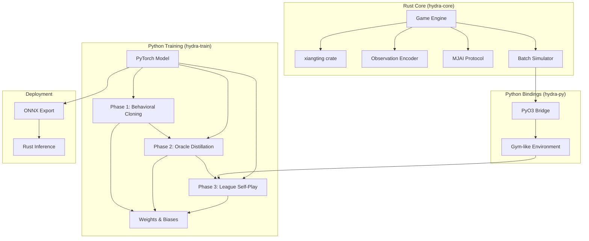
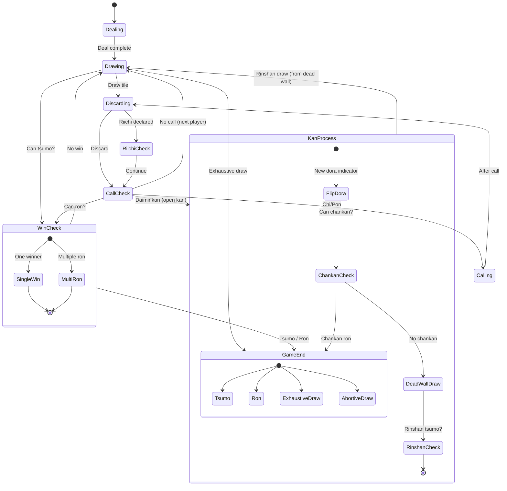
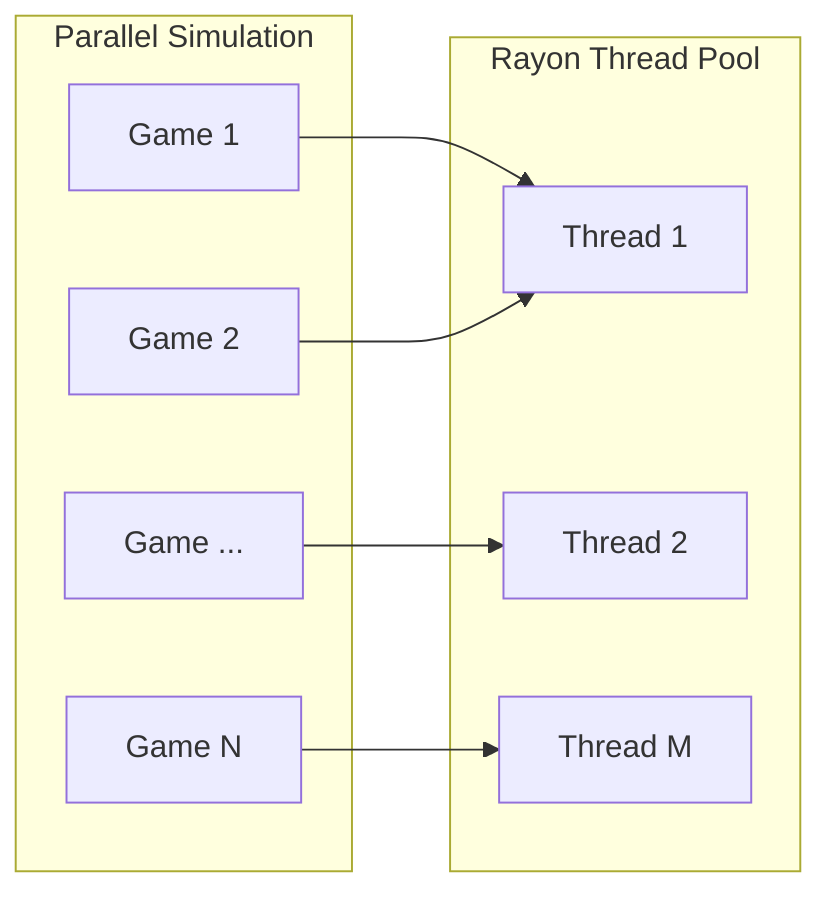
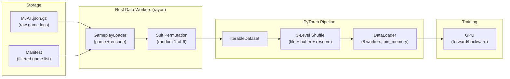
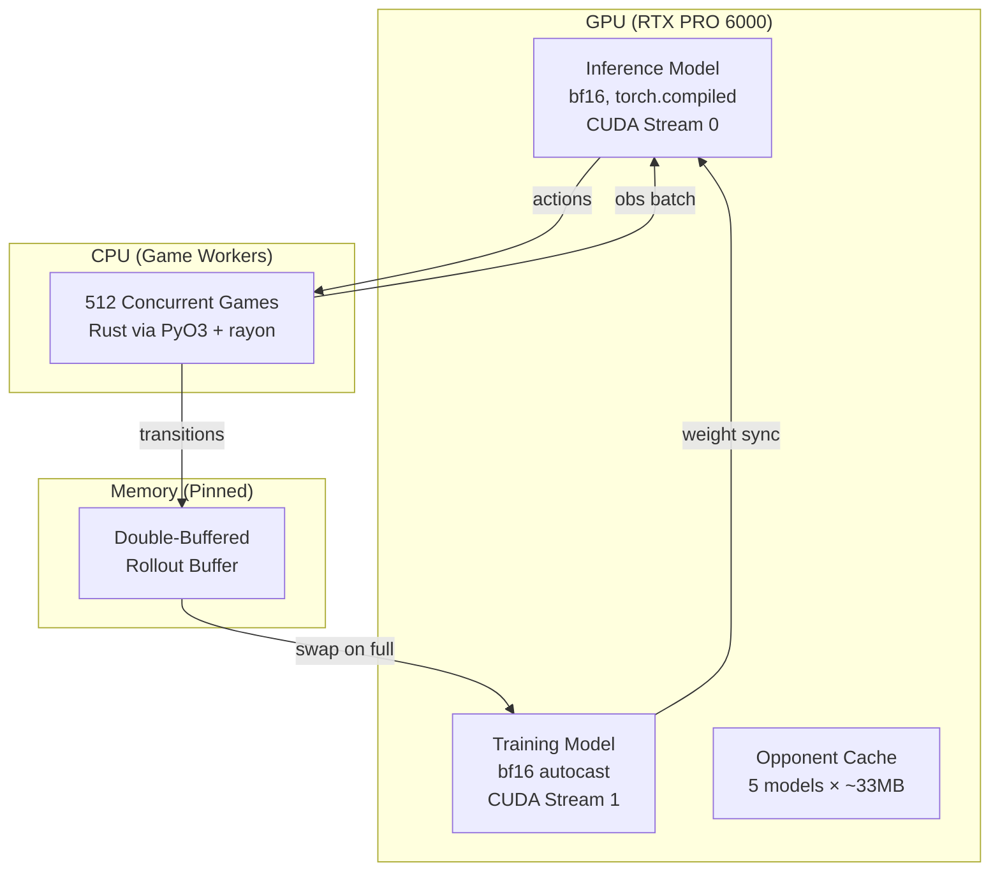
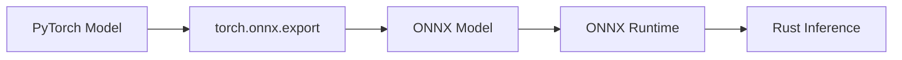
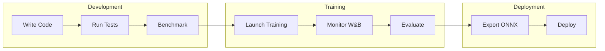

# Hydra Infrastructure Specification

## Overview

Hydra uses a hybrid Rust + Python architecture. Rust handles the game engine, observation encoding, and simulation — everything that benefits from low-level performance. Python handles neural network training and experiment tracking — everything that benefits from the ML ecosystem. This mirrors Mortal's design but with all original code (no AGPL-derived components).

## Related Documents

- [HYDRA_SPEC.md](HYDRA_SPEC.md) — Architecture, input encoding, output heads, inference
- [TRAINING.md](TRAINING.md) — Training pipeline, loss functions, hyperparameters, roadmap
- [SEEDING.md](SEEDING.md) — RNG hierarchy, reproducibility, evaluation seed bank
- [CHECKPOINTING.md](CHECKPOINTING.md) — Checkpoint format, save protocol, retention policy

## System Architecture

The system is composed of four major subsystems: the Rust core game engine, Python bindings via PyO3, the Python training stack, and the deployment pipeline. Data flows from the game engine through PyO3 into the training loop, and trained models are exported back through ONNX for pure-Rust inference.



## Rust Core (hydra-core)

### Crate Dependencies

| Crate | Version | Purpose | License |
|-------|---------|---------|---------|
| xiangting | 5.0+ | Shanten calculation | MIT |
| pyo3 | 0.28+ | Python bindings | MIT OR Apache-2.0 |
| rayon | 1.10+ | Parallel simulation | MIT OR Apache-2.0 |
| serde | 1.0+ | JSON serialization | MIT OR Apache-2.0 |
| serde_json | 1.0+ | MJAI parsing | MIT OR Apache-2.0 |
| ndarray | 0.16+ | Tensor operations | MIT OR Apache-2.0 |
| rand | 0.9+ | RNG for shuffle | MIT OR Apache-2.0 |

### License Compatibility

#### Safe to Use

| License | Commercial | Derivatives | Notes |
|---------|------------|-------------|-------|
| MIT | ✓ | ✓ | Preferred for Hydra components |
| Apache-2.0 | ✓ | ✓ | Patent grant included |
| BSD | ✓ | ✓ | Various versions acceptable |

#### Cannot Use for Hydra

| License | Issue |
|---------|-------|
| AGPL | Copyleft, requires source disclosure for network use |
| GPL | Copyleft, restricts derivative works |
| LGPL | Weak copyleft, requires relinking capability for static linking |
| Mortal's Custom Restrictions | Additional restrictions on model weights beyond AGPL |

### Module Structure

The `hydra-core` crate is organized as a flat module layout under `src/`:

| File | Responsibility |
|------|----------------|
| `lib.rs` | Crate root and public API surface |
| `tile.rs` | Tile representation using the 0–33 index scheme |
| `hand.rs` | Hand management and meld tracking |
| `wall.rs` | Wall, dead wall, and dora indicator logic |
| `player.rs` | Player state and discard tracking |
| `game.rs` | Game state machine (see state diagram below) |
| `rules.rs` | Riichi rules validation and scoring |
| `shanten.rs` | Wrapper around the `xiangting` crate for shanten calculation |
| `encoder.rs` | Observation tensor encoder (84×34 output) |
| `safety.rs` | Suji, kabe, and genbutsu safety calculations |
| `mjai.rs` | MJAI protocol parser for log compatibility |
| `simulator.rs` | Batch game simulation with rayon parallelism |
| `python.rs` | PyO3 binding definitions exposed to Python |

### MJAI Protocol

MJAI is a line-delimited JSON protocol for mahjong AI communication. Hydra uses MJAI for game log compatibility (parsing Tenhou and Majsoul records) and bot interface (real-time play via `mjai.rs`).

#### Message Types

| Type | Key Fields | Description |
|------|-----------|-------------|
| `start_game` | `names: [String; 4]` | Match start, player names |
| `start_kyoku` | `bakaze, dora_marker, kyoku, honba, kyotaku, oya, scores, tehais` | Round start with full state |
| `tsumo` | `actor, pai` | Tile draw |
| `dahai` | `actor, pai, tsumogiri` | Tile discard (tsumogiri = drew and immediately discarded) |
| `chi` / `pon` | `actor, target, pai, consumed` | Sequence or triplet call |
| `daiminkan` / `kakan` / `ankan` | `actor, [target], pai, consumed` | Open kan, added kan, concealed kan |
| `reach` | `actor` | Riichi declaration |
| `hora` | `actor, target, [deltas, ura_markers]` | Win declaration |
| `ryukyoku` | `[deltas]` | Exhaustive draw |

#### Tile Encoding

- **Suited tiles**: `1m`–`9m` (manzu), `1p`–`9p` (pinzu), `1s`–`9s` (souzu)
- **Red fives**: `5mr`, `5pr`, `5sr`
- **Wind honors**: `E` (East), `S` (South), `W` (West), `N` (North)
- **Dragon honors**: `P` (Haku/White), `F` (Hatsu/Green), `C` (Chun/Red)
- **Actor IDs**: 0–3

#### Mortal Meta Extensions

Mortal extends the MJAI protocol with a metadata structure attached to bot responses. Hydra may partially support these fields for compatibility with Mortal-based evaluation tools.

| Field | Type | Description |
|-------|------|-------------|
| `q_values` | `Vec<f32>` (optional) | Q-value estimate for each of the 46 possible actions |
| `mask_bits` | `u64` (optional) | Bitmask indicating which actions are legal in the current state |
| `shanten` | `i8` (optional) | Current shanten number (distance to tenpai; 0 = tenpai, −1 = complete) |
| `is_greedy` | `bool` (optional) | Whether the bot chose the action with the maximum Q-value |
| `eval_time_ns` | `u64` (optional) | Wall-clock inference time in nanoseconds |
| `at_furiten` | `bool` (optional) | Whether the player is currently in furiten (cannot ron) |
| `kan_select` | `Box<Metadata>` (optional) | Nested metadata for kan-specific decisions |

### Tile Representation

> See [HYDRA_SPEC.md § Input Encoding](HYDRA_SPEC.md#input-encoding) for the canonical tile index mapping (0–33 across manzu, pinzu, souzu, jihai). The `xiangting` crate uses this same standard 34-tile index.

### Game State Machine

The game engine drives a finite state machine that governs the flow of each round. States transition through dealing, drawing, discarding, call checks, kan processing, riichi declarations, and win checks until the round ends by tsumo, ron, or draw.



**Abortive draws handled:**

| Condition | Japanese | Description |
|-----------|----------|-------------|
| Kyuushu Kyuuhai | 九種九牌 | 9+ unique terminals/honors in opening hand (player choice, action 44) |
| Suufon Renda | 四風連打 | All 4 players discard the same wind on their first turn |
| Suucha Riichi | 四家立直 | All 4 players declare riichi |
| Suukaikan | 四開槓 | 4 kans declared by different players (not all by one player) |
| Sanchahou | 三家和 | Triple ron (3 players win on same discard — abortive in most rulesets) |

> **Nagashi Mangan** is checked at exhaustive draw: if a player's entire discard pile consists of terminals and honors, and none were called by opponents, they receive mangan payment.

### Observation Encoder

The observation encoder produces the 84×34 tensor defined in the input encoding specification. It translates the current game state — hand tiles, discards, melds, dora indicators, and safety information — into a fixed-size numerical representation suitable for neural network input.

Key performance considerations:

- **Pre-allocated buffers** — tensor memory is allocated once per environment instance and reused across turns to avoid allocation overhead
- **Contiguous memory layout** — the 84×34 tensor is stored as a flat contiguous array for cache efficiency and compatibility with downstream BLAS/NN operations
- **Incremental updates (planned optimization)** — most planes change minimally between turns (hand ±1 tile, discards +1). Delta-based encoding could reduce per-turn work, pending benchmarking to confirm the bookkeeping overhead is worthwhile. Mortal's encoder recomputes the full tensor from scratch each turn.

### Batch Simulator

For self-play training, the batch simulator runs many games in parallel using rayon's work-stealing thread pool. Each game runs independently, and rayon distributes games across available CPU threads automatically.



Target throughput for pure Rust simulation (no NN inference): 100,000+ games/hour per core. End-to-end training throughput (with GPU inference in the loop) targets 10,000+ games/hour, bottlenecked by neural network forward passes rather than game simulation.

## Data Pipeline

This section specifies the complete data pipeline for Phase 1 behavioral cloning (supervised learning from expert game logs). It resolves five design gaps: storage format, data loading architecture, filtering strategy, suit permutation augmentation, and volume/throughput estimates. The same pipeline foundations extend to Phases 2–3 (oracle distillation and self-play RL), where the data source shifts from static logs to live self-play trajectories.

### Pipeline Architecture



### Gap 1: Storage Format

**Decision: On-the-fly Rust parsing (default) with optional pre-encoded shards for production.**

The default path stores raw MJAI logs as `.json.gz` files (~70 GB for ~6.6M games). A Rust `GameplayLoader` parses and encodes observations on-the-fly using rayon parallelism. This is Mortal's proven architecture — Mortal processes even larger tensors (1012×34 vs Hydra's 84×34) with the same approach, demonstrating that on-the-fly parsing is not a bottleneck at this scale.

For production runs where maximum GPU utilization is critical, an optional pre-encoding step writes sharded binary files with Blosc+LZ4 compression (~500–800 GB for ~6.6M games compressed at ~7:1 ratio). This path eliminates all CPU parsing overhead but requires re-encoding whenever features change. Pre-encoding is only justified if GPU utilization drops below 80% with on-the-fly parsing.

**Rejected alternatives:**
- **HDF5:** Thread-safety issues with h5py; single-writer bottleneck prevents parallel encoding.
- **Parquet:** Columnar format optimized for heterogeneous tabular data, wrong data model for dense homogeneous tensors.
- **FFCV:** Optimizes for JPEG decode-to-GPU pipeline — our bottleneck is not image decoding.
- **WebDataset:** Overkill for single-node local training.

**Evidence from game AI systems:** AlphaZero, AlphaStar, and OpenAI Five all use in-memory buffers or on-the-fly encoding. lc0 uses fixed-size binary structs in `.gz` files. KataGo uses `.npz` files. None use HDF5 or Parquet.

### Gap 2: Data Loading Pipeline

**Decision: PyTorch IterableDataset backed by Rust batch decoding via PyO3.**

Each DataLoader worker owns a disjoint slice of the file list (Mortal's partitioning pattern). Within each worker, the Rust `GameplayLoader` uses rayon parallel iterators and `GzDecoder` for concurrent file parsing, producing pre-encoded observation tensors that are yielded directly to the PyTorch training loop.

**DataLoader configuration:**

| Parameter | Value | Rationale |
|-----------|-------|-----------|
| `batch_size` | 2048 | 4× Mortal's 512; use linear LR scaling rule |
| `num_workers` | 8 | Each worker spawns rayon threads internally |
| `RAYON_NUM_THREADS` | 4 per worker | 8×4 = 32 logical threads matches recommended CPU |
| `pin_memory` | `True` | Saves 0.5–2ms per batch on host-to-device transfer |
| `persistent_workers` | `True` | Avoids worker re-spawn overhead between epochs (Mortal misses this) |
| `prefetch_factor` | 2 | Default is sufficient for NVMe-backed storage |
| `drop_last` | `True` | Clean batch boundaries for consistent gradient scale |

**Shuffling strategy (3-level):**

1. **File-level:** Shuffle the shard/file order at the start of each epoch. Every worker receives a freshly permuted file list.
2. **Buffer-level:** Each worker loads `file_batch_size=100` shards (~100K decisions) into a memory buffer and performs a full Fisher-Yates shuffle within the buffer before yielding batches.
3. **Reserve mixing:** Retain 20% of the buffer when loading the next file batch, mixing old and new data to prevent sharp shard boundaries.

This 3-level strategy achieves temporal decorrelation comparable to a full-dataset shuffle without requiring the entire dataset to fit in memory. It mirrors KataGo's sliding-window shuffler design.

**Sharding:** Raw MJAI logs (~6.6M individual game files) are pre-packed into ~660 mega-shards of 10K games each. Each shard is a concatenated gzip archive with a small JSON index mapping game offsets. This avoids filesystem metadata overhead from millions of small files and enables efficient sequential reads.

### Gap 3: Filtering Strategy

**Decision: Pre-filter once, cache filtered game list in a manifest file.**

Rather than filtering at training time (wasting CPU cycles re-evaluating criteria every epoch), a one-time scan builds a manifest of all games with metadata. Training loads only from the filtered manifest.

**Three-step process:**

1. **Scan:** Parse all ~6.6M game files and extract metadata (player names, room/lobby, source, basic stats). Store as a JSON manifest or SQLite database.
2. **Filter:** Apply quality criteria per data tier (see below). Output a filtered file list.
3. **Train:** The DataLoader reads only files in the filtered list. Zero runtime filtering overhead.

**Data quality tiers:**

| Tier | Source | Filter Criteria | Training Weight |
|------|--------|-----------------|-----------------|
| Tier 1 | Tenhou Houou (Phoenix) | No additional filter (already R>=2000, 7-dan+) | 1.0 |
| Tier 1 | Majsoul Throne Room | No additional filter (Saint+ room) | 1.0 |
| Tier 2 | Majsoul Jade Room | Player-level stats filter (see below) | 0.5–0.7 |

**Player-level filtering for Tier 2 data** (inspired by Mortal Discussion #91, where Nitasurin demonstrated +1.8–2.0 PT improvement from player-level cleaning alone):

| Criterion | Threshold | Rationale |
|-----------|-----------|-----------|
| `games` | >= 30 | Minimum sample size for reliable stats |
| `avg_rank` | <= 2.60 | Better than random (2.50 = uniform) |
| `dealin_rate` | <= 0.16 | Not recklessly aggressive |
| `win_rate` | >= 0.17 | Actually wins hands |

Only qualifying players' decision perspectives are used for training, even in games that include weaker players. This trains the model on what good players do, not what their opponents do.

**Game-level exclusions:**

- Games with disconnected players (incomplete decision sequences)
- Games with >3 timeouts per player (AFK/bot behavior)
- Games with <4 actions per player (aborted or bugged games)

**Estimated dataset after filtering:** ~5–6M high-quality game perspectives from the ~6.6M raw corpus.

### Gap 4: Suit Permutation Augmentation

**Decision: On-the-fly random permutation, 1 of 6 per game per epoch.**

Mahjong strategy is invariant to suit identity — manzu, pinzu, and souzu are functionally interchangeable. Exploiting this symmetry via suit permutation augmentation effectively multiplies the dataset by up to 6× without any disk overhead.

**Specification:**

- **Full permutation group:** All 3! = 6 permutations of the three suit indices. Mortal only implements 2× (man-pin swap); Hydra uses the complete group.
- **Application point:** At the MJAI Event level, before observation encoding. Each tile ID in the event stream is remapped through the chosen permutation. This is the same architectural point as Mortal but extended to all 6 permutations.
- **Granularity:** One random permutation is sampled per game, not per decision. This maintains game-internal consistency (the same physical tiles map to the same permuted tiles throughout the game).
- **Implementation:** `permute_suits(tile_id: u8, perm: [u8; 3]) -> u8` where `perm` maps `[manzu_target, pinzu_target, souzu_target]` and is one of the 6 permutations of `[0, 1, 2]`.
- **Aka-dora handling:** `deaka()` to get the base tile, permute the base, then `re_akaize()` if the original was aka. This is Mortal's proven pattern for handling the red five special tiles.
- **CPU cost:** Negligible — a `const fn` that divides by 9, remaps the suit, and reconstructs the tile ID. Nanoseconds per tile.
- **Coverage:** Over 6 epochs, each game is statistically seen under all 6 permutations. No need to pre-encode augmented copies.

### Gap 5: Volume and Throughput Estimates

All estimates scaled to ~6.6M games × ~60 decisions per game = ~400M total decisions.

**Storage volumes:**

| Component | Size | Notes |
|-----------|------|-------|
| Raw MJAI logs (`.json.gz`) | ~70 GB | Source of truth; always retained |
| Student obs (84×34×f32, uncompressed) | ~4.5 TB | Never stored — generated on-the-fly |
| Oracle obs (205×34×f32, uncompressed) | ~10.9 TB | Never stored — generated on-the-fly |
| With 6× suit augmentation (uncompressed) | ~27 TB | Never pre-computed — applied on-the-fly |
| Pre-encoded shards (Blosc+LZ4, ~7:1) | ~640 GB | Optional production path only |
| Actions + masks + metadata | ~22 GB | Compact ancillary data |

**Memory budget (RTX PRO 6000 Blackwell, 96 GB VRAM):**

| Component | Memory | Phase |
|-----------|--------|-------|
| Model (~16.5M student / ~16.7M teacher, bf16) | ~33–34 MB | All phases |
| Batch (2048 × 84×34 × 4B) | ~22 MB | Phase 1 (BC) |
| DataLoader workers (8 × prefetch 2) | ~180 MB | Phase 1 (BC) |
| Optimizer state (AdamW, bf16) | ~130 MB | All phases |
| Opponent cache (5 × 33 MB bf16) | ~165 MB | Phase 3 |
| PPO minibatch (on-GPU) | ~200–400 MB | Phase 2–3 (RL) |
| **Total VRAM footprint** | **< 1 GB** (BC) / **~3.7 GB** (PPO+opponents) | — |

The PPO rollout buffer is stored in **CPU pinned memory** (~6–12 GB per double buffer, uint8), not VRAM. Only individual minibatches are transferred to GPU via async `non_blocking=True` copies. Phase 1 behavioral cloning is memory-trivial.

**Throughput estimates:**

| Metric | Value | Notes |
|--------|-------|-------|
| Target training speed | 10K steps/hour @ batch 2048 | ~20M samples/hour |
| Required sustained I/O | ~32 MB/s | From MJAI source files |
| NVMe sequential read capacity | ~7,000 MB/s | 218× headroom over requirement |
| Rust parser capacity (8 workers) | ~160K samples/sec | 28× headroom over requirement |
| GPU compute (forward + backward) | Bottleneck | Only true constraint |

**Bottom line:** On-the-fly Rust parsing is the clear winner. Both NVMe I/O and CPU parsing capacity are massively overprovisioned relative to the training throughput target. The GPU is the sole bottleneck — specifically the forward/backward pass during training. The PPO rollout buffer lives in CPU pinned memory and does not consume VRAM.

## Python Bindings (hydra-py)

### PyO3 Interface

The following Rust functions are exposed to Python via PyO3:

| Python Function | Rust Implementation |
|-----------------|---------------------|
| `Game.new()` | `Game::new()` |
| `Game.step(action)` | `Game::step()` |
| `Game.get_observation()` | `Encoder::encode()` |
| `Game.legal_actions()` | `Game::legal_actions()` |
| `Game.is_done()` | `Game::is_terminal()` |
| `simulate_batch(n)` | `Simulator::run_batch()` |

### Gym-like Environment

The Python environment wraps the Rust game engine in a Gymnasium-compatible interface. Two classes are provided:

**MahjongEnv** — single-environment interface for one game at a time:

| Method | Signature | Description |
|--------|-----------|-------------|
| `reset()` | → `observation` | Resets the environment and returns the initial observation tensor |
| `step(action)` | → `(obs, reward, done, info)` | Advances the game by one action, returning the new observation, reward signal, terminal flag, and info dictionary |
| `legal_actions()` | → `list` | Returns the list of currently legal action indices |
| `render()` | → `str` | Returns a human-readable string representation of the current game state |

**VectorEnv** — batched interface that manages multiple `MahjongEnv` instances in parallel:

| Method / Attribute | Signature | Description |
|--------------------|-----------|-------------|
| `num_envs` | `int` (attribute) | The number of parallel environments in the batch |
| `reset()` | → `observations` | Resets all environments and returns a batch of initial observations |
| `step(actions)` | → `(obs, rewards, dones, infos)` | Steps all environments simultaneously with a batch of actions |

`VectorEnv` wraps multiple `MahjongEnv` instances and manages them in parallel, providing a batched API for efficient PPO rollout collection.

### Installation

The `hydra-py` package is built and installed via maturin:

```
maturin develop --release
```

## Python Training (hydra-train)

### Dependencies

| Package | Purpose |
|---------|---------| 
| torch | Neural network definition and training |
| numpy | Array operations and data manipulation |
| wandb | Experiment tracking and visualization |
| hydra-py | Game environment (Rust-backed) |
| einops | Tensor reshaping utilities |
| rich | Progress bars and terminal output |
| mahjong (dev) | Hand scoring oracle for Rust engine verification — yaku/han/fu/score validation against 11M+ Tenhou hands (pin to v1.4.0) |

### Per-Phase Training Infrastructure

Hydra's training proceeds through three distinct phases with different data sources, loss functions, and infrastructure requirements. Each phase builds on the previous, with explicit transition gates ensuring readiness. TRAINING.md defines the algorithms and loss functions; this section specifies the infrastructure that runs them.

#### Phase 1: Behavioral Cloning (Supervised)

**Data source:** Phase 1 Data Pipeline (see § Data Pipeline above) — ~6.6M MJAI game logs, on-the-fly Rust parsing, 3-level shuffle.

**Optimizer configuration:**

| Parameter | Value | Rationale |
|-----------|-------|-----------|
| Optimizer | AdamW | Decoupled weight decay; faster convergence than SGD for short runs |
| Peak LR | 5e-4 | 4× Mortal's 1e-4 due to 4× batch size (linear scaling rule) |
| Final LR | 1e-5 | Cosine annealing floor |
| Warmup | 5% of total steps (~30K steps) | Prevents early gradient explosions with large batch |
| Weight decay | 0.01 | Applied only to Conv1d and Linear weights; biases and GroupNorm params excluded |
| Betas | (0.9, 0.999) | AdamW defaults |
| Epsilon | 1e-5 | Consistent across all phases (Huang 2022, CleanRL, SB3 all use 1e-5 for PPO; using the same value for SL maintains consistency and doesn't hurt convergence) |
| Gradient clip | 1.0 (max grad norm) | Prevents training spikes; Mortal disables this but BC has different dynamics |

**Batch and precision:**

| Parameter | Value | Rationale |
|-----------|-------|-----------|
| Batch size | 2048 | 4× Mortal's 512; linear scaling with LR |
| Gradient accumulation | 1 | Effective batch = 2048 (sufficient on 96GB) |
| Precision | bf16 (autocast) | Blackwell-native; same dynamic range as fp32, no GradScaler needed |
| torch.compile | Enabled | ~10-30% throughput gain via operator fusion; GroupNorm safe in bf16 |

**Loss function:**
L_IL = CE(π, a_human) + 0.5 × MSE(V, outcome) + 0.1 × L_aux

Where L_aux includes GRP rank prediction (CE), tenpai classification (BCE), and danger estimation (focal BCE). See [TRAINING.md § Phase 1](TRAINING.md#phase-1-supervised-warm-start) for component definitions and weights.

**Training schedule:**
- 3 epochs over the filtered dataset (~5-6M games, ~300-360M decisions)
- Random 1-of-6 suit permutation per game per epoch (see § Suit Permutation Augmentation)
- Over 3 epochs, each game is seen under ~3 of the 6 possible permutations

**Early stopping and checkpointing:**
- Validate every 5K training steps on a 5% held-out game set (chronological split — last month's games)
- Primary metric: validation policy cross-entropy loss (not accuracy — loss captures calibration)
- Early stopping patience: 3 consecutive validation intervals without improvement
- Checkpoint every 10K steps; retain best + last 3; discard older (~330 MB per checkpoint)

**Resource estimates:**
- Steps per epoch: ~160K (330M decisions / 2048 per batch)
- Total training steps: ~480K (3 epochs)
- Wall time per epoch: ~2.2 hours on RTX PRO 6000 (Blackwell)
- Total wall time: ~6.6 hours for 3 epochs
- GPU memory: ~400 MB total (model + optimizer + batch — massive headroom on 96 GB)

**Monitoring (via Weights & Biases):**

| Frequency | Metrics |
|-----------|---------|
| Every step | Total loss, policy CE, value MSE, GRP CE, tenpai BCE, danger focal, learning rate, gradient norm |
| Every 5K steps | Top-1/top-3 action accuracy, discard/call/riichi accuracy, policy entropy, throughput (samples/sec), GPU memory |
| Every validation | Val loss, val accuracy breakdown, train-val gap, per-action-type accuracy |

**Phase 1 readiness gate** (all must pass to enter Phase 2):
- Discard accuracy ≥ 65%
- SL loss plateaued (no improvement in 3 validation intervals)
- Test play average placement ≤ 2.55 (1v3 vs random baseline)
- Deal-in rate ≤ 15% in test play

#### Phase 2: Oracle Distillation (RL)

**Data source:** Self-play trajectories generated by the teacher model (initially) and student model (progressively). No static game logs.

**Model configuration:**

| Component | Configuration | VRAM |
|-----------|--------------|------|
| Teacher | Frozen, bf16, eval mode; Conv1d(289, 256, 3) stem; ~16.7M params | ~33 MB |
| Student | fp32 master weights, bf16 autocast for compute; Conv1d(84, 256, 3) stem; ~16.5M params | ~67 MB |
| Teacher gradients | None (frozen) | 0 MB |
| Student optimizer (AdamW m+v) | fp32 | ~134 MB |
| Student gradients | fp32 | ~67 MB |
| **Total Phase 2 VRAM** | | **~465 MB** |

The teacher and student share identical ResBlock weights (all 40 blocks are architecturally equivalent and weight-transferable). Only the stem Conv1d differs: the teacher's 289-channel input concatenates 84 public + 205 oracle channels before encoding.

**Initialization from Phase 1:**
- Load Phase 1 best checkpoint into all student ResBlocks, policy head, value head, and aux heads
- Copy student ResBlocks into teacher (identical weights)
- Initialize teacher stem Conv1d(289, 256, 3) with random weights (Kaiming/He init)
- Freeze teacher: set to eval mode, disable gradients, cast to bf16
- Save Phase 1 policy as a frozen "KL anchor" for catastrophic forgetting prevention
- Create fresh AdamW optimizer (do NOT carry Phase 1 optimizer state — stale momentum from BC loss is counterproductive for RL)

**Optimizer configuration:**

| Parameter | Value | Rationale |
|-----------|-------|-----------|
| Optimizer | AdamW (fresh) | Reset from Phase 1; stale Adam momentum harms RL |
| Warmup LR | 1e-6 → 2.5e-4 | 10K step warmup from ~1/250th of peak (KataGo-style gradual warmup) |
| Peak LR | 2.5e-4 | Standard for PPO fine-tuning |
| Final LR | 5e-5 | Cosine annealing floor |
| Weight decay | 0.01 | Same grouping as Phase 1 |
| Gradient clip | 0.5 (max grad norm) | Tighter than Phase 1 — RL gradients are noisier |

**Loss function:**
L_distill = L_PPO(π_S) + λ_KL × D_KL(π_S ‖ π_T) + λ_anchor × D_KL(π_S ‖ π_BC)

Where:
- L_PPO includes policy, value, and entropy components (see [TRAINING.md § Phase 2](TRAINING.md#phase-2-oracle-distillation-rl))
- λ_KL follows the feature dropout schedule (decays from 1.0 to 0.3)
- λ_anchor = 0.1, decaying to 0 over Phase 2 (prevents catastrophic forgetting of BC knowledge)
- D_KL uses temperature τ = 3.0 (fixed, not annealed — annealing changes the meaning of "dark knowledge" mid-training)

**Feature dropout schedule** (group-level deterministic scaling, canonical definition in [TRAINING.md § Feature Dropout Schedule](TRAINING.md#feature-dropout-schedule)):

Two feature groups are masked independently: Group A (opponent hands, 39ch) scaled by `mask_opp`, and Group B (wall/dead wall, 166ch) scaled by `mask_wall`. Masks decay from 1.0 to 0.0 over training while λ_KL decays from 1.0 to 0.3. See TRAINING.md for the full schedule table.

Post-dropout continuation: LR decayed to 1/10 of current value, importance weight rejection applied to prevent large policy updates on the now-fully-blind student.

**GroupNorm:** Hydra uses GroupNorm(32) which has no running statistics (unlike BatchNorm). GroupNorm parameters learned during Phase 1 carry forward without corruption concerns. Mortal freezes BatchNorm during RL to prevent self-play distribution shift from corrupting BN statistics — this issue does not apply to Hydra.

**Phase 2 readiness gate** (all must pass to enter Phase 3):
- Student average placement ≤ 2.45 (1v3 vs Phase 1 baseline)
- Deal-in rate ≤ 13%
- Win rate ≥ 21%
- Win/deal-in ratio ≥ 1.5:1
- Tenpai head AUC ≥ 0.80
- Win rate plateau for 20M+ steps (no improvement)

#### Phase 3: League Self-Play (PPO)

**Data source:** Live self-play trajectories from concurrent game workers.

**Self-play architecture:**

Hydra uses a single-process, multi-threaded architecture for Phase 3. Python threading (not multiprocessing) is used because the Rust game engine releases the GIL during CPU-bound work. No IPC overhead. No Ray. No distributed framework.



**Key architecture decisions:**
- **Dual CUDA streams:** Stream 0 handles inference (action selection during self-play). Stream 1 handles PPO gradient computation. These overlap on the GPU, maximizing utilization.
- **InferenceServer thread:** A dedicated Python thread drains an observation queue, batches observations from all active games (~512 per step), runs a single GPU forward pass, and distributes actions back via futures. Batch inference latency: ~0.5-1ms for batch 512.
- **Game workers:** The Rust game engine runs 512 concurrent hanchans. Feature encoding is parallelized via rayon within the game batch (Mortal's proven pattern). Game logic releases the GIL.
- **Double-buffered rollout storage:** Buffer A fills from self-play while Buffer B is consumed by PPO training. Both buffers use pre-allocated pinned memory for fast async CPU→GPU transfer via non_blocking=True. Observations stored as uint8 where possible, cast to float32 per-minibatch.

 **Opponent pool** (composition weights defined in [TRAINING.md § Phase 3](TRAINING.md#phase-3-league-training)):

| Parameter | Value | Rationale |
|-----------|-------|-----------|
| Max checkpoints on disk | 20 | FIFO eviction; ~1.3 GB total disk |
| GPU-cached models | 5 (LRU) | ~165 MB VRAM for 5 × 33MB bf16 models |
| Save interval | Every 500 PPO update steps | ~2-6 new checkpoints per day |

| Opponent Selection | Weight | Purpose |
|--------------------|--------|---------|
| Current self (all 4 seats) | 50% | Core self-play signal |
| Random pool checkpoint | 30% | Diversity; prevents strategy collapse |
| Phase 2 baseline (frozen) | 20% | Anchor; prevents catastrophic forgetting |

**Seat rotation:** Every game seed is played in 4 rotations (challenger at East/South/West/North), following Mortal's 1v3 duplicate protocol. This controls for positional advantage (East player has slight edge in Mahjong).

 **PPO hyperparameters:**

 > See [TRAINING.md § Phase 3](TRAINING.md#phase-3-league-training) for the authoritative PPO hyperparameter table. Implementation-specific additions:

**Anti-forgetting mechanisms:**
- KL penalty against Phase 2 policy: λ_KL = 0.05, annealed to 0 over the first 30% of Phase 3 training
- GroupNorm parameters frozen from Phase 2 (no running stats to drift)
- Opponent pool includes Phase 2 baseline at 20% weight

**Resource estimates:**

| Metric | Value |
|--------|-------|
| Concurrent games | 512 |
| Inference batch | ~512 obs (~0.5-1ms per GPU forward pass) |
| Game throughput | 400-800 hanchans/sec |
| Transitions per second | 200K-400K |
| PPO updates per day | 40-120 |
| GPU memory (total) | ~3.7 GB (model + optimizer + rollout + opponent cache) |
| Wall time to meaningful improvement | 3-7 days |
| Total Phase 3 training | 2-4 weeks |

#### Phase Transitions

**General principle:** Always reset optimizer and LR scheduler at phase boundaries. Always warmup LR from ~1/20th of the target peak. Evidence: Mortal explicitly discards optimizer state when switching from offline to online training. KataGo warms up from 1/20th of target LR over 8 stages.

**What carries over vs. resets at each phase boundary:**

| Component | Phase 1 → 2 | Phase 2 → 3 |
|-----------|-------------|-------------|
| ResBlock weights (40 blocks) | ✅ Carry | ✅ Carry |
| Policy head | ✅ Carry (also freeze copy as KL anchor) | ✅ Carry |
| Value head | ❌ Reset (new oracle critic architecture) | ✅ Carry |
| Aux heads (GRP, tenpai, danger) | ✅ Carry | ✅ Carry |
| Stem Conv1d | ⚠️ Student: carry; Teacher: new random stem | ✅ Carry (student stem) |
| Optimizer state (Adam m, v) | ❌ Fresh AdamW | ❌ Fresh AdamW |
| LR scheduler | ❌ New schedule with warmup | ❌ New schedule with warmup |
| GroupNorm parameters | ✅ Carry (no running stats) | ✅ Carry (freeze during RL) |
| Global step counter | ✅ Keep (logging continuity) | ✅ Keep |
| Teacher model | N/A → Create | ❌ Discard |
| Opponent pool | N/A | N/A → Initialize |

**Phase 1 → 2 procedure:**
1. Save Phase 1 best checkpoint as bc_best.pt
2. Verify all Phase 1 readiness gate metrics pass
3. Initialize teacher from student weights + new random oracle stem
4. Freeze teacher (eval mode, no gradients, bf16)
5. Freeze copy of Phase 1 policy as KL anchor
6. Create fresh AdamW with warmup schedule
7. Begin Phase 2 training loop

**Phase 2 → 3 procedure:**
1. Save Phase 2 best checkpoint as distill_best.pt
2. Verify all Phase 2 readiness gate metrics pass
3. Verify feature dropout masks have reached 0.0 (student is fully blind)
4. Discard teacher model and oracle critic
5. Initialize opponent pool with distill_best.pt and bc_best.pt as frozen anchors
6. Freeze copy of Phase 2 policy as new KL anchor
7. Create fresh AdamW with warmup schedule
8. Begin Phase 3 league training

#### Rating and Evaluation

**Rating system:** OpenSkill PlackettLuce — a patent-free Bayesian ranking system with native 4-player support (Weng & Lin 2011, JMLR). Each checkpoint maintains a skill belief (μ, σ). Conservative rating = μ − 3σ.

**Evaluation protocol:** 1v3 duplicate format following Mortal's established methodology:
- Challenger (1 copy) vs Champion (3 copies)
- Each game seed played 4× with the challenger rotating through East/South/West/North
- Deterministic replay: given (seed, kyoku, honba), walls/draws/dora are fixed
- This controls for both positional advantage and tile draw variance

**Rank point distribution:** [90, 45, 0, −135] (Tenhou Houou-style uma)

**Evaluation scale:**

| Purpose | Games | Sets (×4 rotations) | Sufficient For |
|---------|-------|---------------------|----------------|
| Quick eval (during training) | 4,000 | 1,000 | Trend detection |
| Full eval (checkpoint release) | 200,000 | 50,000 | Publication-quality claims |
| Ablation study | 1,000,000 | 250,000 | Detecting <1 rank pt/game differences |

**Statistical significance:** Welch's t-test on per-game rank points (p < 0.05). Mahjong has high per-game variance (~σ = 80 rank pts); detecting a 1 rank-pt-per-game improvement at 95% confidence requires ~100K games in 1v3 duplicate format.

#### Distributed Strategy

**Single GPU is sufficient for all three phases.** The model is ~16.7M parameters (~33 MB in fp16/bf16). Total VRAM usage never exceeds 4 GB, even in Phase 3 with 5 cached opponent models and a large rollout buffer. The RTX PRO 6000's 96 GB VRAM is massively overprovisioned — the bottleneck is game generation throughput (CPU-bound), not GPU memory or compute.

**No DDP or FSDP is needed.** Distributed data parallelism is designed for models that don't fit on one GPU or for scaling batch size across devices. Neither applies: the model fits 2,900× over in 96 GB, and batch_size=2048-4096 is already sufficient for stable gradients.

**Parallelism strategy by phase:**

| Phase | GPU | CPU | Parallelism |
|-------|-----|-----|-------------|
| Phase 1 (BC) | Forward/backward on single device | 8 DataLoader workers with rayon | Data parallelism via workers |
| Phase 2 (Oracle) | Teacher (bf16 inference) + Student (training) | Self-play game workers | Dual model, single device |
| Phase 3 (League) | Dual CUDA streams (inference + training) | 512 concurrent games via Rust/rayon threading | Overlapped inference and gradient computation |

**Future scalability (if needed):** If Phase 3 game throughput becomes the bottleneck, the architecture supports adding CPU-only game worker machines that communicate game trajectories to the GPU trainer via shared filesystem or ZMQ (Mortal's proven pattern). The model architecture does not need to change.

### Model Definition

The PyTorch model implements the SE-ResNet architecture defined in HYDRA_SPEC.md. Key infrastructure considerations:

- **torch.compile()** is enabled for all phases. For Phase 3 self-play inference, use mode="reduce-overhead" which activates CUDAGraphs for fixed-shape inputs — particularly beneficial for the InferenceServer where batch size is stable. For training, use mode="default" to allow dynamic shapes from action masking.
- **Precision: bf16** (not fp16). Blackwell GPUs have native bf16 tensor core support at full throughput. bf16 has the same dynamic range as fp32 (8 exponent bits), eliminating the need for GradScaler and the risk of gradient overflow/underflow. fp16 (5 exponent bits, max 65504) requires GradScaler and can cause training instabilities early in learning when gradients are large.
- **Gradient checkpointing** is available but unnecessary at this model scale. The ~16.7M param model's activations occupy ~100-200 MB during forward/backward — negligible on 96 GB. Gradient checkpointing would add ~30% compute overhead for <0.2% memory savings.
- **GroupNorm(32)** is used throughout instead of BatchNorm. GroupNorm has no running statistics, so it is immune to distribution shift between BC data and self-play data — unlike Mortal's BatchNorm which must be frozen during online RL.
- **Orthogonal initialization:** std=√2 for hidden layers, 0.01 for policy head, 1.0 for value head (PPO standard from Andrychowicz et al. 2021).

## Reproducibility and Seeding

> This section has been moved to [SEEDING.md](SEEDING.md).

## Checkpoint Management

> This section has been moved to [CHECKPOINTING.md](CHECKPOINTING.md).

## Deployment

### ONNX Export

For production inference, trained PyTorch models are exported to the ONNX format. This enables the model to run through ONNX Runtime, which can then be called from Rust — eliminating the Python dependency entirely at serving time.



### Rust Inference Options

For maximum performance, inference can run entirely in Rust using one of three crate options:

| Crate | Description |
|-------|-------------|
| `ort` | Rust bindings to ONNX Runtime — mature, GPU-accelerated, broadest operator coverage |
| `tract` | Pure Rust inference engine — no C/C++ dependencies, easier to cross-compile |
| `candle` | HuggingFace's Rust ML framework — native tensor operations, growing ecosystem |

The core advantage of Rust-side inference is the complete elimination of Python at runtime. This removes the GIL, startup overhead, and Python dependency management from the inference path, enabling sub-15ms decision latency suitable for real-time play.

## Hardware Requirements

### Training

| Component | Minimum | Recommended |
|-----------|---------|-------------|
| GPU | RTX 3080 (10GB) | RTX PRO 6000 Blackwell (96GB) |
| CPU | 8 cores | 32+ cores |
| RAM | 32GB | 128GB+ |
| Storage | 100GB SSD | 1TB NVMe |

### Inference

| Component | Minimum | Recommended |
|-----------|---------|-------------|
| GPU | RTX 3060 (6GB) | RTX 4070 (12GB) |
| CPU | 4 cores | 8 cores |
| RAM | 8GB | 16GB |

## Performance Targets

| Metric | Target |
|--------|--------|
| Simulation throughput (CPU only) | 100k+ games/hour/core |
| Training throughput (with GPU inference) | 10k+ games/hour |
| Inference latency | <15ms |
| Inference VRAM | <1.5GB |
| Model size (fp16) | ~33MB |

## Development Workflow

The end-to-end workflow flows through three phases: development (write code, run tests, benchmark), training (launch training runs, monitor via W&B, evaluate results), and deployment (export to ONNX, deploy for inference).



### CI Pipeline

Every pull request and merge to main runs automated checks to catch regressions before they corrupt training data. The pipeline is ordered from fastest to slowest — a lint failure aborts before spending minutes on test suites.

| Stage | Command | Trigger | Expected Time |
|-------|---------|---------|---------------|
| Rust lint | `cargo clippy --all-targets -- -D warnings` | Every PR | ~30s |
| Rust test | `cargo test --release` | Every PR | ~2min |
| Python lint | `ruff check hydra-train/` | Every PR | ~5s |
| Python type check | `pyright hydra-train/` | Every PR | ~30s |
| Python test | `pytest hydra-train/tests/ -x` | Every PR | ~1min |
| ONNX export smoke | `python scripts/export_onnx.py --smoke` | Every PR | ~30s |
| Encoding regression | `cargo test --release encoder_golden_tests` | Every PR | ~1min |
| Full eval (200K games) | `python scripts/evaluate.py --tier full` | Merge to main | ~4h |

**Design rationale:** The encoding regression stage runs the golden tests from TESTING.md § Known-State Golden Tests. Any encoder change that alters output tensors must explicitly regenerate golden files — accidental encoding drift is the single most dangerous silent failure mode in the pipeline. The full eval runs only on merge to main because it takes hours and is not needed for incremental development.
