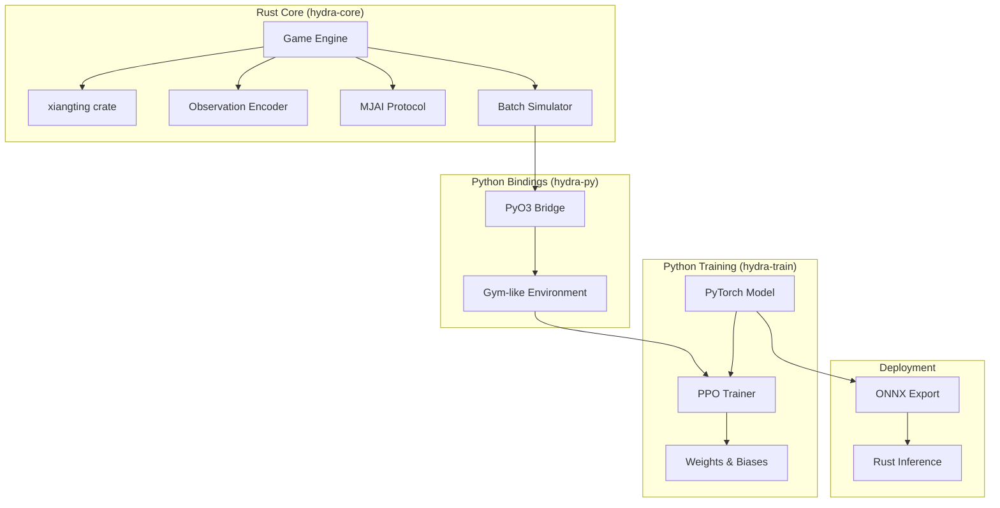
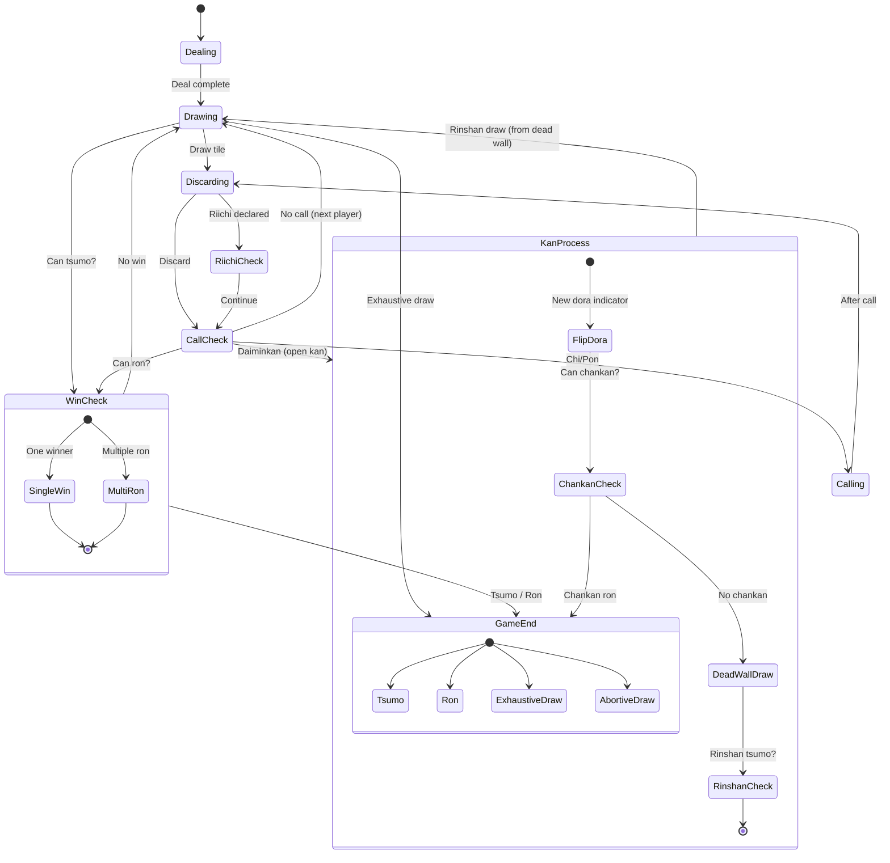
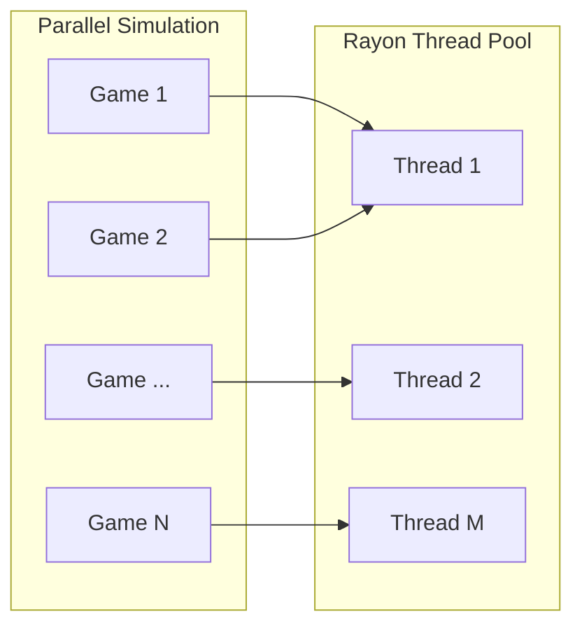
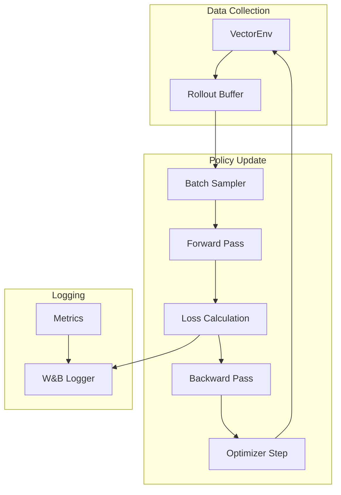
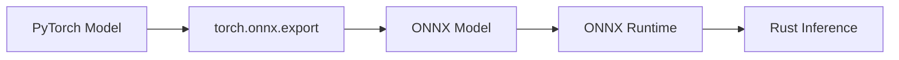
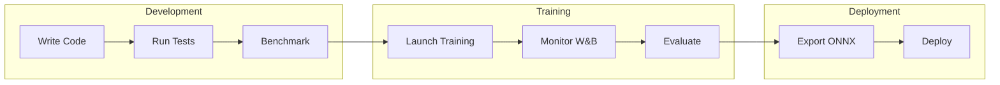

# Hydra Infrastructure Specification

## Overview

Hydra uses a hybrid Rust + Python architecture. Rust handles the game engine, observation encoding, and simulation — everything that benefits from low-level performance. Python handles neural network training and experiment tracking — everything that benefits from the ML ecosystem. This mirrors Mortal's design but with all original code (no AGPL-derived components).

## System Architecture

The system is composed of four major subsystems: the Rust core game engine, Python bindings via PyO3, the Python training stack, and the deployment pipeline. Data flows from the game engine through PyO3 into the training loop, and trained models are exported back through ONNX for pure-Rust inference.



## Rust Core (hydra-core)

### Crate Dependencies

| Crate | Version | Purpose | License |
|-------|---------|---------|---------| 
| xiangting | 5.0+ | Shanten calculation | MIT |
| pyo3 | 0.22+ | Python bindings | MIT OR Apache-2.0 |
| rayon | 1.10+ | Parallel simulation | MIT OR Apache-2.0 |
| serde | 1.0+ | JSON serialization | MIT OR Apache-2.0 |
| serde_json | 1.0+ | MJAI parsing | MIT OR Apache-2.0 |
| ndarray | 0.16+ | Tensor operations | MIT OR Apache-2.0 |
| rand | 0.9+ | RNG for shuffle | MIT OR Apache-2.0 |

### Module Structure

The `hydra-core` crate is organized as a flat module layout under `src/`:

| File | Responsibility |
|------|----------------|
| `lib.rs` | Crate root and public API surface |
| `tile.rs` | Tile representation using the 0–33 index scheme |
| `hand.rs` | Hand management and meld tracking |
| `wall.rs` | Wall, dead wall, and dora indicator logic |
| `player.rs` | Player state and discard tracking |
| `game.rs` | Game state machine (see state diagram below) |
| `rules.rs` | Riichi rules validation and scoring |
| `shanten.rs` | Wrapper around the `xiangting` crate for shanten calculation |
| `encoder.rs` | Observation tensor encoder (87×34 output) |
| `safety.rs` | Suji, kabe, and genbutsu safety calculations |
| `mjai.rs` | MJAI protocol parser for log compatibility |
| `simulator.rs` | Batch game simulation with rayon parallelism |
| `python.rs` | PyO3 binding definitions exposed to Python |

### Tile Representation

The standard 34-tile index used by the `xiangting` crate:

| Index | Tiles |
|-------|-------|
| 0–8 | 1–9m (Manzu) |
| 9–17 | 1–9p (Pinzu) |
| 18–26 | 1–9s (Souzu) |
| 27–33 | E S W N 白 發 中 |

### Game State Machine

The game engine drives a finite state machine that governs the flow of each round. States transition through dealing, drawing, discarding, call checks, kan processing, riichi declarations, and win checks until the round ends by tsumo, ron, or draw.



**Abortive draws handled:**

| Condition | Japanese | Description |
|-----------|----------|-------------|
| Kyuushu Kyuuhai | 九種九牌 | 9+ unique terminals/honors in opening hand (player choice, action 44) |
| Suufon Renda | 四風連打 | All 4 players discard the same wind on their first turn |
| Suucha Riichi | 四家立直 | All 4 players declare riichi |
| Suukaikan | 四開槓 | 4 kans declared by different players (not all by one player) |
| Sanchahou | 三家和 | Triple ron (3 players win on same discard — abortive in most rulesets) |

> **Nagashi Mangan** is checked at exhaustive draw: if a player's entire discard pile consists of terminals and honors, and none were called by opponents, they receive mangan payment.

### Observation Encoder

The observation encoder produces the 87×34 tensor defined in the input encoding specification. It translates the current game state — hand tiles, discards, melds, dora indicators, and safety information — into a fixed-size numerical representation suitable for neural network input.

Key performance considerations:

- **Pre-allocated buffers** — tensor memory is allocated once per environment instance and reused across turns to avoid allocation overhead
- **Contiguous memory layout** — the 87×34 tensor is stored as a flat contiguous array for cache efficiency and compatibility with downstream BLAS/NN operations
- **Incremental updates (planned optimization)** — most planes change minimally between turns (hand ±1 tile, discards +1). Delta-based encoding could reduce per-turn work, pending benchmarking to confirm the bookkeeping overhead is worthwhile. Mortal's encoder recomputes the full tensor from scratch each turn.

### Batch Simulator

For self-play training, the batch simulator runs many games in parallel using rayon's work-stealing thread pool. Each game runs independently, and rayon distributes games across available CPU threads automatically.



Target throughput for pure Rust simulation (no NN inference): 100,000+ games/hour per core. End-to-end training throughput (with GPU inference in the loop) targets 10,000+ games/hour, bottlenecked by neural network forward passes rather than game simulation.

## Python Bindings (hydra-py)

### PyO3 Interface

The following Rust functions are exposed to Python via PyO3:

| Python Function | Rust Implementation |
|-----------------|---------------------|
| `Game.new()` | `Game::new()` |
| `Game.step(action)` | `Game::step()` |
| `Game.get_observation()` | `Encoder::encode()` |
| `Game.legal_actions()` | `Game::legal_actions()` |
| `Game.is_done()` | `Game::is_terminal()` |
| `simulate_batch(n)` | `Simulator::run_batch()` |

### Gym-like Environment

The Python environment wraps the Rust game engine in a Gymnasium-compatible interface. Two classes are provided:

**MahjongEnv** — single-environment interface for one game at a time:

| Method | Signature | Description |
|--------|-----------|-------------|
| `reset()` | → `observation` | Resets the environment and returns the initial observation tensor |
| `step(action)` | → `(obs, reward, done, info)` | Advances the game by one action, returning the new observation, reward signal, terminal flag, and info dictionary |
| `legal_actions()` | → `list` | Returns the list of currently legal action indices |
| `render()` | → `str` | Returns a human-readable string representation of the current game state |

**VectorEnv** — batched interface that manages multiple `MahjongEnv` instances in parallel:

| Method / Attribute | Signature | Description |
|--------------------|-----------|-------------|
| `num_envs` | `int` (attribute) | The number of parallel environments in the batch |
| `reset()` | → `observations` | Resets all environments and returns a batch of initial observations |
| `step(actions)` | → `(obs, rewards, dones, infos)` | Steps all environments simultaneously with a batch of actions |

`VectorEnv` wraps multiple `MahjongEnv` instances and manages them in parallel, providing a batched API for efficient PPO rollout collection.

### Installation

The `hydra-py` package is built and installed via maturin:

```
maturin develop --release
```

## Python Training (hydra-train)

### Dependencies

| Package | Purpose |
|---------|---------|
| torch | Neural network definition and training |
| numpy | Array operations and data manipulation |
| wandb | Experiment tracking and visualization |
| hydra-py | Game environment (Rust-backed) |
| einops | Tensor reshaping utilities |
| rich | Progress bars and terminal output |

### Training Loop Architecture

The training loop follows the standard PPO (Proximal Policy Optimization) cycle: collect rollout data from the vectorized environment, sample mini-batches, compute forward and backward passes, update the policy, and repeat. All metrics flow to Weights & Biases for monitoring.



### Model Definition

The PyTorch model implements the neural network architecture defined in the architecture specification. Key considerations for the implementation:

- **`torch.compile()`** is used for optimized inference throughput and is available for training (Mortal uses it via `config['control']['enable_compile']`). For PPO training, dynamic action masks may trigger occasional recompilation, so this should be benchmarked per-workload.
- **Mixed precision (fp16) training** reduces memory usage and increases GPU throughput
- **Gradient checkpointing** is available as an option to trade compute for memory if larger batch sizes are needed (not used in Mortal's training loop but supported by the architecture)

## Deployment

### ONNX Export

For production inference, trained PyTorch models are exported to the ONNX format. This enables the model to run through ONNX Runtime, which can then be called from Rust — eliminating the Python dependency entirely at serving time.



### Rust Inference Options

For maximum performance, inference can run entirely in Rust using one of three crate options:

| Crate | Description |
|-------|-------------|
| `ort` | Rust bindings to ONNX Runtime — mature, GPU-accelerated, broadest operator coverage |
| `tract` | Pure Rust inference engine — no C/C++ dependencies, easier to cross-compile |
| `candle` | HuggingFace's Rust ML framework — native tensor operations, growing ecosystem |

The core advantage of Rust-side inference is the complete elimination of Python at runtime. This removes the GIL, startup overhead, and Python dependency management from the inference path, enabling sub-15ms decision latency suitable for real-time play.

## Hardware Requirements

### Training

| Component | Minimum | Recommended |
|-----------|---------|-------------|
| GPU | RTX 3080 (10GB) | RTX PRO 6000 Blackwell (96GB) |
| CPU | 8 cores | 32+ cores |
| RAM | 32GB | 128GB+ |
| Storage | 100GB SSD | 1TB NVMe |

### Inference

| Component | Minimum | Recommended |
|-----------|---------|-------------|
| GPU | RTX 3060 (6GB) | RTX 4070 (12GB) |
| CPU | 4 cores | 8 cores |
| RAM | 8GB | 16GB |

## Performance Targets

| Metric | Target |
|--------|--------|
| Simulation throughput (CPU only) | 100k+ games/hour/core |
| Training throughput (with GPU inference) | 10k+ games/hour |
| Inference latency | <15ms |
| Inference VRAM | <1.5GB |
| Model size (fp16) | ~33MB |

## Development Workflow

The end-to-end workflow flows through three phases: development (write code, run tests, benchmark), training (launch training runs, monitor via W&B, evaluate results), and deployment (export to ONNX, deploy for inference).


