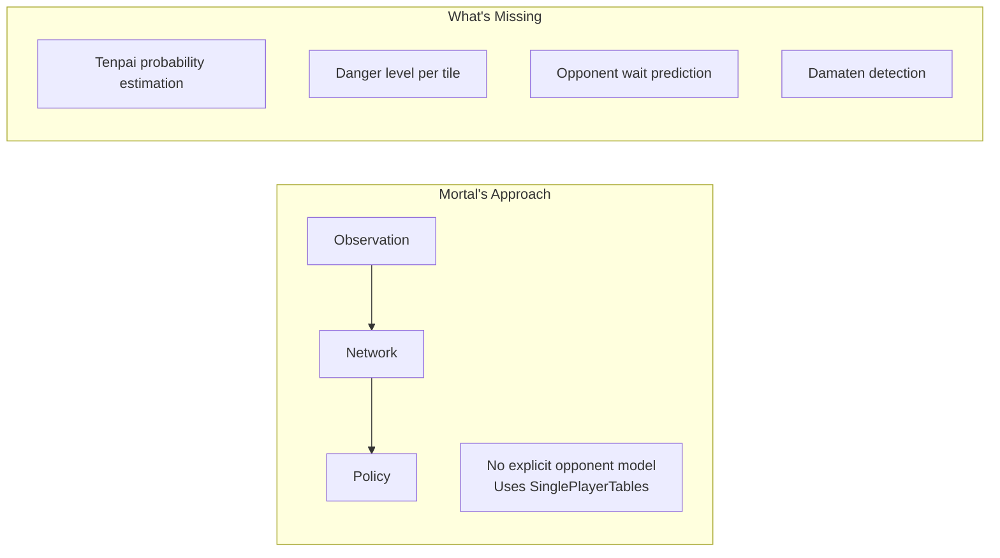
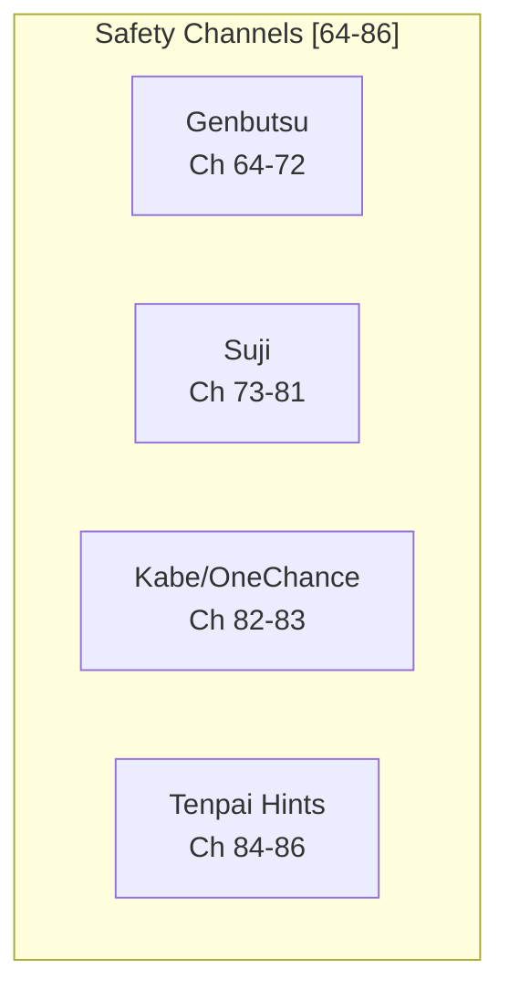
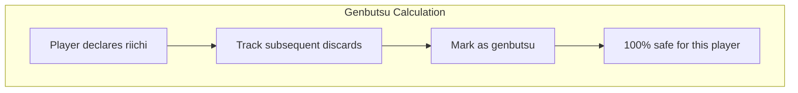
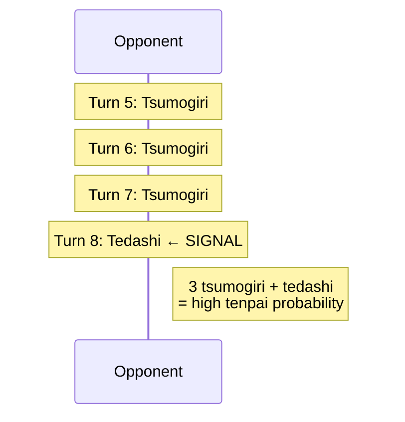
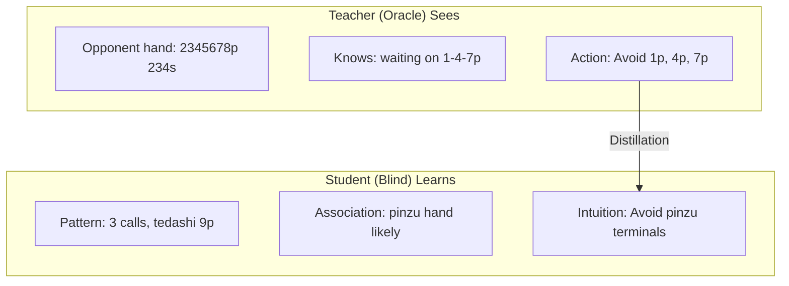

# Hydra Opponent Modeling

Opponent modeling is Hydra's primary differentiator from existing Mahjong AIs. This document covers every aspect of how Hydra reads opponents — from explicit safety plane encoding through auxiliary prediction heads to implicit learning via oracle distillation.

---

## 1. The Problem: Why Current AIs Fail at Opponent Modeling

### Mortal's Blind Spot

Mortal uses `SinglePlayerTables` for EV calculation, assuming no opponent interaction. There are no safety features (suji, kabe, genbutsu) pre-computed, no opponent tenpai estimation, and no aggression or tendency profiling. The network must learn all opponent-relevant patterns implicitly through raw observation channels — and the evidence shows it fails at the hardest cases.

### Evidence from the Community

**Damaten detection failures** are Mortal's most cited weakness in the Japanese mahjong community. Community reports confirm Mortal frequently deals into obvious damaten (silent tenpai) hands because it has no explicit tenpai detection mechanism. The AI relies entirely on explicit signals like riichi declarations and open melds — when an opponent reaches tenpai silently, Mortal has no mechanism to detect the increased danger.

Specific documented issues:

- **GitHub Issue #111** — Overtake score miscalculation; Mortal plays too safe when trailing, missing opportunities to overtake, partly because it cannot read opponent hand danger accurately.
- **GitHub Discussion #102** — Equim-chan (Mortal's creator) confirmed that oracle guiding "didn't bring improvements in practice" and was removed in v3, replaced with the next-rank prediction auxiliary task (implemented as `AuxNet` in code, commonly called "NextRankPredictor" in community discussions). This suggests Mortal's architecture may not be structured to benefit from opponent-aware signals.

**Community-identified weaknesses related to opponent reading:**

1. **Early riichi push errors** — Underestimates the threat of early (turn 1–6) riichi, pushing with sub-optimal hands against unknown waits.
2. **Damaten detection failures** — No intent reading for silent tenpai. Relies on explicit signals (riichi, melds). Deals into high-value silent hands.
3. **Coarse placement sensitivity** — Same playstyle regardless of point spread; doesn't adjust aggression based on how dangerous opponents are.
4. **場況 (bakyou) blindness** — Struggles with field status and table flow reading, as noted in Japanese mahjong blogs on Note.com and Reddit r/Mahjong.

### What Hydra Adds

Hydra addresses the opponent modeling gap through four complementary systems:

1. **Explicit Safety Planes** — Encode suji, kabe, and genbutsu directly into the input tensor
2. **Tenpai Predictor Head** — Detect silent tenpai (damaten) from discard patterns
3. **Danger Head** — Predict deal-in probability per tile
4. **Oracle Distillation** — Learn implicit opponent reading through teacher-student training

---

## 2. Safety Planes: Explicit Defensive Encoding

Hydra dedicates 23 input channels (channels 64–86) to safety information — a novel addition absent from Mortal's 1012-channel encoding. These planes pre-compute traditional Japanese mahjong defensive concepts, giving the network structured safety data rather than forcing it to rediscover these patterns implicitly.

### 2.1 Genbutsu (絶対安全牌) — Channels 64–72

**Definition:** Tiles that are 100% safe against a specific riichi player. Any tile discarded by the riichi player after their riichi declaration is genbutsu — they cannot win on a tile they themselves threw after declaring riichi.

**Encoding:** 9 binary channels, 3 per opponent. Each channel is a binary mask over the 34 tile types: value 1 if that tile is genbutsu for the corresponding opponent, 0 otherwise.

**Calculation:**

When an opponent declares riichi, every tile they discard from that point forward is marked as genbutsu. Since a riichi player's hand is locked, they cannot alter their wait — any tile they discard is provably safe against them.

**Why 3 channels per opponent:** Each opponent gets three channels to represent genbutsu status across different game phases or redundancy for multi-tile coverage. The binary mask spans all 34 tile types per channel.

### 2.2 Suji (筋) — Channels 73–81

**Definition:** Probabilistic safety based on ryanmen (two-sided) wait patterns. When an opponent discards a tile, certain numerically related tiles become safer because common wait patterns involving the discarded tile become less likely.

**Logic:** In ryanmen waits, tiles are linked in 1-4-7, 2-5-8, and 3-6-9 sequences. If a player discards one tile in a sequence, the paired tiles at the opposite end become safer.

**Suji Logic Table:**

| Discarded Tile | Safer Tiles | Reasoning |
|----------------|-------------|-----------|
| 1 or 4 | 7 | No 4-7 ryanmen wait |
| 2 or 5 | 8 | No 5-8 ryanmen wait |
| 3 or 6 | 9 | No 6-9 ryanmen wait |
| 4 or 7 | 1 | No 1-4 ryanmen wait |
| 5 or 8 | 2 | No 2-5 ryanmen wait |
| 6 or 9 | 3 | No 3-6 ryanmen wait |

**Half-suji vs Full-suji:** Half-suji means only one side of the sequence has been discarded. Full-suji means both sides are visible, providing stronger safety.

**Encoding:** 9 float channels, 3 per opponent. Values range from 0.0 to 1.0 representing suji safety coverage — higher values indicate more suji evidence for that tile being safe against that opponent.

**Caveats — Suji is NOT 100% safe:**

Suji only protects against ryanmen (two-sided) waits. Opponents can still win with:

- **Kanchan (嵌張) waits** — Middle-tile waits (e.g., waiting on 5 with 4-6 in hand) bypass suji entirely.
- **Tanki (単騎) waits** — Pair waits on any tile, independent of suji relationships.
- **Suji trap (筋引っ掛け)** — Intentional discard to bait opponents into false safety. For example, cutting 5 then waiting on 2 via a 1-2 kanchan or shanpon.

Suji reduces probability but does not eliminate danger. The network must learn to weigh suji evidence appropriately against other signals.

### 2.3 Kabe (壁) — Channel 82

**Definition:** When all 4 copies of a tile are visible (in discards, melds, or own hand), certain sequence waits through that tile become impossible. This is called kabe (wall) because the tile forms a "wall" blocking wait patterns.

**Kabe Status Table:**

| Visible Copies | Status | Reasoning |
|----------------|--------|-----------|
| 4 copies | Kabe (壁) — No-chance | No ryanmen or kanchan wait can pass through this tile |
| 3 copies | One-chance (ワンチャンス) | Only 1 copy remains; very low probability of being part of a wait |

**Example:** If all 4 copies of 5p are visible, no opponent can have a 3-6p or 4-5p or 5-6p sequence wait. Tiles adjacent to the walled tile become significantly safer.

**Encoding:** Channel 82 is a float mask over 34 tile types, indicating kabe (no-chance) status.

### 2.4 One-Chance (ワンチャンス) — Channel 83

When 3 out of 4 copies of a tile are visible, the remaining single copy makes waits through that tile probabilistically unlikely. This is weaker than full kabe but still provides meaningful safety information.

**Encoding:** Channel 83 is a float mask over 34 tile types, indicating one-chance status.

### 2.5 Tenpai Hints — Channels 84–86

Three binary channels, one per opponent, indicating whether each opponent is likely in tenpai.

| Channel | Content |
|---------|---------|
| 84 | Opponent 1 riichi / high-probability tenpai |
| 85 | Opponent 2 riichi / high-probability tenpai |
| 86 | Opponent 3 riichi / high-probability tenpai |

**Two-phase encoding:**

- **Initially:** Populated from riichi status alone (binary: declared riichi or not).
- **At inference:** Updated with the Tenpai Predictor Head output, enabling damaten detection. When the head predicts high tenpai probability for an opponent who hasn't declared riichi, the corresponding hint channel is activated.

This feedback loop from the auxiliary head back into the input encoding is a key architectural feature — the network's own predictions about opponent state feed back to influence future decisions.

---

## 3. Tenpai Predictor Head

### 3.1 Purpose

Estimate the probability each opponent is in tenpai, with emphasis on detecting damaten (silent tenpai). This is the capability Mortal lacks entirely — the ability to sense when an undeclared opponent has completed their hand.

### 3.2 Architecture

The Tenpai Predictor Head is a lightweight fully-connected network attached to the shared backbone features:

1. **Input:** The backbone's shared latent representation is global-average-pooled from shape `[B × 256 × 34]` to `[B × 256]`, collapsing the tile dimension.
2. **Hidden layer:** A fully-connected layer maps 256 dimensions to 64, with ReLU activation.
3. **Output layer:** A fully-connected layer maps 64 dimensions to 3 outputs (one per opponent), followed by sigmoid activation.
4. **Output:** Three independent probabilities in [0, 1], each representing `P(tenpai)` for one opponent.

The head is deliberately small — it relies on the backbone to extract relevant features and simply maps them to tenpai probabilities. The global average pooling aggregates information across all 34 tile positions, since tenpai detection requires holistic game-state reasoning rather than per-tile analysis.

### 3.3 Key Input Features and Signals

The backbone learns to detect tenpai from multiple observable signals:

| Signal | Interpretation |
|--------|----------------|
| Tedashi after tsumogiri streak | Hand changed after a period of no changes → possibly reached tenpai |
| No calls + fast discards | Building a closed hand (menzen), suggesting damaten potential |
| 3+ open melds | Likely tenpai with few tiles remaining in hand |
| Turn count + remaining discards | Late game with few tiles left = higher baseline tenpai probability |
| Discard patterns | Specific tile sequences suggest particular hand shapes and readiness |

### 3.4 Tedashi Pattern Detection

The tedashi (手出し) vs tsumogiri (ツモ切り) distinction is the primary signal for damaten detection:

- **Tedashi:** A discard chosen from the player's hand (not the just-drawn tile). Indicates the player actively changed their hand composition.
- **Tsumogiri:** Discarding the tile just drawn. Indicates the hand is unchanged — the player is either waiting (tenpai) or stuck.

**The critical pattern:** Three or more consecutive tsumogiri (hand unchanged, player is waiting or stuck) followed by a sudden tedashi (active hand change) strongly suggests the player just completed their hand — they drew a tile that improved their hand and swapped out a different tile to reach tenpai.

This pattern is encoded in the discard channels with an explicit tedashi flag (sub-channel offset +1 per opponent in channels 14–25) and temporal weighting using exponential decay:

`weight = exp(-0.2 × (max_turn - discard_turn))`

Recent discards are weighted higher, making the timing of the tsumogiri-to-tedashi transition more prominent to the network.

### 3.5 Training Signal

**Oracle labels:** During training with perfect information (teacher mode), exact tenpai status is known for all players. The label is binary: 1 if the opponent is in tenpai, 0 otherwise.

**Loss function:** Binary Cross-Entropy per opponent:

`L_tenpai = -Σ [y_i × log(p_i) + (1 - y_i) × log(1 - p_i)]`

where `y_i` is the ground-truth tenpai status and `p_i` is the predicted probability for opponent `i`.

**Loss weight in total training loss:** 0.05 (balances against the primary policy and value losses).

### 3.6 Integration with Other Heads

The Tenpai Head output feeds into three downstream systems:

1. **Safety plane channels 84–86** — High tenpai probability activates the tenpai hint channels, giving the backbone richer input on subsequent forward passes during multi-step reasoning.
2. **Danger Head** — Higher tenpai probability for an opponent increases the baseline danger level for all tiles. The danger head uses tenpai predictions as contextual input.
3. **Policy Head** — When tenpai is detected, the policy shifts toward risk-adjusted actions, favoring safer discards and defensive play.

---

## 4. Danger Head

### 4.1 Purpose

Estimate the deal-in probability for each possible discard tile. Given the current game state, the Danger Head answers: "If I discard this tile right now, what is the probability that an opponent wins off it?"

### 4.2 Architecture

The Danger Head operates per-tile, maintaining the 34-tile geometry:

1. **Input:** The backbone's shared latent representation at shape `[B × 256 × 34]`.
2. **Convolution:** A 1×1 Conv1D maps 256 channels to 1 channel, preserving the 34-tile dimension.
3. **Activation:** Sigmoid squashes each output to [0, 1].
4. **Output:** A vector of 34 probabilities, each representing `P(deal-in)` if that tile type is discarded now.

Unlike the Tenpai Head (which global-pools), the Danger Head preserves per-tile spatial information — danger is inherently tile-specific. The 1×1 convolution acts as a learned per-tile classifier using the full 256-dimensional feature vector at each tile position.

### 4.3 Output Interpretation

| Output Range | Interpretation |
|--------------|----------------|
| p < 0.05 | Safe tile — low risk of deal-in |
| 0.05 < p < 0.15 | Moderate risk — consider hand value and game state |
| p > 0.15 | Dangerous — strong chance of dealing in |

### 4.4 Training Signal

**Labels:** Binary — did discarding this specific tile at this specific game state result in a deal-in (ron by an opponent)?

**Class imbalance handling:** Deal-ins are rare events, occurring in roughly 10–15% of hands. Unweighted training would bias the head toward always predicting "safe." The solution is weighted Binary Cross-Entropy:

`L_danger = -Σ [w × y × log(p) + (1 - y) × log(1 - p)]`

where `w` is the class weight for positive (deal-in) samples, set higher than 1.0 to compensate for the natural imbalance.

**Loss weight in total training loss:** 0.05.

### 4.5 Risk-Adjusted Action Selection

During inference, the policy head and danger head outputs are combined to produce risk-adjusted decisions:

`score(a) = log π(a) - λ × log(p_danger(a))`

`a* = argmax score(a)`

where:
- `π(a)` is the policy probability for action `a`
- `p_danger(a)` is the danger head's deal-in probability for action `a`
- `λ` is the defense/offense balance parameter

**λ behavior:**

| λ Value | Behavior |
|---------|----------|
| λ = 0 | Pure offense — ignore danger entirely |
| λ = 1 | Balanced play — weigh policy and danger equally |
| λ > 1 | Defensive — prioritize safety over hand progress |

**Dynamic λ adjustment:** The λ parameter should vary based on game context:

- **Score position:** When ahead, increase λ (more defensive to protect lead). When behind, decrease λ (more aggressive to catch up).
- **Opponent tenpai probability:** Higher tenpai detection from the Tenpai Head → increase λ.
- **Own hand value:** High-value hands justify lower λ (worth the risk to push). Low-value hands with high opponent danger justify higher λ (fold and wait).

---

## 5. Oracle Distillation for Opponent Reading

Beyond the explicit auxiliary heads, oracle distillation provides a mechanism for the network to learn implicit opponent reading — patterns too subtle or complex for hand-crafted safety planes.

### 5.1 Teacher-Student Framework

### 5.2 How It Works

**Teacher network:** An identical architecture to the student, but with expanded input that includes hidden information:

- Opponent hands (all tiles visible)
- Wall composition (remaining tile distribution)
- Ura-dora indicators

The teacher trains with PPO on self-play using reward normalized with a hand-luck baseline. Because it sees everything, the teacher converges roughly 10× faster than a blind agent and makes near-optimal defensive decisions.

**Student network:** The standard blind architecture (87 input channels, no hidden information). The student trains with a combined objective:

`Loss = PPO_loss + λ_KL × KL(Student || Teacher)`

The KL divergence term forces the student's policy distribution to approximate the teacher's, even though the student cannot see the hidden information. Over time, the student develops "intuition" — it learns to associate observable patterns (discard sequences, call patterns, tedashi timing) with the teacher's privileged decisions.

**Feature dropout schedule:** To prevent the student from becoming dependent on the KL signal and to encourage genuine pattern learning, the teacher's access to hidden information is gradually reduced:

| Training Day | Teacher Hidden Mask | KL Weight |
|--------------|---------------------|-----------|
| Days 4–5 | 0% (full oracle access) | 1.0 |
| Days 6–7 | 25% masked | 0.8 |
| Days 8–9 | 50% masked | 0.5 |
| Day 10 | 75% masked | 0.3 |

As the teacher's advantage shrinks, the student must rely more on its own learned patterns rather than imitating a privileged teacher.

### 5.3 What the Student Learns

Through distillation, the student acquires implicit abilities that no explicit encoding can capture:

- **Suit tendency reading:** When an opponent calls multiple pinzu melds, the student learns to avoid pinzu tiles — mimicking the teacher who can see the opponent holds a pinzu-heavy hand.
- **Value estimation:** The teacher avoids dangerous tiles more aggressively against high-value hands. The student learns to associate observable signals (dora pon, honitsu-suggestive discards) with elevated danger.
- **Timing intuition:** Subtle correlations between discard order, hesitation-like patterns (tedashi after long tsumogiri), and actual tenpai status become encoded in the student's features.

This implicit learning complements the explicit safety planes and auxiliary heads, covering edge cases and complex multi-factor situations that rule-based encoding cannot handle.

---

## 6. Deal-in Rate Heuristics

The following multipliers, sourced from the killer_mortal_gui project, provide empirically-derived estimates for deal-in probability based on wait type and tile properties. These serve as calibration targets and training signal priors for the Danger Head.

### 6.1 Base Wait Type Multipliers

| Wait Type | Multiplier | Notes |
|-----------|------------|-------|
| Ryanmen (両面) | 3.5× | Most common riichi wait; two-sided, high frequency |
| Kanchan (嵌張) | 0.21× | Middle-tile wait; low frequency due to single tile acceptance |
| Kanchan (suji trap) | 2.6× | Intentional bait — e.g., cutting 5 to wait on 2; deceptively common |
| Penchan (辺張) | 1.0× | Edge wait; baseline multiplier |
| Honor tanki/shanpon | 1.7× | Honor pair or double-pair wait; higher likelihood due to honor tile retention |

### 6.2 Modifier Multipliers

These multiply on top of the base wait type multiplier:

| Condition | Multiplier | Reasoning |
|-----------|------------|-----------|
| Dora tile | 1.2× | Players retain dora longer; higher chance it's part of their wait |
| Ura-suji | 1.3× | The "inside" suji relationship; slightly more dangerous than neutral |
| Matagi suji (early discard) | 0.6× | Tile straddling a discard from early game; less likely to be a current wait |
| Matagi suji (riichi discard) | 1.2× | Tile straddling the riichi declaration discard; potentially a trap |
| Red 5 discarded | 0.14× | Discarding a red 5 strongly suggests the player doesn't need that suit's middle tiles |

---

## 7. Comparison to Existing Approaches

| Feature | Mortal | Suphx | Hydra |
|---------|--------|-------|-------|
| **Genbutsu encoding** | Implicit (must learn from raw discards) | Implicit | Explicit binary planes (Ch 64–72) |
| **Suji encoding** | Implicit | Implicit | Explicit float planes (Ch 73–81) |
| **Kabe encoding** | Implicit | Implicit | Explicit float planes (Ch 82–83) |
| **Tenpai detection** | None — no mechanism for damaten | Oracle-guided (removed in practice) | Explicit auxiliary head + oracle distillation |
| **Danger prediction** | Implicit via Q-values | Implicit via Q-values | Explicit per-tile danger head |
| **Damaten detection** | Poor — community-documented failure mode | Better via oracle training | Explicit tedashi pattern detection + tenpai head |
| **Opponent modeling** | None (`SinglePlayerTables`) | Oracle-guided + run-time adaptation | Oracle distillation + explicit safety planes + auxiliary heads |
| **Safety logic** | Must be learned implicitly | Must be learned implicitly | 23-plane explicit encoding |
| **Training approach** | DQN + CQL (offline RL) | Oracle guiding → RL | PPO + oracle distillation + league training |
| **Score awareness** | Dual-scale (100K/30K, degraded above 30K) | Not documented | Uncapped + relative gaps + overtake thresholds |

### Key Differentiator

Mortal and Suphx both rely on the network to implicitly learn defensive concepts from raw game data. Hydra pre-computes and explicitly encodes these concepts, giving the network a structured foundation. The auxiliary heads (tenpai and danger) then provide focused learning targets for opponent-aware skills, while oracle distillation adds the implicit "intuition" layer that captures patterns beyond what explicit encoding can represent.

---

## 8. Expected Improvements

| Metric | Mortal Baseline | Hydra Target | Basis for Target |
|--------|-----------------|--------------|------------------|
| Deal-in rate (vs riichi) | ~12% | <10% | Explicit genbutsu/suji planes + danger head |
| Deal-in rate (vs damaten) | ~18% | <12% | Tenpai predictor head + tedashi pattern detection |
| Tenpai detection accuracy | N/A (no mechanism) | >75% | Dedicated auxiliary head with oracle-labeled training |
| Dangerous tile avoidance | Implicit (Q-value side effect) | Explicit decision (danger head output) | Per-tile danger probability enables principled risk-reward tradeoff |
| Overall deal-in rate | 11.3% (Tenhou stats) | <10% | Combined safety encoding + explicit heads |

These targets are conservative — the explicit encoding and dedicated heads should provide significant uplift even before oracle distillation adds its implicit opponent reading capabilities. The real gains from distillation may emerge in edge cases: unusual wait shapes, deceptive discard patterns, and complex multi-opponent threat scenarios that cannot be captured by suji/kabe/genbutsu alone.
