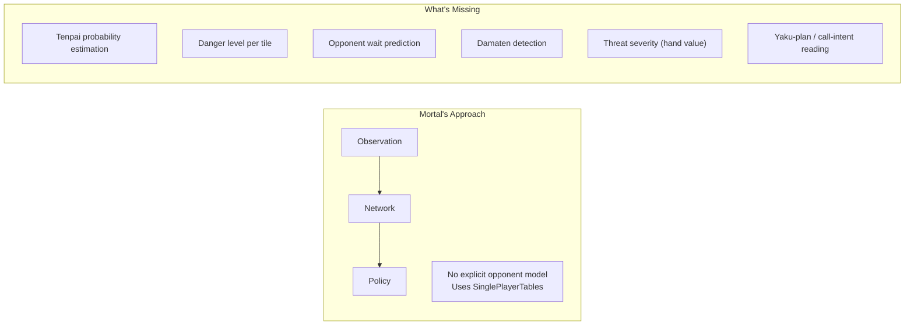
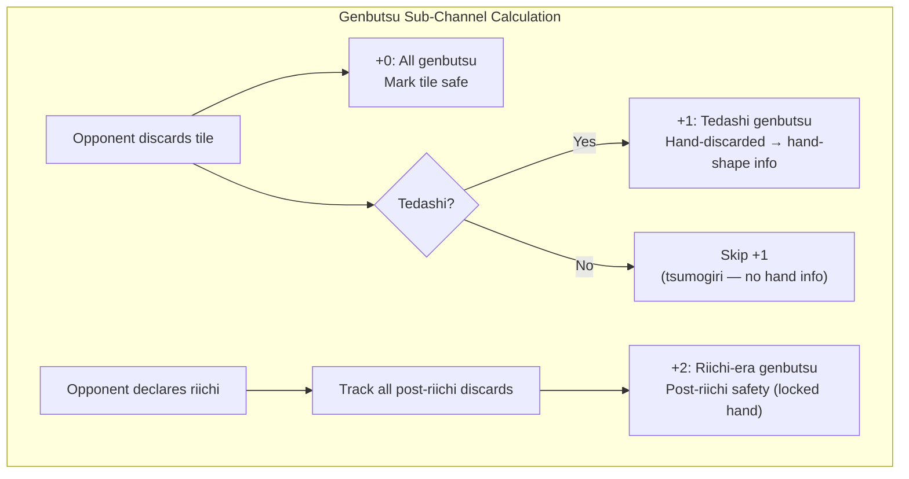
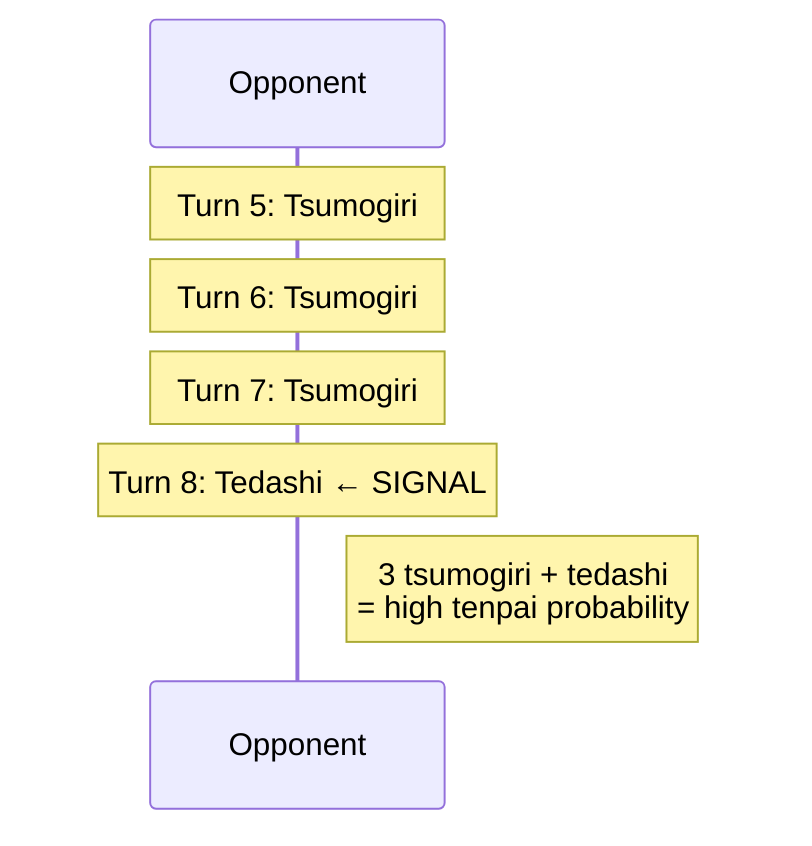
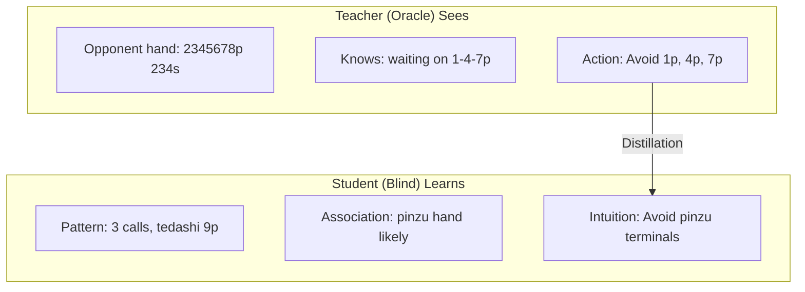

# Hydra Opponent Modeling

Opponent modeling is Hydra's primary differentiator from existing Mahjong AIs. This document covers every aspect of how Hydra reads opponents — from explicit safety plane encoding through auxiliary prediction heads to implicit learning via oracle distillation.

---

## 1. The Problem: Why Current AIs Fail at Opponent Modeling

### Mortal's Blind Spot

> **Ownership note:** This document is the authoritative source for detailed opponent-modeling rationale (safety encoding logic, tenpai/danger head behavior, and expected effects). `HYDRA_SPEC.md` retains only high-level architecture summaries and links here for detail.

Mortal uses `SinglePlayerTables` for EV calculation, assuming no opponent interaction. There are no safety features (suji, kabe, genbutsu) pre-computed, no opponent tenpai estimation, and no aggression or tendency profiling. The network must learn all opponent-relevant patterns implicitly through raw observation channels — and the evidence shows it fails at the hardest cases.



### Evidence from the Community

**Damaten detection failures** are Mortal's most cited weakness in the Japanese mahjong community. Community reports confirm Mortal frequently deals into obvious damaten (silent tenpai) hands because it has no explicit tenpai detection mechanism. The AI relies entirely on explicit signals like riichi declarations and open melds — when an opponent reaches tenpai silently, Mortal has no mechanism to detect the increased danger.

Specific documented issues:

- **GitHub Issue #111** — Overtake score miscalculation; Mortal plays too safe when trailing, missing opportunities to overtake, partly because it cannot read opponent hand danger accurately.
- **GitHub Discussion #102** — Equim-chan (Mortal's creator) confirmed that oracle guiding "didn't bring improvements in practice" and was removed in v3, replaced with a next-rank prediction auxiliary task (implemented as `AuxNet` in `mortal/model.py`; rationale in Discussion #52). This suggests Mortal's architecture may not be structured to benefit from opponent-aware signals.

**Community-identified weaknesses related to opponent reading:**

1. **Early riichi push errors** — Underestimates the threat of early (turn 1–6) riichi, pushing with sub-optimal hands against unknown waits.
2. **Damaten detection failures** — No intent reading for silent tenpai. Relies on explicit signals (riichi, melds). Deals into high-value silent hands.
3. **Coarse placement sensitivity** — Same playstyle regardless of point spread; doesn't adjust aggression based on how dangerous opponents are.
4. **場況 (bakyou) blindness** — Struggles with field status and table flow reading, as noted in Japanese mahjong blogs on Note.com and Reddit r/Mahjong.

### What Hydra Adds

Hydra addresses the opponent modeling gap through seven complementary systems:

1. **Explicit Safety Planes** — Encode suji, kabe, and genbutsu directly into the input tensor
2. **Tenpai Predictor Head** — Detect silent tenpai (damaten) from discard patterns
3. **Danger Head** — Predict deal-in probability per tile (with dense counterfactual labels)
4. **Wait-Set Belief Head** — Predict which tiles complete each opponent's hand (§ 4.6)
5. **Value-Conditioned Tenpai** — Estimate opponent hand value when tenpai (§ 3.7)
6. **Call-Intent Head** — Infer opponent yaku plan from call patterns (§ 4.7)
7. **Oracle Distillation** — Learn implicit opponent reading through teacher-student training

---

## 2. Safety Planes: Explicit Defensive Encoding

> For the channel-level summary, see [HYDRA_SPEC § Safety Channels](HYDRA_SPEC.md#safety-channels-6284). This section provides the detailed design rationale and encoding logic.

Hydra dedicates 23 input channels (channels 62–84) to safety information — a novel addition absent from Mortal's 1012-channel encoding. These planes pre-compute traditional Japanese mahjong defensive concepts, giving the network structured safety data rather than forcing it to rediscover these patterns implicitly.

> **Quantitative basis:** The 23-channel safety encoding is grounded in mahjong theory (genbutsu, suji, kabe are the foundation of all human defensive play) but the specific channel design (9 genbutsu, 9 suji, 2 kabe, 3 tenpai hints) and encoding choices (suji float values, 3 sub-channels per genbutsu opponent) are based on domain analysis, not empirical ablation. Mortal achieves ~11% deal-in rate without any explicit safety planes, relying on implicit learning from 1012 raw channels. Whether pre-computed safety planes improve over implicit learning is an open empirical question — this is precisely what **Ablation A1** tests (see [ABLATION_PLAN.md § A1](ABLATION_PLAN.md#a1-safety-planes)). The safety plane design will be validated or revised based on A1 results. The conservative channel counts (9+9+2+3=23) were chosen to minimize parameter overhead (~0% increase to backbone) while covering the complete human defensive vocabulary.

### 2.1 Genbutsu (絶対安全牌) — Channels 61–69

**Definition:** Tiles that are 100% safe against a specific riichi player. Any tile discarded by the riichi player after their riichi declaration is genbutsu — they cannot win on a tile they themselves threw after declaring riichi.

**Encoding:** 9 binary channels, 3 per opponent. The 3 channels per opponent encode three semantically distinct safety signals:

| Sub-channel | Content | Encoding |
|-------------|---------|----------|
| +0 | All genbutsu | Binary mask: 1 if tile is 100% safe against this opponent. Union of discard-furiten genbutsu (tile in their river) and riichi-furiten genbutsu (tile discarded by anyone after their riichi, not ron'd). |
| +1 | Tedashi genbutsu | Binary mask: subset of +0 where tile was specifically hand-discarded (tedashi) by this opponent, not tsumogiri. Carries hand-shape information — tedashi implies the opponent evaluated and rejected this tile. |
| +2 | Riichi-era genbutsu | Binary mask: subset of +0 where tile became safe AFTER this opponent declared riichi (any player's post-riichi discard). Only non-zero when opponent is in riichi. Separates pre-riichi safety (mutable hand) from post-riichi safety (locked hand). |

**Calculation:**



**Why 3 channels per opponent, not 1:** While genbutsu is binary (safe or not), the sub-channel decomposition provides the network with pre-computed hand-reading signals. Tedashi genbutsu reveals which tiles the opponent actively rejected from their hand (matagi-suji and sotogawa inferences follow). Riichi-era genbutsu separates the temporal regime where the opponent's hand is locked. This mirrors Mortal v4's 3-channel kawa summary (all discards / tedashi-only / riichi-tile) but pre-computes the safety derivation. No existing mahjong AI pre-computes genbutsu channels — Mortal, Suphx, and Mjx all rely on the network to derive safety from raw discard data. Hydra's explicit encoding is a deliberate advantage.

### 2.2 Suji (筋) — Channels 70–78

**Definition:** Probabilistic safety based on ryanmen (two-sided) wait patterns. When an opponent discards a tile, certain numerically related tiles become safer because common wait patterns involving the discarded tile become less likely.

**Logic:** In ryanmen waits, tiles are linked in 1-4-7, 2-5-8, and 3-6-9 sequences. If a player discards one tile in a sequence, the paired tiles at the opposite end become safer.

**Suji Logic Table:**

| Discarded Tile | Safer Tiles | Reasoning |
|----------------|-------------|-----------|
| 1 or 4 | 7 | No 4-7 ryanmen wait |
| 2 or 5 | 8 | No 5-8 ryanmen wait |
| 3 or 6 | 9 | No 6-9 ryanmen wait |
| 4 or 7 | 1 | No 1-4 ryanmen wait |
| 5 or 8 | 2 | No 2-5 ryanmen wait |
| 6 or 9 | 3 | No 3-6 ryanmen wait |

**Half-suji vs Full-suji:** Half-suji means only one side of the sequence has been discarded. Full-suji means both sides are visible, providing stronger safety.

**Encoding:** 9 float channels, 3 per opponent. Values range from 0.0 to 1.0 representing suji safety coverage — higher values indicate more suji evidence for that tile being safe against that opponent.

**Caveats — Suji is NOT 100% safe:**

Suji only protects against ryanmen (two-sided) waits. Opponents can still win with:

- **Kanchan (嵌張) waits** — Middle-tile waits (e.g., waiting on 5 with 4-6 in hand) bypass suji entirely.
- **Tanki (単騎) waits** — Pair waits on any tile, independent of suji relationships.
- **Suji trap (筋引っ掛け)** — Intentional discard to bait opponents into false safety. For example, cutting 5 then waiting on 2 via a 1-2 kanchan or shanpon.

Suji reduces probability but does not eliminate danger. The network must learn to weigh suji evidence appropriately against other signals.

### 2.3 Kabe (壁) — Channel 79

**Definition:** When all 4 copies of a tile are visible (in discards, melds, or own hand), certain sequence waits through that tile become impossible. This is called kabe (wall) because the tile forms a "wall" blocking wait patterns.

**Kabe Status Table:**

| Visible Copies | Status | Reasoning |
|----------------|--------|-----------|
| 4 copies | Kabe (壁) — No-chance | No ryanmen or kanchan wait can pass through this tile |
| 3 copies | One-chance (ワンチャンス) | Only 1 copy remains; very low probability of being part of a wait |

**Example:** If all 4 copies of 5p are visible, no opponent can have a 3-6p or 4-5p or 5-6p sequence wait. Tiles adjacent to the walled tile become significantly safer.

**Encoding:** Channel 79 is a float mask over 34 tile types, indicating kabe (no-chance) status.

### 2.4 One-Chance (ワンチャンス) — Channel 80

When 3 out of 4 copies of a tile are visible, the remaining single copy makes waits through that tile probabilistically unlikely. This is weaker than full kabe but still provides meaningful safety information.

**Encoding:** Channel 80 is a float mask over 34 tile types, indicating one-chance status.

### 2.5 Tenpai Hints — Channels 82–84

Three binary channels, one per opponent, indicating whether each opponent is likely in tenpai.

| Channel | Content |
|---------|---------|
| 81 | Opponent 1 riichi / high-probability tenpai |
| 82 | Opponent 2 riichi / high-probability tenpai |
| 83 | Opponent 3 riichi / high-probability tenpai |

**Two-phase encoding:**

- **Initially:** Populated from riichi status alone (binary: declared riichi or not).
- **At inference:** Updated with the Tenpai Predictor Head output, enabling damaten detection. When the head predicts high tenpai probability for an opponent who hasn't declared riichi, the corresponding hint channel is activated.

This feedback loop from the auxiliary head back into the input encoding is a key architectural feature — the network's own predictions about opponent state feed back to influence future decisions.

**Feedback loop implementation detail:**

The feedback operates **across sequential decisions within a game**, not within a single forward pass (no double pass required):

1. At decision time *t*, tenpai hint channels (82–84) are set to `max(riichi_status[i], cached_tenpai_pred[i] > 0.5)` for each opponent *i*.
2. The model runs a single forward pass, producing all head outputs including tenpai predictions `[p₁, p₂, p₃]`.
3. The tenpai predictions are cached: `cached_tenpai_pred = [p₁, p₂, p₃]`.
4. At decision time *t+1*, step 1 uses the cached predictions from *t*.

| Parameter | Value | Notes |
|-----------|-------|-------|
| Activation threshold | 0.5 | Binary decision boundary for tenpai hint channels |
| Forward passes per decision | 1 | No double-pass — feedback is across time steps |
| Latency impact | Zero | Tenpai head output is already computed in the main forward pass |

**Training behavior:** During training with oracle/ground-truth tenpai labels, channels 82–84 use the ground-truth tenpai status (not the head's predictions). The feedback loop with cached predictions activates only at inference time. This prevents error accumulation during training while teaching the model to use tenpai hints correctly.

---

## 3. Tenpai Predictor Head

### 3.1 Purpose

Estimate the probability each opponent is in tenpai, with emphasis on detecting damaten (silent tenpai). This is the capability Mortal lacks entirely — the ability to sense when an undeclared opponent has completed their hand.

### 3.2 Architecture

> See [HYDRA_SPEC § Tenpai Head](HYDRA_SPEC.md#tenpai-head) for the canonical architecture specification (GAP → FC(256→64) → FC(64→3) → Sigmoid).

### 3.3 Key Input Features and Signals

The backbone learns to detect tenpai from multiple observable signals:

| Signal | Interpretation |
|--------|----------------|
| Tedashi after tsumogiri streak | Hand changed after a period of no changes → possibly reached tenpai |
| No calls + fast discards | Building a closed hand (menzen), suggesting damaten potential |
| 3+ open melds | Likely tenpai with few tiles remaining in hand |
| Turn count + remaining discards | Late game with few tiles left = higher baseline tenpai probability |
| Discard patterns | Specific tile sequences suggest particular hand shapes and readiness |

### 3.4 Tedashi Pattern Detection

The tedashi (手出し) vs tsumogiri (ツモ切り) distinction is the primary signal for damaten detection:

- **Tedashi:** A discard chosen from the player's hand (not the just-drawn tile). Indicates the player actively changed their hand composition.
- **Tsumogiri:** Discarding the tile just drawn. Indicates the hand is unchanged — the player is either waiting (tenpai) or stuck.



**The critical pattern:** Three or more consecutive tsumogiri (hand unchanged, player is waiting or stuck) followed by a sudden tedashi (active hand change) strongly suggests the player just completed their hand — they drew a tile that improved their hand and swapped out a different tile to reach tenpai.

This pattern is encoded in the discard channels with an explicit tedashi flag (sub-channel offset +1 per opponent in channels 11–22) and temporal weighting using exponential decay:

`weight = exp(-0.2 × (max_turn - discard_turn))`

Recent discards are weighted higher, making the timing of the tsumogiri-to-tedashi transition more prominent to the network.

### 3.5 Training Signal

**Ground-truth labels (phase-specific):**

- **Phase 1 (Supervised):** Tenpai labels are reconstructed from game logs. MJAI records contain all 4 players' starting hands in the `start_kyoku` event. By replaying each draw, discard, and call, every opponent's hand is reconstructible at every decision point. Computing shanten=0 gives exact tenpai status. These are ground-truth labels available **without oracle mode**.
- **Phase 2–3 (RL):** The oracle teacher network sees opponent hands directly (205 oracle channels include opponent shanten and waits). Tenpai labels are trivially available from the teacher's observation.

In both cases, the label is binary per opponent: 1 if tenpai, 0 otherwise.

**Loss function:** Binary Cross-Entropy per opponent:

`L_tenpai = -Σ [y_i × log(p_i) + (1 - y_i) × log(1 - p_i)]`

where `y_i` is the ground-truth tenpai status and `p_i` is the predicted probability for opponent `i`.

**Loss weight in total training loss:** 0.05 (balances against the primary policy and value losses).

### 3.6 Integration with Other Heads

The Tenpai Head output feeds into three downstream systems:

1. **Safety plane channels 82–84** — High tenpai probability activates the tenpai hint channels, giving the backbone richer input on subsequent forward passes during multi-step reasoning.
2. **Danger Head** — Higher tenpai probability for an opponent increases the baseline danger level for all tiles. The danger head uses tenpai predictions as contextual input.
3. **Policy Head** — When tenpai is detected, the policy shifts toward risk-adjusted actions, favoring safer discards and defensive play.

### 3.7 Value-Conditioned Tenpai (Threat Severity)

Binary tenpai detection answers "is the opponent ready?" but not "how expensive is their hand?" A 1-han tenpai and a hidden mangan tenpai should produce radically different push/fold thresholds. Humans fold earlier when they smell honitsu/toitoi/dragon dora; a binary tenpai head cannot distinguish these cases.

**Extension:** Add a per-opponent hand value classification head that predicts the expected point value of the opponent's hand, conditioned on tenpai.

**Output:** `[B × 3 × V]` softmax, where V is the number of value bins. Recommended bins:

| Bin | Point Range | Typical Hands |
|-----|-------------|---------------|
| 0 | <2000 | 1-han 30fu (1000/2000) |
| 1 | 2000–3900 | 2-han (2600/5200) |
| 2 | 3900–5200 | 3-han (3900/7700) |
| 3 | 5200–7700 | Mangan threshold (8000/12000) |
| 4 | 8000+ | Mangan and above (haneman, baiman, etc.) |

**Architecture:** GAP(256×34 → 256) → FC(256→64) → ReLU → FC(64→5×3) → Reshape to [B×3×5] → Softmax per opponent. Parameter cost: ~17K (+0.1% of total model).

**Training signal:**
- **Phase 1:** At each timestep where an opponent is in tenpai, label with the *eventual* winning hand value if the opponent wins this kyoku (from the game outcome in the MJAI log). Mask the loss when the opponent is not in tenpai or does not win. This introduces survivorship bias (only winning hands get labels), but the distribution of winning hand values is well-characterized in mahjong statistics.
- **Phase 2–3:** Oracle teacher sees the opponent's actual hand and can compute the exact hand value at every timestep (scoring from visible tiles + known hand), eliminating survivorship bias.
- **Loss:** Cross-entropy per opponent, masked to tenpai states only. Weight: 0.02 (low, novel head).

**Integration:** The value head output feeds into the push/fold calculus alongside tenpai probability. Expected danger cost becomes:

`E[cost(a)] = Σ_i [p_tenpai(i) × p_danger_i(a) × E[value_i]]`

Where `E[value_i]` is the expected hand value from the value bins. This replaces the current uniform danger weighting with threat-severity-aware defense.

> **Novelty note:** No published mahjong AI predicts opponent hand value as an explicit output. Community statistics (e.g., [houou-statistics](https://github.com/chienshyong/houou-statistics) analyses of open tenpai value distributions and riichi winrate by han) confirm that hand value varies dramatically with observable signals (call patterns, dora visibility, discard shape). The value head makes this implicit knowledge explicit.
---

## 4. Danger Head

### 4.1 Purpose

Estimate the deal-in probability for each possible discard tile. Given the current game state, the Danger Head answers: "If I discard this tile right now, what is the probability that an opponent wins off it?"

### 4.2 Architecture and Design Rationale

> See [HYDRA_SPEC § Danger Head](HYDRA_SPEC.md#danger-head) for the canonical architecture specification (1×1 Conv1D(256→3) → Sigmoid, output [B × 3 × 34]).

Per-opponent granularity (3×34) is essential for mawashi-uchi (回し打ち) — the strategy of dodging one specific dangerous opponent while continuing to push against others. An aggregate 1×34 output would discard the per-opponent information that the backbone already encodes (genbutsu channels 62–70, suji channels 71–79, tenpai hints 82–84 are all per-opponent), creating an information bottleneck.

**Why 3×34 over 1×34:**
- A tile can be safe against Player A (genbutsu) but deadly against Player B — the aggregate signal is ambiguous
- Score-aware defense: dealing into 4th-place player is strategically different from dealing into 1st-place
- Parameter cost is negligible: Conv1d(256→3) = 771 params vs Conv1d(256→1) = 257 params (+0.003% of total model)
- Training labels are naturally per-opponent: each deal-in event identifies which opponent won
- Mortal encodes all opponent info per-player (kawa, riichi, scores) — the output should match

### 4.3 Output Interpretation

The output `[B × 3 × 34]` gives per-opponent, per-tile deal-in probabilities:

| Output Range | Interpretation |
|--------------|----------------|
| p < 0.05 | Safe tile against this opponent — low risk of deal-in |
| 0.05 < p < 0.15 | Moderate risk — consider hand value and game state |
| p > 0.15 | Dangerous — strong chance of dealing into this opponent |

**Aggregation options at inference:**
- `max(dim=opponent)` → worst-case danger per tile (conservative)
- `weighted_sum(danger × tenpai_prob)` → expected danger weighted by tenpai probability (balanced)
- Per-opponent inspection → enables mawashi-uchi: dodge opponent A, push against opponent C

### 4.4 Training Signal

**Labels:** Per-opponent binary — for each discard at each game state, a `[3]` vector indicates which opponent(s) won off that tile. Example: `[0, 1, 0]` means dealt into opponent 2. Most labels are `[0, 0, 0]` (no deal-in). This per-opponent labeling comes for free from game logs.

**Class imbalance handling:** Deal-ins are rare events, occurring in roughly 10–15% of hands. Unweighted training would bias the head toward always predicting "safe."

**Loss function:** Focal Binary Cross-Entropy (Lin et al., 2017), which subsumes class weighting and hard-example mining:

```
L_danger = -Σ [α_t × (1 - p_t)^γ × log(p_t)]
```

Where `p_t = p` if y=1, `p_t = 1-p` if y=0, and `α_t = α` if y=1, `α_t = 1-α` if y=0.

**Hyperparameters:**

| Parameter | Value | Tuning Range | Notes |
|-----------|-------|-------------|-------|
| α (positive class weight) | 0.25 | [0.15, 0.5] | From Lin et al. best result on extreme imbalance |
| γ (focusing parameter) | 2.0 | [1.0, 3.0] | Crushes loss on easy negatives; γ=0 recovers standard BCE |

**Why focal loss over weighted BCE:**
- Deal-in events are ~1-3% of all discard decisions. Weighted BCE with w=10 (sqrt-inverse-frequency) upweights ALL positives equally, including easy ones the model already gets right.
- Focal loss with γ=2.0 naturally focuses gradient on hard examples (tiles the model is uncertain about), while easy negatives contribute near-zero gradient.
- Critical for auxiliary heads: an overly aggressive pos_weight (w>20) distorts the shared backbone's representations, hurting the primary policy head. Focal loss avoids this by construction.
- Fallback if focal loss is too complex to implement initially: use `BCEWithLogitsLoss(pos_weight=10.0)`, tune range [5, 20].

### 4.5 Risk-Adjusted Action Selection

During inference, the policy head and danger head outputs are combined to produce risk-adjusted decisions. The per-opponent danger probabilities are first aggregated (weighted by tenpai probability):

`p_danger(a) = Σ_i [p_danger_i(a) × p_tenpai(i)]`

Then combined with the policy:

`score(a) = log π(a) - λ × log(p_danger(a))`

`a* = argmax score(a)`

where:
- `π(a)` is the policy probability for action `a`
- `p_danger(a)` is the danger head's deal-in probability for action `a`
- `λ` is the defense/offense balance parameter

> **Formula reconciliation:** Three risk-adjusted formulations exist across the docs. They serve different purposes:
>
> | Name | Formula | Context | Where |
> |------|---------|---------|-------|
> | **Formula A** (RCPO training) | `A_combined = (A^R(s,a) - λ × A^C(s,a)) / (1 + λ)` | PPO advantage during training | [TRAINING § PID-Lagrangian](TRAINING.md#pid-lagrangian-λ-auto-tuning) |
> | **Formula B** (logit masking) | `safe_logits = policy_logits - λ × danger_logits` | Canonical inference formula | [TRAINING § Inference Behavior](TRAINING.md#inference-behavior) |
> | **Formula C** (log-probability) | `score(a) = log π(a) - λ × log(p_danger(a))` | Equivalent to B for action selection | This section |
>
> Formulas B and C are equivalent for action selection: `log π(a)` differs from `policy_logits[a]` only by the log-sum-exp constant (which cancels in argmax), and `log(p_danger(a)) = log(sigmoid(danger_logits[a]))` is a monotonic transform of `danger_logits[a]`. **Formula B is the canonical inference implementation** — it operates directly on raw logits, avoiding numerically unnecessary softmax/sigmoid computations.

**Dynamic λ via PID-Lagrangian (auto-tuned):**

> The PID-Lagrangian controller specification (update rule, gains, λ range, combined advantage formula) is defined in [TRAINING § PID-Lagrangian λ Auto-Tuning](TRAINING.md#pid-lagrangian-λ-auto-tuning).

**Why PID over hand-crafted λ:**
- Mortal and Suphx use NO explicit λ — risk is implicit in Q-values/reward. This works but produces documented defensive weaknesses.
- A hand-crafted λ(s) function requires tuning dozens of thresholds (score gaps, hand values, tenpai counts, round number) with fragile interactions.
- PID-Lagrangian auto-tunes λ to satisfy the deal-in constraint, while the cost advantage A^C(s,a) is already state-dependent — capturing all the game context that a hand-crafted formula would need.
- The RCPO normalization (dividing by 1+λ) is critical — without it, the policy objective collapses to pure safety minimization when λ is large.

**Oshi-hiki calibration reference:** Human expert push/fold crossover occurs at W:D ≈ 0.88 for 2-han bad wait vs non-dealer riichi (from SMS / Shin Kagaku suru Mahjong). The PID-tuned λ should produce behavior consistent with these thresholds when evaluated on expert game logs.

### 4.6 Wait-Set Belief Head (Extended Opponent Modeling)

The Danger Head predicts *how risky* each tile is; the Tenpai Head predicts *whether* an opponent is ready. Neither models the **structure** of an opponent's waiting hand — specifically, which tiles could complete it right now. A Wait-Set Belief Head fills this gap.

**Output:** `[B × 3 × 34]` sigmoid — per-opponent, per-tile probability that the tile is in the opponent's current ron-eligible wait set.

**Architecture:** Shares the same backbone output as the Danger Head. Implementation: `Conv1d(256, 3, kernel_size=1)` → Sigmoid. Parameter cost: 771 params (+0.005% of total model), identical structure to the Danger Head.

**Relationship to Danger Head:** Wait-Set and Danger are complementary, not redundant:

| Head | Question | Signal | Label Source |
|------|----------|--------|-------------|
| Tenpai | Is opponent *i* in tenpai? | Binary per opponent | Shanten=0 from reconstructed hand |
| Wait-Set | Which tiles complete opponent *i*'s hand? | Binary per tile per opponent | Ukeire computation from reconstructed hand, furiten-filtered |
| Danger | If I discard tile *t*, will opponent *i* ron? | Probability per tile per opponent | Actual deal-in events (sparse) or dense ron-eligibility (see § 4.4) |

Wait-Set predicts the opponent's waiting tiles regardless of whether the player discards them — it models the opponent's hand structure. Danger predicts the consequence of a specific discard action. With dense danger labels (see [TRAINING § Danger label construction](TRAINING.md#auxiliary-losses)), the Wait-Set and Danger heads share label infrastructure but serve distinct roles: Wait-Set labels are always binary (tile is or isn't in the wait set), while dense Danger labels can carry soft probabilities when generated by the oracle teacher in Phase 2.

**Training signal:**
- **Phase 1:** Ground-truth wait sets computed from reconstructed opponent hands using the same `isTenpai()` + `calculateUkeire()` pipeline as tenpai labels. Furiten exclusion applied (same 3 cases as dense danger labels). Labels are `[3×34]` binary: 1 if tile type is in opponent *i*'s ron-eligible wait, 0 otherwise. Masked to zero when opponent is not in tenpai.
- **Phase 2–3:** Oracle teacher computes exact wait sets from visible opponent hands.
- **Loss:** Focal BCE (α=0.25, γ=2.0) with low weight (0.02). Wait sets are sparse — a typical tenpai hand waits on 1–4 tile types out of 34.

**Integration with policy:** The Wait-Set output enables sharper multi-threat defense. When two opponents are in tenpai with *different* wait shapes, the agent can identify safe tiles that dodge both waits simultaneously — something the scalar danger head struggles with when wait structures overlap in non-obvious ways.

> **Novelty note:** No published mahjong AI predicts opponent wait sets as an explicit output head. Mortal has no danger or tenpai head at all (verified: `mortal/model.py` AuxNet outputs only 4-class rank prediction). [houou-statistics](https://github.com/chienshyong/houou-statistics) computes waiting tiles from reconstructed hands for statistical analysis (`shanten.py:calculateUkeire()`), confirming the computation is feasible, but does not use them as ML training labels. The Wait-Set head is a novel auxiliary task for Hydra.

> **Evidence note (label density):** Wait-Set labels are denser than sparse danger labels but sparser than dense danger labels: non-zero only when the opponent is in tenpai (~15–30% of mid/late-game states), with 1–8 active tiles per tenpai opponent. At loss weight 0.02, the gradient contribution is small relative to the policy head. Monitor gradient norms if combining with dense danger labels (both draw from the same backbone).

### 4.7 Call-Intent / Yaku-Plan Inference Head

Human players read opponent intent from the first call: an early pinzu chi + honor discards signals honitsu; pon of a value tile suggests yakuhai speed; multiple calls with terminal/honor retention suggests toitoi or honroutou. Hydra's current heads detect *tenpai status* and *tile-level danger*, but neither models the opponent's **strategic plan** — the yaku archetype they are pursuing.

**Output:** `[B × 3 × K]` softmax, where K is the number of yaku archetypes. Recommended archetypes:

| Index | Archetype | Observable Signals |
|-------|-----------|-------------------|
| 0 | Yakuhai speed | Pon of value tile (seat/round wind, dragons), fast discards |
| 1 | Honitsu/Chinitsu | Calls concentrated in one suit, off-suit discards |
| 2 | Toitoi/Honroutou | Multiple pon calls, no chi, terminal/honor retention |
| 3 | Tanyao speed | Chi/pon of 2–8 tiles, early terminal/honor discards |
| 4 | Sanshoku/Ittsuu | Specific chi patterns across suits |
| 5 | Chanta/Junchan | Calls involving terminals, middle-tile discards |
| 6 | Menzen (closed) | No calls, building toward riichi or damaten |
| 7 | Other/Ambiguous | Catch-all for hands that don't fit a clear archetype |

**Architecture:** GAP(256×34 → 256) → FC(256→64) → ReLU → FC(64→8×3) → Reshape to [B×3×8] → Softmax per opponent. Parameter cost: ~18K (+0.1% of total model).

**Training signal:**
- **Phase 1:** At each timestep after an opponent makes at least one call, label with the *eventual* winning yaku class if the opponent wins this kyoku. Map the winning yaku combination to the nearest archetype (e.g., honitsu+yakuhai → archetype 1). Mask the loss when the opponent makes no calls or does not win. Like the value head, this has survivorship bias — only winning hands get labeled.
- **Phase 2–3:** Oracle teacher sees the actual hand and can compute exact yaku potential at every timestep.
- **Loss:** Cross-entropy per opponent, masked to states where the opponent has ≥1 open meld. Weight: 0.02.

**Integration with Danger Head:** The call-intent logits condition danger predictions via FiLM (Feature-wise Linear Modulation) or simple concatenation. When the intent head predicts honitsu with high confidence, the danger head should increase danger estimates for tiles in the predicted suit — giving the model "this tile is dangerous *because it fits their plan*" rather than only "this tile has a high historical deal-in rate."

> **Architecture note (sequential dependency):** FiLM conditioning creates a sequential dependency between the call-intent head and the danger head — the call-intent output must be computed *before* the danger head can run. This conflicts with [HYDRA_SPEC](HYDRA_SPEC.md)'s description of heads operating "in parallel" from the shared backbone. **Options:** (a) Accept the sequential dependency and update HYDRA_SPEC (minimal latency impact since both heads are tiny). (b) Use simple concatenation instead of FiLM (preserves parallelism but weaker conditioning). (c) Defer FiLM to a second iteration after baseline danger head is validated. **Recommended: option (a)** — the latency cost of one extra small MLP forward pass (~0.1ms) is negligible.

> **Novelty note:** No published mahjong AI predicts opponent yaku intent as an explicit output. [houou-statistics](https://github.com/chienshyong/houou-statistics) provides detailed analyses of open tenpai characteristics by yaku type, confirming that different yaku plans produce distinct observable signal patterns. The call-intent head makes these statistical patterns learnable as a first-class output.

> **Risk note:** Labeling from eventual winning yaku introduces noise — an opponent may pursue honitsu but switch plans mid-hand. Survivorship bias means only successful plans get labeled, potentially underrepresenting abandoned plans. Mitigation: keep loss weight low (0.02), add entropy regularization on the intent distribution, and restrict labels to states after the first call (when intent is most readable). The head's primary value is as a *feature* for the danger head, not as a standalone prediction.

---

## 5. Oracle Distillation for Opponent Reading

Beyond the explicit auxiliary heads, oracle distillation provides a mechanism for the network to learn implicit opponent reading — patterns too subtle or complex for hand-crafted safety planes.

### 5.1 Teacher-Student Framework



### 5.2 How It Works

> See [TRAINING § Phase 2: Oracle Distillation RL](TRAINING.md#phase-2-oracle-distillation-rl) for the full teacher-student architecture, oracle encoding specification, and distillation loss formulation.

The teacher sees everything (opponent hands, wall composition, ura-dora) and is expected to converge significantly faster than a blind agent (Suphx reports "much faster" convergence qualitatively but provides no quantitative ratio; arXiv:2003.13590, Section 3.3). The student trains with a combined PPO + KL divergence objective, developing "intuition" by associating observable patterns with the teacher's privileged decisions.

**Feature dropout schedule:** To prevent the student from becoming dependent on the KL signal and to encourage genuine pattern learning, the teacher's access to hidden information is gradually reduced via group-level deterministic scaling on the two oracle feature groups (opponent hands and wall/dead wall).

> See [TRAINING § Feature Dropout Schedule](TRAINING.md#feature-dropout-schedule) for the canonical mask values and KL weight decay per training stage.

As the teacher's advantage shrinks, the student must rely more on its own learned patterns rather than imitating a privileged teacher.

### 5.3 What the Student Learns

Through distillation, the student acquires implicit abilities that no explicit encoding can capture:

- **Suit tendency reading:** When an opponent calls multiple pinzu melds, the student learns to avoid pinzu tiles — mimicking the teacher who can see the opponent holds a pinzu-heavy hand.
- **Value estimation:** The teacher avoids dangerous tiles more aggressively against high-value hands. The student learns to associate observable signals (dora pon, honitsu-suggestive discards) with elevated danger.
- **Timing intuition:** Subtle correlations between discard order, hesitation-like patterns (tedashi after long tsumogiri), and actual tenpai status become encoded in the student's features.

This implicit learning complements the explicit safety planes and auxiliary heads, covering edge cases and complex multi-factor situations that rule-based encoding cannot handle.

---

## 6. Deal-in Rate Heuristics

The following multipliers, sourced from the killer_mortal_gui project, provide empirically-derived estimates for deal-in probability based on wait type and tile properties. These serve as calibration targets and training signal priors for the Danger Head.

### 6.1 Base Wait Type Multipliers

| Wait Type | Multiplier | Notes |
|-----------|------------|-------|
| Ryanmen (両面) | 3.5× | Most common riichi wait; two-sided, high frequency |
| Kanchan (嵌張) | 0.21× | Middle-tile wait; low frequency due to single tile acceptance |
| Kanchan (suji trap) | 2.6× | Intentional bait — e.g., cutting 5 to wait on 2; deceptively common |
| Penchan (辺張) | 1.0× | Edge wait; baseline multiplier |
| Honor tanki/shanpon | 1.7× | Honor pair or double-pair wait; higher likelihood due to honor tile retention |

### 6.2 Modifier Multipliers

These multiply on top of the base wait type multiplier:

| Condition | Multiplier | Reasoning |
|-----------|------------|-----------|
| Dora tile | 1.2× | Players retain dora longer; higher chance it's part of their wait |
| Ura-suji | 1.3× | The "inside" suji relationship; slightly more dangerous than neutral |
| Matagi suji (early discard) | 0.6× | Tile straddling a discard from early game; less likely to be a current wait |
| Matagi suji (riichi discard) | 1.2× | Tile straddling the riichi declaration discard; potentially a trap |
| Red 5 discarded | 0.14× | Discarding a red 5 strongly suggests the player doesn't need that suit's middle tiles |

---

## 7. Comparison to Existing Approaches

> See [HYDRA_SPEC § Key Differentiators from Mortal](HYDRA_SPEC.md#key-differentiators-from-mortal) for the full feature comparison table.

### Key Differentiator

Mortal and Suphx both rely on the network to implicitly learn defensive concepts from raw game data. Hydra pre-computes and explicitly encodes these concepts, giving the network a structured foundation. The auxiliary heads (tenpai and danger) then provide focused learning targets for opponent-aware skills, while oracle distillation adds the implicit "intuition" layer that captures patterns beyond what explicit encoding can represent.

---

## 7.5 Safety Reserve Feature

Multi-threat defense is a documented weakness across all current mahjong AIs. The failure pattern: the agent discards its last genbutsu (absolutely safe tile) early, then a second opponent declares riichi, leaving the agent cornered with no safe tiles. Human experts maintain a "safety inventory" — they track how many safe tiles remain for each opponent and avoid spending them unnecessarily.

**Concept:** Compute a per-tile "safety reserve value" estimating the future cost of losing this safe tile from your hand. Tiles that are safe against multiple opponents, or that are safe against opponents likely to declare riichi soon, have higher reserve value.

**Implementation:** A derived feature, not a new head. At each decision point:
1. Count genbutsu tiles remaining in hand per opponent.
2. Compute reserve score per tile: `reserve(t) = Σ_i [is_genbutsu(t, i) × p_tenpai(i) × (1 / max(1, genbutsu_count(i)))]`
3. Tiles that are genbutsu against an opponent with few other genbutsu in hand and high tenpai probability get high reserve scores.
4. Inject as a 34-length float channel appended to the observation tensor (channel 84 → 85, or as a derived feature within the danger head).

**Integration with policy:** The reserve value functions as a tie-breaker. When two tiles have similar policy logits but one has high reserve value (important safe tile), the agent should prefer discarding the lower-reserve tile. This can be implemented as:

`adjusted_logits = policy_logits - α_reserve × reserve_values`

Where `α_reserve` is a small scalar (0.1–0.5), tuned to avoid excessive conservatism.

**Expected impact:** Reduction in "second-riichi deal-in rate" — deal-ins occurring within 3 turns of a second opponent declaring riichi. This is a measurable metric available from evaluation logs.

> **Status:** Future extension — implement after the base tenpai and danger heads are validated (A2, A3 results). The reserve feature requires working tenpai predictions to compute meaningful reserve scores.

---

## 7.6 Future Extensions

The following ideas have theoretical merit but are deferred until the base system is trained and validated. They are recorded here to guide future research.

### Lateral Movement Predictor

Predict a distribution over kyoku outcomes: `P(winner=i, loser=j, point_transfer=bin)` for each possible (winner, loser) pair. This turns folding into a strategic tool — in South rounds, the optimal play may involve engineering *who* wins/loses rather than maximizing your own hand value. The existing GRP head captures placement-level dynamics but not per-kyoku outcome routing. A lateral movement head would give the agent explicit awareness of inter-opponent point flow.

**Deferred because:** Requires the GRP head to prove insufficient at endgame decisions first. If GRP + score context already produces correct orasu behavior, lateral movement adds complexity without value.

### State-Conditioned Risk (Dynamic λ)

Replace the PID-Lagrangian's single scalar λ with a state-dependent function λ(score, round, rank). The idea is that risk tolerance should vary: push more when 4th in South 4, fold more when leading comfortably.

**Deferred because:** Hydra's reward advantage A^R is already state-dependent via the GRP head and 16-dim score context vector. The value function should already produce state-dependent push/fold behavior without modifying λ. Furthermore, state-dependent λ breaks the Lagrangian convergence framework (Stooke, Achiam, Abbeel, ICML 2020). If the base system shows measurable deficiency in state-dependent risk behavior, consider alternatives: (a) multi-constraint binning (3–4 scalar PID controllers, one per game phase), (b) backward value functions (Satija, Amortila, Pineau, ICML 2020) for budget-based risk allocation, (c) conditioning the value head on explicit risk context. See [TRAINING § PID-Lagrangian](TRAINING.md#pid-lagrangian-λ-auto-tuning) for the current design.

### Discard Sequence Encoder (GRU)

Per-opponent GRU over the full discard history to capture temporal patterns (tedashi/tsumogiri sequences, call interruptions). Directly addresses [Open Question #3](TRAINING.md#open-questions). Concrete ablation defined as [A9](ABLATION_PLAN.md#a9-discard-sequence-encoder-tedashi-gru).

### Constraint-Consistent Belief via Sinkhorn Projection (Tile Allocation Head)

**Cross-field import:** Optimal Transport / differentiable matrix scaling (Cuturi, NeurIPS 2013; Mena et al., ICLR 2018).

**Problem:** Mahjong's hidden state is *constrained unknown*, not just unknown. At any time, the remaining tile multiset is fixed by counts (4 copies per type minus visible tiles). Opponents' concealed hands are strongly anti-correlated through shared tile availability. Neural heads that predict per-opponent tile distributions independently can output *inconsistent marginals* (e.g., "each opponent probably has 2x 5p" when only one 5p remains unseen). This miscalibration is systematic and worst in exactly the situations where defense/offense hinges on 1-2 tile copies.

**Solution:** Add a differentiable Sinkhorn projection layer that enforces global tile conservation as a hard structural constraint inside the forward pass.

**Architecture:**
1. **TileAllocationHead**: `Conv1d(256 -> Z, kernel_size=1)` producing logits `[B x Z x 34]` where Z = number of hidden zones (e.g., Z=4: Opponent_Left_concealed, Opponent_Cross_concealed, Opponent_Right_concealed, Wall_remainder).
2. Convert logits to positive matrix `A = softplus(logits)` (or `exp(logits/tau)`).
3. Run **Sinkhorn-Knopp iterations** (10-30 iterations) to find matrix `X` whose:
   - Row sums match the **remaining count** of each tile type (known exactly from visible tiles): `sum_z X[t,z] = remaining[t]`
   - Column sums match each zone's **unknown tile count** (known from public state: meld counts, hand sizes, wall size): `sum_t X[t,z] = zone_size[z]`
4. Output: consistent expected tile counts per zone per tile type.

**Mathematical basis:** The standard entropic optimal transport problem minimizes `<C, P>` subject to `P*1 = r` and `P^T*1 = c`, where r and c are arbitrary non-negative marginals. Sinkhorn iterations alternate row and column normalization: `u^(l+1) = r / (K * v^(l))`, `v^(l+1) = c / (K^T * u^(l+1))`, where `K = exp(-C/epsilon)`. Convergence to the unique solution is guaranteed for positive matrices (Sinkhorn, 1964). Cuturi (NeurIPS 2013, [arXiv:1306.0895](https://arxiv.org/abs/1306.0895)) showed this can be computed efficiently and differentiated through. Mena et al. (ICLR 2018, [arXiv:1802.08665](https://arxiv.org/abs/1802.08665)) demonstrated differentiable Sinkhorn layers inside neural networks with backpropagation through the iterations.

**For Hydra's mahjong case:** Row marginals = remaining tile counts per type (34 values, known exactly). Column marginals = zone sizes (opponent concealed hand sizes + wall remainder, known from public state). The Sinkhorn projection enforces that the belief over hidden tiles is globally consistent with tile conservation -- something no existing mahjong AI does.

**Computational cost:** 10-30 iterations of matrix-vector multiply on a [34 x 4] matrix. Microseconds per forward pass, negligible vs the 40-block SE-ResNet backbone (~10ms).

**Training signal:**
- **Phase 1:** Labels from log-reconstructed opponent hands (same infrastructure as tenpai/danger/wait-set labels). Target: per-opponent concealed tile count vectors (34-dim).
- **Phase 2-3:** Oracle teacher sees exact hands. Dense, noise-free supervision.
- **Loss:** KL divergence or CE on Sinkhorn-projected marginals vs ground truth counts, with small weight (0.01-0.05). Same gradient magnitude caution as dense danger labels.

**Integration with existing heads:** The Sinkhorn belief output serves as a force multiplier for all downstream opponent modeling:
- **Danger head:** calibrate per-tile danger with "can they even structurally support this wait?"
- **Wait-set head:** constrain wait predictions to be consistent with available tiles.
- **Tenpai head:** if the belief assigns near-zero probability to tenpai-enabling tiles being in an opponent's hand, tenpai probability should be low.
- Feed belief marginals (3x34 opponent tile probabilities) as extra channels into policy/danger heads *after the backbone*, not into the 84-channel observation.

**Stability notes:** Log-domain Sinkhorn (log-sum-exp formulation) is required for numerical stability with small epsilon. Well-documented in the literature (Peyre & Cuturi, "Computational Optimal Transport", 2019). Known issues: gradient vanishing for very small epsilon (too peaked); gradient explosion for very large epsilon (too uniform). Sweet spot: epsilon = 0.01-0.1.

> **Novelty note:** No published mahjong AI or poker AI uses a Sinkhorn/OT projection layer for belief inference inside the agent network. The closest adjacent works are: (1) diffusion-based mahjong hand generation ([DMV Nico case study](https://dmv.nico/en/casestudy/mahjong_tehai_generation/)), which generates hands but requires post-hoc greedy discretization to enforce tile counts -- proving the constraint problem exists; (2) LinSATNet (Wang et al., ICML 2023, [GitHub](https://github.com/Thinklab-SJTU/LinSATNet)), a differentiable Sinkhorn-based constraint satisfaction layer proven to work for routing, graph matching, and portfolio allocation -- proving the mechanism works. The specific intersection of "differentiable Sinkhorn constraint layer inside a game-playing agent for hand inference" is empty in the literature. This is a genuine cross-field import from optimal transport / constrained structured prediction into game AI.

> **Consensus note:** This approach was independently proposed as the #1 recommendation by two separate frontier AI analyses (GPT-5.2 Pro, two independent runs) without seeing each other's output. Both identified mahjong's tile-count conservation as the key structural property that makes Sinkhorn uniquely appropriate.

### Pragmatic Deception via Rational Speech Acts (Phase 3 Module)

**Cross-field import:** Cognitive linguistics / computational pragmatics (Frank & Goodman, "Predicting Pragmatic Reasoning in Language Games", Science 336:998, 2012).

**Problem:** Riichi discards are a 34-dimensional "language" that opponents read to infer your hand. Strong opponents (and search-based agents like LuckyJ) use your discard sequence to narrow down your possible hands. A predictable agent is an exploitable agent -- especially against inference-time search, which samples hands consistent with your observed behavior.

**Solution:** Train Hydra to choose discards that actively minimize an observer model's ability to predict its true waiting tiles. In RSA terms: Hydra becomes a "pragmatic speaker" that selects "utterances" (discards) to manipulate the "listener's" (opponent's) Bayesian posterior away from truth.

#### L0 Public-Only Observer (Architecture)

A separate lightweight network trained to predict Hydra's wait from PUBLIC information only.

| Property | Specification |
|----------|---------------|
| Architecture | 10-block SE-ResNet (same structure as Hydra, smaller) |
| Input shape | `[B x 73 x 34]` (Hydra's 85 public channels MINUS 11 private hand/draw channels + 1 player-perspective channel) |
| Output | `[B x 34]` sigmoid -- per-tile probability that the tile is in Hydra's waiting set |
| Parameters | ~3M |
| Training data | Phase 1 game logs. For each state where the acting player is in tenpai, label = binary wait mask (34-dim). Input = public info only. |
| Training | Supervised BCE, 3 epochs on Phase 1 data. Should converge to ~30-35% top-3 accuracy (human-level hand reading from public info). |
| Freeze point | After Phase 1 training. **Never updated during Phase 3 self-play.** |
| Storage | `checkpoints/l0_observer/` -- single file, frozen. |

#### Deception Reward (Phase 3 PPO Integration)

Added as an auxiliary reward term during Phase 3 self-play:

```
r_deception = -alpha * log(L0(true_wait | public_history) + epsilon)
```

Where:
- `L0(true_wait | public_history)` = sum of L0's predicted probabilities for tiles that are actually in Hydra's wait set
- `epsilon = 1e-8` for numerical stability
- `alpha` = dynamic coefficient (see below)

**Dynamic alpha (state-dependent):**

```
alpha = gamma * max(0, (E[hand_value] - 3900) / 8000) * I(shanten <= 1)
```

| State | alpha | Reasoning |
|-------|-------|-----------|
| Shanten >= 2 | 0.0 | Hand is far from ready -- pure efficiency, no deception |
| Shanten 0-1, hand < 3900 pts | 0.0 | Cheap hand -- not worth sacrificing efficiency to hide |
| Shanten 0-1, hand = 5200 pts | ~0.1 * gamma | Moderate hand -- light deception |
| Shanten 0-1, hand = 12000+ pts (mangan) | ~1.0 * gamma | Expensive hand -- maximize concealment |

Recommended gamma = 0.05 (start very small, tune upward if WOR improves without winrate collapse).

**Reward integration:** `r_total = r_grp + gamma_deception * r_deception`. The deception reward is ADDED to the existing GRP-based reward, not replacing it. The PPO advantage function sees both signals.

**Compute overhead:** L0 is called ONCE per episode at the moment of tenpai (not every step). In batched self-play with 512 concurrent games, this adds ~0.5ms per batch (single forward pass of a 3M param model). **<2% compute overhead** on the self-play loop. At deployment/inference, L0 is discarded entirely -- the deceptive policy is baked into Hydra's actor weights.

#### Failure Modes and Mitigations

| Failure | Detection | Mitigation |
|---------|-----------|------------|
| Adversarial self-delusion (sacrificing efficiency for unpredictability) | Win rate drops >2pp while WOR rises | Reduce gamma. Hard floor: if hand value < 3900, alpha = 0 always. |
| L0 is too weak (predicts nothing, free reward) | L0 top-3 accuracy < 15% on eval set | Retrain L0 with more data or stronger architecture. |
| L0 is too strong (deception is impossible) | WOR stuck at baseline despite gamma > 0 | L0 may be overfitting. Use dropout=0.2 in L0 training. |
| Deception reward dominates GRP | Policy entropy spikes, placement worsens | Reduce gamma by 10x. |

#### Evaluation Metric: Wait Obfuscation Rate (WOR)

At the moment Hydra reaches tenpai, query the frozen L0 model for its top-3 predicted tiles.
- **WOR** = percentage of games where Hydra's true wait is completely absent from L0's top-3.
- **Baseline** (non-deceptive agent): ~65-70% WOR (true wait IS in top-3 roughly 30-35% of the time).
- **Target**: >90% WOR (L0 top-3 accuracy drops below 10%).
- **Constraint**: Overall Phase 3 win rate must stay within 1.5pp of the non-deceptive baseline.

Secondary metric: *Suji Trap Frequency* -- how often Hydra's actual wait involves the suji of its own early discards. Baseline ~4%; target >12%.

#### Phase Gate

**Prerequisites:** Phase 3 baseline must be stable (converged PPO, deal-in rate within target, win rate >24%). L0 must be trained and frozen from Phase 1 data.
**Activation:** Add `r_deception` to the PPO reward at Phase 3 step 2M+ (after baseline stabilizes).
**Kill switch:** If win rate drops >2pp at any point, set gamma=0 and revert to pure GRP reward.

**References:**
- Frank & Goodman, "Predicting Pragmatic Reasoning in Language Games", Science 336:998, 2012
- Strouse & Schwab, "Learning to Share and Hide Intentions using Information Regularization", NeurIPS 2018
- Ganin et al., "Domain-Adversarial Training of Neural Networks", JMLR 2016 ([arXiv:1505.07818](https://arxiv.org/abs/1505.07818))

> **Novelty note:** RSA has never been applied to strategic game AI. The import from cognitive linguistics to mahjong discard selection is genuinely novel. The closest related work is Strouse & Schwab (NeurIPS 2018) on information regularization in multi-agent settings, but that addresses cooperative communication, not adversarial deception in a competitive game.

---

### CVaR-on-GRP for Tail-Risk Placement Control (Phase 3+ Inference Module)

**Cross-field import:** Risk-sensitive RL / financial risk management (Chow et al., NeurIPS 2015; Dabney et al., AAAI 2018).

**Problem:** Riichi placement scoring punishes disasters (4th place) more than it rewards marginal wins. Hydra's GRP head predicts the full 24-permutation placement distribution but the current reward (`deltaE[pts]`) optimizes EXPECTED placement -- not tail risk. In South 4, an agent should minimize the probability of catastrophic outcomes, not maximize average points.

**Solution:** Compute CVaR (Conditional Value at Risk) directly from the existing GRP head's 24-permutation output -- zero new parameters needed.

#### CVaR Computation (Exact Procedure)

```python
def compute_cvar(grp_probs, pts_vector, alpha, player_idx):
    """
    grp_probs: [24] softmax -- P(permutation) for all 4! rank orderings
    pts_vector: [4] -- utility per rank, e.g. [3, 1, -1, -3]
    alpha: float in (0, 1] -- risk level (smaller = more conservative)
    player_idx: int -- which seat we are (0-3)
    """
    # For each permutation, find our rank and map to utility
    utilities = []
    for perm_idx, perm in enumerate(itertools.permutations(range(4))):
        our_rank = perm.index(player_idx)  # 0=1st, 3=4th
        utilities.append(pts_vector[our_rank])
    
    # Sort (utility, probability) pairs by utility ascending (worst first)
    pairs = sorted(zip(utilities, grp_probs), key=lambda x: x[0])
    
    # CVaR_alpha = expected utility in the worst alpha-fraction
    cumulative_prob = 0.0
    cvar = 0.0
    for utility, prob in pairs:
        if cumulative_prob + prob <= alpha:
            cvar += utility * prob
            cumulative_prob += prob
        else:
            remaining = alpha - cumulative_prob
            cvar += utility * remaining
            cumulative_prob = alpha
            break
    
    return cvar / alpha
```

#### State-Dependent Alpha Schedule

| Game State | alpha | Behavior |
|------------|-------|----------|
| East rounds, any position | 0.5 | Moderate risk aversion (balanced play) |
| South 1-3, currently 1st by >8000 | 0.2 | Protect lead aggressively |
| South 1-3, currently 2nd-3rd | 0.5 | Standard play |
| South 4, currently 1st | 0.1 | Extreme lead protection (fold almost everything) |
| South 4, currently 2nd, within 8000 of 1st | 0.4 | Push selectively for 1st |
| South 4, currently 3rd-4th, need mangan+ to place up | 0.9 | Risk-seeking (need a miracle) |

Alpha is computed from the score context vector (already available in the GRP head's input).

#### Integration (Two Modes)

**Mode A: Inference-time scoring adjustment (recommended first)**
- At each decision, compute `score(a) = (1-beta) * E[utility(a)] + beta * CVaR_alpha(a)` for each legal action
- `E[utility]` comes from the standard GRP-based value
- `CVaR_alpha` comes from the procedure above applied to the predicted GRP distribution after action a
- beta = 0.0 in early rounds, 0.3-0.5 in South rounds (tunable)
- **Zero training changes required.** Pure inference-time module.

**Mode B: Training objective modification (Phase 3+ if Mode A shows gains)**
- Replace the value target in PPO with a CVaR-weighted target: `V_target = (1-beta) * E[pts] + beta * CVaR_alpha[pts]`
- Known instability risk: CVaR gradients are biased under sampling. Mitigation: use a larger batch size (2x) for value head updates when beta > 0.
- Alternative: CPPO (Constrained PPO with CVaR constraint) -- add `P(4th) < epsilon` as a hard constraint via Lagrangian (similar to existing PID-Lagrangian for deal-in rate).

#### Evaluation

| Metric | Baseline (no CVaR) | Target (with CVaR) |
|--------|--------------------|--------------------|
| 4th place rate (overall) | ~25% (uniform) | <22% |
| 4th place rate (South 4, leading by >8000) | ~5% (rare collapse) | <2% |
| 1st place rate (South 4, trailing by <8000) | ~20% | >25% |
| Mean placement | ~2.50 | ~2.45 |

**References:**
- Chow, Tamar, Mannor, Pavone, "Risk-Sensitive and Robust Decision-Making via CVaR Optimization", NeurIPS 2015
- Dabney et al., "Distributional Reinforcement Learning with Quantile Regression", AAAI 2018 ([arXiv:1710.10044](https://arxiv.org/abs/1710.10044))

> **Novelty note:** CVaR in RL is well-established. The novel aspect is computing it directly from Hydra's existing GRP 24-permutation output with zero additional parameters, and the state-dependent alpha conditioning on Riichi placement dynamics. No published mahjong AI uses CVaR for placement optimization.

## 8. Expected Improvements

### 8.1 Per-Phase Milestone Targets

> See [TRAINING § Implementation Roadmap](TRAINING.md#implementation-roadmap) for the full per-phase milestone targets and transition gate criteria.

### 8.2 Final Performance Targets

| Metric | Mortal Baseline | Hydra Target | Basis for Target |
|--------|-----------------|--------------|------------------|
| Deal-in rate (vs riichi) | ~12% | <10% | Explicit genbutsu/suji planes + danger head |
| Deal-in rate (vs damaten) | Not publicly benchmarked (Mortal docs publish overall/riichi/call breakdowns, not damaten-only) | <12% | Tenpai predictor head + tedashi pattern detection |
| Tenpai detection accuracy | N/A (no mechanism) | >75% | Dedicated auxiliary head with oracle-labeled training |
| Dangerous tile avoidance | Implicit (Q-value side effect) | Explicit decision (danger head output) | Per-tile danger probability enables principled risk-reward tradeoff |
| Overall deal-in rate | 11.3% (Tenhou stats) | <10% | Combined safety encoding + explicit heads |

These targets are conservative — the explicit encoding and dedicated heads should provide significant uplift even before oracle distillation adds its implicit opponent reading capabilities. The real gains from distillation may emerge in edge cases: unusual wait shapes, deceptive discard patterns, and complex multi-opponent threat scenarios that cannot be captured by suji/kabe/genbutsu alone.
