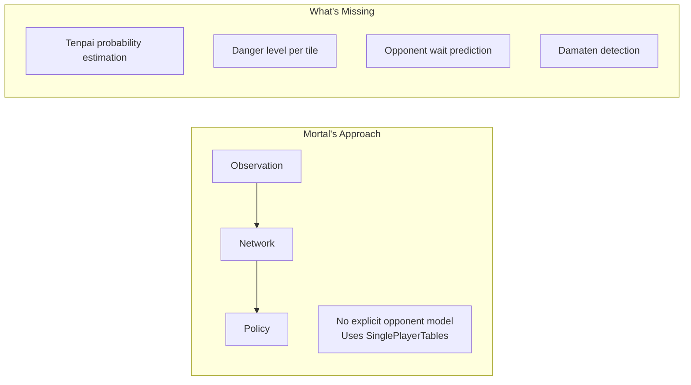
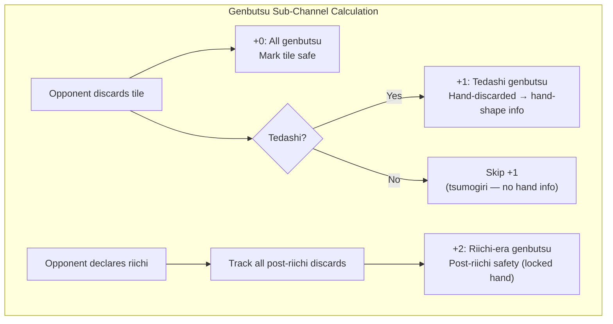
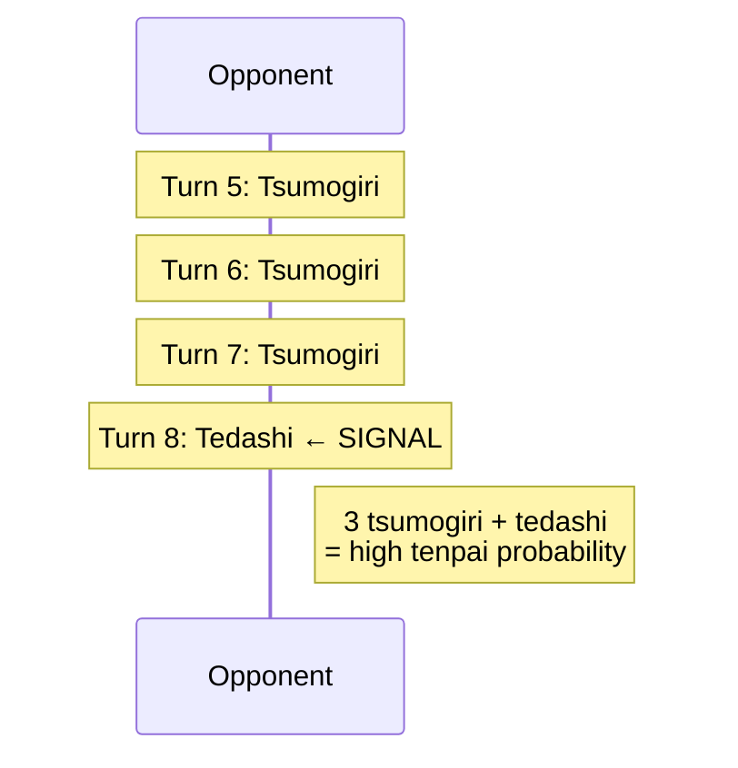
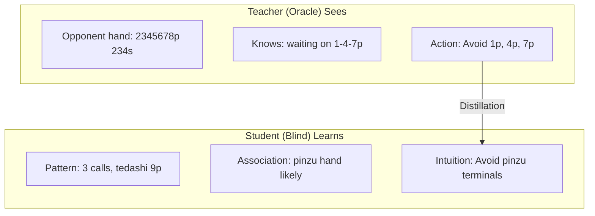

# Hydra Opponent Modeling

Opponent modeling is Hydra's primary differentiator from existing Mahjong AIs. This document covers every aspect of how Hydra reads opponents — from explicit safety plane encoding through auxiliary prediction heads to implicit learning via oracle distillation.

---

## 1. The Problem: Why Current AIs Fail at Opponent Modeling

### Mortal's Blind Spot

Mortal uses `SinglePlayerTables` for EV calculation, assuming no opponent interaction. There are no safety features (suji, kabe, genbutsu) pre-computed, no opponent tenpai estimation, and no aggression or tendency profiling. The network must learn all opponent-relevant patterns implicitly through raw observation channels — and the evidence shows it fails at the hardest cases.



### Evidence from the Community

**Damaten detection failures** are Mortal's most cited weakness in the Japanese mahjong community. Community reports confirm Mortal frequently deals into obvious damaten (silent tenpai) hands because it has no explicit tenpai detection mechanism. The AI relies entirely on explicit signals like riichi declarations and open melds — when an opponent reaches tenpai silently, Mortal has no mechanism to detect the increased danger.

Specific documented issues:

- **GitHub Issue #111** — Overtake score miscalculation; Mortal plays too safe when trailing, missing opportunities to overtake, partly because it cannot read opponent hand danger accurately.
- **GitHub Discussion #102** — Equim-chan (Mortal's creator) confirmed that oracle guiding "didn't bring improvements in practice" and was removed in v3, replaced with a next-rank prediction auxiliary task (implemented as `AuxNet` in `mortal/model.py`; rationale in Discussion #52). This suggests Mortal's architecture may not be structured to benefit from opponent-aware signals.

**Community-identified weaknesses related to opponent reading:**

1. **Early riichi push errors** — Underestimates the threat of early (turn 1–6) riichi, pushing with sub-optimal hands against unknown waits.
2. **Damaten detection failures** — No intent reading for silent tenpai. Relies on explicit signals (riichi, melds). Deals into high-value silent hands.
3. **Coarse placement sensitivity** — Same playstyle regardless of point spread; doesn't adjust aggression based on how dangerous opponents are.
4. **場況 (bakyou) blindness** — Struggles with field status and table flow reading, as noted in Japanese mahjong blogs on Note.com and Reddit r/Mahjong.

### What Hydra Adds

Hydra addresses the opponent modeling gap through four complementary systems:

1. **Explicit Safety Planes** — Encode suji, kabe, and genbutsu directly into the input tensor
2. **Tenpai Predictor Head** — Detect silent tenpai (damaten) from discard patterns
3. **Danger Head** — Predict deal-in probability per tile
4. **Oracle Distillation** — Learn implicit opponent reading through teacher-student training

---

## 2. Safety Planes: Explicit Defensive Encoding

> For the channel-level summary, see [HYDRA_SPEC § Safety Channels](HYDRA_SPEC.md#safety-channels-6183). This section provides the detailed design rationale and encoding logic.

Hydra dedicates 23 input channels (channels 61–83) to safety information — a novel addition absent from Mortal's 1012-channel encoding. These planes pre-compute traditional Japanese mahjong defensive concepts, giving the network structured safety data rather than forcing it to rediscover these patterns implicitly.

> **Quantitative basis:** The 23-channel safety encoding is grounded in mahjong theory (genbutsu, suji, kabe are the foundation of all human defensive play) but the specific channel design (9 genbutsu, 9 suji, 2 kabe, 3 tenpai hints) and encoding choices (suji float values, 3 sub-channels per genbutsu opponent) are based on domain analysis, not empirical ablation. Mortal achieves ~11% deal-in rate without any explicit safety planes, relying on implicit learning from 1012 raw channels. Whether pre-computed safety planes improve over implicit learning is an open empirical question — this is precisely what **Ablation A1** tests (see [ABLATION_PLAN.md § A1](ABLATION_PLAN.md#a1-safety-planes)). The safety plane design will be validated or revised based on A1 results. The conservative channel counts (9+9+2+3=23) were chosen to minimize parameter overhead (~0% increase to backbone) while covering the complete human defensive vocabulary.

### 2.1 Genbutsu (絶対安全牌) — Channels 61–69

**Definition:** Tiles that are 100% safe against a specific riichi player. Any tile discarded by the riichi player after their riichi declaration is genbutsu — they cannot win on a tile they themselves threw after declaring riichi.

**Encoding:** 9 binary channels, 3 per opponent. The 3 channels per opponent encode three semantically distinct safety signals:

| Sub-channel | Content | Encoding |
|-------------|---------|----------|
| +0 | All genbutsu | Binary mask: 1 if tile is 100% safe against this opponent. Union of discard-furiten genbutsu (tile in their river) and riichi-furiten genbutsu (tile discarded by anyone after their riichi, not ron'd). |
| +1 | Tedashi genbutsu | Binary mask: subset of +0 where tile was specifically hand-discarded (tedashi) by this opponent, not tsumogiri. Carries hand-shape information — tedashi implies the opponent evaluated and rejected this tile. |
| +2 | Riichi-era genbutsu | Binary mask: subset of +0 where tile became safe AFTER this opponent declared riichi (any player's post-riichi discard). Only non-zero when opponent is in riichi. Separates pre-riichi safety (mutable hand) from post-riichi safety (locked hand). |

**Calculation:**



**Why 3 channels per opponent, not 1:** While genbutsu is binary (safe or not), the sub-channel decomposition provides the network with pre-computed hand-reading signals. Tedashi genbutsu reveals which tiles the opponent actively rejected from their hand (matagi-suji and sotogawa inferences follow). Riichi-era genbutsu separates the temporal regime where the opponent's hand is locked. This mirrors Mortal v4's 3-channel kawa summary (all discards / tedashi-only / riichi-tile) but pre-computes the safety derivation. No existing mahjong AI pre-computes genbutsu channels — Mortal, Suphx, and Mjx all rely on the network to derive safety from raw discard data. Hydra's explicit encoding is a deliberate advantage.

### 2.2 Suji (筋) — Channels 70–78

**Definition:** Probabilistic safety based on ryanmen (two-sided) wait patterns. When an opponent discards a tile, certain numerically related tiles become safer because common wait patterns involving the discarded tile become less likely.

**Logic:** In ryanmen waits, tiles are linked in 1-4-7, 2-5-8, and 3-6-9 sequences. If a player discards one tile in a sequence, the paired tiles at the opposite end become safer.

**Suji Logic Table:**

| Discarded Tile | Safer Tiles | Reasoning |
|----------------|-------------|-----------|
| 1 or 4 | 7 | No 4-7 ryanmen wait |
| 2 or 5 | 8 | No 5-8 ryanmen wait |
| 3 or 6 | 9 | No 6-9 ryanmen wait |
| 4 or 7 | 1 | No 1-4 ryanmen wait |
| 5 or 8 | 2 | No 2-5 ryanmen wait |
| 6 or 9 | 3 | No 3-6 ryanmen wait |

**Half-suji vs Full-suji:** Half-suji means only one side of the sequence has been discarded. Full-suji means both sides are visible, providing stronger safety.

**Encoding:** 9 float channels, 3 per opponent. Values range from 0.0 to 1.0 representing suji safety coverage — higher values indicate more suji evidence for that tile being safe against that opponent.

**Caveats — Suji is NOT 100% safe:**

Suji only protects against ryanmen (two-sided) waits. Opponents can still win with:

- **Kanchan (嵌張) waits** — Middle-tile waits (e.g., waiting on 5 with 4-6 in hand) bypass suji entirely.
- **Tanki (単騎) waits** — Pair waits on any tile, independent of suji relationships.
- **Suji trap (筋引っ掛け)** — Intentional discard to bait opponents into false safety. For example, cutting 5 then waiting on 2 via a 1-2 kanchan or shanpon.

Suji reduces probability but does not eliminate danger. The network must learn to weigh suji evidence appropriately against other signals.

### 2.3 Kabe (壁) — Channel 79

**Definition:** When all 4 copies of a tile are visible (in discards, melds, or own hand), certain sequence waits through that tile become impossible. This is called kabe (wall) because the tile forms a "wall" blocking wait patterns.

**Kabe Status Table:**

| Visible Copies | Status | Reasoning |
|----------------|--------|-----------|
| 4 copies | Kabe (壁) — No-chance | No ryanmen or kanchan wait can pass through this tile |
| 3 copies | One-chance (ワンチャンス) | Only 1 copy remains; very low probability of being part of a wait |

**Example:** If all 4 copies of 5p are visible, no opponent can have a 3-6p or 4-5p or 5-6p sequence wait. Tiles adjacent to the walled tile become significantly safer.

**Encoding:** Channel 79 is a float mask over 34 tile types, indicating kabe (no-chance) status.

### 2.4 One-Chance (ワンチャンス) — Channel 80

When 3 out of 4 copies of a tile are visible, the remaining single copy makes waits through that tile probabilistically unlikely. This is weaker than full kabe but still provides meaningful safety information.

**Encoding:** Channel 80 is a float mask over 34 tile types, indicating one-chance status.

### 2.5 Tenpai Hints — Channels 81–83

Three binary channels, one per opponent, indicating whether each opponent is likely in tenpai.

| Channel | Content |
|---------|---------|
| 81 | Opponent 1 riichi / high-probability tenpai |
| 82 | Opponent 2 riichi / high-probability tenpai |
| 83 | Opponent 3 riichi / high-probability tenpai |

**Two-phase encoding:**

- **Initially:** Populated from riichi status alone (binary: declared riichi or not).
- **At inference:** Updated with the Tenpai Predictor Head output, enabling damaten detection. When the head predicts high tenpai probability for an opponent who hasn't declared riichi, the corresponding hint channel is activated.

This feedback loop from the auxiliary head back into the input encoding is a key architectural feature — the network's own predictions about opponent state feed back to influence future decisions.

**Feedback loop implementation detail:**

The feedback operates **across sequential decisions within a game**, not within a single forward pass (no double pass required):

1. At decision time *t*, tenpai hint channels (81–83) are set to `max(riichi_status[i], cached_tenpai_pred[i] > 0.5)` for each opponent *i*.
2. The model runs a single forward pass, producing all head outputs including tenpai predictions `[p₁, p₂, p₃]`.
3. The tenpai predictions are cached: `cached_tenpai_pred = [p₁, p₂, p₃]`.
4. At decision time *t+1*, step 1 uses the cached predictions from *t*.

| Parameter | Value | Notes |
|-----------|-------|-------|
| Activation threshold | 0.5 | Binary decision boundary for tenpai hint channels |
| Forward passes per decision | 1 | No double-pass — feedback is across time steps |
| Latency impact | Zero | Tenpai head output is already computed in the main forward pass |

**Training behavior:** During training with oracle/ground-truth tenpai labels, channels 81–83 use the ground-truth tenpai status (not the head's predictions). The feedback loop with cached predictions activates only at inference time. This prevents error accumulation during training while teaching the model to use tenpai hints correctly.

---

## 3. Tenpai Predictor Head

### 3.1 Purpose

Estimate the probability each opponent is in tenpai, with emphasis on detecting damaten (silent tenpai). This is the capability Mortal lacks entirely — the ability to sense when an undeclared opponent has completed their hand.

### 3.2 Architecture

> See [HYDRA_SPEC § Tenpai Head](HYDRA_SPEC.md#tenpai-head) for the canonical architecture specification (GAP → FC(256→64) → FC(64→3) → Sigmoid).

### 3.3 Key Input Features and Signals

The backbone learns to detect tenpai from multiple observable signals:

| Signal | Interpretation |
|--------|----------------|
| Tedashi after tsumogiri streak | Hand changed after a period of no changes → possibly reached tenpai |
| No calls + fast discards | Building a closed hand (menzen), suggesting damaten potential |
| 3+ open melds | Likely tenpai with few tiles remaining in hand |
| Turn count + remaining discards | Late game with few tiles left = higher baseline tenpai probability |
| Discard patterns | Specific tile sequences suggest particular hand shapes and readiness |

### 3.4 Tedashi Pattern Detection

The tedashi (手出し) vs tsumogiri (ツモ切り) distinction is the primary signal for damaten detection:

- **Tedashi:** A discard chosen from the player's hand (not the just-drawn tile). Indicates the player actively changed their hand composition.
- **Tsumogiri:** Discarding the tile just drawn. Indicates the hand is unchanged — the player is either waiting (tenpai) or stuck.



**The critical pattern:** Three or more consecutive tsumogiri (hand unchanged, player is waiting or stuck) followed by a sudden tedashi (active hand change) strongly suggests the player just completed their hand — they drew a tile that improved their hand and swapped out a different tile to reach tenpai.

This pattern is encoded in the discard channels with an explicit tedashi flag (sub-channel offset +1 per opponent in channels 11–22) and temporal weighting using exponential decay:

`weight = exp(-0.2 × (max_turn - discard_turn))`

Recent discards are weighted higher, making the timing of the tsumogiri-to-tedashi transition more prominent to the network.

### 3.5 Training Signal

**Ground-truth labels (phase-specific):**

- **Phase 1 (Supervised):** Tenpai labels are reconstructed from game logs. MJAI records contain all 4 players' starting hands in the `start_kyoku` event. By replaying each draw, discard, and call, every opponent's hand is reconstructible at every decision point. Computing shanten=0 gives exact tenpai status. These are ground-truth labels available **without oracle mode**.
- **Phase 2–3 (RL):** The oracle teacher network sees opponent hands directly (205 oracle channels include opponent shanten and waits). Tenpai labels are trivially available from the teacher's observation.

In both cases, the label is binary per opponent: 1 if tenpai, 0 otherwise.

**Loss function:** Binary Cross-Entropy per opponent:

`L_tenpai = -Σ [y_i × log(p_i) + (1 - y_i) × log(1 - p_i)]`

where `y_i` is the ground-truth tenpai status and `p_i` is the predicted probability for opponent `i`.

**Loss weight in total training loss:** 0.05 (balances against the primary policy and value losses).

### 3.6 Integration with Other Heads

The Tenpai Head output feeds into three downstream systems:

1. **Safety plane channels 81–83** — High tenpai probability activates the tenpai hint channels, giving the backbone richer input on subsequent forward passes during multi-step reasoning.
2. **Danger Head** — Higher tenpai probability for an opponent increases the baseline danger level for all tiles. The danger head uses tenpai predictions as contextual input.
3. **Policy Head** — When tenpai is detected, the policy shifts toward risk-adjusted actions, favoring safer discards and defensive play.

---

## 4. Danger Head

### 4.1 Purpose

Estimate the deal-in probability for each possible discard tile. Given the current game state, the Danger Head answers: "If I discard this tile right now, what is the probability that an opponent wins off it?"

### 4.2 Architecture and Design Rationale

> See [HYDRA_SPEC § Danger Head](HYDRA_SPEC.md#danger-head) for the canonical architecture specification (1×1 Conv1D(256→3) → Sigmoid, output [B × 3 × 34]).

Per-opponent granularity (3×34) is essential for mawashi-uchi (回し打ち) — the strategy of dodging one specific dangerous opponent while continuing to push against others. An aggregate 1×34 output would discard the per-opponent information that the backbone already encodes (genbutsu channels 61–69, suji channels 70–78, tenpai hints 81–83 are all per-opponent), creating an information bottleneck.

**Why 3×34 over 1×34:**
- A tile can be safe against Player A (genbutsu) but deadly against Player B — the aggregate signal is ambiguous
- Score-aware defense: dealing into 4th-place player is strategically different from dealing into 1st-place
- Parameter cost is negligible: Conv1d(256→3) = 771 params vs Conv1d(256→1) = 257 params (+0.003% of total model)
- Training labels are naturally per-opponent: each deal-in event identifies which opponent won
- Mortal encodes all opponent info per-player (kawa, riichi, scores) — the output should match

### 4.3 Output Interpretation

The output `[B × 3 × 34]` gives per-opponent, per-tile deal-in probabilities:

| Output Range | Interpretation |
|--------------|----------------|
| p < 0.05 | Safe tile against this opponent — low risk of deal-in |
| 0.05 < p < 0.15 | Moderate risk — consider hand value and game state |
| p > 0.15 | Dangerous — strong chance of dealing into this opponent |

**Aggregation options at inference:**
- `max(dim=opponent)` → worst-case danger per tile (conservative)
- `weighted_sum(danger × tenpai_prob)` → expected danger weighted by tenpai probability (balanced)
- Per-opponent inspection → enables mawashi-uchi: dodge opponent A, push against opponent C

### 4.4 Training Signal

**Labels:** Per-opponent binary — for each discard at each game state, a `[3]` vector indicates which opponent(s) won off that tile. Example: `[0, 1, 0]` means dealt into opponent 2. Most labels are `[0, 0, 0]` (no deal-in). This per-opponent labeling comes for free from game logs.

**Class imbalance handling:** Deal-ins are rare events, occurring in roughly 10–15% of hands. Unweighted training would bias the head toward always predicting "safe."

**Loss function:** Focal Binary Cross-Entropy (Lin et al., 2017), which subsumes class weighting and hard-example mining:

```
L_danger = -Σ [α_t × (1 - p_t)^γ × log(p_t)]
```

Where `p_t = p` if y=1, `p_t = 1-p` if y=0, and `α_t = α` if y=1, `α_t = 1-α` if y=0.

**Hyperparameters:**

| Parameter | Value | Tuning Range | Notes |
|-----------|-------|-------------|-------|
| α (positive class weight) | 0.25 | [0.15, 0.5] | From Lin et al. best result on extreme imbalance |
| γ (focusing parameter) | 2.0 | [1.0, 3.0] | Crushes loss on easy negatives; γ=0 recovers standard BCE |

**Why focal loss over weighted BCE:**
- Deal-in events are ~1-3% of all discard decisions. Weighted BCE with w=10 (sqrt-inverse-frequency) upweights ALL positives equally, including easy ones the model already gets right.
- Focal loss with γ=2.0 naturally focuses gradient on hard examples (tiles the model is uncertain about), while easy negatives contribute near-zero gradient.
- Critical for auxiliary heads: an overly aggressive pos_weight (w>20) distorts the shared backbone's representations, hurting the primary policy head. Focal loss avoids this by construction.
- Fallback if focal loss is too complex to implement initially: use `BCEWithLogitsLoss(pos_weight=10.0)`, tune range [5, 20].

### 4.5 Risk-Adjusted Action Selection

During inference, the policy head and danger head outputs are combined to produce risk-adjusted decisions. The per-opponent danger probabilities are first aggregated (weighted by tenpai probability):

`p_danger(a) = Σ_i [p_danger_i(a) × p_tenpai(i)]`

Then combined with the policy:

`score(a) = log π(a) - λ × log(p_danger(a))`

`a* = argmax score(a)`

where:
- `π(a)` is the policy probability for action `a`
- `p_danger(a)` is the danger head's deal-in probability for action `a`
- `λ` is the defense/offense balance parameter

> **Formula reconciliation:** Three risk-adjusted formulations exist across the docs. They serve different purposes:
>
> | Name | Formula | Context | Where |
> |------|---------|---------|-------|
> | **Formula A** (RCPO training) | `A_combined = (A^R(s,a) - λ × A^C(s,a)) / (1 + λ)` | PPO advantage during training | [TRAINING § PID-Lagrangian](TRAINING.md#pid-lagrangian-λ-auto-tuning) |
> | **Formula B** (logit masking) | `safe_logits = policy_logits - λ × danger_logits` | Canonical inference formula | [TRAINING § Inference Behavior](TRAINING.md#inference-behavior) |
> | **Formula C** (log-probability) | `score(a) = log π(a) - λ × log(p_danger(a))` | Equivalent to B for action selection | This section |
>
> Formulas B and C are equivalent for action selection: `log π(a)` differs from `policy_logits[a]` only by the log-sum-exp constant (which cancels in argmax), and `log(p_danger(a)) = log(sigmoid(danger_logits[a]))` is a monotonic transform of `danger_logits[a]`. **Formula B is the canonical inference implementation** — it operates directly on raw logits, avoiding numerically unnecessary softmax/sigmoid computations.

**Dynamic λ via PID-Lagrangian (auto-tuned):**

> The PID-Lagrangian controller specification (update rule, gains, λ range, combined advantage formula) is defined in [TRAINING § PID-Lagrangian λ Auto-Tuning](TRAINING.md#pid-lagrangian-λ-auto-tuning).

**Why PID over hand-crafted λ:**
- Mortal and Suphx use NO explicit λ — risk is implicit in Q-values/reward. This works but produces documented defensive weaknesses.
- A hand-crafted λ(s) function requires tuning dozens of thresholds (score gaps, hand values, tenpai counts, round number) with fragile interactions.
- PID-Lagrangian auto-tunes λ to satisfy the deal-in constraint, while the cost advantage A^C(s,a) is already state-dependent — capturing all the game context that a hand-crafted formula would need.
- The RCPO normalization (dividing by 1+λ) is critical — without it, the policy objective collapses to pure safety minimization when λ is large.

**Oshi-hiki calibration reference:** Human expert push/fold crossover occurs at W:D ≈ 0.88 for 2-han bad wait vs non-dealer riichi (from SMS / Shin Kagaku suru Mahjong). The PID-tuned λ should produce behavior consistent with these thresholds when evaluated on expert game logs.

---

## 5. Oracle Distillation for Opponent Reading

Beyond the explicit auxiliary heads, oracle distillation provides a mechanism for the network to learn implicit opponent reading — patterns too subtle or complex for hand-crafted safety planes.

### 5.1 Teacher-Student Framework



### 5.2 How It Works

> See [TRAINING § Phase 2: Oracle Distillation RL](TRAINING.md#phase-2-oracle-distillation-rl) for the full teacher-student architecture, oracle encoding specification, and distillation loss formulation.

The teacher sees everything (opponent hands, wall composition, ura-dora) and is expected to converge significantly faster than a blind agent (Suphx reports "much faster" convergence qualitatively but provides no quantitative ratio; arXiv:2003.13590, Section 3.3). The student trains with a combined PPO + KL divergence objective, developing "intuition" by associating observable patterns with the teacher's privileged decisions.

**Feature dropout schedule:** To prevent the student from becoming dependent on the KL signal and to encourage genuine pattern learning, the teacher's access to hidden information is gradually reduced via group-level deterministic scaling on the two oracle feature groups (opponent hands and wall/dead wall).

> See [TRAINING § Feature Dropout Schedule](TRAINING.md#feature-dropout-schedule) for the canonical mask values and KL weight decay per training stage.

As the teacher's advantage shrinks, the student must rely more on its own learned patterns rather than imitating a privileged teacher.

### 5.3 What the Student Learns

Through distillation, the student acquires implicit abilities that no explicit encoding can capture:

- **Suit tendency reading:** When an opponent calls multiple pinzu melds, the student learns to avoid pinzu tiles — mimicking the teacher who can see the opponent holds a pinzu-heavy hand.
- **Value estimation:** The teacher avoids dangerous tiles more aggressively against high-value hands. The student learns to associate observable signals (dora pon, honitsu-suggestive discards) with elevated danger.
- **Timing intuition:** Subtle correlations between discard order, hesitation-like patterns (tedashi after long tsumogiri), and actual tenpai status become encoded in the student's features.

This implicit learning complements the explicit safety planes and auxiliary heads, covering edge cases and complex multi-factor situations that rule-based encoding cannot handle.

---

## 6. Deal-in Rate Heuristics

The following multipliers, sourced from the killer_mortal_gui project, provide empirically-derived estimates for deal-in probability based on wait type and tile properties. These serve as calibration targets and training signal priors for the Danger Head.

### 6.1 Base Wait Type Multipliers

| Wait Type | Multiplier | Notes |
|-----------|------------|-------|
| Ryanmen (両面) | 3.5× | Most common riichi wait; two-sided, high frequency |
| Kanchan (嵌張) | 0.21× | Middle-tile wait; low frequency due to single tile acceptance |
| Kanchan (suji trap) | 2.6× | Intentional bait — e.g., cutting 5 to wait on 2; deceptively common |
| Penchan (辺張) | 1.0× | Edge wait; baseline multiplier |
| Honor tanki/shanpon | 1.7× | Honor pair or double-pair wait; higher likelihood due to honor tile retention |

### 6.2 Modifier Multipliers

These multiply on top of the base wait type multiplier:

| Condition | Multiplier | Reasoning |
|-----------|------------|-----------|
| Dora tile | 1.2× | Players retain dora longer; higher chance it's part of their wait |
| Ura-suji | 1.3× | The "inside" suji relationship; slightly more dangerous than neutral |
| Matagi suji (early discard) | 0.6× | Tile straddling a discard from early game; less likely to be a current wait |
| Matagi suji (riichi discard) | 1.2× | Tile straddling the riichi declaration discard; potentially a trap |
| Red 5 discarded | 0.14× | Discarding a red 5 strongly suggests the player doesn't need that suit's middle tiles |

---

## 7. Comparison to Existing Approaches

> See [HYDRA_SPEC § Key Differentiators from Mortal](HYDRA_SPEC.md#key-differentiators-from-mortal) for the full feature comparison table.

### Key Differentiator

Mortal and Suphx both rely on the network to implicitly learn defensive concepts from raw game data. Hydra pre-computes and explicitly encodes these concepts, giving the network a structured foundation. The auxiliary heads (tenpai and danger) then provide focused learning targets for opponent-aware skills, while oracle distillation adds the implicit "intuition" layer that captures patterns beyond what explicit encoding can represent.

---

## 8. Expected Improvements

### 8.1 Per-Phase Milestone Targets

> See [TRAINING § Implementation Roadmap](TRAINING.md#implementation-roadmap) for the full per-phase milestone targets and transition gate criteria.

### 8.2 Final Performance Targets

| Metric | Mortal Baseline | Hydra Target | Basis for Target |
|--------|-----------------|--------------|------------------|
| Deal-in rate (vs riichi) | ~12% | <10% | Explicit genbutsu/suji planes + danger head |
| Deal-in rate (vs damaten) | ~18% | <12% | Tenpai predictor head + tedashi pattern detection |
| Tenpai detection accuracy | N/A (no mechanism) | >75% | Dedicated auxiliary head with oracle-labeled training |
| Dangerous tile avoidance | Implicit (Q-value side effect) | Explicit decision (danger head output) | Per-tile danger probability enables principled risk-reward tradeoff |
| Overall deal-in rate | 11.3% (Tenhou stats) | <10% | Combined safety encoding + explicit heads |

These targets are conservative — the explicit encoding and dedicated heads should provide significant uplift even before oracle distillation adds its implicit opponent reading capabilities. The real gains from distillation may emerge in edge cases: unusual wait shapes, deceptive discard patterns, and complex multi-opponent threat scenarios that cannot be captured by suji/kabe/genbutsu alone.
