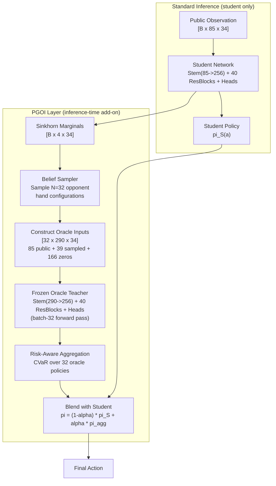

# Posterior-Guided Oracle Inference (PGOI)

An inference-time search module that reuses Hydra's Phase 2 oracle teacher to improve decision quality beyond what the distilled student achieves alone. PGOI is a form of neural Perfect Information Monte Carlo (PIMC) adapted for 4-player Riichi Mahjong.

---

## Related Documents

- [HYDRA_SPEC.md](HYDRA_SPEC.md) -- Architecture, oracle teacher stem difference, inference latency targets
- [TRAINING.md](TRAINING.md) -- Phase 2 oracle distillation, 205-channel oracle encoding, feature dropout schedule
- [OPPONENT_MODELING.md](OPPONENT_MODELING.md) -- Sinkhorn tile allocation (belief marginals used by PGOI), danger head, tenpai head
- [INFRASTRUCTURE.md](INFRASTRUCTURE.md) -- Phase 2->3 transition (where oracle is currently discarded), VRAM budget, ONNX inference pipeline
- [CHECKPOINTING.md](CHECKPOINTING.md) -- `teacher_state_dict` saved in Phase 2 checkpoints (recovery path for oracle)

---

## 1. Motivation

### The Oracle Gap

During Phase 2, Hydra trains an oracle teacher that sees all hidden information (opponent hands, wall draw order, dora/ura indicators) via 205 additional input channels. The oracle plays near-perfectly because it has complete knowledge. Distillation compresses this into the blind student -- but compression is lossy. The student's policy is an amortized approximation of the oracle's Bayesian-optimal decisions, limited by finite network capacity and finite training data.

The gap between oracle and student performance is the *distillation gap*. Suphx reported this gap at roughly 0.6 dan (oracle 8.29 vs blind 7.66 -- note these are Suphx-specific numbers, not directly transferable to Hydra). The true gap depends on architecture capacity, training quality, and game complexity.

**Currently, the oracle is discarded at the Phase 2->3 transition** ([INFRASTRUCTURE.md line 727](INFRASTRUCTURE.md), [CHECKPOINTING.md line 238](CHECKPOINTING.md)). PGOI proposes keeping it.

### Why Not Just Train a Better Student?

Larger networks help, but the distillation gap is not purely a capacity problem. Some decisions are fundamentally *information-dependent* -- the optimal action changes depending on hidden state in ways that cannot be captured by any fixed function of partial observations. For these decisions, explicit reasoning about hidden state (search) is necessary.

Example: push/fold against a silent tenpai opponent. The student must decide from public info alone. If the opponent has a cheap hand (1000 pts), pushing is correct. If the opponent has a haneman (12000 pts), folding is correct. The student averages over these possibilities implicitly. PGOI samples plausible opponent hands, asks the oracle what to do in each case, and aggregates -- giving an explicitly reasoned decision.

### Prior Art

PGOI is a variant of **Perfect Information Monte Carlo (PIMC)**, a technique used in Bridge AI since the late 1990s (Ginsberg, GIB, 2001; Levy, 1989). The standard PIMC algorithm:

1. Sample N complete game states consistent with observations (determinization)
2. Solve each determinized game with a perfect-information solver
3. Aggregate solutions across samples

PIMC has known theoretical weaknesses (strategy fusion -- Frank & Basin 1998) but strong practical track record in card games. Bridge AIs routinely use 50-200 determinizations per decision.

**PGOI differs from classical PIMC in two ways:**
1. **Learned belief sampling** -- uses Sinkhorn marginals to guide sampling toward plausible hidden states, rather than uniform random determinization.
2. **Neural oracle as solver** -- uses the pre-trained oracle teacher (a neural network) instead of a game-theoretic solver. The oracle is orders of magnitude faster and already trained on the actual imperfect-info game.

**Closest published work:** GenBR (Li et al., IJCAI 2025, DeepMind) combines a learned generative model with MCTS for imperfect-info games. Tested on Deal-or-No-Deal (bargaining) and small card games. Uses a plain MLP classifier for belief sampling. PGOI differs by: (a) reusing an existing oracle from distillation training, (b) skipping MCTS entirely (just oracle forward passes), (c) targeting 4-player mahjong at scale.

> **Novelty note:** No published mahjong AI uses PIMC, neural or otherwise. No published work in any domain reuses the oracle teacher from distillation training as an inference-time solver via belief-guided queries. The intersection of {neural PIMC} x {oracle reuse} x {4-player mahjong} is empty in the literature as of February 2026.

---

## 2. Architecture

### Overview

PGOI adds an inference-time layer between the student's forward pass and the final action selection. It does not modify training. It can be toggled on or off with zero code changes to the base system.



### Component 1: Oracle Preservation

**Change:** Do not discard the oracle teacher at the Phase 2->3 transition.

The teacher checkpoint (`teacher_state_dict`) is already saved in Phase 2 checkpoints ([CHECKPOINTING.md line 40](CHECKPOINTING.md)). At inference time, load the teacher stem weights into a second copy of the network with `Conv1d(290, 256, 3)`. All 40 ResBlock weights are shared with the student -- only the stem layer is loaded from the teacher checkpoint.

| Property | Student | Oracle (frozen) |
|-|-|-|
| Stem | `Conv1d(85, 256, 3)` | `Conv1d(290, 256, 3)` |
| Backbone | 40x SE-ResBlock, 256ch | **Identical weights** (shared) |
| Heads | Policy + Value + GRP + Tenpai + Danger | **Identical weights** (shared) |
| Parameters | ~16.5M | ~16.7M (+157K stem) |
| Memory (bf16) | ~33 MB | +33 MB (but backbone shared, actual overhead ~0.6 MB for stem only) |
| Precision | FP16 | FP16 (frozen, no gradients) |

> **Implementation note:** If backbone weights are literally shared in memory (both stem outputs feed the same ResBlock parameters), the actual VRAM overhead is only the stem difference (~0.6 MB) plus the additional activations for batch-32 (~6 MB). Total PGOI memory overhead: ~7 MB. Negligible.

### Component 2: Belief Sampler (PBN)

The Posterior Belief Network generates plausible opponent hand configurations consistent with observable information. Two variants, in order of implementation priority:

#### Variant A: Sinkhorn-Based Sampling (MVP -- no new model)

Uses the existing Sinkhorn tile allocation head's output `[B x 4 x 34]` as marginal tile probabilities. Samples from these marginals autoregressively with dynamic masking to guarantee valid configurations.

```python
def sample_opponent_hands_sinkhorn(sinkhorn_marginals, zone_sizes, remaining_counts, n_samples=32):
    """
    Sample n_samples valid opponent hand configurations from Sinkhorn marginals.
    
    Args:
        sinkhorn_marginals: [4 x 34] expected tile counts per zone per tile type
        zone_sizes: [4] number of concealed tiles per zone
        remaining_counts: [34] remaining unseen count per tile type
        n_samples: number of independent samples to generate
    Returns:
        [n_samples x 3 x 34] tile count tensor (one-hot summed) per opponent
    """
    batch_remaining = remaining_counts.unsqueeze(0).expand(n_samples, -1).clone()  # [N x 34]
    result = torch.zeros(n_samples, 3, 34)  # opponents only (zones 0-2)
    
    for zone in range(3):  # three opponents
        for slot in range(zone_sizes[zone]):
            # Probability proportional to Sinkhorn marginal * remaining availability
            probs = sinkhorn_marginals[zone] * (batch_remaining > 0).float()  # [N x 34]
            probs = probs / probs.sum(dim=-1, keepdim=True).clamp(min=1e-8)
            tile = torch.multinomial(probs, 1).squeeze(-1)  # [N]
            result[torch.arange(n_samples), zone, tile] += 1
            batch_remaining[torch.arange(n_samples), tile] -= 1
    
    return result  # [N x 3 x 34]
```

**Properties:**
- 100% valid samples by construction (dynamic masking prevents over-allocation)
- No new parameters or training required
- Sample quality limited to marginal structure (no inter-opponent correlations)
- **[estimated]** Latency: ~0.5 ms for 32 samples (sequential tile assignment, batched across samples). The inner loop is ~39 iterations (3 opponents x ~13 tiles each) of a simple tensor operation. GPU-bound on the multinomial sampling.

#### Variant B: Learned Autoregressive PBN (upgrade if Variant A is insufficient)

A small neural network that conditions each tile assignment on the full game state AND previously assigned tiles. Captures joint structure that marginals miss.

| Property | Specification |
|-|-|
| Architecture | MADE (Masked Autoregressive Density Estimator) or small Transformer |
| Parameters | ~1-3M (separate from main network) |
| Input | Public observation [85 x 34] + partial assignment so far |
| Output | Per-step conditional distribution over 34 tile types |
| Constraint enforcement | Dynamic logit masking (identical to Variant A) |
| Training data | Millions of games with known true opponent hands (Phase 1-2 data) |
| Training loss | Cross-entropy on true tile assignments |
| Training cost | **[estimated]** ~24-48 GPU-hours (standard supervised learning) |
| Latency | **[estimated]** ~2-4 ms for 32 batched samples |

**Decision criterion for upgrade:** If Variant A's oracle agreement rate (see Evaluation) is below 70%, the marginal-only sampling is too noisy and Variant B is warranted.

### Component 3: Oracle Input Construction

The oracle expects 290 input channels: 85 public + 205 oracle-specific. PGOI must construct the 205 oracle channels from sampled beliefs.

#### v1 Scope: Opponent Hands Only (39 of 205 channels)

| Oracle Channel Group | Channels | Source in PGOI | v1 Status |
|-|-|-|-|
| Opponent hands (3 x 13ch) | 39 | Sampled from PBN | **Active** |
| Wall draw order (69 tiles x 2ch) | 138 | Unknown | Zero-filled |
| Rinshan tiles (4 x 2ch) | 8 | Unknown | Zero-filled |
| Dora indicators (5 x 2ch) | 10 | Partially known (visible indicators) | Partial |
| Ura-dora indicators (5 x 2ch) | 10 | Unknown | Zero-filled |

**Rationale for zero-filling wall/rinshan/ura:** The oracle's defensive decisions ("is this tile dangerous?") are driven primarily by opponent hand knowledge (39ch). Wall draw order matters for offensive decisions ("what will I draw next?") but the student already handles offense adequately. The expected value of PGOI comes from improved defensive play -- mahjong AI's primary weakness.

> **Future upgrade path:** If v1 shows gains, v2 could sample wall draw order by shuffling remaining tiles randomly (uniform draw order given remaining pool). This adds ~0.1 ms per sample and provides the oracle with realistic draw expectations. Ura-dora can be sampled similarly (uniform from remaining tiles beneath dora indicators).

### Component 4: Risk-Aware Aggregation

The 32 oracle forward passes produce 32 policy distributions `[32 x 46]`. Aggregation must handle the fact that different hallucinated worlds may recommend different actions.

**Step 1: Compute per-action value estimates from oracle value heads.**

For each sample n and each legal action a:
```
V_oracle(a, n) = oracle_value_head output given sample n, assuming action a is taken
```

Since running the oracle for every action is expensive, approximate using policy logits:
```
score(a) = mean_n(oracle_policy_logits[n][a])  # simple average
```

**Step 2: Risk-aware scoring via CVaR.**

For defensive decisions, worst-case matters more than average-case. Use CVaR (Conditional Value at Risk) over samples:
```
cvar_score(a) = mean of bottom k oracle policy logits for action a
where k = ceil(alpha * N), alpha = 0.2 (focus on worst 20% of hallucinated worlds)
```

This ensures actions are scored by their worst-case oracle recommendation, not just average. An action the oracle recommends in EVERY hallucinated world is robustly good regardless of hidden state. An action the oracle only recommends in SOME worlds is information-dependent and risky.

**Step 3: Blend with student policy.**

```
pi_final(a) = (1 - beta) * pi_student(a) + beta * softmax(cvar_score(a))
```

**[estimated -- requires tuning]** beta controls how much PGOI overrides the student:

| Student Entropy H(pi_S) | beta | Behavior |
|-|-|-|
| Low (< 0.5 nats) | 0.0 | Student is confident -- trust it, skip oracle overhead |
| Medium (0.5 - 1.5 nats) | 0.3 | Partial oracle guidance |
| High (> 1.5 nats) | 0.6 | Student uncertain -- lean on oracle |

The entropy-gated beta provides **adaptive compute**: easy decisions skip the oracle entirely (zero latency overhead), hard decisions get full oracle consultation. This mirrors the test-time compute scaling principle -- spend more inference resources on harder problems.

> **Safety property:** With beta in [0, 0.6], the student policy always contributes at least 40% of the final decision. PGOI cannot produce catastrophically different play from the student. If the PBN generates garbage samples, the oracle gives noisy advice, and the student's contribution dominates.

---

## 3. Latency Budget

### Per-Component Estimates

**[estimated -- all latency numbers are projections based on architecture specs and batch-inference benchmarks in [HYDRA_SPEC.md](HYDRA_SPEC.md) and [INFRASTRUCTURE.md](INFRASTRUCTURE.md). Actual numbers require benchmarking once the model exists.]**

| Component | RTX 4090 | RTX 3070 | Notes |
|-|-|-|-|
| Student forward pass | 3-5 ms | 5-8 ms | Baseline cost (always paid) |
| Sinkhorn marginals | included | included | Already computed as part of student forward pass |
| PBN Variant A (32 samples) | ~0.5 ms | ~0.5 ms | Tensor ops, not compute-bound |
| Construct 32 oracle inputs | ~0.1 ms | ~0.1 ms | Concatenation + zero-fill |
| Oracle forward pass (batch-32) | ~1-2 ms | ~3-5 ms | Same architecture as student, frozen FP16 |
| CVaR aggregation + blending | <0.1 ms | <0.1 ms | Simple arithmetic |
| **Total (PGOI active)** | **~5-8 ms** | **~9-14 ms** | |
| **Total (PGOI skipped, easy decision)** | **~3-5 ms** | **~5-8 ms** | Same as student-only |

| Budget | Limit |
|-|-|
| Design target | <15 ms ([HYDRA_SPEC.md](HYDRA_SPEC.md)) |
| Hard limit (online play) | <50 ms ([HYDRA_SPEC.md](HYDRA_SPEC.md)) |
| PGOI on RTX 4090 | ~5-8 ms | Comfortably under 15 ms target |
| PGOI on RTX 3070 | ~9-14 ms | Tight on 15 ms, comfortable under 50 ms |

### Adaptive Compute Savings

With entropy-gated beta, PGOI is skipped entirely on easy decisions (low student entropy). In typical mahjong play, **[estimated]** ~60-70% of decisions are "easy" (clear discard from hand shape, obvious fold after riichi). This means PGOI activates on ~30-40% of decisions, reducing average per-decision latency to ~4-7 ms on RTX 4090.

### Competing Inference-Time Modules

PGOI shares the latency budget with other planned inference-time modules:

| Module | Latency | Overlap with PGOI |
|-|-|-|
| CRC (Conformal Risk Control) | ~0.1 ms | No overlap -- CRC operates on student output |
| Sinkhorn projection | ~0.01 ms | No overlap -- PGOI consumes Sinkhorn output |
| Tenpai hint feedback loop | ~0.1 ms | No overlap -- runs before PGOI |
| RSA deception (Phase 3) | 0 ms at inference | No overlap -- training-only module |

All modules fit within budget. No conflicts.

---

## 4. Known Risks and Limitations

### Risk 1: Strategy Fusion (MEDIUM -- theoretical, mitigated in practice)

**Problem:** Averaging oracle decisions across determinized worlds can produce exploitable play. In theory, the optimal action may depend on hidden information in ways that averaging destroys (Frank & Basin 1998). Example: if action A is optimal when opponent has hand X, and action B is optimal when opponent has hand Y, averaging might select action C (safe in both but optimal in neither).

**Mitigation factors for mahjong:**
- Long et al. (2010) showed PIMC works well when payoffs are "smooth" (small hidden-state changes cause small value changes). Mahjong defensive decisions satisfy this -- a tile that is safe against most likely opponent hands is generally safe.
- The oracle outputs **soft probability distributions**, not deterministic decisions. Averaging soft distributions preserves mixed-strategy structure better than averaging binary optimal actions.
- The **student-blending safety floor** (beta <= 0.6) prevents PGOI from deviating catastrophically from the student's information-theoretically sound policy.

**What strategy fusion cannot be fixed by:** No amount of engineering resolves the fundamental issue that PIMC cannot handle information-gathering actions (actions taken to reveal hidden state, like probing discards). Mahjong has few pure information-gathering actions -- most discards serve hand-building or defensive purposes simultaneously. This limits the practical impact of strategy fusion.

**Measurable:** Compare PGOI action selections to oracle-given-true-state selections on held-out games. If agreement > 80%, strategy fusion is negligible for the observed game distribution.

### Risk 2: PBN Sample Quality (HIGH -- the central bet)

**Problem:** If the PBN generates implausible opponent hands, the oracle receives garbage inputs and produces garbage advice. The student-blending safety floor limits damage but also limits gains.

**Dependency:** Variant A (Sinkhorn-based) depends entirely on Sinkhorn marginal quality. If the Sinkhorn head is poorly calibrated (predicts 2.0 copies of 5p for an opponent who actually has 0), samples will be systematically wrong. This means **PGOI quality is bottlenecked by the Sinkhorn head**, which is itself an extended head gated by ablation results ([ABLATION_PLAN.md](ABLATION_PLAN.md)).

**Mitigation:** Measure Sinkhorn calibration independently before deploying PGOI. Metric: mean absolute error of Sinkhorn marginals vs true tile counts on held-out games. If MAE < 0.3 tiles per slot, marginals are usable for sampling.

### Risk 3: Zero-Filled Wall Channels (LOW -- graceful degradation)

**Problem:** The oracle expects 138 channels of wall draw order. PGOI v1 zero-fills these. The oracle's offensive advice ("push for tsumo because your next draw completes your hand") will be meaningless. Only defensive advice ("fold, opponent has a dangerous hand") will be reliable.

**Mitigation:** This is by design. The student already handles offense adequately. PGOI's value proposition is improved defense -- the primary weakness of mahjong AIs. If offensive oracle advice is needed, v2 can sample wall order by shuffling remaining tiles.

### Risk 4: Interaction with CRC Layer (LOW -- architecturally independent)

**Problem:** Both PGOI and CRC ([TRAINING.md S 5.2](TRAINING.md)) modify the student's action distribution at inference time. Potential for interference.

**Resolution:** PGOI operates on policy logits (blending oracle advice). CRC operates on action masks (removing statistically dangerous tiles). They compose naturally: PGOI adjusts preferences, CRC enforces hard safety constraints. Order: PGOI blending first, then CRC masking. No interaction issues.

---

## 5. Implementation Plan

### Prerequisites

| Prerequisite | Status | Notes |
|-|-|-|
| Phase 2 complete (oracle trained) | Required | Oracle must exist and be performant |
| Sinkhorn head trained and validated | Required for Variant A | Must show reasonable calibration (MAE < 0.3) |
| Student distillation complete | Required | Student must be the baseline to compare against |
| Evaluation infrastructure | Required | Need 10K+ game evaluation pipeline |

### Implementation Steps

| Step | Effort | Description |
|-|-|-|
| 1. Preserve oracle checkpoint | 1 day | Change Phase 2->3 transition to NOT discard teacher_state_dict |
| 2. Oracle loading utility | 1-2 days | Load frozen oracle alongside student, sharing backbone weights |
| 3. Sinkhorn-based hand sampler | 2-3 days | Implement Variant A sampling with dynamic masking |
| 4. Oracle input construction | 1-2 days | Build 290ch input tensor from 85 public + 39 sampled + 166 zeros |
| 5. Aggregation + blending | 1-2 days | CVaR scoring + entropy-gated student blending |
| 6. Adaptive gating | 1 day | Entropy threshold for skipping oracle on easy decisions |
| 7. Evaluation | 1-2 weeks | A/B test PGOI vs student-only across 10K+ games |
| **Total** | **~2-3 weeks** | Post-Phase 2 add-on. No training changes. |

### Ablation Plan

| Experiment | What it tests | Success criterion |
|-|-|-|
| P1: PGOI-Uniform | Uniform random hand sampling (no Sinkhorn guidance) | Any improvement over student-only = oracle reuse concept works |
| P2: PGOI-Sinkhorn | Sinkhorn-guided sampling (Variant A) | Improvement over P1 = belief quality matters |
| P3: PGOI-N sweep | Vary N from 4 to 128 | Identify diminishing returns point |
| P4: PGOI-Beta sweep | Vary max beta from 0.2 to 0.8 | Find optimal student/oracle blend |
| P5: PGOI-CVaR | CVaR (alpha=0.2) vs simple averaging | CVaR improves 4th-avoidance rate |
| P6: PGOI-Adaptive | Entropy-gated vs always-on | Confirm negligible quality loss with latency savings |

---

## 6. Evaluation Metrics

| Metric | How to measure | What it tells you |
|-|-|-|
| Dan-level performance | 10K+ games vs reference opponents | Overall playing strength gain from PGOI |
| Oracle agreement rate | Compare PGOI action to oracle-given-true-state action on held-out games | Upper bound: how close PGOI gets to oracle play |
| Strategy fusion rate | Fraction of decisions where PGOI picks an action the oracle would NOT pick given any sampled world | How much averaging hurts |
| Defensive deal-in rate | Deal-in percentage with/without PGOI | Primary target metric |
| 4th place avoidance | 4th placement rate with/without PGOI | Secondary target metric |
| Latency distribution | P50/P95/P99 decision time | Confirm latency budget compliance |
| Sinkhorn MAE | Mean abs error of Sinkhorn marginals on held-out data | PBN quality prerequisite check |

### Expected Impact

> **[estimated -- no empirical basis, pure projection]** These targets are speculative and based on analogy to Bridge AI PIMC gains and the Suphx oracle-student gap. They will be validated or revised based on ablation results.

| Scenario | Expected Gain | Basis |
|-|-|-|
| Optimistic (good Sinkhorn + strategy fusion mild) | +1.0 to +1.5 dan | Recovering ~50% of oracle-student gap |
| Moderate (decent Sinkhorn + some strategy fusion) | +0.3 to +0.7 dan | Meaningful but limited by sample quality |
| Pessimistic (poor Sinkhorn or severe strategy fusion) | +0.0 to +0.2 dan | PGOI contributes negligibly, student dominates via blending |

The pessimistic scenario costs nothing -- PGOI with beta=0 is identical to student-only play. There is no downside risk to implementing it.

---

## 7. References

| Reference | Relevance |
|-|-|
| Frank & Basin, "Search in Games with Incomplete Information", 1998 | Strategy fusion problem definition |
| Long et al., "Understanding the Success of Perfect Information Monte Carlo Sampling", 2010 | Conditions under which PIMC works despite strategy fusion |
| Ginsberg, "GIB: Imperfect Information in a Computationally Challenging Game", JAIR 2001 | Bridge AI using PIMC with 50+ determinizations |
| Li et al., "Combining Deep RL and Search with Generative Models for Game-Theoretic Opponent Modeling", IJCAI 2025 | GenBR: closest prior work (learned belief + MCTS for imperfect-info games) |
| Kubicek & Lisy, "LAMIR: Learning Abstract Models for Imperfect-Information Game Solving", ICLR 2026 | Learned game abstractions for search (2-player only) |
| Cowling et al., "Information Set Monte Carlo Tree Search", IEEE ToCI 2012 | IS-MCTS: determinized MCTS with information set sampling |
| Cuturi, "Sinkhorn Distances: Lightspeed Computation of Optimal Transport", NeurIPS 2013 | Foundation for Hydra's Sinkhorn tile allocation head |
| Li et al., "Suphx: Mastering Mahjong with Deep Reinforcement Learning", 2020 | Oracle distillation for mahjong (oracle discarded after training) |