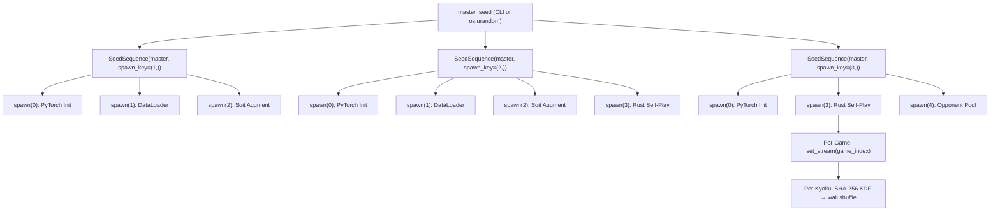

# Hydra Seeding & Reproducibility

> Seeding strategy and reproducibility guarantees for the Hydra Mahjong AI. Covers RNG hierarchy, per-component seeding, CUDA determinism, and evaluation seed banks.

## Related Documents

- [INFRASTRUCTURE.md](INFRASTRUCTURE.md) — Data pipeline, training infra, hardware, deployment
- [CHECKPOINTING.md](CHECKPOINTING.md) — Checkpoint format, save protocol, retention policy
- [TRAINING.md](TRAINING.md) — Training pipeline, loss functions, hyperparameters

---

## Reproducibility and Seeding Strategy

Training a mahjong AI involves randomness at every layer: tile shuffles, suit augmentation, DataLoader ordering, model initialization, GPU kernel scheduling, and opponent selection. This section specifies how Hydra governs all sources of randomness to enable deterministic replay, meaningful ablations, and post-hoc debugging — without sacrificing training performance.

**Design philosophy:** Seed logging is more valuable than seed fixing. Full bitwise reproducibility is achievable for Phase 1 and useful for debugging, but Phases 2–3 are inherently stochastic due to RL exploration and system-level non-determinism. The strategy therefore prioritizes game-level determinism (always achievable) and component-level isolation (always auditable) over global training determinism (sometimes achievable, never required).

### Master Seed Contract

A single integer master seed governs all randomness in a training run. This seed is the sole input needed to reconstruct the full random state of any component at any point in training.

- **Source:** Passed as a CLI argument (`--seed`). Logged to W&B as a top-level run config parameter at run start.
- **Contract:** Same `master_seed` + same code version + same hardware = bitwise-identical Phase 1 training; approximately identical Phases 2–3 (see Known Limitations below).
- **Default behavior:** If no seed is provided, one is generated from `os.urandom`, converted to a 64-bit integer, and logged. This ensures every run is reproducible after the fact — the seed is never lost.
- **Rust side:** The master seed feeds into the `rand 0.9+` ecosystem listed in the Crate Dependencies table. All Rust-side RNG is derived from this seed, never from system entropy during training.

### Seed Hierarchy

**Decision: NumPy SeedSequence as the root of all randomness.**

NumPy's `SeedSequence` implements a hash-based seed derivation scheme (based on ThreeFry) that guarantees statistically independent child streams from a single parent seed. This eliminates the classic anti-pattern of using `seed + i` for component seeds, which produces correlated low bits across components.

**Component allocation via `spawn()`:**

| Spawn Index | Component | Description |
|-------------|-----------|-------------|
| 0 | PyTorch model init | Seeds `torch.manual_seed()` before model construction |
| 1 | DataLoader workers | Seeds the `torch.Generator` passed to DataLoader |
| 2 | Suit augmentation | Seeds per-worker permutation selection |
| 3 | Rust game engine | Session seed for self-play game generation |
| 4 | Opponent pool selection | Seeds opponent category sampling (Phase 3) |
| 5 | Evaluation seed bank | Seeds generation of the fixed evaluation game set |

**Phase-level derivation:** Each training phase derives its own `SeedSequence` via `SeedSequence(master_seed, spawn_key=(phase_number,))`. This ensures Phase 2 explores different random trajectories than Phase 1 even though both originate from the same master seed.

**Anti-patterns (never do):**
- `seed + i` for sequential component seeds — correlated low bits across components
- Reusing the same seed for multiple components — introduces hidden statistical dependencies
- Calling `random.seed()` at module import time — pollutes the global RNG state before the hierarchy is established

### Per-Component Seeding

**3a. PyTorch (model init and training)**

`torch.manual_seed(component_seed)` seeds CPU and all CUDA device RNG streams simultaneously. This is called once before model construction at the start of each phase, ensuring that orthogonal initialization (specified in the [Model Definition](INFRASTRUCTURE.md#model-definition) section) produces identical weights given the same seed. During training, PyTorch's RNG governs dropout (if any) and any stochastic layers — though Hydra's architecture uses no dropout, so the primary effect is on initialization.

**3b. DataLoader Workers**

Each DataLoader worker receives a deterministic seed derived from the hierarchy's DataLoader child via PyTorch's `Generator` parameter. The `worker_init_fn` callback uses this seed to initialize each worker's local NumPy and Python `random` state, ensuring that the 8 workers specified in the [Data Loading Pipeline](INFRASTRUCTURE.md#gap-2-data-loading-pipeline) section produce deterministic file ordering and buffer shuffling across runs. Workers must never share RNG state or seed from `time()`.

**3c. Suit Augmentation**

Each DataLoader worker maintains a local RNG for selecting 1-of-6 suit permutations per game, as specified in the [Suit Permutation Augmentation](INFRASTRUCTURE.md#gap-4-suit-permutation-augmentation) section. The local RNG is derived from the worker's own seed (not global state), avoiding GIL contention between workers. Over 6 epochs, this produces approximately uniform coverage of all 6 permutations for each game, without requiring coordination between workers.

**3d. Rust Game Engine (Self-Play Seeds)**

The Rust game engine receives a session seed derived from the hierarchy's game engine child. The derivation path:

- **Session level:** `SeedSequence.generate_state(8)` produces a `[u8; 32]` array, used to seed a `ChaCha8Rng` via `from_seed()`.
- **Per-game:** The session `ChaCha8Rng` uses `set_stream(game_index)` to create 2^64 independent game streams from a single session seed. Each game index maps to a unique, non-overlapping keystream.
- **Per-kyoku:** Within each game, wall shuffles use a KDF pattern proven by Mortal: `SHA-256(session_seed || nonce || kyoku || honba)` produces a 32-byte seed for a fresh `ChaCha8Rng` that drives the Fisher-Yates shuffle for that specific kyoku's wall, dead wall, and dora indicators.
- **Version pinning:** Pin `chacha20 = "=0.10.0"` in `Cargo.toml` to ensure cross-version replay stability. A minor version bump in the cipher crate could silently change the keystream, breaking deterministic replay.
- **Shuffle implementation:** Vendor the Fisher-Yates shuffle implementation rather than depending on `rand::seq::SliceRandom`. The `SliceRandom` API has changed distribution behavior across `rand` versions; a vendored shuffle with a fixed algorithm guarantees identical wall orderings across Hydra versions.
- **Cross-reference:** Deterministic replay of `(seed, kyoku, honba) → wall` is the foundation of the evaluation protocol described in the [Rating and Evaluation](INFRASTRUCTURE.md#rating-and-evaluation) section.

**3e. Rayon Thread RNG**

Game seeds are determined before dispatch to rayon workers — rayon distributes work, not randomness. Each game instance receives its pre-computed seed as a value parameter; no per-thread RNG is needed for game simulation. The rayon thread pool is a pure compute resource. If per-thread RNG is ever needed for future extensions (e.g., exploration noise during inference), the pattern is a `thread_local` `ChaCha8Rng` seeded from `game_seed XOR thread_index`, ensuring reproducibility regardless of work-stealing order.

**3f. Opponent Pool Selection (Phase 3)**

Opponent category selection (50% self / 30% random pool / 20% frozen baseline, as specified in the Phase 3 opponent pool table) uses its own `SeedSequence` child. Given the same seed and the same pool contents (same checkpoints at the same FIFO positions), the same opponent matchups are produced. This enables controlled ablations where only the training policy changes while the opponent schedule remains fixed.

### CUDA Determinism

**Decision: Full determinism available for Phase 1 debugging; relaxed for Phases 2–3 performance.**

| Flag | Phase 1 (BC) | Phases 2–3 (RL) | Effect |
|------|-------------|-----------------|--------|
| `torch.manual_seed()` | Always | Always | Seeds all CPU + CUDA RNG streams |
| `cudnn.benchmark = False` | Always | Always | Disables auto-tuning; fixed-size inputs (85x34) make perf cost negligible |
| `torch.use_deterministic_algorithms(True)` | Optional (debug) | No | Forces deterministic CUDA kernels; ~5–15% overhead |

**Implementation notes:**
- `torch.use_deterministic_algorithms(True)` subsumes the older `torch.backends.cudnn.deterministic = True` — use the modern API exclusively.
- `CUBLAS_WORKSPACE_CONFIG` environment variable is no longer needed in PyTorch 2.x — deterministic cuBLAS workspace selection is handled internally when `use_deterministic_algorithms` is enabled.
- bf16 matrix multiplications are deterministic given identical inputs; non-determinism in mixed-precision training comes from reduction ordering in multi-stream operations (e.g., gradient all-reduce), not from the matmul itself.
- GroupNorm (used throughout the model, as specified in the [Model Definition](INFRASTRUCTURE.md#model-definition) section) is fully deterministic — it has no running statistics and no non-deterministic CUDA kernels.
- Conv1d switches to a deterministic cuDNN kernel when deterministic mode is enabled, with ~5–8% overhead compared to the auto-tuned non-deterministic kernel.
- **Recommendation:** Enable full determinism for Phase 1 ablation studies and seed-specific debugging. Do not enable for Phases 2–3 — RL exploration, rayon work-stealing, and GIL contention already make these phases non-bitwise-reproducible, so the 5–15% overhead buys no additional reproducibility guarantee.

### Checkpoint RNG State

Every checkpoint saves the following RNG state alongside model weights and optimizer state:

| Component | What is Saved | Purpose |
|-----------|---------------|---------|
| PyTorch CPU RNG | `torch.random.get_rng_state()` | Reproducible forward pass on resume |
| CUDA RNG (all devices) | `torch.cuda.get_rng_state_all()` | Reproducible GPU operations on resume |
| Python `random` module | `random.getstate()` | Any Python-level randomness (logging, sampling) |
| NumPy RNG | `SeedSequence` spawn counter + bit generator state | DataLoader and augmentation state |
| Training progress | Epoch number, global step, file cursor position | Reconstruct DataLoader file ordering on resume |

**Resume protocol:** On checkpoint load, all RNG states are restored before the first forward pass. The DataLoader reconstructs its file ordering from the saved epoch number and file cursor, ensuring that resumed training sees exactly the same data sequence as uninterrupted training.

- **Phase 1:** Enables bitwise-identical training continuation — the resumed run produces the same gradients as if it had never been interrupted.
- **Phases 2–3:** Enables approximate resumption. Game trajectories will differ due to thread scheduling non-determinism in rayon, but the statistical properties of the training distribution are preserved.

### Phase Transition Seeding

At each phase boundary, all RNG components are re-seeded from the new phase's `SeedSequence` child. This extends the carry/reset table in the [Phase Transitions](INFRASTRUCTURE.md#phase-transitions) section:

| Component | Phase 1 → 2 | Phase 2 → 3 |
|-----------|-------------|-------------|
| SeedSequence | New child: `spawn_key=(2,)` | New child: `spawn_key=(3,)` |
| PyTorch RNG | Re-seeded from new phase child | Re-seeded from new phase child |
| Rust game engine | New session seed | New session seed |
| NumPy RNG | Re-seeded | Re-seeded |
| DataLoader Generator | Re-seeded | Re-seeded |
| Opponent pool RNG | N/A | Initialized from new phase child |

**Rationale:** Re-seeding ensures each phase explores different random trajectories even with the same master seed. Without re-seeding, Phase 2's game engine would replay the same wall shuffles as Phase 1's evaluation games, creating an artificial correlation between training and evaluation data.

### Evaluation Seed Bank

**Decision: Fixed, published seed bank for all evaluation runs.**

A standardized set of 50,000 game seeds ensures cross-run and cross-version comparability of evaluation results. The seed bank is a first-class artifact, not a runtime computation.

- **Generation:** Derived from a published constant (`EVAL_MASTER = 0x2000`) using `SeedSequence(0x2000).generate_state(50000)`. The constant follows Mortal's convention for evaluation key derivation.
- **Storage:** Checked into the repository as `data/eval_seeds.json` — never generated at runtime. This eliminates any risk of evaluation seed drift across code versions or platforms.
- **Usage tiers** (matching [INFRASTRUCTURE.md § Rating and Evaluation](INFRASTRUCTURE.md#rating-and-evaluation)):

| Tier | Seeds Used | Games (x4 rotations) | Purpose |
|------|-----------|----------------------|---------|
| Quick eval | First 1,000 | 4,000 | Trend detection during training |
| Full eval | All 50,000 | 200,000 | Publication-quality checkpoint comparison |

- **Cross-reference:** These tiers match the evaluation scale table in the [Rating and Evaluation](INFRASTRUCTURE.md#rating-and-evaluation) section. The ablation tier (250,000 sets / 1M games) uses a separate, larger seed bank generated from `EVAL_MASTER_ABLATION = 0x2001`.
- **Invariant:** The seed bank file is append-only. New seeds may be added for larger evaluations, but existing seeds are never reordered or removed.

### Known Limitations

What cannot be made deterministic and why:

- **Phases 2–3 are NOT bitwise reproducible.** Four independent sources of non-determinism interact: GPU reduction ordering in multi-stream operations, rayon work-stealing thread scheduling, Python GIL contention timing, and `torch.compile()` JIT trace differences across runs.
- **Phase 1 CAN be bitwise reproducible** with `torch.use_deterministic_algorithms(True)` enabled and a fixed seed. This is the recommended configuration for ablation studies and hyperparameter sweeps.
- **Game-level replay IS always deterministic** regardless of training-level non-determinism. Given the same `(seed, kyoku, honba)` tuple, the wall shuffle, dora indicators, and draw order are identical across any platform, any Rust version, any number of threads.
- **Consistent with industry practice:** KataGo, Mortal, and AlphaStar all achieve game-level determinism without full training reproducibility. No production RL system claims bitwise-reproducible multi-phase training.
- **Reporting standard:** Following Henderson et al. 2018, report results over 5+ seeds with confidence intervals. Following Agarwal et al. 2021, use interquartile mean (IQM) with bootstrap confidence intervals for RL evaluation rather than mean +/- standard deviation, which is sensitive to outliers in heavy-tailed reward distributions.

### Seed Logging

Every training run logs the complete seed provenance chain, enabling post-hoc reproduction of any specific game or training state:

- **Run level:** Master seed, phase seed, all component seeds, config file hash, `Cargo.lock` hash.
- **Game level:** Every self-play game logs its game seed in trajectory metadata. This enables replaying any specific game from a training run for debugging or analysis.
- **Evaluation level:** Seed bank file hash and any per-run overrides are logged.
- **Debugging workflow:** Failed reproduction? Check the logged seed, code version, and `Cargo.lock` hash. If all three match, the discrepancy is due to system-level non-determinism (thread scheduling, GPU reduction order) — not a code bug.
