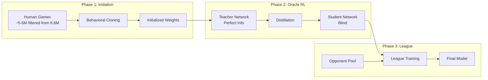
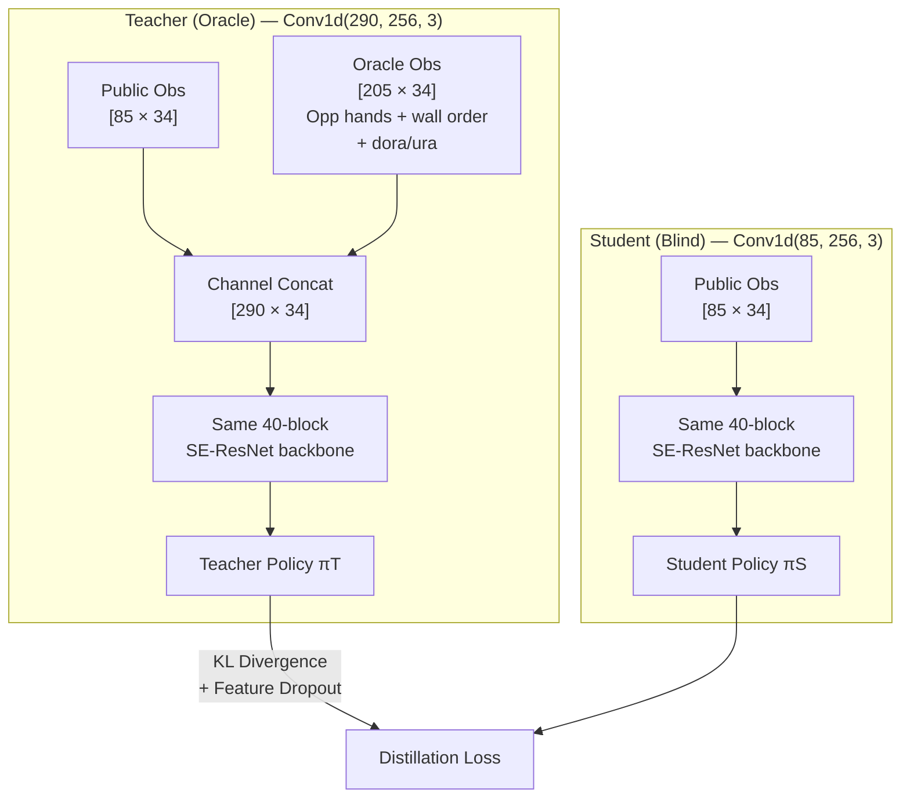
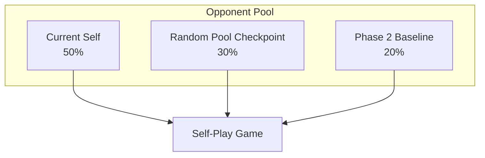

# Hydra Training Pipeline

> Training pipeline specification for the Hydra Mahjong AI. Covers supervised warm start, oracle distillation, league self-play, loss functions, and hyperparameters.

## Related Documents

- [HYDRA_SPEC.md](HYDRA_SPEC.md) — Architecture, input encoding, output heads, inference
- [INFRASTRUCTURE.md](INFRASTRUCTURE.md) -- Data pipeline, Rust stack, hardware, deployment
- [REWARD_DESIGN.md](REWARD_DESIGN.md) — Reward function design and RVR variance reduction
- [SEARCH_PGOI.md](SEARCH_PGOI.md) -- Inference-time oracle reuse (post-Phase 2, optional)
- [MORL_PLACEMENT.md](MORL_PLACEMENT.md) -- Multi-objective RL for placement (Phase 3 variant, optional)
- [RUST_STACK.md](RUST_STACK.md) -- 100% Rust stack decision, Burn framework, migration from Python

---

## Training Pipeline

Hydra training combines three proven techniques:
1. **Oracle Distillation** (from Suphx) — Train with perfect information, distill to blind agent.
2. **PPO with Stability Enhancements** (from Mortal-Policy fork) — On-policy learning avoids DQN catastrophic forgetting.
3. **League Training** (from AlphaStar) — Robust generalization via diverse opponents.



### Phase 1: Supervised Warm Start

**Objective:** Behavioral cloning from expert play. Bootstrap the network with human expert play to avoid random exploration in early training.

**Data requirements:**

| Source | Volume | Quality Filter |
|--------|--------|----------------|
| Tenhou Phoenix | 2M games | R > 2000 |
| Majsoul Throne | 1M games | Saint 3+ |
| Majsoul Jade | 3M games | Master+ (lower weight) |

**Data augmentation — Suit permutation (6×):** Mahjong suits (manzu, pinzu, souzu) are structurally identical. Permuting suit labels (e.g., m→p, p→s, s→m) creates valid games, providing a 6× data multiplier without introducing bias.

**Hyperparameters:**

| Parameter | Value | Notes |
|-----------|-------|-------|
| Batch size | 2048 | Large for stable gradients |
| Epochs | 3 | Avoid overfitting human quirks |
| LR schedule | 5e-4 → 1e-5 | Cosine annealing |
| Optimizer | AdamW | Weight decay 0.01 |
| Dropout | 0.1 | Regularization during training |
| Normalization | GroupNorm(32) | Batch-independent |
| Augmentation | 6× suit permutation | — |

> For the full Phase 1 optimizer configuration including warmup schedule, betas, epsilon, gradient clipping, and precision settings, see [INFRASTRUCTURE.md § Phase 1](INFRASTRUCTURE.md#phase-1-behavioral-cloning-supervised).

**Phase 1 loss:**

$$\mathcal{L}_{\text{IL}} = \text{CE}(\pi, a_{\text{human}}) + 0.5 \times \text{MSE}(V, \text{outcome}) + 0.1 \times \mathcal{L}_{\text{aux}}$$

Where $\mathcal{L}_{\text{aux}}$ includes GRP, tenpai, and danger auxiliary losses (see Loss Functions section).

**Target metrics (aspirational — these are NOT the Phase 1 readiness gate):**

> The readiness gate to enter Phase 2 has lower thresholds (discard ≥65%, placement ≤2.55, deal-in ≤15%). The targets below represent ideal Phase 1 performance. If the gate passes but targets are missed, Phase 2 proceeds — the targets guide hyperparameter tuning, not gating.

| Metric | Target | Mortal Baseline |
|--------|--------|-----------------|
| Discard accuracy | >72% | ~70% |
| Call accuracy | >85% | ~83% |
| Riichi accuracy | >80% | ~78% |

### Phase 2: Oracle Distillation RL

**Objective:** Train a Teacher network with perfect information, then distill its knowledge into a blind Student network.

#### Oracle Teacher Input Encoding

The Teacher uses the **same backbone architecture** as the Student but receives an augmented input that includes hidden information. The oracle observation is **concatenated along the channel dimension** with the standard public observation before the stem Conv1d — the only architectural difference is the stem's input channel count.

**Teacher input shape:** `[Batch × 290 × 34]` (85 public + 205 oracle channels)

**Student input shape:** `[Batch × 85 × 34]` (public only)

**Stem difference:** Teacher: `Conv1d(290, 256, 3)`, Student: `Conv1d(85, 256, 3)`. All ResBlock weights (40 blocks, SE attention, etc.) are identical and fully transferable between teacher and student. This matches Mortal's approach (`model.py:109-155`, at commit `0cff2b5`) where `is_oracle=True` simply adds `oracle_obs_shape` to the stem input channels.

##### Oracle Channels: Opponent Hidden State (39 channels)

For each of the 3 opponents (shimocha, toimen, kamicha), 13 channels:

| Channel | Content | Encoding | Evidence |
|---------|---------|----------|----------|
| +0 to +3 | Closed hand tile count | 4 binary thermometer planes (≥1, ≥2, ≥3, =4). Matches student hand encoding. | Mortal `invisible.rs:163-170` (at commit `0cff2b5`) |
| +4 to +6 | Aka-dora in hand | 3 binary all-fill channels (one per suit: 5m-red, 5p-red, 5s-red) | Mortal `invisible.rs:172-178` (at commit `0cff2b5`) |
| +7 to +10 | Shanten | 4-channel one-hot (values 0-3+). Uses Hydra's convention (not Mortal's 7+1). | Mortal uses 7 one-hot + 1 float; Hydra compresses to 4 |
| +11 | Waits (tenpai tiles) | Sparse binary mask over 34 tile types. Column t = 1.0 if that tile is a winning tile. Only meaningful when shanten = 0. | Mortal `invisible.rs:197-203` (at commit `0cff2b5`) |
| +12 | Furiten flag | Binary all-fill. Entire row = 1.0 if opponent is in furiten state. | Mortal `invisible.rs:205-208` (at commit `0cff2b5`) |

**3 opponents × 13 channels = 39 channels**

##### Oracle Channels: Wall Draw Order (138 channels)

The yama (live wall) is encoded in **exact draw order** — position 0 = next tile drawn, position 1 = tile after that, etc. This gives the teacher perfect lookahead.

Each tile uses 2 channels:
- **Channel +0:** One-hot over 34 tile types (deaka'd identity)
- **Channel +1:** Binary all-fill aka-dora flag

The wall has 70 tiles initially; since the dealer always draws the first tile (`yama_idx ≥ 1`), at most 69 tiles are encoded. Already-drawn tiles are zero-padded at the end, creating a naturally shrinking sequence of non-zero entries as the game progresses.

**69 tiles × 2 channels = 138 channels**

**Why draw order, not counts:** A count-only encoding (4 channels) would tell the oracle "there are 2 more 1-man in the wall" but not "the next draw IS 1-man." Full ordering enables the teacher to make provably optimal multi-step decisions, producing sharper policy distributions for distillation. Mortal dedicates 138 of 217 oracle channels (64%) to this — it's the dominant oracle signal. (Source: `invisible.rs:219-226`, at commit `0cff2b5`)

##### Oracle Channels: Rinshan Tiles (8 channels)

Dead wall draw tiles (kan replacement). Same 2-channel per-tile encoding, ordered. Up to 4 tiles.

**4 tiles × 2 channels = 8 channels**

##### Oracle Channels: Dora Indicators (10 channels)

All 5 dora indicator slots (including unrevealed future indicators). Same 2-channel encoding.

**5 indicators × 2 channels = 10 channels**

##### Oracle Channels: Ura-Dora Indicators (10 channels)

All 5 ura-dora indicators (hidden beneath dora indicators, revealed only at ron/tsumo with riichi). Same 2-channel encoding.

**5 indicators × 2 channels = 10 channels**

##### Oracle Channel Summary

| Section | Channels | Range (within oracle) |
|---------|----------|----------------------|
| Opponent 1 hidden state | 13 | 0–12 |
| Opponent 2 hidden state | 13 | 13–25 |
| Opponent 3 hidden state | 13 | 26–38 |
| Yama draw order (69 × 2) | 138 | 39–176 |
| Rinshan tiles (4 × 2) | 8 | 177–184 |
| Dora indicators (5 × 2) | 10 | 185–194 |
| Ura-dora indicators (5 × 2) | 10 | 195–204 |
| **TOTAL** | **205** | |

**Combined teacher input: 85 (public) + 205 (oracle) = 290 channels × 34 tiles**

For comparison, Mortal's oracle is 217 channels (51 opponent + 166 wall). Hydra's is 205 channels (39 opponent + 166 wall) — 12 fewer due to compressed shanten encoding (4ch vs 8ch per opponent).

#### Teacher Training

The Teacher is trained with PPO on self-play using the same reward function as all phases (per-kyoku ΔE[pts] via GRP). With perfect information, optimal play is much easier to learn — the Teacher is expected to converge significantly faster than a blind agent (Suphx describes oracle training as speeding up RL but provides no quantitative speedup ratio; arXiv:2003.13590, Section 3.3).

#### Student Distillation

The Student receives only the standard 85-channel public observation. It learns by simultaneously optimizing its own PPO objective and minimizing KL divergence from the Teacher's policy distribution:

$$\mathcal{L}_{\text{distill}} = \mathcal{L}_{\text{PPO}}(\pi_S) + \lambda_{\text{KL}} \times D_{\text{KL}}^{\tau}(\pi_S \| \pi_T) + \lambda_{\text{anchor}} \times D_{\text{KL}}(\pi_S \| \pi_{\text{BC}})$$

where \(\tau = 3.0\) (KL temperature, softens teacher targets), \(\lambda_{\text{KL}}\) follows the feature dropout schedule below, and \(\lambda_{\text{anchor}} = 0.1\) decays linearly to 0 over Phase 2 (prevents catastrophic forgetting of Phase 1 behavioral cloning). See [INFRASTRUCTURE.md § Phase 2](INFRASTRUCTURE.md#phase-2-oracle-distillation-rl) for the full optimizer configuration.

#### Feature Dropout Schedule

To bridge the gap between oracle and blind play, the Teacher's hidden inputs are gradually masked during distillation using **group-level deterministic scaling**. The mask is applied at the encoding level before the data enters the network.

> **Design note:** Suphx (arXiv:2003.13590 Section 3.3, Equation 5) uses **element-wise Bernoulli dropout** — each oracle feature is independently kept (=1) or zeroed (=0) with probability γₜ decaying from 1→0. Hydra instead uses deterministic scalar multiplication per feature group, which provides smoother gradient flow and separates opponent-hand vs wall information at different decay rates. This is an intentional design choice, not a reproduction of Suphx's method.

Two feature groups are masked independently:
- **Group A (opponent hands):** 39 channels — scaled by `mask_opp`
- **Group B (wall/dead wall):** 166 channels — scaled by `mask_wall`

| Training Stage | mask_opp | mask_wall | KL Weight (λ_KL) |
|----------------|----------|-----------|-------------------|
| Early (Steps 0–50K) | 1.0 (full) | 1.0 (full) | 1.0 |
| Mid (Steps 50K–100K) | 0.7 | 0.5 | 0.8 |
| Late (Steps 100K–150K) | 0.3 | 0.2 | 0.5 |
| Final (Steps 150K+) | 0.0 | 0.0 | 0.3 |

**Post-dropout continuation:** After masks reach 0.0, continue training with learning rate decayed to 1/10 and importance weight rejection (reject samples where π_new/π_old exceeds threshold). Suphx showed these tricks are critical for stability: "Without these tricks, the continual training is not stable and does not lead to further improvements" (arXiv:2003.13590).

**Wall masks decay faster than opponent masks** because wall ordering is extremely powerful information (perfect lookahead) that creates a larger gap between teacher and student. Removing it earlier forces the teacher to rely more on opponent hand reading, which transfers better to the blind student.

**Why this works:** The Teacher learns patterns like "Opponent has 4–7p tanki wait" or "Wall has no more 3m." The Student cannot see these facts directly but learns to recognize the behavioral and statistical signals that correlate with them — developing "intuition" by mimicking psychic decisions. Suphx ablation (Figure 8, offline evaluation over 1M games) showed the full RL pipeline (SL → RL+GRP → RL+GRP+Oracle) gained ~0.63 dan over the supervised baseline (~7.66 → ~8.29 stable dan, visual estimates from box plot). Oracle guiding specifically contributed ~0.06 dan over GRP alone (RL-2 vs RL-1 median gap). The final online Suphx system (including run-time policy adaptation) reached 8.74 stable dan (Table 4), a ~1.08 dan improvement over SL — but this includes techniques beyond the oracle ablation. Note: Figure 8 numbers are from offline evaluation against weaker opponents, not online Tenhou play. (arXiv:2003.13590, Figure 8 and Table 4)

**Why NOT simple knowledge distillation:** Suphx explicitly tested and rejected standard KD (training a normal agent to mimic the oracle). The oracle is "super strong and far beyond the capacity of a normal agent" — the gap is too large for direct imitation. Progressive feature dropout creates a smooth transition instead. (arXiv:2003.13590, Section 3.3)

**Why NOT Suphx's single-model approach:** Suphx used one model with progressive dropout on oracle features within the same network. Hydra uses a **separate teacher** (MAPPO-style asymmetric actor-critic) because: (1) the teacher can be trained to convergence first, producing stronger policy targets, (2) weight transfer from teacher to student is cleaner (drop stem, keep ResBlocks), (3) the teacher remains available as a league opponent in Phase 3.

> **Evidence note (oracle distillation failure modes):** Oracle distillation carries fundamental risks in partially observable games that must be understood before relying on it. Three independent sources confirm the core problem:
>
> 1. **Mortal (empirical):** Equim-chan confirmed oracle guiding "didn't bring improvements in practice" and removed it in v3, replaced with a rank-prediction auxiliary ([GitHub Discussion #102](https://github.com/Equim-chan/Mortal/discussions/102)). The MJAI Server team independently corroborated: "optimal strategies are vastly different when you know hidden info, and these strategies cannot be easily migrated to normal games."
> 2. **GPO (theoretical):** Li, Xie, and Lu ("Guided Policy Optimization under Partial Observability", [arXiv:2505.15418](https://arxiv.org/abs/2505.15418)) prove that naive oracle-to-student policy distillation is fundamentally suboptimal due to **observation aliasing**: many different hidden-tile configurations map to the same public observation, causing the student to average incompatible teacher strategies. The teacher also never learns to "probe" or gather information since it already sees everything, so the student never learns information-seeking behavior.
> 3. **NeurIPS 2024 (theoretical):** Cai et al. ("Provable Partially Observable RL with Privileged Information") prove that expert distillation in POMDPs has no general near-optimality guarantee — guarantees exist only under a "deterministic filter condition" (observation-to-state mapping is nearly injective), which Riichi Mahjong with 136 tiles and 4 players massively violates.
>
> **What works instead:** PerfectDou (Guan et al., NeurIPS 2022, [link](https://proceedings.neurips.cc/paper_files/paper/2022/hash/e26f31de8b13ec569bf507e6ae2cd952-Abstract-Conference.html)) demonstrated that using oracle information in the **value/critic** (not the policy) succeeds in DouDizhu. The actor trains from its own imperfect-information experience with oracle-informed advantages. This is exactly Hydra's approach: the oracle critic (Component 2) uses perfect info for **value estimation**, while the student's policy learns from its own experience — not by imitating the teacher's policy.
>
> **Hydra's mitigation:** Hydra uses feature dropout to progressively remove oracle information, combined with KL divergence as a soft constraint (not hard imitation). The student is not forced to replicate the teacher's exact actions — it learns from PPO experience with the teacher providing only a soft policy prior. If [Ablation A4](ABLATION_PLAN.md#a4-oracle-distillation) shows no benefit, the fallback is direct BC → League (skipping Phase 2), which is a valid pipeline.



### Phase 3: League Training

**Objective:** Prevent overfitting to self-play patterns. Create robust generalization by training against a diverse opponent pool.

**Opponent pool:**

> See [INFRASTRUCTURE.md § Phase 3: League Self-Play](INFRASTRUCTURE.md#phase-3-league-self-play-ppo) for the full opponent pool specification (composition weights, GPU cache, selection protocol, FIFO eviction).

| Opponent | Weight | Purpose |
|----------|--------|---------|
| Current self (all 4 seats) | 50% | Core self-play signal |
| Random pool checkpoint | 30% | Diversity; prevents strategy collapse |
| Phase 2 baseline (frozen) | 20% | Anchor; prevents catastrophic forgetting |



 **PPO hyperparameters:**

 > See [INFRASTRUCTURE.md § Phase 3](INFRASTRUCTURE.md#phase-3-league-self-play-ppo) for implementation details (self-play architecture, opponent pool GPU cache, FIFO eviction). Hyperparameters below are authoritative:

 | Parameter | Value | Notes |
 |-----------|-------|-------|
 | Clip ε | 0.1 | Conservative for high-variance game |
 | Entropy coef | 0.01 → 0.005 | Linear decay |
 | GAE λ | 0.95 | Per-kyoku advantage estimation |
 | γ (discount) | 1.0 | Undiscounted episodic (matches Mortal) |
 | Value clip | Disabled | Hurts performance per Engstrom et al. (2020) and Andrychowicz et al. (2021) |
 | LR | 1e-4, cosine annealing | Adam eps=1e-5 (not default 1e-8) |
 | Minibatch size | 4096 | Transitions per PPO minibatch |
 | Update epochs | 3 | Conservative for self-play (reduce to 2 if approx_kl > 0.03) |
 | Gradient clip | 0.5 | Max grad norm, essential for stability |
 | Init | Orthogonal | std=√2 hidden layers, std=0.01 policy/GRP/tenpai/danger/wait-set/value-tenpai/call-intent heads, std=1.0 value head, std=1.0 Sinkhorn head |

 **Fresh samples only:** Unlike DQN (which Mortal uses), PPO is on-policy — no replay buffer. This eliminates one source of instability: stale off-policy transitions. However, PPO self-play can still suffer catastrophic forgetting from distributional shift; Hydra mitigates this via the league opponent pool and a KL anchor against the Phase 2 policy (λ_KL = 0.05, annealed to 0 over the first 30% of Phase 3 training; see [INFRASTRUCTURE.md § Phase 3](INFRASTRUCTURE.md#phase-3-league-self-play-ppo)).

**Phase 3 stopping criterion:** Phase 3 ends when OpenSkill conservative rating (μ − 3σ) plateaus — defined as < 0.5σ improvement over the trailing 500K training steps as measured by full evaluation (200K games). At that point, the best checkpoint by conservative rating is the final Hydra model.

 ### Reward Function

 Hydra's reward is fully defined as a three-component system: a GRP-based per-kyoku reward, an oracle critic baseline, and an Expected Reward Network for last-tile variance reduction. The reward function is **identical across all three training phases** — only the training algorithm changes between phases.

 #### Episode Structure

 Each **kyoku (round)** is one episode, not a full hanchan (game). A hanchan contains 4-12 kyoku, each with ~15-20 decision points. This follows Mortal and Suphx's design and provides ~100× lower credit assignment variance compared to per-game episodes (variance scales as O(T²) with episode length T).

 #### Component 1: GRP-Based ΔE[pts] (Per-Kyoku Reward)

> **Naming clarification (two GRP components):** Hydra has two distinct components both using the "GRP" name:
>
> 1. **External GRP reward model** (this section): A separate pretrained frozen 2-layer GRU (hidden=128) over per-kyoku score features. Used solely for reward computation (`deltaE[pts]`). Independent of the main network. Defined below.
> 2. **Internal GRP auxiliary head** ([HYDRA_SPEC S GRP Head](HYDRA_SPEC.md#grp-head-global-rank-prediction)): An output head on the shared backbone (GAP -> concat score context -> MLP -> 24 softmax). Part of the agent network, trained with CE auxiliary loss (weight 0.1). Provides placement awareness to the backbone's learned representation.
>
> These are intentionally different: the external GRP provides a stable reward signal (frozen, never changes during RL), while the internal head gives the backbone gradient signal for learning placement-aware features. The loss formula's `L_GRP` term refers to the **internal head's** auxiliary loss, not the external reward model.

 The GRP (Game Result Prediction) head predicts the final game placement distribution at each kyoku boundary. The reward for kyoku k is the change in expected placement points:

 $$r_k = E[\text{pts}]_{\text{after kyoku } k} - E[\text{pts}]_{\text{before kyoku } k}$$

 Where:
 - $E[\text{pts}] = \text{rank\_prob} \cdot \text{pts\_vector}$
 - $\text{rank\_prob}$ is marginalized from the GRP's 24-class permutation softmax
 - $\text{pts\_vector} = [3, 1, -1, -3]$ (symmetric, zero-sum, configurable)

 **Placement points:** Training uses symmetric `[3, 1, -1, -3]` for balanced learning. Each placement step is worth exactly 2 points — no bias toward "avoid 4th" or "push for 1st." Platform-specific fine-tuning uses different vectors (e.g., Tenhou Houou: `[90, 45, 0, -135]` for evaluation, or normalized `[3, 1.5, 0, -4.5]` for training). The GRP head does not need retraining when pts changes — only the downstream reward computation changes.

 **Per-action assignment:** All actions within a kyoku share the same reward value (the kyoku's ΔE[pts]). Credit assignment within the kyoku is handled by the value function and GAE, not by the reward itself.

 **Telescoping property:** The sum of per-kyoku rewards telescopes to the game-level placement reward: $\sum_k r_k = \text{pts}[\text{final\_rank}] - E[\text{pts}]_{\text{initial}}$. This means no separate game-end bonus is needed — per-kyoku rewards already exactly decompose the game-level objective. This is equivalent to potential-based reward shaping (Ng et al. 1999) where $\Phi = E[\text{pts}]$, which provably preserves the optimal policy.

 **GRP architecture (separate, pretrained, frozen):**
 - 2-layer GRU (hidden=128) over per-kyoku features: `[grand_kyoku, honba, kyotaku, s0/10000, s1/10000, s2/10000, s3/10000]`
 - Output: 24-class softmax over rank permutations → marginalized to per-player rank probabilities
 - Loss: cross-entropy on actual final ranking permutation
 - Trained once on game logs, then **frozen during RL** — provides stable reward signal
 - GRP accuracy is limited (~23% top-1 on 24 classes per Mortal community), but the marginalized rank probabilities and expected values are much more useful than top-1 accuracy suggests

 **GRP pretraining specification:**

 | Parameter | Value | Notes |
 |-----------|-------|-------|
 | Data source | Same game logs as Phase 1 (Tenhou Houou + Majsoul) | Raw `.json.gz` game records |
 | Training samples | Every kyoku boundary prefix within each game | 4–12 samples per game (one per prefix of the score-state sequence) |
 | Input per timestep | `[grand_kyoku, honba, kyotaku, s0/10000, s1/10000, s2/10000, s3/10000]` | 7 features |
 | Label | Index (0-23) of the permutation matching actual final ranking | From the 24 permutations of [0,1,2,3] (const lookup table) |
 | Precision | float64 | Matches Mortal — GRP runs in double precision for numerical stability |
 | Optimizer | AdamW(lr=1e-3, weight_decay=1e-4) | — |
 | Convergence | val_loss plateau (3–5K steps), val_acc ~23% top-1 | 24-class random baseline is 4.2%; ~23% is 5.5× random |
 | Schedule | Pretrained **before** Phase 1 begins | GRP is independent of the main network |
 | Checkpoint | `checkpoints/grp/` | Single file, frozen after convergence |

 > **Evidence note (GRP pretraining):** Mortal's `train_grp.py` uses identical data pipeline: for each game, every prefix of the score-state sequence is a training sample paired with the game's final ranking. Optimizer is AdamW with default parameters. Hydra's GRP differs from Mortal's only in the downstream consumption: Hydra adds a 16-dim score context vector at the GRP head within the main network (see [HYDRA_SPEC § GRP Head](HYDRA_SPEC.md#grp-head-global-rank-prediction)), while the pretrained GRP module here serves solely for reward computation.

 #### Component 2: Oracle Critic (Training Only)

 The oracle critic is an asymmetric actor-critic where the critic receives **full information** during training — all 4 players' hands and the wall composition — while the policy head sees only public observation. This dramatically reduces variance because the oracle sees 4× more information than the acting agent.

 **Architecture:** The oracle critic is the **teacher network's value head**, running on the oracle-augmented backbone (Conv1d(290, 256, 3) stem with 85 public + 205 oracle channels). It is architecturally identical to the student's value head (GAP → MLP with ReLU) but with two key differences:

 | Property | Student Value Head | Oracle Critic |
 |----------|-------------------|---------------|
 | Backbone input | 85 public channels | 290 channels (85 public + 205 oracle) |
 | Output dimension | 1 scalar | **4 scalars** (one per player) |
 | Zero-sum constraint | No | Yes: V₁+V₂+V₃+V₄=0 |
 | Used at inference | Yes | No (discarded) |

 The oracle critic's MLP is: GAP(256×34 → 256) → FC(256→512) → ReLU → FC(512→4).

  $$A(o_t, a_t) = r_k - V_{\text{oracle}}(s_{\text{full}, t})$$

  **Zero-sum constraint:** The oracle critic is trained with an auxiliary zero-sum loss:

  $$\mathcal{L}_{\text{critic}} = \sum_i (V_i(s) - r_i)^2 + \lambda_{\text{zs}} \cdot \left(\sum_i V_i(s)\right)^2$$

 This enforces $V_1 + V_2 + V_3 + V_4 = 0$, which is correct by construction for zero-sum placement rewards. The RVR paper (Li et al., IEEE CoG 2022) showed this component provides significant training speedup (the paper reports faster convergence but does not state a specific multiplier).

 At inference, only the student's 1-scalar value head and policy head are used — the oracle critic is not loaded by default. **Exception:** If PGOI is enabled ([SEARCH_PGOI.md](SEARCH_PGOI.md)), the oracle stem is loaded alongside the student for inference-time belief-guided oracle queries.

 #### Component 3: Expected Reward Network (Phase 3+)

 The single largest source of reward variance in Mahjong is the last tile draw. The same game state at time T-1 can result in 0 or 12,000+ points depending on the final draw. The Expected Reward Network replaces this stochastic outcome with its expectation:

 $$f_\theta(g^{T-1}) \approx E[r \mid \text{state at } T{-}1]$$

 This is a small MLP trained with MSE loss on completed kyoku outcomes. During training, the raw terminal reward is **replaced** (not subtracted) by $f_\theta(g^{T-1})$. This converts a "lottery ticket" gradient signal into a "fair estimate" signal with near-zero variance from last-tile luck.

 **Implementation priority:** Implement after Components 1-2 are working. This is the highest-impact addition from the RVR paper but adds architectural complexity.

 #### Combined Advantage Formula

 $$A(o_t, a_t) = f_\theta(g^{T-1}) - V_{\text{oracle}}(s_{\text{full}, t})$$

 This attacks both major variance sources simultaneously: hidden information (oracle critic) and terminal stochasticity (Expected Reward Network).

 #### Reward Normalization

 1. **Running reward normalization:** Divide rewards by running standard deviation of discounted returns (do NOT subtract mean — this would shift the reward signal). Use Welford's online algorithm across dataloader workers.
 2. **Per-minibatch advantage normalization:** `(A - mean(A)) / (std(A) + 1e-8)` within each PPO minibatch. This is non-negotiable for PPO in high-variance environments.
 3. **Reward clipping:** Clip normalized rewards to `[-5, 5]` to prevent extreme gradient updates from outlier games.

 #### What NOT to Do (Confirmed Failures)

 - **No reward shaping beyond GRP:** Mortal's GRP delta IS already potential-based reward shaping. Adding shanten-based or hand-value shaping on top creates double-shaping with no upside and risk of offensive bias.
 - **No intrinsic motivation (RND, ICM):** SL warm-start already solves the exploration problem. Mahjong's challenge is decision quality, not state exploration.
 - **No TD bootstrapping:** Mortal tried TD → no improvement, adds instability. MC returns via GAE with γ=1 are sufficient.
 - **No game-end bonus:** The telescoping property means per-kyoku rewards already decompose the game objective exactly.
 - **No Elo-based reward:** Elo is for evaluation, not training. Non-stationary and noisy.

 ### Stability Techniques Summary

 | Technique | Purpose | Source |
 |-----------|---------|--------|
 | GroupNorm | Batch-independent normalization | Wu & He 2018 |
 | Dropout 0.1 (training only) | Regularization, RL stability | Mortal experiments |
 | PPO (not DQN) | On-policy avoids forgetting | Schulman et al. 2017 |
 | KL penalty (Phase 2) | Constrain policy updates near SL init | PPO-KL variant |
 | Gradient clipping (0.5) | Prevent exploding gradients | Standard practice |
 | League pool | Diverse opponents | AlphaStar |
 | GRP ΔE[pts] reward | Per-kyoku reward with game-level context | Mortal, Suphx |
 | Oracle critic + zero-sum | Reduce hidden-info variance | RVR (Li et al., IEEE CoG 2022) |
 | Expected Reward Network | Reduce last-tile luck variance | RVR (Li et al., IEEE CoG 2022) |
 | Running reward normalization | Stable gradient magnitudes | CleanRL, SB3 |
 | Per-minibatch advantage norm | Centered advantages for PPO | Standard PPO practice |

---

## Loss Functions

### Total Loss

The total training loss combines baseline and extended components with phase-dependent weighting:

$$\mathcal{L}_{\text{total}} = \mathcal{L}_{\text{policy}} + 0.5 \cdot \mathcal{L}_{\text{value}} + 0.1 \cdot \mathcal{L}_{\text{GRP}} + 0.05 \cdot \mathcal{L}_{\text{tenpai}} + 0.05 \cdot \mathcal{L}_{\text{danger}} + [0.02 \cdot \mathcal{L}_{\text{wait-set}} + 0.02 \cdot \mathcal{L}_{\text{value-tenpai}} + 0.02 \cdot \mathcal{L}_{\text{call-intent}} + 0.02 \cdot \mathcal{L}_{\text{sinkhorn}}] + \lambda_{\text{KL}} \cdot D_{\text{KL}} - \beta \cdot H(\pi)$$

Terms in brackets are **extended heads** -- included only when those heads are active (gated by ablation results from [ABLATION_PLAN A10-A12](ABLATION_PLAN.md#a10-dense-vs-sparse-danger-labels)). Baseline training uses only the first 5 auxiliary terms.

Where:
- $\mathcal{L}_{\text{policy}}$: PPO clipped surrogate objective (Phase 2–3) or cross-entropy with human actions (Phase 1)
- $\mathcal{L}_{\text{value}}$: MSE between value head prediction and actual returns
- $\mathcal{L}_{\text{GRP}}$: Cross-entropy on final rank permutation (24-way classification)
- $\mathcal{L}_{\text{tenpai}}$: Binary cross-entropy per opponent tenpai status
- $\mathcal{L}_{\text{danger}}$: Binary cross-entropy per tile deal-in event
- $D_{\text{KL}}$: KL divergence from Teacher policy (Phase 2 only, $\lambda_{\text{KL}}$ varies per schedule)
- $H(\pi)$: Policy entropy bonus for exploration ($\beta$ = 0.01 → 0.005, decaying)

### Auxiliary Losses

| Loss | Formula | Weight | Purpose |
|------|---------|--------|---------|
| GRP | $\text{CE}(\hat{y}_{\text{GRP}}, y_{\text{rank}})$ | 0.1 | Placement awareness |
| Tenpai | $\text{BCE}(\hat{y}_{\text{tenpai}}, y_{\text{tenpai}})$ | 0.05 | Opponent reading |
| Danger | Focal BCE (α=0.25, γ=2.0) on deal-in events | 0.05 (sparse) / 0.005 (dense) | Defensive play |
| Wait-Set | Focal BCE (α=0.25, γ=2.0) on ron-eligible waits | 0.02 | Wait structure ([OPPONENT_MODELING § 4.6](OPPONENT_MODELING.md#46-wait-set-belief-head-extended-opponent-modeling)) |
| Value-Tenpai | CE on hand value bins, masked to tenpai states | 0.02 | Threat severity ([OPPONENT_MODELING § 3.7](OPPONENT_MODELING.md#37-value-conditioned-tenpai-threat-severity)) |
| Call-Intent | CE on yaku archetypes, masked to open-hand states | 0.02 | Yaku plan reading ([OPPONENT_MODELING § 4.7](OPPONENT_MODELING.md#47-call-intent--yaku-plan-inference-head)) |
| Sinkhorn Alloc | KL on Sinkhorn-projected tile marginals vs ground truth | 0.02 | Count-consistent belief ([OPPONENT_MODELING § 7.6](OPPONENT_MODELING.md#constraint-consistent-belief-via-sinkhorn-projection-tile-allocation-head)) |

 **Tenpai label source (phase-specific):**
 - **Phase 1 (SL):** Ground-truth tenpai labels reconstructed from game logs — MJAI records contain all 4 players' starting hands in `start_kyoku`, and hand state is reconstructible at every decision point. Shanten=0 ↔ tenpai. No oracle mode required.
 - **Phase 2–3 (RL):** Oracle teacher sees opponent hands directly — tenpai status is trivially available from the teacher's observation (oracle channels include opponent shanten and waits).

 **Danger label construction:**
 - Labels are generated **per-action** (per discard decision), not per-tile. At each decision point where the player discards tile *t*, a `[3]` label vector is generated for tile position *t* only: `label[i] = 1` if opponent *i* wins off this discard (ron), `0` otherwise.
 - **Masked loss:** The model predicts danger for all `[3×34]` positions, but the loss backpropagates through only the actually-discarded tile position. All other tile positions are **masked from the loss** — they receive no gradient signal from this sample.
 - **Sparsity:** Deal-ins occur in ~10–15% of kyoku, and each kyoku has ~15–20 discard decisions. This makes positive labels extremely sparse (~1–3% of all discard-level labels). Focal loss (α=0.25, γ=2.0) is essential to prevent the head from collapsing to always-predict-safe.
 - **Phase 2 enhancement:** The oracle teacher can generate **soft danger labels for all 34 tile positions** at every decision point (it sees opponent hands and can compute exact deal-in probability for each tile type). This dramatically densifies the signal and enables the danger head to learn counterfactual danger: "what WOULD have happened if I discarded tile X?"
 - **Phase 1 dense labels (from log reconstruction):** MJAI logs contain all 4 players' starting hands in `start_kyoku`. By replaying draws, discards, and calls, every opponent's hand is reconstructible at every decision point — the same infrastructure used for tenpai labels. At each timestep, compute for each opponent: (a) is the opponent in tenpai? (b) if yes, which of the 34 tile types are in their ron-eligible wait set? (c) apply furiten exclusion — if the opponent previously passed on a tile or discarded it, that tile is not ron-eligible. This produces a dense `[3×34]` binary label at every decision point, regardless of what the player actually discards. The loss then backpropagates through **all 34 tile positions**, not just the discarded tile.
 - **Correctness requirements for dense labels:** Furiten handling is critical. Three cases must be checked: (1) *discard furiten* — opponent discarded the tile themselves, (2) *temporary furiten* — opponent passed on a ron opportunity since their last draw, (3) *riichi furiten* — opponent passed on ron after declaring riichi (permanent for the round). Without furiten exclusion, dense labels will contain false positives for tiles in the wait set but not actually ron-callable, inflating danger estimates and producing an over-defensive agent.
 - **Gradient magnitude warning:** Switching from sparse (1 tile position per sample) to dense (34 tile positions per sample) labels increases the effective gradient contribution from the danger head by ~30×. At the default loss weight of 0.05, this risks the danger head dominating the shared backbone's gradient signal, warping the representation toward danger estimation at the expense of policy quality. **Mitigation:** reduce the danger loss weight to 0.005 when using dense labels (compensating for 10× more active positions), and monitor the gradient norm ratio between the policy head and danger head during training — keep them within 2× of each other (MetaBalance; He et al., WWW 2022). Alternatively, use `stop_gradient` on the danger head's backward pass through the backbone for the first N epochs, letting the head learn its own parameters before influencing the shared representation. See [ABLATION_PLAN § A10](ABLATION_PLAN.md#a10-dense-vs-sparse-danger-labels) for the controlled comparison.
   - **Label source:** [houou-statistics](https://github.com/chienshyong/houou-statistics) demonstrates that hand reconstruction and wait computation from Tenhou logs is straightforward — its `log_hand_analyzer.py` tracks all 4 players' hands at every event, and `shanten.py` computes ukeire (waiting tiles) for any hand state. The computation is deterministic and adds negligible overhead to the data pipeline.
 - See [OPPONENT_MODELING § 4.4 Training Signal](OPPONENT_MODELING.md#44-training-signal) for per-opponent label format and class imbalance analysis.

> **Evidence note (auxiliary loss weights):** The tenpai and danger heads are **novel to Hydra** — neither Mortal nor Mortal-Policy has these auxiliary tasks (verified from source: Mortal's only aux is `next_rank_weight=0.2` in `config.example.toml`; Mortal-Policy removed all auxiliaries). The 0.05 default weights are conservative since these are untested in any mahjong AI. Mortal's GRP aux weight (0.2) and standard PPO value coefficients (0.5) suggest 0.05 is at the low end of reasonable, which is intentional — novel heads should not dominate gradients until validated. [ABLATION_PLAN.md](ABLATION_PLAN.md) tests tenpai at 0.1 (2×) and danger at 0.2 (4×) as treatment variants.

> **Evidence note (Adam eps):** All phases use eps=1e-5 (not the common default of 1e-8). This matches CleanRL, Stable-Baselines3, and Huang 2022 ("37 Implementation Details of PPO"). Mortal uses 1e-8 (DQN, not PPO). Mortal-Policy also uses 1e-8 but this appears to be an inherited default rather than a deliberate choice -- eps=1e-5 is the established PPO standard.

> **Design note (CQL):** CQL was considered for Phase 1 offline regularization but requires per-action Q-values, incompatible with Hydra's PPO actor-critic architecture. Cross-entropy behavioral cloning naturally stays close to the expert distribution. If offline regularization proves necessary, PPO-compatible alternatives include filtered behavioral cloning or advantage-weighted regression.

---

## PID-Lagrangian λ Auto-Tuning

The danger head's loss weight λ controls the defense/offense balance. Rather than a hand-crafted formula, λ is treated as a Lagrange multiplier for a constrained MDP and auto-tuned during training using PID control (Stooke, Achiam, Abbeel, ICML 2020).

**Constraint:** Keep mean deal-in rate below a target threshold.

### PID Update Rule

```
δ = mean_dealin_rate - target_dealin_rate
λ_P = Kp × EMA(δ)                    # Proportional (smoothed)
λ_I = max(0, λ_I + Ki × δ)           # Integral (accumulated error)
λ_D = Kd × max(0, EMA(cost) - cost_delayed)  # Derivative (rate of change)
λ = max(0, λ_P + λ_I + λ_D)
```

### PID Hyperparameters

| Parameter | Value | Notes |
|-----------|-------|-------|
| Kp | 0.1 | Proportional gain |
| Ki | 0.003 | Integral gain (slow accumulation) |
| Kd | 0.01 | Derivative gain (dampening) |
| target_dealin_rate | 0.12 | Initial target; tune per phase |
| EMA α | 0.1 | Smoothing for proportional term |
| λ upper bound | 10.0 | Prevent runaway defense |

### Combined Advantage (RCPO-Style Normalization)

The danger head's output feeds into a cost advantage A^C(s,a). The policy is optimized with a composite advantage that prevents objective collapse as λ grows:

```
A_combined = (A^R(s,a) - λ × A^C(s,a)) / (1 + λ)
```

Where:
- A^R is the standard reward advantage (from GAE on game reward)
- A^C is the cost advantage (from GAE on deal-in events: cost=1 if dealt in, 0 otherwise)
- The `(1 + λ)` denominator normalizes the objective, preventing λ from dominating

### λ Range Behavior

| λ Range | Behavior | When PID produces this |
|---------|----------|----------------------|
| λ < 0.5 | Aggressive — push most hands | Deal-in rate well below target |
| λ ≈ 1.0 | Balanced play | Deal-in rate near target |
| λ > 2.0 | Defensive — fold weak hands | Deal-in rate above target |
| λ > 5.0 | Ultra-defensive | Severe deal-in spike (early training) |

### Inference Behavior

At inference, λ is fixed to its final training value. The danger head output is used via soft logit masking:

`safe_logits = policy_logits - λ × danger_logits`

Where `danger_logits` denotes the **pre-sigmoid logits** from the danger head (NOT the post-sigmoid probabilities). Using raw logits preserves the log-probability space interpretation. The danger head architecture (`Conv1d(256, 3, 1)`) produces logits; the sigmoid is applied only for the auxiliary loss target (BCE). At inference, the pre-sigmoid values are extracted before the activation.

This is mathematically equivalent to the Lagrangian formulation in log-probability space: the combined score approximates `log pi(a) - lambda * log(p_danger(a) / (1 - p_danger(a)))`.

### Conformal Risk Control (Inference-Time Defense Governor)

**Cross-field import:** Distribution-free statistical inference / conformal prediction (Bates, Angelopoulos, Lei, Malik, Jordan, JASA 2021; Angelopoulos & Bates, 2021).

**Problem:** The PID-Lagrangian is a *training-time, average-case* constraint. It adjusts lambda over millions of steps to hit a global 12% deal-in rate. But it provides zero guarantees for any *specific match* and is vulnerable to integral windup in early training (deal-in spikes wind up the integral term, locking the agent into permanent folding). At inference, the fixed lambda produces the same risk tolerance regardless of whether the agent is safely in 1st or desperately in 4th.

**Solution:** Add an inference-time **Conformal Risk Control (CRC)** layer that wraps the danger head's outputs in distribution-free, finite-sample statistical guarantees. This complements (does not replace) the PID-Lagrangian: PID trains the backbone's risk awareness; CRC governs deployment behavior.

**How it works:**
1. **Non-conformity score:** For each legal discard tile t, compute `s(X, t) = max_i danger_sigmoid_i(t)` (worst-case single-opponent deal-in probability). Optionally incorporate threat severity: `s_cost(X, t) = max_i [p_danger_i(t) * p_tenpai(i) * E[value_i]]` using the value-conditioned tenpai head.
2. **Conformal safe set:** For a threshold lambda_CRC, the safe set is `C(X) = {t in Hand : s(X, t) <= lambda_CRC}`.
3. **Calibration (offline, once):** Collect N=10,000 decision states from Phase 2 oracle data where at least one opponent is in tenpai. For each state, ground-truth ron-eligibility is known for all 34 tiles (oracle sees opponent hands). Compute the empirical risk `R_hat(lambda) = (1/N) * sum_k L_k(lambda)` where `L_k` is the deal-in rate within the safe set. Find `lambda_CRC = sup{lambda : R_hat(lambda) + sqrt(log(1/delta)/(2N)) <= epsilon}` via scanning, with failure probability delta=0.05.
4. **Deployment:** At inference, when folding, hard-mask policy logits to only allow tiles in C(X). If C(X) is empty (all tiles dangerous), fall back to the minimum-danger tile.

**State-dependent risk budget (Mondrian Conformal Prediction):** The risk budget epsilon should vary by game state. Standard conformal prediction requires exchangeability between calibration and test sets, which breaks if epsilon varies per-state. **Fix:** Use Mondrian (stratified) conformal prediction (Vovk, Gammerman, Shafer, "Algorithmic Learning in a Random World", Springer 2005): partition calibration states into discrete score-context buckets and calibrate lambda_CRC independently per partition. Conditional coverage guarantee is preserved within each stratum.

**Mondrian bucket definitions:**

| Bucket | Score condition | Round context | epsilon | Rationale |
|--------|----------------|---------------|---------|-----------|
| Leading | 1st place AND gap to 2nd >= 8000 | Any | 0.01 | Protect lead; avoid catastrophic deal-in |
| Comfortable | 1st or 2nd place, gap to 4th >= 16000 | East rounds | 0.03 | Mild protection; still have time |
| Middle | All other states | East rounds | 0.08 | Balanced risk |
| Trailing | 3rd or 4th place, gap to 1st >= 16000 | Any | 0.15 | Must take risks to recover |
| Desperate | 4th place in South 3+ OR gap to 3rd >= 24000 | South 3+ | 0.20 | Survival mode; folding = losing |

> Score thresholds are `[estimated -- requires empirical tuning]` based on common mahjong scoring boundaries (mangan = 8000, haneman = 12000, baiman = 16000). Calibrate on Phase 2 oracle data by measuring actual deal-in rates within each bucket and adjusting thresholds until per-bucket coverage holds. Minimum bucket size: 500 calibration states per bucket (discard any bucket with fewer samples and merge into the nearest neighbor).

**Null set frequency:** At strict epsilon=0.01 against a single riichi opponent (turn 10+), the safe set is empty approximately 30-35% of the time. At epsilon=0.05, approximately 12-18%. At epsilon=0.10, approximately 5-8%. The fallback (minimum-danger tile) is the optimal defensive play when no statistically safe tile exists.

**Training integration:** CRC is strictly **inference-time, post-hoc**. Do NOT use it as a differentiable penalty or action mask during PPO training. Masking unsafe actions during training would shift the state visitation distribution (covariate shift), breaking exchangeability. Worse, the value head would never experience large negative deal-in rewards, stunting critic learning.

**CRC vs PID-Lagrangian (complementary, not replacement):**
- **PID (training):** Soft, average-case constraint. Adjusts lambda over millions of steps. No per-state guarantees.
- **CRC (inference):** Hard, finite-sample constraint. Bounds expected risk on the current hand. Distribution-free guarantee with probability 1-delta.
- Use PID to train the backbone's risk awareness; use CRC as the deployment governor.

**References:**
- Bates, Angelopoulos, Lei, Malik, Jordan, "Distribution-Free, Risk-Controlling Prediction Sets", JASA 2021 ([arXiv:2101.02703](https://arxiv.org/abs/2101.02703))
- Angelopoulos & Bates, "A Gentle Introduction to Conformal Prediction and Distribution-Free Uncertainty Quantification", 2021 ([arXiv:2107.07511](https://arxiv.org/abs/2107.07511))
- Angelopoulos, Bates, Fisch, Lei, Schuster, "Conformal Risk Control", 2022 ([arXiv:2208.02814](https://arxiv.org/abs/2208.02814))
- Vovk, Gammerman, Shafer, "Algorithmic Learning in a Random World", Springer, 1st ed. 2005, 2nd ed. 2022 (Mondrian conformal prediction)

> **Novelty note:** No published game AI uses conformal prediction for defense. This is a genuine cross-field import from statistical ML / medical AI. The application to mahjong's deal-in risk is structurally analogous to conformal prediction sets for medical diagnosis (bound false positive rate), with the game-specific innovation being Mondrian stratification by score context and threat-severity-weighted non-conformity scores.

> **Consensus note:** Proposed by Gemini 3 Deep Think analysis and subsequently verified against the original conformal prediction literature. Calibration math and Mondrian stratification confirmed by follow-up analysis.
---

## Failure Modes & Mitigations

| Failure | Symptom | Mitigation |
|---------|---------|------------|
 | Passive collapse | Win rate drops, fold rate >70% | Increase entropy coef, verify GRP signals reward for aggressive play |
 | Value collapse | Explained variance drops below 0 | Reduce LR, increase batch size, check oracle critic inputs |
 | Orasu cowardice | Never pushes in South 4 (final round) | Verify GRP receives uncapped scores + score context; the ΔE[pts] reward naturally incentivizes pushing when behind |
| Damaten blindness | High deal-in rate vs. non-riichi opponents | Monitor tenpai head accuracy, increase tenpai loss weight |
| Catastrophic forgetting | Performance drops after reaching peak | Freeze best checkpoint, add to league opponent pool |
| Human bias | Copies suboptimal human patterns | Filter training data more aggressively (higher rating threshold) |

---

## Monitoring Metrics

 | Metric | Healthy Range | Action if Outside |
 |--------|---------------|-------------------|
 | Policy entropy | 0.5–2.0 | Adjust entropy coefficient |
 | Approx KL divergence | <0.02 | Reduce learning rate or early-stop epoch |
 | Explained variance | >0.1 (expect 0.1–0.3 for Mahjong) | Inspect critic, check oracle inputs |
 | Clip fraction | 0.1–0.3 | If 0: LR too low. If >0.5: LR too high |
 | Win rate | 23–27% | Check for collapsed policy |
 | Deal-in rate | 10–15% | Check defensive heads and safety encoding |
 | 1st place rate | 26–30% | Check aggression balance |
 | 4th place rate | <22% | Check placement awareness (GRP head) |

---

## Implementation Roadmap

> **Timeline caveat:** The week estimates below are aspirational targets for a focused full-time effort, not commitments. Building a correct riichi engine from scratch (abortive draws, nagashi mangan, chankan, rinshan, furiten variants, etc.) is a multi-week effort alone. Actual timelines will depend on implementation complexity, debugging, and iteration. The sequencing (infrastructure → architecture → Phase 1 → Phase 2 → Phase 3) is more meaningful than the week labels.

### Milestone 1: Infrastructure

- Build Rust mahjong engine (tile, hand, game state, all edge cases)
- Implement MJAI protocol parser
- Implement Burn model definition (SE-ResNet backbone + all heads)
- Implement shanten calculator (tomohxx algorithm via xiangting crate, MIT)
- Add observation encoder with safety planes
- Comprehensive correctness testing (property-based, cross-validation against MahjongRepository/mahjong)

### Milestone 2: Architecture

- Implement 40-block SE-ResNet backbone
- Add GRP head with score context vector
- Add tenpai predictor head
- Add danger head
- Implement Oracle (Teacher) network variant with hidden-information input

### Milestone 3: Phase 1 Training

- Data preprocessing (filter by rating, suit permutation augmentation)
  - **Data pipeline specification:** See [INFRASTRUCTURE.md § Data Pipeline](INFRASTRUCTURE.md#data-pipeline) for storage format, loading architecture, filtering criteria, augmentation strategy, and volume estimates.
- Behavioral cloning training loop
- Validate accuracy targets (72% discard, 85% call, 80% riichi)

**Phase 1 → Phase 2 gate:** See [INFRASTRUCTURE.md § Phase 1](INFRASTRUCTURE.md#phase-1-behavioral-cloning-supervised) for the full readiness gate (discard accuracy ≥65%, SL loss plateaued, test play placement ≤2.55, deal-in ≤15%).

### Milestone 4: Phase 2 Training

- Teacher (Oracle) network training with PPO
- Distillation training loop with KL divergence
- Feature dropout schedule implementation

**Phase 2 → Phase 3 gate:** See [INFRASTRUCTURE.md § Phase 2](INFRASTRUCTURE.md#phase-2-oracle-distillation-rl) for the full readiness gate (student placement ≤2.45, deal-in ≤13%, win rate ≥21%, win/deal-in ≥1.5:1, tenpai AUC ≥0.80, win rate plateau for 20M+ steps).

### Milestone 5: Phase 3 Training

- League opponent pool implementation
- Reward normalization (hand-luck baseline)
- Mortal benchmark testing
- Hyperparameter tuning

---

## Open Questions

1. **GRP Horizon:** Should GRP predict the final game rank or just the next round rank? Recommendation: A/B test both and measure gradient stability. Final-game prediction is more useful for placement decisions but harder to learn.

2. **Safety Plane Utility:** Do explicit suji/kabe planes help compared to implicit learning from raw tile counts? Recommendation: Compare deal-in prediction accuracy with and without safety planes in ablation study.

3. **Tedashi Encoding:** Is channel-only encoding sufficient, or would a GRU head for timing-tell sequences perform better? Recommendation: Benchmark discard prediction accuracy with both approaches.

4. **Distillation Duration:** How long before Teacher knowledge saturates the Student? Recommendation: Monitor the KL divergence curve — when it plateaus, distillation is no longer providing signal.

5. **Aggression Balance:** Oracle-guided agents tend toward passivity (folding is "safe" when you can see opponent hands). How to counter? Recommendation: Track the win-rate to deal-in-rate ratio; healthy range is approximately 2:1 to 2.5:1.

---
