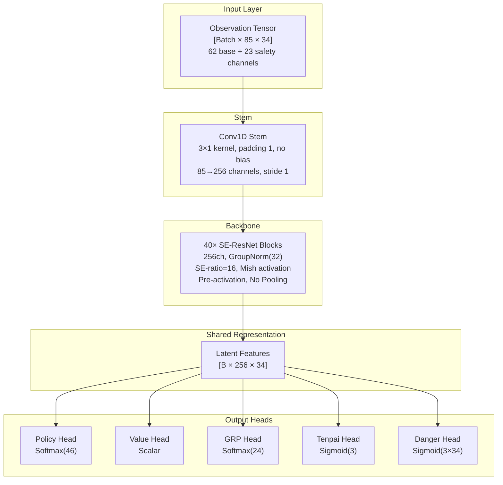
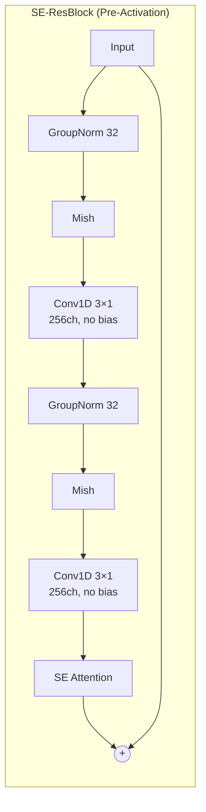
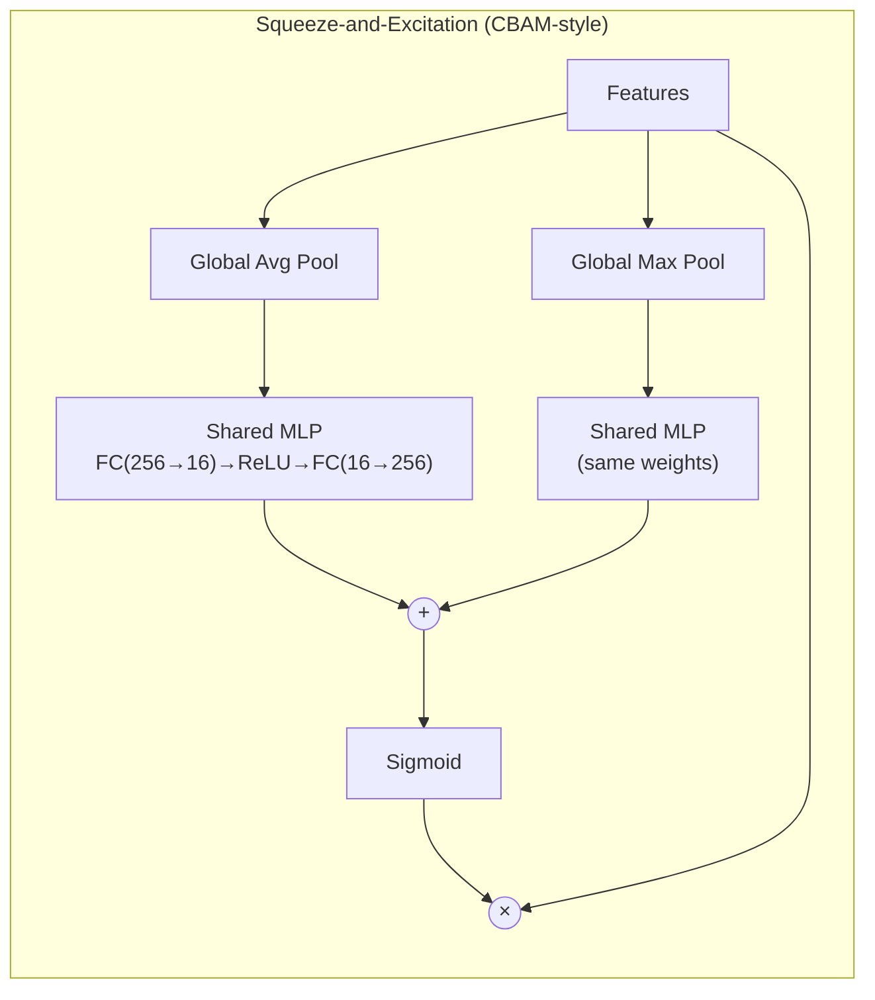
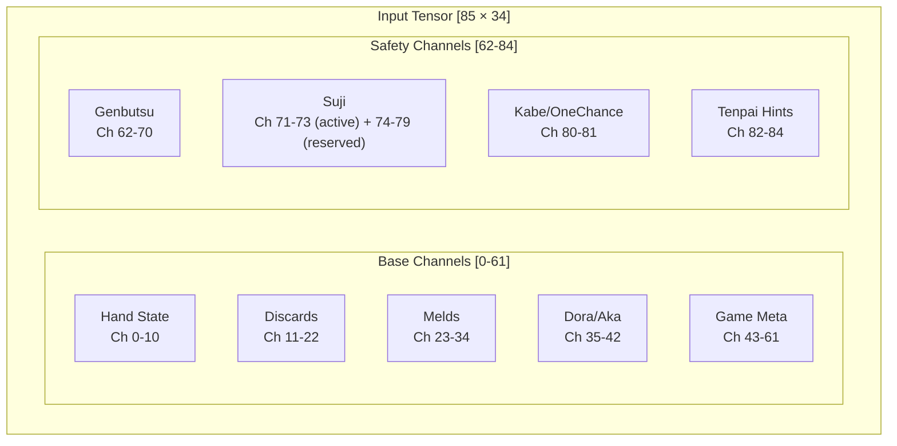
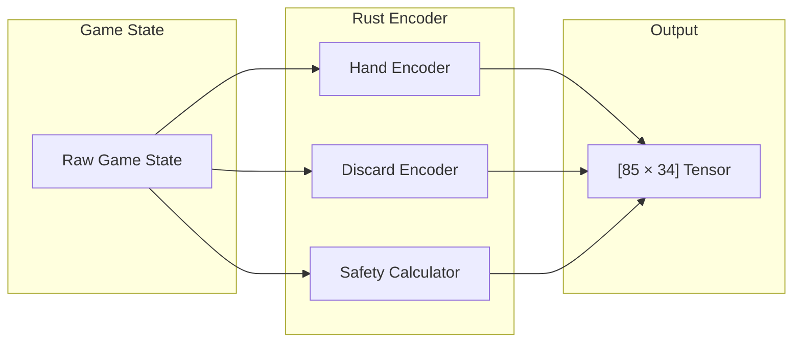
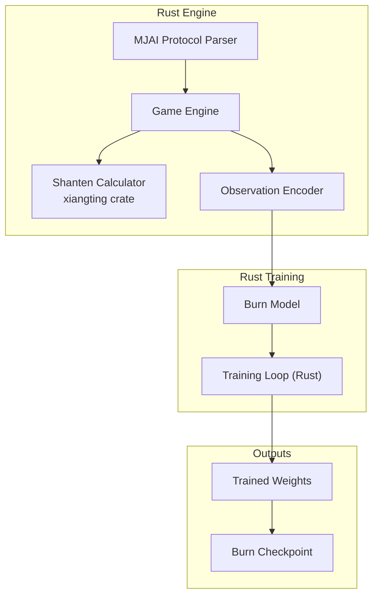

# Hydra Architecture Specification

> **HISTORICAL ARCHITECTURE SNAPSHOT — DO NOT IMPLEMENT FROM THIS FILE.**
>
> This doc = old Hydra design: 5 heads + inference search. Keep for legacy rationale/reference. **Not** current impl authority.
>
> Use these docs when coding:
>
> 1. `research/agent_handoffs/ARCHIVE_CANONICAL_CLAIMS.jsonl` — canonical archive SSOT / upstream research intake
> 2. `research/design/HYDRA_FINAL.md` and `research/design/HYDRA_RECONCILIATION.md` — promoted doctrine summaries
> 3. `docs/GAME_ENGINE.md` and current code — current engine/runtime baseline

Riichi Mahjong AI targeting LuckyJ (Tencent, 10.68 stable dan) via proven methods, opponent-aware features, inference search. Near-term goal: beat Mortal, Suphx, NAGA.

---

## Related Documents

- [../agent_handoffs/ARCHIVE_CANONICAL_CLAIMS.jsonl](../agent_handoffs/ARCHIVE_CANONICAL_CLAIMS.jsonl) — canonical archive SSOT / upstream research intake
- [HYDRA_FINAL.md](HYDRA_FINAL.md) — promoted architecture doctrine summary
- [HYDRA_RECONCILIATION.md](HYDRA_RECONCILIATION.md) — promoted operational doctrine summary and roadmap to Hydra v1
- [../infrastructure/INFRASTRUCTURE.md](../infrastructure/INFRASTRUCTURE.md) — infrastructure reference (legacy parts marked)

- Historical MORL placement note — no standalone `MORL_PLACEMENT.md` in repo.
---

## Use This File Only For

- historical architecture context
- preserved alt ideas that may return
- rationale comparison vs active HYDRA-OMEGA plan

Do **not** use this file as current impl spec for model shape, training loop, runtime behavior.

## Executive Summary

| Metric | Target | Justification |
|--------|--------|---------------|
| **Parameters** | ~16.5M | Breakdown: 67K stem + 16.1M backbone + 372K heads (see Parameter Budget) |
| **Inference VRAM** | <1.5GB | Fits 8GB consumer GPUs |
| **Inference Latency** | <15ms | Far under 50ms limit |
| **Training VRAM** | <4GB active | Fits RTX PRO 6000 Blackwell (96GB) with huge headroom |
| **Target Strength** | Rival LuckyJ | Beat Mortal (~7-dan), approach LuckyJ-level play (10+ stable dan on Tenhou). See [COMMUNITY_INSIGHTS § LuckyJ](../intel/COMMUNITY_INSIGHTS.md#4-luckyj-tencent) for competitive read. |

> **Note on parameter count:** Each SE-ResBlock has ~402K params (2× Conv1d(256,256,k=3) + 2× GroupNorm + SE). 40 blocks × 402K ≈ 16.1M backbone. Heads add ~372K. Hydra (~16.5M) is ~50% larger than Mortal (~10.9M at 192ch/40 blocks), giving more capacity for five heads and safety encoding.

---

## Design Principles

1. **Proven over Novel** — Prefer published evidence (Suphx, Mortal). Novel parts (safety planes, danger head) stay grounded in Mahjong theory.
2. **Practical Constraints** — Must fit <8GB inference VRAM, <50ms latency.
3. **Clean IP** -- No Mortal-derived code (AGPL restriction). All code scratch-written. hydra-core = BSL-1.1, hydra-engine = Apache-2.0, deps = MIT/Apache.
4. **100% Rust** — Engine, training, inference all Rust. Burn + burn-tch (libtorch/cuDNN). See [../infrastructure/RUST_STACK.md](../infrastructure/RUST_STACK.md).

---

## Target Ruleset: Tenhou Houou 4-Player (鳳凰卓 四人打ち)

Hydra targets **Tenhou ranked 4-player (dan-i-sen)** ruleset in Houou lobby. This is LuckyJ's arena and source of all training data (2M+ Tenhou Houou games). Engine MUST match rules exactly. Drift corrupts labels and scoring validation.

**Sources:** [Tenhou Official Manual](https://tenhou.net/man/) § RULE (段位戦四人打ち), [riichi.wiki/Tenhou.net_rules](https://riichi.wiki/Tenhou.net/rules).

### Scoring Edge Cases

| Rule | Tenhou Value | Notes |
|------|-------------|-------|
| Kiriage mangan | **No** | 4 han 30 fu = 7700, 3 han 60 fu = 7700. No round-up to mangan. Kiriage = jansou-only. |
| Kazoe yakuman | **Yes** | 13+ han (excluding yakuman patterns) scores yakuman. |
| Multiple yakuman | **Yes (additive)** | Distinct yakuman stack additively (e.g., daisangen + tsuuiisou = double yakuman = 64000/96000). Each pattern = one yakuman; no single pattern is double by itself. |
| Open tanyao (kuitan) | **Yes** | Kuitan ari default Houou setting with aka-dora. |
| Renhou | **No** | Not recognized yaku. Explicitly excluded with paarenchan and other optional yaku. |
| Paarenchan | **No** | Not recognized yaku. Eight dealer wins gets no special score. Honba no cap. |

### Game Flow Rules

| Rule | Tenhou Value | Notes |
|------|-------------|-------|
| Starting points | **25000** | Per player. Table total = 100000. |
| Return (oka) | **30000** | 1st gets 20000 oka bonus (4 × 5000 diff from start). |
| Tobi (bankruptcy) | **Yes** | Game ends at score below 0. Exactly 0 does **not** trigger tobi. |
| Agari yame | **Yes (automatic)** | In all-last, if dealer is 1st, game auto-ends on dealer win or dealer tenpai at exhaustive draw. Added 2010/06/01. |
| Uma | **Configurable** | Training: [3, 1, -1, -3]. Evaluation: [90, 45, 0, -135] (Tenhou Houou style). Historical `TRAINING.md` placement-point links gone from repo. |

### Tile and Dora Rules

| Rule | Tenhou Value | Notes |
|------|-------------|-------|
| Aka-dora (red fives) | **Yes (3 tiles)** | One red 5m, one red 5p, one red 5s. Each = +1 han. |
| Ura-dora | **Yes** | Revealed after riichi win. |
| Ippatsu | **Yes** | Win within one turn cycle after riichi (before next draw, no intervening call). |
| Kan-dora flip timing | **Immediate for ankan; after discard for minkan/kakan** | Ankan: reveal new indicator immediately. Minkan/kakan: reveal after player's discard following rinshan draw. |

### Abortive Draws

| Rule | Tenhou Value | Notes |
|------|-------------|-------|
| Kyuushu kyuuhai | **Yes** | First-turn 9+ unique terminal/honor tiles; player may abort. Action 44 in Hydra mapping. |
| Suufon renda | **Yes** | All four players discard same wind on first turn (no calls). |
| Suucha riichi | **Yes** | All four players declare riichi. |
| Suukaikan | **Yes** | Four kans across multiple players triggers abort. One player holding all four kans does **not** abort — they keep drawing dead wall normally. |
| Sanchahou (triple ron) | **Yes** | Three players ron same discard. Hand aborted. |
| Nagashi mangan | **Yes** | Checked at exhaustive draw. Tsumo-style payment (dealer pays more). All discards must be terminals/honors and uncalled. |

### Calling Restrictions

| Rule | Tenhou Value | Notes |
|------|-------------|-------|
| Kuikae (swap call) | **Banned** | After chi/pon, cannot discard tile completing same sequence/group. Both genbutsu-kuikae (exact tile) and suji-kuikae (sequence swap) banned. |

> **Ruleset as code:** Engine `rules.rs` module ([INFRASTRUCTURE.md § Module Structure](../infrastructure/INFRASTRUCTURE.md#module-structure)) should expose these as constants, not toggles. Tenhou Houou rules = only training/eval target. Future Majsoul or WRC work can swap constants per-build; runtime rule switching unnecessary.

## Architecture Overview

Hydra uses **Unified Multi-Head SE-ResNet**. One deep conv backbone extracts game-state features; five specialized heads branch from shared latent and emit all outputs together.

Input observation tensor shape = `[Batch × 85 × 34]`, encoding 85 channels over 34 tile types. Conv stem projects to 256 channels with 3×1 kernel. Representation then passes through 40 pre-activation SE-ResNet blocks with GroupNorm, Mish, two 3×1 convs, and squeeze-excitation gate, yielding shared latent `[B × 256 × 34]`. No pooling anywhere in backbone; full 34-tile geometry preserved.

For Phase 2 Oracle Distillation, Teacher uses same backbone but wider stem: `Conv1d(290, 256, 3)` instead of `Conv1d(85, 256, 3)`. 290-channel input = public observation (85ch) + oracle observation (205ch: opponent hands, wall order, dora/ura indicators). All 40 ResBlock weights stay identical/transferable between teacher and student; only stem Conv1d differs. Older `TRAINING.md` oracle-distillation link no longer exists in repo.

From this shared rep, heads operate from backbone: Policy selects next action, Value estimates expected round outcome, GRP predicts final placement distribution, Tenpai estimates opponent tenpai probabilities, Danger estimates per-tile deal-in risk per opponent. Baseline five heads run in parallel. When extended heads are active (call-intent, wait-set, value-tenpai, Sinkhorn), call-intent runs first and conditions Danger via FiLM — tiny sequential dependency, negligible latency (~0.1ms). See [OPPONENT_MODELING § 4.7](OPPONENT_MODELING.md#47-call-intent--yaku-plan-inference-head) for detail.

---

## Backbone Specification

### Why SE-ResNet?

SE-ResNet captures global board state (e.g., expensive field, dora density) via channel-wise squeeze-excitation while keeping spatial tile geometry needed for shape reading. Mortal already uses dual-pool SE-style channel attention (`model.py:L10-28`, at commit `0cff2b5`); Hydra keeps this proven design but swaps BatchNorm for GroupNorm for batch-size independence in RL. Suphx uses plain deep residual CNN without channel attention.

| Architecture | Pros | Cons | Used By |
|--------------|------|------|---------|
| ResNet | Fast, proven for spatial | Weak global context | Suphx (50 blocks, 256 filters) |
| ResNet + Channel Attention | Global context via squeeze-excite | Slightly more params | Mortal v1–v4 (dual-pool SE) |
| Transformer | Long-range deps | ~90-310M params (45-155× larger than ResNet); no published mahjong performance despite multi-year Kanachan dev (public repo created 2021-08-05); impractical for online RL self-play | Kanachan (no results), Tjong |
| Hybrid | Best of both | Complex, unproven | — |

### Block Structure

Each SE-ResNet block uses pre-activation order: GroupNorm → Mish → Conv1D → GroupNorm → Mish → Conv1D → SE Attention → residual add. Both convs use 3×1 kernels with padding 1 and no bias (GroupNorm handles centering). Residual path bypasses full block, preserving gradient flow through 40 layers.

### SE Attention Module

Squeeze-excitation uses dual-pool channel attention (inspired by CBAM channel attention, Woo et al. 2018), matching Mortal exactly. Feature tensor is avg-pooled and max-pooled separately to one value per channel, each passed through **shared MLP** (same weights both paths), then **element-wise added** (not concatenated) before sigmoid. So FC input dim stays C, not 2C, and bottleneck = C/r = 256/16 = **16**.

### Key Design Choices

| Choice | Value | Rationale |
|--------|-------|-----------|
| Blocks | 40 | Suphx uses 50; 40 balances depth and budget at 256ch |
| Channels | 256 | Capacity/speed balance |
| Normalization | GroupNorm(32) | No batch-size dependence; stable for small batches and RL |
| Activation | Mish | Used in Mortal v2–v4. Smooth gradients help deep RL. |
| Pooling | None | Preserves 34-tile spatial semantics (see below) |
| SE Ratio | 16 | Standard, proven ratio |

### Dropout Policy

No dropout in backbone architecture. During training (Phase 1 supervised, Phase 2 distillation), dropout 0.1 is applied after residual add in each SE-ResBlock for regularization. Dropout off at inference. Note: Suphx's perfect feature dropout for oracle guiding is different; it masks oracle inputs, not standard layer dropout.

### No-Pooling Rationale

Pooling destroys tile identity. In Mahjong:
- 1m ≠ 2m
- 234m ≠ 345m
- Position in 34-tile array carries meaning

Both Suphx and Mortal explicitly avoid pooling. 34-position axis stays intact from input through backbone. Only output heads pool where global aggregation makes sense (Value Head, GRP Head).

### Parameter Budget

| Component | Parameters | Percentage | Status |
| ----------- | ---------- | ---------- | ------ |
| Stem Conv (85->256, k=3, pad=1, no bias) | ~66K | 0.4% | Baseline |
| ResNet Backbone (40 blocks x ~402K) | ~16.1M | 96.8% | Baseline |
| Policy Head | ~117K | 0.7% | Baseline |
| Value Head | ~132K | 0.8% | Baseline |
| GRP Head (internal placement aux) | ~106K | 0.6% | Baseline |
| Tenpai Head | ~17K | 0.1% | Baseline |
| Danger Head | 771 | <0.1% | Baseline |
| Wait-Set Belief Head | 771 | <0.1% | Extended ([OPPONENT_MODELING S 4.6](OPPONENT_MODELING.md#46-wait-set-belief-head-extended-opponent-modeling)) |
| Value-Conditioned Tenpai Head | ~17K | 0.1% | Extended ([OPPONENT_MODELING S 3.7](OPPONENT_MODELING.md#37-value-conditioned-tenpai-threat-severity)) |
| Call-Intent / Yaku-Plan Head | ~18K | 0.1% | Extended ([OPPONENT_MODELING S 4.7](OPPONENT_MODELING.md#47-call-intent--yaku-plan-inference-head)) |
| Sinkhorn Tile Allocation Head | ~1K | <0.1% | Extended ([OPPONENT_MODELING S 7.6](OPPONENT_MODELING.md#constraint-consistent-belief-via-sinkhorn-projection-tile-allocation-head)) |
| **Total (Student, baseline 5 heads)** | **~16.5M** | -- |                                                                                                                                |
| **Total (Student, all 9 heads)** | **~16.6M** | **100%** |                                                                                                                                |

> Backbone dominates budget. Head overhead is tiny (~2.5% total for all 9 heads), so full extended head set adds opponent modeling at near-zero param cost. Extended heads are ablation-gated and may land incrementally; standalone `ABLATION_PLAN.md` no longer exists in repo.

**Oracle Teacher stem:** `Conv1d(290, 256, 3)` = ~223K params (vs student ~66K). Teacher total ≈ ~16.7M, only +157K (+0.95%). All other weights shared.

---

## Output Heads

### Policy Head (Actor)

**Purpose:** Pick next action — discard, call (chi/pon/kan), declare riichi, or win.

**Output shape:** 46-dim logit vector, legal-action masked, then softmax.

**Architecture:** 1×1 conv reduces 256-channel latent to 64 channels, then flatten (64 × 34 = 2,176 features) and FC to 46 action logits. Illegal actions masked to negative infinity before softmax.

**Action space (46 actions, Mortal-compatible mapping):**

| Range | Count | Action |
|-------|-------|--------|
| 0–36 | 37 | Discard tile (34 base types + 3 aka-dora variants: red 5m=34, red 5p=35, red 5s=36). Indices 0–36 also serve as tile select in kan two-phase system (see below). |
| 37 | 1 | Riichi declaration |
| 38–40 | 3 | Chi (left/mid/right) |
| 41 | 1 | Pon |
| 42 | 1 | Kan (covers daiminkan, ankan, kakan — tile select via two-phase, see below) |
| 43 | 1 | Agari (win: tsumo or ron, context-determined) |
| 44 | 1 | Ryuukyoku (draw declaration: kyuushu kyuuhai) |
| 45 | 1 | Pass (decline call/win chance) |

**Two-phase composite actions (matching Mortal's proven approach):**

Riichi and kan require choosing WHICH tile to discard/use, so one 46-action pass is insufficient. Mortal solves this with two-phase system (verified from `libriichi/src/state.rs` and `mortal/model.py`, commit `0cff2b5`):

1. **Riichi:** If agent picks action 37, environment presents SECOND decision where legal actions are subset 0–36 matching valid riichi discards (tiles whose discard leaves hand in tenpai). Agent chooses tile from this restricted set.
2. **Kan:** If agent picks action 42, environment sets `at_kan_select=true` and presents SECOND decision where legal actions are subset 0–36 matching tiles that can form kan. Agent chooses tile to kan.
3. **Agari:** Action 43 covers both tsumo and ron. Turn context decides which. No ambiguity.

This means Policy Head emits 46 logits per forward pass, but may be called TWICE for riichi or kan. Second pass reuses same network with updated observation (legal mask changes).

> **Source (Mortal):** Mortal uses this exact 46-action mapping: 0–36 discards (incl aka), 37 riichi, 38–40 chi, 41 pon, 42 kan (two-phase with `at_kan_select`), 43 agari, 44 ryuukyoku, 45 pass. See [MORTAL_ANALYSIS.md](../intel/MORTAL_ANALYSIS.md) for verified mapping.
> **Note:** Previous Hydra spec used different 46-action mapping (0–33 discards without aka, different call indices). This was updated to match Mortal's proven mapping for dataset compatibility and to fix aka-dora selectability issue found in external review.

### Value Head (Critic)

**Purpose:** Estimate expected round outcome for variance reduction in RL. Critic in actor-critic PPO.

**Output shape:** Scalar (expected round score or advantage).

**Architecture:** Global average pooling collapses spatial axis (256 × 34 → 256), then two-layer MLP (256 → 512 → 1) with ReLU. Scalar predicts expected point gain/loss from current state.

> **Oracle Critic (Phase 2–3 training only):** During RL, asymmetric oracle critic replaces this head. Oracle critic runs on **teacher** backbone (`Conv1d(290, 256, 3)` stem, taking 85 public + 205 oracle channels) and outputs **4 scalars** (one per player) with zero-sum aux loss enforcing V₁+V₂+V₃+V₄=0. Student's 1-scalar value head above is inference-only. Older `TRAINING.md` oracle-critic link no longer exists in repo.

### GRP Head (Global Rank Prediction)

**Purpose:** Predict final placement distribution across all four players. Enables placement-aware play: all-last pushes, feeding plays, blocking plays.

**Output shape:** 24-dim softmax (4! = 24 rank permutations).

**Design rationale:** Mortal introduced 24-way joint rank distribution to capture inter-player placement correlations (confirmed from `model.py:L233-249`, at commit `0cff2b5`). Four independent marginals lose this correlation info — e.g., if I get 1st, who gets 2nd? Suphx used different approach: scalar GRP predicting expected final reward via MSE regression with GRU encoder — rank-aware, but unable to capture inter-player correlation.

Hydra adopts Mortal's 24-way form but adds richer score context and uncapped score encoding. Mortal's documented Orasu weakness ("Orras cowardice") likely comes from dual-scale score capping (100K/30K channels) losing fine placement detail in high-scoring games, and reward shaping that under-penalizes 4th — not from GRP form itself.

**Architecture:** Global average pooling collapses backbone output (256 × 34 → 256), concatenate 16-dim score context vector, then three-layer MLP (272 → 256 → 128 → 24) with ReLU.

**Score context vector (16 dimensions):**
- Raw scores: 4 values (one per player, normalized by 100,000, uncapped)
- Relative gaps: 6 values (all pairwise score diffs)
- Overtake thresholds: 4 values (points needed to change each placement)
- Round/Honba: 2 values (progress context)

### Tenpai Head

**Purpose:** Estimate probability each opponent is in tenpai, including damaten. Explicit fix for Mortal's known damaten weakness.

**Output shape:** 3 sigmoid values (one per opponent).

**Architecture:** Global average pooling (256 × 34 → 256) then two-layer MLP (256 → 64 → 3) with ReLU and final sigmoid.

**Design rationale:** Riichi tenpai is trivial to detect. Damaten is dangerous case Mortal handles poorly. Tenpai head learns behavioral tells: tedashi patterns, discard timing, meld sequences correlated with hidden tenpai. During training, ground-truth labels come from Oracle data (teacher sees opponent hands).

### Danger Head

**Purpose:** Estimate deal-in probability for each tile, per opponent. Enables mawashi-uchi — avoid one dangerous opponent while still pushing vs others.

**Output shape:** 3 × 34 sigmoid values (per opponent, per tile type).

**Architecture:** 1×1 conv reduces 256 channels to 3 channels (one per opponent), producing `[B × 3 × 34]`. Sigmoid gives per-tile, per-opponent deal-in probabilities.

**Design rationale:** tile can be safe vs Player and deadly vs Player B. Per-opponent granularity is mandatory for correct defense. Mortal infers danger implicitly from Q-value differences; Hydra makes it explicit with dedicated head, giving interpretable danger signals and stronger defensive gradients.

---

## Input Encoding

### Overview

Observation tensor encodes full game state visible to current player. Hydra extends standard Mortal-style encoding with 23 explicit safety planes for opponent modeling.

**Total channels: 85** (62 base + 23 safety)

**Tensor shape:** `[Batch × 85 × 34]`

34-axis = tile types: 9 manzu (萬) + 9 pinzu (筒) + 9 souzu (索) + 7 jihai (字牌).

**Tile index mapping:**

| Index | 0–8 | 9–17 | 18–26 | 27–33 |
|-------|-----|------|-------|-------|
| Suit | Manzu (萬) | Pinzu (筒) | Souzu (索) | Jihai (字) |
| Tiles | 1–9m | 1–9p | 1–9s | ESWN白發中 |

### Base Channels (0–61)

#### Hand State (Channels 0–10)

| Channel | Content | Encoding |
|---------|---------|----------|
| 0–3 | Closed hand tile count | 4 binary thermometer planes (≥1, ≥2, ≥3, =4 copies). If holding 3 copies, channels 0,1,2 = 1.0, channel 3 = 0.0. Matches Mortal, Suphx, Mjx. |
| 4–7 | Tiles in open melds | Count per tile type (4 thermometer planes) |
| 8 | Drawn tile indicator | 1 binary one-hot channel marking just-drawn tile. Hydra-original add — Mortal lacks this; Mjx-small has it (channel 15). Gives direct tsumo-decision signal. |
| 9 | Keep-shanten discards | Binary mask: tiles whose discard keeps current shanten. Derived from Mortal's `keep_shanten_discards` (`obs_repr.rs` L451, at commit `0cff2b5`). More actionable than raw shanten value. |
| 10 | Next-shanten discards | Binary mask: tiles whose discard lowers shanten by 1. Derived from Mortal's `next_shanten_discards` (`obs_repr.rs` L457, at commit `0cff2b5`). |

#### Discards per Player (Channels 11–22)

Three channels per opponent (12 total), encoding not only discarded tiles but also how and when:

| Sub-channel | Content |
|-------------|---------|
| 0 | Tile presence in discard pile |
| 1 | Tedashi flag (from hand vs tsumogiri) |
| 2 | Temporal weight (exp decay) |

**Temporal weighting formula:**

$$w = e^{-0.2 \times (t_{\max} - t_{\text{discard}})}$$

Recent discards weigh more. Critical for intent reading — early discards reveal less about current hand than recent ones.

#### Melds per Player (Channels 23–34)

Three channels per player (12 total):

| Sub-channel | Content |
|-------------|---------|
| 0 | Chi (sequence) tiles |
| 1 | Pon (triplet) tiles |
| 2 | Kan (quad) tiles |

#### Dora and Aka (Channels 35–42)

| Channel | Content |
|---------|---------|
| 35–39 | Dora indicator tiles (up to 5 indicators, thermometer binary). Standard riichi reveals 1 initial + up to 4 after kans = 5 total. |
| 40–42 | Red five (aka) in hand — 3 binary channels, one per suit (5m-red, 5p-red, 5s-red). All-1 or all-0 plane per channel. Matches Mortal's `akas_in_hand[3]` and Mjx-large encoding. Standard Riichi has only 3 aka-dora; no 4th channel needed. Aka visibility in melds/discards is encoded in those blocks. |

#### Game Metadata (Channels 43–61)

| Channel | Content |
|---------|---------|
| 43–46 | Riichi status per player (binary) |
| 47–50 | Scores (normalized, **uncapped**) |
| 51–54 | Relative score gaps (to each rank) |
| 55–58 | Shanten (one-hot over 4 values: 0=tenpai, 1, 2, 3+). Single scalar = min(normal, chiitoitsu, kokushi). Matches Mortal and Mjx convention. Encoded once here — not duplicated in Hand State. Per-type split unnecessary; network can infer winning-form proximity from tile counts. |
| 59 | Round number (normalized) |
| 60 | Honba (rescaled: honba/10, capped at 10). **Separate from kyotaku** — combining loses which affects what (honba changes deal-in payment, kyotaku is pot). Mortal v4 encodes them separately. |
| 61 | Kyotaku (rescaled: kyotaku/10, capped at 10). |

### Score Encoding (Critical Difference from Mortal)

Mortal v4 uses dual-scale score encoding: one channel normalized by 100,000 (coarse info up to 100K) and second normalized by 30,000 (higher resolution in common range). So info above 30K is degraded, not lost — player with 60,000 scores 0.6 in 100K channel vs 0.3 for 30K, but both saturate at 1.0 in 30K channel. (Source: `obs_repr.rs:L149-164`, at commit `0cff2b5`)

Hydra uses uncapped scores with three complementary views:

- **Raw score:** Normalized by 100,000 (approx realistic max game score). No cap.
- **Relative gaps:** `(my_score − other_score) / 30,000` for all pairwise comparisons. Preserves fine placement detail.
- **Overtake thresholds:** Points needed to change placement vs each opponent. Directly encodes "what needed for 2nd?"

### Safety Channels (62–84)

These are novel additions for explicit opponent modeling. Standard Mahjong defense relies on genbutsu, suji, kabe, one-chance analysis. Mortal learns these implicitly; Hydra precomputes them as input features to speed learning and improve defense accuracy.

#### Genbutsu (Channels 62–70)

100% safe tiles guaranteed by furiten — any tile opponent has discarded (discard furiten), plus any tile discarded by any player after that opponent declared riichi (riichi furiten).

Three channels per opponent (9 total), encoding three distinct safety signals:

| Sub-channel | Content | Encoding |
|-------------|---------|----------|
| +0 | All genbutsu | Binary mask: 1 if tile is 100% safe vs this opponent (union of discard-furiten and riichi-furiten genbutsu) |
| +1 | Tedashi genbutsu | Binary mask: subset of +0 where tile was tedashi by this opponent. Carries hand-shape signal — tedashi means opponent considered and rejected this tile. |
| +2 | Riichi-era genbutsu | Binary mask: subset of +0 where tile became safe AFTER this opponent declared riichi. Non-zero only if opponent is in riichi. Separates pre-riichi safety (mutable hand) from post-riichi safety (locked hand). |

> See [OPPONENT_MODELING § 2.1 Genbutsu](OPPONENT_MODELING.md#21-genbutsu-絶対安全牌--channels-6270) for calculation flow, Mermaid diagram, rationale. No existing mahjong AI (Mortal, Suphx, Kanachan) precomputes genbutsu channels — Hydra does by design.

#### Suji (Channels 71–79)

Suji (筋) defense logic — tiles linked numerically to opponent discards, ruling out some waits.

| Suji Type | Pattern |
|-----------|---------|
| 1-4-7 | If 4 discarded, 1 and 7 safer (no 1-4 or 7-4 two-sided wait) |
| 2-5-8 | If 5 discarded, 2 and 8 safer |
| 3-6-9 | If 6 discarded, 3 and 9 safer |

Three active channels (Ch 71-73), one per opponent. Float value: suji safety score 0.0 to 1.0. Channels 74-79 reserved for future suji context features (half-suji, no-chance-suji, matagi-suji).

#### Kabe and One-Chance (Channels 80–81)

| Channel | Content | Logic |
|---------|---------|-------|
| 80 | Kabe (壁) | All 4 copies visible → no-chance wait using that tile |
| 81 | One-chance | 3 copies visible → low chance tile is in wait |

#### Tenpai Hints (Channels 82–84)

| Channel | Content |
|---------|---------|
| 82 | Opponent 1 riichi or high-probability tenpai |
| 83 | Opponent 2 riichi or high-probability tenpai |
| 84 | Opponent 3 riichi or high-probability tenpai |

Initially filled from riichi status (binary). During inference, these channels can be augmented by Tenpai Head predictions, creating feedback loop where model's own reads inform defensive encoding.

### Tedashi vs. Tsumogiri Encoding

This split is critical for damaten detection. Tedashi (手出し) = discard from hand; player kept draw and threw another tile, so hand changed. Tsumogiri (ツモ切り) = discard just-drawn tile; hand unchanged.

**Key pattern:** Three or more consecutive tsumogiri then tedashi often signals tenpai — player waited for useful draw, got it, rearranged hand.

Each discard in channels 11–22 includes:
- Tile identity
- Tedashi flag
- Temporal position (exp decay weighting)

> **Note:** Post-call flag (whether discard followed meld call) is not in base 85-channel encoding. GRU-based extension existed in older ablation-plan material, but standalone `ABLATION_PLAN.md` no longer exists in repo.

### Data Flow

Encoder runs in Rust for speed. Safety calculations (suji, kabe, genbutsu) are precomputed at game start and updated incrementally on each event (discard, call, kan), avoiding redundant recompute.

---

## Inference Optimization

### Deployment Configuration

Inference runs in bf16 with Burn's burn-tch backend (libtorch/cuDNN). For burn-cuda upgrade path, CubeCL JIT provides kernel fusion.

### VRAM Breakdown

| Component | Size |
|-----------|------|
| Weights (FP16) | ~33MB |
| Activations | ~200MB |
| CUDA context | ~800MB |
| **Total** | **~1.0GB** |

Safely within <1.5GB target; fits 8GB consumer GPUs easily.

### Latency Breakdown (Estimated Targets)

> **Note:** These are design targets from comparable architectures (Mortal, Suphx), not measured benchmarks. Real benchmarks will be established during Milestone 2.

| Component | RTX 3070 (est.) | RTX 4090 (est.) |
|-----------|----------|----------|
| Feature extraction (Rust encoder) | 2–3ms | 2–3ms |
| ResNet forward pass | 5–8ms | 1–2ms |
| Heads forward pass | 1–2ms | <1ms |
| **Total** | **8–13ms** | **3–5ms** |

Both stay well under 50ms online-play limit. Batch-1 throughput on RTX 3070 ≈ 100 decisions/sec.

---

## System Overview

| Feature | Mortal | Hydra |
|---------|--------|-------|
| Opponent modeling | None (SinglePlayerTables) | Oracle distillation + tenpai/danger heads |
| Safety logic | Implicit (learned from data) | Explicit 23-plane input encoding (channels 62–84) |
| Damaten detection | Poor (documented weakness) | Dedicated tenpai predictor head |
| Score encoding | Dual-scale (100K/30K channels, degraded above 30K) | Uncapped + relative gaps + overtake thresholds |
| Training algorithm | DQN + CQL (offline RL) | PPO + League (online RL) |
| Normalization | BatchNorm | GroupNorm (batch-size independent) |
| Deal-in avoidance | Implicit Q-value differences | Explicit danger head (per-opponent, per-tile) |
| Backbone | ResNet + dual-pool SE (Channel Attention) | SE-ResNet (same dual-pool SE, GroupNorm instead of BatchNorm) |
| GRP formulation | 24-way joint distribution (dual-scale scores) | 24-way joint distribution (uncapped scores + score context vector) |
| Parameters | ~10.9M (192ch) | ~16.5M (256ch) |
| Activation | Mish | Mish (same) |

---

## Licensing Constraints

**Critical constraint:** Mortal uses restrictive license (AGPL + extra restrictions). Hydra must not fork or derive from Mortal codebase, use libriichi directly, or release weights trained on Mortal-derived code.

Hydra may reference Mortal's published *techniques* (from papers/docs) but must write all code from scratch.

**Options:**

| Option | Pros | Cons |
|--------|------|------|
| **Build from scratch** | Full control, clean IP | Most dev effort |
| **Use Mjx (JAX)** | Fast GPU simulator, MIT license | Python/JAX-only ecosystem |
| **Use riichi-rs** | Rust, permissive license | Less mature |
| **Use Mjai protocol only** | Interface standard, no code copying | Still need own engine |

**Recommended approach:** Build custom Rust engine with Burn for training and inference. Gives full control, clean IP, performance needed for high-throughput self-play.

**Dependency licenses:**
- xiangting (MIT) — Shanten calculation
- burn (Apache-2.0/MIT) — Deep learning framework
- burn-tch (Apache-2.0/MIT) — libtorch backend
---

---

## System Overview

