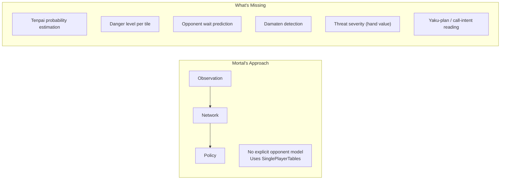
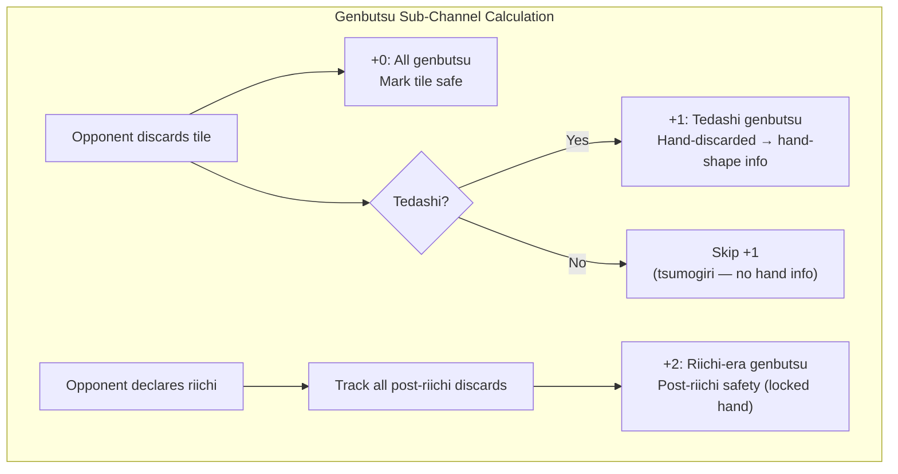
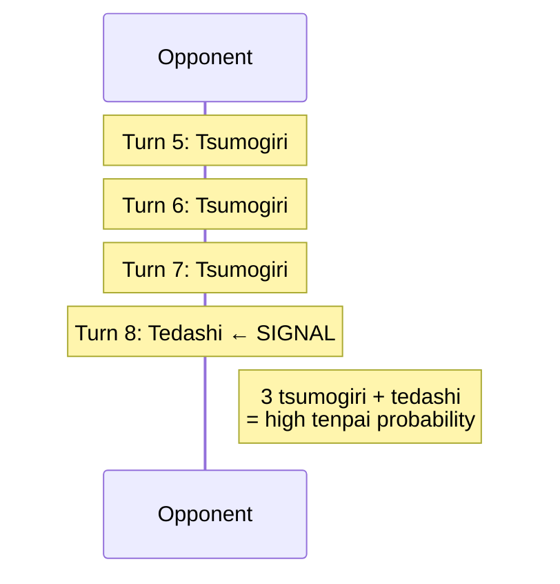
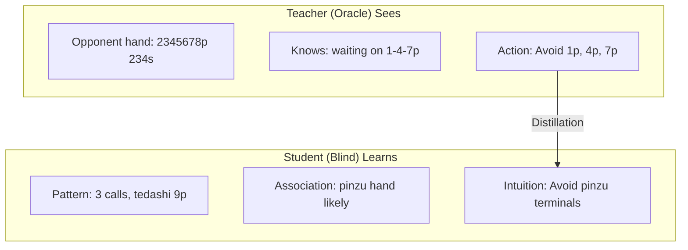

# Hydra Opponent Modeling

Opponent modeling = Hydra main edge vs existing Mahjong AI. Doc covers full stack: explicit safety planes, auxiliary prediction heads, implicit learning via oracle distillation.

---

## 1. The Problem: Why Current AIs Fail at Opponent Modeling

### Mortal's Blind Spot

> **Ownership note:** This doc = detailed rationale/reference for opponent modeling. Active-path priority = `HYDRA_RECONCILIATION.md`. Shipped-now truth = `docs/CURRENT_STATUS.md`. Live runtime/channel truth = `docs/GAME_ENGINE.md` + current code.

> Reserve/future ideas stay here as rationale. Description here alone does not activate them.

Mortal uses `SinglePlayerTables` for EV, assumes no opponent interaction. No pre-computed safety features (suji, kabe, genbutsu), no opponent tenpai estimate, no aggression/tendency profiling. Network must learn all opponent-relevant patterns implicitly from raw channels. Evidence says it fails hardest cases.



### Evidence from the Community

**Damaten detection failures** = Mortal most-cited weakness in JP mahjong community. Reports say Mortal often deals into obvious damaten because it has no explicit tenpai detector. AI relies on explicit signals like riichi/open melds. Silent tenpai gives it no mechanism to sense raised danger.

Specific documented issues:

- **GitHub Issue #111** — Overtake score miscalc; Mortal too safe while trailing, misses overtake lines, partly because it cannot read opponent danger well.
- **GitHub Discussion #102** — Equim-chan (Mortal creator) said oracle guiding "didn't bring improvements in practice" and removed it in v3, replaced by next-rank prediction aux task (`AuxNet` in `mortal/model.py`; rationale in Discussion #52). Suggests Mortal architecture may not benefit cleanly from opponent-aware signals.

**Community-identified weaknesses tied to opponent reading:**

1. **Early riichi push errors** — Underestimates early (turn 1–6) riichi threat, pushes with weak hands into unknown waits.
2. **Damaten detection failures** — No silent-tenpai intent reading. Relies on explicit signals (riichi, melds). Deals into high-value silent hands.
3. **Coarse placement sensitivity** — Similar playstyle regardless of point spread; poor aggression adjustment by opponent danger.
4. **場況 (bakyou) blindness** — Weak field-status/table-flow reading, noted in JP mahjong blogs on Note.com and Reddit r/Mahjong.

### What Hydra Adds

Hydra fills opponent-model gap via shipped rationale + later extensions:

1. **Explicit Safety Planes** — core Hydra opponent-read rationale with shipped baseline encoding support
2. **Tenpai Predictor Head** — rationale for opponent-readiness prediction
3. **Danger Head** — rationale for per-tile defensive modeling
4. **Value-Conditioned Tenpai** — later extension unless promoted by current doctrine (§ 3.7)
5. **Wait-Set Belief Head** — later extension unless promoted by current doctrine (§ 4.6)
6. **Call-Intent Head** — later extension unless promoted by current doctrine (§ 4.7)
7. **Oracle Distillation** — later extension; impl priority still comes from `HYDRA_RECONCILIATION.md`

---

## 2. Safety Planes: Explicit Defensive Encoding

> Live channel-level summary: [docs/GAME_ENGINE.md § Baseline Prefix Channel Layout](../../docs/GAME_ENGINE.md#baseline-prefix-channel-layout-channels-0-84) + safety-system section there. This file gives deeper rationale + encoding logic.

Hydra reserves 23 input channels (62–84) for safety info, absent from Mortal's 1012-channel encoding. These planes pre-compute classic JP mahjong defense concepts, giving structured safety data instead of forcing network rediscovery.

> **Quantitative basis:** 23-channel safety encoding grounded in mahjong theory (genbutsu, suji, kabe = human defense core), but exact channel design (9 genbutsu, 9 suji, 2 kabe, 3 tenpai hints) and encoding choices (suji floats, 3 sub-channels per genbutsu opponent) come from domain analysis, not empirical ablation. Mortal gets ~11% deal-in with no explicit safety planes, learning implicitly from 1012 raw channels. Whether pre-computed safety beats implicit learning stays open empirical question; test through active ablation/testing process, not missing historical ablation-plan doc. Safety-plane design should be validated or revised from results. Conservative counts (9+9+2+3=23) chosen to keep parameter overhead tiny (~0% to backbone) while covering full human defensive vocabulary.

### 2.1 Genbutsu (絶対安全牌) — Channels 62–70

**Definition:** Tiles 100% safe vs specific riichi player. Any tile discarded by riichi player after riichi = genbutsu; they cannot win on tile they themselves threw after riichi.

**Encoding:** 9 binary channels, 3 per opponent. Three channels per opponent encode three distinct safety signals:

| Sub-channel | Content | Encoding |
|-------------|---------|----------|
| +0 | All genbutsu | Binary mask: 1 if tile 100% safe vs this opponent. Union of discard-furiten genbutsu (tile in their river) and riichi-furiten genbutsu (tile discarded by anyone after their riichi, not ron'd). |
| +1 | Tedashi genbutsu | Binary mask: subset of +0 where tile was hand-discarded (tedashi) by this opponent, not tsumogiri. Carries hand-shape info — tedashi means opponent evaluated and rejected tile. |
| +2 | Riichi-era genbutsu | Binary mask: subset of +0 where tile became safe AFTER this opponent declared riichi (any player's post-riichi discard). Non-zero only when opponent in riichi. Separates pre-riichi safety (mutable hand) from post-riichi safety (locked hand). |

**Calculation:**



**Why 3 channels per opponent, not 1:** Genbutsu itself binary, but sub-channel split gives pre-computed hand-reading signals. Tedashi genbutsu shows tiles opponent actively rejected from hand (matagi-suji and sotogawa inferences follow). Riichi-era genbutsu separates locked-hand time regime. Mirrors Mortal v4's 3-channel kawa summary (all discards / tedashi-only / riichi-tile) but pre-computes safety derivation. No known mahjong AI pre-computes genbutsu channels; Mortal, Suphx, Mjx rely on network deriving safety from raw discard data. Hydra explicit encoding = deliberate edge.

### 2.2 Suji (筋) — Channels 71–79

**Definition:** Probabilistic safety from ryanmen (two-sided) wait patterns. When opponent discards tile, certain numerically linked tiles become safer because common waits involving discarded tile become less likely.

**Logic:** Ryanmen links tiles in 1-4-7, 2-5-8, 3-6-9 sequences. If player discards one tile in sequence, paired tiles at opposite end get safer.

**Suji Logic Table:**

| Discarded Tile | Safer Tiles | Reasoning |
|----------------|-------------|-----------|
| 1 or 4 | 7 | No 4-7 ryanmen wait |
| 2 or 5 | 8 | No 5-8 ryanmen wait |
| 3 or 6 | 9 | No 6-9 ryanmen wait |
| 4 or 7 | 1 | No 1-4 ryanmen wait |
| 5 or 8 | 2 | No 2-5 ryanmen wait |
| 6 or 9 | 3 | No 3-6 ryanmen wait |

**Half-suji vs Full-suji:** Half-suji = only one side discarded. Full-suji = both sides visible, stronger safety.

**Encoding:** 9 float channels, 3 per opponent (one per suit: manzu, pinzu, souzu). Per-tile suji coverage:

For each opponent and each numbered tile (1–9) in each suit, count how many of that tile's suji pairs that opponent discarded:

| Suji pairs for tile | Pairs | Coverage value |
|---------------------|-------|----------------|
| 1 | (4) | 0.0 if neither 4 discarded; 1.0 if 4 discarded |
| 2 | (5) | 0.0 if neither 5 discarded; 1.0 if 5 discarded |
| 3 | (6) | 0.0 if neither 6 discarded; 1.0 if 6 discarded |
| 4 | (1, 7) | 0.0 / 0.5 / 1.0 for 0 / 1 / 2 partners discarded |
| 5 | (2, 8) | 0.0 / 0.5 / 1.0 for 0 / 1 / 2 partners discarded |
| 6 | (3, 9) | 0.0 / 0.5 / 1.0 for 0 / 1 / 2 partners discarded |
| 7 | (4) | 0.0 if neither 4 discarded; 1.0 if 4 discarded |
| 8 | (5) | 0.0 if neither 5 discarded; 1.0 if 5 discarded |
| 9 | (6) | 0.0 if neither 6 discarded; 1.0 if 6 discarded |

Tiles 1/2/3/7/8/9 have one suji partner, so binary (0.0 or 1.0). Tiles 4/5/6 have two partners, so use half-suji = 0.5 when one partner discarded. Honors 0.0 (no suji relation).

> **Design note:** This encoding purely structural (which tiles sit in discard pile), no temporal decay. Suji status does not change over time. Backbone learns weighting vs other signals (kabe, genbutsu, tedashi patterns). Mortal has no explicit suji channels; Hydra explicit encoding = hypothesis that pre-computed suji speeds safety learning and should be tested in active ablation/testing workflow.

**Caveats — Suji is NOT 100% safe:**

Suji only covers ryanmen waits. Opponents still can win with:

- **Kanchan (嵌張) waits** — Middle-tile waits (ex. waiting on 5 with 4-6 in hand) bypass suji.
- **Tanki (単騎) waits** — Pair waits on any tile, independent of suji.
- **Suji trap (筋引っ掛け)** — Intentional discard to bait false safety. Ex. cut 5 then wait on 2 via 1-2 kanchan or shanpon.

Suji lowers probability, not zeroes danger. Network must learn proper weighting vs other signals.

### 2.3 Kabe (壁) — Channel 80

**Definition:** When all 4 copies of tile are visible (discards, melds, own hand), certain sequence waits through that tile become impossible. This = kabe (wall), because tile blocks wait patterns.

**Kabe Status Table:**

| Visible Copies | Status | Reasoning |
|----------------|--------|-----------|
| 4 copies | Kabe (壁) — No-chance | No ryanmen or kanchan wait can pass through this tile |
| 3 copies | One-chance (ワンチャンス) | Only 1 copy remains; low probability it forms part of wait |

**Example:** If all 4 copies of 5p visible, no opponent can hold 3-6p or 4-5p or 5-6p sequence wait. Adjacent tiles become much safer.

**Encoding:** Channel 80 = float mask over 34 tile types, marking kabe (no-chance) status.

### 2.4 One-Chance (ワンチャンス) — Channel 81

When 3/4 copies of tile are visible, last copy makes waits through tile unlikely. Weaker than full kabe, still useful safety info.

**Encoding:** Channel 81 = float mask over 34 tile types, marking one-chance status.

### 2.5 Tenpai Hints — Channels 82–84

Three binary channels, one per opponent, indicating likely tenpai.

| Channel | Content |
|---------|---------|
| 82 | Opponent 1 riichi / high-probability tenpai |
| 83 | Opponent 2 riichi / high-probability tenpai |
| 84 | Opponent 3 riichi / high-probability tenpai |

**Two-phase encoding:**

- **Initially:** Filled from riichi status alone (binary: declared riichi or not).
- **At inference:** Updated by Tenpai Predictor Head output, enabling damaten detection. If head predicts high tenpai for non-riichi opponent, corresponding hint channel activates.

This feedback loop from aux head back into input encoding = key architecture feature. Network's own opponent-state predictions feed future decisions.

**Feedback loop impl detail:**

Feedback works **across sequential decisions within game**, not inside one forward pass (no double pass):

1. At decision time *t*, tenpai hint channels (82–84) set to `max(riichi_status[i], cached_tenpai_pred[i] > 0.5)` for each opponent *i*.
2. Model runs one forward pass, producing all head outputs including tenpai predictions `[p₁, p₂, p₃]`.
3. Tenpai predictions cached: `cached_tenpai_pred = [p₁, p₂, p₃]`.
4. At decision time *t+1*, step 1 uses cached predictions from *t*.

| Parameter | Value | Notes |
|-----------|-------|-------|
| Activation threshold | 0.5 | Binary boundary for tenpai hint channels |
| Forward passes per decision | 1 | No double-pass — feedback across time steps |
| Latency impact | Zero | Tenpai head output already computed in main forward pass |

**Training behavior:** During training with oracle/ground-truth tenpai labels, channels 82–84 use ground-truth tenpai status, not head predictions. Cached-prediction feedback loop activates only at inference. This avoids error accumulation in training while teaching correct use of tenpai hints.

---

## 3. Tenpai Predictor Head

### 3.1 Purpose

Estimate probability each opponent is in tenpai, especially damaten (silent tenpai). This = capability Mortal completely lacks: sensing when undeclared opponent finished hand.

### 3.2 Architecture

> Current target head family: [HYDRA_FINAL.md § 4.3 Heads](HYDRA_FINAL.md#43-heads-multi-task). Treat this section as rationale for tenpai head existence and target signals.

### 3.3 Key Input Features and Signals

Backbone should learn tenpai from multiple observable signals:

| Signal | Interpretation |
|--------|----------------|
| Tedashi after tsumogiri streak | Hand changed after period of no change → may have reached tenpai |
| No calls + fast discards | Building closed hand (menzen), suggests damaten potential |
| 3+ open melds | Likely tenpai with few tiles left in hand |
| Turn count + remaining discards | Late game + few tiles left = higher base tenpai probability |
| Discard patterns | Specific tile sequences imply hand shape and readiness |

### 3.4 Tedashi Pattern Detection

Tedashi (手出し) vs tsumogiri (ツモ切り) = main damaten signal:

- **Tedashi:** Discard chosen from hand, not just-drawn tile. Means active hand-shape change.
- **Tsumogiri:** Discard just-drawn tile. Means hand unchanged — player either waiting (tenpai) or stuck.



**Critical pattern:** Three+ consecutive tsumogiri (hand unchanged, player waiting or stuck) then sudden tedashi (active hand change) strongly suggests player completed hand — they drew improvement and swapped another tile out to reach tenpai.

This pattern is encoded in discard channels with explicit tedashi flag (sub-channel offset +1 per opponent in channels 11–22) and temporal exponential decay:

`weight = exp(-0.2 × (max_turn - discard_turn))`

Recent discards weigh more, making tsumogiri→tedashi transition more salient to network.

### 3.5 Training Signal

**Ground-truth labels (phase-specific):**

- **Phase 1 (Supervised):** Tenpai labels reconstructed from game logs. MJAI `start_kyoku` gives all 4 starting hands. By replaying draw/discard/call sequence, every opponent hand is reconstructible at every decision point. Compute shanten=0 for exact tenpai labels. These are ground-truth labels available **without oracle mode**.
- **Phase 2–3 (RL):** Oracle teacher sees opponent hands directly (205 oracle channels include opponent shanten and waits). Tenpai labels trivial from teacher observation.

In both phases, label = binary per opponent: 1 if tenpai, 0 otherwise.

**Loss function:** Binary Cross-Entropy per opponent:

`L_tenpai = -Σ [y_i × log(p_i) + (1 - y_i) × log(p_i)]`

where `y_i` = ground-truth tenpai status and `p_i` = predicted probability for opponent `i`.

**Loss weight in total training loss:** 0.05 (balances vs primary policy/value losses).

### 3.6 Integration with Other Heads

Tenpai Head feeds three downstream systems:

1. **Safety plane channels 82–84** — High tenpai probability activates hint channels, giving richer backbone input on later forward passes during multi-step reasoning.
2. **Danger Head** — Higher tenpai probability raises baseline danger for all tiles. Danger head uses tenpai predictions as context.
3. **Policy Head** — When tenpai detected, policy shifts toward risk-adjusted actions, favoring safer discards and defense.

### 3.7 Value-Conditioned Tenpai (Threat Severity)

Binary tenpai says "ready or not," not "how expensive?" 1-han tenpai and hidden mangan tenpai should yield different push/fold thresholds. Humans fold earlier when they smell honitsu/toitoi/dragon dora; binary head cannot separate them.

**Extension:** Add per-opponent hand-value classification head predicting expected hand value, conditioned on tenpai.

**Output:** `[B × 3 × V]` softmax, where V = count of value bins. Recommended bins:

| Bin | Point Range | Typical Hands |
|-----|-------------|---------------|
| 0 | <2000 | 1-han 30fu (1000/2000) |
| 1 | 2000–3900 | 2-han (2600/5200) |
| 2 | 3900–5200 | 3-han (3900/7700) |
| 3 | 5200–7700 | Mangan threshold (8000/12000) |
| 4 | 8000+ | Mangan and above (haneman, baiman, etc.) |

**Architecture:** GAP(256×34 → 256) → FC(256→64) → ReLU → FC(64→5×3) → Reshape to [B×3×5] → Softmax per opponent. Parameter cost: ~17K (+0.1% total model).

**Training signal:**
- **Phase 1:** At each timestep where opponent in tenpai, label with *eventual* winning hand value if opponent wins kyoku (from MJAI outcome). Mask loss when opponent not in tenpai or does not win. This adds survivorship bias (only winning hands labeled), but winning-hand value distribution is well characterized in mahjong stats.
- **Phase 2–3:** Oracle teacher sees actual hand and can compute exact hand value at every timestep, removing survivorship bias.
- **Loss:** Cross-entropy per opponent, masked to tenpai only. Weight: 0.02 (low, novel head).

**Integration:** Value-head output joins push/fold calculus with tenpai probability. Expected danger cost becomes:

`E[cost(a)] = Σ_i [p_tenpai(i) × p_danger_i(a) × E[value_i]]`

Where `E[value_i]` = expected hand value from bins. This replaces uniform danger weighting with threat-severity-aware defense.

> **Novelty note:** No published mahjong AI outputs opponent hand value explicitly. Community stats (ex. [houou-statistics](https://github.com/chienshyong/houou-statistics) on open tenpai value distributions and riichi winrate by han) show hand value varies strongly with observable signals (call patterns, dora visibility, discard shape). Value head makes this implicit knowledge explicit.

---

## 4. Danger Head

### 4.1 Purpose

Estimate deal-in probability for each possible discard tile. Given current state, Danger Head answers: "If I discard this tile now, what probability opponent wins on it?"

### 4.2 Architecture and Design Rationale

> Current target head family: [HYDRA_FINAL.md § 4.3 Heads](HYDRA_FINAL.md#43-heads-multi-task). Treat this section as rationale for keeping danger head per-opponent and per-tile.

Per-opponent granularity (3×34) is necessary for mawashi-uchi (回し打ち) — dodging one dangerous opponent while still pushing vs others. Aggregate 1×34 would throw away per-opponent info already encoded by backbone (genbutsu 62–70, suji 71–79, tenpai hints 82–84), creating information bottleneck.

**Why 3×34 over 1×34:**
- Tile can be safe vs Player (genbutsu) but deadly vs Player B — aggregate signal ambiguous
- Score-aware defense: dealing into 4th-place player differs strategically from dealing into 1st-place
- Parameter cost negligible: Conv1d(256→3) = 771 params vs Conv1d(256→1) = 257 params (+0.003% total)
- Training labels naturally per-opponent: each deal-in identifies actual winner
- Mortal encodes opponent info per-player (kawa, riichi, scores) — output should match

### 4.3 Output Interpretation

Output `[B × 3 × 34]` gives per-opponent, per-tile deal-in probabilities:

| Output Range | Interpretation |
|--------------|----------------|
| p < 0.05 | Safe tile vs this opponent — low deal-in risk |
| 0.05 < p < 0.15 | Moderate risk — consider hand value + game state |
| p > 0.15 | Dangerous — strong deal-in chance |

**Aggregation options at inference:**
- `max(dim=opponent)` → worst-case danger per tile (conservative)
- `weighted_sum(danger × tenpai_prob)` → expected danger weighted by tenpai probability (balanced)
- Per-opponent inspection → enables mawashi-uchi: dodge opponent push vs opponent C

### 4.4 Training Signal

**Labels:** Per-opponent binary — for each discard at each game state, `[3]` vector says which opponent(s) won on that tile. Example: `[0, 1, 0]` = dealt into opponent 2. Most labels = `[0, 0, 0]` (no deal-in). This per-opponent labeling comes free from logs.

**Class imbalance handling:** Deal-ins rare, roughly 10–15% of hands. Unweighted training would bias head toward "safe."

**Loss function:** Focal Binary Cross-Entropy (Lin et al., 2017), subsuming class weighting + hard-example mining:

```
L_danger = -Σ [α_t × (1 - p_t)^γ × log(p_t)]
```

Where `p_t = p` if y=1, `p_t = 1-p` if y=0, and `α_t = α` if y=1, `α_t = 1-α` if y=0.

**Hyperparameters:**

| Parameter | Value | Tuning Range | Notes |
|-----------|-------|-------------|-------|
| α (positive class weight) | 0.25 | [0.15, 0.5] | From Lin et al. best result on extreme imbalance |
| γ (focusing parameter) | 2.0 | [1.0, 3.0] | Crushes loss on easy negatives; γ=0 recovers standard BCE |

**Why focal loss over weighted BCE:**
- Deal-ins ~1-3% of all discard decisions. Weighted BCE with w=10 (sqrt-inverse-frequency) upweights **all** positives equally, including easy ones already learned.
- Focal loss with γ=2.0 naturally focuses gradient on hard examples (tiles with model uncertainty), while easy negatives contribute near-zero gradient.
- Critical for aux heads: overly aggressive `pos_weight` (w>20) distorts shared-backbone reps, hurting main policy head. Focal loss avoids this by construction.
- Fallback if focal too complex at start: use `BCEWithLogitsLoss(pos_weight=10.0)`, tune [5, 20].

### 4.5 Risk-Adjusted Action Selection

At inference, policy-head and danger-head outputs combine into risk-adjusted decisions. First aggregate per-opponent danger probabilities, weighted by tenpai probability:

`p_danger(a) = Σ_i [p_danger_i(a) × p_tenpai(i)]`

Then combine with policy:

`score(a) = log π(a) - λ × log(p_danger(a))`

`a* = argmax score(a)`

where:
- `π(a)` = policy probability for action `a`
- `p_danger(a)` = danger-head deal-in probability for action `a`
- `λ` = defense/offense balance parameter

> **Formula reconciliation:** Three risk-adjusted formulations exist across docs. They serve different roles:
>
> | Name | Formula | Context | Where |
> |------|---------|---------|-------|
> | **Formula (RCPO training) | `A_combined = (A^R(s,a) - λ × A^C(s,a)) / (1 + λ)` | Older training-plan context | Historical Hydra planning |
> | **Formula B** (logit masking) | `safe_logits = policy_logits - λ × danger_logits` | Canonical inference formula | This document |
> | **Formula C** (log-probability) | `score(a) = log π(a) - λ × log(p_danger(a))` | Equivalent to B for action selection | This section |
>
> Formulas B and C are equivalent for action selection: `log π(a)` differs from `policy_logits[a]` only by log-sum-exp constant (cancels in argmax), and `log(p_danger(a)) = log(sigmoid(danger_logits[a]))` is monotonic in `danger_logits[a]`. **Formula B is canonical inference impl** — it works directly on raw logits, avoiding unnecessary softmax/sigmoid work.

**Dynamic λ via PID-Lagrangian (auto-tuned):**

> PID-Lagrangian controller details in older Hydra planning are reserve-only context. Active doctrine should come from `HYDRA_RECONCILIATION.md`, not missing historical training-plan doc.

**Why PID over hand-crafted λ:**
- Mortal and Suphx use no explicit λ — risk implicit in Q-values/reward. This works, but documented defensive weaknesses remain.
- Hand-crafted `λ(s)` needs tuning many thresholds (score gaps, hand values, tenpai counts, round number) with fragile interactions.
- PID-Lagrangian auto-tunes λ to satisfy deal-in constraint, while cost advantage `A^C(s,a)` already state-dependent — capturing context that hand-crafted formula would need.
- RCPO normalization (divide by 1+λ) is critical; without it, policy objective can collapse into pure safety minimization when λ large.

**Oshi-hiki calibration reference:** Human expert push/fold crossover occurs at W:D ≈ 0.88 for 2-han bad wait vs non-dealer riichi (from SMS / Shin Kagaku suru Mahjong). PID-tuned λ should produce behavior consistent with these thresholds on expert-log evaluation.

### 4.6 Wait-Set Belief Head (Extended Opponent Modeling)

Danger Head predicts *how risky* each tile is; Tenpai Head predicts *whether* opponent is ready. Neither models opponent wait **structure** — which tiles complete hand now. Wait-Set Belief Head fills that gap.

**Output:** `[B × 3 × 34]` sigmoid — per-opponent, per-tile probability that tile is in opponent's current ron-eligible wait set.

**Architecture:** Shares same backbone output as Danger Head. impl: `Conv1d(256, 3, kernel_size=1)` → Sigmoid. Parameter cost: 771 params (+0.005% total), same structure as Danger Head.

**Relationship to Danger Head:** Wait-Set and Danger complement, not duplicate:

| Head | Question | Signal | Label Source |
|------|----------|--------|-------------|
| Tenpai | Is opponent *i* in tenpai? | Binary per opponent | Shanten=0 from reconstructed hand |
| Wait-Set | Which tiles complete opponent *i*'s hand? | Binary per tile per opponent | Ukeire computation from reconstructed hand, furiten-filtered |
| Danger | If I discard tile *t*, will opponent *i* ron? | Probability per tile per opponent | Actual deal-in events (sparse) or dense ron-eligibility (see § 4.4) |

Wait-Set predicts waiting tiles regardless of whether player discards them — it models hand structure. Danger predicts consequence of specific discard action. Older Hydra planning had dense danger labels sharing infra with wait-set labels; keep as rationale context, not current authority.

**Training signal:**
- **Phase 1:** Ground-truth wait sets computed from reconstructed opponent hands using same `isTenpai()` + `calculateUkeire()` pipeline as tenpai labels. Furiten exclusion applied (same 3 cases as dense danger labels). Labels = `[3×34]` binary: 1 if tile type in opponent *i*'s ron-eligible wait, else 0. Masked to zero when opponent not in tenpai.
- **Phase 2–3:** Oracle teacher computes exact wait sets from visible opponent hands.
- **Loss:** Focal BCE (α=0.25, γ=2.0) with low weight (0.02). Wait sets sparse — typical tenpai waits on 1–4 tile types out of 34.

**Integration with policy:** Wait-Set output enables sharper multi-threat defense. If two opponents in tenpai with different wait shapes, agent can find safe tiles dodging both simultaneously — harder for scalar danger head when wait structures overlap non-obviously.

> **Novelty note:** No published mahjong AI predicts opponent wait sets as explicit output. Mortal has no danger or tenpai head at all (verified: `mortal/model.py` `AuxNet` outputs only 4-class rank prediction). [houou-statistics](https://github.com/chienshyong/houou-statistics) computes waiting tiles from reconstructed hands for stats analysis (`shanten.py:calculateUkeire()`), proving computation feasible, but does not use them as ML labels. Wait-Set head = novel Hydra aux task.

> **Evidence note (label density):** Wait-Set labels denser than sparse danger labels but sparser than dense danger labels: non-zero only when opponent in tenpai (~15–30% of mid/late-game states), with 1–8 active tiles per tenpai opponent. At loss weight 0.02, gradient contribution small vs policy head. Monitor gradient norms if combining with dense danger labels (both use same backbone).

### 4.7 Call-Intent / Yaku-Plan Inference Head

Humans read opponent intent from first call: early pinzu chi + honor discards suggests honitsu; value-tile pon suggests yakuhai speed; multiple calls with terminal/honor retention suggests toitoi or honroutou. Hydra current heads detect *tenpai status* and *tile-level danger*, but neither models opponent **strategic plan** — yaku archetype being pursued.

**Output:** `[B × 3 × K]` softmax, where K = count of yaku archetypes. Recommended archetypes:

| Index | Archetype | Observable Signals |
|-------|-----------|-------------------|
| 0 | Yakuhai speed | Pon of value tile (seat/round wind, dragons), fast discards |
| 1 | Honitsu/Chinitsu | Calls concentrated in one suit, off-suit discards |
| 2 | Toitoi/Honroutou | Multiple pon calls, no chi, terminal/honor retention |
| 3 | Tanyao speed | Chi/pon of 2–8 tiles, early terminal/honor discards |
| 4 | Sanshoku/Ittsuu | Specific chi patterns across suits |
| 5 | Chanta/Junchan | Calls involving terminals, middle-tile discards |
| 6 | Menzen (closed) | No calls, building toward riichi or damaten |
| 7 | Other/Ambiguous | Catch-all for hands without clear archetype |

**Architecture:** GAP(256×34 → 256) → FC(256→64) → ReLU → FC(64→8×3) → Reshape to [B×3×8] → Softmax per opponent. Parameter cost: ~18K (+0.1% total model).

**Training signal:**
- **Phase 1:** At each timestep after opponent makes at least one call, label with *eventual* winning yaku class if opponent wins kyoku. If winning hand scores multiple yaku, assign archetype by priority (first match wins):

| Priority | Condition | Archetype |
|----------|-----------|-----------|
| 1 | chinitsu in yaku | 1 (Honitsu/Chinitsu) |
| 2 | honitsu in yaku | 1 (Honitsu/Chinitsu) |
| 3 | toitoi in yaku OR honroutou in yaku | 2 (Toitoi/Honroutou) |
| 4 | chanta in yaku OR junchan in yaku | 5 (Chanta/Junchan) |
| 5 | sanshoku in yaku OR ittsuu in yaku | 4 (Sanshoku/Ittsuu) |
| 6 | tanyao in yaku AND hand is open | 3 (Tanyao speed) |
| 7 | any yakuhai (fanpai/sangenpai) AND hand is open | 0 (Yakuhai speed) |
| 8 | hand is closed (riichi, damaten, menzen tsumo) | 6 (Menzen) |
| 9 | none of above | 7 (Other/Ambiguous) |

Mask loss when opponent makes no calls or does not win. Like value head, this has survivorship bias — only winning hands labeled.
- **Phase 2–3:** Oracle teacher sees actual hand and can compute exact yaku potential at every timestep.
- **Loss:** Cross-entropy per opponent, masked to states where opponent has ≥1 open meld. Weight: 0.02.

**FiLM Conditioning Interface (call-intent → danger head):**

Call-intent head output conditions danger head via FiLM (Feature-wise Linear Modulation, Perez et al. 2018). Exact tensor flow:

```python
# Call-intent output: [B, 3, 8] (3 opponents, 8 archetypes, softmax probabilities)
# Backbone latent:   [B, 256, 34]
# Danger output:     [B, 3, 34]

# Shared FiLM generator (one Linear, used for all 3 opponents):
film_proj = Linear(8, 512, bias=True)  # 8 -> 256 gamma + 256 beta = 512

for k in range(3):  # per opponent
    cond_k = call_intent[:, k, :]                   # [B, 8]
    gamma_k, beta_k = film_proj(cond_k).chunk(2, -1) # [B, 256] each
    gamma_k = gamma_k.unsqueeze(-1)                  # [B, 256, 1]
    beta_k = beta_k.unsqueeze(-1)                    # [B, 256, 1]
    modulated_k = (1 + gamma_k) * backbone + beta_k  # [B, 256, 34]
    danger_k = danger_conv(modulated_k)               # [B, 1, 34]
# Stack -> [B, 3, 34] -> sigmoid
```

Key design decisions:
- **`(1 + gamma)` initialization trick:** At init (weights near zero), gamma ≈ 0, so `(1 + gamma) * x + beta ≈ x`. Danger head starts as if FiLM absent, then gradually learns call-intent use. Critical for training stability (original FiLM paper, Section 7.2).
- **Shared FiLM layer across opponents:** Same `Linear(8, 512)` for all 3 opponents. Different behavior comes from different conditioning inputs, not different weights. Parameter cost: 4,608 params (tiny).
- **Gradients flow through conditioning:** No stop-gradient. Danger loss teaches call-intent head to produce reps maximally useful for danger estimation. This = standard pattern in production FiLM implementations (Meta Seamless, DI-engine, MTRL).
- **`danger_conv`:** `Conv1d(256, 1, kernel_size=1)` — shared across opponents (same conv applied to differently modulated features).

> **Architecture note (sequential dependency):** FiLM conditioning creates sequential dependency between call-intent head and danger head — call-intent output must be computed *before* danger head runs. So this stays reserve/future unless current doctrine explicitly promotes it. **Options:** accept sequential dependency if live architecture revised to allow it, (b) use simple concatenation instead of FiLM (keeps parallelism, weaker conditioning), or (c) defer FiLM until after baseline danger head validated. **Recommended:** keep deferred unless active architecture deliberately adopts sequential dependency.

> **Novelty note:** No published mahjong AI predicts opponent yaku intent as explicit output. [houou-statistics](https://github.com/chienshyong/houou-statistics) gives detailed analyses of open tenpai characteristics by yaku type, showing different yaku plans create distinct observable patterns. Call-intent head makes those statistical patterns learnable as first-class output.

> **Risk note:** Labeling from eventual winning yaku adds noise — opponent may chase honitsu then switch plans mid-hand. Survivorship bias means only successful plans labeled, which may underrepresent abandoned plans. Mitigation: keep loss weight low (0.02), add entropy regularization on intent distribution, and restrict labels to states after first call (when intent most readable). Head's main value = *feature* for danger head, not standalone prediction.

---

## 5. Oracle Distillation for Opponent Reading

Beyond explicit aux heads, oracle distillation lets network learn implicit opponent reading — patterns too subtle/complex for hand-crafted safety planes.

### 5.1 Teacher-Student Framework



### 5.2 How It Works

> Older teacher-student architecture notes here = reserve/historical context. Current active path should defer to `HYDRA_RECONCILIATION.md` + live `hydra-train` code.

Teacher sees everything (opponent hands, wall composition, ura-dora) and should converge much faster than blind agent (Suphx reports "much faster" qualitatively, no quantitative ratio; arXiv:2003.13590, Section 3.3). Older Hydra planning paired this with KL-style student objective; keep that as reserve-stage rationale, not current active tranche.

**Feature dropout schedule:** To stop student over-dependence on KL signal and force real pattern learning, teacher hidden-info access is gradually reduced by group-level deterministic scaling on two oracle feature groups (opponent hands and wall/dead wall).

> Historical feature-dropout schedules belong to reserve-stage planning only. Missing old training-plan links are not live authority.

As teacher advantage shrinks, student must rely more on learned patterns than privileged imitation.

### 5.3 What the Student Learns

Through distillation, student gains implicit abilities no explicit encoding fully captures:

- **Suit tendency reading:** If opponent calls multiple pinzu melds, student learns avoid pinzu tiles — imitating teacher who sees pinzu-heavy concealed hand.
- **Value estimation:** Teacher avoids dangerous tiles more vs high-value hands. Student learns associate observable signals (dora pon, honitsu-like discards) with elevated danger.
- **Timing intuition:** Subtle links between discard order, hesitation-like patterns (tedashi after long tsumogiri), and actual tenpai become encoded in student features.

This implicit learning complements explicit safety planes + aux heads, covering edge cases and complex multi-factor spots rule-based encoding cannot.

---

## 6. Deal-in Rate Heuristics

Following multipliers, sourced from killer_mortal_gui project, give empirical deal-in estimates by wait type and tile properties. Use as calibration targets and training-signal priors for Danger Head.

### 6.1 Base Wait Type Multipliers

| Wait Type | Multiplier | Notes |
|-----------|------------|-------|
| Ryanmen (両面) | 3.5× | Most common riichi wait; two-sided, high frequency |
| Kanchan (嵌張) | 0.21× | Middle-tile wait; low frequency due to single-tile acceptance |
| Kanchan (suji trap) | 2.6× | Intentional bait — ex. cutting 5 to wait on 2; deceptively common |
| Penchan (辺張) | 1.0× | Edge wait; baseline multiplier |
| Honor tanki/shanpon | 1.7× | Honor pair or double-pair wait; higher likelihood due to honor retention |

### 6.2 Modifier Multipliers

These multiply on top of base wait-type multiplier:

| Condition | Multiplier | Reasoning |
|-----------|------------|-----------|
| Dora tile | 1.2× | Players hold dora longer; higher chance it is part of wait |
| Ura-suji | 1.3× | "Inside" suji relation; slightly more dangerous than neutral |
| Matagi suji (early discard) | 0.6× | Tile straddling early-game discard; less likely current wait |
| Matagi suji (riichi discard) | 1.2× | Tile straddling riichi-declaration discard; possible trap |
| Red 5 discarded | 0.14× | Discarding red 5 strongly suggests player does not need middle tiles of that suit |

---

## 7. Comparison to Existing Approaches

> Current Hydra-vs-Mortal doctrine should use `README.md`, `HYDRA_FINAL.md`, `HYDRA_RECONCILIATION.md`, and this file together, not legacy spec alone.

### Key Differentiator

Mortal and Suphx rely on network implicitly learning defensive concepts from raw game data. Hydra pre-computes and explicitly encodes those concepts, giving network structured foundation. Aux heads (tenpai and danger) add focused learning targets for opponent-aware skill, while oracle distillation adds implicit "intuition" layer for patterns beyond explicit encoding.

---

## 7.5 Safety Reserve Feature

Multi-threat defense = documented weakness across current mahjong AIs. Failure pattern: agent spends last genbutsu early, then second opponent riichi arrives, leaving no safe tiles. Human experts keep "safety inventory" — count remaining safe tiles per opponent and avoid wasting them.

**Concept:** Compute per-tile "safety reserve value" estimating future cost of losing that safe tile from hand. Tiles safe vs multiple opponents, or vs opponents likely to riichi soon, get higher reserve value.

**impl:** Derived feature, not new head. At each decision point:
1. Count genbutsu tiles remaining in hand per opponent.
2. Compute reserve score per tile: `reserve(t) = Σ_i [is_genbutsu(t, i) × p_tenpai(i) × (1 / max(1, genbutsu_count(i)))]`
3. Tiles genbutsu vs opponent with few other genbutsu in hand and high tenpai probability get high reserve score.
4. Inject as 34-length float channel appended to observation tensor (channel 84 → 85, or derived feature inside danger head).

**Integration with policy:** Reserve value acts as tie-breaker. If two tiles have similar policy logits but one has high reserve value (important safe tile), agent should prefer discarding lower-reserve tile. Can implement as:

`adjusted_logits = policy_logits - α_reserve × reserve_values`

Where `α_reserve` = small scalar (0.1–0.5), tuned to avoid over-conservatism.

**Expected impact:** Lower "second-riichi deal-in rate" — deal-ins within 3 turns of second opponent declaring riichi. This metric is measurable from evaluation logs.

> **Status:** Future extension — implement after base tenpai and danger heads validated (A2, A3 results). Reserve feature needs working tenpai predictions to produce meaningful reserve scores.

---

## 7.6 Future Extensions

Following ideas have theoretical value but stay deferred until base system is trained and validated. Recorded here for future research guidance.

### Lateral Movement Predictor

Predict distribution over kyoku outcomes: `P(winner=i, loser=j, point_transfer=bin)` for each possible (winner, loser) pair. This turns folding into strategic tool — in South rounds, optimal play may be about engineering *who* wins/loses, not maximizing own hand value. Existing GRP head captures placement-level dynamics, not per-kyoku outcome routing. Lateral movement head would add explicit awareness of inter-opponent point flow.

**Deferred because:** GRP head must first prove insufficient in endgame decisions. If GRP + score context already yields correct orasu behavior, lateral movement adds complexity without value.

### State-Conditioned Risk (Dynamic λ)

Replace PID-Lagrangian's single scalar λ with state-dependent `λ(score, round, rank)`. Idea: risk tolerance should vary: push more when 4th in South 4, fold more when leading comfortably.

**Deferred because:** Hydra reward advantage `A^R` already state-dependent via GRP head and 16-dim score context vector. Value fn should already create state-dependent push/fold without changing λ. Also, state-dependent λ breaks Lagrangian convergence framework (Stooke, Achiam, Abbeel, ICML 2020). If base system shows clear deficiency here, consider alternatives: multi-constraint binning (3–4 scalar PID controllers, one per game phase), (b) backward value functions (Satija, Amortila, Pineau, ICML 2020) for budget-based risk allocation, (c) conditioning value head on explicit risk context. Keep older PID-Lagrangian details as reserve rationale, not current hidden spec.

### Discard Sequence Encoder (GRU)

Per-opponent GRU over full discard history to capture temporal patterns (tedashi/tsumogiri sequences, call interruptions). Still reserve ablation idea, not current active path.

### Constraint-Consistent Belief via Sinkhorn Projection (Tile Allocation Head)

**Cross-field import:** Optimal Transport / differentiable matrix scaling (Cuturi, NeurIPS 2013; Mena et al., ICLR 2018).

**Problem:** Mahjong hidden state = *constrained unknown*, not merely unknown. Remaining tile multiset is fixed by counts (4 copies per type minus visible tiles). Opponents' concealed hands are strongly anti-correlated through shared availability. Neural heads predicting per-opponent tile distributions independently can output *inconsistent marginals* (ex. "each opponent probably has 2x 5p" when only one 5p remains unseen). This miscalibration is systematic and worst exactly where defense/offense hinges on 1–2 tile copies.

**Solution:** Add differentiable Sinkhorn projection layer enforcing global tile conservation as hard structural constraint inside forward pass.

**Architecture:**
1. **TileAllocationHead**: `Conv1d(256 -> 4, kernel_size=1)` producing logits `[B x 4 x 34]` where Z=4 zones are:

| Zone | Content | `zone_size[z]` computation |
|------|---------|---------------------------|
| 0 | Opponent Left (shimocha) concealed hand | 13 - open_meld_tiles[left] - kans[left] |
| 1 | Opponent Cross (toimen) concealed hand | 13 - open_meld_tiles[cross] - kans[cross] |
| 2 | Opponent Right (kamicha) concealed hand | 13 - open_meld_tiles[right] - kans[right] |
| 3 | Wall remainder (live wall + dead wall unseen) | 136 - 4*13 - visible_tiles - dead_wall_revealed |

> `remaining[t] = 4 - visible_count[t]` for each of 34 tile types. Visible tiles include: own hand, all discards, all open melds, all dora indicators. Sum `sum_z zone_size[z]` must equal `sum_t remaining[t]` (total unseen tiles) -- guaranteed by construction and usable as runtime sanity check.
2. Convert logits to positive matrix `A = softplus(logits)` (or `exp(logits/tau)` with tau=1.0 default).
3. Run **Sinkhorn-Knopp iterations** (20 default, range 10-30) in **log-domain** to find matrix `X` whose:
   - Row sums match **remaining count** of each tile type (known exactly from visible tiles): `sum_z X[t,z] = remaining[t]`
   - Column sums match each zone's **unknown tile count** (known from public state: meld counts, hand sizes, wall size): `sum_t X[t,z] = zone_size[z]`
4. Output: consistent expected tile counts per zone per tile type.

**Mathematical basis:** Standard entropic optimal transport minimizes `<C, P>` subject to `P*1 = r` and `P^T*1 = c`, where r and c are arbitrary non-negative marginals. Sinkhorn iterations alternate row and column normalization: `u^(l+1) = r / (K * v^(l))`, `v^(l+1) = c / (K^T * u^(l+1))`, where `K = exp(-C/epsilon)`. Convergence to unique solution is guaranteed for positive matrices (Sinkhorn, 1964). Cuturi (NeurIPS 2013, [arXiv:1306.0895](https://arxiv.org/abs/1306.0895)) showed this can be computed efficiently and differentiated through. Mena et al. (ICLR 2018, [arXiv:1802.08665](https://arxiv.org/abs/1802.08665)) demonstrated differentiable Sinkhorn layers inside neural nets with backprop through iterations.

**For Hydra's mahjong case:** Row marginals = remaining tile counts per type (34 values, known exactly). Column marginals = zone sizes (opponent concealed hand sizes + wall remainder, known from public state). Sinkhorn projection enforces belief over hidden tiles is globally consistent with tile conservation -- something no existing mahjong AI does.

**Computational cost:** 10-30 iterations of matrix-vector multiply on [34 x 4] matrix. Microseconds per forward pass, negligible relative to Hydra's backbone inference budget.

**Training signal:**
- **Phase 1:** Labels from log-reconstructed opponent hands (same infrastructure as tenpai/danger/wait-set labels). Target: per-opponent concealed tile count vectors (34-dim).
- **Phase 2-3:** Oracle teacher sees exact hands. Dense, noise-free supervision.
- **Loss:** KL divergence on Sinkhorn-projected marginals vs ground truth counts, weight 0.02. Same gradient magnitude caution as dense danger labels.

**Integration with existing heads:** Sinkhorn belief output serves as force multiplier for all downstream opponent modeling:
- **Danger head:** calibrate per-tile danger with "can they even structurally support this wait?"
- **Wait-set head:** constrain wait predictions to be consistent with available tiles.
- **Tenpai head:** if belief assigns near-zero probability to tenpai-enabling tiles being in opponent's hand, tenpai probability should be low.
- Feed belief marginals (3x34 opponent tile probabilities) as extra channels into policy/danger heads *after backbone*, not into 85-channel observation.

**Stability notes:** Log-domain Sinkhorn (log-sum-exp formulation) is required for numerical stability with small epsilon. Well-documented in literature (Peyre & Cuturi, "Computational Optimal Transport", 2019). Known issues: gradient vanishing for small epsilon (too peaked); gradient explosion for large epsilon (too uniform). **Default: epsilon = 0.05** (midpoint of 0.01–0.1 range). Tune by monitoring row/column sum constraint residuals during training.

> **Novelty note:** No published mahjong AI or poker AI uses Sinkhorn/OT projection layer for belief inference inside agent network. closest adjacent works are: (1) diffusion-based mahjong hand generation ([DMV Nico case study](https://dmv.nico/en/casestudy/mahjong_tehai_generation/)), which generates hands but requires post-hoc greedy discretization to enforce tile counts -- proving constraint problem exists; (2) LinSATNet (Wang et al., ICML 2023, [GitHub](https://github.com/Thinklab-SJTU/LinSATNet)), differentiable Sinkhorn-based constraint satisfaction layer proven to work for routing, graph matching, and portfolio allocation -- proving mechanism works. specific intersection of "differentiable Sinkhorn constraint layer inside game-playing agent for hand inference" is empty in literature. This is genuine cross-field import from optimal transport / constrained structured prediction into game AI.

> **Consensus note:** This approach was independently proposed as #1 rec by two separate frontier AI analyses (GPT-5.2 Pro, two independent runs) without seeing each other's output. Both identified mahjong's tile-count conservation as key structural property that makes Sinkhorn uniquely appropriate.

### Reserve module: Pragmatic Deception via Rational Speech Acts (Phase 3)

**Cross-field import:** Cognitive linguistics / computational pragmatics (Frank & Goodman, "Predicting Pragmatic Reasoning in Language Games", Science 336:998, 2012).

**Problem:** Riichi discards are 34-dimensional "language" that opponents read to infer your hand. Strong opponents (and search-based agents like LuckyJ) use your discard sequence to narrow down your possible hands. predictable agent is exploitable agent -- especially against inference-time search, which samples hands consistent with your observed behavior.

**Solution:** Train Hydra to choose discards that actively minimize observer model's ability to predict its true waiting tiles. In RSA terms: Hydra becomes "pragmatic speaker" that selects "utterances" (discards) to manipulate "listener's" (opponent's) Bayesian posterior away from truth.

#### L0 Public-Only Observer (Architecture)

separate lightweight network trained to predict Hydra's wait from PUBLIC information only.

| Property | Specification |
|----------|---------------|
| Architecture | 10-block SE-ResNet, **96 channels**, same block structure as Hydra's backbone (pre-activation, GroupNorm(32), Mish, dual-pool SE ratio=16). Stem: `Conv1d(73, 96, 3, padding=1, bias=False)`. Output head: `GAP(96×34 → 96) → FC(96 → 34) → Sigmoid`. |
| Input shape | `[B x 73 x 34]` (Hydra's 85 public channels MINUS 11 private hand/draw channels + 1 player-perspective channel) |
| Output | `[B x 34]` sigmoid -- per-tile probability that tile is in Hydra's waiting set |
| Parameters | ~3.2M (10 blocks × ~300K/block at 96ch + stem ~21K + head ~3.3K) |
| Training data | Phase 1 game logs. For each state where acting player is in tenpai, label = binary wait mask (34-dim). Input = public info only. |
| Training | Supervised BCE, 3 epochs on Phase 1 data. **[estimated]** Convergence accuracy unknown -- no published mahjong AI has measured wait prediction from public info only. Measure L0's top-3 accuracy on held-out eval set after training; this becomes empirical WOR baseline. |
| Freeze point | After Phase 1 training. **Never updated during Phase 3 self-play.** |
| Storage | `checkpoints/l0_observer/` -- single file, frozen. |

#### Deception Reward (Phase 3 PPO Integration)

Added as auxiliary reward term during Phase 3 self-play:

```
r_deception = -alpha * log(L0(true_wait | public_history) + epsilon)
```

Where:
- `L0(true_wait | public_history)` = sum of L0's predicted probabilities for tiles that are in Hydra's wait set
- `epsilon = 1e-8` for numerical stability
- `alpha` = dynamic coefficient (see below)

**Dynamic alpha (state-dependent):**

```
alpha = gamma * max(0, (E[hand_value] - THRESHOLD) / SCALE) * I(shanten <= 1)
```

| State | alpha | Reasoning |
|-------|-------|-----------|
| Shanten >= 2 | 0.0 | Hand is far from ready -- pure efficiency, no deception |
| Shanten 0-1, hand < THRESHOLD pts | 0.0 | Cheap hand -- not worth sacrificing efficiency to hide |
| Shanten 0-1, hand = moderate | ~0.1 * gamma | Moderate hand -- light deception |
| Shanten 0-1, hand = mangan+ | ~1.0 * gamma | Expensive hand -- maximize concealment |

**[estimated -- requires empirical tuning]** THRESHOLD and SCALE are hyperparameters. Starting point: THRESHOLD=3900, SCALE=8000 (based on common push/fold EV thresholds in riichinotes analysis where 3900 is roughly break-even point for pushing against riichi opponent with moderate hand). These MUST be tuned against actual Phase 3 win/deal-in metrics. [riichinotes push/fold analysis](https://riichinotes.blogspot.com/2023/11/push-fold-fundamentals-winratedealinrate.html) provides EV charts that can inform better thresholds once Hydra's danger head is calibrated.

**[estimated -- requires empirical tuning]** Recommended starting gamma = 0.05. This is arbitrary -- no prior work exists for deception reward coefficients in game AI. Start at 0.01 and increase by 2x until WOR begins moving, then fine-tune.

**Reward integration:** `r_total = r_grp + gamma_deception * r_deception`. deception reward is ADDED to existing GRP-based reward, not replacing it. PPO advantage function sees both signals.

**Compute overhead:** L0 is called ONCE per episode at moment of tenpai (not every step). In batched self-play with 512 concurrent games, this adds estimated ~0.5ms per batch (single forward pass of 3M param model). **[estimated -- benchmark during impl]** At deployment/inference, L0 is discarded entirely -- deceptive policy is baked into Hydra's actor weights.

#### Failure Modes and Mitigations

| Failure | Detection | Mitigation |
|---------|-----------|------------|
| Adversarial self-delusion (sacrificing efficiency for unpredictability) | Win rate drops >2pp while WOR rises | Reduce gamma. Hard floor: if hand value < 3900, alpha = 0 |
| L0 is too weak (predicts nothing, free reward) | L0 top-3 accuracy < 15% on eval set | Retrain L0 with more data or stronger architecture. |
| L0 is too strong (deception is impossible) | WOR stuck at baseline despite gamma > 0 | L0 may be overfitting. Use dropout=0.2 in L0 training. |
| Deception reward dominates GRP | Policy entropy spikes, placement worsens | Reduce gamma by 10x. |

#### Evaluation Metric: Wait Obfuscation Rate (WOR)

At moment Hydra reaches tenpai, query frozen L0 model for its top-3 predicted tiles.
- **WOR** = percentage of games where Hydra's true wait is completely absent from L0's top-3.
- **Baseline** (non-deceptive agent): **[unknown -- measure empirically]** No published data exists on wait prediction accuracy from public info in Riichi Mahjong. Baseline WOR is whatever L0 achieves on non-deceptive Phase 3 agent. This becomes reference point.
- **Target**: Improve WOR by at least 15 percentage points over measured baseline (ex. if baseline is 60%, target is 75%+). **[estimated -- adjust after measuring baseline]**
- **Constraint**: Overall Phase 3 win rate must stay within 1.5pp of non-deceptive baseline. **[estimated -- 1.5pp is arbitrary, adjust based on how sensitive placement is to win rate changes in evaluation]**

Secondary metric: *Suji Trap Frequency* -- how often Hydra's actual wait involves suji of its own early discards. **[unknown baseline -- measure from Phase 1 game logs before adding deception reward]** [houou-statistics](https://github.com/chienshyong/houou-statistics) `tedashi_reading.py` analyzer computes related statistics (how often final wait is near previous tedashi discards) that can inform this baseline.

#### Phase Gate

**Prerequisites:** Phase 3 baseline must be stable (converged PPO, deal-in rate within target, win rate >24%). **[estimated -- 24% is slightly below uniform 25%, adjust based on actual Phase 3 convergence]** L0 must be trained and frozen from Phase 1 data.
**Activation:** Add `r_deception` to PPO reward at Phase 3 step 2M+ (after baseline stabilizes).
**Kill switch:** If win rate drops >2pp at any point, set gamma=0 and revert to pure GRP reward.

**References:**
- Frank & Goodman, "Predicting Pragmatic Reasoning in Language Games", Science 336:998, 2012
- Strouse & Schwab, "Learning to Share and Hide Intentions using Information Regularization", NeurIPS 2018
- Ganin et al., "Domain-Adversarial Training of Neural Networks", JMLR 2016 ([arXiv:1505.07818](https://arxiv.org/abs/1505.07818))

> **Novelty note:** RSA has never been applied to strategic game AI. Import from cognitive linguistics to mahjong discard selection is genuinely novel. Closest related work is Strouse & Schwab (NeurIPS 2018) on information regularization in multi-agent settings, but that addresses cooperative communication, not adversarial deception in competitive game.

---

### Reserve module: CVaR-on-GRP for Tail-Risk Placement Control (Phase 3+ Inference)

**Cross-field import:** Risk-sensitive RL / financial risk management (Chow et al., NeurIPS 2015; Dabney et al., AAAI 2018).

**Problem:** Riichi placement scoring punishes disasters (4th place) more than it rewards marginal wins. Hydra's GRP head predicts full 24-permutation placement distribution but current reward (`deltaE[pts]`) optimizes EXPECTED placement -- not tail risk. In South 4, agent should minimize catastrophic-outcome probability, not maximize average points.

**Solution:** Compute CVaR (Conditional Value at Risk) directly from existing GRP head's 24-permutation output -- zero new parameters needed.

#### CVaR Computation (Exact Procedure)

```python
def compute_cvar(grp_probs, pts_vector, alpha, player_idx):
    """
    grp_probs: [24] softmax -- P(permutation) for all 4! rank orderings
    pts_vector: [4] -- utility per rank, e.g. [3, 1, -1, -3]
    alpha: float in (0, 1] -- risk level (smaller = more conservative)
    player_idx: int -- which seat we are (0-3)
    """
    # For each permutation, find our rank and map to utility
    utilities = []
    for perm_idx, perm in enumerate(itertools.permutations(range(4))):
        our_rank = perm.index(player_idx)  # 0=1st, 3=4th
        utilities.append(pts_vector[our_rank])
    
    # Sort (utility, probability) pairs by utility ascending (worst first)
    pairs = sorted(zip(utilities, grp_probs), key=lambda x: x[0])
    
    # CVaR_alpha = expected utility in worst alpha-fraction
    cumulative_prob = 0.0
    cvar = 0.0
    for utility, prob in pairs:
        if cumulative_prob + prob <= alpha:
            cvar += utility * prob
            cumulative_prob += prob
        else:
            remaining = alpha - cumulative_prob
            cvar += utility * remaining
            cumulative_prob = alpha
            break
    
    return cvar / alpha
```

#### State-Dependent Alpha Schedule

**[estimated -- all alpha values require empirical tuning]** No prior work exists on CVaR alpha schedules for Riichi Mahjong placement games. These are starting points based on game-theoretic intuition about risk tolerance in different game states. 8000-point thresholds correspond to roughly mangan distance common strategic threshold in competitive play). Tune by sweeping alpha values in evaluation and measuring placement distribution shifts.

| Game State | alpha (starting) | Behavior |
|------------|-------------------|----------|
| East rounds, any position | 0.5 | Moderate risk aversion (balanced play) |
| South 1-3, 1st by >8000 | 0.2 | Protect lead aggressively |
| South 1-3, 2nd-3rd | 0.5 | Standard play |
| South 4, 1st | 0.1 | Extreme lead protection (fold almost everything) |
| South 4, 2nd, within 8000 of 1st | 0.4 | Push selectively for 1st |
| South 4, 3rd-4th, need mangan+ to place up | 0.9 | Risk-seeking (need miracle) |

Alpha is computed from score context vector (already available in GRP head input).

#### Integration (Two Modes)

**Mode Inference-time scoring adjustment (recommended first)**
- At each decision, compute `score(a) = (1-beta) * E[utility(a)] + beta * CVaR_alpha(a)` for each legal action
- `E[utility]` comes from standard GRP-based value
- `CVaR_alpha` comes from procedure above applied to predicted GRP distribution after action
- **[estimated -- requires tuning]** beta = 0.0 in early rounds, 0.3-0.5 in South rounds. Sweep beta in [0.1, 0.3, 0.5, 0.7] on South-round-only eval seeds to find value that improves 4th avoidance without collapsing 1st-place rate.
- **Zero training changes required.** Pure inference-time module.

**Mode B: Training objective modification (Phase 3+ if Mode shows gains)**
- Replace value target in PPO with CVaR-weighted target: `V_target = (1-beta) * E[pts] + beta * CVaR_alpha[pts]`
- Known instability risk: CVaR gradients are biased under sampling. Mitigation: use larger batch size (2x) for value head updates when beta > 0.
- Alternative: CPPO (Constrained PPO with CVaR constraint) -- add `P(4th) < epsilon` as hard constraint via Lagrangian (similar to existing PID-Lagrangian for deal-in rate).

#### Evaluation

**[estimated -- all targets are directional, not grounded in prior data]** No published mahjong AI uses CVaR for placement, so there are no reference numbers. Targets should be set relative to Phase 3 baseline measurements, not absolute numbers.

| Metric | How to measure | Expected direction |
|--------|---------------|-------------------|
| 4th place rate (overall) | Count from 1v3 duplicate eval | Should decrease (baseline: measure from Phase 3 without CVaR) |
| 4th place rate (South 4, leading) | Slice eval to S4 states where Hydra enters as 1st | Should decrease significantly |
| 1st place rate (South 4, trailing) | Slice eval to S4 states where Hydra enters as 3rd-4th | Should increase (higher-alpha pushes) |
| Mean placement | Overall average rank | Should improve (lower is better; 2.50 is uniform random) |

Reference data for baselines: Tenhou Houou-table average placement distribution is ~ 26.5/25.5/24.5/23.5 (1st/2nd/3rd/4th) for strongest players, with 4th-avoidance rate being primary differentiator between dan levels ([houou-statistics](https://github.com/chienshyong/houou-statistics) `hand_outcome.py` computes placement by round). Suphx reported stable dan of 8.74 on Tenhou (~ 10-dan peak) with placement metrics in paper but not broken down by round/position ([arXiv:2003.13590](https://arxiv.org/abs/2003.13590)).

**References:**
- Chow, Tamar, Mannor, Pavone, "Risk-Sensitive and Robust Decision-Making via CVaR Optimization", NeurIPS 2015
- Dabney et al., "Distributional Reinforcement Learning with Quantile Regression", AAAI 2018 ([arXiv:1710.10044](https://arxiv.org/abs/1710.10044))

> **Novelty note:** CVaR in RL is well-established. Novel aspect is computing it directly from Hydra's existing GRP 24-permutation output with zero additional parameters, and state-dependent alpha conditioning on Riichi placement dynamics. No published mahjong AI uses CVaR for placement optimization.

## 8. Expected Improvements

### 8.1 Per-Phase Milestone Targets

> Older milestone and transition-gate details belong to reserve planning. Use `HYDRA_RECONCILIATION.md` for active path.

### 8.2 Final Performance Targets

| Metric | Mortal Baseline | Hydra Target | Basis for Target |
|--------|-----------------|--------------|------------------|
| Deal-in rate (vs riichi) | ~12% | <10% | Explicit genbutsu/suji planes + danger head |
| Deal-in rate (vs damaten) | Not publicly benchmarked (Mortal docs publish overall/riichi/call breakdowns, not damaten-only) | <12% | Tenpai predictor head + tedashi pattern detection |
| Tenpai detection accuracy | N/A (no mechanism) | >75% | Dedicated auxiliary head with oracle-labeled training |
| Dangerous tile avoidance | Implicit (Q-value side effect) | Explicit decision (danger head output) | Per-tile danger probability enables principled risk-reward tradeoff |
| Overall deal-in rate | 11.3% (Tenhou stats) | <10% | Combined safety encoding + explicit heads |

These targets are conservative — explicit encoding and dedicated heads should provide significant uplift even before oracle distillation adds its implicit opponent reading capabilities. Real gains from distillation may emerge in edge cases: unusual wait shapes, deceptive discard patterns, and complex multi-opponent threat scenarios that cannot be captured by suji/kabe/genbutsu alone.
