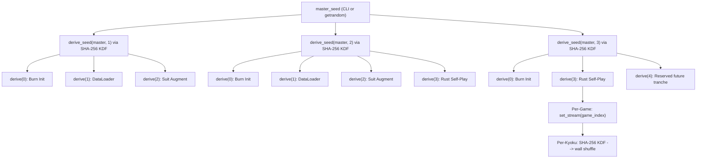

# Hydra Seeding & Reproducibility

> Seeding strategy, reproducibility guarantees for Hydra Mahjong AI. Covers RNG hierarchy, per-component seeding, CUDA determinism, eval seed banks.
>
> **Status note:** mixed reference doc. Keep seeding hierarchy, deterministic replay principles here. For current impl priority, use `research/design/HYDRA_RECONCILIATION.md`. For live runtime truth, use `docs/GAME_ENGINE.md` and current code.
>
> Treat older multi-phase RL/opponent-pool specifics as reserve/legacy planning unless reconciled doctrine explicitly promotes them.

## Related Documents

- [HYDRA_RECONCILIATION.md](HYDRA_RECONCILIATION.md) — promoted execution doctrine summary, active-vs-reserve split
- [../../docs/GAME_ENGINE.md](../../docs/GAME_ENGINE.md) — current runtime reality
- [HYDRA_ARCHIVE.md](HYDRA_ARCHIVE.md) — reserve-only design/archive planning
- [../infrastructure/INFRASTRUCTURE.md](../infrastructure/INFRASTRUCTURE.md) — implementation/infrastructure reference
- [../infrastructure/CHECKPOINTING.md](../infrastructure/CHECKPOINTING.md) — checkpoint format, save protocol, retention policy

---

## Reproducibility and Seeding Strategy

Mahjong AI training has randomness everywhere: tile shuffles, suit augmentation, DataLoader ordering, model init, GPU kernel scheduling, opponent selection. This section defines how Hydra governs all randomness for deterministic replay, meaningful ablations, post-hoc debugging, without wasting training performance.

**Design philosophy:** Logging seeds > fixing seeds. Full bitwise reproducibility possible for Phase 1, useful for debugging. Phases 2–3 remain inherently stochastic from RL exploration and system non-determinism. Prioritize game-level determinism possible) and component isolation auditable) over global training determinism (sometimes possible, never required).

### Master Seed Contract

One integer master seed governs all training-run randomness. This seed alone reconstructs full component random state at any point.

- **Source:** Passed as CLI arg (`--seed`). Logged to experiment tracker.
- **Contract:** Same `master_seed` + same code version + same hardware = bitwise-identical Phase 1 training; ~ identical Phases 2–3 (see Known Limitations below).
- **Default behavior:** If no seed given, generate from system entropy (getrandom), convert to 64-bit integer, log it. Every run stays reproducible after fact.
- **Rust side:** Master seed feeds `rand 0.9+` ecosystem from Crate Dependencies table. All Rust RNG derives from this seed, never from system entropy during training.

### Seed Hierarchy

**Decision: Rust rand crate with ChaCha20Rng as root of all randomness.**

Seed derivation uses SHA-256 KDF (matches hydra-core seeding infrastructure). Avoids anti-pattern `seed + i`, which creates correlated low bits across components.

**Component allocation via `derive_seed()`:**

| Spawn Index | Component | Description |
|-------------|-----------|-------------|
| 0 | Burn model init | Seed Burn backend RNG before model construction |
| 1 | DataLoader workers | Seed Burn DataLoader shuffle RNG |
| 2 | Suit augmentation | Seed per-worker permutation selection |
| 3 | Rust game engine | Session seed for self-play game generation |
| 4 | Reserved future tranche | Intentionally unassigned in active branch; reuse only if future promoted phase needs its own deterministic child |
| 5 | Evaluation seed bank | Seed generation of fixed evaluation game set |

**Phase-level derivation:** Each major training stage can derive its own seed via `derive_seed(master_seed, stage_number)` with SHA-256 KDF. Keeps replay/debug isolation clean if Hydra adds or revives later stages.

**Anti-patterns (never do):**
- `seed + i` for sequential component seeds — correlated low bits across components
- Reusing same seed across components — hidden statistical dependencies
- Initializing RNG at module load time — pollutes global RNG before hierarchy exists

### Per-Component Seeding

**3a. Burn (model init and training)**

Burn backend gets `component_seed` before model construction at each phase start, so orthogonal init from [Model Definition](../infrastructure/INFRASTRUCTURE.md#model-definition) yields identical weights for same seed. During training, backend RNG governs any stochastic layers, though Hydra has no dropout, so main effect is initialization.

**3b. DataLoader Workers**

Each DataLoader worker gets deterministic seed derived from hierarchy DataLoader child. Workers use local ChaCha8Rng, so 8 workers from [Data Loading Pipeline](../infrastructure/INFRASTRUCTURE.md#gap-2-data-loading-pipeline) produce deterministic file ordering and buffer shuffling across runs. Workers must never share RNG state or seed from system time.

**3c. Suit Augmentation**

Each DataLoader worker keeps local ChaCha8Rng for 1-of-6 suit permutation selection per game, per [Suit Permutation Augmentation](../infrastructure/INFRASTRUCTURE.md#gap-4-suit-permutation-augmentation). Local RNG derives from worker seed, not global state. Over 6 epochs, this gives approximate uniform coverage of all 6 permutations per game, without worker coordination.

**3d. Rust Game Engine (Self-Play Seeds)**

Rust game engine gets session seed derived from hierarchy game-engine child. Derivation path:

- **Session level:** `derive_seed(engine_child, 0)` produces `[u8; 32]`, used to seed `ChaCha8Rng` via `from_seed()`.
- **Per-game:** Session `ChaCha8Rng` uses `set_stream(game_index)` to create 2^64 independent game streams from one session seed. Each game index maps to unique, non-overlapping keystream.
- **Per-kyoku:** Within each game, wall shuffles use Mortal-proven KDF pattern: `SHA-256(session_seed || nonce || kyoku || honba)` produces 32-byte seed for fresh `ChaCha8Rng`, which drives Fisher-Yates shuffle for that kyoku's wall, dead wall, dora indicators.
- **Version pinning:** Pin `chacha20 = "=0.10.0"` in `Cargo.toml` for cross-version replay stability. Minor cipher-crate bump could silently change keystream, breaking deterministic replay.
- **Shuffle impl:** Vendor Fisher-Yates shuffle instead of depending on `rand::seq::SliceRandom`. `SliceRandom` behavior changed across `rand` versions; vendored fixed algorithm guarantees identical wall ordering across Hydra versions.
- **Cross-reference:** Deterministic replay of `(seed, kyoku, honba) → wall` underpins evaluation protocol in [Rating and Evaluation](../infrastructure/INFRASTRUCTURE.md#rating-and-evaluation).

**3e. Rayon Thread RNG**

Game seeds get fixed before rayon dispatch; rayon distributes work, not randomness. Each game instance receives pre-computed seed by value; no per-thread RNG needed for simulation. Rayon thread pool stays pure compute resource. If future extensions need per-thread RNG (e.g. exploration noise during inference), use `thread_local` `ChaCha8Rng` seeded from `game_seed XOR thread_index`, preserving reproducibility regardless of work-stealing order.

**3f. Reserved Future Tranche**

Spawn index 4 stays intentionally unused in active branch. If Hydra later promotes new deterministic subsystem needing independent child stream, consume this reserved slot instead of silently reshuffling seed-allocation table.

### GPU Determinism

**Decision: Full determinism available for Phase 1 debugging; relaxed for Phases 2–3 performance.**

| Flag | Phase 1 / supervised stages | Later stochastic stages | Effect |
|------|-------------|-----------------|--------|
| Burn backend seed |                                                                                                                                |                                                                                                                                | Seeds all backend RNG streams |
| cuDNN benchmark off | | | Disables auto-tuning; fixed-size inputs make determinism simpler, though live runtime shape now `192x34` |
| Deterministic kernels | Optional (debug) | No | Forces deterministic CUDA kernels; ~5–15% overhead |

**impl notes:**
- bf16 matmuls are deterministic given identical inputs; mixed-precision non-determinism comes from reduction ordering in multi-stream ops (e.g. gradient all-reduce), not matmul itself.
- GroupNorm (used throughout model, per [Model Definition](../infrastructure/INFRASTRUCTURE.md#model-definition)) is fully deterministic — no running stats, no non-deterministic CUDA kernels.
- Conv1d switches to deterministic cuDNN kernel when deterministic mode enabled, with ~5–8% overhead vs auto-tuned non-deterministic kernel.
- **rec:** Enable full determinism for supervised-stage ablations and seed-specific debugging. Later stochastic stages usually stay non-bitwise-reproducible because exploration and parallel scheduling dominate variance budget.

### Checkpoint RNG State

Every checkpoint saves this RNG state beside model weights and optimizer state:

| Component | What is Saved | Purpose |
|-----------|---------------|---------|
| Burn backend RNG | Backend-specific RNG state via `Record` | Reproducible forward pass on resume |
| System RNG (rand crate) | ChaCha20Rng serialized state | Reproducible Rust-level randomness on resume |
| DataLoader RNG | ChaCha8Rng state per worker | DataLoader and augmentation state |
| Training progress | Epoch number, global step, logical skip count / persisted runtime contract (current BC) | Reconstruct current training continuation contract on resume |

**Resume protocol:** On checkpoint load, restore all RNG state before first forward pass. Current BC resume reconstructs continuation from persisted epoch/global-step state plus logical skip count and runtime contract, not explicit file cursor restore. Fresh BC runs still derive runtime from config, while epoch-boundary BC resumes may reuse matching preflight-selected runtime for selected-runtime tuple only; partial-epoch resumes still require identical runtime.

- **Phase 1:** Current BC resume targets logical-batch continuation, not stronger bitwise-identical continuation through every loader/cache detail.
- **Phases 2–3:** Enables approximate resumption. Game trajectories differ from rayon thread-scheduling non-determinism, but statistical properties of training distribution stay preserved.

### Stage Transition Seeding (Reserve / Future Planning)

If Hydra uses multiple training stages with materially different data-generation regimes, re-seed all RNG components from new stage child at each boundary. This is reserve/future planning guidance, not claim that every later stage is active.

| Component | Phase 1 → 2 | Phase 2 → 3 |
|-----------|-------------|-------------|
| SHA-256 KDF | New child: `derive_seed(master, 2)` | New child: `derive_seed(master, 3)` |
| Burn backend RNG | Re-seeded from new phase child | Re-seeded from new phase child |
| Rust game engine | New session seed | New session seed |
| DataLoader RNG | Re-seeded | Re-seeded |
| Opponent pool RNG | N/A | Initialized from new phase child |

**Rationale:** Re-seeding makes each phase explore different random trajectories even with same master seed. Without re-seeding, Phase 2 game engine would replay same wall shuffles as Phase 1 evaluation games, creating artificial correlation between training and evaluation data.

### Evaluation Seed Bank (Reference Design)

**Decision: Fixed, published seed bank for all evaluation runs.**

Standardized set of 50,000 game seeds ensures cross-run and cross-version comparability. Seed bank is first-class artifact, not runtime computation.

- **Generation:** Derived from published constant (`EVAL_MASTER = 0x2000`) via `derive_seed(0x2000, i)` for i in 0..50000. Constant follows Mortal convention for evaluation key derivation.
- **Storage:** Treat seed bank as tracked eval artifact under run/eval workflow; no checked-in `data/eval_seeds.json` exists in repo now.
- **Usage tiers** (matching [INFRASTRUCTURE.md § Rating and Evaluation](../infrastructure/INFRASTRUCTURE.md#rating-and-evaluation)):

| Tier | Seeds Used | Games (x4 rotations) | Purpose |
|------|-----------|----------------------|---------|
| Quick eval | First 1,000 | 4,000 | Trend detection during training |
| Full eval | All 50,000 | 200,000 | Publication-quality checkpoint comparison |

- **Cross-reference:** These tiers match evaluation scale table in [Rating and Evaluation](../infrastructure/INFRASTRUCTURE.md#rating-and-evaluation). Ablation tier (250,000 sets / 1M games) uses separate, larger seed bank generated from `EVAL_MASTER_ABLATION = 0x2001`.
- **Invariant:** Seed bank file is append-only. New seeds may be added for larger evals, but existing seeds are never reordered or removed.

### Known Limitations

What cannot be made deterministic, and why:

- **Phases 2–3 are NOT bitwise reproducible.** Multiple independent non-determinism sources interact: GPU reduction ordering in multi-stream ops, rayon work-stealing thread scheduling, backend-specific kernel non-determinism.
- **Phase 1 CAN be bitwise reproducible** with deterministic CUDA kernels enabled and fixed seed. Recommended config for ablations and hyperparameter sweeps.
- **Game-level replay IS deterministic** regardless of training-level non-determinism. Given same `(seed, kyoku, honba)` tuple, wall shuffle, dora indicators, and draw order stay identical across any platform, any Rust version, any thread count.
- **Consistent with industry practice:** KataGo, Mortal, AlphaStar all achieve game-level determinism without full training reproducibility. No production RL system claims bitwise-reproducible multi-phase training.
- **Reporting standard:** Following Henderson et al. 2018, report results over 5+ seeds with confidence intervals. Following Agarwal et al. 2021, use interquartile mean (IQM) with bootstrap confidence intervals for RL eval, not mean +/- standard deviation, which is sensitive to outliers in heavy-tailed reward distributions.

### Seed Logging

Every training run logs full seed provenance chain, enabling post-hoc reproduction of any specific game or training state:

- **Run level:** Master seed, phase seed, all component seeds, config file hash, `Cargo.lock` hash.
- **Game level:** Every self-play game logs its game seed in trajectory metadata. This enables replay of any specific training-run game for debugging or analysis.
- **Evaluation level:** Seed bank file hash and any per-run overrides are logged.
- **Debugging workflow:** Failed reproduction? Check logged seed, code version, `Cargo.lock` hash. If all 3 match, discrepancy comes from system-level non-determinism (thread scheduling, GPU reduction order), not code bug.