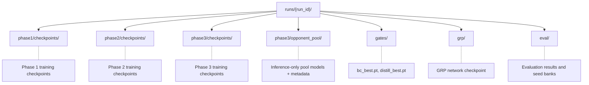

# Hydra Checkpoint Management

> Checkpoint spec for Hydra Mahjong AI. Covers format, dir structure, save protocol, retention, opponent-pool versioning, integrity verification.
>
> **Status note:** mixed ref doc. Keep checkpoint mechanics here. For current impl priority, use `research/design/HYDRA_RECONCILIATION.md`. For runtime truth, use `docs/GAME_ENGINE.md` + current code.
>
> Treat older phase-2/phase-3 league details as reserve planning unless reconciled doctrine explicitly promotes them.
>
> **Hard boundary:** universal atomic save/load/integrity mechanics = current ref. Phase-specific Phase 2 / Phase 3 checkpoint lifecycles, opponent-pool policies, multi-stage transition procedures below = reserve/historical unless current doctrine explicitly revives them.

## Related Documents

- [INFRASTRUCTURE.md](INFRASTRUCTURE.md) — Data pipeline, training infra, hardware, deployment
- [../design/SEEDING.md](../design/SEEDING.md) — RNG hierarchy, reproducibility, evaluation seed bank
- [../agent_handoffs/ARCHIVE_CANONICAL_CLAIMS.jsonl](../agent_handoffs/ARCHIVE_CANONICAL_CLAIMS.jsonl) — canonical archive SSOT / upstream research intake
- [../design/HYDRA_RECONCILIATION.md](../design/HYDRA_RECONCILIATION.md) — promoted operational doctrine summary + roadmap to Hydra v1

---

## Checkpoint Management

Section defines ref checkpoint lifecycle: save content, disk location, atomic + verifiable save, retain/prune across phases, load at phase transitions. Treat multi-phase lifecycle details as reserve/historical unless current doctrine re-promotes them. Design priorities: crash safety (no half-written files), auditability (every checkpoint hash-verified), operational simplicity (shell-friendly naming, standard tooling).

### Checkpoint Format

Every checkpoint = single record serialized via Burn's Record system (NamedMpkFileRecorder or BinFileRecorder). Record self-describing: full training config, current phase, schema version int so future format changes use explicit migration logic, not silent breakage.

**Core keys present in every checkpoint (all phases):**

| Key | Content | Notes |
|-----|---------|-------|
| model_record | Student network weights (bf16) | Burn's Module::record(); SE-ResNet backbone + all heads |
| optimizer_record | AdamW state (fp32 momentum buffers) | Burn's Optimizer::record(); see dtype note below |
| scheduler_record | LR scheduler internal state | Cosine annealing position |
| rng_state | Burn backend + system RNG states | See [Checkpoint RNG State](../design/SEEDING.md#checkpoint-rng-state) |
| global_step | Monotonic training step counter | Continuous across whole run |
| phase | Current phase (1, 2, or 3) | Integer |
| config | Full training config | Makes checkpoint self-describing |
| metrics | Phase-specific best metric snapshot | Used for best-checkpoint tracking |
| timestamp | UTC Unix timestamp at save time | Seconds since epoch |
| checkpoint_version | Schema version integer | Increment on format change |

**Phase-specific additional keys:**

| Key | Phases | Content |
|-----|--------|---------|
| teacher_state_dict | 2 only | Oracle teacher weights incl. oracle stem |
| opponent_pool_metadata | 3 only | Current pool roster + version counter |

**Separate files (not inside training checkpoint):**

- **KL anchor policy:** Saved as standalone frozen copy beside each training checkpoint. Snapshot of previous phase's policy used for KL divergence penalty preventing catastrophic forgetting.
- **GRP network:** Separate checkpoint file containing pretrained, frozen game result prediction network. File never changes during training, shared across all phases.

**Dtype discipline:** Student model saved in native bf16, halving checkpoint size vs fp32. AdamW internal momentum buffers (`exp_avg` + `exp_avg_sq`) fp32; correct + intentional. Casting optimizer state to bf16 would silently destroy precision adaptive learning rates need. Burn's Record system preserves tensor dtypes natively; no cast at save time.

**Size estimates:**

| Component | Size | Notes |
|-----------|------|-------|
| Model weights (bf16) | ~33 MB | Historical monolithic estimate; treat as reserve planning context |
| AdamW momentum buffers (fp32) | ~134 MB | Two fp32 copies of all parameters |
| Metadata, config, metrics | ~1 MB | Negligible |
| **Training checkpoint total** | **~170 MB** | Typical Phase 2/3 checkpoint |
| Phase 1 checkpoint | ~330 MB | Includes held-out file cursor + epoch state (see [Early stopping and checkpointing](INFRASTRUCTURE.md#phase-1-behavioral-cloning-supervised)) |
| Inference-only pool model | ~33 MB | Weights only, no optimizer state |

### Directory Structure

All artifacts for single training run live under one run dir. Run ID encodes start timestamp + master seed, making runs time-sortable + seed-traceable without opening files.

**Run ID format:** YYYYMMDD_HHmmss_{master_seed_hex8} — ex: 20260115_143022_a1b2c3d4. Timestamp makes runs sortable by start time; hex seed suffix makes each run traceable to master seed at glance.

**Key directories:**

| Directory | Contents | Lifetime |
|-----------|----------|----------|
| phase{N}/checkpoints/ | Training checkpoints with optimizer state | FIFO-pruned to 20 per phase |
| phase3/opponent_pool/ | Stripped inference-only model copies | FIFO-pruned to 20, anchors exempt |
| gates/ | Phase-gate checkpoints (`bc_best.pt`, `distill_best.pt`) | Permanent — never pruned |
| grp/ | Pretrained GRP network | Permanent — never modified |
| eval/ | Evaluation results, seed banks | Permanent — append-only |

`gates/` holds irreplaceable phase-gate checkpoints anchoring whole training pipeline. These are full copies of best checkpoint from each phase, not symlinks, so they survive FIFO pruning of per-phase checkpoint dirs.

### Naming Convention

Checkpoint filenames target 3 audiences: tooling (predictable parsing), shell one-liners (lexicographic sort = chronological order), humans scanning dir listing (phase + step visible fast).

**Training checkpoints:**

| Pattern | Example | Notes |
|---------|---------|-------|
| ckpt_phase{N}_step{global_step:08d}.pt | ckpt_phase2_step00045000.pt | Zero-padded 8 digits; supports up to 99,999,999 steps |

**Symlinks (per-phase convenience pointers):**

| Symlink | Target | Purpose |
|---------|--------|---------|
| latest.pt | Most recently saved checkpoint | Resume after crash |
| best.pt | Best-metric checkpoint for current phase | Quick access to peak performance |

These are true filesystem symlinks, updated atomically after each successful save. Never FIFO-evicted.

**Gate checkpoints:**

| File | Location | Notes |
|------|----------|-------|
| bc_best.pt | gates/ | Full copy of Phase 1 best checkpoint |
| distill_best.pt | gates/ | Full copy of Phase 2 best checkpoint |

Gate checkpoints are full independent copies, not symlinks. Deliberate: symlinks into FIFO-pruned dirs would eventually dangle.

**Pool models:**

| Pattern | Example | Notes |
|---------|---------|-------|
| pool_v{version:04d}_step{step:08d}.pt | pool_v0042_step00120000.pt | Monotonic version counter; inference-only weights |

**Sidecar files:**

| Suffix | Content | Purpose |
|--------|---------|---------|
|.sha256 | Hex digest + filename (GNU coreutils format) | Integrity verification via `sha256sum -c` |
| .meta.json | Pool model metadata (version, ratings, etc.) | Pool management without deserializing model |

**Shell convenience:** All naming patterns designed so simple shell commands produce useful output. Chronological checkpoint listing needs only lexicographic sort, since zero-padded step numbers + `ckpt_` prefix guarantee correct ordering.

### Save Protocol

Every checkpoint write follows 8-step atomic save sequence. Goal: on-disk state either complete valid checkpoint or nothing at all, never half-written file that could silently corrupt resumed training run.

8-step atomic save sequence:**

| Step | Action | Why |
|------|--------|-----|
| 1 | Serialize checkpoint dict to in-memory byte buffer | Catches serialization errors before touching disk |
| 2 | Compute SHA-256 digest of byte buffer | Integrity baseline computed once, used for sidecar |
| 3 | Write byte buffer to {target_path}.tmp on same filesystem | Temporary file; invisible to checkpoint discovery |
| 4 | Flush Python buffers to OS | Ensures Python write buffers handed to kernel |
| 5 | fsync file descriptor to push OS buffers to disk | Ensures data durable on physical storage |
| 6 | Atomic rename `.tmp` to final path | POSIX guarantee: rename on same filesystem is atomic |
| 7 | Write `.sha256` sidecar with hex digest | GNU coreutils format for offline verification |
| 8 | fsync parent directory | Ensures rename (dir entry update) survives power failure |

**Why all 8 steps matter:** PyTorch's Distributed Checkpoint Protocol covers steps 3 through 6. PyTorch Lightning uses in-memory `BytesIO` buffer (step 1). No major training framework computes SHA-256 digests on training checkpoints (step 2) or performs dir `fsync` after rename (step 8). Hydra combines all 8 because cost negligible (few ms CPU + one extra syscall) and protection comprehensive.

**Failure mode analysis:** Crash between steps 6 and 7 leaves valid complete checkpoint on disk with missing or stale SHA-256 sidecar. This is only expected partial-failure window. Loader treats missing sidecar as warning (log + proceed), not hard error, so case does not block training resume. Crash before step 6 leaves only `.tmp` file, which checkpoint discovery ignores.

### Per-Phase Retention Policy

Each training phase has own checkpoint dir with independent retention settings. Policy balances disk budget vs rollback ability if training diverges.

| Parameter | Phase 1 (BC) | Phases 2-3 (RL) |
|-----------|-------------|-----------------|
| Save interval | Every 10,000 training steps | Every 500 PPO update steps |
| Max checkpoints (FIFO) | 20 | 20 |
| Protected from FIFO | `best.pt` target, gate checkpoint | `best.pt` target, gate checkpoints |
| "Best" metric | Lowest held-out cross-entropy loss | Highest conservative rating (`mu - 3*sigma`) |
| Gate checkpoint | `bc_best.pt` (copied to `gates/`) | `distill_best.pt` (copied to `gates/`) |
| Disk budget (worst case) | 20 x 330 MB = ~6.6 GB | 20 x 170 MB = ~3.4 GB |

**FIFO eviction:** When checkpoint count in phase dir exceeds 20, oldest non-protected checkpoint deleted. "Protected" means checkpoint is current target of `best.pt` symlink, or checkpoint has been copied to `gates/` as phase-gate artifact. Everything else fair game.

**best.pt tracking:** After every save, new checkpoint metric compared against current best. If improved, `best.pt` symlink updated to point at new checkpoint. Metric depends on phase: Phase 1 uses held-out cross-entropy loss (lower better); Phases 2 and 3 use conservative OpenSkill rating (`mu minus three sigma`), as defined in [Rating and Evaluation](INFRASTRUCTURE.md#rating-and-evaluation).

### Opponent Pool Versioning

During Phase 3 league self-play, training agent plays against pool of past self versions (see [reserve-stage opponent pool table](INFRASTRUCTURE.md#reserve-stage-league-self-play)). This subsection specifies how pool models are created, versioned, rated, cached, pruned.

**Pool composition** (reserve design if future league phase revived):

| Category | Weight | Source |
|----------|--------|--------|
| Current self (all 4 seats) | 50% | Live training weights |
| Random pool checkpoint | 30% | Uniformly sampled from pool roster |
| Phase 2 baseline (frozen) | 20% | `distill_best.pt` — never updated |

**Version assignment:** Monotonic int counter increments each time new model promoted into pool. Version numbers never reset or recycle, even across training restarts. Gives total ordering independent of step numbers or wall-clock time.

**Promotion protocol:** Every `save_interval` (500 PPO update steps), current training model's weights stripped to inference-only form (no optimizer state, no scheduler state) and added to opponent pool as new versioned entry. Stripped copy ~33 MB, one-fifth size of full training checkpoint.

**Rating integration:** New pool entries rated using OpenSkill PlackettLuce system described in [Rating and Evaluation](INFRASTRUCTURE.md#rating-and-evaluation). New model inherits `mu` (skill estimate) from current training model rating but inflates `sigma` (uncertainty) to larger of current `sigma` or one-third default `sigma`. This inflation ensures new entry sampled often for evaluation until rating stabilizes.

**GPU cache:** 5 most recently used pool models kept resident in GPU memory as bf16 inference copies (LRU eviction). Avoids repeated CPU→GPU transfers for frequent opponents. Cache capacity matches value documented in [reserve-stage opponent pool table](INFRASTRUCTURE.md#reserve-stage-league-self-play).

**Sidecar metadata:** Each pool model has companion `.meta.json` file containing: version number, source global step, source phase, current rating `mu` + `sigma`, total games played, win rate, promotion timestamp (UTC). Enables pool management decisions (eviction, sampling) without deserializing full model weights.

**Frozen anchors:** `bc_best.pt` + `distill_best.pt` are permanent opponent-pool members. Never FIFO-evicted, never re-rated (ratings fixed at promotion), never updated. They serve as fixed reference points anchoring rating scale + preventing catastrophic forgetting.

**FIFO eviction:** When pool dir exceeds 20 model files, oldest non-anchor entry deleted. Before deletion, model's full rating history (`mu`, `sigma`, games played, win rate) appended to pool eviction log for post-hoc analysis. `.meta.json` sidecar also deleted.

**Deterministic selection:** Pool opponent selection uses own `SeedSequence` child, as described in [Stage Transition Seeding](../design/SEEDING.md#stage-transition-seeding-reserve--future-planning). Given same seed + same pool contents (same models at same FIFO positions), same opponent matchup sequence produced. Enables controlled ablations where only training policy changes while opponent schedule stays fixed.

### Phase Transition Loading

Phase transitions are most delicate moments in training pipeline. Student network architecture identical across all 3 phases, but surrounding infra changes at each boundary: optimizer, scheduler, teacher model, KL anchor, opponent pool. This subsection specifies exact loading procedure at each transition, extending carry/reset table in [INFRASTRUCTURE.md § Phase Transitions](INFRASTRUCTURE.md#phase-transitions) with checkpoint-specific details.

**Phase 1 to 2 transition** (cross-reference: [Phase 1 → 2 procedure in Phase Transitions](INFRASTRUCTURE.md#phase-transitions)):

| Step | Action | Rationale |
|------|--------|-----------|
| 1 | Load `bc_best.pt` with strict model loading | Architecture identical; strict mode catches key mismatch |
| 2 | Copy student weights into teacher; initialize random oracle stem on teacher | Teacher starts as student clone + new oracle capacity |
| 3 | Freeze teacher: eval mode, no gradients, bf16 cast | Teacher provides signal only; must not receive gradient updates |
| 4 | Freeze copy of Phase 1 policy head as KL anchor | Prevents catastrophic forgetting of BC knowledge during RL |
| 5 | Discard optimizer + scheduler state from checkpoint | Stale BC momentum hurts RL; create fresh AdamW with warmup |
| 6 | Re-seed all RNG from Phase 2 `SeedSequence` child | See [Stage Transition Seeding](../design/SEEDING.md#stage-transition-seeding-reserve--future-planning) |
| 7 | Reset best-metric tracker; begin Phase 2 training loop | Phase 2 uses different "best" metric than Phase 1 |

**Phase 2 to 3 transition** (cross-reference: [Phase 2 → 3 procedure in Phase Transitions](INFRASTRUCTURE.md#phase-transitions)):

| Step | Action | Rationale |
|------|--------|-----------|
| 1 | Load `distill_best.pt` with strict model loading | Architecture identical; strict mode catches key mismatch |
| 2 | Verify feature dropout masks reached 0.0 | Safety check: oracle features must be fully ablated before self-play |
| 3 | Discard teacher model + oracle critic | No longer needed; Phase 3 = pure self-play |
| 4 | Initialize opponent pool with `distill_best.pt` + `bc_best.pt` as frozen anchors | Pool starts with two fixed reference opponents |
| 5 | Freeze Phase 2 policy as new KL anchor | Prevents catastrophic forgetting of distillation knowledge |
| 6 | Discard optimizer + scheduler; create fresh AdamW with warmup | Same rationale as Phase 1 → 2: stale momentum harms new objective |
| 7 | Re-seed all RNG from Phase 3 `SeedSequence` child | See [Stage Transition Seeding](../design/SEEDING.md#stage-transition-seeding-reserve--future-planning) |
| 8 | Initialize OpenSkill ratings for all pool members; reset best-metric tracker | Rating system starts fresh for league |

**Strict loading:** Both transitions use strict model loading: every key in checkpoint must match exactly one key in model, and vice versa. Safe because student architecture identical across all 3 phases: same ResBlock count, same channel width, same head structure. Key mismatch at transition time indicates code bug, not expected architecture change, and should fail loud.

**Teacher isolation:** Teacher model in Phase 2 is separate instantiation with own `state_dict`. Never mixed into student `state_dict` and has no entry in student optimizer. By default, teacher discarded at Phase 2 -> 3 transition, so no cleanup of student checkpoint needed. If future search-assisted oracle path revived, teacher's stem `state_dict` can be preserved in Phase 3 checkpoint for inference-time oracle queries.

### Checkpoint Integrity

Every checkpoint protected by SHA-256 digest computed at save time and verified at load time. Integrity system aims to catch silent corruption (bit-rot, incomplete writes, storage errors) while staying compatible with standard Unix tooling.

**SHA-256 sidecar format:** Each checkpoint file has companion `.sha256` file containing hex digest + filename in GNU coreutils format. Means sidecar directly verifiable with standard `sha256sum -c` command; no custom tooling needed for offline audit or batch verification of whole checkpoint dir.

**Verification on load:**

| Sidecar state | Digest match | Loader behavior |
|---------------|-------------|-----------------|
| Present | Matches | Load proceeds normally |
| Present | Mismatch | Abort with clear error; do not deserialize |
| Missing | N/A | Log warning; load proceeds (graceful degradation) |

Missing-sidecar case enables backward compatibility with checkpoints created before integrity system existed, or recovery from narrow failure window described in Save Protocol section (crash between steps 6 and 7).

**Corruption recovery for training checkpoints:** If latest checkpoint fails integrity verification, loader auto-falls back to previous FIFO-retained checkpoint. Fallback chain extends through all retained checkpoints (up to 20). If every retained checkpoint corrupt, extremely unlikely scenario requiring sustained storage failure, training run aborts with diagnostic listing every checkpoint attempted + nature of each failure.

**Gate checkpoint verification:** `bc_best.pt` + `distill_best.pt` get stricter treatment. These gate checkpoints verified at every phase transition load, with no fallback: corrupt gate checkpoint causes hard failure. Correct because gate checkpoints are irreplaceable, representing single best model from completed training phase. Corrupt gate checkpoint means upstream phase must be re-run; silently loading damaged model would create subtly wrong downstream training, far costlier to diagnose than immediate failure.

**Manual verification:** Because `.sha256` sidecars use standard GNU coreutils format, any checkpoint dir can be audited offline with single shell command. Useful after copying runs between machines, restoring from backup, or archiving completed experiments.