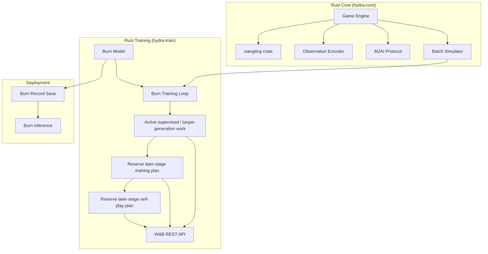
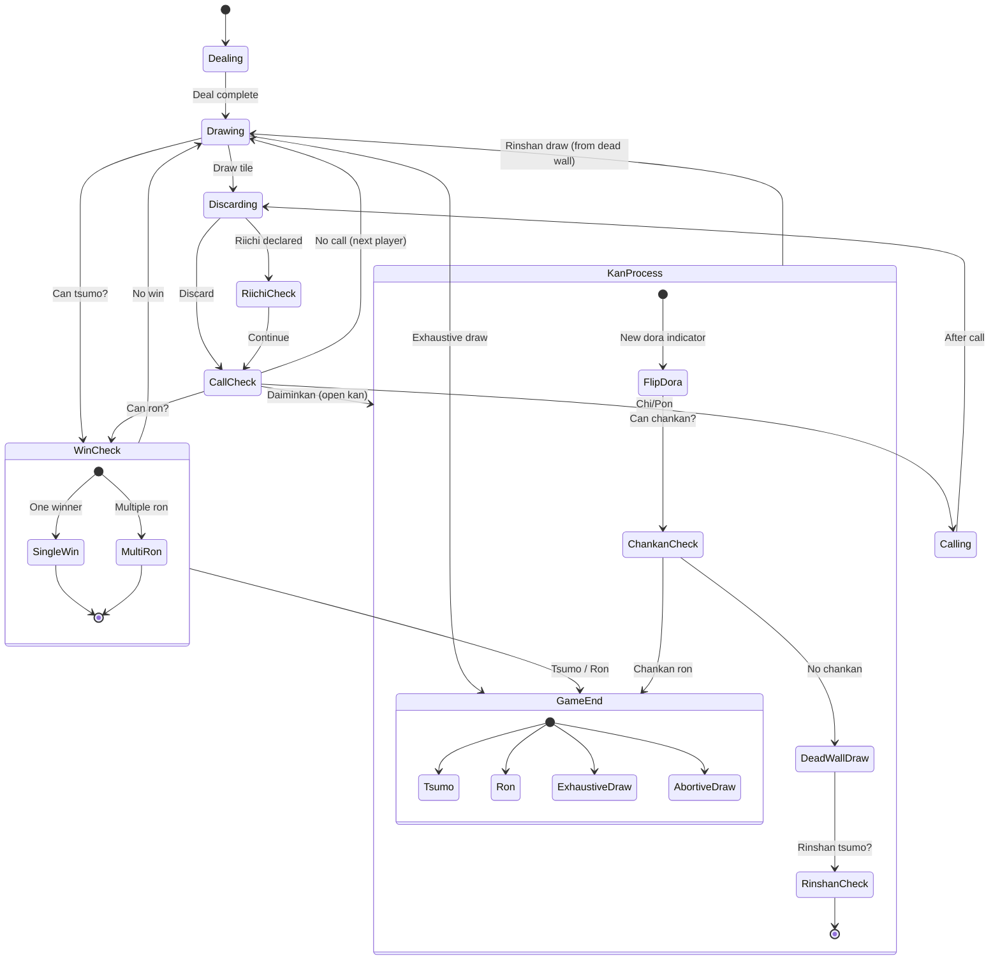
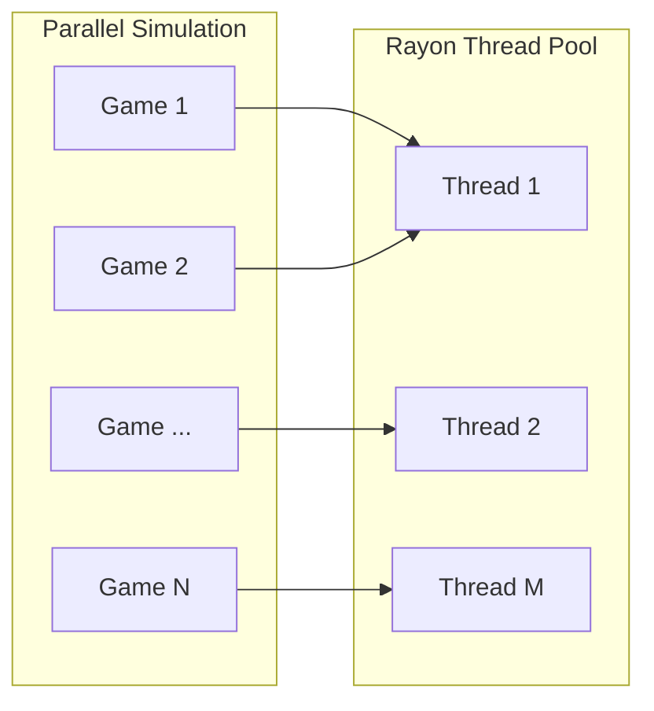
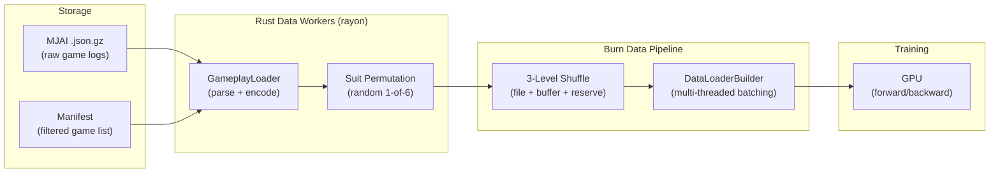
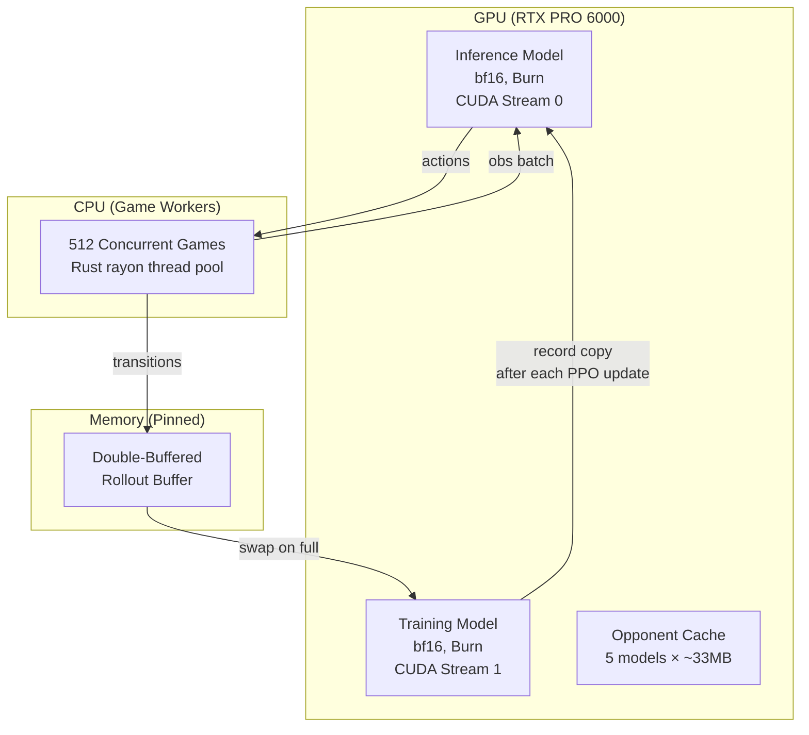
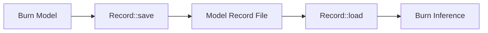
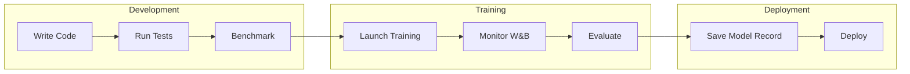

# Hydra Infrastructure Specification

> **Ownership note:** Doc owns infra rationale, impl ref detail, reserve-stage planning. Active-path sequencing and staged-vs-reserve decisions: `research/design/HYDRA_RECONCILIATION.md`. Live runtime/compat truth: `docs/GAME_ENGINE.md`, `docs/COMPATIBILITY_SURFACE.md`, current code.
>
> **Interpretation rule:** if this file conflicts with promoted doctrine or live runtime, treat this file as reference; refresh lagging summary elsewhere.
>
> **Reserve-stage rule:** active supervised / target-generation path = current mainline. Later Phase 2 / Phase 3 PPO, league, oracle-distillation, opponent-pool plans stay here as historical/reference unless `HYDRA_RECONCILIATION.md` re-promotes them.

## Overview

Hydra uses 100% Rust. Burn framework with burn-tch (libtorch/cuDNN) backend. See [RUST_STACK.md](RUST_STACK.md) for rationale. Rust handles game engine, observation encoding, simulation, NN training, experiment tracking. Mirrors Mortal engine design but uses all-original code (no AGPL-derived components) and unified Rust stack.

## Related Documents

- [../design/HYDRA_FINAL.md](../design/HYDRA_FINAL.md) — promoted architecture doctrine summary
- [../design/HYDRA_RECONCILIATION.md](../design/HYDRA_RECONCILIATION.md) — promoted execution doctrine summary and next impl tranche
- [../design/HYDRA_ARCHIVE.md](../design/HYDRA_ARCHIVE.md) — reserve-only design/archive planning
- [../design/HYDRA_SPEC.md](../design/HYDRA_SPEC.md) — legacy architecture spec (historical only)
- [../design/SEEDING.md](../design/SEEDING.md) — RNG hierarchy, reproducibility, evaluation seed bank
- [CHECKPOINTING.md](CHECKPOINTING.md) — checkpoint format, save protocol, retention policy

## System Architecture

System has 3 major subsystems: Rust core game engine, Rust training stack (Burn), deployment pipeline. Data flows game engine → Burn training loop inside one Rust process. Trained models save via Burn Record for inference.

## Rust Core (hydra-core)

### Crate Dependencies

| Crate | Version | Purpose | License |
|-------|---------|---------|---------|
| xiangting | 5.0+ | Shanten calc | MIT |
| burn | 0.21+ | DL framework | Apache-2.0/MIT |
| rayon | 1.10+ | Parallel sim | MIT OR Apache-2.0 |
| serde | 1.0+ | JSON serialize | MIT OR Apache-2.0 |
| serde_json | 1.0+ | MJAI parse | MIT OR Apache-2.0 |
| ndarray | 0.16+ | Tensor ops | MIT OR Apache-2.0 |
| rand | 0.9+ | Shuffle RNG | MIT OR Apache-2.0 |

### License Compatibility

#### Safe to Use

| License | Commercial | Derivatives | Notes |
|---------|------------|-------------|-------|
| MIT | ✓ | ✓ | Required for deps |
| Apache-2.0 | ✓ | ✓ | Patent grant included |
| BSD | ✓ | ✓ | Various versions OK |

#### Cannot Use for Hydra

| License | Issue |
|---------|-------|
| AGPL | Copyleft; source disclosure for network use |
| GPL | Copyleft; restricts derivative works |
| LGPL | Weak copyleft; needs relinking capability for static linking |
| Mortal's Custom Restrictions | Extra restrictions on model weights beyond AGPL |

### Module Structure

`hydra-core` uses flat module layout under `src/`:

| File | Responsibility |
|------|----------------|
| `lib.rs` | Crate root, public API |
| `tile.rs` | Tile rep (0-33 index), 136-format, aka-dora, suit permutation |
| `action.rs` | 46-action mapping (Mortal-compatible), bidirectional riichienv conversion |
| `encoder.rs` | 192x34 fixed-superset observation encoder with incremental dirty-flag updates; first 85 channels keep baseline prefix |
| `safety.rs` | Genbutsu, suji, kabe, one-chance safety calcs for channels 62-84 |
| `bridge.rs` | Convert riichienv `Observation`/`ObservationRef` into encoder inputs |
| `game_loop.rs` | `GameRunner`, `ActionSelector` trait, phase handling, safety tracking |
| `simulator.rs` | Batch game simulation with rayon parallelism and configurable thread pools |
| `seeding.rs` | Deterministic RNG hierarchy: SHA-256 KDF, ChaCha8Rng, vendored Fisher-Yates |
| `batch_encoder.rs` | Pre-allocated contiguous buffer for encoding N observations without per-obs allocation |
| `shanten_batch.rs` | Batch shanten compute with hierarchical hash cache (base + all 34 discards) |

### MJAI Protocol

MJAI = line-delimited JSON protocol for mahjong AI comms. Hydra uses MJAI for log compatibility (Tenhou/Majsoul parsing) and bot interface (real-time play via `mjai.rs`). Live runtime contract and action/state semantics: `docs/GAME_ENGINE.md`.

#### Message Types

| Type | Key Fields | Description |
|------|-----------|-------------|
| `start_game` | `names: [String; 4]` | Match start, player names |
| `start_kyoku` | `bakaze, dora_marker, kyoku, honba, kyotaku, oya, scores, tehais` | Round start with full state |
| `tsumo` | `actor, pai` | Draw |
| `dahai` | `actor, pai, tsumogiri` | Discard (`tsumogiri` = drew then discarded) |
| `chi` / `pon` | `actor, target, pai, consumed` | Sequence or triplet call |
| `daiminkan` / `kakan` / `ankan` | `actor, [target], pai, consumed` | Open kan, added kan, concealed kan |
| `reach` | `actor` | Riichi declaration |
| `hora` | `actor, target, [deltas, ura_markers]` | Win declaration |
| `ryukyoku` | `[deltas]` | Exhaustive draw |

#### Tile Encoding

- **Suited tiles**: `1m`–`9m` (manzu), `1p`–`9p` (pinzu), `1s`–`9s` (souzu)
- **Red fives**: `5mr`, `5pr`, `5sr`
- **Wind honors**: `E` (East), `S` (South), `W` (West), `N` (North)
- **Dragon honors**: `P` (Haku/White), `F` (Hatsu/Green), `C` (Chun/Red)
- **Actor IDs**: 0–3

#### Mortal Meta Extensions

Mortal adds metadata to bot responses. Hydra parses listed fields when present; unknown fields ignored with warning log. No partial interpretation: table field = used, else skipped.

| Field | Type | Description |
|-------|------|-------------|
| `q_values` | `Vec<f32>` (optional) | Q-value estimate for each of 46 possible actions |
| `mask_bits` | `u64` (optional) | Bitmask of legal actions in current state |
| `shanten` | `i8` (optional) | Current shanten (0 = tenpai, −1 = complete) |
| `is_greedy` | `bool` (optional) | Whether bot chose max Q-value action |
| `eval_time_ns` | `u64` (optional) | Wall-clock inference time in ns |
| `at_furiten` | `bool` (optional) | Whether player in furiten |
| `kan_select` | `Box<Metadata>` (optional) | Nested metadata for kan decisions |

### Tile Representation

Hydra uses standard 34-tile index mapping (0–33 across manzu, pinzu, souzu, honors). Live tile/action/runtime contract: `docs/GAME_ENGINE.md` and `docs/COMPATIBILITY_SURFACE.md`.

### Game State Machine

Game engine drives finite state machine for each round. States move through dealing, drawing, discarding, call checks, kan processing, riichi declarations, win checks until tsumo, ron, or draw.

**Abortive draws handled:**

| Condition | Japanese | Description |
|-----------|----------|-------------|
| Kyuushu Kyuuhai | 九種九牌 | 9+ unique terminals/honors in opening hand (player choice, action 44) |
| Suufon Renda | 四風連打 | All 4 players discard same wind on first turn |
| Suucha Riichi | 四家立直 | All 4 players declare riichi |
| Suukaikan | 四開槓 | 4 kans by different players (not all by one player) |
| Sanchahou | 三家和 | Triple ron (3 players win on same discard — abortive under Hydra target ruleset) |

> **Nagashi Mangan** checked at exhaustive draw: if player's whole discard pile is terminals/honors and none were called, they get mangan payment.

### Observation Encoder

Observation encoder produces **192×34 fixed-superset tensor**. First 85 channels keep original public+safety baseline prefix; rest add fixed-shape search/belief and Hand-EV context with zero-fill plus presence masks when dynamic features unavailable. Encodes hand tiles, discards, melds, dora, safety info, optional higher-level context into fixed numerical representation for NN input. Live channel-by-channel and compatibility-sensitive contract: `docs/GAME_ENGINE.md` and `docs/COMPATIBILITY_SURFACE.md`.

Key performance considerations:

- **Pre-allocated buffers** — allocate tensor memory once per env instance; reuse across turns
- **Contiguous memory layout** — flat contiguous `192×34` array for cache efficiency and downstream BLAS/NN compatibility
- **Incremental updates (implemented)** — live encoder already uses dirty-flag incremental encoding; more micro-opts are benchmark questions, not missing baseline

### Batch Simulator

For self-play training, batch simulator runs many games in parallel with rayon work-stealing pool. Games run independently; rayon spreads them across CPU threads automatically.

Target throughput for pure Rust sim (no NN inference): 100,000+ games/hour/core. End-to-end training throughput (GPU inference in loop): 10,000+ games/hour, bottlenecked by NN forward passes, not simulation.

## Data Pipeline

This section specifies complete data pipeline for Phase 1 behavioral cloning (supervised learning from expert logs). Resolves 5 design gaps: storage, loading, filtering, suit permutation augmentation, volume/throughput. Same foundations could support later stages if re-promoted, but current active path is supervised baseline in `HYDRA_RECONCILIATION.md`.

### Pipeline Architecture

### Gap 1: Storage Format

**Decision: On-the-fly Rust parsing (default) with optional pre-encoded shards for production.**

Default path stores raw MJAI logs as `.json.gz` (~70 GB for ~6.6M games). Rust `GameplayLoader` parses and encodes observations on fly with rayon. This is Mortal's proven path; Mortal handles even larger tensors (`1012×34` vs Hydra current `192×34` fixed superset) same way, so on-the-fly parsing is not bottleneck at this scale.

For production runs where max GPU utilization matters, optional pre-encoding writes sharded binary files with Blosc+LZ4 compression (~500–800 GB for ~6.6M games at ~7:1). This removes CPU parsing cost but forces re-encode whenever features change. Justified only if GPU utilization drops below 80% with on-the-fly parsing.

**Rejected alternatives:**
- **HDF5:** thread-safety issues with h5py; single-writer bottleneck blocks parallel encoding
- **Parquet:** columnar format for heterogeneous tabular data; wrong for dense homogeneous tensors
- **FFCV:** optimized for JPEG decode-to-GPU; our bottleneck is not image decode
- **WebDataset:** overkill for single-node local training

**Evidence from game AI systems:** AlphaZero, AlphaStar, OpenAI Five use in-memory buffers or on-the-fly encoding. lc0 uses fixed-size binary structs in `.gz`. KataGo uses `.npz`. None use HDF5 or Parquet.

### Gap 2: Data Loading Pipeline

**Decision: Burn DataLoaderBuilder backed by Rust GameplayLoader with rayon parallelism.**

Burn DataLoader partitions file list across worker threads (Mortal-style). Inside each worker, Rust `GameplayLoader` uses rayon parallel iterators and `GzDecoder` for concurrent parsing, producing pre-encoded observation tensors fed directly into Burn training loop. Single-process architecture; no IPC overhead.

**DataLoader config:**

| Parameter | Value | Rationale |
|-----------|-------|-----------|
| `batch_size` | 2048 | 4x Mortal's 512; linear LR scaling |
| `num_workers` | 8 | Burn DataLoader threads; each worker spawns rayon threads internally |
| `RAYON_NUM_THREADS` | `num_cpus / num_workers` (e.g., 4 per worker on 32-core) | Scale with cores; avoid oversubscription |
| `drop_last` | `true` | Clean batch boundaries, consistent gradient scale |

> **Note:** Burn DataLoader runs in-process with direct memory sharing. No `pin_memory`, `persistent_workers`, or `prefetch_factor` needed; those are PyTorch IPC concepts, not single-process Rust architecture.

**Shuffling strategy (3-level):**

1. **File-level:** Shuffle shard/file order at epoch start. Every worker gets freshly permuted file list.
2. **Buffer-level:** Each worker loads `file_batch_size=100` shards (~100K decisions) into memory buffer and runs full Fisher-Yates shuffle before yielding batches.
3. **Reserve mixing:** Keep 20% of buffer when loading next file batch, mixing old/new data to avoid sharp shard boundaries.

This 3-level strategy gives temporal decorrelation close to full-dataset shuffle without full-dataset memory residency. Mirrors KataGo sliding-window shuffler.

**Sharding:** Raw MJAI logs (~6.6M individual files) are pre-packed into ~660 mega-shards of 10K games each. Each shard is concatenated gzip archive with JSON index file (`.shard_index.json`) mapping game offsets. Index schema: `{ shard_id: str, num_games: int, games: [{ game_id: str, byte_offset: int, byte_length: int }] }`. Avoids filesystem metadata overhead from millions of small files and enables efficient sequential reads.

### Gap 3: Filtering Strategy

**Decision: Pre-filter once, cache filtered game list in manifest file.**

Instead of filtering at train time (wasting CPU each epoch), one-time scan builds manifest with metadata. Training reads only filtered manifest.

**Three-step process:**

1. **Scan:** Parse all ~6.6M game files and extract metadata. Store as **JSON Lines** manifest (`.jsonl`, one JSON object per game). Schema: `{ game_id: str, source: "tenhou"|"majsoul", lobby: str, player_ids: [str; 4], player_ranks: [str; 4], num_rounds: int, final_scores: [int; 4], file_path: str, byte_offset: int, player_stats: { avg_rank: f32, dealin_rate: f32, win_rate: f32, num_games: int }[4] }`
2. **Filter:** Apply quality criteria per data tier (below). Output filtered file list.
3. **Train:** DataLoader reads only files in filtered list. Zero runtime filtering overhead.

**Data quality tiers:**

| Tier | Source | Filter Criteria | Training Weight |
|------|--------|-----------------|-----------------|
| Tier 1 | Tenhou Houou (Phoenix) | No extra filter (already R>=2000, 7-dan+) | 1.0 |
| Tier 1 | Majsoul Throne Room | No extra filter (Saint+ room) | 1.0 |
| Tier 2 | Majsoul Jade Room | Player-level stats filter (below) | 0.6 |

**Player-level filtering for Tier 2 data** (inspired by Mortal Discussion #91, where Nitasurin showed +1.8–2.0 PT improvement from player-level cleaning alone):

| Criterion | Threshold | Rationale |
|-----------|-----------|-----------|
| `games` | >= 30 | Minimum sample for reliable stats |
| `avg_rank` | <= 2.60 | Better than random (2.50 = uniform) |
| `dealin_rate` | <= 0.16 | Not recklessly aggressive |
| `win_rate` | >= 0.17 | wins hands |

Only qualifying players' decision perspectives are used for training, even in mixed-strength games. Goal: learn what strong players do, not their opponents.

**Game-level exclusions:**

- Games with disconnected players (incomplete decision sequences)
- Games with >3 timeouts per player (AFK/bot behavior)
- Games with <4 actions per player (aborted or bugged games)

**Estimated dataset after filtering:** ~5–6M high-quality game perspectives from ~6.6M raw corpus.

### Gap 4: Suit Permutation Augmentation

**Decision: On-the-fly random permutation, 1 of 6 per game per epoch.**

Mahjong strategy is invariant to suit identity; manzu, pinzu, souzu are interchangeable. Suit permutation augmentation exploits this symmetry and effectively multiplies dataset by up to 6× with zero disk overhead.

**Specification:**

- **Full permutation group:** All 3! = 6 permutations of three suit indices. Mortal does only 2× (man-pin swap); Hydra uses full group.
- **Application point:** At MJAI Event level, before observation encoding. Each tile ID in event stream remaps through chosen permutation. Same architecture point as Mortal, extended to all 6 permutations.
- **Granularity:** One random permutation per game, not per decision. Keeps game-internal consistency.
- **impl:** `permute_suits(tile_id: u8, perm: [u8; 3]) -> u8` where `perm` maps `[manzu_target, pinzu_target, souzu_target]` and is one of 6 permutations of `[0, 1, 2]`.
- **Aka-dora handling:** `deaka()` to get base tile, permute base, then `re_akaize()` if original was aka. Mortal-proven pattern for red fives.
- **CPU cost:** Negligible — `const fn` does divide by 9, remap suit, rebuild tile ID. Nanoseconds per tile.
- **Coverage:** Over 6 epochs, each game is statistically seen under all 6 permutations. No need to pre-encode augmented copies.

### Gap 5: Volume and Throughput Estimates

All estimates scale to ~6.6M games × ~60 decisions/game = ~400M total decisions.

**Storage volumes:**

| Component | Size | Notes |
|-----------|------|-------|
| Raw MJAI logs (`.json.gz`) | ~70 GB | Source of truth; retained |
| Student obs (192×34×f32, uncompressed) | ~10.1 TB | Never stored — generated on fly |
| Oracle obs (205×34×f32, uncompressed) | ~10.9 TB | Never stored — generated on fly |
| With 6× suit augmentation (uncompressed) | ~27 TB | Never pre-computed — applied on fly |
| Pre-encoded shards (Blosc+LZ4, ~7:1) | ~640 GB | Optional production path only |
| Actions + masks + metadata | ~22 GB | Compact ancillary data |

**Memory budget (Delta GPU A100, 40 GB GPU memory):**

| Component | Memory | Phase |
|-----------|--------|-------|
| Model (~16.5M student / ~16.7M teacher, bf16) | ~33–34 MB | All phases |
| Batch (2048 × 192×34 × 4B) | ~53 MB | Phase 1 (BC) |
| Burn DataLoader workers (8 threads) | ~180 MB | Phase 1 (BC) |
| Optimizer state (AdamW, bf16) | ~130 MB | All phases |
| Opponent cache (5 × 33 MB bf16) | ~165 MB | Phase 3 |
| PPO minibatch (on-GPU) | ~200–400 MB | Phase 2–3 (RL) |
| **Total VRAM footprint** | **< 1 GB** (BC) / **~3.7 GB** (PPO+opponents) | — |

Historical PPO rollout buffer estimate here assumes older `85×34` baseline observation. If plan is revived against current `192×34` fixed-superset encoder, buffer cost scales up proportionally. Treat old estimate as legacy planning context, not current sizing guarantee. Only individual minibatches move to GPU via async copies through burn-tch. Phase 1 BC stays memory-trivial.

**Throughput estimates:**

| Metric | Value | Notes |
|--------|-------|-------|
| Target training speed | 10K steps/hour @ batch 2048 | ~20M samples/hour |
| Required sustained I/O | ~32 MB/s | From MJAI source files |
| NVMe sequential read capacity | ~7,000 MB/s | 218× headroom over requirement |
| Rust parser capacity (8 workers) | ~160K samples/sec | 28× headroom over requirement |
| GPU compute (forward + backward) | Bottleneck | Only true constraint |

**Bottom line:** On-the-fly Rust parsing wins clearly. NVMe I/O and CPU parsing capacity are massively overprovisioned vs training target. GPU is sole bottleneck, specifically forward/backward during training. PPO rollout buffer lives in CPU pinned memory, not VRAM.

## Python Bindings

Removed. Hydra uses 100% Rust stack. See `RUST_STACK.md` for rationale.

## Rust Training (hydra-train)

### Dependencies

| Crate | Purpose |
|-------|---------|
| burn | Deep learning framework (model definition, autodiff) |
| burn-tch | libtorch backend (CUDA/cuDNN acceleration) |
| burn-train | Training loop infra (learner, metrics, checkpointing) |
| rayon | Data pipeline parallelism |
| reqwest | W&B REST API for experiment tracking |
| indicatif | Progress bars and terminal output |
| flate2 | Gzip decompression for MJAI log parsing |

### Reserve-stage training reference

Rest of this section preserves older detailed training-infra planning for later stages. Reference only, not active-path authority.

#### Phase 1: Behavioral Cloning (Supervised)

**Data source:** Phase 1 Data Pipeline (§ Data Pipeline above) — ~6.6M MJAI logs, on-the-fly Rust parsing, 3-level shuffle.

**Optimizer config:**

| Parameter | Value | Rationale |
|-----------|-------|-----------|
| Optimizer | AdamW | Decoupled weight decay; faster convergence than SGD for short runs |
| Peak LR | 5e-4 | 4× Mortal's 1e-4 from 4× batch size (linear scaling) |
| Final LR | 1e-5 | Cosine annealing floor |
| Warmup | Linear ramp, 5% of total steps (~30K), from 2.5e-5 to peak | Prevents early gradient explosion with large batch; start LR = peak/20 |
| Weight decay | 0.01 | Only on Conv1d and Linear weights; biases and GroupNorm excluded |
| Betas | (0.9, 0.999) | AdamW defaults |
| Epsilon | 1e-5 | Keep consistent across phases; matches common PPO/SL practice |
| Gradient clip | 1.0 (max grad norm) | Prevents training spikes; Mortal disables, but BC dynamics differ |

**Batch and precision:**

| Parameter | Value | Rationale |
|-----------|-------|-----------|
| Batch size | 2048 | 4× Mortal's 512; linear LR scaling |
| Gradient accumulation | 1 | Effective batch = 2048 (fits easily on A100 40 GB) |
| Precision | bf16 (autocast) | A100-friendly; fp32 dynamic range, no GradScaler |
| CubeCL JIT | Planned (burn-cuda upgrade) | Kernel fusion via burn-cuda backend. Current backend: burn-tch (libtorch). See [RUST_STACK.md](RUST_STACK.md). |

**Loss function:**
L_IL = CE(π, a_human) + 0.5 × MSE(V, outcome) + 0.1 × L_aux

Where L_aux includes GRP rank prediction (CE), tenpai classification (BCE), danger estimation (focal BCE). Exact launch and promotion gates still come from `HYDRA_RECONCILIATION.md`.

**Training schedule:**
- 3 epochs over filtered dataset (~5-6M games, ~300-360M decisions)
- Random 1-of-6 suit permutation per game per epoch (§ Suit Permutation Augmentation)
- Over 3 epochs, each game is seen under ~3 of 6 permutations

**Early stopping and checkpointing:**
- Validate every 5K training steps on 5% held-out game set (chronological split — last month's games)
- Primary metric: validation policy cross-entropy loss (not accuracy; loss captures calibration)
- Early stopping patience: 3 consecutive validation intervals without improvement
- Checkpoint every 10K steps; keep best + last 3; discard older (~330 MB/checkpoint)

**Resource estimates:**
- Steps per epoch: ~160K (330M decisions / 2048 batch)
- Total training steps: ~480K (3 epochs)
- Wall time per epoch: hardware-dependent; benchmark on actual Delta GPU A100 allocation before treating as constant
- Total wall time: depends on measured Delta GPU A100 throughput and data-pipeline efficiency
- GPU memory: ~400 MB total (model + optimizer + batch — tiny vs A100 40 GB)

**Monitoring (via W&B REST API / tensorboard-rs):**

| Frequency | Metrics |
|-----------|---------|
| Every step | Total loss, policy CE, value MSE, GRP CE, tenpai BCE, danger focal, learning rate, gradient norm |
| Every 5K steps | Top-1/top-3 action accuracy, discard/call/riichi accuracy, policy entropy, throughput (samples/sec), GPU memory |
| Every validation | Val loss, val accuracy breakdown, train-val gap, per-action-type accuracy |

**Phase 1 readiness gate** (all must pass to enter Phase 2):
- Discard accuracy ≥ 65%
- SL loss plateaued (no improvement in 3 validation intervals)
- Test play average placement ≤ 2.55 (1v3 vs uniformly random legal actions baseline)
- Deal-in rate ≤ 15% in test play

#### Reserve Stage: Oracle Distillation / later-stage training

**Data source:** Self-play trajectories generated by teacher model initially, then student progressively. No static game logs.

**Model config:**

| Component | config | VRAM |
|-----------|--------------|------|
| Teacher | Frozen, bf16, eval mode; Conv1d(290, 256, 3) stem; ~16.7M params | ~33 MB |
| Student | fp32 master weights, bf16 autocast for compute; historical row assumes older 85-channel student stem and should be read as legacy planning only | ~67 MB |
| Teacher gradients | None (frozen) | 0 MB |
| Student optimizer (AdamW m+v) | fp32 | ~134 MB |
| Student gradients | fp32 | ~67 MB |
| **Total Phase 2 VRAM** |                                                                                                                                | **~465 MB** |

**Initialization from Phase 1:**
- Load Phase 1 best checkpoint into all student ResBlocks, policy head, value head, aux heads
- Copy student ResBlocks into teacher (identical weights)
- Initialize teacher stem Conv1d(290, 256, 3) with random weights (Kaiming/He init)
- Freeze teacher: eval mode, no gradients, bf16
- Save Phase 1 policy as frozen "KL anchor" against catastrophic forgetting
- Create fresh AdamW optimizer (do **not** carry Phase 1 optimizer state; stale BC momentum hurts RL)

**Optimizer config:**

| Parameter | Value | Rationale |
|-----------|-------|-----------|
| Optimizer | AdamW (fresh) | Reset from Phase 1; stale Adam momentum harms RL |
| Warmup LR | 1e-6 → 2.5e-4 | 10K-step warmup from ~1/250th of peak (KataGo-style) |
| Peak LR | 2.5e-4 | Standard PPO fine-tuning |
| Final LR | 5e-5 | Cosine annealing floor |
| Weight decay | 0.01 | Same grouping as Phase 1 |
| Gradient clip | 0.5 (max grad norm) | Tighter than Phase 1; RL gradients are noisier |

**Loss function:**
L_distill = L_PPO(π_S) + λ_KL × D_KL(π_S ‖ π_T) + λ_anchor × D_KL(π_S ‖ π_BC)

Where:
- λ_KL follows feature-dropout schedule (decays from 1.0 to 0.3)
- λ_anchor = 0.1, decaying to 0 over Phase 2 (prevents catastrophic forgetting of BC knowledge)
- D_KL uses temperature τ = 3.0 (fixed; annealing changes dark-knowledge meaning mid-training)

**Feature dropout schedule:**

Two feature groups are masked independently: Group (opponent hands, 39ch) scaled by `mask_opp`, and Group B (wall/dead wall, 166ch) scaled by `mask_wall`.

Post-dropout continuation: LR decayed to 1/10 current value; importance-weight rejection applied to prevent large policy updates once student is fully blind.

**GroupNorm:** Hydra uses GroupNorm(32), which has no running stats (unlike BatchNorm). GroupNorm params learned in Phase 1 carry forward safely. Mortal freezes BatchNorm during RL to prevent self-play distribution-shift corruption; that issue does not apply here.

**Phase 2 readiness gate** (all must pass to enter Phase 3):
- Student average placement ≤ 2.45 (1v3 vs Phase 1 baseline)
- Deal-in rate ≤ 13%
- Win rate ≥ 21%
- Win/deal-in ratio ≥ 1.5:1
- Tenpai head AUC ≥ 0.80
- Win rate plateau for 20M+ steps (no improvement)

#### Reserve Stage: League Self-Play

**Data source:** Live self-play trajectories from concurrent game workers.

**Self-play architecture:**

Hydra uses single-process, multi-threaded architecture for Phase 3. Rust rayon pool manages concurrent games. No GIL, no IPC. No Ray. No distributed framework.

**Key architecture decisions:**
- **Dual CUDA streams:** Stream 0 = inference during self-play. Stream 1 = PPO gradient compute. Overlap maximizes GPU utilization.
- **InferenceServer thread:** Dedicated Rust thread drains bounded observation channel (`crossbeam::channel` cap 64), batches observations from active games (~512/step), runs one GPU forward pass via Burn, sends actions back via channels. If full, workers block (natural backpressure). Batch inference latency: ~0.5-1ms for batch 512.
- **Game workers:** Rust engine runs 512 concurrent hanchans via rayon pool. Feature encoding parallelized within game batch (Mortal-proven pattern). Finished hanchan immediately respawns with fresh seed; no sync barrier. Rollout buffer fills from all active games regardless of lifecycle stage.
- **Double-buffered rollout storage:** Buffer fills while Buffer B is consumed by PPO training. Swap trigger: Buffer reaches `rollout_steps x num_envs` (2048 x 512 = 1,048,576) transitions. Swap coordinated via `std::sync::Condvar`; training thread signals completion, game thread swaps pointers. Both buffers use pre-allocated memory for direct GPU transfer via burn-tch. Binary/count channels (0-10, 23-34) stored as u8; float channels (temporal weights, normalized scores) stored as f32, cast to f32 per minibatch on GPU.

**Opponent pool:**

| Parameter | Value | Rationale |
|-----------|-------|-----------|
| Max checkpoints on disk | 20 | FIFO eviction; ~1.3 GB disk |
| GPU-cached models | 5 (LRU) | ~165 MB VRAM for 5 × 33MB bf16 models |
| Save interval | Every 500 PPO update steps | ~2-6 new checkpoints/day |

| Opponent Selection | Weight | Purpose |
|--------------------|--------|---------|
| Current self (all 4 seats) | 50% | Core self-play signal |
| Random pool checkpoint | 30% | Diversity; prevents strategy collapse |
| Phase 2 baseline (frozen) | 20% | Anchor; prevents catastrophic forgetting |

**Seat rotation:** Every game seed is played in 4 rotations (challenger at East/South/West/North), following Mortal's 1v3 duplicate protocol. Controls for positional advantage.

**Reserve RL hyperparameters:**

**Anti-forgetting mechanisms:**
- KL penalty against Phase 2 policy: λ_KL = 0.05, annealed to 0 over first 30% of Phase 3
- GroupNorm params frozen from Phase 2 (no running stats to drift)
- Opponent pool includes Phase 2 baseline at 20% weight

**Resource estimates:**

| Metric | Value |
|--------|-------|
| Concurrent games | 512 |
| Inference batch | ~512 obs (~0.5-1ms per GPU forward pass) |
| Game throughput | 400-800 hanchans/sec |
| Transitions per second | 200K-400K |
| PPO updates per day | 40-120 |
| GPU memory (total) | ~3.7 GB (model + optimizer + rollout + opponent cache) |
| Wall time to meaningful improvement | 3-7 days |
| Total Phase 3 training | 2-4 weeks |

#### Phase Transitions

**General principle:** if Hydra revives multiple major training stages later, reset optimizer and LR scheduler at stage boundaries unless active doctrine says otherwise.

**What carries over vs. resets at each phase boundary:**

| Component | Phase 1 → 2 | Phase 2 → 3 |
|-----------|-------------|-------------|
| ResBlock weights (historical monolithic plan) | ✅ Carry | ✅ Carry |
| Policy head | ✅ Carry (also freeze copy as KL anchor) | ✅ Carry |
| Value head | ❌ Reset (orthogonal init, std=1.0; new oracle critic architecture) | ✅ Carry |
| Aux heads (GRP, tenpai, danger) | ✅ Carry | ✅ Carry |
| Stem Conv1d | ⚠️ Student: carry; Teacher: new random stem | ✅ Carry (student stem) |
| Optimizer state (Adam m, v) | ❌ Fresh AdamW | ❌ Fresh AdamW |
| LR scheduler | ❌ New schedule with warmup | ❌ New schedule with warmup |
| GroupNorm parameters | ✅ Carry (no running stats) | ✅ Carry (freeze during RL) |
| Global step counter | ✅ Keep (logging continuity) | ✅ Keep |
| Teacher model | N/A → Create | ❌ Discard |
| Opponent pool | N/A | N/A → Initialize |

**Phase 1 → 2 procedure:**
1. Save Phase 1 best checkpoint as bc_best.pt
2. Verify all Phase 1 readiness-gate metrics pass
3. Initialize teacher from student weights + new random oracle stem
4. Freeze teacher (eval mode, no gradients, bf16)
5. Freeze copy of Phase 1 policy as KL anchor
6. Create fresh AdamW with warmup schedule
7. Begin Phase 2 training loop

**Phase 2 → 3 procedure:**
1. Save Phase 2 best checkpoint as distill_best.pt
2. Verify all Phase 2 readiness-gate metrics pass
3. Verify feature dropout masks reached 0.0 (student fully blind)
4. Discard teacher model and oracle critic
5. Initialize opponent pool with distill_best.pt and bc_best.pt as frozen anchors
6. Freeze copy of Phase 2 policy as new KL anchor
7. Create fresh AdamW with warmup schedule
8. Begin Phase 3 league training

#### Rating and Evaluation

**Rating system:** OpenSkill PlackettLuce remains strong evaluation choice for preserved reference planning.

**Evaluation protocol:** 1v3 duplicate format following Mortal methodology:
- Challenger (1 copy) vs Champion (3 copies)
- Each game seed played 4× with challenger rotating East/South/West/North
- Deterministic replay: given (seed, kyoku, honba), walls/draws/dora fixed
- Controls both positional advantage and tile-draw variance

**Rank point distribution:** [90, 45, 0, −135] (Tenhou Houou-style uma)

**Evaluation scale:**

| Purpose | Games | Sets (×4 rotations) | Sufficient For |
|---------|-------|---------------------|----------------|
| Quick eval (during training) | 4,000 | 1,000 | Trend detection. Triggered every 50K training steps. |
| Full eval (checkpoint release) | 200,000 | 50,000 | Publication-quality claims |
| Ablation study | 1,000,000 | 250,000 | Detecting <1 rank pt/game differences |

**Statistical significance:** One-sided Welch’s t-test on per-game rank points (H1: new checkpoint > old, p < 0.05). Mahjong has high per-game variance (~σ = 80 rank pts); detecting 1 rank-pt/game improvement at 95% confidence needs ~100K games in 1v3 duplicate format.

#### Distributed Strategy

**Single GPU is sufficient for active supervised / target-generation work.** Later multi-stage resource estimates below remain preserved reference planning.

**No DDP or FSDP is needed.** Distributed data parallelism is for models that do not fit one GPU or for cross-device batch scaling. Neither applies: model fits 2,900× over in 96 GB, and `batch_size=2048-4096` already suffices for stable gradients.

**Parallelism strategy by phase:**

| Phase | GPU | CPU | Parallelism |
|-------|-----|-----|-------------|
| Phase 1 (BC) | Forward/backward on single device | 8 Burn DataLoader workers with rayon | Data parallelism via workers |
| Phase 2 (Oracle) | Teacher (bf16 inference) + Student (training) | Self-play game workers | Dual model, single device |
| Phase 3 (League) | Dual CUDA streams (inference + training) | 512 concurrent games via Rust/rayon threading | Overlapped inference and gradient compute |

**Future scalability (if needed):** If Phase 3 game throughput becomes bottleneck, architecture can add CPU-only game-worker machines that ship trajectories to GPU trainer via shared filesystem or ZMQ (Mortal-proven pattern). Model architecture need not change.

### Model Definition

Burn model implements Hydra’s current SE-ResNet family as documented by active authority stack. Key infra considerations:

- **CubeCL JIT fusion (burn-cuda upgrade path):** Current backend = burn-tch (libtorch). Future burn-cuda upgrade enables CubeCL kernel fusion for fixed-shape inputs, especially valuable for InferenceServer with stable batch size. See [RUST_STACK.md](RUST_STACK.md).
- **Precision: bf16** (not fp16). GH200/H100-class accelerators have native bf16 tensor cores at full throughput. bf16 keeps fp32 dynamic range (8 exponent bits), so no GradScaler and less overflow/underflow risk. fp16 (5 exponent bits, max 65504) needs GradScaler and can destabilize early training.
- **Gradient checkpointing** exists but is unnecessary at this model scale. ~16.7M-param activations use ~100-200 MB during forward/backward — negligible on 96 GB. Checkpointing would add ~30% compute for <0.2% memory savings.
- **GroupNorm(32)** used throughout instead of BatchNorm. GroupNorm has no running stats, so it is immune to BC→self-play distribution shift; Mortal's BatchNorm must be frozen during online RL.
- **Orthogonal initialization:** kept here as impl/reference detail for preserved later-stage plans.

## Reproducibility and Seeding

> This section has moved to [../design/SEEDING.md](../design/SEEDING.md).

## Checkpoint Management

> This section has moved to [CHECKPOINTING.md](CHECKPOINTING.md).

## Deployment

### Model Persistence and Inference

Inference uses Burn directly with burn-tch backend. For deployment, models save via Burn Record system (named tensor serialization). Entire pipeline stays in Rust with zero format-conversion overhead.

**Alternative export path:** For interoperability, models can export via tch-rs `CModule::save` to TorchScript, enabling load from C++/libtorch consumers.

Core advantage of 100% Rust stack: zero FFI boundary at inference. No GIL, no Python startup, no cross-language serialization — enabling sub-15ms decision latency for real-time play.

## Delta GPU A100 Planning Target

Current Hydra planning targets NCSA Delta GPU on `gpuA100x4` partition, starting with 1 shared A100 instead of older Frontera-era proposal environment.

### Planning assumptions

- Delta GPU `gpuA100x4` is shared-node with 4 A100 GPUs/node
- Hydra current target is 1 shared A100 on that partition, not exclusive full node
- Official Delta accounting treats 1 SU as Quad A100 equivalent of 1 A100, 16 CPU cores, or 62.5 GB host memory for 1 hour
- Charges are based on reserved resources, using larger of GPU count, reserved-core fraction, or reserved-memory fraction
- Official Delta accounting notes 1 GB here means 1e9 bytes (1,000,000,000), not 2^30 bytes (1,073,741,824)
- Current planning target is ~2,000 GPU-hours on that 1-A100 shared-job shape

### Planning caveat

Read this section as current Hydra budgeting target. Delta node-sharing is default; exclusivity on `gpuA100x4` means reserving full 4-GPU node and paying full-node rate.

### Budget sketch

| Workload | GPU-Hours | Notes |
|----------|-----------|-------|
| Phase 1: Behavioral cloning + contrastive clustering | 600 | Baseline supervised launch |
| Phase 2: Oracle distillation + search calibration | 800 | Preserved later-stage reference budget |
| Phase 3: League self-play validation | 400 | Preserved later-stage reference budget |
| Ablation studies + debugging buffer | 200 | Validation and fallback margin |
| **Total** | **2,000** | Planning target on Delta GPU A100 |

### Historical note

Older TACC/Frontera proposal framing remains historical context only. Do not use prior node-hour / SU / RTX 5000 assumptions as current baseline.

## Hardware Requirements

### Training

| Component | Minimum | Recommended |
|-----------|---------|-------------|
| GPU | RTX 3080 (10GB) | 1 shared A100 40 GB on Delta `gpuA100x4` |
| CPU | 8 cores | 16 reserved cores on Delta Quad A100 |
| RAM | 32GB | 62.5 GB reserved host memory on Delta Quad A100 |
| Storage | 100GB SSD | 1TB NVMe |

### Inference

| Component | Minimum | Recommended |
|-----------|---------|-------------|
| GPU | RTX 3060 (6GB) | RTX 4070 (12GB) |
| CPU | 4 cores | 8 cores |
| RAM | 8GB | 16GB |

## Performance Targets

| Metric | Target |
|--------|--------|
| Simulation throughput (CPU only) | 100k+ games/hour/core |
| Training throughput (with GPU inference) | 10k+ games/hour |
| Inference latency | <15ms |
| Inference VRAM | <1.5GB |
| Model size (fp16) | ~33MB |

## Development Workflow

End-to-end workflow has 3 phases: development (write code, test, benchmark), training (launch runs, monitor via W&B, evaluate), deployment (save model record, deploy inference).

### CI Pipeline

Every pull request and merge to main runs automated checks to catch regressions before they corrupt training data. Pipeline is ordered fastest → slowest; lint failure aborts before slow suites.

| Stage | Command | Trigger | Expected Time |
|-------|---------|---------|---------------|
| Rust lint | `cargo clippy --all-targets -- -D warnings` | Every PR | ~30s |
| Rust test | `cargo nextest run --release` | Every PR | ~2min |
| Burn model smoke test | `cargo nextest run --release model_smoke_tests` | Every PR | ~30s |
| Encoding regression | `cargo nextest run --release encoder_golden_tests` | Every PR | ~1min |
| Full eval (200K games) | `cargo run --release --bin evaluate -- --tier full` | Merge to main | ~4h |

**Design rationale:** Encoding regression stage runs golden tests from TESTING.md § Known-State Golden Tests. Any encoder change that alters output tensors must explicitly regenerate golden files. See `research/design/TESTING.md` for fuller correctness rationale.